# 七、无监督学习

对于监督学习，我们有一个或多个目标，我们希望使用一组解释变量来预测。但并不是所有的数据分析都包括建立预测模型。有时我们只是想找出我们分析的数据中实际上是什么结构。这可能有几个原因。有时候未知的结构可以告诉我们更多关于数据的信息。有时我们想要明确地*避免*一个未知的结构(如果我们有被认为是相似的数据集，我们不想以后发现有系统的差异)。不管是什么原因，无监督学习关注的是在数据中发现未知的结构。

## 降维

顾名思义，降维是当您拥有高维数据并希望将其映射到更少维度时使用的方法。这里的目的通常是将数据可视化，以尝试从图中发现模式。分析通常只是转换数据，并没有添加任何东西。它可能会删除一些信息，但通过减少维度的数量，可以更容易地进行分析。

当数据有很多列时，这是必要的。不一定有很多观察值，但每个观察值都有非常多的变量，而且在任何单个列中往往只有很少的信息。一个例子是遗传数据，其中通常在每个个体中观察到数十万个(如果不是数百万个)遗传位置，并且在这些位置的每一个，我们有在这些标记处存在多少给定遗传变体的计数，数字从 0 到 2。任何一个单一的标记都没有多少信息，但是结合起来，它们可以用来告诉一个人很多信息。我们将在本章看到的第一个例子是主成分分析，它经常被用来将数以千计的遗传标记映射到一些更具信息性的维度，以揭示不同个体之间的关系。

我不会使用维度非常高的数据，而是用这些方法仍然有用的较小数据集来说明它们。

### 主成分分析

主成分分析(PCA)将您的数据从一个向量空间映射到与第一个向量空间具有相同维度的另一个向量空间。所以这并没有减少维度的数量。但是，它选择新空间的坐标系，使得第一个坐标中的信息最多，第二个坐标中的信息次之，依此类推。

最简单的形式就是线性变换。它改变了向量空间的基，使得数据中的最大方差沿着第一个基向量，然后每个基向量的方差越来越小。新向量空间的基础被称为分量，名称“主分量”指的是查看前几个最重要的*主*分量。

可能会先对数据进行一些转换以使其规范化，但转换的最后一步总是这样的线性映射。因此，转换后，数据中的信息量完全相同，只是在不同的维度上表示。

因为 PCA 只是转换你的数据，你的数据必须是数字向量。对于分类数据，您需要首先修改数据。一种方法是将因子表示为每个级别的二进制向量，就像在监督学习中使用模型矩阵一样。但是，如果你的数据中有很多因素，主成分分析可能不是合适的工具。

详细介绍 PCA 的理论已经超出了本书的范围——但是许多其他的教科书都这样做了——所以我们将只深入研究它在 r。

为了说明这一点，我将使用虹膜数据集。它不是高维的，但是它可以作为第一个例子。

请记住，该数据包含三个不同物种的花的四个测量值——萼片长度和宽度以及花瓣长度和宽度:

```r
iris %>% head
##   Sepal.Length Sepal.Width Petal.Length
## 1          5.1         3.5          1.4
## 2          4.9         3.0          1.4
## 3          4.7         3.2          1.3
## 4          4.6         3.1          1.5
## 5          5.0         3.6          1.4
## 6          5.4         3.9          1.7
##   Petal.Width Species
## 1         0.2  setosa
## 2         0.2  setosa
## 3         0.2  setosa
## 4         0.2  setosa
## 5         0.2  setosa
## 6         0.4  setosa
```

为了查看数据中是否有信息能够让我们根据测量结果来区分这三个物种，我们可以尝试将一些测量结果彼此对照绘制成图。见图 [7-1](#Fig1) 和 [7-2](#Fig2) 。

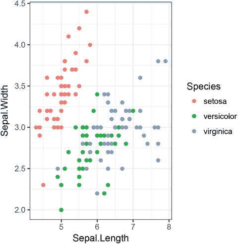

###### 图 7-1。鸢尾萼片长度对萼片宽度的图

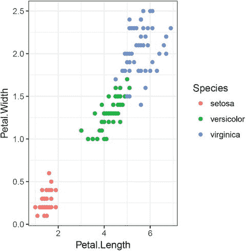

###### 图 7-2。鸢尾花瓣长度对花瓣宽度的曲线图

```r
iris %>% **ggplot**() +
  **geom_point**(**aes**(x = Sepal.Length, y = Sepal.Width, colour = Species))
```

```r
iris %>% **ggplot**() +
  **geom_point**(**aes**(x = Petal.Length, y = Petal.Width, colour = Species))
```

看起来我们确实应该能够区分物种。Setosa 在两个地块上都很突出，但 Versicolor 和 Virginia 在第一个地块上重叠。

由于这是一个如此简单的数据集，而且如果我们只是绘制几个维度，显然是有结构的，这不是我们通常会拿出主成分分析的大炮的情况，但这是主成分分析的一部分，所以我们会。

由于 PCA 只对数值数据起作用，我们需要删除物种参数，但在此之后，我们可以使用 prcomp 函数进行转换:

```r
pca <- iris %>% **select**(-Species) %>% prcomp
pca
## Standard deviations:
## [1] 2.0562689 0.4926162 0.2796596 0.1543862
##
## Rotation:
##                      PC1         PC2         PC3
## Sepal.Length  0.36138659 -0.65658877  0.58202985
## Sepal.Width  -0.08452251 -0.73016143 -0.59791083
## Petal.Length  0.85667061  0.17337266 -0.07623608
## Petal.Width   0.35828920  0.07548102 -0.54583143
##                     PC4
## Sepal.Length  0.3154872
## Sepal.Width  -0.3197231
## Petal.Length -0.4798390
## Petal.Width   0.7536574
```

由此产生的对象包含关于结果的不同信息。标准差告诉我们，每个分量的方差是多少，旋转是什么线性变换。如果我们绘制 pca 对象，我们将会看到每个组件的数据差异有多大，如图 [7-3](#Fig3) 所示。

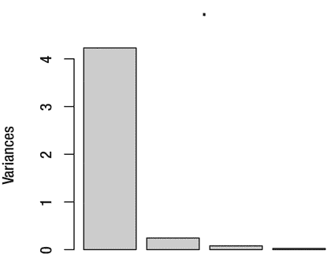

###### 图 7-3。iris 数据集每个主成分的方差图

```r
pca %>% plot
```

进行转换后，您首先要查看的是方差是如何沿组件分布的。如果最初的几个组件没有包含大部分的变化，那么转换对您没有什么帮助。当出现这种情况时，绘制最初的几个组件有望告诉您有关数据的信息。

为了将数据映射到主成分跨越的新空间，我们使用 predict()函数:

```r
mapped_iris <- pca %>% **predict**(iris)
mapped_iris %>% head
##            PC1        PC2         PC3
## [1,] -2.684126 -0.3193972  0.02791483
## [2,] -2.714142  0.1770012  0.21046427
## [3,] -2.888991  0.1449494 -0.01790026
## [4,] -2.745343  0.3182990 -0.03155937
## [5,] -2.728717 -0.3267545 -0.09007924
## [6,] -2.280860 -0.7413304 -0.16867766
##               PC4
## [1,]  0.002262437
## [2,]  0.099026550
## [3,]  0.019968390
## [4,] -0.075575817
## [5,] -0.061258593
## [6,] -0.024200858
```

这也可以用于未用于创建 pca 对象的新数据。在这里，我们只是给它我们以前使用的相同的数据。我们实际上不需要去除物种变量。它将根据列名来判断使用哪个列。我们现在可以绘制前两个组件，如图 [7-4](#Fig4) 所示。


###### 图 7-4。iris 数据集的前两个主成分图

```r
mapped_iris %>%
  as.data.frame %>%
  **cbind**(Species = iris$Species) %>%
  **ggplot**() +
  **geom_point**(**aes**(x = PC1, y = PC2, colour = Species))
```

从 predict()函数返回的 mapped_iris 对象不是数据框，而是矩阵。这不适用于 ggplot()，因此我们需要将它转换回数据框，我们使用 as.data.frame 来完成此操作。由于我们希望根据物种对绘图进行着色，因此我们需要再次添加该信息—记住 pca 对象不知道此因子数据—因此我们使用 cbind()来完成此操作。之后，我们策划。

我们并没有从中获得太多。原始列中的信息与转换后的数据中的信息一样多。但是现在我们已经看到了 PCA 的作用，我们可以在一个更有趣的例子中进行尝试。

我们将查看 mlbench 软件包中的 HouseVotes84 数据:

```r
**library**(mlbench)
**data**(HouseVotes84)
HouseVotes84 %>% head
##        Class   V1 V2 V3   V4   V5 V6 V7 V8 V9 V10
## 1 republican    n  y  n    y    y  y  n  n  n   y
## 2 republican    n  y  n    y    y  y  n  n  n   n
## 3   democrat <NA>  y  y <NA>    y  y  n  n  n   n
## 4   democrat    n  y  y    n <NA>  y  n  n  n   n
## 5   democrat    y  y  y    n    y  y  n  n  n   n
## 6   democrat    n  y  y    n    y  y  n  n  n   n
##    V11  V12 V13 V14 V15  V16
## 1 <NA>    y   y   y   n    y
## 2    n    y   y   y   n <NA>
## 3    y    n   y   y   n    n
## 4    y    n   y   n   n    y
## 5    y <NA>   y   y   y    y
## 6    n    n   y   y   y    y
```

该数据包含共和党和民主党在 16 个不同提案上的投票。投票的类型有“是”、“否”和“缺失/未知”。现在，由于选票不太可能意外丢失，这里的丢失数据意味着有人主动决定不投票，所以它不是真正的丢失。这里面可能也有一些信息。

现在我们可以问一个有趣的问题，共和党人和民主党人的投票模式是否有所不同。我们可以预料到这一点，但是我们能从数据中看到吗？

单独的列是二元的(如果我们认为缺失的数据实际上是信息性的，那么是三元的)，并且在两组之间看起来没有很大的不同，所以在每个单独的列中几乎没有信息。我们可以试着对数据进行主成分分析。

```r
HouseVotes84 %>% **select**(-Class) %>% prcomp
## Error in colMeans(x, na.rm = TRUE): 'x' must be numeric
```

好的，R 抱怨数据不是数字。我们知道 PCA 需要数字数据，但是我们给它因子。我们需要改变这种情况，这样我们就可以试着把选票分成 0 和 1。

我们可以使用 apply()函数。这个函数用于将一个函数应用于一个矩阵，它做什么取决于我们告诉它工作的维度。它可以沿行或沿列汇总数据，但如果我们告诉它在两个维度上工作，即函数的 c(1，2)参数，它会将函数应用于矩阵中的每个元素。要做的转换只是我们给 apply()的一个函数。在这里，您可以使用在别处定义的函数或匿名函数。我使用了一个匿名函数，而不是把它写成函数(x) {...}我用了一个 lambda 表达式:

```r
HouseVotes84 %>%
  **select**(-Class) %>%
  **apply**(**c**(1,2), . %>% { **ifelse**(**as.character**(.) == "n", 0, 1) }) %>%
  prcomp
## Error in svd(x, nu = 0): infinite or missing values in 'x'
```

那也不行，现在的问题是数据缺失。我们将 nay 映射到 0，将 yea 映射到 1，但是缺少的数据仍然缺少。

我们应该总是仔细考虑如何处理丢失的数据，特别是在这种情况下，它实际上可能会提供信息。我们可以采用的一种方法是将每一列转换成三个二进制列，表示投票是投赞成票、反对票还是反对票。

我把它作为一个练习。在这里，我只想说，如果有人弃权，那么他们同样有可能投赞成票或反对票，并将缺失的数据转换为 0.5。

因为我希望以后将数据映射到主成分上，并且因为我不想编写两次数据转换，所以我将它保存在一个变量中，然后执行 PCA:

```r
vote_patterns <- HouseVotes84 %>%
  **select**(-Class) %>%
  **apply**(**c**(1,2), . %>% { **ifelse**(**as.character**(.) == "n", 0, 1) }) %>%
  **apply**(**c**(1,2), . %>% { **ifelse**(**is.na**(.), 0.5, .) })

pca <- vote_patterns %>% prcomp
```

现在我们可以将投票模式映射到主要组件上，并绘制第一个组件与第二个组件的关系，如图 [7-5](#Fig5) 所示。

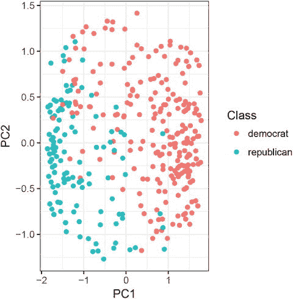

###### 图 7-5。众议院投票数据集的前两个主成分图

```r
mapped_votes <- pca %>% **predict**(vote_patterns)
mapped_votes %>%
  as.data.frame %>%
  **cbind**(Class = HouseVotes84$Class) %>%
  **ggplot**() +
  **geom_point**(**aes**(x = PC1, y = PC2, colour = Class))
```

看起来投票模式明显不同，至少在第一个主成分上是这样。这不是我们能从原始数据中立即看到的。

### 多维排列

有时候，测量物体之间的距离比用数字向量来表示更容易。以字符串为例。你*可以*根据它们的编码将它们翻译成数字，但是可能的字符串的空间是巨大的——如果你不限制它们的长度，空间是无限的——所以这不是一个实用的方法。然而，有许多方法可以衡量两个字符串的不同程度。至少对于字符串来说，定义距离度量比映射成数值更容易。

当我们有一个距离度量时，我们可以将数据表示为一个距离矩阵，一个包含所有成对距离的矩阵。显然，如果您有非常多的数据点，这并不是一个可行的解决方案——数据对的数量与数据点的平方成比例增长——但是对于几千个数据点来说，这不是一个大问题。多维标度采用这样一个所有成对距离的矩阵，并将每个数据点映射到一个线性空间，同时尽可能地保留成对距离。

再次考虑虹膜数据集。当然，对于这个数据集，我们确实有以数字向量表示的数据点，但这是一个我们熟悉的数据集，因此很高兴看到新方法在其上使用。

我们可以使用 dist()函数创建一个距离矩阵:

```r
iris_dist <- iris %>% **select**(-Species) %>% dist
```

为了在二维空间中创建这些距离的表示，我们使用函数 cmdscale()。它需要一个参数 k，指定我们想要放置点的维度。给它一个足够高的 k，它可以完美地保持所有的成对距离，但我们无法将其可视化。我们最好使用低维度，为了绘制数据，我们选择了两个维度。结果是一个矩阵，每个原始数据点占一行，每个维度占一列；这里当然是两个。

```r
mds_iris <- iris_dist %>% **cmdscale**(k=2)
mds_iris %>% head
##           [,1]       [,2]
## [1,] -2.684126  0.3193972
## [2,] -2.714142 -0.1770012
## [3,] -2.888991 -0.1449494
## [4,] -2.745343 -0.3182990
## [5,] -2.728717  0.3267545
## [6,] -2.280860  0.7413304
```

我们可以将这个矩阵转换成一个数据框并绘制出来(见图 [7-6](#Fig6) )。

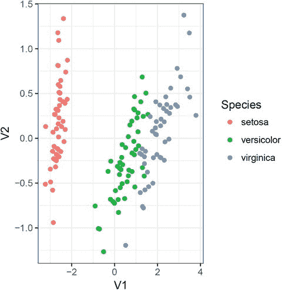

###### 图 7-6。虹膜数据的多维标度图

```r
mds_iris %>%
  as.data.frame %>%
  **cbind**(Species = iris$Species) %>%
  **ggplot**() +
  **geom_point**(**aes**(x = V1, y = V2, colour = Species))
```

该表达式使用名称 V1 和 V2 作为 x 轴和 y 轴。这利用了我们没有提供列名的数据帧将它们命名为 Vn，其中 n 是一个递增的整数。

这个图看起来和前面的 PCA 图本质上是一样的，这不是巧合，只是颠倒了。

我们可以对投票数据做完全相同的事情——在这里，我们可以重用已将因素转换为数字的干净数据——结果如图 [7-7](#Fig7) 所示。


###### 图 7-7。众议院投票数据的多维标度图

```r
mds_votes <- vote_patterns %>% dist %>% **cmdscale**(k = 2)

mds_votes %>%
  as.data.frame %>%
  **cbind**(Class = HouseVotes84$Class) %>%
  **ggplot**() +
  **geom_point**(**aes**(x = V1, y = V2, colour = Class))
```

如果您曾经需要计算字符串之间的距离矩阵，顺便说一下，您可能想看看 stringdist 包。作为说明这一点的例子，我们可以模拟一些字符串。下面的代码首先有一个函数来模拟字母“A”、“C”、“G”和“T”上的随机字符串，然后第二个函数向其中添加一个随机长度。然后，我们使用这些函数创建 10 个字符串:

```r
random_ngram <- function(n)
  **sample**(**c**('A','C','G','T'), size = n, replace = TRUE) %>%
  **paste0**(collapse = "")

random_string <- function(m) {
  n <- **max**(1, m + **sample**(**c**(-1,1), size = 1) * **rgeom**(1, 1/2))
  **random_ngram**(n)
}

strings <- **replicate**(10, **random_string**(5))
```

使用 stringdist 包，我们可以计算所有对的距离矩阵:

```r
**library**(stringdist)
string_dist <- **stringdistmatrix**(strings)
```

我们现在可以在二维空间中绘制字符串，大致保留它们的距离，如图 [7-8](#Fig8) 所示。

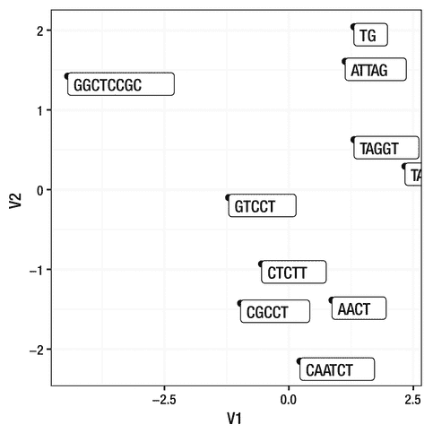

###### 图 7-8。随机字符串的多维约简

```r
string_dist %>%
  **cmdscale**(k = 2) %>%
  as.data.frame %>%
  **cbind**(String = strings) %>%
  **ggplot**(**aes**(x = V1, y = V2)) +
  **geom_point**() +
  **geom_label**(**aes**(label = String),
               hjust = 0, nudge_y = -0.1)
```

## 使聚集

聚类方法寻求发现数据点之间的相似性，并根据这些相似性对数据进行分组。这种集群可以具有或不具有层级结构；当该结构是分层的时，每个数据点将与几个聚类相关联，从更具体到更一般排序，并且当该结构不是分层的时，任何数据点通常仅被分配单个聚类。接下来的部分描述了两种最流行的聚类算法，每种聚类一种。

### k 均值聚类

在 *k* 中——意思是聚类你试图将数据分成 *k* 个聚类，在这里你决定数量 *k* 。数据通常必须是数字向量的形式。严格地说，只要您有办法计算一组数据点的平均值和数据点对之间的距离，这种方法就可以工作。R 函数为*k*-意味着聚类，kmeans，想要数值数据。

该算法基本上是通过首先猜测所提议的聚类的 *k* “中心”来工作的。然后，将每个数据点分配给它最接近的中心，创建数据分组，然后将所有中心移动到其聚类的平均位置。如此重复，直到达到平衡。因为初始中心是随机选择的，所以对函数的不同调用不一定会导致相同的结果。至少，在不同的调用之间，集群的标签是不同的。

让我们看看它的实际效果。我们使用 iris 数据集，并删除“物种”列，以获得一个数值矩阵来提供给函数:

```r
clusters <- iris %>%
  **select**(-Species) %>%
  **kmeans**(centers = 3)
```

我们需要在 kmeans()的参数中指定 *k* ，中心的数量，我们选择三个。我们知道有三个物种，所以这是一个自然的选择。生活并不总是那么简单，但这是显而易见的选择。

该函数返回一个包含分类信息的对象。两个最有趣的信息是中心，可变中心(请原谅这里的拼写差异，这是英国和美国的事情)，以及集群分配，可变集群。

让我们看看中心:

```r
clusters$centers
##   Sepal.Length Sepal.Width Petal.Length
## 1     5.006000    3.428000     1.462000
## 2     6.850000    3.073684     5.742105
## 3     5.901613    2.748387     4.393548
##   Petal.Width
## 1    0.246000
## 2    2.071053
## 3    1.433871
```

这些只是与输入数据点形式相同的向量。它们是我们计算的三个星团的质心。

聚类分配只是一个整数向量，每个数据点都有一个数字，用于指定该数据点被分配到哪个聚类:

```r
clusters$cluster %>% head
## [1] 1 1 1 1 1 1
clusters$cluster %>% table
## .
##  1  2  3
## 50 38 62
```

每个物种有 50 个数据点，所以如果聚类与物种完全匹配，我们应该看到每个聚类也有 50 个数据点。聚类并不完美，但我们可以尝试绘制数据，看看聚类与物种类别的匹配程度。

我们可以首先绘制每个物种有多少数据点被分配给每个聚类(见图 [7-9](#Fig9) )。


###### 图 7-9。三种鸢尾属植物的聚类分析

```r
iris %>%
  **cbind**(Cluster = clusters$cluster) %>%
  **ggplot**() +
  **geom_bar**(**aes**(x = Species, fill = **as.factor**(Cluster)),
           position = "dodge") +
  **scale_fill_discrete**("Cluster")
```

我们首先将 iris 数据集与来自聚类的聚类关联相结合，然后制作柱状图。position 参数为“dodge ”,因此簇分配是相邻绘制的，而不是堆叠在一起。

不出所料，从我们早先绘制的数据来看，Setosa 似乎明显不同于其他两个物种，根据我们现有的至少四个测量结果，这两个物种在特征上有重叠。

这里也涉及到一点运气。kmeans()放置第一个中心的不同起点将影响最终结果，例如，如果它将两个聚类放在 Setosa 数据点的云中，它会将这些点分成两个聚类，并将 Versicolor 和 Virginia 点合并成一个聚类。

直观地检查聚类结果与实际数据点的匹配情况总是一个好主意。我们可以通过绘制各个数据点来做到这一点，并查看分类和聚类的效果。我们可以绘制任何一对特征的点，但是我们已经知道如何将数据映射到主成分上，所以我们可以尝试绘制前两个主成分的数据。正如您所记得的，我们可以使用 predict()函数将四个特征的数据点映射到主成分。这既适用于用于制作 PCA 的原始数据，也适用于我们从 *k* 均值聚类中获得的中心:

```r
pca <- iris %>%
  **select**(-Species) %>%
  prcomp

mapped_iris <- pca %>%
  **predict**(iris)

mapped_centers <- pca %>%
  **predict**(clusters$centers)
```

我们可以将绘制的数据点 PC1 与 PC2 进行对比(见图 [7-10](#Fig10) )。为了显示主要组件和物种信息，我们需要添加一个物种列。我们还需要添加聚类信息，因为这不包括在映射向量中。这是一个数值向量，但是我们希望将其视为分类向量，因此我们需要使用 as.factor()对其进行转换:

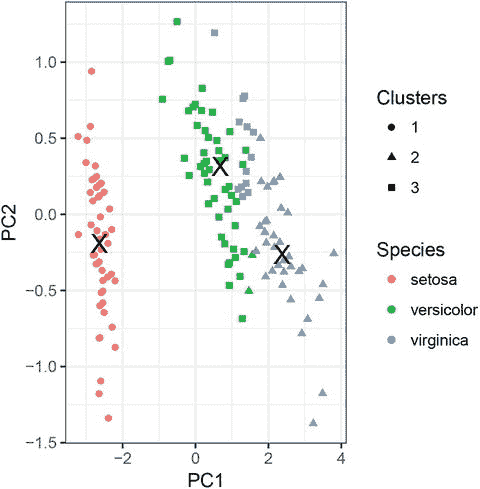

###### 图 7-10。鸢尾属植物的集群和种类

```r
mapped_iris %>%
  as.data.frame %>%
  **cbind**(Species = iris$Species,
        Clusters = **as.factor**(clusters$cluster)) %>%
  **ggplot**() +
  **geom_point**(**aes**(x = PC1, y = PC2,
                   colour = Species, shape = Clusters)) +
  **geom_point**(**aes**(x = PC1, y = PC2),
               size = 5, shape = "X",
             data = **as.data.frame**(mapped_centers))
```

在情节中，我也展示了中心。我使用 geom_point()的数据参数给它这个数据，我将大小设置为 5，将形状设置为“X”。

如前所述，获得这样一个好的集群需要一些运气。第二次运行 kmeans()函数的结果如图 [7-11](#Fig11) 和 [7-12](#Fig12) 所示。

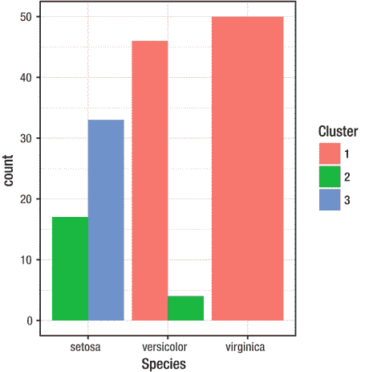

###### 图 7-11。三种鸢尾属植物的错误分类

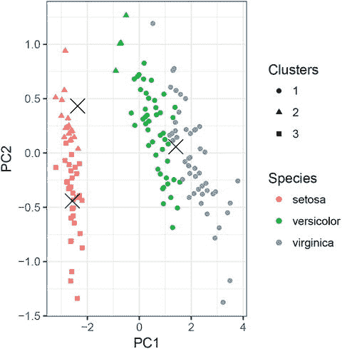

###### 图 7-12。iris 的聚类和种类为不良聚类

如果你回过头来看图 [7-10](#Fig10) ，认为其中一些正方形点比“正方形簇”的中心更靠近“三角形簇”的中心，或者相反，你就对了。不要对此过于不安；这里有两件事是骗人的。一个是轴不在同一标度上，所以沿 x 轴的距离比沿 y 轴的距离更远。第二是用于分组数据点的距离在原始特征的四维空间中，而图是前两个主成分在二维平面上的投影。

然而，关于距离，还是有一些事情需要担心。该算法基于从聚类中心到数据点的距离，但是如果一个轴以厘米为单位，另一个轴以米为单位，则沿一个轴的距离在数值上比沿另一个轴的距离大一百倍。这不仅仅是通过在同一单元中表示所有特征来解决的。首先，这并不总是可能的。没有任何有意义的方法将时间或重量转换成距离。即使是，被测量的内容也与我们考虑的单元相关。一个人的高度可以用米来度量，但是你不希望像细胞大小这样的东西用米来度量。

这也是主成分分析的问题。显然，试图基于数据中的方差创建矢量空间基础的方法会受到输入数据中使用的单位的影响。通常的解决方案是重新缩放所有输入要素，使它们以零为中心，方差为 1。从每个数据点中减去特征的平均值，然后除以标准偏差。这意味着以标准偏差衡量，所有维度都有相同的变化。

prcomp()函数使用参数进行缩放。默认为 TRUE 的参数中心将数据点转换为均值零和参数标度。(请注意。)，默认为 FALSE，缩放数据点以使所有维度的方差为 1。

kmeans()函数不采用这些参数，但您可以使用 scale()函数明确地重新缩放数值数据框。我把这个作为练习。

现在让我们考虑一下聚类是如何更正式地预测物种的。这让我们回到了熟悉的领域:我们可以在物种和集群之间建立一个混淆矩阵。

```r
**table**(iris$Species, clusters$cluster)
##
##               1  2  3
##   setosa     50  0  0
##   versicolor  0  2 48
##   virginica   0 36 14
```

这里的一个问题是，聚类不知道物种，所以即使聚类和物种之间存在一对一的对应，如果聚类和物种处于相同的顺序，混淆矩阵也只会是对角的。

我们可以将每一个物种与其大多数成员所属的集群联系起来。这不是一个完美的解决方案——两个物种可能以这种方式被分配到同一个集群，我们仍然无法构建一个混淆矩阵——但在我们这里考虑的情况下，它对我们有用。我们可以像这样计算在每个物种中看到的每个集群的观察次数:

```r
tbl <- **table**(iris$Species, clusters$cluster)
(counts <- **apply**(tbl, 1, which.max))
##     setosa versicolor  virginica
##          1          3          2
```

建立一个映射聚类种类的表，得到如下混淆矩阵:

```r
map <- **rep**(NA, each = 3)
map[counts] <- **names**(counts)
**table**(iris$Species, map[clusters$cluster])
##
##              setosa versicolor virginica
##   setosa         50          0         0
##   versicolor      0         48         2
##   virginica       0         14        36
```

关于 *k* -means 的最后一句话是这样的:既然 *k* 是一个需要指定的参数，那么如何选择它呢？这里我们知道有三个物种，所以我们也为 *k* 选了三个。但是当我们不知道数据中是否有聚类，或者是否有很多，我们如何选择呢？不幸的是，这个问题没有一个通用的答案。有一些经验法则，但是没有完美的解决方案你可以一直应用。

### 分层聚类

当您拥有数据的距离矩阵时，可以使用分层聚类技术。这里的想法是通过迭代合并集群来构建嵌套集群的树形结构。首先，将每个数据点放入它们自己的单独集群中。然后迭代地找到两个靠近的集群，并将它们合并成一个新的集群。继续这一过程，直到所有数据点都在同一个大型集群中。存在不同的算法，它们主要在如何选择下一个要合并的聚类以及如何计算聚类之间的距离方面有所不同。在 R 中，函数 hclust()实现了几种算法——参数方法决定使用哪一种——我们可以看到它在 iris 数据集上的使用。我们首先需要一个距离矩阵。这一次，我首先对数据进行缩放。

```r
iris_dist <- iris %>% **select**(-Species) %>% scale %>% dist
```

现在，通过在距离矩阵上调用 hclust()来构建聚类。

```r
clustering <- **hclust**(iris_dist)
```

我们可以使用通用 plot()函数绘制结果，如图 [7-13](#Fig13) 所示。使用这个函数无法控制如何显示聚类，但是如果您对绘制树感兴趣，您应该看看 ape 包。

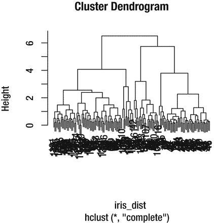

###### 图 7-13。虹膜数据的层次聚类

```r
**plot**(clustering)
```

要创建与 ggplot2 图形配合良好的绘图，您需要 ggdendro 包(见图 [7-14](#Fig14) )。

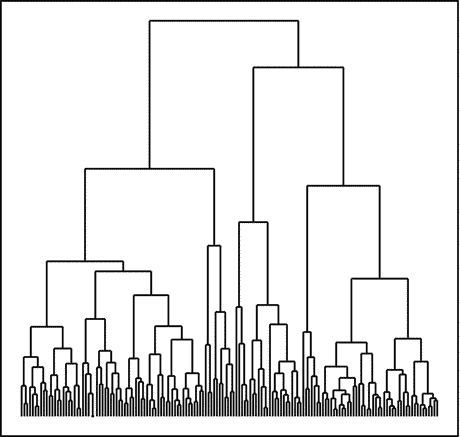

###### 图 7-14。用聚类树绘制的虹膜数据的层次聚类

```r
**library**(ggdendro)
**ggdendrogram**(clustering) + **theme_dendro**()
```

使用 ggdendro，您可以访问原始的绘图段，这使您可以控制树的大部分可视化。

仅仅可视化聚类是不够的，所以为了处理结果，我们需要能够提取实际的分组。cutree()函数——它代表 *cut tree* ,但只有一个*t*——允许您这样做。您可以给它一个参数 h，通过在高度 h 处分割树来将树分割成簇，或者您可以给它一个参数 k，在正好有 k 个簇的级别处分割树。

因为我们正在处理虹膜数据，所以很自然地希望将数据分成三个组:

```r
clusters <- clustering %>% **cutree**(k = 3)
```

结果的格式与我们对 *k* 的格式相同——意味着聚类，也就是说，一个带有整数的向量指定每个数据点属于哪个聚类。既然我们有熟悉格式的信息，我们可以尝试将聚类信息绘制成柱状图(见图 [7-15](#Fig15) ):

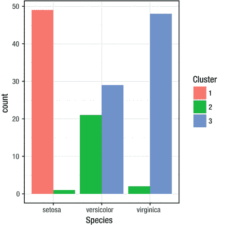

###### 图 7-15。Iris 聚类作为条形图

```r
iris %>%
  **cbind**(Cluster = clusters) %>%
  **ggplot**() +
  **geom_bar**(**aes**(x = Species, fill = **as.factor**(Cluster)),
           position = "dodge") +
  **scale_fill_discrete**("Cluster")
```

或者我们可以将单个地块与物种和集群信息一起绘制(见图 [7-16](#Fig16) )。

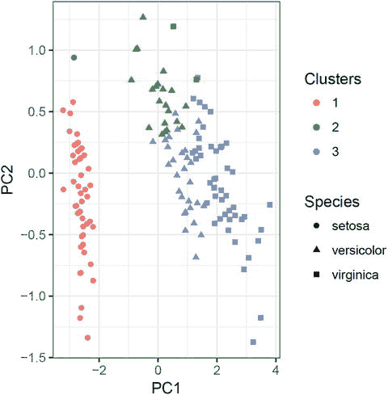

###### 图 7-16。用物种和等级聚类信息绘制的虹膜点

```r
mapped_iris %>%
  as.data.frame %>%
  **cbind**(Species = iris$Species,
        Clusters = **as.factor**(clusters)) %>%
  **ggplot**() +
  **geom_point**(**aes**(x = PC1, y = PC2,
                   shape = Species, colour = Clusters))
```

如果我们想将聚类用于一种分类形式，构建一个混淆矩阵当然也是类似的，但是层次聚类比聚类更不适合分类。使用*k*-表示聚类，很容易获取一个新的数据点，并查看它离哪个聚类中心最近。使用分层聚类，您需要重新构建整个树来查看它的位置。

## 关联规则

我们将看到的最后一种无监督学习方法是针对有序或无序的分类数据的。就像您必须将因子转换成数值数据才能使用 PCA 等方法一样，您也需要将数值数据转换成因子才能使用关联规则。这通常不是问题，您可以使用函数 cut()将一个数字向量分割成一个因子，如果您希望它有序的话，可以用 ordered()将它组合起来。

关联规则根据输入变量和评估规则上的谓词，通过挑选数据的子集 *X* 和 *Y* 来搜索数据中的模式。挑选 *X* 和 *Y* 是一个蛮力选择(这就是为什么你需要把数字向量分成离散的类)。 [<sup class="calibre6">1</sup>](img/#Fn1) 

任何语句都被称为*规则*，算法评估所有规则(至少达到一定规模)以计算出每个规则有多好。

关联规则算法在 arules 包中实现:

```r
**library**(arules)
```

为了查看它的运行情况，我们使用 kernlab 包中的收入数据集:

```r
**library**(kernlab)
**data**(income)
income %>% head
##            INCOME SEX MARITAL.STATUS   AGE
## 1        [75.000-   F        Married 45-54
## 2        [75.000-   M        Married 45-54
## 3        [75.000-   F        Married 25-34
## 4        -10.000)   F         Single 14-17
## 5        -10.000)   F         Single 14-17
## 6 [50.000-75.000)   M        Married 55-64
##                 EDUCATION              OCCUPATION
## 1 1 to 3 years of college               Homemaker
## 2        College graduate               Homemaker
## 3        College graduate Professional/Managerial
## 4          Grades 9 to 11  Student, HS or College
## 5          Grades 9 to 11  Student, HS or College
## 6 1 to 3 years of college                 Retired
##        AREA DUAL.INCOMES HOUSEHOLD.SIZE UNDER18
## 1 10+ years           No          Three    None
## 2 10+ years           No           Five     Two
## 3 10+ years          Yes          Three     One
## 4 10+ years  Not Married           Four     Two
## 5 4-6 years  Not Married           Four     Two
## 6 10+ years           No            Two    None
##   HOUSEHOLDER HOME.TYPE ETHNIC.CLASS LANGUAGE
## 1         Own     House        White     <NA>
## 2         Own     House        White  English
## 3        Rent Apartment        White  English
## 4      Family     House        White  English
## 5      Family     House        White  English
## 6         Own     House        White  English
```

该数据包含收入信息以及几个解释变量，并且已经是 arules 可以处理的形式:所有列都是阶乘。

arules 包中实际上也有相同的数据作为收入数据集，但这里它以不同于数据框的格式表示，因此我们将使用该版本的数据。

```r
**data**(Income)
Income %>% head
## transactions in sparse format with
##  6 transactions (rows) and
##  50 items (columns)
```

为了构建规则，我们使用 apriori()函数。它采用各种参数来控制函数将返回哪些规则，但是我们可以将它与所有默认参数一起使用:

```r
rules <- income %>% apriori
## Apriori
##
## Parameter specification:
##  confidence minval smax arem  aval
##         0.8    0.1    1 none FALSE
##  originalSupport maxtime support minlen maxlen
##             TRUE       5     0.1      1     10
##  target   ext
##   rules FALSE
##
## Algorithmic control:
##  filter tree heap memopt load sort verbose
##     0.1 TRUE TRUE  FALSE TRUE    2    TRUE
##
## Absolute minimum support count: 899
##
## set item appearances ...[0 item(s)] done [0.00s].
## set transactions ...[84 item(s), 8993 transaction(s)] done [0.00s].
## sorting and recoding items ... [42 item(s)] done [0.00s].
## creating transaction tree ... done [0.00s].
## checking subsets of size 1 2 3 4 5 6 done [0.02s].
## writing ... [785 rule(s)] done [0.00s].
## creating S4 object  ... done [0.00s].
```

我们以这种方式创建的规则对象不是像数据框那样的简单对象，但是它将让我们获取它的头部()，并且我们可以使用函数 inspect()来查看各个规则:

```r
rules %>% head %>% **inspect**(linebreak = FALSE)
##     lhs
## [1] {}                                   =>
## [2] {EDUCATION=Grad Study}               =>
## [3] {OCCUPATION=Clerical/Service Worker} =>
## [4] {INCOME=[30.000-40.000)}             =>
## [5] {UNDER18=Two}                        =>
## [6] {INCOME=[50.000-75.000)}             =>
##     rhs                support   confidence
## [1] {LANGUAGE=English} 0.8666741 0.8666741
## [2] {LANGUAGE=English} 0.1000778 0.9316770
## [3] {LANGUAGE=English} 0.1046369 0.8860640
## [4] {LANGUAGE=English} 0.1111976 0.9009009
## [5] {LANGUAGE=English} 0.1073057 0.8405923
## [6] {LANGUAGE=English} 0.1329923 0.9143731
##     lift
## [1] 1.0000000
## [2] 1.0750027
## [3] 1.0223728
## [4] 1.0394921
## [5] 0.9699059
## [6] 1.0550368
```

这里的 linebreak = FALSE 将规则分成几行。我发现要换行就必须将 linebreak 设置为 FALSE，这很令人困惑，但事实就是如此。

每个规则都有一个右侧 rhs 和一个左侧 lhs。对于规则， *X* 是 rhs， *Y* 是 lhs。规则的质量由以下三列来衡量:

*   支持**:***X*和 *Y* 都成立的数据的分数。就当是 Pr( *X* ， *Y* )。

*   置信度**:***X*为真而 *Y* 也为真的次数的分数。就当是 Pr( *Y|X* )。

*   lift **:** 规则比随机规则好多少，也就是说，它比独立的 *X* 和 *Y* 好多少。想想 Pr( *X* ，*Y*)/Pr(*X*)Pr(*Y*)。

好的规则应该有足够高的支持度才会有意思——如果一个规则只影响整个数据中很少的数据点，那么它就没那么重要——所以你希望支持度和可信度都很高。它还应该告诉你比你期望的更多的随机机会，这是由电梯捕获的。

您可以使用 sort()函数根据质量度量重新排列数据:

```r
rules %>% **sort**(by = "lift") %>%
  head %>% **inspect**(linebreak = FALSE)
##     lhs
## [1] {MARITAL.STATUS=Married,OCCUPATION=Professional/Managerial,LANGUAGE=English}
## [2] {MARITAL.STATUS=Married,OCCUPATION=Professional/Managerial}
## [3] {DUAL.INCOMES=No,HOUSEHOLDER=Own}
## [4] {AREA=10+ years,DUAL.INCOMES=Yes,HOME.TYPE=House}
## [5] {DUAL.INCOMES=Yes,HOUSEHOLDER=Own,HOME.TYPE=House,LANGUAGE=English}
## [6] {DUAL.INCOMES=Yes,HOUSEHOLDER=Own,HOME.TYPE=House}
##        rhs                      support
## [1] => {DUAL.INCOMES=Yes}       0.1091960
## [2] => {DUAL.INCOMES=Yes}       0.1176471
## [3] => {MARITAL.STATUS=Married} 0.1016346
## [4] => {MARITAL.STATUS=Married} 0.1003002
## [5] => {MARITAL.STATUS=Married} 0.1098632
## [6] => {MARITAL.STATUS=Married} 0.1209830
##     confidence lift
## [1] 0.8069022  3.281986
## [2] 0.8033409  3.267501
## [3] 0.9713071  2.619965
## [4] 0.9605964  2.591075
## [5] 0.9601555  2.589886
## [6] 0.9594356  2.587944
```

您可以将它与 subset()函数结合使用来过滤规则:

```r
rules %>% **subset**(support > 0.5) %>% **sort**(by = "lift") %>%
  head %>% **inspect**(linebreak = FALSE)
##     lhs
## [1] {ETHNIC.CLASS=White}       =>
## [2] {AREA=10+ years}           =>
## [3] {UNDER18=None}             =>
## [4] {}                         =>
## [5] {DUAL.INCOMES=Not Married} =>
##     rhs                support   confidence
## [1] {LANGUAGE=English} 0.6110308 0.9456204
## [2] {LANGUAGE=English} 0.5098410 0.8847935
## [3] {LANGUAGE=English} 0.5609919 0.8813767
## [4] {LANGUAGE=English} 0.8666741 0.8666741
## [5] {LANGUAGE=English} 0.5207384 0.8611622
##     lift
## [1] 1.0910911
## [2] 1.0209069
## [3] 1.0169644
## [4] 1.0000000
## [5] 0.9936402
```

## 练习

尝试以下练习，以便更好地理解本章中讨论的概念。

### 处理 HouseVotes84 数据中的缺失数据

在 PCA 分析中，我们将缺失数据转化为 0.5。这是为了让事情向前发展，但可能不是一个合适的决定。不投票的人不一定犹豫不决，因此同样可能投赞成票或反对票；可能存在利益冲突或其他原因。所以我们应该把每一列转换成三个二进制列。

您可以使用 dplyr 中的 transmute()函数来添加新列和删除旧列——这有点像打字，因为您必须做 16 次，但这将完成工作。

如果您更想通过编码来摆脱这种转换，那么您应该看看 dplyr 的 mutate_at()函数。您可以将它与列名匹配和多个函数结合起来构建三个二进制向量(对于 ifelse()调用，您必须记住，与 NA 比较总是得到 NA，因此您总是需要首先检查它)。创建新列后，可以使用 select()结合 match()删除旧列。

尝试进行变换，然后再次进行 PCA。有什么变化吗？

### k-均值聚类的重标度

使用 scale()函数重新调整 iris 数据集，然后重新进行*k*-均值聚类分析。

### 变化的 k

使用 kmeans()分析虹膜数据，其中 *k* 的范围为 1 到 10。为每个 *k* 绘制聚类图，根据聚类给数据点着色。

## 项目 1

为了查看实际的数据分析，我使用了我的学生 Dan sndergaard 在我第一年上数据科学课时所做的分析。经他允许，我在这里重做他的分析。

该数据包含从葡萄牙 Vinho Verde 葡萄酒中测得的物理化学特征，目标是尝试从这些测量中预测葡萄酒质量。数据可从 https://archive.ics.uci.edu/ml/datasets/Wine+Quality 获得。

### 导入数据

如果我们转到数据文件夹，我们可以看到数据被分成三个文件。红葡萄酒、白葡萄酒的测量值和数据描述(文件 winequality.names)。为了避免显示大的 URL，我不会列出读取文件的代码，但它是这样的:

```r
**read.table**(URL, header=TRUE, sep=';')
```

有一个描述列的标题，字段由分号分隔，这是我们在查看文件时得到的。

我们将红葡萄酒和白葡萄酒数据加载到称为红葡萄酒和白葡萄酒的独立数据帧中。

我们可以使用以下方法将两个数据帧组合起来:

```r
wines <- **rbind**(**data.frame**(type = "red", red),
               **data.frame**(type = "white", white))
```

然后我们会看到总结:

```r
**summary**(wines)
##     type      fixed.acidity    volatile.acidity
##  red  :1599   Min.   : 3.800   Min.   :0.0800
##  white:4898   1st Qu.: 6.400   1st Qu.:0.2300
##               Median : 7.000   Median :0.2900
##               Mean   : 7.215   Mean   :0.3397
##               3rd Qu.: 7.700   3rd Qu.:0.4000
##               Max.   :15.900   Max.   :1.5800
##   citric.acid     residual.sugar
##  Min.   :0.0000   Min.   : 0.600
##  1st Qu.:0.2500   1st Qu.: 1.800
##  Median :0.3100   Median : 3.000
##  Mean   :0.3186   Mean   : 5.443
##  3rd Qu.:0.3900   3rd Qu.: 8.100
##  Max.   :1.6600   Max.   :65.800
##    chlorides       free.sulfur.dioxide
##  Min.   :0.00900   Min.   :  1.00
##  1st Qu.:0.03800   1st Qu.: 17.00
##  Median :0.04700   Median : 29.00
##  Mean   :0.05603   Mean   : 30.53
##  3rd Qu.:0.06500   3rd Qu.: 41.00
##  Max.   :0.61100   Max.   :289.00
##  total.sulfur.dioxide    density
##  Min.   :  6.0        Min.   :0.9871
##  1st Qu.: 77.0        1st Qu.:0.9923
##  Median :118.0        Median :0.9949
##  Mean   :115.7        Mean   :0.9947
##  3rd Qu.:156.0        3rd Qu.:0.9970
##  Max.   :440.0        Max.   :1.0390
##        pH          sulfates         alcohol
##  Min.   :2.720   Min.   :0.2200   Min.   : 8.00
##  1st Qu.:3.110   1st Qu.:0.4300   1st Qu.: 9.50
##  Median :3.210   Median :0.5100   Median :10.30
##  Mean   :3.219   Mean   :0.5313   Mean   :10.49
##  3rd Qu.:3.320   3rd Qu.:0.6000   3rd Qu.:11.30
##  Max.   :4.010   Max.   :2.0000   Max.   :14.90
##     quality
##  Min.   :3.000
##  1st Qu.:5.000
##  Median :6.000
##  Mean   :5.818
##  3rd Qu.:6.000
##  Max.   :9.000
```

每种葡萄酒有 11 种测量方法，每种葡萄酒都有一个基于感官数据的相关质量分数。至少有三位葡萄酒专家对葡萄酒进行了评判，并给出了 0 到 10 分的评分。没有一款葡萄酒得分低于 3 或高于 9。没有丢失的值。实际上，我们并不想将任何测量结果转化为分类数据。质量分数以离散值的形式给出，但它们是有序的类别，我们不妨暂时把它们看作数值。

### 探索数据

加载完数据后，我们首先要做一些探索性的分析，以获得对它的感觉。

#### 质量分数的分布

丹做的第一件事是观察两种葡萄酒的质量分数分布，如图 [7-17](#Fig17) 所示。

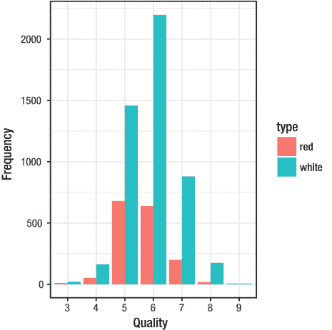

###### 图 7-17。葡萄酒质量的分布

```r
**ggplot**(wines) +
  **geom_bar**(**aes**(x = **factor**(quality), fill = type),
             position = 'dodge') +
  **xlab**('Quality') + **ylab**('Frequency')
```

分数极低或极高的葡萄酒很少。如果我们忽略质量分数是离散的，那么它们看起来也是正态分布的。这可能会使分析更容易。

#### 这酒是红的还是白的？

数据集有两种葡萄酒:红葡萄酒和白葡萄酒。正如丹注意到的，葡萄酒专家通常用非常不同的词语来描述这些类型，但几个实验表明，如果颜色模糊或专家被蒙住眼睛，即使是最好的葡萄酒专家也无法区分红色和白色(见[http://io9.com/wine-tasting-is-bullshit-heres-why-496098276](http://io9.com/wine-tasting-is-bullshit-heres-why-496098276))。因此，观察数据中的物理化学特征是否有助于决定一款葡萄酒是红葡萄酒还是白葡萄酒是一件有趣的事情。

Dan 使用朴素贝叶斯方法对此进行了探索，因此我们需要 e1071 包。

```r
**library**(e1071)
```

他使用了五重交叉验证来研究这个问题，但是我将只使用第 [6](06.html) 章中的 partition()函数。

```r
random_group <- function(n, probs) {
  probs <- probs / **sum**(probs)
  g <- **findInterval**(**seq**(0, 1, length = n), **c**(0, **cumsum**(probs)),
                    rightmost.closed = TRUE)
  **names**(probs)[**sample**(g)]
}

partition <- function(df, n, probs) {
  **replicate**(n, **split**(df, **random_group**(**nrow**(df), probs)), FALSE)
}
```

我将使用我们为汽车编写的预测精度函数的变体，但是使用 wines 和 accuracy()函数而不是 rmse():

```r
accuracy <- function(confusion_matrix)
  **sum**(**diag**(confusion_matrix))/**sum**(confusion_matrix)

prediction_accuracy_wines <- function(test_and_training) {
  result <- **vector**(mode = "numeric",
                   length = **length**(test_and_training))
  for (i in **seq_along**(test_and_training)) {
    training <- test_and_training[[i]]$training
    test <- test_and_training[[i]]$test
    model <- training %>% **naiveBayes**(type ∼ ., data = .)
    predictions <- test %>% **predict**(model, newdata = .)
    targets <- test$type
    confusion_matrix <- **table**(targets, predictions)
    result[i] <- **accuracy**(confusion_matrix)
  }
  result
}
```

当我们将数据随机分成 50/50 的训练数据和测试数据时，我们得到以下准确度:

```r
random_wines <- wines %>%
    **partition**(4, **c**(training = 0.5, test = 0.5))
random_wines %>% prediction_accuracy_wines
## [1] 0.9747615 0.9726070 0.9756848 0.9729147
```

这是一个相当好的准确度，所以这就提出了一个问题，为什么专家不能区分红葡萄酒和白葡萄酒。

丹通过构建一个决策树来确定区分红葡萄酒和白葡萄酒的最重要特征，从而对此进行了研究:

```r
**library**('party')
tree <- **ctree**(type ∼ ., data = wines,
              control = **ctree_control**(minsplit = 4420))
```

树的情节对我来说太大了，以至于我不能在本书中用数字的大小限制来展示它，但是试着自己来描绘它。

他限制了分割的次数，只得到最重要的特征。从树上，我们看到二氧化硫的总量，一种经常添加到葡萄酒中以防止氧化和细菌活动的化合物，可能会破坏葡萄酒，被选为根裂。

二氧化硫也是葡萄酒中自然存在的适量物质。在欧盟，红葡萄酒的二氧化硫含量被限制在 160 ppm，白葡萄酒的二氧化硫含量被限制在 210 ppm，因此根据法律，我们实际上预计这两种葡萄酒中的二氧化硫含量会有显著差异。所以他调查了一下:

```r
wines %>%
  **group_by**(type) %>%
  **summarise**(total.mean = **mean**(total.sulfur.dioxide),
            total.sd = **sd**(total.sulfur.dioxide),
            free.mean = **mean**(free.sulfur.dioxide),
            free.sd = **sd**(free.sulfur.dioxide))
## # A tibble: 2 × 5
##     type total.mean total.sd free.mean  free.sd
##   <fctr>      <dbl>    <dbl>     <dbl>    <dbl>
## 1    red   46.46779 32.89532  15.87492 10.46016
## 2  white  138.36066 42.49806  35.30808 17.00714
```

红葡萄酒中总二氧化硫的平均含量确实较低，因此将这一特征作为树中的一个重要特征是有道理的。如果一款酒的总二氧化硫含量小于等于 67 ppm，我们可以说是一款确定性很高的红酒，这也符合汇总统计。

这棵树的另一个显著特征是易挥发的酸度，也被称为*醋味*。在成品(瓶装)葡萄酒中，高挥发性酸度通常是由恶意的细菌活动引起的，如前所述，这可以通过使用二氧化硫来限制。因此，我们期望这些特征之间有很强的联系(见图 [7-18](#Fig18) )。

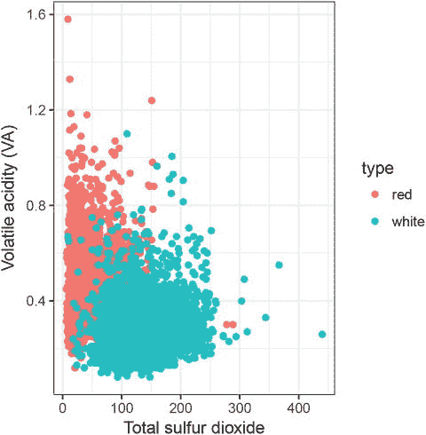

###### 图 7-18。二氧化硫与挥发性酸度

```r
**qplot**(total.sulfur.dioxide, volatile.acidity, data=wines,
      color = type,
      xlab = 'Total sulfur dioxide',
      ylab = 'Volatile acidity (VA)')
```

该图显示了挥发性酸度的量作为二氧化硫量的函数。它还表明，特别是对于红葡萄酒，二氧化硫含量高的葡萄酒的挥发性酸度较低。白葡萄酒的模式并不清晰。然而，丹观察到，正如你在图中清楚看到的，当综合考虑总二氧化硫和挥发性酸度特征时，红葡萄酒和白葡萄酒之间有明显的区别。

那么为什么人类尝不出红酒和白酒的区别呢？事实证明，二氧化硫在低于 50 ppm 的游离浓度下是无法被人类检测到的。虽然两种葡萄酒的二氧化硫总量差异非常显著，但游离量平均低于检测阈值，因此人类无法用它来区分红葡萄酒和白葡萄酒。

```r
wines %>%
  **group_by**(type) %>%
  **summarise**(mean = **mean**(volatile.acidity),
            sd = **sd**(volatile.acidity))
## # A tibble: 2 × 3
##     type      mean        sd
##   <fctr>     <dbl>     <dbl>
## 1    red 0.5278205 0.1790597
## 2  white 0.2782411 0.1007945
```

同样，乙酸(导致挥发性酸度)的检测阈值为 0.7 克/升，我们再次看到平均含量低于该阈值，因此人类味蕾无法检测到。

因此，丹得出结论，我们发现的区分葡萄酒类型的一些最重要的特征只出现在人类无法品尝的少量葡萄酒中。

## 拟合模型

不管我们是否能区分红葡萄酒和白葡萄酒，我们想探索的真正问题是，测量是否能让我们预测质量。一些测量可能低于人类的品尝能力，但质量是基于人类的品尝者，所以我们可以根据测量来预测质量吗？

然而，在我们建立模型之前，我们需要一些东西来比较准确性，以此作为我们的零模型。如果我们没有比一个简单化的模型做得更好，那么模型的构建是不值得的。

当然，首先，我们需要决定我们是否要预测类别的精确质量，或者我们是否认为这是一个回归问题。Dan 研究了这两个选项，但是由于我们更应该把质量作为一个数字来看，所以我将只研究后者。

对于回归，质量测量应该是均方根误差，我们能想到的最简单的模型就是预测所有葡萄酒的平均质量。

```r
rmse <- function(x,t) **sqrt**(**mean**(**sum**((t - x)^2)))

null_prediction <- function(df) {
    **rep**(**mean**(wines$quality), each = **nrow**(df))
}

**rmse**(**null_prediction**(wines), wines$quality)
## [1] 70.38242
```

这是我们必须击败任何值得考虑的模式。

不过，我们确实希望将模型与训练和测试数据集进行比较，所以不要使用整个数据的平均值。所以我们需要一个函数来比较分割数据的结果。

为了使用 rmse()作为质量度量来比较不同的模型，我们需要修改我们的预测精度函数。我们可以将用于创建预测模型的函数作为参数提供给它。它可能看起来像这样:

```r
prediction_accuracy_wines <- function(test_and_training,
                                      model_function) {
  result <- **vector**(mode = "numeric",
                   length = **length**(test_and_training))
  for (i in **seq_along**(test_and_training)) {
    training <- test_and_training[[i]]$training
    test <- test_and_training[[i]]$test
    model <- training %>% **model_function**(quality ∼ ., data = .)
    predictions <- test %>% **predict**(model, newdata = .)
    targets <- test$quality
    result[i] <- **rmse**(predictions, targets)
  }
  result
}
```

在这里，我们硬连线公式，以包括除质量以外的所有变量，这可能会导致过度拟合，但我们现在不担心这一点。

要做到这一点，我们需要一个 model_function()来返回一个使用 predict()的对象。要做到这一点，我们需要使用通用函数，这一点我们要到第 10 章才会谈到，但它主要涉及创建一个“类”并定义 predict()将对该类的对象做什么。

```r
null_model <- function(formula, data) {
    **structure**(**list**(mean = **mean**(data$quality)),
              class = "null_model")
}

predict.null_model <- function(model, newdata) {
    **rep**(model$mean, each = **nrow**(newdata))
}
```

这个 null_model()函数创建一个 null_model 类的对象，并定义 predict()函数应该对这个类的对象做什么。我们可以用它来测试空模型在数据上的表现:

```r
test_and_training <- wines %>%
    **partition**(4, **c**(training = 0.5, test = 0.5))
test_and_training %>% **prediction_accuracy_wines**(null_model)
## [1] 49.77236 50.16679 50.11079 49.59682
```

不要对这些数字比我们使用整个数据集得到的数字好太多感到困惑。这只是因为如果有更多的数据，rmse()函数将总是给出更大的值，而我们给它的数据只有我们查看整个数据集时的一半。

相反，我们可以将其与简单的线性模型进行比较:

```r
test_and_training %>% **prediction_accuracy_wines**(lm)
## [1] 42.30591 41.96099 41.72510 41.61227
```

Dan 也尝试了不同的模型来测试预测的准确性，但是我把它作为一个练习。

## 练习

尝试以下练习，以便更好地理解本章中讨论的概念。

### 探索其他公式

prediction_accuracy_wines()函数使用公式 quality。使用了所有的解释变量。使用所有变量会导致过度拟合，因此使用较少的变量可能会对测试数据产生更好的结果。为公式的函数添加一个参数，并使用不同的公式进行探索。

### 探索不同的模式

尝试使用不同于空模型和线性模型的模型。任何可以进行回归并定义了 predict()函数的模型都应该是适用的。试试看。

### 分析您自己的数据集

找到一个你有兴趣研究的数据集，然后去做。为了学习如何解释数据，你必须在值得探索的事情上运用你的直觉，而建立这种直觉的唯一方法就是分析数据。

# 脚注

[1](#Fn1_source) 算法*可以*通过考虑两个输入值之间的每一点来为你做这件事，但它没有，所以你必须打破数据。