# 十、神经网络框架

在本节中，我们将了解如何用 Wolfram 语言训练神经网络模型，如何访问结果，以及训练好的网络。我们将回顾导出和导入网络模型的基本命令。我们以 Wolfram 神经网络库的探索和 LeNet 网络模型的回顾结束这一章。

## 训练神经网络

Wolfram 语言包含一个非常有用的命令，可以自动完成训练神经网络模型的过程。这个命令是 NetTrain。训练神经网络包括微调神经网络的内部参数。这样做的全部意义在于，参数可以在训练过程中学习。这个一般的过程是通过一种叫做梯度下降的优化算法来完成的。这又是用反向传播算法计算的。

### 数据输入

使用 NetTrain，可以不同的形式输入数据。首先，网络模型作为第一个参数，然后是输入→目标，{输入，...}→{目标，...}或数据或数据集的名称。一旦定义了网络模型，下一个参数就是数据，后面是可选的参数 All。选项 All 将创建一个 NetTrainResultsObject，用于在计算后显示 NetTrain 结果面板，并存储有关已训练模型的所有相关信息。用于训练模型的选项作为最后的参数输入。NetTrain 中提供了层和容器中使用的常用选项。

在下一个例子中，我们将使用感知器模型来构建一个线性分类器。待分类的数据如下图所示(图 [10-1](#Fig1) )。

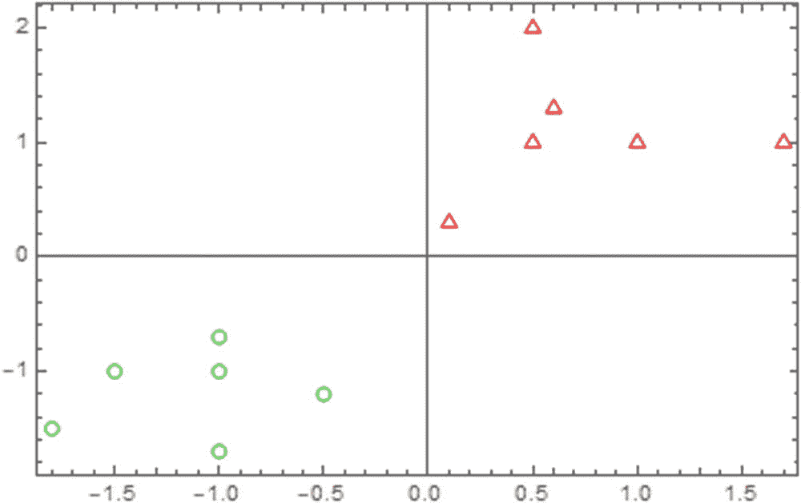

图 10-1

显示两个不同绘图点的列表图

```py
In[1]:=
Plt=ListPlot[{{{-1.8,-1.5},{-1,-1.7},{-1.5,-1},{-1,-1},{-0.5,-1.2},{-1,-0.7}},{{1,1},{1.7,1},{0.5,2},{0.1,0.3},{0.5,1},{0.6,1.3}}},PlotMarkers→"OpenMarkers",Frame→True,PlotStyle→{Green,Red}]
Out[1]=

```

让我们定义数据、目标值和训练数据。

```py
In[2]
Data={{-1.8,-1.5},{-1,-1.7},{-1.5,-1},{-1,-1},{-0.5,-1.2},{-1,-0.7},{1,1},{1.7,1},{0.5,2},{0.1,0.3},{0.5,1},{0.6,1.3}};
Target={-1,-1,-1,-1,-1,-1,1,1,1,1,1,1};
TrainData=MapThread[#1→ {#2}&,{Standardize[Data],Target},1];

```

接下来让我们定义网络模型。

```py
In[3]:= Model=NetChain[{LinearLayer[1,"Input"→ 2],ElementwiseLayer[Ramp[#]&]}];

```

### 培训阶段

准备好数据和模型后，我们开始训练模型。训练开始后，会出现一个进度信息面板，显示四个主要结果。

1.  汇总:包含有关批、轮次和时间费率的相关信息

2.  数据:涉及经过处理的数据信息

3.  方法:显示所用的方法、批量和用于培训的设备

4.  Round:损失值的当前状态

```py
In[4]:= Net=NetTrain[Model,TrainData,All,LearningRate→0.01,PerformanceGoal→"TrainingSpeed",TrainingProgressReporting→"Panel",TargetDevice→"CPU",RandomSeeding→88888,WorkingPrecision→"Real64"]
Out[4]=

```

图 [10-2](#Fig2) 显示了训练回合的损失图。Adam 优化器是随机梯度下降的一种变体，我们将在后面看到。生成的对象被称为 NetTrainResultsObject(图 [10-2](#Fig2) )。

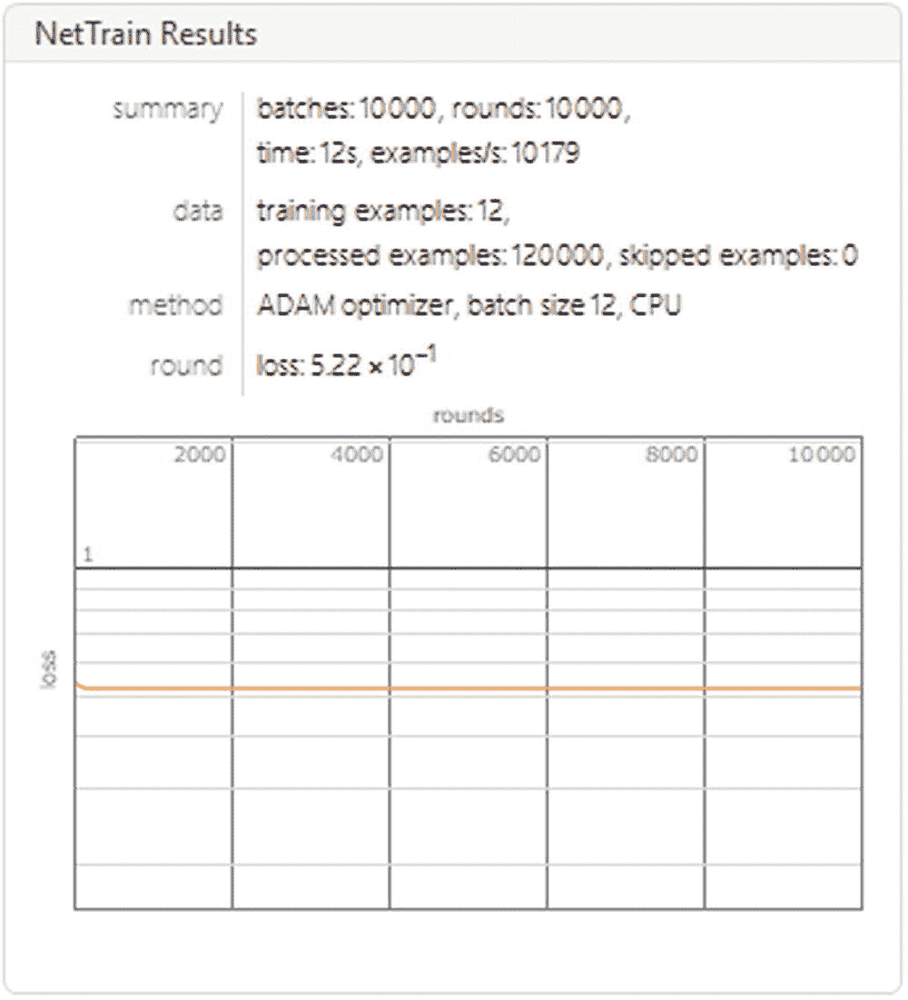

图 10-2

NetTrainResultsObject

### 模型实现

一旦训练完成，得到训练好的网络和模型实现如图 [10-3](#Fig3) 所示。


图 10-3

提取的训练网络

```py
In[5]:= TrainedNet1=Net["TrainedNet"]
Out[5]=

```

现在让我们看看训练好的网络如何通过用密度图绘制边界来识别每个点(图 [10-4](#Fig4) )。


图 10-5

网络 2 的培训结果

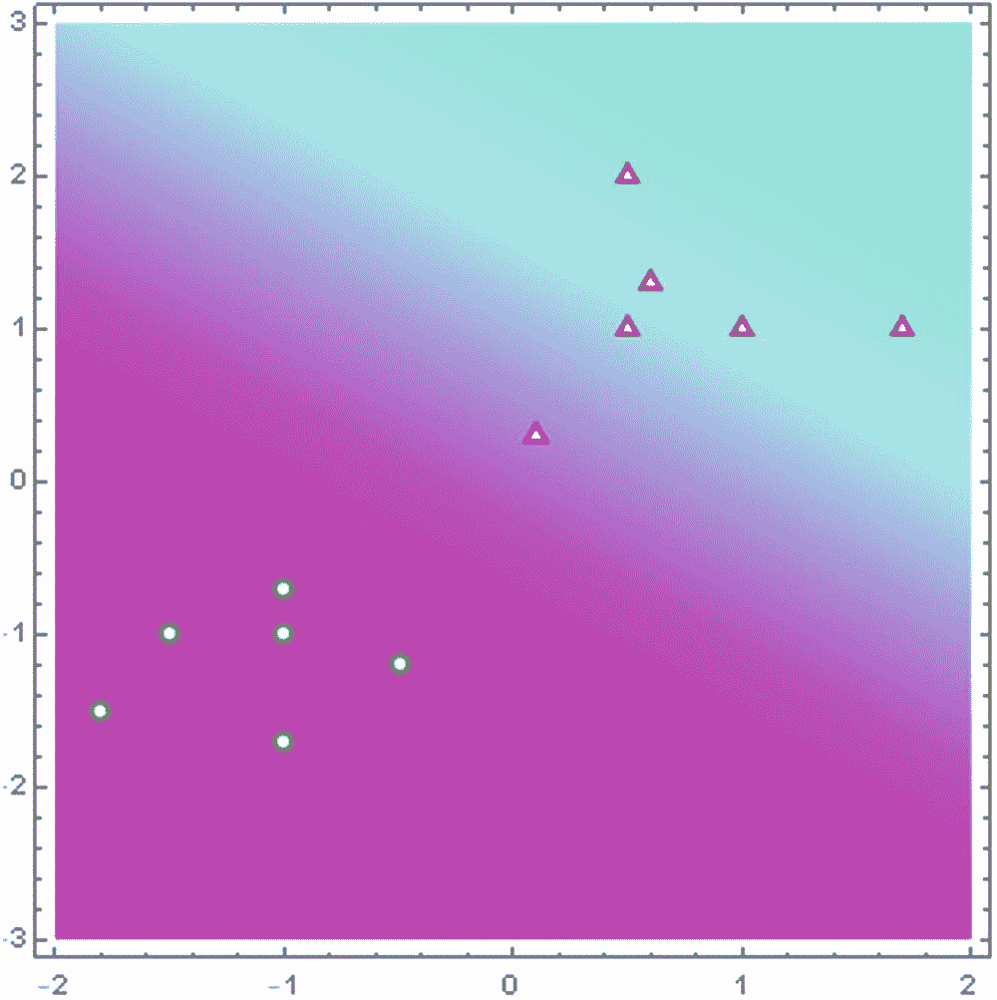

图 10-4

净分类图

```py
In[6]:= Show[DensityPlot[TrainedNet1[{x,y}],{x,-2,2},{y,-3,3},PlotPoints→50,ColorFunction→(RGBColor[1-#,2*#,1]&)],Plt]
Out[6]=

```

从图中可以看出，边界没有很好地定义，接近零的点可能被错误分类。这是因为如果 ramp 函数接收到任何负数，它给出 0，但是对于任何正值，它返回该值。我们可以看到，这个模型仍然可以通过将激活函数改为双曲正切来改进，以具有稳健的边界。

### 批量和轮次

如果没有指明批量大小，它将有一个自动值，几乎总是值 64 或 2 的幂。请记住，批量大小表示在更新模型的内部参数之前，模型在训练中使用的示例数量。批次数量是训练数据集中的示例除以批次的大小。已处理的示例是回合数(时期数)乘以训练示例数。一般来说，选择批量大小是为了平均划分训练集的大小。

MaxTrainingRounds 选项决定了在训练阶段通过训练数据集的次数。当你浏览整个训练集一次，它被称为一个纪元。为了更好地理解这一点，在前面的示例中。自动选择的批量大小为 12，等于训练集中的示例数。这意味着对于 epoch 或 round，输入一批，12/12 -> 1。现在历元的数量被自动选择为 10000，这告诉我们将会有 1 * 10000 个批次。此外，处理的示例数将是 12 * (10000)，等于 120000。如果批次大小没有平均划分训练集，这意味着最终批次将比其他批次具有更少的示例。此外，向容器添加损失函数层或使用选项 LossFunction ->“损失层”添加损失具有相同的效果。在这种情况下，我们将使用 MeanSquaredLossLayer 作为损失函数选项，并将激活函数更改为 Tanh[x]。并设置 Batchsize -> 5 和 MaxTrainingRounds -> 1000。

```py
In[7]:= Net2=NetTrain[NetChain[{
LinearLayer[1,"Input"-> 2],ElementwiseLayer[Tanh[#]&]}],TrainData,All,LearningRate->0.01,PerformanceGoal->"TrainingSpeed",TrainingProgressReporting->"Panel",TargetDevice->"CPU",RandomSeeding->88888,WorkingPrecision->"Real64",LossFunction->MeanSquaredLossLayer[],BatchSize->5,MaxTrainingRounds->1000]
Out[7]=

```

我们看到损失已经大大下降(图 [10-5](#Fig5) )。让我们看看分类是怎样的。

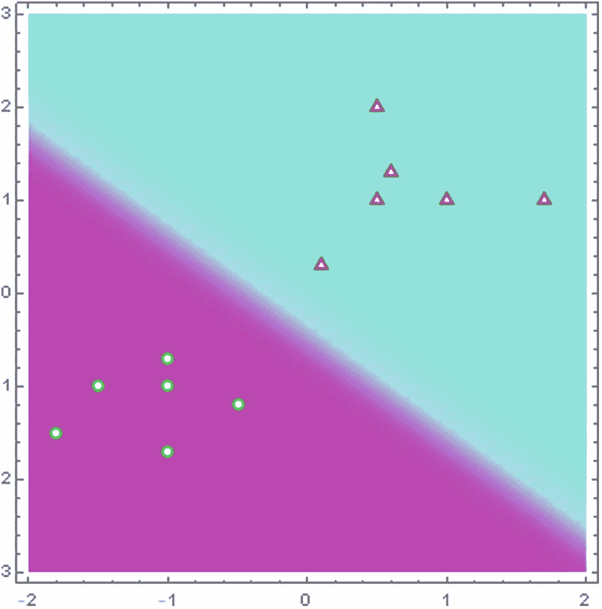

图 10-6

网络 2 分类图

```py
In[8]:= TrainedNet2=Net2["TrainedNet"];
Show[DensityPlot[TrainedNet2[{x,y}],{x,-2,2},{y,-3,3},PlotPoints->50,ColorFunction->(RGBColor[1-#,2*#,1]&)],Plt]
Out[8]=

```

我们可以看到这两个边界是如何更好地表示的(图 [10-6](#Fig6) )。先前的模型表示线性层的预测，其中该分类与目标进行比较，使得误差越来越小。

为了获得根据训练中进行的回合数显示误差值的图形，我们通过训练网络的属性来完成。我们还可以看到添加损失函数后网络模型的样子。

```py
In[9]:= Dataset[{Association["LossPlot"-> Net2["LossPlot"]],Association["NetGraph"-> Net2["TrainingNet"]]}]
Out[9]=

```

在图 [10-7](#Fig7) 中，我们可以看到损失随着回合数的增加而迅速减少。要查看用于训练的网络，请执行下面的代码。Mathematica 根据模型的层自动将损失函数添加到神经网络中(图 [10-8](#Fig8) )。

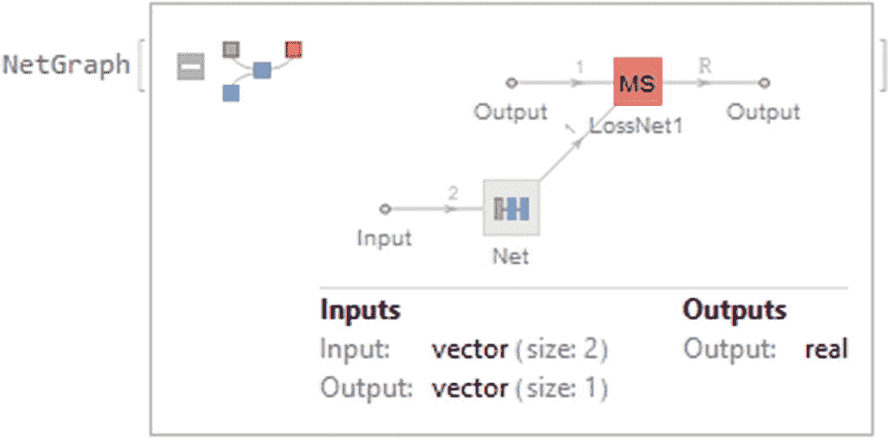

图 10-8

训练阶段前的网络模型

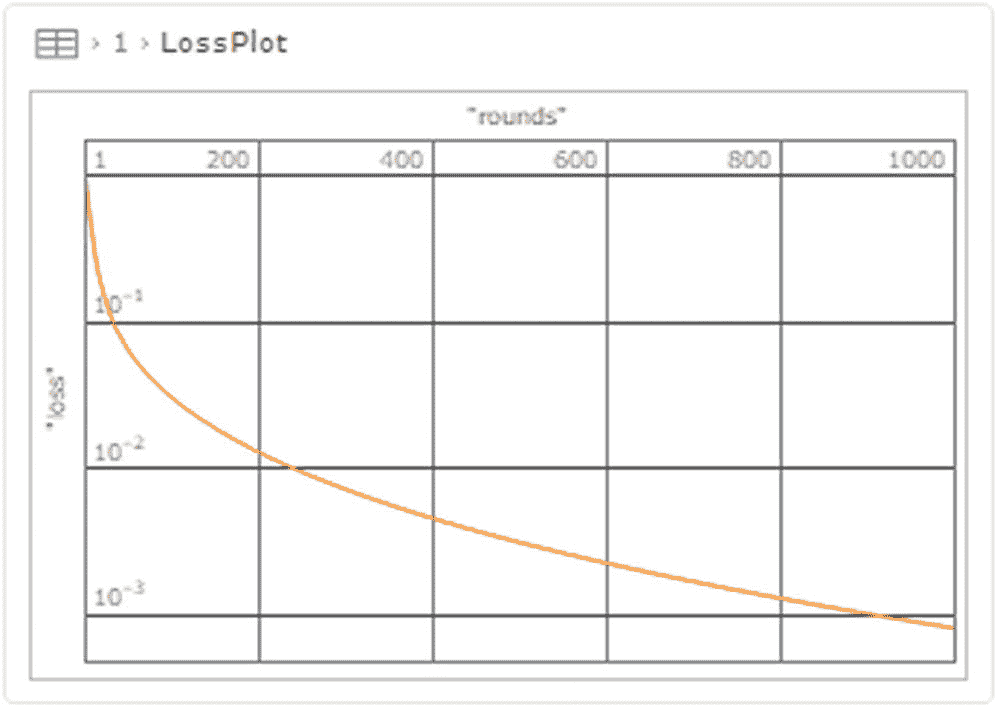

图 10-7

数据集中包含的损耗图

```py
In[10]:= Net2["TrainingNet"]
Out[10]=

```

为了查看模型的所有属性，我们添加了字符串属性作为参数。

```py
In[11]:= Net2["Properties"]
Out[11]= {ArraysLearningRateMultipliers,BatchesPerRound,BatchLossList,BatchMeasurements,BatchMeasurementsLists,BatchSize,BestValidationRound,CheckpointingFiles,ExamplesProcessed,FinalLearningRate,FinalPlots,InitialLearningRate,InternalVersionNumber,LossPlot,MeanBatchesPerSecond,MeanExamplesPerSecond,NetTrainInputForm,OptimizationMethod,ReasonTrainingStopped,RoundLoss,RoundLossList,RoundMeasurements,RoundMeasurementsLists,RoundPositions,SkippedTrainingData,TargetDevice,TotalBatches,TotalRounds,TotalTrainingTime,TrainedNet,TrainingExamples,TrainingNet,TrainingUpdateSchedule,ValidationExamples,ValidationLoss,ValidationLossList,ValidationMeasurements,ValidationMeasurementsLists,ValidationPositions}

```

### 训练方法

让我们用 OptimizationMethod 来看看前面网络的训练方法。梯度下降算法有多种变体，与术语“批量大小”相关。第一个是随机梯度下降(SGD)。SGD 在进行下一步之前，一次只进行一个训练批次。该算法以随机形式遍历训练示例，也就是说，没有顺序模式，一次只遍历一个示例。

第二个变体是批量梯度下降，这意味着批量大小被设置为训练集的大小。这种方法利用所有的训练样本，并且只对内部参数进行一次更新。

第三种变体是小批量梯度下降，其包括将训练集分成小于整个数据集的分区，以便频繁更新模型的内部参数，从而实现收敛。要查看 SGD 和小批量 SGD 的数学模型，请访问、、陈玉强和 Alexander J. Smola 的文章“随机优化的高效小批量训练”(2014 年 8 月:第 661-670 页；在第 20 届 ACM SIGKDD 知识发现和数据挖掘国际会议的会议记录中。

```py
In[12]:= Net2["OptimizationMethod"]
Out[12]= {ADAM,Beta1->0.9,Beta2->0.999,Epsilon->1/100000,GradientClipping->None,L2Regularization->None,LearningRate->0.01,LearningRateSchedule->None,WeightClipping->None}

```

自动选择的方法是 ADAM 优化器，它使用 SGD 方法，使用自适应的学习速率。其他可用的方法有 RMSProp、SGD 和 SignSGD。在可用的方法中，还有指示学习速率、何时缩放、何时使用 L2 正则化、梯度和权重裁剪的选项。

### 衡量绩效

除了方法之外，我们还可以确定在培训阶段要考虑哪些措施。这些选项取决于所使用的损失函数的类型，并且与任务的类型内在相关，如分类、回归、聚类等。对于 MeanSquaredLossLayer 或 MeanAbsoluteLossLayer，常见的选项是 MeanDeviation，即残差平均值的绝对值。MeanSquare 是残差的均方，RSquared 是决定系数，标准差是残差的均方根。培训完成后，测量将出现在净结果中(图 [10-9](#Fig9) )。


图 10-9

添加新指标后的净结果

```py
In[13]:= Net3=NetTrain[NetChain[{LinearLayer[1,"Input"-> 2],ElementwiseLayer["SoftSign"]}],TrainData,All,LearningRate->0.01,PerformanceGoal->"TrainingSpeed",TrainingProgressReporting->"Panel",TargetDevice->"CPU",RandomSeeding->88888,WorkingPrecision->"Real64",
Method->"ADAM",LossFunction->MeanSquaredLossLayer[],BatchSize->5,MaxTrainingRounds->1000,TrainingProgressMeasurements->{"MeanDeviation","MeanSquare","RSquared","StandardDeviation"} ]
Out[13]=

```

### 模型评估

要访问所选度量的值，请使用 NetResultsObject。对于训练集值，可以在 RoundLoss(给出损失的平均值)、RoundLossList(返回训练期间损失的平均值)、RoundMeasurements(最后一轮训练的测量值)和 RoundMeasurementsLists(每轮的指定测量值)的属性中找到这些值。这在图 [10-10](#Fig10) 中进行了描述。

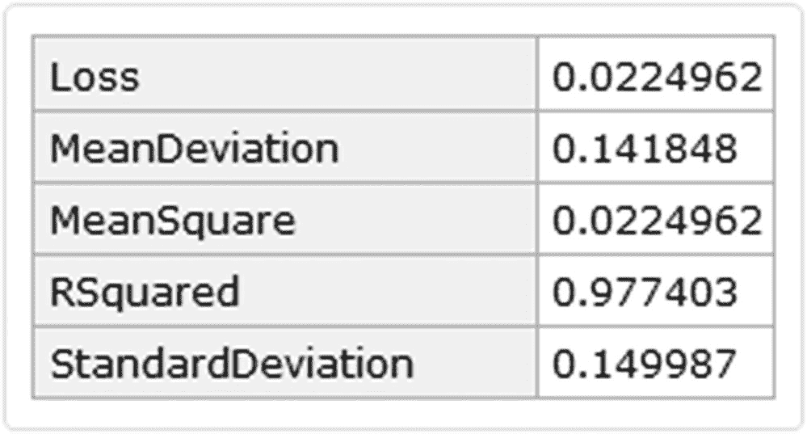

图 10-10

具有新测量值的数据集

```py
In[14]:= Net3[#]&/@{"RoundMeasurements"}//Dataset[#]&
Out[14]=

```

使用 FinalPlots 选项获取所有图。

```py
In[15]:= Net3["FinalPlots"]//Dataset;

```

要复制测量图，请使用 RoundMeasurementsLists 提取每一轮的测量值。

```py
In[16]:=Measures=Net3[#]&/@{"RoundMeasurementsLists"};
Keys[Measures]
Out[16]= {{Loss,MeanDeviation,MeanSquare,RSquared,StandardDeviation}}

```

让我们画出每一轮的值，从损失开始，以标准差结束。我们还可以看到网络模型是如何做出分类边界的(图 [10-11](#Fig11) )。

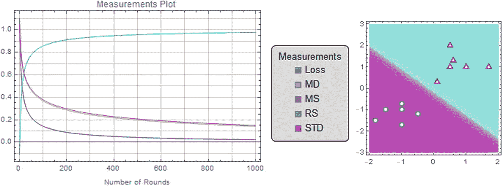

图 10-11

圆形测量图和密度图

```py
In[17]:=
TrainedNet3=Net3["TrainedNet"];
Grid[{{ListLinePlot[{Measures[[1,1]](*Loss*),Measures[[1,2]](*MeanDeviation*),Measures[[1,3]](*MeanSquare*),Measures[[1,4]](*RSquared*),Measures[[1,5]](*StandardDeviation*)},PlotStyle->Table[ColorData[101,i],{i,1,5}],Frame->True,FrameLabel->{"Number of Rounds",None},PlotLabel->"Measurements Plot",GridLines->All,
wPlotLegends->SwatchLegend[{Style["Loss",#],Style["MD",#],Style["MS",#],Style["RS",#],Style["STD",#]},LegendLabel->Style["Measurements",#],LegendFunction->(Framed[#,RoundingRadius->5,Background->LightGray]&)],ImageSize->Medium]&[Black],Show[DensityPlot[TrainedNet3[{x,y}],{x,-2,2},{y,-3,3},PlotPoints->50,ColorFunction->(RGBColor[1-#,2*#,1]&)],Plt,ImageSize-> 200]}}]
Out[17]=

```

Loss 和 MeanSquared 具有相同的值，这就是两个图形重叠的原因。在平均偏差和标准偏差的情况下，它们具有相似的值，但不相同。注意，我们构建了三个模型，在每个过程中改变激活函数。查看这些图，我们可以看到每个函数如何改变神经网络模型从训练数据中学习的方式。

在前面的例子中，显示的图形是训练过程的损失图。在下一节中，我们将了解如何在训练阶段绘制损失图和验证图，以验证网络模型在训练期间确实在学习，以及该模型在以前从未见过的数据(验证集)中的表现如何。

### 导出神经网络

一旦一个网络模型被训练，我们就可以将这个训练好的网络导出到一个 WLNet 格式，这样将来就可以使用这个网络而不需要训练。导出方法也适用于未初始化的网络架构。

```py
In[18]:=Export["C:\\Users\\My-pc\\Desktop\\TrainedNet3.wlnet",Net3["TrainedNet"]]
Out[18]= C:\Users\My-pc\Desktop\TrainedNEt.wlnet

```

将它们导入回来的操作与任何其他文件完全一样，但是可以指定导入的元素。Net 导入 net 模型和所有初始化的数组；对于线性图层的数值数组对象，取消初始化 Net 和 ArrayList 导入；ArrayAssociation 以关联形式为数值数组导入，WLVersion 用于查看用于构建网络的 Wolfram 语言的版本。所有选项都显示在下一个数据集中(图 [10-12](#Fig12) )。

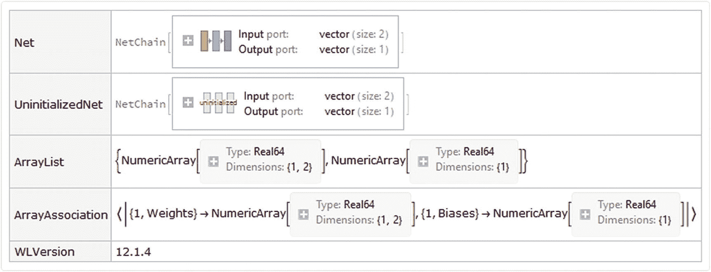

图 10-12

具有可用导入选项的数据集

```py
In[19]:= Dataset@ AssociationMap[Import["C:\\Users\\My-pc\\Desktop\\TrainedNet3.wlnet",#]&,{"Net","UninitializedNet","ArrayList","ArrayAssociation","WLVersion"}]
Out[19]=

```

## Wolfram 神经网络知识库

Wolfram 神经网络知识库是一个免费访问的网站，包含各种预先训练的神经网络模型。模型根据它们接收的输入类型和数据类型进行分类，无论是音频、图像、数字数组还是文本。此外，他们还根据他们执行的任务类型进行分类，从音频分析或回归到分类。网站主页如图 [10-13](#Fig13) 所示。

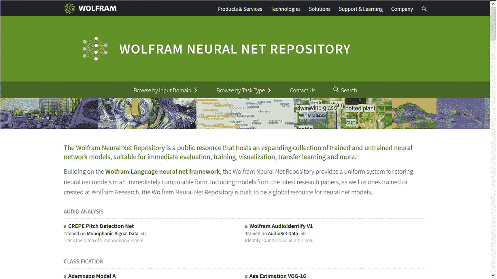

图 10-13

Wolfram 神经网络知识库主页

要访问网页，请在您最喜欢的浏览器中输入以下 url， [`https://resources.wolframcloud.com/NeuralNetRepository/`](https://resources.wolframcloud.com/NeuralNetRepository/) 或从 Mathematica 运行 SystemOpen，这将在系统的默认浏览器中打开网页。

```py
In[20]:=SystemOpen["https://resources.wolframcloud.com/NeuralNetRepository/"];

```

一旦加载了站点，就可以通过输入或任务来浏览网络模型。这个库中的模型是用 Wolfram 语言构建的，这允许我们在 Mathematica 中使用它们。这导致模型以一种可以从 Mathematica 或 Wolfram Cloud 访问的形式被发现，以便迅速执行。如果我们向下滚动，我们会看到模型是按名称和用于训练的数据以及简短描述来构建的。例如，Wolfram AudioIdentify V1 网络就是这种情况，该网络使用 AudioSet 数据进行训练，并识别音频信号中的声音。要浏览类别，我们可以从菜单中选择类别。图 [10-14](#Fig14) 显示了选择输入类别后网站的样子——在这种情况下，神经网络接收图像作为输入。


图 10-14

基于输入图像的类别

### 选择神经网络模型

一旦选择了一个类别，它将显示与所选输入类别相关的所有网络模型。就像 Wolfram 数据仓库一样，一旦选择了模型，它将显示相关信息，如图 [10-15](#Fig15) 所示，其中选择的网络模型是神经网络 Wolfram ImageIdentify Net V1。

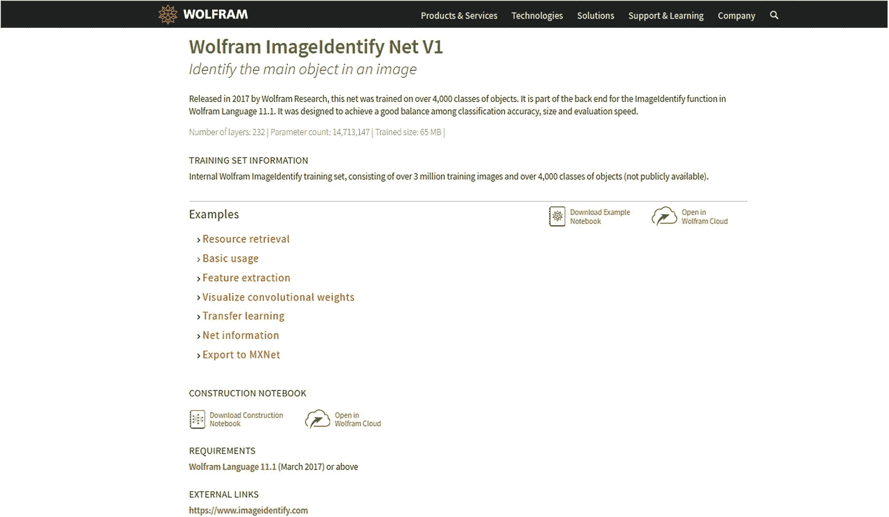

图 10-15

沃尔夫拉姆图像识别网 V1

可以从网站导航并下载包含网络模型的笔记本，但也可以从 Mathematica 下载。换句话说，通过 ResourceSearch 搜索网络模型。如果我们想知道包含单词 image 的网络的模型，这个例子显示了搜索。

```py
In[21]:= ResourceSearch[{"Name"-> "Image","ResourceType"->"NeuralNet"}]//Dataset[#,MaxItems->{4,3}]&
Out[21]=

```

图像中显示的数据集(图 [10-16](#Fig16) )由于显示原因只有三列，但是使用滑块可以浏览整个数据集。图像中未显示的列是描述、位置和文档链接。最后一列提供了指向 web 模型页面的链接。


图 10-16

资源数据集

### 访问 Mathematica 内部

要访问模型架构，需要添加 object 参数。例如，对于 Wolfram ImageIdentify Net V1 网络(图 [10-17](#Fig17) ，执行以下操作。


图 10-17

Wolfram ImageIdentify Net V1 资源

```py
In[22]:= ResourceSearch[{"Name"-> "Wolfram ImageIdentify","ResourceType"-> "NeuralNet"},"Object"]
Out[22]=

```

Note

为了确保从 Mathematica 访问 Wolfram Net 资源库没有问题，请确保您登录到了 Wolfram Cloud 或您的 Wolfram 帐户。

访问预训练模型。这里取消了下一个代码，但是删除分号将返回预训练神经网络的 NetChain 对象。

```py
In[23]:=ResourceSearch[{"Name"-> "Wolfram ImageIdentify","ResourceType"-> "NeuralNet"},"Object"][[1]]//ResourceData;

```

### 检索相关信息

值得一提的是，关于模型的信息是从 ResourceObject 访问的。以下是来自图像识别模型的数据集形式的相关信息(图 [10-18](#Fig18) )。要查看数据集格式的所有信息，请键入`ResourceObject ["Wolfram ImageIdentify Net V1"][All]//Dataset [#] &`。

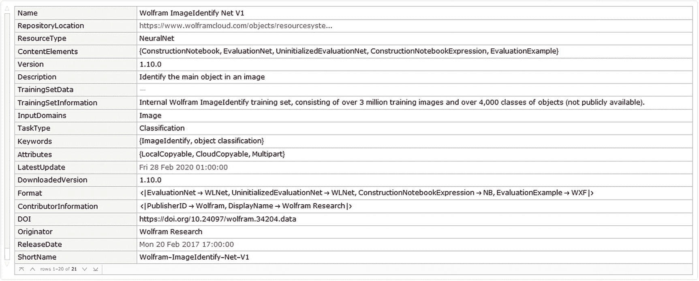

图 10-18

Wolfram 图像的某些属性的数据集识别网络 V1

```py
In[24]:=Dataset[AssociationMap[ResourceObject["Wolfram ImageIdentify Net V1"][#]&,Map[ToString,{Name,RepositoryLocation,ResourceType,ContentElements,Version,Description,TrainingSetData,TrainingSetInformation,InputDomains,TaskType,Keywords,Attributes,LatestUpdate,DownloadedVersion,Format,ContributorInformation,DOI,Originator,ReleaseDate,ShortName,WolframLanguageVersionRequired},1]]]
Out[24]=

```

这里，在几个步骤中，除了与神经网络相关的大量相关信息之外，还有访问经过训练的神经网络的方法。应该注意的是，该过程还用于查找 Wolfram 云中的其他资源或本地资源，而不仅仅是神经网络，因为通常 ResourceSearch 查找 Wolfram 资源系统内的对象。这就是 Wolfram 神经网络库中的神经网络模型的情况。

## LeNet 神经网络

现在，在下面的示例中，我们将看到一个名为 LeNet 的神经网络模型。尽管可以像我们之前看到的那样从 Wolfram 资源访问模型，但是也可以使用 NetModel 命令对 Wolfram 神经网络库中的网络执行操作。为了更好地了解这个网络是如何使用的，我们先来看看对网络的描述，它的名称，它是如何使用的，以及它第一次被提出的地方。

### LeNet 模型

神经网络 LeNet 是深度学习领域内的卷积神经元网络。神经网络 LeNet 被认为是促进深度学习使用的首批卷积网络之一。这个网络用于字符识别，识别手写数字。今天，有基于 LeNet 神经网络架构的不同架构，但我们将重点关注在 Wolfram 神经网络库中找到的版本。该架构由四个关键操作组成:卷积、非线性、子采样或汇集和分类。要了解更多关于 LeNet 卷积神经网络的信息，请参见 Charu C. Aggarwal 著的*神经网络和深度学习:教科书*(2018:Springer)。

使用 NetModel，我们可以获得有关先前已经训练过的 LeNet 网络的信息。

```py
In[25]:= NetModel["LeNet Trained on MNIST Data",#]&/@{"Details","ShortName","TaskType","SourceMetadata"}//Column
Out[25]=
This pioneer work for image classification with convolutional neural nets was released in 1998\. It was developed by Yann LeCun and his collaborators at AT&T Labs while they experimented with a large range of machine learning solutions for classification on the MNIST dataset.
LeNet-Trained-on-MNIST-Data
{Classification}
<|Citation->Y. LeCun, L. Bottou, Y. Bengio, P. Haffner, "Gradient-Based Learning Applied to Document Recognition," Proceedings of the IEEE, 86(11), 2278-2324 (1998),Source->http://yann.lecun.com/exdb/lenet,Date->DateObject[{1998},Year,Gregorian,-5.]|>

```

Note

要使用 NetModel 访问模型的所有属性，请添加 properties 作为第二个参数。net model[“LeNet 在 MNIST 数据上训练”，“属性”]。

该模型接收的输入由大小为 28 x 28 的灰度图像组成，该模型的性能为 98.5%。

```py
In[26]:= NetModel["LeNet Trained on MNIST Data",#]&/@{"TrainingSetInformation","InputDomains","Performance"}//Column
Out[26]= MNIST Database of Handwritten Digits, consisting of 60,000 training and 10,000 test grayscale images of size 28x28.
{Image}
This model achieves 98.5% accuracy on the MNIST dataset.

```

### MNIST 数据集

此网络用于评级，就像它出现在 TaskType 中一样。这些数字存在一个名为 MNIST 数据库的数据库中。MNIST 数据库是一个庞大的手写数字数据库(图 [10-19](#Fig19) )，包含 60，000 张用于训练的图像和 10，000 张用于测试的图像，后者用于获得神经网络模型工作情况的最终估计。为了观察完整的数据集，我们使用 ResourceData 和 ImageDimensions 从 Wolfram 数据存储库中加载它。验证图片的尺寸为 28 x 28 像素。


图 10-19

MNIST 训练集的随机样本

```py
In[27]:= (*This is for seven elements randomly sampled,but you can check the whole data set.*)
TableForm[
SeedRandom[900];
RandomSample[ResourceData["MNIST","TrainingData"],7],TableDirections->Row]
Map[ImageDimensions,%[[1;;7,1]]](*Test set : ResourceData["MNIST","TestData"] *)
Out[27]//TableForm=

```

```py
Out[28]=
{{28,28},{28,28},{28,28},{28,28},{28,28},{28,28},{28,28}}

```

图 [10-19](#Fig19) 显示了数字的图像和它们适用的类别以及每个图像的尺寸。我们提取集合、训练集合和测试集合，我们将在后面使用它们。

```py
In[29]:={TrainData,TestData}={ResourceData["MNIST","TrainingData"], ResourceData["MNIST","TestData"] };

```

### LeNet 体系结构

让我们从从 NetModel 命令下载神经网络开始，该命令从 Wolfram 神经网络存储库中提取模型。在下一个练习中，我们将加载尚未训练的网络，因为我们将进行训练和验证过程。需要注意的是，Wolfram 语言中的 LeNet 模型是原始架构的变体(图 [10-20](#Fig20) )。

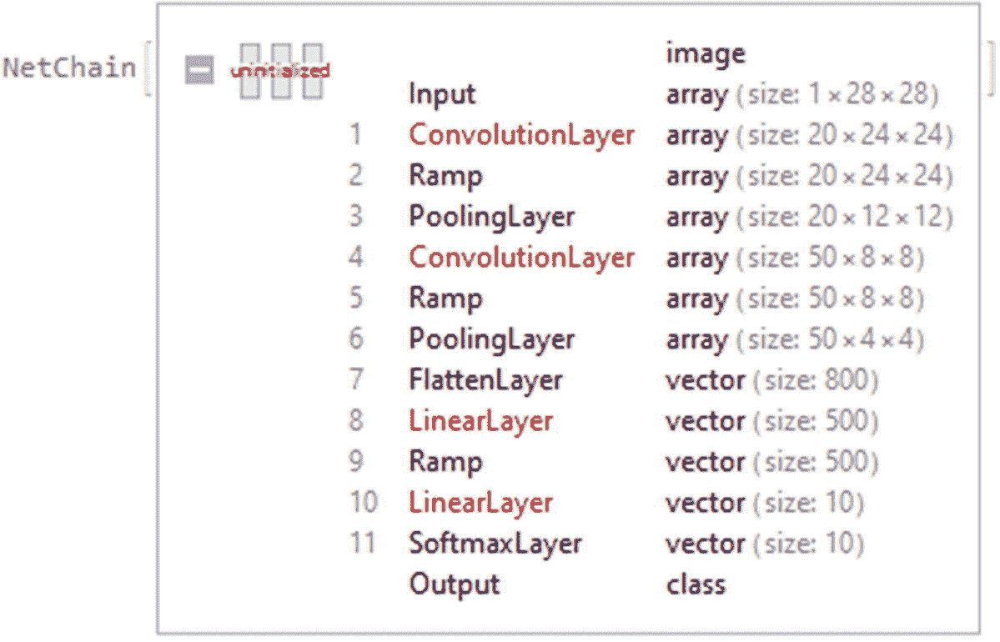

图 10-20

LeNet 体系结构

```py
In[30]:= UninitLeNet=NetModel["LeNet Trained on MNIST Data","UninitializedEvaluationNet"](*To work locally with the untrained model: NetModel["LeNet"]*)
Out[30]=

```

我们看到 Wolfram 神经网络存储库中的 LeNet 网络由 11 层构成。显示为红色的层是具有可学习参数的层:两个卷积层和两个线性层。

### MXNet 框架

借助 MXNet 框架，我们先通过 MXNet 运行图(图 [10-21](#Fig21) )来可视化这个网络的过程。

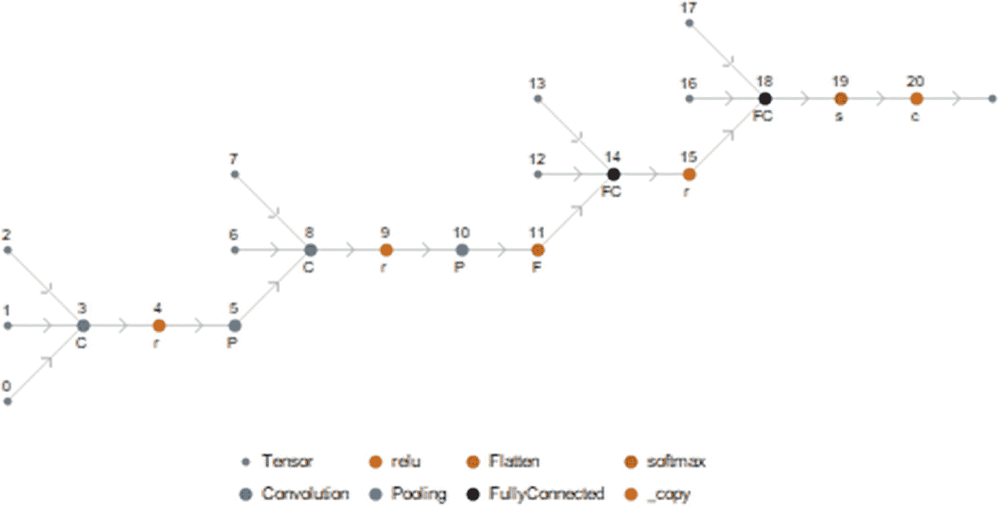

图 10-21

MXNet 图

```py
In[31]:=Information[UninitLeNet,"MXNetNodeGraphPlot"]
Ouy[31]=

```

LeNet 架构从输入端开始，编码器将图像转换为数字数组，然后进行第一次卷积运算，返回 20 特征图，节点 3 和 4 具有校正线性单元激活函数。然后是在汇集节点 5 中选择最大值的第一个最大汇集操作(子采样层)。然后是第二个卷积运算，它返回一个 50 个特征的图，也带有节点 8 和 9 中的校正线性单元激活函数。最后一个卷积运算之后是另一个最大汇集运算(节点 10)，然后是展平运算(节点 11)，将汇集运算的输出展平为单个向量。最后一个池操作给出一个 50*4*4 的数组，flatten 操作返回一个 800-vector，作为下一个操作的输入。接下来，我们看到第一个全连通层(线性层；节点 14)，第一全连接层具有整流线性单位函数(节点 15)，第二全连接层具有 softmax 函数(softmax 层；节点 19)。最后一个完全连接的层可以解释为多层感知器(MLP)，它使用 softmax 将输出标准化为概率分布，以告知每个类别的概率。最后用解码器把张量转换成一个类。节点 4、9、15 和 19 是用于非线性操作的层。

### 准备 LeNet

由于 LeNet 用作图像分类的神经网络，因此必须使用编码器和解码器。网络编码器插入输入网络端口，网络解码器位于输出网络端口。查看网络图(图 [10-22](#Fig22) )可能有助于理解 Wolfram 语言内部的过程。点击输入和输出显示相关信息。


图 10-22

LeNet 模型的网络图

```py
In[32]:= NetGraph[UninitLeNet]
Out[32]=

```

我们可以提取编码器和解码器来检查它们的基础设施。编码器接收任何颜色空间的 28 x 28 尺寸的图像，并将该图像编码到设置为灰度的颜色空间中，然后返回大小为 1 x 28 x 28 的数组。另一方面，解码器是接收大小为 10 的向量的类解码器，该向量告知类标签为 0、1、2、3、4、5、6、7、8 和 9 的概率。

```py
In[33]:={Enc=NetExtract[UninitLeNet,"Input"],Dec=NetExtract[UninitLeNet,"Output"]}//Row;

```

让我们先看看 net 模型如何与 NetInitialize 一起工作。作为一个例子，我们在训练集中使用数字 0 的图像。

```py
In[34]:= TestNet=NetInitialize[UninitLeNet,RandomSeeding->8888];
TestNet@TrainData[[1,1]](*TrainData[[1,1]] belongs to a zero*)
Out[34]= 9

```

网络返回出该图像属于类 9，这意味着该图像是数字 9；显然这是错误的。让我们再次尝试 NetInitialize，但是使用不同的方法。作为 NetInitialize 的第二个参数，写入 all 会覆盖网络上任何预先存在的学习参数。

```py
In[35]:= {net1,net2,net3,net4}=Table[NetInitialize[UninitLeNet,All,Method->i,RandomSeeding->8888],{i,{"Kaiming","Xavier","Orthogonal","Identity"}}];
{net1[TrainData[[1,1]]],net2[TrainData[[1,1]]],net3[TrainData[[1,1]]],net4[TrainData[[1,1]]]}
Out[35]= {9,9,5,3}

```

每个网络模型都无法将图像分类到正确的类别中。这是因为神经网络没有被训练，不像 NetInitialize，它只是随机初始化可学习的参数，但没有执行适当的训练。这就是 NetInitialize 无法正确分类给定图像的原因。但首先，我们要建立网络图来更好地说明这个想法(图 [10-23](#Fig23) )。


图 10-23

LeNet 准备接受训练

```py
In[36]:= LeNet=NetInitialize[NetGraph[<|"LeNet NN"->UninitLeNet,"LeNet Loss"->CrossEntropyLossLayer@"Index"|>,{NetPort@"Input"->"LeNet NN","LeNet NN"->NetPort@{"LeNet Loss","Input"},NetPort@"Target"->NetPort@{"LeNet Loss","Target"}}],RandomSeeding->8888]
Out[36]=

```

在我们继续训练网络之前，我们需要使验证集适合目标输入中的 CrossEntropyLossLayer，因为类从 0 开始，以 9 结束，而索引目标从 1 开始，并继续下去。因此，目标输入需要在 1 到 10 之间。

```py
In[37]:=
]TrainDts=Dataset@Join[AssociationThread["Input"->#]& /@Keys[TrainData],AssociationThread["Target"-> #]&/@Values[TrainData]+1,2];
TestDts=Dataset@Join[AssociationThread["Input"->#]& /@Keys[TestData],AssociationThread["Target"-> #]&/@Values[TestData]+1,2];

```

训练集和验证集具有数据集的形式。图 [10-24](#Fig24) 中只显示了四个随机样本。

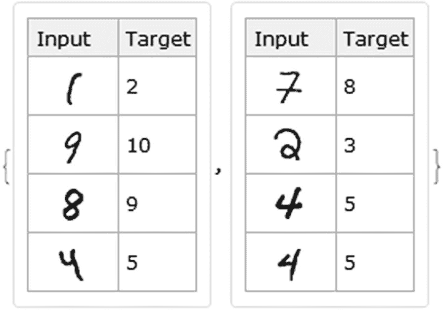

图 10-24

训练和测试集的数据集

```py
In[38]:=BlockRandom[SeedRandom[999];
{RandomSample[TrainDts[[All]],4],RandomSample[TestDts[[All]],4]}]
Out[38]=

```

### 网络培训

既然我们掌握了这个神经网络模型的过程，我们现在可以开始训练神经网络模型。通过 NetTrain，我们逐渐修改神经网络的可学习参数，以减少损失。下一个培训代码是用上一节中看到的选项设置的，但是这里我们添加了新的选项，这些选项也可用于培训。第一个是训练过程测量。使用 TrainingProgressMeasurements，我们可以指定在训练阶段通过循环或批处理来测量准确度、精度等度量。ClassAveraging 用于指定获得指定“测量”(准确度、平方、召回、均方等)的测量的宏观平均值或微观平均值。)、“class averaging”->“Macro”| >。

第二个选项是 TrainingStoppingCriterion，用于根据不同的标准添加早期停止，以避免在训练阶段过度拟合，如当认证损失没有改善时停止训练，测量测量的绝对或相对变化(准确度、精密度、损失等)。)，或者当损失或其他标准在一定数量的回合“测量”(准确度、损失、召回等)后没有改善时停止训练。)，“耐心”->回合数| >。

```py
In[39]:= NetResults=NetTrain[LeNet,TrainDts,All,ValidationSet->TestDts,MaxTrainingRounds->15,BatchSize->2096,LearningRate->Automatic,Method->"ADAM",TargetDevice->"CPU",PerformanceGoal->"TrainingMemory",WorkingPrecision->"Real32",RandomSeeding->99999,TrainingProgressMeasurements->{<|"Measurement"->"Accuracy","ClassAveraging"->"Macro"|>, <|"Measurement"->"Precision","ClassAveraging"->"Macro"|>,<|"Measurement"->"F1Score","ClassAveraging"->"Macro"|>,<|"Measurement"->"Recall","ClassAveraging"->"Macro"|>,<|"Measurement"->"ROCCurvePlot","ClassAveraging"->"Macro"|>,<|"Measurement"->"ConfusionMatrixPlot","ClassAveraging"->"Macro"|> },TrainingStoppingCriterion-> <|"Criterion"->"Loss","AbsoluteChange"->0.001|>]
Out[39]=

```

培训阶段的最终结果如图 [10-25](#Fig25) 所示。提取已训练的模型并附加网络编码器和解码器已经完成，因为已训练的网络在输入和输出端口没有编码器和解码器。

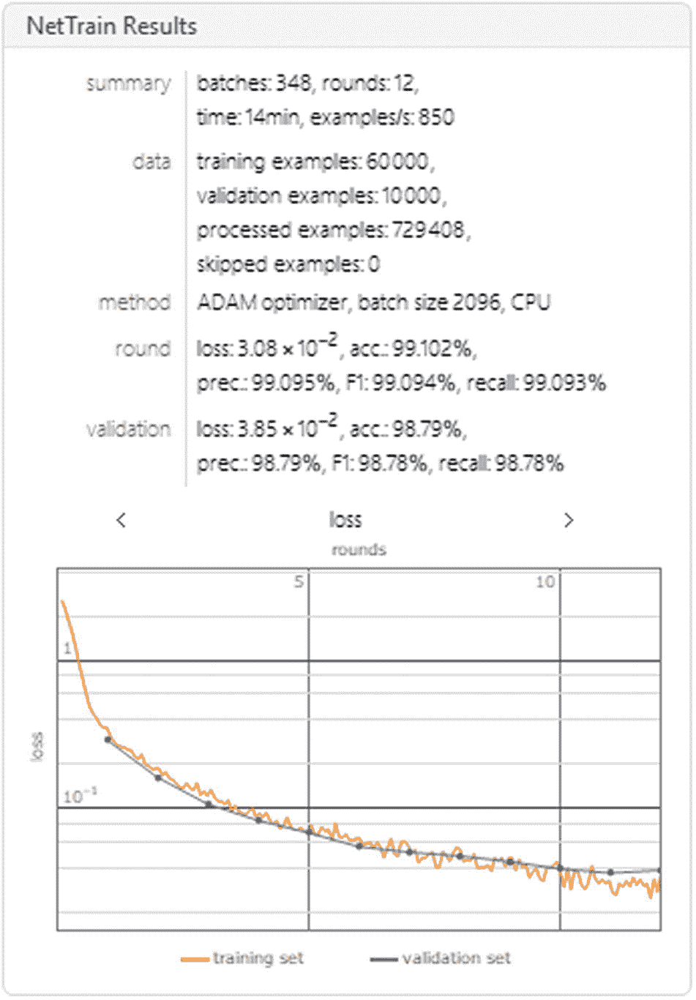

图 10-25

LeNet 培训的净结果

```py
In[40]:=NetExtract[NetResults["TrainedNet"],"LeNet NN"];
TrainedLeNet=NetReplacePart[%,{"Input"->Enc,"Output"->Dec}];

```

### LeNet 模型评估

下一个网格(图 [10-26](#Fig26) )显示了训练集的跟踪测量和绘图。定型集的度量值在 RoundMeasurements 属性中。要获得每一轮的值列表，请使用 RoundMeasurementsLists。训练集的性能用回合测量来评估，测试集用确认测量来评估。此外，在这两种情况下，ROC 曲线和混淆矩阵图都显示。

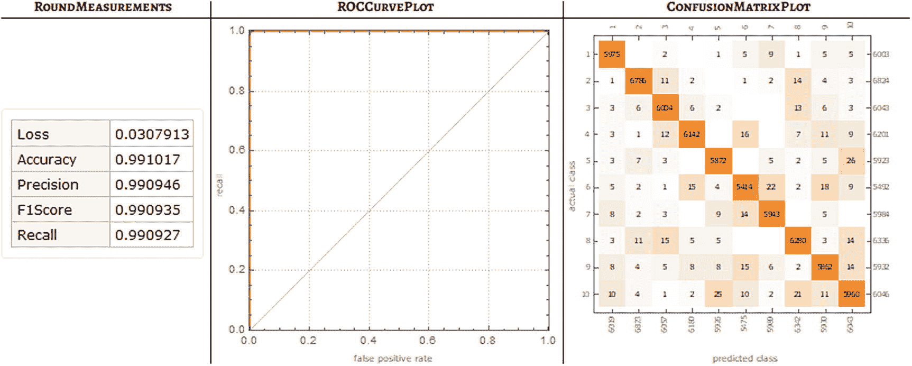

图 10-26

训练集测量

```py
In[41]:=NetResults["RoundMeasurements"][[1;;5]];
Normal[NetResults["RoundMeasurements"][[6;;7]]];
Grid[{{Style["RoundMeasurements",#1,#2],Style[%[[1,1]],#1,#2],Style[%[[2,1]],#1,#2]},{Dataset[%%],%[[1,2]],%[[2,2]]}},Dividers->Center]&[Bold,FontFamily->"Alegreya SC"]
Out[41]=

```

要查看模型在验证集上的表现(图 [10-27](#Fig27) )，请参见验证测量。要获得每一轮的值列表，请使用 ValidationMeasurementsLists。

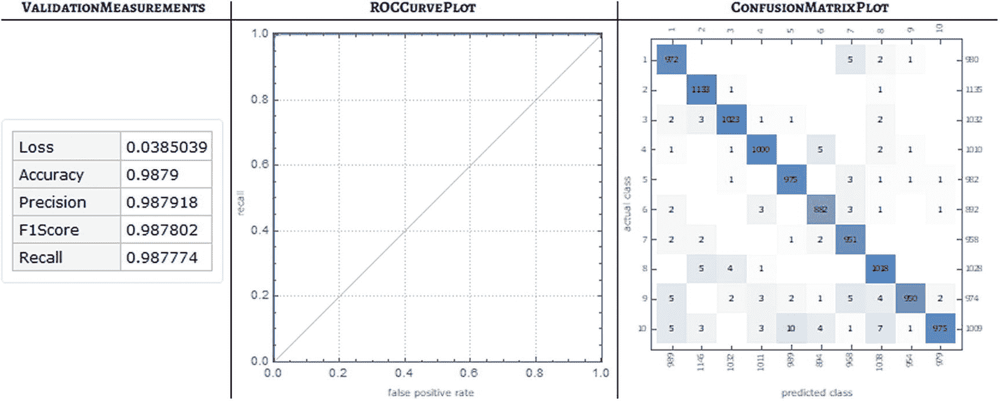

图 10-27

测试集测量

```py
In[42]:=NetResults["ValidationMeasurements"][[1;;5]];
Normal[NetResults["ValidationMeasurements"][[6;;7]]];
Grid[{{Style["ValidationMeasurements",#1,#2],Style[%[[1,1]],#1,#2],Style[%[[2,1]],#1,#2]},{Dataset[%%],%[[1,2]],%[[2,2]]}},Dividers->Center]&[Bold,FontFamily->"Alegreya SC"]
Out[42]=

```

### 测试 LeNet

完成训练并查看了轮次测量和验证测量后，我们现在准备用一些困难的图像来测试训练好的 LeNet 神经网络，以了解它的表现如何(图 [10-28](#Fig28) )。


图 10-28

来自 MNIST 测试集的困难例子

```py
In[43]:=
Expls=Keys[{TestData[[2150]],TestData[[3910]],TestData[[6115]],TestData[[6011]],TestData[[7834]]}]
Out[43]=

```

所选图像属于数字 2、3、6、5 和 7。

```py
In[44]:= TrainedLeNet[Expls,"TopProbabilities"]
Out[44]= {{2->0.998171},{3->0.999922},{6->0.587542,0->0.404588},{6->0.971103},{7->0.99937}}

```

用表格形式写出概率最高的所有结果。

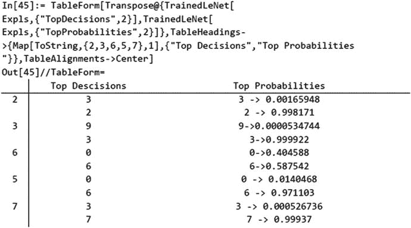

我们可以看到，经过训练的网络对数字 5 的图像进行了错误分类，因为最上面的决定要么是 0，要么是 6，显然这是错误的。此外，我们可以看到最高决策的概率。评估测试集中已训练网络的另一种形式是使用网络测量来设置网络模型、测试集和感兴趣的测量。在本例中，感兴趣的度量是 ConfusionMatrixPlot(图 [10-29](#Fig29) )。


图 10-29

网络测量的混淆矩阵图

```py
In[26]:=NetMeasurements[TrainedLeNet,TestData,"ConfusionMatrixPlot"]
Out[26]=

```

## 结束语

总之，概括地说，这是 Wolfram 语言方案中机器学习或神经网络模型的一般示意图、构建、测试和实现的路线图。如图 [10-30](#Fig30) 所示。


图 10-30

训练集测量

该图显示了一条可直接遵循的路线；尽管如此，在路线中，每个过程之间可能有中间点，因为路线可能根据要解决的任务或问题的类型而变化。然而，该路线侧重于揭示重要的和一般的点，以使用 Wolfram 语言进行模型的构建。在数据准备阶段，有先前的过程，例如数据集成、收集的数据类型(结构化或非结构化)、数据转换、数据模块清理等等。因此，在进入下一阶段之前，必须对数据进行预处理，目的是准备好数据以供模型使用。

模型准备包括诸如算法或方法的选择等方面，取决于学习的类型；建立或检测模型的结构；以及定义将要使用的数据的特征、输入参数和类型，无论是文本、声音、数字数据还是要使用的工具。所有这些都与称为特征工程的过程有关，特征工程的主要目标是从数据中提取有价值的属性。这是进入下一步，也就是训练阶段所需要的。

评估阶段和模型评估包括定义评估指标，除了准备稍后将使用的验证之外，评估指标还根据要解决的任务或问题的类型而变化。在这一点上，有必要强调的是，模型的准备、训练以及评估和评价可以是一个迭代过程，它可以包括超参数的调整、算法技术的调整以及模型配置，例如内部模型特征。目的是建立能够交付足够结果并最终到达模型部署阶段的最佳可能模型，该阶段定义了将在新数据上选择和测试的模型。