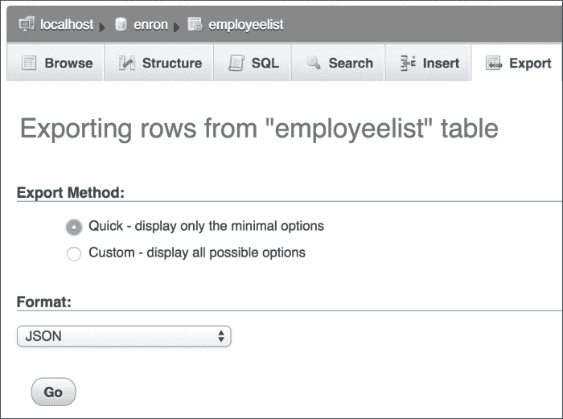
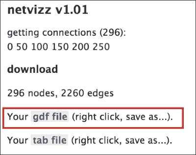
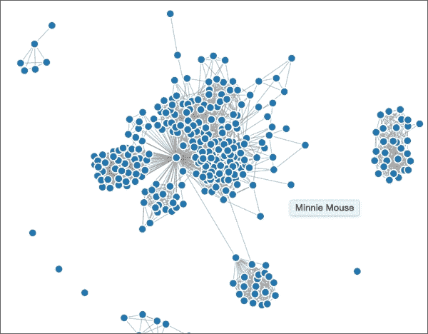

# 四、说通用语——数据转换

去年夏天，我在当地一所烹饪学校上了一堂奶酪制作课。我们最先做的东西之一是乳清干酪。当我得知只用牛奶和酪乳就可以在大约一个小时内做出乳清干酪，而且酪乳本身可以用牛奶和柠檬汁制成时，我激动不已。在一个厨房里，食材不断转化成其他食材，这些食材又会转化成美味的饭菜。在我们的数据科学厨房中，我们将例行执行从一种数据格式到另一种数据格式的转换。当我们想要将数据集合并在一起时，或者当我们需要以新的方式存储数据集时，我们可能需要这样做，以便执行各种分析。

通用语是一种在不同语言使用者之间的对话中被作为通用标准的 T2 语言。在转换数据时，有几种数据格式可以作为通用标准。我们在[第 2 章](ch02.html "Chapter 2. Fundamentals – Formats, Types, and Encodings")、*基础——格式、类型和编码*中讨论了其中的一些。JSON 和 CSV 是最常见的两种。在本章中，我们将花些时间学习:

*   如何从软件工具和语言(Excel、Google 电子表格和 phpMyAdmin)快速转换成 JSON 和 CSV。
*   如何编写 Python 和 PHP 程序生成不同的文本格式并在它们之间转换？
*   如何实现数据转换才能完成一个真正的`-`世界任务？在这个项目中，我们将使用 netvizz 软件从脸书下载一个朋友网络，我们将清理数据并将其转换为 JSON 格式，以便在 D3 中构建一个可视化的社交网络。然后，我们将以不同的方式清理数据，将其转换为称为 **networkx** 的社交网络包所需的 Pajek 格式。

# 基于工具的快速转换

将少量数据转换成中等数量数据的最快最简单的方法之一就是询问你正在使用的软件工具。有时，您正在使用的应用程序已经可以选择将数据转换成您想要的格式。正如第三章[中的提示和技巧一样，如果可能的话，我们希望利用工具中的这些隐藏功能。如果您有太多的数据需要进行基于应用程序的转换，或者您想要的特定转换不可用，我们将在接下来的章节中介绍编程解决方案，用 PHP 进行转换*和用 Python 进行转换*。**](ch03.html "Chapter 3. Workhorses of Clean Data – Spreadsheets and Text Editors")

## *电子表格到 CSV*

*将电子表格保存为分隔文件非常简单。Excel 和 Google 电子表格都有**文件**菜单选项**另存为**；在此选项中，选择 **CSV (MS DOS)** 。此外，谷歌电子表格有保存为 Excel 文件和保存为制表符分隔文件的选项。将文件保存为 CSV 有一些限制:*

*   *在 Excel 和 Google 电子表格中，当您使用**另存为**功能时，只会保存当前工作表。这是因为，从本质上讲，CSV 文件只描述一组数据；因此，它不能包含多个工作表。如果您有一个多工作表的电子表格，您需要将每个工作表保存为一个单独的 CSV 文件。*
*   *在这两个工具中，关于如何自定义 CSV 文件的选项相对较少，例如，Excel 保存数据时使用逗号作为分隔符(这是有意义的，因为它是一个 CSV 文件)，并且不提供将数据值括在引号中或用于不同行终止符的选项。*

## *电子表格到 JSON*

*JSON 比 CSV 更难对付。Excel 没有简单的 JSON 转换器，尽管网上有几个转换器工具声称可以将 CSV 文件转换成 JSON。*

*然而，Google 电子表格有一个 JSON 转换器，可以通过 URL 获得。这种方法有几个缺点，第一个缺点是，您必须将文档发布到 Web 上(至少是临时发布),以便访问它的 JSON 版本。您还必须使用一些很长的数字来定制 URL，以便识别您的电子表格。它还会在 JSON 转储中产生大量信息——可能比您想要或需要的还要多。尽管如此，这里还是有一些将 Google 电子表格转换成 JSON 表示的逐步说明。*

### *第一步——将谷歌电子表格发布到网上*

*在你的谷歌电子表格创建并保存后，从**文件**菜单中选择**发布到网络**。单击随后的对话框(我选择了所有默认选项)。此时，您就可以通过 URL 访问这个文件的 JSON 了。*

### *第二步–创建正确的 URL*

*从发布的 Google 电子表格创建 JSON 的 URL 模式如下所示:*

*[http://spreadsheets . Google . com/feeds/list/key/sheet/public/basic？alt=json](http://spreadsheets.google.com/feeds/list/key/sheet/public/basic?alt=json)*

*这个 URL 有三个部分需要修改，以匹配特定的电子表格文件:*

*   ***列表**:(可选)如果您希望看到 JSON 文件中的每个单元格及其引用(A1、A2 等等)单独列出，那么您可以将`list`更改为单元格。如果您希望每一行都是一个实体，请在 URL 中保留`list`。*
*   ***键**:修改这个 URL 中的`key`，以匹配谷歌内部用来代表你的文件的唯一长号码。在您的电子表格的 URL 中，当您在浏览器中查看它时，该键显示为两个斜杠之间的长标识符，就在 URL 的**/电子表格/d** 部分之后，如下所示:*
*   ***sheet** : change The word sheet in the sample URL to `od6` to indicate that you are interested in converting the first sheet.

    ### What does

    `od6` mean? Google uses a code to represent each piece of paper. However, these codes are not strictly in numerical order. There is a lengthy discussion about the numbering scheme of the problem on this stack overflow post and its answer: [http://stackoverflow.com/questions/11290337/] T2

    .*

*为了测试这个过程，我们可以为大学创建一个 Google 电子表格，并在第三章、*中的示例项目结束时生成计数，这是整洁数据的主要来源——电子表格和文本编辑器*。该电子表格的前三行如下所示:*

| 耶鲁大学 | Twenty-six |
| 普林斯顿大学 | Twenty-five |
| 康奈尔大学 | Twenty-four |

*我通过 JSON 访问这个文件的 URL 是这样的:*

*[http://spreadsheets . Google . com/feeds/list/1 mwiak _ 5knoqhr 4 vfgphdm 7 GX 8 VH 22 wjgauyyhuyxsnm/od6/public/basic？alt=json](http://spreadsheets.google.com/feeds/list/1mWIAk_5KNoQHr4vFgPHdm7GX8Vh22WjgAUYYHUyXSNM/od6/public/basic?alt=json)*

*将这个 URL 粘贴到浏览器中会产生数据的 JSON 表示。它有 231 个条目，每个条目看起来都像下面的代码片段。为了便于阅读，我将此条目的格式设置为添加了换行符:*

```
*{
  "id":{
    "$t":"https://spreadsheets.google.com/feeds/list/1mWIAk_5KN oQHr4vFgPHdm7GX8Vh22WjgAUYYHUyXSNM/od6/public/basic/cokwr"
  },
  "updated":{"$t":"2014-12-17T20:02:57.196Z"},
  "category":[{
    "scheme":"http://schemas.google.com/spreadsheets/2006",
    "term"  :"http://schemas.google.com/spreadsheets/2006#list"
  }],
  "title":{
    "type":"text",
    "$t"  :"Yale University "
  },
  "content":{
    "type":"text",
    "$t"  :"_cokwr: 26"
  },
  "link": [{
    "rel" :"self",
    "type":"application/atom+xml",
    "href":"https://spreadsheets.google.com/feeds/list/1mWIAk_5KN oQHr4vFgPHdm7GX8Vh22WjgAUYYHUyXSNM/od6/public/basic/cokwr"
  }]
}*
```

*即使我进行了重新格式化，这个 JSON 也不是很漂亮，许多名称-值对对我们来说都是无趣的。尽管如此，我们已经成功地生成了一个功能性的 JSON。如果我们使用一个程序来使用这个 JSON，我们将忽略所有关于电子表格本身的无关信息，只关注标题和内容实体以及`$t`值(在本例中是`Yale University`和`_cokwr: 26`)。这些值在前面示例中显示的 JSON 中突出显示。如果您想知道是否有办法从电子表格到 CSV 再到 JSON，答案是肯定的。我们将在本章后面的*用 PHP* 转换和*用 Python* 转换小节中详细介绍如何做到这一点。*

## *使用 phpMyAdmin 将 SQL 转换为 CSV 或 JSON*

*在这一节中，我们将讨论直接从数据库编写 JSON 和 CSV 的两个选项，在我们的例子中是 MySQL，不使用任何编程。*

*首先，phpMyAdmin 是 MySQL 数据库非常常见的基于 web 的前端。如果您使用该工具的现代版本，您将能够将整个表或查询结果导出为 CSV 或 JSON 文件。使用我们在第一章、*中第一次访问的安然数据库，为什么需要整洁的数据？*，考虑下面的**导出**选项卡的屏幕截图，选择 **JSON** 作为整个 **employeelist** 表的目标格式(CSV 也可以在这个选择框中获得):*

*

整个表的 PhpMyAdmin JSON 导出* 

*导出查询结果的过程非常相似，除了不使用屏幕顶部的**导出**选项卡，而是运行 SQL 查询，然后使用页面底部**查询结果操作**下的**导出**选项，如下所示:*

*

PhpMyAdmin 也可以导出查询的结果* 

*我们可以在`employeelist`表上运行一个简单的查询来测试这个过程:*

```
*SELECT concat(firstName,  " ", lastName) as name, email_id
FROM employeelist
ORDER BY lastName;*
```

*当我们将结果导出为 JSON 时，phpMyAdmin 向我们显示了 151 个格式如下的值:*

```
*{
  "name": "Lysa Akin",
  "email_id": "lysa.akin@enron.com"
}*
```

*phpMyAdmin 工具是一个很好的工具，它可以有效地转换 MySQL 中存储的适量数据,尤其是查询结果。如果您使用不同的 RDBMS，您的 SQL 接口可能会有一些自己的格式化选项，您应该探索一下。*

*另一个策略是完全绕过 phpMyAdmin，只使用 MySQL 命令行写出一个 CSV 文件，该文件按照您想要的方式格式化:*

```
*SELECT concat(firstName,  " ", lastName) as name, email_id
INTO OUTFILE 'enronEmployees.csv'
FIELDS TERMINATED BY ',' OPTIONALLY ENCLOSED BY '"'
LINES TERMINATED BY '\n'
FROM employeelist;*
```

*这将用指定的名称(`employees.csv`)写一个逗号分隔的文件。它将被写入当前目录。*

*JSON 呢？使用这种策略没有非常简洁的方法来输出 JSON，所以您应该使用前面显示的 phpMyAdmin 解决方案，或者使用用 PHP 或 Python 编写的更健壮的解决方案。这些编程解决方案将在后续章节中介绍，请继续阅读。*

*

# 用 PHP 转换

在我们的[第 2 章](ch02.html "Chapter 2. Fundamentals – Formats, Types, and Encodings")、*基础——格式、类型和编码*中，在关于 JSON 数字格式的讨论中，我们简要展示了如何使用 PHP 连接到数据库，运行查询，从结果构建 PHP 数组，然后将 JSON 结果打印到屏幕上。在这里，我们将首先扩展这个例子来写一个文件，而不是打印到屏幕上，也写一个 CSV 文件。接下来，我们将展示如何使用 PHP 读入 JSON 文件并转换为 CSV 文件，反之亦然。

## 使用 PHP 将 SQL 转换成 JSON

在这个部分，我们将编写一个 PHP 脚本来连接到`enron`数据库，运行一个 SQL 查询，并导出一个 JSON 格式的文件。为什么要为此写一个 PHP 脚本而不是使用 phpMyAdmin？当我们需要在导出数据之前对数据进行额外的处理，或者我们怀疑我们拥有的数据超过了一个基于 web 的应用程序(比如 phpMyAdmin)所能运行的数据量时，这种策略会很有用:

```
<?php
// connect to db, set up query, run the query
$dbc = mysqli_connect('localhost','username','password','enron')
or die('Error connecting to database!' . mysqli_error());

$select_query = "SELECT concat(firstName,  \" \", lastName) as name, email_id FROM  employeelist ORDER BY lastName";

$select_result = mysqli_query($dbc, $select_query);

if (!$select_result)
    die ("SELECT failed! [$select_query]" .  mysqli_error());

// ----JSON output----
// build a new array, suitable for json
$counts = array();
while($row = mysqli_fetch_array($select_result))
{
// add onto the json array
    array_push($counts, array('name'     => $row['name'],
    'email_id' => $row['email_id']));
}
// encode query results array as json
$json_formatted = json_encode($counts);

// write out the json file
file_put_contents("enronEmail.json", $json_formatted);
?>
```

这段代码将 JSON 格式的输出文件写到您在`file_put_contents()`行中指定的位置。

## 使用 PHP 将 SQL 转换为 CSV

下面的代码片段展示了如何使用 PHP 文件输出流来创建一个 CSV 格式的 SQL 查询结果文件。将此代码作为一个`.php`文件保存在 web 服务器上支持脚本的目录中，然后在浏览器中请求该文件。它会自动下载一个包含正确值的 CSV 文件:

```
<?php
// connect to db, set up query, run the query
  $dbc = mysqli_connect('localhost','username','password','enron')
  or die('Error connecting to database!' . mysqli_error());

$select_query = "SELECT concat(firstName,  \" \", lastName) as name, email_id FROM  employeelist ORDER BY lastName";

$select_result = mysqli_query($dbc, $select_query);

if (!$select_result)
    die ("SELECT failed! [$select_query]" .  mysqli_error());

// ----CSV output----
// set up a file stream
$file = fopen('php://output', 'w');
if ($file && $select_result)
{
    header('Content-Type: text/csv');
    header('Content-Disposition: attachment;
    filename="enronEmail.csv"');
    // write each result row to the file in csv format
    while($row = mysqli_fetch_assoc($select_result))
    {
      fputcsv($file, array_values($row));
    }
}
?>
```

结果的格式如下(只有前三行):

```
"Lysa Akin",lysa.akin@enron.com
"Phillip Allen",k..allen@enron.com
"Harry Arora",harry.arora@enron.com
```

如果您想知道 Phillip 的电子邮件中是否真的应该有两个点，我们可以运行一个快速查询来找出 Enron 的电子邮件中有多少是这样的格式:

```
SELECT CONCAT(firstName,  " ", lastName) AS name, email_id
FROM employeelist
WHERE email_id LIKE "%..%"
ORDER BY name ASC;
```

结果发现 24 个电子邮件地址都有这样的双点。

## 使用 PHP 将 JSON 转换为 CSV

在这里，我们将使用 PHP 读入一个 JSON 文件并将其转换为 CSV 并输出一个文件:

```
<?php
// read in the file
$json = file_get_contents("outfile.json");
// convert JSON to an associative array
$array = json_decode ($json, true);
// open the file stream
$file = fopen('php://output', 'w');
header('Content-Type: text/csv');
header('Content-Disposition: attachment;
filename="enronEmail.csv"');
// loop through the array and write each item to the file
foreach ($array as $line)
{
    fputcsv($file, $line);
}
?>
```

这段代码将创建一个包含每一行的 CSV，就像前面的例子一样。我们应该知道，`file_get_contents()`函数将文件作为字符串读入内存，因此您可能会发现，对于非常大的文件，您将需要使用`fread()`、`fgets()`和`fclose()` PHP 函数的组合。

## 使用 PHP 将 CSV 转换为 JSON

另一个常见的任务是读入一个 CSV 文件，并把它写成一个 JSON 文件。大多数时候，我们有一个第一行是标题行的 CSV。标题行列出了文件中每一列的列名，我们希望标题行中的每一项都成为文件的 JSON 格式版本的键:

```
<?php
$file = fopen('enronEmail.csv', 'r');
$headers = fgetcsv($file, 0, ',');
$complete = array();

while ($row = fgetcsv($file, 0, ','))
{
    $complete[] = array_combine($headers, $row);
}
fclose($file);
$json_formatted = json_encode($complete);
file_put_contents('enronEmail.json',$json_formatted);
?>
```

前面创建的`enronEmail.csv`文件上的代码结果带有一个标题行，如下所示:

```
[{"name":"Lysa Akin","email_id":"lysa.akin@enron.com"},
{"name":"Phillip Allen","email_id":"k..allen@enron.com"},
{"name":"Harry Arora","email_id":"harry.arora@enron.com"}…]
```

对于本例，在实际 CSV 文件的 151 个结果中，只显示了前三行。


# 使用 Python 进行转换

在这一节中，我们将描述使用 Python 将 CSV 转换成 JSON 的各种方法，反之亦然。在这些例子中，我们将探索实现这一目标的不同方法，既使用专门安装的库，也使用更普通的 Python 代码。

## 使用 Python 将 CSV 转换为 JSON

我们发现了几种使用 Python 将 CSV 文件转换成 JSON 的方法。第一个使用内置的`csv`和`json`库。假设我们有一个 CSV 文件，其中有这样的行(只显示前三行):

```
name,email_id
"Lysa Akin",lysa.akin@enron.com
"Phillip Allen",k..allen@enron.com
"Harry Arora",harry.arora@enron.com
```

我们可以编写一个 Python 程序来读取这些行，并将它们转换成 JSON:

```
import json
import csv

# read in the CSV file
with open('enronEmail.csv') as file:
    file_csv = csv.DictReader(file)
    output = '['
    # process each dictionary row
    for row in file_csv:
      # put a comma between the entities
      output += json.dumps(row) + ','
    output = output.rstrip(',') + ']'
# write out a new file to disk
f = open('enronEmailPy.json','w')
f.write(output)
f.close()
```

产生的 JSON 将如下所示(只显示了前两行):

```
[{"email_id": "lysa.akin@enron.com", "name": "Lysa Akin"},
{"email_id": "k..allen@enron.com", "name": "Phillip Allen"},…]
```

使用这种方法的一个好处是，除了获取和放置正在读取的文件(CSV)和正在写入的文件(JSON)之外，它不需要任何特殊的库安装或任何命令行访问。

## 使用 csvkit 将 CSV 转换为 JSON

将 CSV 转换成 JSON 的第二种方法依赖于一个非常有趣的 Python 工具包，叫做 **csvkit** 。要使用 Canopy 安装 csvkit，只需启动 Canopy 终端窗口(您可以通过导航到**工具** | **Canopy 终端**在 Canopy 内部找到它)，然后运行`pip install csvkit`命令。将为您安装使用 csvkit 的所有依赖项。此时，您可以选择使用`import csvkit`或通过命令行通过 Python 程序将 csvkit 作为库来访问，正如我们将在下面的代码片段中所做的:

```
csvjson enronEmail.csv > enronEmail.json

```

该命令获取一个`enronEmail.csv` CSV 文件，并快速、轻松地将其转换为 JSON `enronEmail.csvkit.json`文件。

csvkit 包还附带了其他几个非常有用的命令行程序，包括可以从 CSV 文件中提取任意列列表的`csvcut`，以及可以对 CSV 文件执行分隔符交换、更改行尾或类似清理过程的`csvformat`。如果您只想提取几列进行处理，那么`csvcut`程序特别有用。对于这些命令行工具，您可以将其输出重定向到一个新文件。下面的命令行获取一个名为`bigFile.csv`的文件，截取第一列和第三列，并将结果保存为一个新的 CSV 文件:

```
csvcut bigFile.csv –c 1,3 > firstThirdCols.csv

```

### Tip

关于 csvkit 的其他信息，包括完整的文档、下载和示例，可在[http://csvkit.rtfd.org/](http://csvkit.rtfd.org/)获得。

## Python JSON 到 CSV

使用 Python 读取 JSON 文件并将其转换为 CSV 进行处理非常简单:

```
import json
import csv

with open('enronEmailPy.json', 'r') as f:
    dicts = json.load(f)
out = open('enronEmailPy.csv', 'w')
writer = csv.DictWriter(out, dicts[0].keys())
writer.writeheader()
writer.writerows(dicts)
out.close()
```

这个程序获取一个名为`enronEmailPy.json`的 JSON 文件，并使用 JSON 的键作为标题行新文件导出这个文件的 CSV 格式版本，这个文件名为`enronEmailPy.csv`。


# 样板工程

在这一章中，我们重点介绍了将数据从一种格式转换为另一种格式，这是一项常见的数据清理任务，需要在数据分析项目的其余部分完成之前反复执行。我们关注一些非常常见的文本格式(CSV 和 JSON)和数据的常见位置(文件和 SQL 数据库)。现在，我们准备用一个示例项目来扩展我们的数据转换基础知识，该项目将要求我们在一些不太标准化但仍然基于文本的数据格式之间进行转换。

在这个项目中，我们想调查我们的脸书社交网络。我们将:

1.  使用 netvizz 将我们的脸书社交网络(朋友和他们之间的关系)下载成一种基于文本的文件格式，称为**图形描述格式** ( **GDF** )。
2.  构建一个脸书社交网络的图形表示，将我们网络中的人显示为节点，将他们的友谊显示为这些节点之间的连接线(称为*边*)。为此，我们将使用 D3 JavaScript 图形库。这个库期望网络中数据的 JSON 表示。
3.  计算一些关于社交网络的度量，比如网络的大小(被称为网络的*度*)和两个人之间的最短路径我们的网络。为此，我们将使用 Python 中的`networkx`包。这个包期望数据是基于文本的格式，称为 **Pajek** 格式。

这个项目的主要目标是展示如何协调所有这些不同的预期格式(GDF、Pajek 和 JSON)并执行从一种格式到另一种格式的转换。我们的第二个目标是实际上提供足够的样本代码和指导，以对我们的社交网络进行小型分析。

## 第一步-以 GDF 的身份下载脸书数据

在此步骤中，您需要登录您的脸书账户。使用 https://apps.facebook.com/netvizz/脸书的搜索框找到 netvizz 应用，或者使用这个网址直接链接到 netvizz 应用:。

一旦进入 netvizz 页面，点击**个人网络**。接下来的页面解释说，点击**开始**按钮将提供一个可下载的文件，其中有两个项目:一个 GDF 格式的文件，列出了你所有的朋友和他们之间的联系，以及一个制表符分隔的**制表符分隔的值** ( **TSV** )统计文件。我们主要对这个项目的 GDF 文件感兴趣。点击**开始**按钮，在随后的页面中，右键点击 GDF 文件，将其保存到您的本地磁盘，如以下截图所示:



netvizz 脸书应用程序允许我们以 GDF 文件的形式下载我们的社交网络

在这一点上，给文件起一个较短的名字可能会有所帮助。(我将我的文件命名为`personal.gdf`,并将其保存在专门为此项目创建的目录中。)

## 第二步——在文本编辑器中查看 GDF 文件格式

在您的文本编辑器中打开文件(为此我使用了 Text Wrangler ),并注意该文件格式的一些事项:

1.  文件分为两部分:节点和边。
2.  这些节点位于文件的第一部分，前面有单词`nodedef`。节点列表是我所有朋友的列表和一些关于他们的基本事实(他们的性别和他们的内部脸书识别号)。节点按人员加入脸书的日期顺序列出。
3.  文件的第二部分显示了我的朋友之间的边或连接。有时，这些也被称为链接。文件的这一部分以单词`edgedef`开头。这些边描述了我的哪些朋友与其他哪些朋友相关联。

以下是节选的节点部分的外观:

```
nodedef>name VARCHAR,label VARCHAR,sex VARCHAR,locale VARCHAR,agerank INT
  1234,Bugs Bunny,male,en_US,296
  2345,Daffy Duck,male,en_US,295
  3456,Minnie Mouse,female,en_US,294
```

以下是边缘部分的摘录。说明`Bugs` ( `1234`)和`Daffy` ( `2345`)是朋友，`Bugs`也是`Minnie` ( `3456`)的朋友:

```
edgedef>node1 VARCHAR,node2 VARCHAR 
1234,2345
1234,3456
3456,9876
```

## 第三步——将 GDF 文件转换成 JSON

我们想要执行的任务是在 D3 中将这些数据表示为一个社交网络。首先，我们需要看看几十个可用的 D3 例子来构建一个社交网络，比如那些在 D3 图库、【https://github.com/mbostock/d3/wiki/Gallery】T3[和【http://christopheviau.com/d3list/】T5](https://github.com/mbostock/d3/wiki/Gallery)[中可用的例子。](http://christopheviau.com/d3list/)

这些社交网络图的例子依赖于 JSON 文件。每个 JSON 文件显示了节点和它们之间的边。以下是这些 JSON 文件的一个示例:

```
{"nodes": [
  {"name":"Bugs Bunny"},
  {"name":"Daffy Duck"},
  {"name":"Minnie Mouse"}],
  "edges": [
  {"source": 0,"target": 2},
  {"source": 1,"target": 3},
  {"source": 2,"target": 3}]}
```

关于这段 JSON 代码最重要的一点是要注意，它有和 GDF 文件一样的两个主要部分:节点和边。这些节点仅仅是人名。边是代表友谊关系的数字对的列表。但是，这些对没有使用脸书标识号，而是为节点列表中的每个项目使用一个索引，从`0`开始。

目前我们还没有 JSON 文件。我们只有 GDF 的档案。我们将如何构建这个 JSON 文件？当我们仔细观察 GDF 文件时，我们可以看到它看起来很像两个相互堆叠的 CSV 文件。在本章的前面，我们知道有几种不同的策略可以从 CSV 转换到 JSON。

因此，我们决定将 GDF 转换为 CSV，然后将 CSV 转换为 JSON。

### 注意

等等；如果那个 JSON 例子看起来不像我在网上找到的在 D3 里执行社交网络图的 JSON 文件怎么办？

你可能在网上找到的一些 D3 社交网络可视化的例子会为每个节点或链接显示许多额外的值，例如，它们可能包括额外的属性，可以用来表示大小的差异、悬停特征或颜色变化，如这个样本所示:[http://bl.ocks.org/christophermanning/1625629](http://bl.ocks.org/christophermanning/1625629)。这幅图像展示了芝加哥受薪政治说客之间的关系。在本例中，代码考虑了 JSON 文件中的信息，以确定节点的圆圈大小以及悬停在节点上时显示的文本。这是一个非常好的图表，但是很复杂。因为我们的主要目标是学习如何清理数据，所以我们将在这里使用一个精简的简单示例，它没有很多额外的内容。不过，不要担心；我们的例子仍然会构建一个漂亮的 D3 图！

要将 GDF 文件转换成我们想要的格式，我们可以遵循以下步骤:

1.  使用文本编辑器将`personal.gdf`文件分成两个文件，`nodes.gdf`和`links.gdf.`
2.  更改每个文件中的标题行，以匹配我们最终希望在 JSON 文件中使用的列名:

    ```
    id,name,gender,lang,num
    1234,Bugs Bunny,male,en_US,296
    2345,Daffy Duck,male,en_US,295
    9876,Minnie Mouse,female,en_US,294

    source,target
    1234,2345
    1234,9876
    2345,9876
    ```

3.  使用`csvcut`实用程序(前面讨论过的 csvkit 的一部分)从`nodes.gdf`文件中提取第一列和第二列，并将输出重定向到一个名为`nodesCut.gdf` :

    ```
    csvcut -c 1,2 nodes.gdf > nodesCut.gdf

    ```

    的新文件
4.  Now, we need to give each edge pair an indexed value rather than their full Facebook ID value. The index just identifies this node by its position in the node list. We need to perform this transformation so that the data will easily feed into the D3 force network code examples that we have, with as little refactoring as possible. We need to convert this:

    ```
    source,target
    1234,2345
    1234,9876
    2345,9876
    ```

    变成这样:

    ```
    source,target
    0,1
    0,2
    1,2
    ```

    下面是一个小 Python 脚本，它将自动创建这些索引值:

    ```
    import csv

    # read in the nodes
    with open('nodesCut.gdf', 'r') as nodefile:
        nodereader = csv.reader(nodefile)
        nodeid, name = zip(*nodereader)

    # read in the source and target of the edges
    with open('edges.gdf', 'r') as edgefile:
        edgereader = csv.reader(edgefile)
        sourcearray, targetarray = zip(*edgereader)
    slist = list(sourcearray)
    tlist = list(targetarray)

    # find the node index value for each source and target
    for n,i in enumerate(nodeid):
        for j,s in enumerate(slist):
            if s == i:
                slist[j]=n-1
        for k,t in enumerate(tlist):
            if t == i: 
                tlist[k]=n-1
    # write out the new edge list with index values
    with open('edgelistIndex.csv', 'wb') as indexfile:
        iwriter = csv.writer(indexfile)
        for c in range(len(slist)):
            iwriter.writerow([ slist[c], tlist[c]])
    ```

5.  现在，回到`nodesCut.csv`文件的，删除`id`列:

    ```
    csvcut -c 2 nodesCut.gdf > nodesCutName.gdf

    ```

6.  构建一个小的 Python 脚本，该脚本获取这些文件中的每一个并将它们写出到一个完整的 JSON 文件中，为 D3 处理做好准备:

    ```
    import csv
    import json

    # read in the nodes file
    with open('nodesCutName.gdf') as nodefile:
        nodefile_csv = csv.DictReader(nodefile)
        noutput = '['
        ncounter = 0;

        # process each dictionary row
        for nrow in nodefile_csv:
            # look for ' in node names, like O'Connor
            nrow["name"] = \
            str(nrow["name"]).replace("'","")
            # put a comma between the entities
            if ncounter > 0:
                noutput += ','
            noutput += json.dumps(nrow)
            ncounter += 1
        noutput += ']'
        # write out a new file to disk
        f = open('complete.json','w')
        f.write('{')
        f.write('\"nodes\":' )
        f.write(noutput)

    # read in the edge file
    with open('edgelistIndex.csv') as edgefile:
        edgefile_csv = csv.DictReader(edgefile)
        eoutput = '['
        ecounter = 0;
        # process each dictionary row
        for erow in edgefile_csv:
            # make sure numeric data is coded as number not # string
            for ekey in erow:
                try:
                    erow[ekey] = int(erow[ekey])
                except ValueError:
                    # not an int
                    pass
            # put a comma between the entities
            if ecounter > 0:
                eoutput += ','
            eoutput += json.dumps(erow)
            ecounter += 1
        eoutput += ']'

        # write out a new file to disk
        f.write(',')
        f.write('\"links\":')
        f.write(eoutput)
        f.write('}')
        f.close()
    ```

## 第四步——构建 D3 图表

这个部分展示了如何将节点和链接的 JSON 文件输入到一个样板示例中，在 D3 中构建一个强制定向图。这个代码示例来自 D3 网站，并使用提供的 JSON 文件构建了一个简单的图表。每个节点显示为一个圆圈，当您将鼠标悬停在节点上时，该人的姓名会显示为工具提示:

```
<!DOCTYPE html>
<!-- this code is based on the force-directed graph D3 example given at : https://gist.github.com/mbostock/4062045 -->

<meta charset="utf-8">
<style>

.node {
  stroke: #fff;
  stroke-width: 1.5px;
}

.link {
  stroke: #999;
  stroke-opacity: .6;
}

</style>
<body>
<!-- make sure you have downloaded the D3 libraries and stored them locally -->
<script src="d3.min.js"></script>
<script>

var width = 960, height = 500;
var color = d3.scale.category20();
var force = d3.layout.force()
    .charge(-25)
    .linkDistance(30)
    .size([width, height]);

var svg = d3.select("body").append("svg")
    .attr("width", width)
    .attr("height", height);

d3.json("complete.json", function(error, graph) {
  force
      .nodes(graph.nodes)
      .links(graph.links)
      .start();

  var link = svg.selectAll(".link")
      .data(graph.links)
    .enter().append("line")
      .attr("class", "link")
      .style("stroke-width", function(d) { return Math.sqrt(d.value); });

  var node = svg.selectAll(".node")
      .data(graph.nodes)
    .enter().append("circle")
      .attr("class", "node")
      .attr("r", 5)
      .style("fill", function(d) { return color(d.group); })
      .call(force.drag);

  node.append("title")
      .text(function(d) { return d.name; });

  force.on("tick", function() {
    link.attr("x1", function(d) { return d.source.x; })
      .attr("y1", function(d) { return d.source.y; })
      .attr("x2", function(d) { return d.target.x; })
      .attr("y2", function(d) { return d.target.y; });

    node.attr("cx", function(d) { return d.x; })
      .attr("cy", function(d) { return d.y; });
  });
});
</script>
```

下面的截图展示了这个社交网络的一个例子。鼠标悬停在其中一个节点上，会显示该节点的工具提示(名称)。



用 D3 构建的社交网络

## 第五步–将数据转换成 Pajek 文件格式

到目前为止，我们已经将一个 GDF 文件转换为 CSV，然后转换为 JSON，并构建了它的 D3 图。在接下来的两个步骤中，我们将继续追求我们的目标，以这样一种格式获取数据，我们可以在其上计算一些社交网络指标。

对于这一步，我们将获取原始的 GDF 文件，并将其调整为有效的`Pajek`文件，这是社交网络工具 networkx 所需的格式。

### 注意

单词 *pajek* 在斯洛文尼亚语中是*蜘蛛*的意思。社交网络可以被认为是由节点和它们之间的链接组成的网络。

转换成 Pajek 文件的脸书·GDF 文件的格式如下所示:

```
*vertices 296
1234 Bugs_Bunny male en_US 296
2456 Daffy_Duck male en_US 295
9876 Minnie_Mouse female en_US 294
*edges
1234 2456
2456 9876
2456 3456
```

以下是关于这种 Pajek 文件格式需要立即注意的一些重要事项:

*   它是空格分隔的，不是逗号分隔的。
*   就像在 GDF 文件中一样，有两个主要的数据部分，并以星号`*`开始标记。这两部分是顶点(节点的另一种说法)和边。
*   文件中总共有多少顶点(节点),这个计数放在顶行单词 vertices 的旁边。
*   每个人的名字都去掉了空格，代之以下划线。
*   其他列在节点部分是可选的。

要将我们的 GDF 文件转换成 Pajek 格式，让我们使用文本编辑器，因为这些更改相当简单，我们的文件也不是很大。我们将按如下方式执行数据清理任务:

1.  将您的 GDF 文件的副本保存为一个新文件，并将其命名为类似于`fbPajek.net`(扩展名`.net`通常用于 Pajek 网络文件)。
2.  Replace the top line in your file. Currently, it looks like this:

    ```
    nodedef>name VARCHAR,label VARCHAR,sex VARCHAR,locale VARCHAR,agerank INT
    ```

    您需要将其更改为如下形式:

    ```
    *vertices 296
    ```

    确保顶点的数量与实际文件中的数量相匹配。这是节点数。在你的 GDF 档案里应该每行都有一个。

3.  Replace the edges line in your file. Currently, it looks like this:

    ```
    edgedef>node1 VARCHAR,node2 VARCHAR
    ```

    您需要将其更改为如下所示:

    ```
    *edges
    ```

4.  Starting at line 2, replace every instance of a space with an underscore. This works because the only spaces in this file are in the names. Take a look at this:

    ```
    1234,Bugs Bunny,male,en_US,296
    2456,Daffy Duck,male,en_US,295
    3456,Minnie Mouse,female,en_US,294
    ```

    这个动作会把前面的变成这样:

    ```
    1234,Bugs_Bunny,male,en_US,296
    2456,Daffy_Duck,male,en_US,295
    3456,Minnie_Mouse,female,en_US,294
    ```

5.  Now, use find and replace to replace all the instances of a comma with a space. The result for the nodes section will be:

    ```
    *vertices 296
    1234 Bugs_Bunny male en_US 296
    2456 Daffy_Duck male en_US 295
    3456 Minnie_Mouse female en_US 294
    ```

    边缘部分的结果将是:

    ```
    *edges
    1234 2456
    2456 9876
    2456 3456
    ```

6.  One last thing; use the find feature of the text editor to locate any of your Facebook friends who have an apostrophe in their name. Replace this apostrophe with nothing. Thus, `Cap'n_Crunch` becomes:

    ```
    1998988 Capn_Crunch male en_US 137
    ```

    这是一个完全整洁的 Pajek 格式的文件。

## 第六步–计算简单的网络指标

此时，我们已经准备好使用像 networkx 这样的 Python 包来运行一些简单的社交网络指标。即使虽然**社会网络分析** ( **SNA** )超出了本书的范围，我们仍然可以很容易地进行一些计算，而不必太深入地钻研 SNA 的奥秘。

首先，我们应该确保已经安装了`networkx`包。我将 Canopy 用于我的 Python 编辑器，所以我将使用包管理器来搜索 networkx 并安装它。

然后，一旦安装了 networkx，我们就可以编写一些快速的 Python 代码来读取我们的 Pajek 文件，并输出一些关于我的脸书网络结构的有趣事实:

```
import networkx as net

# read in the file
g = net.read_pajek('fb_pajek.net')

# how many nodes are in the graph?
# print len(g)

# create a degree map: a set of name-value pairs linking nodes
# to the number of edges in my network
deg = net.degree(g)
# sort the degree map and print the top ten nodes with the
# highest degree (highest number of edges in the network)
print sorted(deg.iteritems(), key=lambda(k,v): (-v,k))[0:9]
```

我的网络的结果类似于下面的输出。列出了前十个节点，以及每个节点链接到多少个我的其他节点:

```
[(u'Bambi', 134), (u'Cinderella', 56), (u'Capn_Crunch', 50), (u'Bugs_Bunny', 47), (u'Minnie_Mouse', 47), (u'Cruella_Deville', 46), (u'Alice_Wonderland', 44), (u'Prince_Charming', 42), (u'Daffy_Duck', 42)]
```

这表明`Bambi`连接到我其他朋友的`134`，但是`Prince_Charming`只连接到我其他朋友的`42`。

### Tip

如果您得到任何关于缺少引号的 Python 错误，请仔细检查您的 Pajek 格式文件，以确保所有节点标签都没有空格和其他特殊字符。在前面示例中解释的清理过程中，我们删除了空格和引号字符，但是您的朋友的名字中可能会有更多奇怪的字符！

当然，使用 networkx 和 D3 可视化还可以做更多有趣的事情，但是这个示例项目旨在让我们了解数据清理过程对于任何大型分析工作的成功结果有多么重要。


# 总结

在这一章中，我们学习了许多不同的方法将数据从一种格式转换成另一种格式。其中一些技术很简单，比如只需将文件保存为您想要的格式，或者寻找一个菜单选项来输出正确的格式。在其他时候，我们需要编写自己的编程解决方案。

许多项目，例如我们在本章中实现的示例项目，将需要几个不同的清理步骤，我们必须仔细计划我们的清理步骤，并写下我们做了什么。networkx 和 D3 都是非常好的工具，但是在我们准备使用它们之前，它们确实需要数据是某种特定的格式。同样，脸书的数据很容易通过 netvizz 获得，但它也有自己的数据格式。寻找从一种文件格式转换到另一种文件格式的简单方法是数据科学中的一项关键技能。

在这一章中，我们在结构化和半结构化数据之间进行了大量的转换。但是如何清理杂乱的数据，比如非结构化的文本呢？

在[第 5 章](ch05.html "Chapter 5. Collecting and Cleaning Data from the Web")、*从网络上收集和清理数据*中，我们将通过学习一些清理网页的方法来继续充实我们的数据科学清理工具箱。*