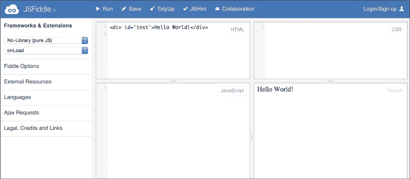
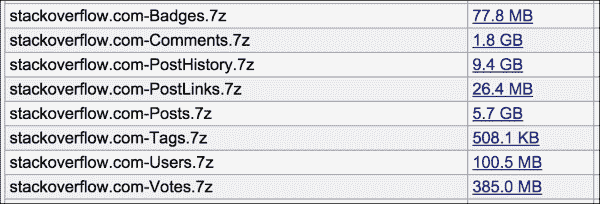
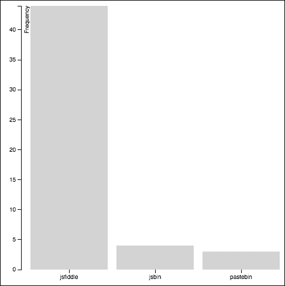

# 九、栈溢出项目

这是两个完整的、长达一章的项目中的第一个，在这个项目中，我们将把我们所学到的关于数据清理的一切都付诸实践。我们可以把每个项目想象成一个晚宴，在那里我们展示我们数据科学厨房中的最佳技能。要举办一次成功的晚宴，我们当然应该提前计划好菜单和宾客名单。然而，真正专家的标志是当事情没有完全按照计划进行时我们如何反应。我们都有过这样的时刻，尽管我们精心准备了食谱和购物清单，却忘了买一种重要的配料。我们能够调整我们的计划来迎接我们在前进道路上遇到的新挑战吗？

在这一章中，我们将使用公开发布的栈溢出数据库转储来处理一些数据清理。栈溢出是问答网站栈交换家族的一部分。在这些网站上，写出好的问题和答案可以为用户赢得积分和徽章，这些积分和徽章会随着时间的推移而积累。为了练习我们的数据清理技能，我们将使用我们在第 1 章[，*中介绍的六步法，为什么需要整洁的数据？*。](ch01.html "Chapter 1. Why Do You Need Clean Data?")

*   决定我们试图解决什么样的问题——我们为什么要看这些数据？
*   收集和存储我们的数据，包括下载和提取 Stack Overflow 提供的数据转储，创建一个 MySQL 数据库来保存数据，并编写脚本将数据导入 MySQL 数据库。因为栈溢出数据集非常庞大，我们还将创建一些较小的测试表，用随机选择的行填充。
*   在尝试清理整个数据集之前，对测试表执行一些尝试性清理任务。
*   分析数据。我们需要进行任何计算吗？是不是应该写一些聚合函数对数据进行计数或者求和？我们需要以某种方式转换数据吗？
*   如果可能的话，提供数据的可视化。
*   解决我们着手调查的问题。我们的流程有效吗？我们成功了吗？

这是一项繁重的工作，但是我们提前准备得越多，开始得越早，我们就越有可能成功举办数据科学晚宴。

# 第一步–提出一个关于栈溢出的问题

为了开始我们的项目，我们需要提出一个相当有趣的问题，需要一些简单的数据分析来回答。我们应该从哪里开始？首先，让我们回顾一下我们所知道的栈溢出。我们知道它是一个面向程序员的问答网站，我们可以假设程序员在他们提问和回答的问题中可能会使用大量的源代码、错误日志和配置文件。此外，我们知道，由于行长度、格式和其他可读性问题，有时在基于 web 的平台(如 Stack Overflow)上发布这种长文本转储可能会很尴尬。

看到如此多的问题和答案以及令人沮丧的大量文本，我不禁想知道 Stack Overflow 上的程序员是否曾经通过一个外部**粘贴站点**如 Pastebin 或 JSFiddle，例如[http://www.Pastebin.com](http://www.Pastebin.com)是一个网站，你可以在那里粘贴大量文本，如源代码或日志文件，该网站还给你一个简短的 URL，你可以与他人分享。大多数粘贴站点还允许源代码语法高亮显示，默认情况下栈溢出不会这样做。

在 IRC 和 e-mail 上使用粘贴站点是很常见的，但是在栈溢出时呢？一方面，就像在 IRC 或电子邮件中一样，提供链接可以使问题或答案更简短，因此问题的其余部分更容易阅读。但另一方面，根据所使用的粘贴站点，URL 不能保证永远有效。这个意味着一个问题或者一个答案可能会因为**链接腐烂**而随着时间失去价值。

像 JSFiddle 这样的工具以另一种方式使这个问题变得复杂。在像 JSFiddle 这样的**交互式粘贴**网站上，你不仅可以粘贴你的源代码并获得它的 URL，还可以允许其他人在浏览器中编辑和运行代码。这在栈溢出的问答场景中非常有用，尤其是在 JavaScript 这样基于浏览器的语言中。然而，链接腐烂的问题仍然存在。此外，对于初学者来说，JSFiddle 比 Pastebin 等简单的代码转储站点更难使用。



JSFiddle 有四个窗口，分别用于 HTML、CSS、JavaScript 和结果。

### 注意

在关于栈溢出的社区讨论区，关于是否应该使用粘贴站点，以及对于包含粘贴站点链接但没有实际代码的问题或答案应该采取什么样的政策，已经有了相当多的争论。一般来说，尽管人们倾向于认为粘贴站点是有用的，但是他们也认识到保护栈溢出本身的寿命和效用是很重要的。社区决定应该避免发布只有链接而没有代码的问题或答案。如果你想回顾这次讨论，一个很好的起点是这个链接:[http://meta.stackexchange.com/questions/149890/](http://meta.stackexchange.com/questions/149890/)。

就我们的目的而言，我们不需要在这场辩论中选择立场。相反，我们可以问一些简单的数据驱动的问题，比如:

1.  人们在 Stack Overflow 上使用 Pastebin 和 JSFiddle(以及其他类似的粘贴网站)这样的工具的频率有多高？
2.  他们在问题中还是在答案中更多地使用粘贴网站？
3.  引用粘贴网站 URL 的帖子往往也包含源代码；如果有，多少？

当我们收集、存储和清理栈溢出数据时，我们可以用这些问题来激励自己。即使这些问题中有一些太难或不可能回答，记住我们的总体目标将有助于指导我们需要做的清洁类型。把我们的问题放在我们脑海的最前面会阻止我们偏离太远，或者执行那些将被证明是毫无意义或浪费时间的任务。


# 第二步——收集并存储栈溢出数据

在撰写本文时，Stack Exchange 向提供他们整个网站家族的数据——包括 Stack Overflow——作为 XML 文件，供任何人免费下载。在本节中，我们将下载栈溢出文件，并将数据导入 MySQL 服务器上的数据库。最后，出于测试目的，我们将创建这些表的几个较小版本。

## 下载栈溢出数据转储

Stack Exchange 提供的所有数据都可以在互联网档案馆下载。在撰写本文时，2014 年 9 月的转储是最新的一次。每个栈交换站点都有一个或多个文件，每个文件都链接到这个详情页:【https://archive.org/details/stackexchange】T2。

我们只对按字母顺序排列的八个栈溢出文件感兴趣，如下表所示:



Archive.org 清单显示了我们感兴趣的八个栈溢出文件。

对于列表中的每个文件，右键单击链接并指示浏览器将文件保存到磁盘。

## 将文件解压缩

注意每个文件都有一个`.7z`扩展名。这是一种压缩的存档格式。可以使用匹配的 7-Zip 软件或其他兼容的软件包对其进行解压缩和解压缩。7-Zip 不是我们在[第 2 章](ch02.html "Chapter 2. Fundamentals – Formats, Types, and Encodings")、*基础——格式、类型和编码*中讨论的常见文件归档程序之一，而且你可能还没有在你的计算机上安装兼容的解归档程序，所以我们可以认为这是我们需要解决的第一个小问题。尝试双击文件打开它，但是如果您没有安装与`.7z`扩展名相关的软件，您将需要安装一个合适的 7-Zip 解压缩程序。

*   对于 Windows，你可以从他们的网站下载 7-Zip 软件:[http://www.7-zip.org](http://www.7-zip.org)
*   对于 Mac OS X，你可以下载并安装 Unarchiver，这是一个免费的工具，可以在 [http://unarchiver.c3.cx](http://unarchiver.c3.cx) 找到

安装好软件后，依次解压每个文件。未压缩的文件非常大，所以请确保您有足够大的磁盘空间来保存它们。

### Tip

在我的系统上，比较压缩和未压缩的文件大小显示，未压缩版本比压缩版本大十倍。根据您正在使用的系统的规格，每个文件也需要几分钟的时间来解压缩，因此请为这一步留出时间。

## 创建 MySQL 表并加载数据

我们现在有八个`.xml`文件，每个将映射到我们将要构建的数据库中的一个表。要创建数据库和表格，我们可以使用 phpMyAdmin 或其他图形工具点击，或者我们可以运行以下由 https://gist.github.com/gousiosg/7600626[的圣乔治·古西奥斯编写的简单 SQL。这段代码包括前六个表的`CREATE`和`LOAD INFILE`语句，但是自从编写这个脚本以来，数据库转储已经添加了两个额外的表。](https://gist.github.com/gousiosg/7600626)

为了构建新的表结构，我们可以在终端窗口或 shell 中运行`head`命令，以便检查该文件的前几行。从终端，在最小的 XML 文件`PostLinks.xml`上运行它，如下所示:

```sql
head PostLinks.xml

```

结果的前四行如下所示:

```sql
<?xml version="1.0" encoding="utf-8"?>
<postlinks>
 <row Id="19" CreationDate="2010-04-26T02:59:48.130" PostId="109" RelatedPostId="32412" LinkTypeId="1" />
 <row Id="37" CreationDate="2010-04-26T02:59:48.600" PostId="1970" RelatedPostId="617600" LinkTypeId="1" />

```

新数据库表中的每一行都应该对应于 XML `<row>`行中的一行，行中显示的每个属性代表数据库表中的一列。我们可以在`Tags.xml`文件上执行相同的`head`命令来查看它的列应该是什么。以下 SQL 代码将处理另外两个表的`CREATE`语句和`LOAD`语句:

```sql
CREATE TABLE post_links (
  Id INT NOT NULL PRIMARY KEY,
  CreationDate DATETIME DEFAULT NULL,
  PostId INT NOT NULL,
  RelatedPostId INT NOT NULL,
  LinkTypeId INT DEFAULT NULL
);

CREATE TABLE tags (
  Id INT NOT NULL PRIMARY KEY,
  TagName VARCHAR(50) DEFAULT NULL,
  Count INT DEFAULT NULL,
  ExcerptPostId INT DEFAULT NULL,
  WikiPostId INT DEFAULT NULL
);

LOAD XML LOCAL INFILE 'PostLinks.xml'
INTO TABLE post_links
ROWS IDENTIFIED BY '<row>';

LOAD XML LOCAL INFILE 'Tags.xml'
INTO TABLE tags
ROWS IDENTIFIED BY '<row>';
```

### 注意

注意,`LOAD XML`的语法略有变化，这样我们可以将文件保存在本地。如果您的`.xml`文件在您的本地机器上，而不是在数据库服务器本身上，只需将单词`LOCAL`添加到`LOAD XML`语句中，如前面的代码所示，您就可以引用文件的完整路径。

关于 MySQL 语法的更多信息在 MySQL 文档中描述如下:【http://dev.mysql.com/doc/refman/5.5/en/load-xml.html】T2。

此时，我们有了一个功能齐全的 MySQL 数据库，它由八个表组成，每个表都充满了数据。然而，这些桌子非常大。只有八个表中有超过 1.9 亿行。当我们开始清理数据并准备分析时，我们会注意到一件事，那就是如果我们在像`posts`、`comments`、`votes`或`post_history`这样的大型表上出错，重建该表将需要很长时间。在下一步中，我们将学习如何创建测试表，以便在我们的某个程序或查询出错时，我们可以控制损失。

## 构建测试表

在这个部分中，我们将构建原始表的八个较小版本，每个版本随机填充原始表中的数据。

我们的第一步是重新运行`CREATE`语句，但是这一次在每个表名前加上前缀`test_`，如下表所示:

```sql
DROP TABLE IF EXISTS test_post_links;
CREATE TABLE test_post_links (
  Id INT NOT NULL PRIMARY KEY,
  CreationDate INT,
  PostId INT,
  RelatedPostId INT,
  LinkTypeId INT
);
```

除了在表名前面添加了`test_`之外，这八个测试表将与我们之前制作的其他测试表相同。

接下来，我们需要用数据填充新的测试表。我们可以简单地从每个表中选择前 1000 行，并将它们加载到我们的测试表中。但是，这样做的缺点是，行是根据它们插入栈溢出数据库的时间来排序的，因此，如果我们只要求前 1，000 行，我们的子集中就没有来自不同日期和时间的行的良好样本。我们希望我们选择的行具有相当随机的分布。我们如何随机选择一组行？我们以前在本书中没有处理过这个问题，所以这里有另一个例子，我们必须准备好尝试新事物，以便让我们的数据科学晚宴顺利进行。

有几种选择随机行的可能性，其中一些比另一些更有效。在这个项目中，效率对我们很重要，因为我们使用的表非常大。有一件事让我们的随机行选择比预期的要复杂一些，那就是虽然我们的表有一个数字主键作为`Id`列，但是这些`Id`数字并不是连续的。有很多漏洞，例如在`post_links`表中，`Id`列的前几个值是 19、37、42 和 48。

数据中的漏洞是有问题的，因为一个简单的随机数发生器是这样工作的:

1.  构建一个 PHP 脚本，要求表中的最低和最高`Id`值，像这样:

    ```sql
    SELECT min(Id) FROM post_links;
    SELECT max(Id) FROM post_links;
    ```

2.  然后，仍然在脚本中，在`min`和`max`值之间生成一些随机数，并请求具有该随机值的行:

    ```sql
    SELECT * FROM post_links WHERE Id = [random value];
    ```

3.  根据需要对任意多行重复步骤 2。

不幸的是，在栈溢出数据库表中这样做，例如在我们的`post_links`表上，将导致许多失败的查询，因为我们的数据在`Id`列中有如此多的漏洞，例如，如果前面例子中的步骤 2 生成数字 38 会怎样？我们的`post_links`表中没有 38 的`Id`。这意味着我们需要检测这个错误，并用一个新的随机值再试一次。

### 注意

在这一点上，懂一点 SQL 的人——但不是很多——通常会建议我们只需要让 MySQL 对带有`Id`的列执行`ORDER BY rand()`,然后执行一个`LIMIT`命令来获取我们想要的记录数。这种想法的问题是，即使我们要排序的列是索引列，`ORDER BY rand()`也必须读取每一行，以便给它分配一个新的随机数。因此，在一个非常大的表上，比如我们在栈溢出数据库中的表，这根本不能伸缩。对于一个`ORDER BY rand()`查询的完成，我们将会等待太久。`ORDER BY rand()`对于小桌子来说是一个可以接受的解决方案，但对于我们正在处理的尺寸来说就不合适了。

下面的 PHP 脚本展示了我们最终的随机行选择过程将如何构建八个测试表，每个测试表正好有 1，000 行。每个表将由尽可能随机选择的行值填充，尽可能不费力，并且不需要我们过度设计这个简单的问题:

```sql
<?php //randomizer.php
// how many rows should be in each of the test tables?
$table_target_size = 1000;

// connect to db, set up query, run the query
$dbc = mysqli_connect('localhost','username','password','stackoverflow')
       or die('Error connecting to database!' . mysqli_error());
$dbc->set_charset("utf8");

$tables = array("badges",
    "comments",
    "posts",
    "post_history",
    "post_links",
    "tags",
    "users",
    "votes");

foreach ($tables as $table)
{
  echo "\n=== Now working on $table ===\n";
    $select_table_info = "SELECT count(Id) as c, min(Id) as mn, max(Id) as mx FROM $table";
    $table_info = mysqli_query($dbc, $select_table_info);
    $table_stuff = mysqli_fetch_object($table_info);
    $table_count = $table_stuff->c;
    $table_min = $table_stuff->mn;
    $table_max = $table_stuff->mx;

    // set up loop to grab a random row and insert into new table
    $i=0;
    while($i < $table_target_size)
    {
        $r = rand($table_min, $table_max);
        echo "\nIteration $i: $r";
        $insert_rowx = "INSERT IGNORE INTO test_$table (SELECT * FROM $table WHERE Id = $r)";
        $current_row = mysqli_query($dbc, $insert_rowx);

        $select_current_count = "SELECT count(*) as rc FROM test_$table";
        $current_count= mysqli_query($dbc, $select_current_count);
        $row_count = mysqli_fetch_object($current_count)->rc;
        $i = $row_count;
    }
}
?>
```

在运行完这段代码之后，我们可以看到，如果需要的话，我们可以选择八个测试表。使用这些较小的桌子进行测试可以确保我们的清洁工作进行得更加顺利，错误也可以得到控制。如果我们发现我们的随机表中需要更多的行，我们可以简单地发出`$table_target_size`命令并再次运行它。

一旦你知道用一种简单而有用的方式创建测试表是多么容易，那么构建测试表就是一个很好的习惯。


# 第三步——清理数据

记住我们的目标是开始分析某些 URL 在问题、答案和评论中被引用的频率，从栈溢出`posts`和`comments`表的文本开始是有意义的。然而，由于这些表非常大，我们将使用刚刚创建的`test_posts`和`test_comments`表。然后，一旦我们确信查询运行良好，我们就可以在更大的表上重新运行它们。

这个清理任务非常类似于我们在[第 7 章](ch07.html "Chapter 7. RDBMS Cleaning Techniques")、 *RDBMS 清理技术*中存储从 tweets 中提取的 URL 的方式。但是，这个项目有自己的一套具体规则:

*   由于帖子和评论是不同的实体，我们应该为来自帖子(包括问题和回答)的 URL 和来自评论的 URL 创建单独的表。
*   每个问题、答案或评论都可以包含多个 URL。我们应该存储所有的 URL，我们还应该跟踪 URL 来自哪个帖子或评论的唯一标识符。
*   每个问题和答案也可以包含格式化的源代码。`<code>`标签用于在栈溢出帖子中分隔源代码。将代码从帖子中分离出来将有助于我们回答粘贴站点 URL 和源代码共存的问题。如果有的话，这种链接通常会附带多少代码？

    ### 注意

    从技术上讲,没有标签`<code>`也可以创建帖子*，但是通常有人会快速编辑错误的帖子以包含这些有用的标签,并且会因此获得栈溢出点。为了简洁起见,在这个项目中,我们假设代码包含在`<code>`标签中*

*   *根据栈溢出数据库转储文档(可在[http://meta.stackexchange.com/questions/2677/](http://meta.stackexchange.com/questions/2677/)获得)，实际上有八类帖子，其中问答只是两类。因此，我们需要将我们的查询限制在问题为`postTypeId=1`而答案为`postTypeId=2`的帖子上。*
*   *为了确保我们只从问题或答案的评论中提取 URL，而不是其他类型的帖子，我们需要连接回 posts 表，并将结果限制为`postTypeId=1`或`postTypeId=2`。*

## *创建新表格*

*创建我们需要存储这些 URL 的数据库表的 SQL 查询如下:*

```sql
*CREATE TABLE clean_comments_urls (
  id INT NOT NULL AUTO_INCREMENT PRIMARY KEY,
  commentId INT NOT NULL,
  url VARCHAR(255) NOT NULL
) ENGINE=MyISAM  DEFAULT CHARSET=utf8;

CREATE TABLE IF NOT EXISTS clean_posts_urls (
  id INT NOT NULL AUTO_INCREMENT PRIMARY KEY,
  postId INT NOT NULL,
  url VARCHAR(255) NOT NULL
) ENGINE=MyISAM  DEFAULT CHARSET=utf8;*
```

*我们还需要创建一个表来保存我们从帖子中提取的代码:*

```sql
*CREATE TABLE clean_posts_code (
  id INT NOT NULL AUTO_INCREMENT PRIMARY KEY,
  postId INT NOT NULL,
  code TEXT NOT NULL
) ENGINE=MyISAM DEFAULT CHARSET=utf8;*
```

*此时，我们有了三个新的表来存储我们清理过的 URL 和源代码。在下一节中，我们将提取 URL 和代码，并填充这些新表。*

## *提取 URL 并填充新表*

*我们可以修改我们之前在[第 7 章](ch07.html "Chapter 7. RDBMS Cleaning Techniques")、 *RDBMS 清理技术*中编写的脚本，在这个新的栈溢出环境中提取 URL，如下所示:*

```sql
*<?php // urlExtractor.php
// connect to db
$dbc = mysqli_connect('localhost', 'username', 'password', 'stackoverflow')
    or die('Error connecting to database!' . mysqli_error());
$dbc->set_charset("utf8");

// pull out the text for posts with
// postTypeId=1 (questions)
// or postTypeId=2 (answers)
$post_query = "SELECT Id, Body
    FROM test_posts
    WHERE postTypeId=1 OR postTypeId=2";

$comment_query = "SELECT tc.Id, tc.Text
    FROM test_comments tc
    INNER JOIN posts p ON tc.postId = p.Id
    WHERE p.postTypeId=1 OR p.postTypeId=2";

$post_result = mysqli_query($dbc, $post_query);
// die if the query failed
if (!$post_result)
    die ("post SELECT failed! [$post_query]" .  mysqli_error());

// pull out the URLS, if any
$urls = array();
$pattern  = '#\b(([\w]+://?|www[.])[^\s()<>]+(?:\([\w\d]+\)|([^[:punct:]\s]|/)))#';

while($row = mysqli_fetch_array($post_result))
{
    echo "\nworking on post: " . $row["id"];
    if (preg_match_all(
        $pattern,
        $row["Body"],
        $urls
    ))
    {
        foreach ($urls[0] as $url)
        {
          $url = mysqli_escape_string($dbc, $url);
            echo "\n----url: ".$url;
            $post_insert = "INSERT INTO clean_posts_urls (id, postid, url)
                VALUES (NULL," . $row["Id"] . ",'$url')";
            echo "\n$post_insert";
            $post_insert_result = mysqli_query($dbc, $post_insert);
        }
    }
}

$comment_result = mysqli_query($dbc, $comment_query);
// die if the query failed
if (!$comment_result)
    die ("comment SELECT failed! [$comment_query]" .  mysqli_error());

while($row = mysqli_fetch_array($comment_result))
{
    echo "\nworking on comment: " . $row["id"];
    if (preg_match_all(
        $pattern,
        $row["Text"],
        $urls
    ))
    {
        foreach ($urls[0] as $url)
        {
            echo "\n----url: ".$url;
            $comment_insert = "INSERT INTO clean_comments_urls (id, commentid, url)
                VALUES (NULL," . $row["Id"] . ",'$url')";
            echo "\n$comment_insert";
            $comment_insert_result = mysqli_query($dbc, $comment_insert);
        }
    }
}
?>*
```

*我们现在已经完全填充了`clean_post_urls`和`clean_comment_urls`表。对于我随机填充的测试表，运行这个脚本只会产生大约 100 个评论 URL 和 700 个帖子 URL。尽管如此，在完整数据集上运行之前，这足以测试我们的想法。*

## *提取代码并填充新表格*

*为了提取嵌入在`<code>`标签中的文本并填充我们的新`clean_posts_code`表，我们可以运行下面的脚本。它类似于 URL 提取器，除了它不需要搜索评论，因为那些评论没有用`<code>`标签分隔的代码。*

*在我的随机选择的测试表版本中，最初的`SELECT`在`test_post`表的 1000 行中产生了大约 800 行。但是，每篇文章中可以有多个代码片段，所以最终的表格有 2000 多行。下面的 PHP 代码提取嵌入在`<code>`标签中的文本:*

```sql
*<?php // codeExtractor.php
// connect to db
$dbc = mysqli_connect('localhost', 'username, 'password', 'stackoverflow')
    or die('Error connecting to database!' . mysqli_error());
$dbc->set_charset("utf8");

// pull out the text for posts with
// postTypeId=1 (questions)
// or postTypeId=2 (answers)
$code_query = "SELECT Id, Body
    FROM test_posts
    WHERE postTypeId=1 OR postTypeId=2
    AND Body LIKE '%<code>%'";

$code_result = mysqli_query($dbc, $code_query);
// die if the query failed
if (!$code_result)
    die ("SELECT failed! [$code_query]" .  mysqli_error());

// pull out the code snippets from each post
$codesnippets = array();
$pattern  = '/<code>(.*?)<\/code>/';

while($row = mysqli_fetch_array($code_result))
{
    echo "\nworking on post: " . $row["Id"];
    if (preg_match_all(
        $pattern,
        $row["Body"],
        $codesnippets
    ))
    {
      $i=0;
        foreach ($codesnippets[0] as $code)
        {
          $code = mysqli_escape_string($dbc, $code);
            $code_insert = "INSERT INTO clean_posts_code (id, postid, code)
                VALUES (NULL," . $row["Id"] . ",'$code')";
            $code_insert_result = mysqli_query($dbc, $code_insert);
            if (!$code_insert_result)
                die ("INSERT failed! [$code_insert]" .  mysqli_error());
            $i++;
        }
        if($i>0)
        {
          echo "\n   Found $i snippets";
        }
    }
}
?>*
```

*我们现在有了在每个帖子中打印的所有代码的列表，并且我们已经将它存储在`clean_post_code`表中。*

*

# 第四步——分析数据

在这个部分，我们写一些代码来回答本章开头的三个问题。我们有兴趣发现:

*   帖子和评论中 URL 提到的不同粘贴站点的数量
*   与回答相比，问题中粘贴站点 URL 的计数
*   关于`<code>`在粘贴站点 URL 的帖子中的流行率的统计数据

## 哪些粘贴网站最受欢迎？

为了回答第一个问题，我们将使用`clean_posts_urls`和`clean_comments_urls`表生成粘贴站点 URL 和计数的 JSON 表示。这个简单的分析将帮助我们找出哪些 pastebin 网站在这个栈溢出数据转储中受欢迎。下面的 PHP 在数据库中查询我们在`$pastebins`数组中预先列出的粘贴站点，然后对帖子和评论中的匹配 URL 进行计数。它使用测试表，所以数字比我们使用真实表时要小得多:

```sql
<?php // q1.php
// connect to db
$dbc = mysqli_connect('localhost', 'username', 'password', 'stackoverflow')
    or die('Error connecting to database!' . mysqli_error());
$dbc->set_charset("utf8");

// these are the web urls we want to look for and count
$pastebins = array("pastebin",
    "jsfiddle",
    "gists",
    "jsbin",
    "dpaste",
    "pastie");
$pastebin_counts = array();

foreach ($pastebins as $pastebin)
{
    $url_query = "SELECT count(id) AS cp,
          (SELECT count(id)
          FROM clean_comments_urls
          WHERE url LIKE '%$pastebin%') AS cc
        FROM clean_posts_urls
        WHERE url LIKE '%$pastebin%'";
    $query = mysqli_query($dbc, $url_query);
    if (!$query)
        die ("SELECT failed! [$url_query]" .  mysqli_error());
    $result = mysqli_fetch_object($query);
    $countp = $result->cp;
    $countc = $result->cc;
    $sum = $countp + $countc;

    array_push($pastebin_counts, array('bin' => $pastebin,
                                        'count' => $sum));
}
// sort the final list before json encoding it
// put them in order by count, high to low
foreach ($pastebin_counts as $key => $row)
{
    $first[$key]  = $row['bin'];
    $second[$key] = $row['count'];
}

array_multisort($second, SORT_DESC, $pastebin_counts);
echo json_encode($pastebin_counts);
?>
```

通过查看脚本的输出，我们可以查看针对测试表运行该脚本时的 JSON 输出。我的随机行产生了以下计数:

```sql
[{"bin":"jsfiddle","count":44},{"bin":"jsbin","count":4},{"bin":"pastebin","count":3},{"bin":"dpaste","count":0},{"bin":"gists","count":0},{"bin":"pastie","count":0}]
```

### 注意

请记住，您的值可能是不同的，因为您有一个不同的随机选择的网址。

当我们转到本章的*步骤 5——可视化数据*部分时，我们将使用这个 JSON 代码来构建一个条形图。但首先，让我们回答我们之前提出的另外两个问题。

## 哪些贴吧在提问中受欢迎，哪些在回答中受欢迎？

我们的第二个问题是，T2 网址是在问题帖子还是回答帖子中更常见。为了得到这个答案，我们将运行一系列 SQL 查询。第一个查询简单地询问每种类型的`clean_posts_urls`表中有多少帖子，包括问题和答案:

```sql
SELECT tp.postTypeId, COUNT(cpu.id)
FROM test_posts tp
INNER JOIN clean_posts_urls cpu ON tp.Id = cpu.postid
GROUP BY 1;
```

结果显示，在我随机选择的测试集中，我有 237 个问题和 440 个答案:


phpMyAdmin 显示了问题 URL 和答案 URL 的数量。

现在，我们想知道这个问题的答案:在这 677 个 URL 中，按问题和答案划分，有多少个引用了六个 pastebin URLs 中的一个？我们可以运行以下 SQL 代码来找出答案:

```sql
SELECT  tp.postTypeId, count(cpu.id)
FROM test_posts tp
INNER JOIN clean_posts_urls cpu ON tp.Id = cpu.postId
WHERE cpu.url LIKE '%jsfiddle%'
OR cpu.url LIKE '%jsbin%'
OR cpu.url LIKE '%pastebin%'
OR cpu.url LIKE '%dpaste%'
OR cpu.url LIKE '%gist%'
OR cpu.url LIKE '%pastie%'
GROUP BY 1;
```

结果如下表所示。共有 18 个问题涉及其中一个粘贴站点，而 24 个答案涉及其中一个粘贴站点。


phpMyAdmin 显示引用 pastebin 的问题和答案 URL 的数量。

关于这些查询，需要记住的一点是，它们计算的是单个的 URL。因此，如果某个特定的 `postId`引用了五个 URL，那么这些就会被计数五次。如果我想知道有多少帖子使用了一次或多次粘贴站点 URL，我需要修改两个查询的第一行，如下所示。该查询对 URLs 表中的不同发布进行计数:

```sql
SELECT tp.postTypeId, COUNT(DISTINCT cpu.postId)
FROM test_posts tp
INNER JOIN clean_posts_urls cpu ON tp.Id = cpu.postId
GROUP BY 1;
```

以下屏幕截图显示了包含 URL 的问题和答案的数量:


phpMyAdmin 显示有多少问题和答案包含任何 URL。

该查询对 URLs 表中提到粘贴站点的特定帖子进行计数:

```sql
SELECT  tp.postTypeId, count(DISTINCT cpu.postId)
FROM test_posts tp
INNER JOIN clean_posts_urls cpu ON tp.Id = cpu.postId
WHERE cpu.url LIKE '%jsfiddle%'
OR cpu.url LIKE '%jsbin%'
OR cpu.url LIKE '%pastebin%'
OR cpu.url LIKE '%dpaste%'
OR cpu.url LIKE '%gist%'
OR cpu.url LIKE '%pastie%'
GROUP BY 1;
```

这个粘贴站点查询的结果如下，正如所料，数字较小。在我们的测试集中， **11** 个问题使用了至少一个 pastebin URL，同样的还有 **16** 个答案。总共有 37 篇帖子至少引用了一次 pastebin URL。


PhpMyAdmin 显示了有多少问题和答案包含了粘贴站点的 URL。

甚至虽然这些结果似乎表明人们在回答中比在问题中更多地引用了粘贴网站的 URL，但我们需要在问题和回答的总数方面对它们进行比较。我们应该报告我们的结果值占该帖子类型、问题或答案总数的百分比。考虑到总数，我们现在可以这样说:“仅考虑使用任何类型的 URL 至少一次的问题和答案，81 个问题中的 11 个至少使用了一个粘贴站点 URL(13.6%)，222 个答案中的 16 个至少使用了一个粘贴站点 URL(7.2%)。”考虑到这一点，看起来在提到一个粘贴网站时，问题实际上超过了答案，几乎是二比一。

在任何数据分析项目的这一点上，您一定有大量的问题，比如:

*   随着时间的推移，在问答中粘贴站点 URL 的用法有什么变化？
*   关于粘贴站点 URL 的问题在投票和收藏夹中表现如何？
*   用粘贴站点网址发帖提问的用户有什么特点？

但既然这是一本关于数据清洗的书，又既然我们至今连这些数据都还没有可视化，我就克制一下，暂时不回答这些。我们仍然需要回答最初三个问题中的一个，然后我们将继续可视化我们的一些结果。

## 帖子是否同时包含粘贴站点的 URL 和源代码？

回答我们的第三个问题需要我们将栈溢出问题中的代码量与栈溢出答案中的代码量进行比较，特别注意包含某种源代码的帖子，由`<code>`标记分隔。在*步骤三——清理数据*部分，我们从测试表的帖子中提取了所有代码，并创建了一个新表来保存这些代码片段。现在，一个简单的查询可以计算出有多少包含代码的帖子，如下所示:

```sql
SELECT count(DISTINCT postid)
FROM clean_posts_code;
```

在我的样本集中，在总共 1，000 篇测试文章中，这产生了 664 篇包含代码的文章。另一种说法是:1000 个帖子中有 664 个包含至少一个`标签。`

要计算出这些包含代码的帖子中有多少还包含 URL，我们可以运行以下 SQL 查询:

```sql
SELECT count(DISTINCT cpc.postid)
FROM clean_posts_code cpc
INNER JOIN clean_posts_urls cpu
ON cpu.postId = cpc.postId;
```

我的样本集为此生成了 175 行。我们可以这样解释，1000 篇帖子的原始测试集中有 17.5%包含代码和 URL。

现在，为了确定有多少包含代码的帖子还包含粘贴站点 URL，我们将进一步缩小 SQL 查询的范围:

```sql
SELECT count(DISTINCT cpc.postid)
FROM clean_posts_code cpc
INNER JOIN clean_posts_urls cpu
ON cpu.postId = cpc.postId
WHERE cpu.url LIKE '%jsfiddle%'
OR cpu.url LIKE '%jsbin%'
OR cpu.url LIKE '%pastebin%'
OR cpu.url LIKE '%dpaste%'
OR cpu.url LIKE '%gist%'
OR cpu.url LIKE '%pastie%';
```

从这些结果中，我们可以看到只有 25 个帖子包含源代码和粘贴站点 URL。从第二个问题中，我们知道 37 个不同的帖子(包括问题和答案)至少使用过一次某种粘贴网站 URL。所以，37 个中的 25 个大约是 68%。在更大的数据集上运行这些查询，看看这些值是如何产生的，这将会很有趣。

与此同时，我们将对至少一个问题进行一些简单的可视化，这样我们就可以完成一轮完整的数据科学六步流程。


# 第五步——可视化数据

视觉化步骤有点像我们晚餐聚会上的甜点。每个人都喜欢丰富的图形，它们看起来很漂亮。然而，由于我们在本书中的重点是清理，而不是分析和可视化，我们在这里的图形将非常简单。在下面的代码中，我们将使用 JavaScript D3 可视化库以图形方式显示第一个问题的结果。这个可视化将比我们在[第 4 章](ch04.html "Chapter 4. Speaking the Lingua Franca – Data Conversions")、*说通用语-数据转换*中做的 D3 可视化简单得多。在那一章，你会记得我们建立了一个相当复杂的网络图，但在这里，一个简单的条形图就足够了，因为我们需要显示的只是一些标签和计数。

HTML 和 JavaScript/D3 代码如下。这段代码扩展了由迈克·博斯托克撰写的*让我们构建一个条形图*教程，可在[http://bl.ocks.org/mbostock/3885304](http://bl.ocks.org/mbostock/3885304)获得。我扩展这段代码的方法之一是让它读取我们之前在`q1.php`脚本中生成的 JSON 文件。我们的 JSON 文件打印得非常好，并且已经按照从高到低的顺序进行了排序，因此根据它构建一个小小的条形图将会很容易:

```sql
<!DOCTYPE html>
<meta charset="utf-8">
<!--
this code is modeled on mbostock's
"Let's Make a Bar Chart" D3 tutorial
available at http://bl.ocks.org/mbostock/3885304
My modifications:
* formatting for space
* colors
* y axis labels
* changed variable names to match our data
* loads data via JSON rather than .tsv file
-->

<style>
.bar {fill: lightgrey;}
.bar:hover {fill: lightblue;}
.axis {font: 10px sans-serif;}
.axis path, .axis line {
  fill: none;
  stroke: #000;
  shape-rendering: crispEdges;
}
.x.axis path {display: none;}
</style>
<body>
<script src="d3.min.js"></script>
<script>

var margin = {top: 20, right: 20, bottom: 30, left: 40},
    width = 960 - margin.left - margin.right,
    height = 500 - margin.top - margin.bottom;

var x = d3.scale.ordinal()
    .rangeRoundBands([0, width], .1);

var y = d3.scale.linear()
    .range([height, 0]);

var xAxis = d3.svg.axis()
    .scale(x)
    .orient("bottom");

var yAxis = d3.svg.axis()
    .scale(y)
    .orient("left");

var svg = d3.select("body").append("svg")
    .attr("width", width + margin.left + margin.right)
    .attr("height", height + margin.top + margin.bottom)
  .append("g")
    .attr("transform", "translate(" + margin.left + "," + margin.top + ")");

d3.json("bincounter.php", function(error, json)
{
    data = json;
    draw(data);
});

function draw(data)
{
  x.domain(data.map(function(d) { return d.bin; }));
  y.domain([0, d3.max(data, function(d) { return d.count; })]);

  svg.append("g")
      .attr("class", "x axis")
      .attr("transform", "translate(0," + height + ")")
      .call(xAxis);

  svg.append("g")
      .attr("class", "y axis")
      .call(yAxis)
    .append("text")
      .attr("transform", "rotate(-90)")
      .attr("y", 6)
      .attr("dy", ".71em")
      .style("text-anchor", "end")
      .text("Frequency");

  svg.selectAll(".bar")
      .data(data)
    .enter().append("rect")
      .attr("class", "bar")
      .attr("x", function(d) { return x(d.bin) ; })
      .attr("width", x.rangeBand())
      .attr("y", function(d) { return y(d.count); })
      .attr("height", function(d) { return height - y(d.count); });
}

</script>
</body>
</html>
```

我们可以将此保存为`q1chart.html`，并在浏览器中查看。该代码调用我们的`q1.php`脚本，该脚本生成 JSON 文件，然后 D3 使用该文件构建该图表，图表的左侧如下所示:



D3 从三个 URL 中产生的 JSON 的可视化。

条形图显示，指向 JSFiddle 的 URL 似乎是最常见的，至少在我随机选择的测试数据集版本中是这样。我们通过查看来自`q1.php`的 JSON 输出就知道了这一点，但是也很高兴以图形方式看到它。在下一部分，我们将总结结果和我们的程序，并讨论这个项目下一步的方向。


# 第六步——解决问题

从我们在*步骤四——分析数据*和*步骤五——可视化数据*部分开发的查询和可视化，我们现在可以尝试回答最初促成这个项目的三个问题中的每一个。

对于我们的第一个问题，我们希望找到帖子和评论中 URL 提到的不同粘贴站点的数量。我们制作的用于可视化数据的`q1.php`脚本和条形图显示，至少在测试数据中，JSFiddle 是我们查看的六个粘贴站点 URL 中最常被引用的。

第二个问题是关于粘贴网址在问题或答案中是否更普遍。我们的查询显示，粘贴站点 URL 出现在问题中的可能性是出现在答案中的两倍，但两者的数量都非常小，至少在我们的测试集中是这样。

对于第三个问题，我们想看看人们是否真的注意到栈溢出的建议，除了粘贴站点 URL 之外还发布代码。在我们的测试集中，查询显示 25 个帖子(总共 37 个)包含粘贴站点 URL 和推荐的附带源代码的。这是大约 68%的符合率。

在这一点上，我们可以问和回答许多其他的问题，我们可以用许多令人兴奋的方法将这个简单的研究扩展到更有趣的东西。不过现在，我们将关注扩展这个项目以使用完整数据集所需的存储和清理过程。


# 从测试表移动到满表

在这个项目的开始，我们制作了一组测试表,这样我们可以在一个没有压力的环境中使用每个只有 1000 行的表来开发我们的项目。在我们不确定查询是否会如我们所愿地工作，或者我们想要试验复杂的连接、子查询、奇怪的正则表达式等等的情况下，使用行数易于管理的小表是很重要的。不过，在这一点上，如果我们对已经编写的查询和脚本感觉良好，那么是时候重写我们的过程以使用全尺寸的表了。

下面是我们将项目转移到全尺寸桌子的步骤:

1.  `DROP`测试表:

    ```sql
    DROP TABLE IF EXISTS test_badges;
    DROP TABLE IF EXISTS test_comments;
    DROP TABLE IF EXISTS test_posts;
    DROP TABLE IF EXISTS test_post_history;
    DROP TABLE IF EXISTS test_post_links;
    DROP TABLE IF EXISTS test_tags;
    DROP TABLE IF EXISTS test_users;
    DROP TABLE IF EXISTS test_votes;
    ```

2.  清空`cleaned_posts_code`、`cleaned_posts_urls`、`cleaned_comments_urls`表如下:、

    ```sql
    TRUNCATE TABLE cleaned_posts_code;
    TRUNCATE TABLE cleaned_posts_urls;
    TRUNCATE TABLE cleaned_comments_urls;
    ```

    、
3.  从`posts`表而不是`test_posts`表编辑`urlExtractor.php`和`codeExtractor.php`脚本到`SELECT`。这些查询可以编辑如下:

    ```sql
    SELECT Id, Body FROM posts
    ```

4.  重新运行`urlExtractor.php`和`codeExtractor.php`脚本，这样它们将重新填充我们之前清空(截断)的整洁代码和 URL 表。

在这个点，我们已经清理好代码和 URL 表准备好进行分析和可视化。在执行这些步骤时，请不要着急，要知道许多查询和脚本可能需要很长时间才能完成。posts 表非常大，我们编写的许多查询都是针对使用通配符的文本列选择的。


# 总结

在这个项目中，我们提出了几个关于栈溢出的 URL 流行的问题，特别是那些与粘贴网站相关的问题，如[http://www.Pastebin.com](http://www.Pastebin.com)和[http://www.JSFiddle.net](http://www.JSFiddle.net)。为了开始回答这些问题，我们从 Stack Exchange public file release 下载了栈溢出公告中的数据(以及其他栈溢出数据)。我们构建了一个 MySQL 数据库和八个表来保存这些数据。然后，我们为每个表创建了较小的 1000 行版本，用于测试目的，并使用随机选择的数据样本进行填充。从这些测试表中，我们提取了每个问题、答案和评论中提到的 URL，并将它们保存到一个新的整洁的表中。我们还提取了问题和答案中的源代码，并将这些片段保存到一个新表中。最后，我们能够构建一些简单的查询和可视化来帮助我们回答开始时提出的问题。

尽管结果一般，但从数据清理的角度来看，我们的晚宴还是成功的。我们能够制定一个连贯的计划，并采取系统的步骤将计划付诸行动，并在需要时进行修改。我们现在已经准备好了我们的最后一个项目，以及一份完全不同的晚宴菜单。

在下一章，我们将收集和清理我们自己版本的著名 Twitter 数据集。*