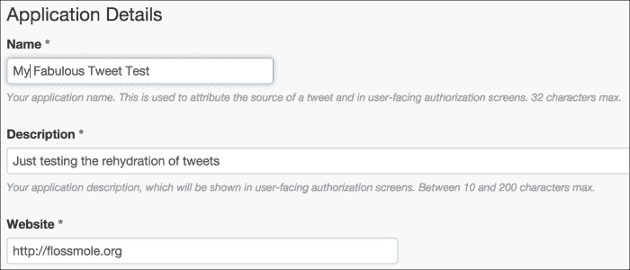
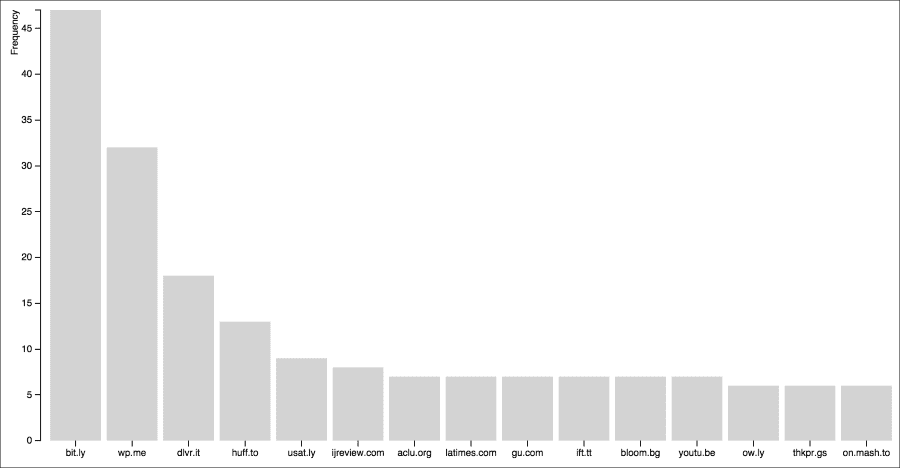

# 十、Twitter 项目

正如我们在第 9 章、*中完成的项目*一样，我们的下一个完整章节晚宴旨在特别展示我们的数据清理技能，同时仍然完成整个数据科学过程的每个阶段。我们之前的项目使用了栈溢出数据，MySQL 和 PHP 的组合来清理它，JavaScript D3 来可视化它。在本章中，我们将使用 Twitter 数据、MySQL 和 Python 来收集和清理数据，并使用 JavaScript 和 D3 来可视化数据。与我们之前的项目一样，在这个项目中，数据科学流程仍然是一样的:

1.  决定我们试图解决什么样的问题——为什么我们需要检查这些数据？
2.  收集和存储我们的数据，包括下载和提取一组公开的推文识别号，然后使用一个程序重新下载原始推文。这一步还包括为测试目的创建更小的数据集。
3.  通过只提取和存储我们需要的部分来清理数据。在这一步中，我们编写一个快速的 Python 程序来加载数据，提取我们想要的字段，并将其写入一小组数据库表中。
4.  分析数据。我们需要对数据进行任何计算吗？是不是应该写一些聚合函数对数据进行计数或者求和？我们需要以某种方式转换数据吗？
5.  如果可能的话，提供数据的可视化。
6.  解决我们着手调查的问题。我们的流程有效吗？我们成功了吗？

与我们之前的项目一样，大部分工作将是收集、存储和清理任务。在这个项目中，我们会注意到我们多次存储不同版本的数据，首先作为文本文件，然后作为水合 JSON 文件，然后作为 MySQL 数据库。每一种不同的格式都来自不同的收集或清洗过程，并进入下一个过程。这样，我们开始看到收集、储存和清洁步骤是如何 **迭代**——相互反馈——而不仅仅是线性的。

# 第一步——提出一个关于推文档案的问题

Twitter 是一个受欢迎的微博平台，全世界数百万人用它来分享他们的想法或交流当前的事件。由于 Twitter 的发布和阅读都相对容易，特别是在移动设备上，它已经成为公共事件(如政治危机和抗议)期间分享信息或跟踪公众意识中出现的问题的重要平台。保存的推文成为一种时间胶囊，提供了对事件发生时公众情绪的大量洞察。时间冻结后，推文本身不会受到记忆失误或随后舆论逆转的影响。学者和媒体专家可以收集,研究这些热门的**推特档案**,试图了解更多关于当时的公众意见，或者关于信息如何传播，甚至关于事件中发生了什么，何时发生，以及为什么发生。

许多人现在开始公开他们的推特收藏。现在可供公众下载的一些推文档案包括:

*   与 2014 年 8 月 10 日至 8 月 27 日美国密苏里州弗格森事件后的抗议和骚乱相关的推文。这些在 https://archive.org/details/ferguson-tweet-ids 的[都可以买到。](https://archive.org/details/ferguson-tweet-ids)
*   2011 年阿拉伯之春事件期间许多国家的推文，包括利比亚、巴林、埃及和其他国家。这些可在 http://dfreelon . org/2012/02/11/Arab-spring-Twitter-data-now-available-sort-of/查阅。
*   2014 年 5 月至 6 月间，提到 **#YesAllWomen** 标签和相关标签 **#NotAllMen** 的推文。这些可以在 http://digital.library.unt.edu/ark:/67531/metadc304853/的[买到。](http://digital.library.unt.edu/ark:/67531/metadc304853/)

在下一步中，我们将需要选择其中一个来下载并开始使用。由于弗格森的推文是这三个示例数据集中最新、最完整的，所以我围绕它设计了本章的其余部分。然而，无论您使用什么设置，这里的概念和基本过程都适用。

本章我们想问的基本问题很简单:当人们在推特上谈论弗格森时，他们在推特上谈论最多的是哪些互联网领域？相对于我们在[第九章](ch09.html "Chapter 9. Stack Overflow Project")、*栈溢出项目*中的一组问题，这是一个很简单的问题，但是这里的数据收集过程有些不同，所以一个简单的问题就足以激励我们的数据科学晚宴。


# 第二步——收集数据

与我们在[第 7 章](ch07.html "Chapter 7. RDBMS Cleaning Techniques")、 *RDBMS 清理技术*中研究的小型情绪推文档案不同，像上面提到的那些，更新的推文档案不再包含推文本身的实际文本。Twitter 的**服务条款** ( **ToS** )从 2014 年开始有了变化，现在分发他人的推文就是违反了这个 ToS。相反，你会在一个更新的 tweet 档案中发现的实际上只是 tweet 标识(ID)号。使用这些数字，我们将不得不单独收集实际的推文。在这一点上，我们可以自己存储和分析推文。请注意，在这个过程中或之后的任何时候，我们都不能重新分发推文文本或其元数据，只能分发推文标识号。

### 注意

尽管这对想要收集推文的研究人员来说很不方便，但 Twitter 更改 ToS 的原因是为了尊重发布推文的原创者的版权概念。这对于删除一条推文尤其重要。如果一条推文被第三方复制并在网络上重新分发，并存储在数据文件中，这条推文就不能真正被删除。通过要求研究人员只复制推文 ID，Twitter 试图保护用户删除自己内容的能力。请求删除 tweet ID 不会返回任何结果。

## 下载并解压缩 Ferguson 文件

与弗格森相关的推文可以在互联网档案馆作为一组存档的压缩文本文件获得。将您的浏览器指向 https://archive.org/details/ferguson-tweet-ids 的[并下载 147 MB 的 ZIP 文件。](https://archive.org/details/ferguson-tweet-ids)

我们可以如下提取文件:

```sql
unzip ferguson-tweet-ids.zip

```

`ls`命令显示创建了一个名为`ferguson-tweet-ids`的目录，该目录中还有两个压缩文件:`ferguson-indictment-tweet-ids.zip`和`ferguson-tweet-ids.zip`。我们真的只需要解压缩其中一个来执行这个项目，所以我选择了这个:

```sql
unzip ferguson-tweet-ids.zip

```

解压缩这个文件会显示几个清单文本文件，以及一个数据文件夹。在`data`文件夹中是一个 gzip 文件。按如下方式解压缩:

```sql
gunzip ids.txt.gz

```

这产生了一个名为`ids.txt`的文件。这是我们真正想要的文件。让我们研究一下这个文件。

要查看文件的大小，我们可以运行`wc`命令。当从如下所示的命令提示符运行时，`wc`显示文件中有多少行、单词和字符，顺序如下:

```sql
megan$ wc ids.txt
 13238863 13238863 251538397 ids.txt

```

第一个数字表示`ids.txt`文件中有多少行，刚好超过 1300 万。接下来，我们可以用`head`命令查看文件内部:

```sql
megan$ head ids.txt
501064188211765249
501064196642340864
501064197632167936
501064196931330049
501064198005481472
501064198009655296
501064198059597824
501064198513000450
501064180468682752
501064199142117378

```

`head`命令显示了文件的前十行，因此我们可以看到每一行都由一个 18 位的 tweet ID 组成。

## 创建文件的测试版本

在这个阶段，我们将为这个项目的剩余部分创建一个小的测试文件。我们想这么做的原因和我们在第九章、*栈溢出项目*中使用测试表的原因是一样的。因为原始文件非常大，所以我们希望处理数据的子集，以防出错。我们还希望能够测试我们的代码，而不需要花费太长时间来完成每一步。

与前面的练习不同，在这种情况下，我们是否随机选择测试数据行可能并不重要。通过查看我们之前运行的`head`命令的结果，我们可以看到这些行并没有真正按照从低到高的顺序排列。事实上，我们不知道原始行的顺序。因此，让我们只获取前 1000 个 tweet IDs，并将它们保存到一个文件中。这将成为我们的测试集:

```sql
head -1000 ids.txt > ids_1000.txt

```

## 丰富推文 id

我们现在将使用这 1000 个推文 id 的测试集来测试我们基于它们的标识号收集原始推文的程序。这个过程叫做**补水**鸣叫。为了做到这一点，我们将使用一个名为 **twarc** 的便捷 Python 工具，它是由 Ed Summers 编写的，也是存档所有弗格森推特的人。它的工作方式是获取一个 tweet IDs 列表，并从 Twitter API 中逐个获取每条原始 tweet。要使用 Twitter API 做任何事情，我们必须有一个已经设置好的 Twitter 开发者账户。先做好我们的 Twitter 账号，然后就可以安装 twarc 使用了。

### 建立 Twitter 开发者账户

要建立 Twitter 开发者账户，请从前往【https://apps.twitter.com 并使用您的 Twitter 账户登录。如果你还没有的 Twitter 账户，你需要创建一个来完成剩下的步骤。

一旦你用你的 Twitter 账户登录，从[http://apps.twitter.com](http://apps.twitter.com)页面，点击**创建新应用**。填写创建应用程序所需的详细信息(给它一个名称，可能类似于`My Tweet Test`；简短的描述；和 URL，其不必是永久的)。我填好的应用程序创建表显示在这里，供您参考:



Twitter 的 Create New App 表单中填充了样本数据

点击表示您同意开发者协议的复选框，您将返回到列出您所有 Twitter 应用的屏幕，您的新应用位于列表顶部。

接下来，要使用这个应用程序，我们需要获得它工作所需的一些关键信息。单击您刚刚创建的应用程序，您将在下一个屏幕的顶部看到四个选项卡。我们感兴趣的是说明**密钥和访问令牌**的那个。看起来是这样的:


新创建的 Twitter 应用程序中的标签界面。

这个屏幕上有很多数字和密码，但有四项需要我们特别注意:

*   **消费者 _ 密钥**
*   **消费者 _ 秘密**
*   **访问令牌**
*   **访问令牌秘密**

不管你在做什么样的 Twitter API 编程，至少目前来说，你会一直需要这四样东西。无论您使用 twarc 还是其他工具，都是如此。Twitter 通过这些凭证来验证您的身份，并确保您拥有所需的访问权限来查看您请求的内容。

### 注意

这些 API 证书也是 Twitter 如何限制你可以发送多少请求以及你可以多快提出请求的。twarc 工具代表我们处理所有这些，所以我们不必太担心超出我们的速率限制。想要了解更多关于 Twitter 费率限制的信息，请查看他们在 https://dev.twitter.com/rest/public/rate-limiting T2 的开发者文档。

### 安装 twarc

现在我们可以访问我们的 Twitter 凭证，我们可以安装 twarc。

twarc 的下载页面可以在 https://github.com/edsu/twarc 的 GitHub 上找到。在那个页面上，有关于如何使用这个工具以及有哪些选项可用的文档。

要在您的 Canopy Python 环境中安装 twarc，请启动 Canopy，然后从**工具**菜单中选择 **Canopy 命令提示符**。

在命令提示符下，键入:

```sql
pip install twarc

```

这个命令将安装 twarc，并使它可以作为命令行程序被调用，或者从您自己的 Python 程序中调用。

### 运行 twarc

我们现在可以从命令行使用 twarc 来合并我们之前创建的`ids_1000.txt`文件。这样做的命令行很长，因为我们必须传递我们之前在 Twitter 站点上创建的四个长的秘密令牌。为了避免出错，我首先使用我的文本编辑器 Text Wrangler 创建命令行，然后将它粘贴到我的命令提示符中。您的最终命令行将如下所示，除了所有显示`abcd`的地方，您应该填写适当的秘密令牌或秘密密钥:

```sql
twarc.py --consumer_key abcd --consumer_secret abcd --access_token abcd --access_token_secret abcd --hydrate ids_1000.txt > tweets_1000.json

```

注意，这个命令行会将其输出重定向到一个名为`tweets_1000.json`的 JSON 文件。在这个文件中，是每个 tweet 的 JSON 表示，我们之前只有它的 ID。让我们检查一下新文件有多长:

```sql
wc tweets_1000.json

```

`wc`实用程序表明我的文件有 894 行长，这表明无法找到一些 tweet(因为我的数据集中最初有 1000 条 tweet)。如果在我写这篇文章后的这段时间里，推特被删除了，你的文件可能会更小。

接下来，我们还可以查看文件内部:

```sql
less tweets_1000.json

```

我们也可以在文本编辑器中打开它进行查看。

JSON 文件中的每一行都代表一条 tweet，每一行看起来都像下面的例子。然而，这个例子不是来自 Ferguson 数据集，因为我没有权利发布这些推文。相反，我使用了我在[第二章](ch02.html "Chapter 2. Fundamentals – Formats, Types, and Encodings")、*基础——格式、类型和编码*中创建的一条推文，来讨论 UTF-8 编码。由于这条推文是专为这本书而创建的，并且我拥有内容，所以我可以在不违反 Twitter 的 ToS 的情况下向您展示 JSON 格式。下面是我在 Twitter 网络界面上的推文:


一个 tweet 的例子，如 Twitter 的 web 界面所示。

下面的是 twarc 将其合并后，tweet 在 JSON 表示中的样子。我在每个 JSON 元素之间添加了新行，这样我们可以更容易地看到每个 tweet 中有哪些属性:

```sql
{"contributors": null, 
"truncated": false, 
"text": "Another test. \u00c9g elska g\u00f6gn. #datacleaning", 
"in_reply_to_status_id": null, 
"id": 542486101047275520, 
"favorite_count": 0, 
"source": "<a href=\"http://twitter.com\" rel=\"nofollow\">Twitter Web Client</a>", 
"retweeted": false, 
"coordinates": null, 
"entities": 
{"symbols": [], 
"user_mentions": [], 
"hashtags": 
[{"indices": [29, 42], 
"text": "datacleaning"}], 
"urls": []}, 
"in_reply_to_screen_name": null, 
"id_str": "542486101047275520", 
"retweet_count": 0, 
"in_reply_to_user_id": null, 
"favorited": false, 
"user": 
{"follow_request_sent": false, 
"profile_use_background_image": false, 
"profile_text_color": "333333", 
"default_profile_image": false, 
"id": 986601, 
"profile_background_image_url_https": "https://pbs.twimg.com/profile_background_images/772436819/b7f7b083e42c9150529fb13971a52528.png", 
"verified": false, 
"profile_location": null, 
"profile_image_url_https": "https://pbs.twimg.com/profile_images/3677035734/d8853be8c304729610991194846c49ba_normal.jpeg", 
"profile_sidebar_fill_color": "F6F6F6", 
"entities": 
{"url": 
{"urls": 
[{"url": "http://t.co/dBQNKhR6jY", 
"indices": [0, 22], 
"expanded_url": "http://about.me/megansquire", 
"display_url": "about.me/megansquire"}]},
"description": {"urls": []}}, 
"followers_count": 138, 
"profile_sidebar_border_color": "FFFFFF", 
"id_str": "986601", 
"profile_background_color": "000000", 
"listed_count": 6, 
"is_translation_enabled": false, 
"utc_offset": -14400, 
"statuses_count": 376, 
"description": "Open source data hound. Leader of the FLOSSmole project. Professor of Computing Sciences at Elon University.", 
"friends_count": 82, 
"location": "Elon, NC", 
"profile_link_color": "038543", 
"profile_image_url": "http://pbs.twimg.com/profile_images/3677035734/d8853be8c304729610991194846c49ba_normal.jpeg", 
"following": false, 
"geo_enabled": false, 
"profile_banner_url": "https://pbs.twimg.com/profile_banners/986601/1368894408", 
"profile_background_image_url": "http://pbs.twimg.com/profile_background_images/772436819/b7f7b083e42c9150529fb13971a52528.png", 
"name": "megan squire", 
"lang": "en", 
"profile_background_tile": false, 
"favourites_count": 64, 
"screen_name": "MeganSquire0", 
"notifications": false, 
"url": "http://t.co/dBQNKhR6jY", 
"created_at": "Mon Mar 12 05:01:55 +0000 2007", 
"contributors_enabled": false, 
"time_zone": "Eastern Time (US & Canada)", 
"protected": false, 
"default_profile": false, 
"is_translator": false}, 
"geo": null, 
"in_reply_to_user_id_str": null, 
"lang": "is", 
"created_at": "Wed Dec 10 01:09:00 +0000 2014", 
"in_reply_to_status_id_str": null, 
"place": null}
```

每个 JSON 对象不仅包含关于推文本身的事实，例如文本、日期和发送时间，还包含关于推文发布者的大量信息。

### Tip

水合过程产生了关于一条单独推文的大量信息——这是一个总共有 1300 万条推文的数据集。当你在本章末尾准备充实整个弗格森数据集时，请记住这一点。


# 第三步——数据清理

此时，我们准备开始清理 JSON 文件，提取我们想要长期保存的每条 tweet 的细节。

## 创建数据库表格

因为我们的激励性问题只问 URL，我们只需要提取这些，以及 tweet IDs。然而，为了练习清理，我们可以将本练习与之前在[第 7 章](ch07.html "Chapter 7. RDBMS Cleaning Techniques")、 *RDBMS 清理技术*中使用`sentiment140`数据集所做的练习进行比较，让我们设计一小组数据库表，如下所示:

*   一个`tweet`表，其中只保存关于推文的信息
*   一个`hashtag`表，其中保存了关于哪些推文引用了哪些标签的信息
*   一个`URL`表，其中保存了关于哪些推文引用了哪些 URL 的信息
*   一个`mentions`表，其中保存了关于哪些推文提到了哪些用户的信息

这类似于我们在[第 7 章](ch07.html "Chapter 7. RDBMS Cleaning Techniques")、 *RDBMS 清理技术*中设计的结构，除了在那种情况下我们必须从 tweet 文本中解析出我们自己的标签和 URL 以及用户提及的列表。twarc 工具无疑为我们节省了一些精力，因为我们在本章中完成了这个项目。

构成我们四个表的`CREATE`语句如下:

```sql
CREATE TABLE IF NOT EXISTS ferguson_tweets (
  tid bigint(20) NOT NULL,
  ttext varchar(200) DEFAULT NULL,
  tcreated_at varchar(50) DEFAULT NULL,
  tuser bigint(20) DEFAULT NULL,
  PRIMARY KEY (tid)
) ENGINE=MyISAM DEFAULT CHARSET=utf8mb4;

CREATE TABLE IF NOT EXISTS ferguson_tweets_hashtags (
  tid bigint(20) NOT NULL,
  ttag varchar(200) NOT NULL,
  PRIMARY KEY (tid, ttag)
) ENGINE=MyISAM DEFAULT CHARSET=utf8;

CREATE TABLE IF NOT EXISTS ferguson_tweets_mentions (
  tid bigint(20) NOT NULL,
  tuserid bigint(20) NOT NULL,
  tscreen varchar(100) DEFAULT NULL,
  tname varchar(100) DEFAULT NULL,
  PRIMARY KEY (tid,tuserid)
) ENGINE=MyISAM DEFAULT CHARSET=utf8;

CREATE TABLE IF NOT EXISTS ferguson_tweets_urls (
  tid bigint(20) NOT NULL,
  turl varchar(200) NOT NULL,
  texpanded varchar(255) DEFAULT NULL,
  tdisplay varchar(200) DEFAULT NULL,
  PRIMARY KEY (tid,turl)
) ENGINE=MyISAM DEFAULT CHARSET=utf8;
```

关于 tweets 表需要注意的一点是，它是使用 **utf8mb4** 排序规则创建的。这是，因为推文本身可能包含 UTF-8 范围内非常高的字符。事实上，这些推文中的一些字符将需要比原生 MySQL UTF-8 字符集所能容纳的 3 字节限制更多的空间。因此，我们设计了主 tweet 表来保存 MySQL 的 utf8mb4 排序规则中的数据，该排序规则包含在 MySQL 5.5 或更高版本中。如果您使用的是比这个版本更早的 MySQL 版本，或者由于其他原因，您无法访问 utf8mb4 排序规则，您可以使用 MySQL 更早的 UTF-8-通用排序规则，但是请注意，您可能会在这里或那里使用表情符号生成编码错误。如果您遇到这个错误，当您试图`INSERT`记录时，MySQL 可能会产生一个关于错误 1366 和*不正确字符串值*的消息。

现在每个表都创建好了，我们可以开始选择和加载数据了。

## 在 Python 中填充新表格

下面的 Python 脚本将加载 JSON 文件，从我们感兴趣的字段中提取值，并填充前面描述的四个表。关于这个脚本，还有一些额外的重要说明，我现在就来看一下。

这个脚本确实需要安装`MySQLdb` Python 模块。作为 Canopy Python 用户，这些模块很容易通过包管理器安装。只需在**软件包管理器**中搜索`MySQLdb`，然后点击安装:

```sql
#jsonTweetCleaner.py
import json
import MySQLdb

# Open database connection
db = MySQLdb.connect(host="localhost",\
    user="username", \
    passwd="password", \
    db="ferguson", \
    use_unicode=True, \
    charset="utf8")
cursor = db.cursor()
cursor.execute('SET NAMES utf8mb4')
cursor.execute('SET CHARACTER SET utf8mb4')
cursor.execute('SET character_set_connection=utf8mb4')

# open the file full of json-encoded tweets
with open('tweets_1000.json') as f:
    for line in f:
        # read each tweet into a dictionary
        tweetdict = json.loads(line)

        # access each tweet and write it to our db table
        tid    = int(tweetdict['id'])
        ttext  = tweetdict['text']
        uttext = ttext.encode('utf8')
        tcreated_at = tweetdict['created_at']
        tuser  = int(tweetdict['user']['id'])

        try:
            cursor.execute(u"INSERT INTO ferguson_tweets(tid, 
ttext, tcreated_at, tuser) VALUES (%s, %s, %s, %s)", \
(tid,uttext,tcreated_at,tuser))
            db.commit() # with MySQLdb you must commit each change
        except MySQLdb.Error as error:
            print(error)
            db.rollback()

        # access each hashtag mentioned in tweet
        hashdict = tweetdict['entities']['hashtags']
        for hash in hashdict:
            ttag = hash['text']
            try:
                cursor.execute(u"INSERT IGNORE INTO 
ferguson_tweets_hashtags(tid, ttag) VALUES (%s, %s)",(tid,ttag))
                db.commit()
            except MySQLdb.Error as error:
                print(error)
                db.rollback()

        # access each URL mentioned in tweet
        urldict = tweetdict['entities']['urls']
        for url in urldict:
            turl      = url['url']
            texpanded = url['expanded_url']
            tdisplay  = url['display_url']

            try:
                cursor.execute(u"INSERT IGNORE INTO  ferguson_tweets_urls(tid, turl, texpanded, tdisplay) 
VALUES (%s, %s, %s, %s)", (tid,turl,texpanded,tdisplay))
                db.commit()
            except MySQLdb.Error as error:
                print(error)
                db.rollback()

        # access each user mentioned in tweet
        userdict = tweetdict['entities']['user_mentions']
        for mention in userdict:
            tuserid = mention['id']
            tscreen = mention['screen_name']
            tname   = mention['name']

            try:
                cursor.execute(u"INSERT IGNORE INTO 
ferguson_tweets_mentions(tid, tuserid, tscreen, tname) 
VALUES (%s, %s, %s, %s)", (tid,tuserid,tscreen,tname))
                db.commit()
            except MySQLdb.Error as error:
                print(error)
# disconnect from server
db.close()
```

### Tip

关于 tweet 的 JSON 表示中提供的每个字段的更多信息，Twitter API 文档非常有用。在计划从 JSON tweet 中提取哪些字段时，关于用户、实体和 tweet 中的实体的部分特别有指导意义。你可以在[https://dev.twitter.com/overview/api/](https://dev.twitter.com/overview/api/)开始阅读文档。

一旦运行了这个脚本，这四个表就会被数据填充。在我的 MySQL 实例上，对我的`ids_1000.txt`文件运行前面的脚本后，我在 tweets 表中得到 893 行；hashtags 表中的 1，048 行；用户提及表中的 896 行；和 371 行。如果你这里或那里有较少的行，检查一下是否是因为推文被删除了。


# 第四步——简单的数据分析

假设我们想要了解在 Ferguson 数据集中哪些域名被链接得最多。我们可以通过提取存储在我们的`ferguson_tweets_urls`表的`tdisplay`列中的 URL 的域部分来回答这个问题。出于我们的目的，我们将把第一个斜杠(`/`)之前的所有内容视为 URL 的有趣部分。

以下 SQL 查询为我们提供了域以及引用该域的帖子的数量:

```sql
SELECT left(tdisplay,locate('/',tdisplay)-1) as url, 
  count(tid) as num
FROM ferguson_tweets_urls
GROUP BY 1 ORDER BY 2 DESC;
```

该查询的结果是类似如下的数据集(在 1，000 行的样本集上运行):

| 

全球资源定位器(Uniform Resource Locator)

 | 

数字

 |
| --- | --- |
| bit.ly | Forty-seven |
| wp.me | Thirty-two |
| dlvr.it | Eighteen |
| huff.to | Thirteen |
| usat.ly | nine |
| ijreview.com | eight |
| latimes.com | seven |
| gu.com | seven |
| ift.tt | seven |

数据集的这个片段只显示了前几行，但是我们已经可以看到一些更受欢迎的结果是 URL 缩短服务，比如`bit.ly`。我们还可以看到，我们能够删除所有那些由 Twitter 自己的缩短器`t.co`创建的缩短的 URL，只需使用显示列而不是主 URL 列。

在下一节中，我们可以使用这些计数来构建一个条形图，类似于我们在第 9 章、*栈溢出项目*中构建一个简单图形的方式。


# 第五步——可视化数据

为了构建一个支持 D3 的小图，我们可以遵循我们在[第 9 章](ch09.html "Chapter 9. Stack Overflow Project")、*栈溢出项目*中使用的相同过程，其中我们制作了一个查询数据库的 PHP 脚本，然后我们的 JavaScript 使用结果作为条形图的实时输入。或者，我们可以用 Python 生成一个 CSV 文件，让 D3 根据这些结果生成它的图形。因为我们已经在上一章中执行了 PHP 方法，所以我们在这里使用 CSV 文件方法，只是为了多样化。这也是本章继续学习 Python 的一个好借口，因为这已经是我们一直在使用的语言了。

以下脚本连接到数据库，选择出前 15 个最常用的 URL 及其数量，并将全部内容写入一个 CSV 文件:

```sql
import csv
import MySQLdb

# Open database connection
db = MySQLdb.connect(host="localhost",
    user="username", 
    passwd="password", 
    db="ferguson", 
    use_unicode=True, 
    charset="utf8")
cursor = db.cursor()

cursor.execute('SELECT left(tdisplay, LOCATE(\'/\', 
    tdisplay)-1) as url, COUNT(tid) as num 
    FROM ferguson_tweets_urls 
    GROUP BY 1 ORDER BY 2 DESC LIMIT 15')

with open('fergusonURLcounts.tsv', 'wb') as fout:
    writer = csv.writer(fout)
    writer.writerow([ i[0] for i in cursor.description ])
    writer.writerows(cursor.fetchall())
```

一旦我们有了这个 CSV 文件，我们就可以把它输入到一个股票 D3 条形图模板中，看看它是什么样子。以下可称为`buildBarGraph.html`等:

### 注意

确保您的本地文件夹中有 D3 库，就像您在前面章节中所做的一样，还有您刚刚创建的 CSV 文件。

```sql
<!DOCTYPE html>
<meta charset="utf-8">
<!-- 
this code is modeled on mbostock's 
"Let's Make a Bar Chart" D3 tutorial 
available at http://bl.ocks.org/mbostock/3885304
My modifications:
* formatting for space
* colors
* y axis label moved
* changed variable names to match our data
* loads data via CSV rather than TSV file
-->

<style>
.bar {fill: lightgrey;}
.bar:hover {fill: lightblue;}
.axis {font: 10px sans-serif;}
.axis path, .axis line {
  fill: none;
  stroke: #000;
  shape-rendering: crispEdges;
}
.x.axis path {display: none;}
</style>
<body>
<script src="d3.min.js"></script>
<script>

var margin = {top: 20, right: 20, bottom: 30, left: 40},
    width = 960 - margin.left - margin.right,
    height = 500 - margin.top - margin.bottom;

var x = d3.scale.ordinal()
    .rangeRoundBands([0, width], .1);

var y = d3.scale.linear()
    .range([height, 0]);

var xAxis = d3.svg.axis()
    .scale(x)
    .orient("bottom");

var yAxis = d3.svg.axis()
    .scale(y)
    .orient("left");

var svg = d3.select("body").append("svg")
    .attr("width", width + margin.left + margin.right)
    .attr("height", height + margin.top + margin.bottom)
  .append("g")
    .attr("transform", "translate(" + margin.left + "," + margin.top + ")");

d3.csv("fergusonURLcounts.csv", type, function(error, data) {
  x.domain(data.map(function(d) { return d.url; }));
  y.domain([0, d3.max(data, function(d) { return d.num; })]);

  svg.append("g")
      .attr("class", "x axis")
      .attr("transform", "translate(0," + height + ")")
      .call(xAxis);

  svg.append("g")
      .attr("class", "y axis")
      .call(yAxis)
    .append("text")
      .attr("transform", "rotate(-90)")
      .attr("y", 6)
      .attr("dy", "-3em")
      .style("text-anchor", "end")
      .text("Frequency");

  svg.selectAll(".bar")
      .data(data)
    .enter().append("rect")
      .attr("class", "bar")
      .attr("x", function(d) { return x(d.url) ; })
      .attr("width", x.rangeBand())
      .attr("y", function(d) { return y(d.num); })
      .attr("height", function(d) { return height - y(d.num); });
});

function type(d) {
  d.num = +d.num;
  return d;
}

</script>
</body>
</html>
```

得到的条形图看起来像这里显示的。同样，请记住，我们使用的是测试数据集，因此数字非常小:



使用我们的 CSV 文件在 D3 中绘制的简单条形图。


# 第六步——解决问题

由于数据可视化不是本书的主要目的，我们并不太关心该部分的图表有多复杂，只要说在弗格森数据集中有很多很多有趣的模式可以发现，而不仅仅是哪些 URL 被指向得最多。既然您已经知道如何轻松下载和清理这个庞大的数据集，也许您可以发挥您的想象力来揭示其中的一些模式。请记住，当你向崇拜你的公众发布你的发现时，你不能发布推文本身或它们的元数据。但是如果你的问题需要的话，你可以发布推文 id 或者它们的子集。


# 将此流程移入完整(非测试)表格

就像在[第 9 章](ch09.html "Chapter 9. Stack Overflow Project")、*栈溢出项目*中一样，我们制作了测试表，这样我们就可以在一个没有压力的环境中开发我们的项目，同时收集可管理数量的推文。当你准备好收集完整的推文列表时，准备花些时间去做。Twitter 的速率限制将开始生效，twarc 将需要很长时间才能运行。埃德·萨默斯在这篇博客上指出，运行弗格森的推文大约需要一周时间:[http://inkdroid.org/journal/2014/11/18/on-forgetting/](http://inkdroid.org/journal/2014/11/18/on-forgetting/)。当然，如果你很小心，你将只需要运行一次。

你可以做的另一件事是和其他人组成一个团队，来加速水化 tweet IDs 的时间。您可以将 tweet ID 文件分成两半，每个文件处理您的 tweet 部分。在数据清理过程中，确保将两者放入同一个最终数据库表中。

下面是我们将遵循的步骤，以改变我们的项目，收集完整的推文集，而不是 1000 条推文样本:

1.  清空`ferguson_tweets`、`ferguson_tweets_hashtags`、`ferguson_tweets_mentions`和`ferguson_tweets_urls`表格如下:

    ```sql
    TRUNCATE TABLE ferguson_tweets;
    TRUNCATE TABLE ferguson_tweets_hashtags;
    TRUNCATE TABLE ferguson_tweets_mentions;
    TRUNCATE TABLE ferguson_tweets_urls;
    ```

2.  对完整的`ids.txt`文件而不是`ids_1000.txt`文件运行 twarc，如下所示:

    ```sql
    twarc.py --consumer_key abcd --consumer_secret abcd --access_token abcd --access_token_secret abcd --hydrate ids.txt > tweets.json

    ```

3.  重新运行`jsonTweetCleaner.py` Python 脚本。

此时，您将拥有一个充满推文、标签、提及和 URL 的整洁的数据库，为分析和可视化做好准备。因为现在每个表中有这么多的行，所以请注意，每个可视化步骤可能需要更长的时间来运行，这取决于您正在运行的查询类型。


# 总结

在这个项目中，我们学习了如何根据标识号重建推文列表。首先，我们找到了符合 Twitter 最新 ToS 的高质量存档推文数据。我们学习了如何将它分割成足够小的集合，以便进行测试。然后，我们学习了如何使用 Twitter API 和 twarc 命令行工具将每条 tweet 合并成一个完整的 JSON 表示。接下来，我们学习了如何提取 Python 中的 JSON 实体，将字段保存到 MySQL 数据库中的一组新表中。然后，我们运行一些简单的查询来统计最常见的 URL，并使用 D3 绘制了一个条形图。

在本书中，我们学习了如何执行各种简单和复杂的数据清理任务。我们使用了各种语言、工具和技术来完成这项工作，在此过程中，我希望您能够在学习新技能的同时完善现有技能。

至此，我们的最后一次晚宴已经结束，您现在可以开始在储备齐全且非常整洁的数据科学厨房中开展自己的清洁项目了。你应该从哪里开始？

*   你喜欢竞赛和奖品吗？Kaggle 经常在他们的网站[http://kaggle.com](http://kaggle.com)举办数据分析比赛。你可以单独工作，也可以作为团队的一员。许多团队需要整洁的数据，所以这是一个很好的方式。
*   如果你更多的是一个公共服务类的人，我可以建议数据学院吗？他们的网站在[http://schoolofdata.org](http://schoolofdata.org)，他们举办课程和*数据考察*，来自世界各地的专家和业余爱好者聚集在一起，利用数据解决现实世界的问题。
*   为了扩展您的数据清理实践，我强烈建议您接触一些公开可用的数据集。KDnuggets 在这里有一个很好的列表，包括一些列表:[http://www.kdnuggets.com/datasets/](http://www.kdnuggets.com/datasets/)。
*   你喜欢[第九章](ch09.html "Chapter 9. Stack Overflow Project")、*栈溢出项目*中的栈溢出例子吗？http://meta.stackexchange.com[的 *Meta* Stack Exchange 是一个讨论 Stack Exchange 网站工作方式的网站。用户就如何查询栈溢出数据以及如何处理找到的数据讨论了数百个惊人的想法。或者，您总是可以提出大量与数据清理相关的栈溢出问题。最后，还有几个其他的栈交换站点也与数据清理有关。一个有用的网站是开放数据栈交换，可在](http://meta.stackexchange.com)[http://opendata.stackexchange.com](http://opendata.stackexchange.com)获得。
*   Twitter 数据现在非常受欢迎。如果你喜欢使用 Twitter 数据，考虑将我们的[第 10 章](ch10.html "Chapter 10. Twitter Project")、 *Twitter 项目*提升到一个新的水平，就这些公开发布的 tweet 集合中的一个提出并回答你自己的问题。或者，收集和整理一套你自己的新的 tweet IDs 怎么样？如果你对一些感兴趣的话题建立了整洁的 tweet IDs 集合，你可以分发它们，研究人员和其他数据科学家将会非常感激。

祝你的数据清理之旅好运，祝你好运！