# 一、Comet 概述

数据科学是一套策略、算法和最佳实践，我们利用它们从数据中提取见解和趋势。典型的数据科学项目生命周期包括不同的步骤，包括问题理解、数据收集和清理、数据建模、模型评估以及模型部署和监控。尽管每一步都需要一些特定的技能和能力，但是所有的步骤都是相互紧密联系的，通常，它们被组织成一个流水线，其中一个模块的输出对应于下一个模块的输入。

在过去，数据科学家手工构建完整的管道，这需要很多关注:管道的单个步骤中的一点错误都会影响后续步骤。这种手动管理导致完整数据科学项目的上市时间延长。

在过去几年中，由于人工智能和云计算领域的改进，许多在线平台已经部署，用于管理和监控数据科学项目生命周期的不同步骤。所有这些平台都允许我们通过提供良好集成的工具和机制来缩短和促进数据科学项目的上市时间。

在管理(几乎)数据科学项目的整个生命周期的最受欢迎的平台中，有 **Comet** 。Comet 是一个实验平台，它为最流行的数据科学编程语言提供了一个简单的接口，包括 Python、Java、JavaScript 和 R 软件。这本书提供了如何在 Python 中使用 Comet 的概念和大量例子。不过，我们会在 [*第四章*](B17530_04_ePub.xhtml#_idTextAnchor081) 、*工作区、项目、实验、模型*中给出一些关于如何用其他编程语言开发 Comet 的指导方针。

这一章的主要目的是为你提供一个快速启动指南来实现你的第一个简单实验。您将学习 Comet 平台背后的基本概念，包括首次访问该平台、主要的 Comet 仪表板和两个实际示例，这将帮助您熟悉 Comet 环境。我们还将介绍 Comet 术语，包括工作空间、项目、实验和面板的概念。在本章中，我们还将通过关注以下主题来概述 Comet:

*   动机、目的和首次使用 Comet 平台
*   工作区、项目、实验和面板入门
*   第一个用例——在 Comet 中跟踪图像
*   第二个用例–简单线性回归

在继续讨论如何开始使用 Comet 之前，让我们看一下运行本章中的实验的技术要求。

# 技术要求

本书中举例说明的例子使用 Python 3.8。可以在[https://www.python.org/downloads/](https://www.python.org/downloads/)官网下载，选择 3.8 版本。

本章中描述的示例使用了以下 Python 包:

*   `comet-ml 3.23.0`
*   `matplotlib 3.4.3`
*   `numpy 1.19.5`
*   `pandas 1.3.4`
*   `scikit-learn 1.0`

## Comet-ml

`comet-ml`是 Python 中与 Comet 交互的主要包。你可以按照官方的程序来安装这个软件包，如下链接所述:【https://www.comet.ml/docs/quick-start/。

或者，您可以在命令行中安装带有`pip`的软件包，如下所示:

```
pip install comet-ml==3.23.0
```

## matplotlib

`matplotlib`是一个非常流行的用于 Python 中数据可视化的包。你可以按照官方文档来安装，可以在这个链接找到:[https://matplotlib . org/stable/users/getting _ started/index . XHTML](https://matplotlib.org/stable/users/getting_started/index.xhtml)。

在`pip`中，您可以轻松安装`matplotlib`，如下:

```
pip install matplotlib== 3.4.3
```

## 数字

`numpy`是一个包，它提供了关于数组和线性代数的有用函数。您可以按照 https://numpy.org/install/的[的官方程序安装`numpy`，或者您也可以通过`pip`简单安装，如下所示:](https://numpy.org/install/)

```
pip install numpy==1.19.5
```

## 熊猫

`pandas`是一个非常受欢迎的用于加载、清理、探索和管理数据集的包。你可以按照官方程序安装它，如下链接所示:【https://pandas.pydata.org/getting_started.xhtml。

或者，您可以通过`pip`安装`pandas`包，如下所示:

```
pip install pandas==1.3.4
```

## scikit-learn

`scikit-learn`是一个用于机器学习的 Python 包。它提供了不同的机器学习算法，以及数据角力和模型评估的函数和方法。你可以按照官方文档安装`scikit-learn`，如下链接所示:[https://scikit-learn.org/stable/install.xhtml](https://scikit-learn.org/stable/install.xhtml)。

或者，您可以安装`scikit-learn`到`pip`，如下所示:

```
pip install scikit-learn==1.0
```

现在我们已经安装了所有需要的库，我们可以继续讨论如何开始使用 Comet，从头开始。我们将讨论动机、目的和首次访问 Comet 平台。

# 动机、目的和首次使用 Comet 平台

Comet 是一个基于云的自托管平台，提供许多工具和功能来跟踪、比较、描述和优化数据科学实验和模型，从数据科学项目生命周期的开始到最后的监控。

在本节中，我们将描述以下内容:

*   **动机**–为什么以及何时使用 Comet
*   **用途**——Comet 可以用来做什么，不适合做什么
*   **首次访问 Comet 平台**——访问 Comet 平台的快速入门指南

现在，我们可以开始更多地了解 Comet，从动机开始。

## 动机

通常，一个数据科学项目的生命周期包括以下步骤:

1.  **了解** **问题**——明确要调查的问题，了解*需要哪些*类型的数据。这一步至关重要，因为对数据的误解可能会产生错误的结果。
2.  **数据收集**–用于收集和提取与已定义问题相关的数据的所有策略。如果某个公司或利益相关者已经提供了数据，那么搜索有助于更好地模拟问题的其他数据也是有用的。
3.  **数据争论**–用于清理和过滤数据的所有算法和策略。使用**探索性数据分析** ( **EDA** )技术的可以了解数据的形状。
4.  **特征工程**–用于从数据中提取输入特征的一套技术，这些输入特征将用于问题建模。
5.  **数据建模**–为数据建模而实施的所有算法，以便提取预测和未来趋势。通常，数据建模包括机器学习、深度学习、文本分析和时间序列分析技术。
6.  **模型评估**–用于测量和测试已实现模型性能的一组策略。根据所定义的问题，应该计算不同的指标。
7.  **模型部署**——当模型达到良好性能并通过所有测试后，就可以转入生产了。模型部署包括用于使模型准备好与真实的和不可见的数据一起使用的所有技术。
8.  **模型监控**–模型可能会过时；因此，应该对其进行监控，以检查是否存在性能下降。如果是这种情况，应该用新数据更新模型。

我们可以使用 Comet 来组织、跟踪、保存和保护数据科学项目生命周期的几乎所有步骤，如下图所示。可以使用 Comet 的步骤用绿色矩形突出显示:

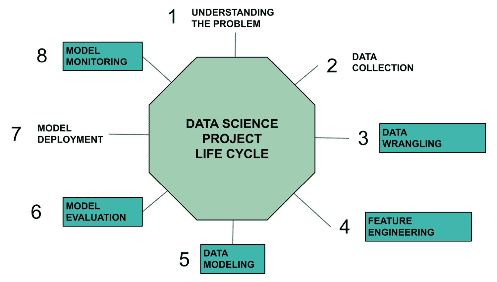

图 1.1–数据科学项目生命周期中的步骤，突出显示绿色矩形中 Comet 的位置

所涉及的步骤如下:

*   **数据角力**——由于集成了一些流行的数据可视化库，如`matplotlib`、`plotly`和`PIL` Python 库，我们可以在 Comet 中构建**面板**来执行 EDA，这可以作为数据角力的初步步骤。我们将在本书接下来的章节中更详细地描述面板的概念。
*   **特征工程**–Comet 提供了一种简单的方式来跟踪不同的实验，通过比较来选择最佳的输入特征集。
*   **数据建模**–得益于**优化器**的概念，Comet 可用于调试您的模型，以及执行超参数调优。我们将在本书的下一章中说明如何使用 Comet Optimizer。
*   **模型评估**–Comet 提供了不同的工具来评估模型，包括面板、从每个实验中提取的评估指标，以及比较不同实验的可能性。
*   **模型监控**——一旦模型被部署，您就可以使用前面描述的工具在 Comet 中继续跟踪它。Comet 还提供外部服务，名为**模型生产监控** ( **MPM** )，允许我们实时监控模型的性能。MPM 服务不包括在 Comet 免费计划中。

我们不能直接利用 Comet 来部署模型。然而，我们可以很容易地将 Comet 与 GitLab 集成，git lab 是最著名的 DevOps 平台之一。我们将在 [*第七章*](B17530_07_ePub.xhtml#_idTextAnchor147) 、*用 Comet*扩展 GitLab DevOps 平台中讨论 Comet 与 GitLab 的集成。

总而言之，由于提供了不同的工具和特性，Comet 提供了对数据科学项目中几乎所有步骤的单点访问。相对于传统的手动管道，Comet 允许在整个数据科学过程中自动化和减少错误传播。

现在，您已经熟悉了为什么以及何时使用 Comet，我们可以继续了解 Comet 的用途了。

## 目的

Comet 的主要目标是为用户提供一个平台，让他们可以做以下事情:

*   **将你的项目组织成不同的实验**——当你想尝试不同的策略或算法或产生不同的模型时，这很有用。
*   **跟踪、复制和存储实验**–Comet 为每个实验分配一个唯一的标识符；因此，您可以跟踪代码中的每一个更改，而不必担心记录您所做的更改。事实上，Comet 还存储了用于运行每个实验的代码。
*   **与其他合作者分享您的项目和实验**–您可以邀请团队的其他成员阅读或修改您的实验，从而轻松地从数据中提取见解或为给定问题选择最佳模型。

现在您已经了解了 Comet 的用途，我们可以举例说明如何首次访问 Comet 平台。

## 首次进入 Comet 平台

使用 Comet 需要在平台上创建一个帐户。Comet 平台可在此链接:[https://www.comet.ml/](https://www.comet.ml/)。Comet 根据您的需求提供了不同的计划。在免费版本中，您可以访问几乎所有的功能，但是您不能与您的合作者共享您的项目。

如果你是一名学者，你可以免费创建一个高级 Comet 账户，按照学者的程序:[https://www.comet.ml/signup?plan=academic](https://www.comet.ml/signup?plan=academic)。在这种情况下，你必须提供你的学术帐户。

您只需点击**创建免费账户**按钮并按照步骤操作，即可创建免费账户。

# 工作区、项目、实验和面板入门

Comet 有嵌套的架构，如下图所示:

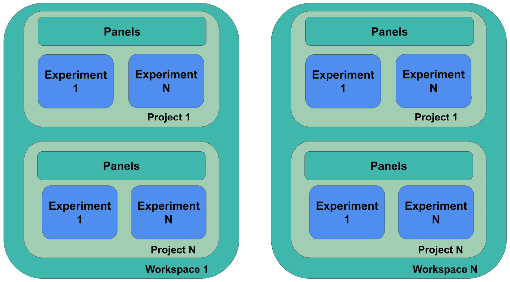

图 1.2–Comet 中的模块化架构

Comet 架构的主要组件包括:

*   **工作区**
*   **项目**
*   **实验**
*   **面板**

让我们分别分析每个组件，从第一个开始——工作空间。

## 工作区

Comet workspace 是一个项目集合，可以是私有的，也可以是与合作者共享的。当您创建自己的帐户时，Comet 会创建一个默认的工作区，并以您的用户名命名。但是，您可以创建任意数量的工作区，并与不同的协作者共享它们。

要创建新的工作区，我们可以执行以下操作:

1.  点击仪表板页面左侧的用户名。
2.  选择**切换工作区** | **查看所有工作区**。
3.  点击**创建一个工作区**按钮。
4.  输入工作空间名称，该名称在整个平台中必须是唯一的。我们建议在工作区名称前添加您的用户名，从而避免名称冲突。
5.  点击**保存**按钮。

下图显示了一个有两个工作区的客户:

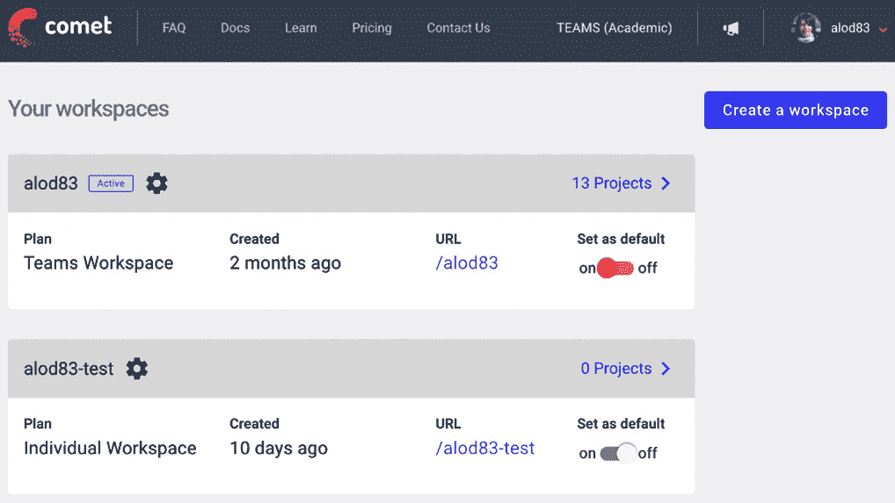

图 1.3–拥有两个工作空间的客户

在这个例子中，有两个工作区， **alod83** ，这是默认的，对应于用户名，和 **alod83-test** 。

既然我们已经学习了如何创建工作区，我们可以继续下一个特性:**项目**。

## 项目

Comet 项目是一系列实验的集合。项目可以是私有的，也可以是公共的。私有项目只对所有者及其合作者可见，而公共项目对所有人都可见。

在 Comet 中，您可以创建任意多的项目。项目由名称标识，并且只能属于一个工作区，不能将项目从一个工作区移动到另一个工作区。

为了创建项目，我们执行以下操作:

1.  启动浏览器，进入[https://www.comet.ml/](https://www.comet.ml/)。
2.  如果您尚未创建帐户，请点击右上角的**创建免费帐户**按钮，然后按照步骤操作。如果您已经有帐户，直接跳到*步骤 3* 。
3.  点击屏幕右上方的**登录**按钮登录平台。
4.  选择一个**工作区**。
5.  点击屏幕右上角的**新项目**按钮。
6.  将打开一个新窗口，您可以在其中输入项目信息，如下图所示:

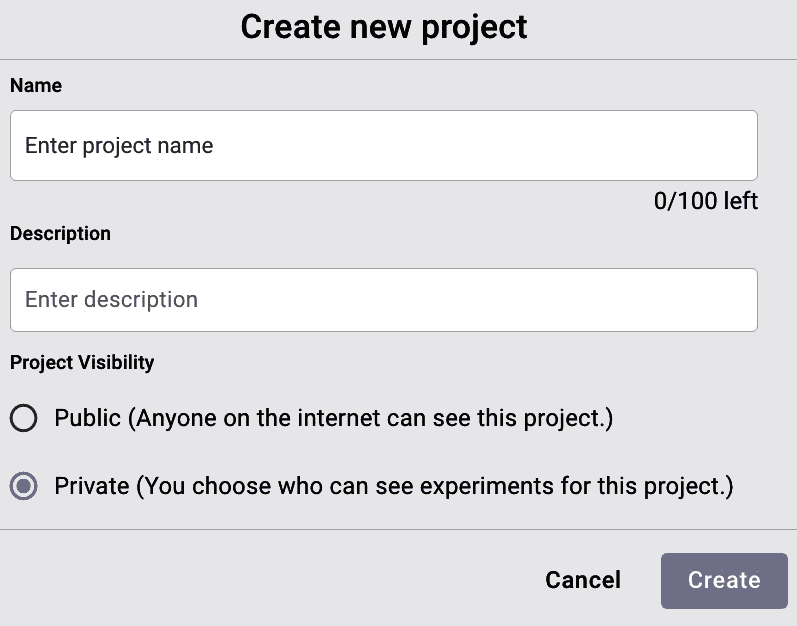

图 1.4–创建新项目窗口

该窗口包含三个部分:**名称**，您可以在其中写入项目名称，**描述**，您可以在其中提供项目摘要的文本框，以及**项目可见性**，您可以在其中决定将项目设为私有还是公共。输入所需的信息。

1.  点击**创建**按钮。

下图显示了刚刚创建的 Comet 仪表板:

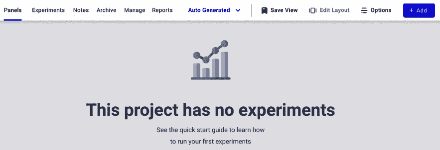

图 1.5–Comet 中一个空项目的屏幕截图

图显示了一个空项目，顶部有一个菜单，您可以在这里开始添加对象。

## 实验

Comet 实验是一个跟踪一些定义的变量在改变基本条件时如何变化的过程。一个实验的例子是机器学习项目中的超参数调整。通常，实验应该包括测试不同条件的不同运行。

Comet 定义了`Experiment`类来跟踪实验。所有的实验都由同一个 API 键标识。Comet 会自动生成一个 API 密钥。但是，如果出于某种原因您需要生成新的 API 密钥，您可以执行以下步骤:

1.  点击仪表板页面左侧的用户名。
2.  从菜单中选择**设置**。
3.  在**开发者信息**部分，点击**生成 API 密钥**。此操作将覆盖当前的 API 密钥。
4.  点击弹出窗口上的**继续**。您可以通过点击 **API key** 按钮来复制新 API Key 的值。

我们可以通过以下步骤将实验添加到项目中:

1.  点击位于右上角的**添加**按钮。
2.  从菜单中选择**新实验**。
3.  复制下面的代码(Windows/Linux 环境下的 *Ctrl* + *C* 或者 macOS 上的 *Cmd* + *C* ，然后点击 **Done** 按钮:

    ```
    # import comet-ml at the top of your file
    from comet-ml import Experiment
    # Create an experiment with your api key
    experiment = Experiment(
        api_key="YOUR API KEY",
        project_name="YOUR PROJECT NAME",
        workspace="YOUR WORKSPACE",
    )
    ```

前面的代码在 Comet 中创建了一个实验。Comet 自动设置`api_key`、`project_name`和`workspace`变量。我们可以在已经编写的代码之后粘贴前面的代码，以加载和清理数据集。

一般来说，在代码中存储 API 键是不安全的，所以 Comet 定义了两种存储 API 键的方法。首先，在一个类似 Unix 的控制台中，创建一个名为`COMET_API_KEY`的环境变量，如下所示:

```
export COMET_API_KEY="YOUR-API-KEY"
```

然后，您可以从代码中访问它:

```
import os
```

```
API_KEY = os.environ['COMET_API_KEY']
```

前面的代码使用`os`包提取`COMET_API_KEY`环境变量。

作为第二种选择，我们可以定义一个`.comet.config`文件，并将它放在我们的主目录或当前目录中，并存储 API 密钥，如下所示:

```
[comet]
```

```
api_key=YOUR-API-KEY
```

```
project_name=YOUR-PROJECT-NAME,
```

```
workspace=YOUR-WORKSPACE
```

注意变量值不应该用引号或双引号引起来。在这种情况下，当我们创建一个实验时，我们可以这样做:

```
experiment = Experiment()
```

我们可以使用`Experiment`类来跟踪数据帧、模型、度量、图形、图像、度量和工件。对于每个要跟踪的元素，`Experiment`类提供了一个特定的方法。每个跟踪功能都以`log_`开始。于是，我们有了`log_metric()`、`log_model()`、`log_image()`等等。

用一句话概括，实验是你的代码和 Comet 平台之间的桥梁。

实验也可以用作上下文管理器，例如，将训练和测试阶段分成两个不同的上下文。我们会在 [*第三章*](B17530_03_ePub.xhtml#_idTextAnchor063) ，*Comet*中的模型评估中更详细的讨论这些方面。

现在你已经熟悉了 Comet 实验，我们可以描述下一个元素——面板。

## 面板

Comet 的**面板**是数据的视觉显示器。它可以是静态的，也可以是交互式的。您可以选择是将面板设为私有、与您的协作者共享还是将其设为公共。虽然图表指的是单个实验，但是面板可以显示不同实验的数据，所以我们只能在 Comet 平台中定义面板，而不能在外部代码中定义。

Comet 提供了不同的方法来构建面板:

*   使用面板模板。
*   用 Python 写一个自定义面板。
*   用 JavaScript 编写一个自定义面板。

下面我们分别分析三种方式，从第一种开始:*使用面板模板*。

从我们项目的主页，我们可以执行以下操作:

1.  点击页面右上角的**添加**按钮。
2.  选择**新面板**。
3.  选择面板，在新窗口中选择**添加**，如下图所示:

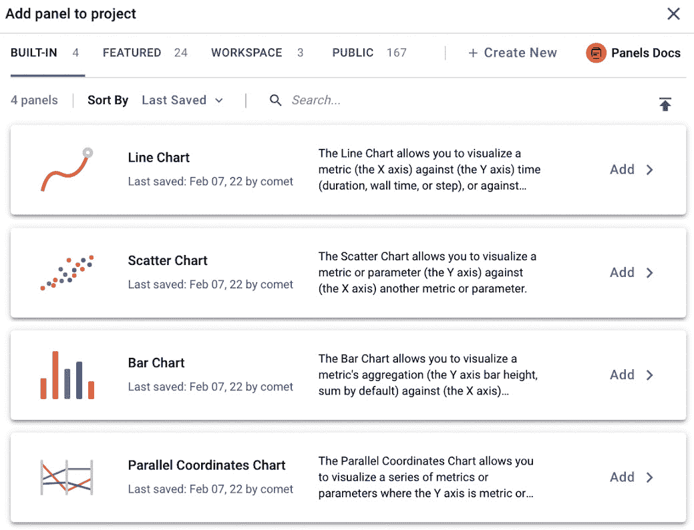

图 1.6–在 Comet 中添加面板的主窗口

该图显示了不同类型的可用面板，分为四个主要类别，由顶部菜单标识:

*   **内置**–Comet 提供了一些基本的面板。
*   **特色**–由 Comet 社区实现并提供给每个人的最受欢迎的面板。
*   **工作区**–您的私人面板，如果有的话。
*   **PUBLIC**–Comet 用户实现的所有公共面板。

我们可以通过在 Comet 界面中设置一些参数来配置内置面板，如下图所示:


图 1.7-内置 Comet 面板中的参数配置

图左侧为参数配置表，右侧为面板预览。

虽然我们可以通过 Comet 界面配置内置面板，但我们需要编写一些代码来使用其他类别的面板——特色面板、工作区面板和公共面板。在这些情况下，我们选择面板的类型，然后以键值对的形式配置相关的参数，如下图所示:


图 1.8–特色面板、工作区面板或公共面板中的参数配置

在左侧，图显示了一个文本框，我们可以在其中以 Python 字典的形式插入配置参数:

```
{"key1" : "value1",
```

```
 "key2" : "value2", 
```

```
 "keyN" : "valueN"
```

```
}
```

注意字符串的双引号。键值对取决于特定的面板。

上图还显示了右侧面板的预览，可以通过**编辑代码**按钮直接访问生成面板的代码。

到目前为止，我们已经描述了如何通过现有模板构建面板。Comet 还提供了用 Python 或 JavaScript 编写定制面板的可能性。我们将在下一章 Comet 中的 EDA 上描述这个高级特性。

现在您已经熟悉了 Comet 的基本概念，我们可以实现两个使用 Comet 的示例:

*   追踪 Comet 中的图像
*   在 Comet 中构建一个面板

让我们从第一个用例开始——在 Comet 中跟踪图像。

# 第一个用例——在 Comet 中追踪图像

对于第一次使用的情况，我们描述如何构建一个面板，显示与 Comet 中一些意大利性能指标相关的时间序列。这个例子使用了`matplotlib`库来构建图形。

您可以从该书的官方 GitHub 资源库下载该示例的完整代码，可以从以下链接获得:[https://GitHub . com/packt publishing/Comet-for-Data-Science/tree/main/01](https://github.com/PacktPublishing/Comet-for-Data-Science/tree/main/01)。

使用的数据集由世界银行在 CC 4.0 许可下提供，我们可以从以下链接下载:[https://api.worldbank.org/v2/en/country/ITA?downloadformat=csv](https://api.worldbank.org/v2/en/country/ITA?downloadformat=csv) 。

该数据集包含 1000 多个关于意大利经济表现的时间序列指标。其中，我们将重点关注与**国内生产总值** ( **GDP** )相关的 52 个指标，如下表所示:

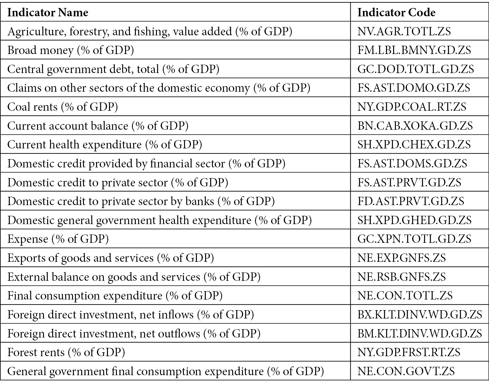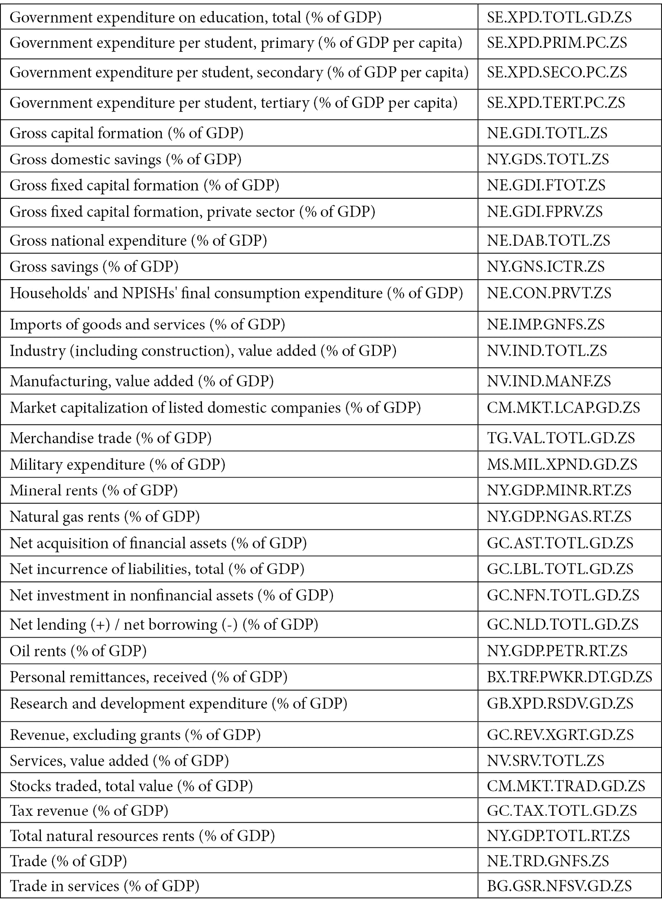

图 1.9-用于在 Comet 中构建仪表板的与 GDP 相关的时间序列指标

该表显示了指示器名称及其相关代码。

我们通过以下步骤实现 Comet 仪表板:

1.  下载数据集。
2.  清理数据集。
3.  构建可视化。
4.  整合 Comet 中的图形。
5.  建立一个面板。

因此，让我们继续在 Comet 中构建您的第一个用例，从第一步开始，下载和清理数据集。

## 下载数据集

正如在本节开始时已经说过的，我们可以从这个链接下载数据集:[https://api.worldbank.org/v2/en/country/ITA?downloadformat=csv](https://api.worldbank.org/v2/en/country/ITA?downloadformat=csv) 。在我们使用它之前，我们必须从文件中删除前两行，因为它们只是一个标题部分。我们可以执行以下步骤:

1.  从前面的链接下载数据集。
2.  解压缩下载的文件夹。
3.  进入解压后的目录，用文本编辑器打开名为`API_ITA_DS2_en_csv_v2_3472313.csv`的文件。
4.  选择并删除前四行，如下图所示:


图 1.10–要从 API _ ITA _ DS2 _ en _ CSV _ v2 _ 3472313 . CSV 文件中删除的行

1.  保存并关闭文件。现在，我们准备好打开数据集，并为后续步骤做准备。首先，我们加载数据集作为一个`pandas`数据帧:

    ```
    import pandas as pd
    df = pd.read_csv('API_ITA_DS2_en_csv_v2_3472313.csv') 
    ```

我们导入`pandas`库，然后通过`pandas`提供的`read_csv()`方法读取 CSV 文件。

下图显示了该表的摘录:

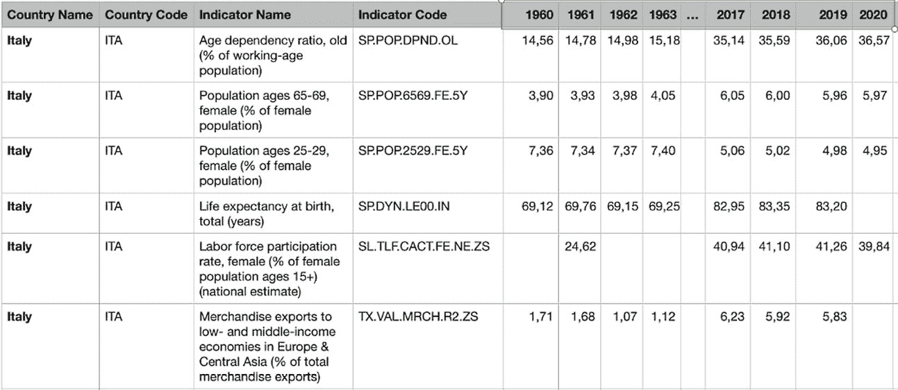

图 1.11–API _ ITA _ DS2 _ en _ CSV _ v2 _ 3472313 . CSV 数据集的摘录

数据集包含 66 列，包括以下内容:

*   **国家名称**–对于所有记录，设置为`Italy`。
*   **国家代码**–对于所有记录，设置为`ITA`。
*   **指示器名称**–描述指示器名称的文本。
*   **指示器代码**–指定与指示器相关的唯一代码的字符串。
*   *从 1960 年到 2020 年的列*——给定指标在该特定年份的特定值。
*   *空栏*–空栏。`pandas`数据帧将该列命名为`Unnamed: 65`。

现在我们已经下载并加载了数据集作为`pandas`数据帧，我们可以执行数据集清理了。

## 数据集清理

数据集存在以下问题:

*   对于我们的目的，有些列是不必要的。
*   我们只需要与 GDP 相关的指标。
*   数据集在标题中包含年份名称。
*   一些行包含缺失值。

我们可以通过以下操作清理数据集来解决前面的问题:

*   删除不必要的列。
*   仅过滤基于 GDP 的指标。
*   转置数据集以获得单列的年份。
*   处理缺失值。

现在，我们可以从第一步开始数据清理过程——删除不必要的列。我们应该删除以下各列:

*   `Country Name`
*   `Country Code`
*   `Indicator Code`
*   `Unnamed: 65`

我们可以用一行代码来执行这个操作，如下所示:

```
df.drop(['Country Name', 'Country Code', 'Indicator Code','Unnamed: 65'], axis=1, inplace = True)
```

前面的代码利用了`pandas`数据帧的`drop()`方法。作为第一个参数，我们传递要删除的列的列表。第二个参数`(axis = 1)`指定我们要删除的列，最后一个参数`(inplace = True)`指定所有的更改都必须存储在原始数据集中。

现在我们已经删除了不必要的列，我们可以只过滤基于 GDP 的指标。所有基于国内生产总值的指标都包含以下文字:`(% of GDP)`。因此，我们可以通过搜索`Indicator Name`列包含该文本的所有记录来选择这些指示器，如下面的代码所示:

```
df = df[df['Indicator Name'].str.contains('(% of GDP)')]
```

我们可以使用方括号(`df['Indicator Name'].str.contains('(% of GDP)')`)中的操作只提取符合我们标准的行，在本例中，是包含字符串`(% of GDP)`的行。我们利用 DataFrame 的`str`属性来提取`Indicator Name`列的所有字符串，然后我们将它们与字符串`(% of GDP)`进行匹配。只有当匹配时，`contains()`方法才返回`True`；否则返回`False`。

现在我们只有有趣的度量标准。因此，我们可以继续下一步:转置数据集以获得作为单列的年份。我们可以按如下方式执行此操作:

```
df = df.transpose()
```

```
df.columns = df.iloc[0] 
```

```
df = df[1:]
```

`transpose()`方法交换行和列。此外，在转置的数据帧中，我们希望将列重命名为指示器名称。我们可以通过最后两行代码来实现这一点。

现在我们已经转置了数据集，我们可以继续进行缺失值管理。我们可以采用不同的策略，如插值或平均值。然而，为了简化示例，我们决定只删除从 1960 年到 1969 年的行，这些行不包含几乎所有分析指标的值。此外，我们删除包含少于 30 个非空值的指标。

我们可以通过下面一行代码来执行这些操作:

```
df.dropna(thresh=30, axis=1, inplace = True)
```

```
df = df.iloc[10:]
```

首先，我们删除所有不到 30 个非空值的列(每个列代表一个不同的指标)。然后，我们删除从 1960 年到 1969 年的所有行。

现在，数据集已经清理完毕，可以进行进一步的分析了。下图显示了最终数据集的摘录:

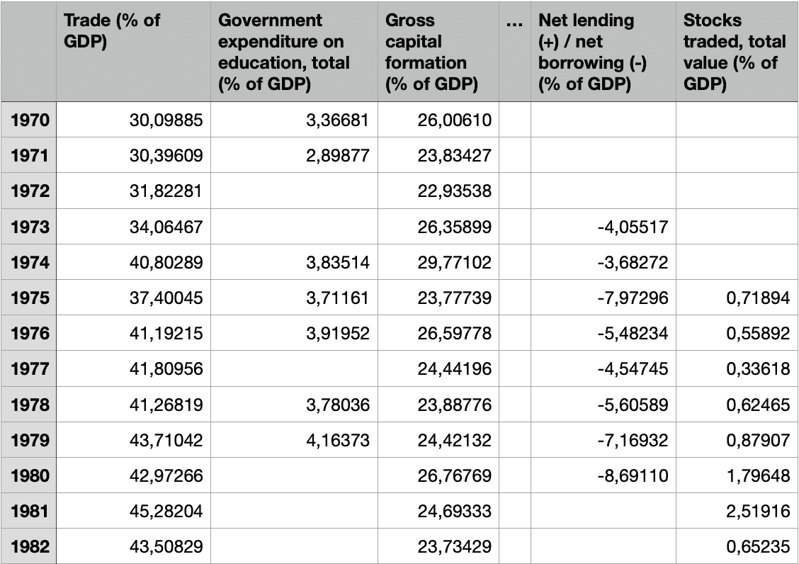

图 1.12–清洗操作后的最终数据集

该图显示，我们将不同列中的年份分组到一列中，并将一列中的指标拆分到不同的列中。在删除操作之前，之前的数据集有 61 行和 52 列。删除后，得到的数据集有 51 行和 39 列。

我们可以保存最终数据集，如下所示:

```
df.to_csv('API_IT_GDP.csv')
```

我们已经利用了由`pandas`数据帧提供的`to_csv()`方法。

现在我们已经清理了数据集，我们可以进入下一步——构建可视化。

## 构建可视化效果

对于每个指标，我们建立一个单独的图表，代表其随时间变化的趋势线。我们利用`matplotlib`库。

首先，我们定义一个简单的函数来绘制一个指标，并将图形保存在一个文件中:

```
import matplotlib.pyplot as plt
```

```
import numpy as np
```

```
def plot_indicator(ts, indicator):
```

```
    xmin = np.min(ts.index)
```

```
    xmax = np.max(ts.index)
```

```
    plt.xticks(np.arange(xmin, xmax+1, 1),rotation=45)
```

```
    plt.xlim(xmin,xmax)
```

```
    plt.title(indicator)
```

```
    plt.grid()
```

```
    plt.figure(figsize=(15,6))
```

```
    plt.plot(ts)
```

```
    fig_name = indicator.replace('/', "") + '.png'
```

```
    plt.savefig(fig_name)
```

```
    return fig_name
```

`plot_indicator()`函数接收时间序列和指示器名称作为输入。首先，我们通过`xticks()`方法设置 *x* 轴的范围。然后，我们通过`title()`方法设置标题。我们还通过`grid()`方法激活网格，并通过`figure()`方法设置图形大小。最后，我们绘制时间序列(`plt.plot(ts)`)并将其保存到我们的本地文件系统。如果指示器名称包含一个`/`，我们用一个空值替换它。该函数返回图形名称。

前面的代码生成如下图所示的图形:

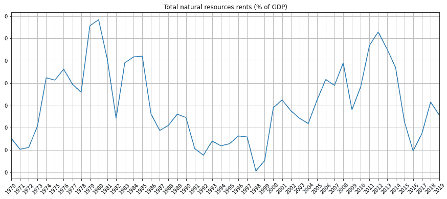

图 1.13–由 plot_indicator()函数生成的图形示例

现在我们已经设置了创建图形的代码，我们可以进入最后一步:在 Comet 中集成图形。

## 整合 Comet 中的图形

现在，我们可以按照*开始工作区、项目、实验和面板*一节中描述的步骤来创建一个项目和一个实验。我们复制生成的代码并将其粘贴到我们的脚本中:

```
from comet-ml import Experiment
```

```
experiment = Experiment()
```

我们刚刚做了一个实验。我们已经将 API 密钥和其他参数存储在位于工作目录中的`.comet.config`文件中。

现在我们准备绘制图形。我们使用 Comet 实验提供的`log_image()`方法，在 Comet 中存储每一个产生的图形:

```
for indicator in df.columns:
```

```
    ts = df[indicator]
```

```
    ts.dropna(inplace=True)
```

```
    ts.index = ts.index.astype(int)
```

```
    fig = plot_indicator(ts,indicator)
```

```
    experiment.log_image(fig,name=indicator, image_format='png')
```

我们遍历由 DataFrame 列(`df.columns`)标识的指标列表。然后，我们从当前指标中提取相关的时间序列。之后，我们通过先前定义的`plot_indicator()`函数保存该数字。最后，我们在 Comet 中加载图像。

代码是完整的，所以我们运行它。

当运行阶段完成时，可以在 Comet 中获得实验结果。为了查看生成的图形，我们执行以下步骤:

1.  打开你的 Comet 项目。
2.  从顶部菜单中选择**实验**。
3.  将出现一个包含所有已运行实验的表格。在我们的例子中，只有一个实验。
4.  单击左侧第一个单元格中的实验名称。由于我们还没有为实验设置一个特定的名称，Comet 将为我们添加它。Comet 给的名字的一个例子是 *straight_contract_1272* 。
5.  Comet 显示了一个显示所有实验细节的仪表板。点击左侧菜单中的**图形**部分。Comet 显示您生成的所有图形，如下图所示:

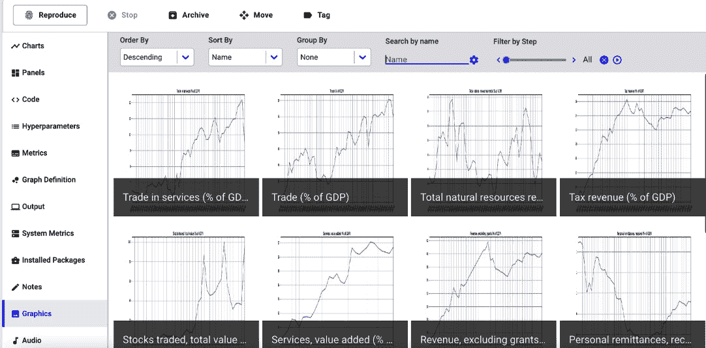

图 1.14–图形部分的屏幕截图

该图按降序显示了所有指标。或者，您可以按升序显示图形，并对其进行排序和分组。

Comet 还在左侧菜单的**资产&工件**部分下存储了原始图像，如下图所示:

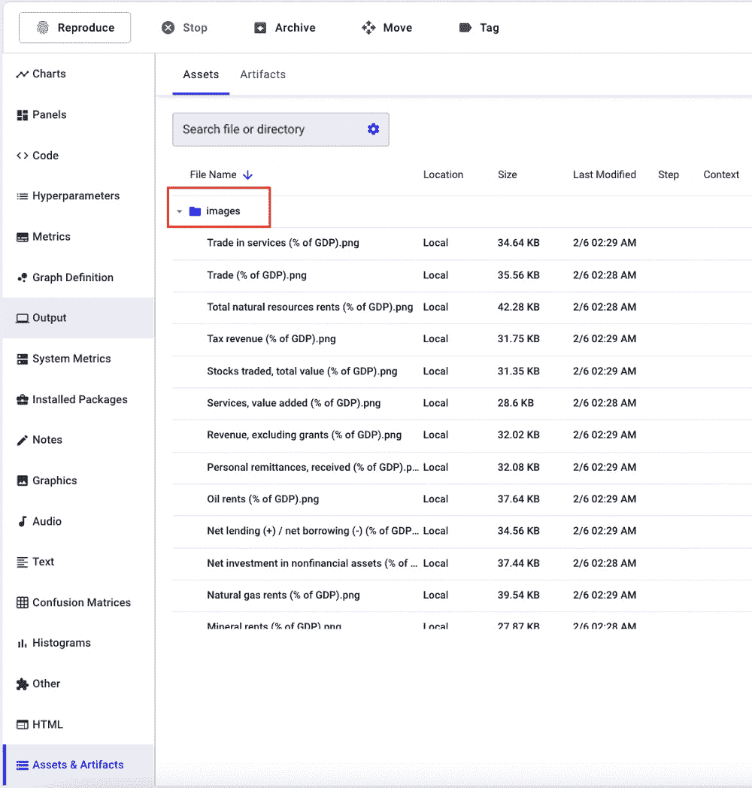

图 1.15–资产和工件部分的屏幕截图

图中显示所有的图像都存储在 **images** 目录中。**资产&工件**目录也包含两个目录，分别命名为**笔记本**和**源代码**。

最后，**代码**部分显示了生成实验的代码。这在运行不同的实验时非常有用。

既然您已经学习了如何在 Comet 中跟踪图像，我们可以用创建的图像构建一个面板。

## 构建面板

要构建显示所有跟踪图像的面板，您可以使用**显示图像**面板，该面板位于 Comet 面板的**特色面板**选项卡上。要添加此面板，我们需要执行以下步骤:

1.  在 Comet 主仪表板上，点击右上角的**添加**按钮。
2.  选择**新面板**。
3.  选择**精选**选项卡| **展示图片** | **添加**。

将打开一个新窗口，如下图所示:


图 1.16–构建名为“显示图像”的特色面板的界面

该图显示了带有所有图像的面板预览。我们可以通过在左侧文本框中指定以下参数，通过仅包含一个图像的键-值对来设置一些变量:

```
{  "imageFileName": "Gross fixed capital formation (% of GDP).png" }
```

`"imageFileName"`参数允许我们精确指定要绘制的图像。下图显示了指定图像文件名后生成的面板的预览:

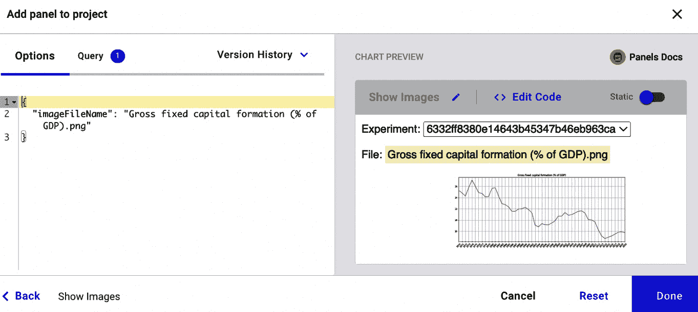

图 1.17–指定键值对后“显示图像”面板的预览

该图显示了我们如何根据键值变量来操作面板的输出。面板接受的变量取决于具体的面板。我们将在下一章更深入地研究这方面。

现在我们已经了解了如何开始使用 Comet，我们可以继续看一个更复杂的例子，它实现了一个简单的线性回归模型。

# 第二个用例——简单线性回归

这个例子的目的是展示如何在 Comet 中记录一个指标。具体来说，我们设置了一个实验，该实验计算通过用不同的训练集拟合线性回归模型而产生的不同值的**均方误差** ( **MSE** )。通过指定不同的种子，每个训练集都来自相同的原始数据集。

您可以从该书的官方 GitHub 资源库下载该示例的完整代码，可以从以下链接获得:[https://GitHub . com/packt publishing/Comet-for-Data-Science/tree/main/01](https://github.com/PacktPublishing/Comet-for-Data-Science/tree/main/01)。

我们使用`scikit-learn` Python 包来实现线性回归模型。对于这个用例，我们将使用由`scikit-learn`提供的糖尿病数据集。

我们分三步组织实验:

*   初始化上下文。
*   定义、拟合和评估模型。
*   在 Comet 中显示结果。

让我们从第一步开始:初始化上下文。

## 初始化上下文

首先，我们在我们的工作目录中创建一个`.comet.config`文件，正如在*实验*部分的*开始工作空间、项目、实验和面板*中所解释的。

作为我们代码的第一条语句，我们创建了一个 Comet**实验**，如下所示:

```
from comet-ml import Experiment
```

```
experiment = Experiment()
```

现在，我们加载由`scikit-learn`提供的糖尿病数据集，如下所示:

```
from sklearn.datasets import load_diabetes
```

```
 diabetes = load_diabetes()
```

```
X = diabetes.data
```

```
y = diabetes.target
```

我们加载数据集并将`data`和`target`分别存储在`X`和`y`变量中。

我们的上下文已经准备好了，所以我们可以进入实验的第二部分:定义、拟合和评估模型。

## 定义、拟合和评估模型

让我们从进口开始:

1.  首先，我们导入我们将使用的所有库和函数:

    ```
    import numpy as np
    from sklearn.model_selection import train_test_split
    from sklearn.linear_model import LinearRegression
    from sklearn.metrics import mean_squared_error
    ```

我们导入 NumPy，我们将使用它来构建不同种子的数组，以及用于建模阶段的其他`scikit-learn`类和方法。

1.  我们设置种子进行测试，如下:

    ```
    n = 100
    seed_list = np.arange(0, n+1, step = 5)
    ```

我们定义了 20 种不同的种子，范围从 0 到 100，其中的步长为 5。因此，我们有 0，5，10，15 … 95，100。

1.  对于每个种子，我们提取不同的训练和测试集，用于训练相同的模型，计算 MSE，并使用以下代码将其记录在 Comet 中:

    ```
    for seed in seed_list:
        X_train, X_test, y_train, y_test = train_test_split(X, y, test_size=0.20, random_state=seed)
        model = LinearRegression()
        model.fit(X_train,y_train)
        y_pred = model.predict(X_test)
        mse = mean_squared_error(y_test,y_pred)
        experiment.log_metric("MSE", mse, step=seed)
    ```

在前面的代码中，我们首先使用当前种子将数据集分为训练集和测试集。我们为测试集保留 20%的数据，其余 80%为训练集保留。然后，我们构建线性回归模型，拟合它(`model.fit()`)，并预测测试集的下一个值(`model.predict()`)。我们也通过`mean_squared_error()`函数计算 MSE。最后，我们通过`log_metric()`方法在 Comet 中记录度量。`log_metric()`方法接收指标名作为第一个参数，指标值作为第二个参数。我们还为度量指定步长，在我们的例子中对应于种子。

现在，我们可以启动代码并在 Comet 中看到结果。

## 在 Comet 上显示结果

为了在 Comet 中查看结果,我们执行以下步骤:

1.  打开您的 Comet 项目。
2.  从顶部菜单中选择**实验**。
3.  仪表板显示了所有实验的列表。在我们的例子中，只有一个实验。
4.  单击左侧第一个单元格中的实验名称。由于我们还没有设置实验名称，Comet 已经为我们设置了实验名称。Comet 显示了一个显示所有实验细节的仪表板。

在我们的实验中，我们可以在三个不同的部分看到一些结果:**图表**、**指标**和**系统指标**。

在**图表**部分，Comet 显示了我们的代码生成的所有图表。在我们的例子中，只有一个图形涉及 MSE，如下图所示:

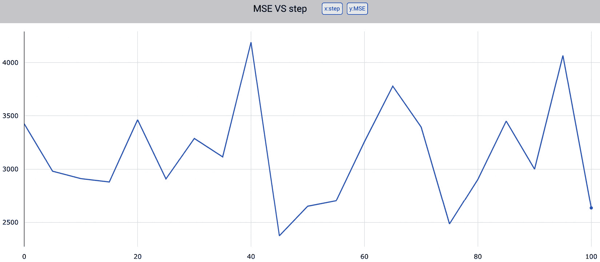

图 1.18-作为 train_test_split()的输入提供的不同种子的 MSE 值

该图显示了 MSE 的值如何依赖于作为输入提供给`train_test_split()`函数的种子值。生成的图表是交互式的，因此我们可以查看趋势线中的每个值。我们可以将所有的图表下载为`.jpeg`或`.svg`文件。此外，我们可以下载生成图表的数据作为一个`.json`文件。下面这段代码显示了生成的 JSON:

```
[{"x": [0,5,10,15,20,25,30,35,40,45,50,55,60,65,70,75,80,85,90,95],
```

```
"y":[3424.3166882137334,2981.5854714667616,2911.8279516891607,2880.7211416534115,3461.6357411723743,2909.472185919797,3287.490246176432,3115.203798301772,4189.681600195272,2374.3310824431856,2650.9384531241985,2702.2483323059314,3257.2142019316807,3776.092087838954,3393.8576719100192,2485.7719017765257,2904.0610865479025,3449.620077951196,3000.56755060663,4065.6795384526854],
```

```
"type":"scattergl",
```

```
"name":"MSE"}]
```

前面的代码显示有两个变量，`x`和`y`，并且图形的类型是`scattergl`。

在**指标**部分，Comet 显示了一个包含所有记录指标的表格，如下图所示:


图 1.19–Comet 中的指标部分

对于每个指标，Comet 都显示了最后的、最小的和最大的值，以及决定这些值的步骤。

最后，在**系统指标**部分，Comet 显示了一些关于系统状况的指标，包括内存使用和 CPU 使用，以及 Python 版本和操作系统的类型，如下图所示:

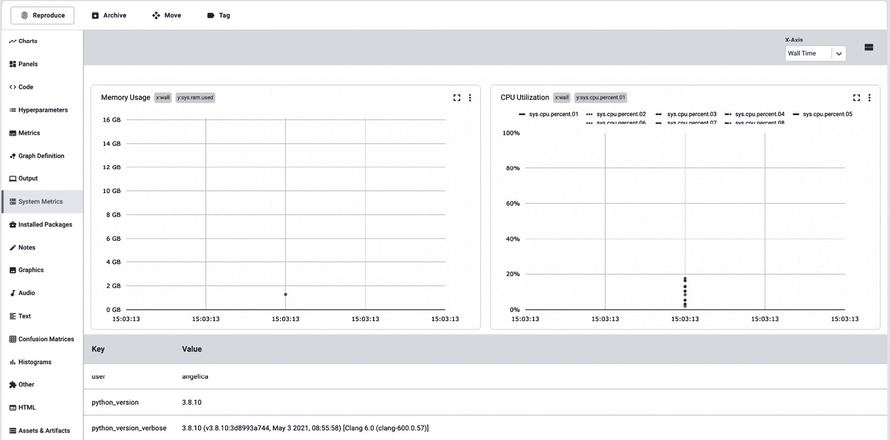

图 1.20–Comet 中的系统指标

**系统指标**部分显示了两个图表，一个是内存使用情况(图中左侧)，另一个是 CPU 利用率(图中右侧)。在图表下面，**系统度量**部分还显示了一个表格，其中包含关于生成实验的机器的其他有用信息。

# 总结

我们刚刚完成了 Comet 入门之旅的第一步！

在本章中，我们描述了 Comet 平台的动机和目的，以及如何开始使用它。我们展示了 Comet 可以用在数据科学项目的几乎所有步骤中。

我们还举例说明了工作区、项目、实验和面板的概念，并设置了使用 Comet 的环境。最后，我们实现了两个实际例子来熟悉 Comet。

既然您已经学习了基本概念，并且我们已经建立了环境，我们可以继续学习 Comet 提供的更具体和复杂的特性。

在下一章，我们将回顾一些关于 EDA 的概念，以及如何在 Comet 中执行 EDA。

# 延伸阅读

*   Grus，J. (2019)。*从零开始的数据科学:Python 的基本原理*。奥莱利媒体。
*   普雷沃斯出版社(2019 年)。*战略数据科学的原则:从大数据和小数据中创造价值*。帕克特出版有限公司