# 七、使用 Comet 扩展 GitLab DevOps 平台

当您实施数据科学项目时，您应该考虑到您的模型可能会由于各种因素而老化，例如概念漂移或数据漂移。因此，您的项目可能需要不断更新。

在前一章中，您学习了与 DevOps 相关的基本原则，它允许您将项目从测试阶段转移到生产阶段。然而，这不足以有效地处理持续的更新。事实上，您可能需要开发一个自动或半自动的过程，允许您轻松地从构建/测试阶段进入生产阶段，而无需太多的手动干预。

在这一章中，你将回顾**持续集成和持续交付** ( **CI/CD** )背后的基本概念，这两种策略允许你轻松地自动更新你的代码，并有效地从构建/测试转移到生产。您还将学习如何使用 GitLab 实现 CI/CD，git lab 是一个非常流行的软件管理平台。然后，您将配置 GitLab 与 Comet 一起工作。最后，您将看到一个实际的例子，它将帮助您熟悉所描述的概念。

本章组织如下:

*   介绍 CI/CD 的概念
*   在 GitLab 中实现 CI/CD 工作流
*   将 Comet 与 GitLab 集成
*   将 Docker 与 CI/CD 工作流集成

在进入第一步之前，让我们安装运行本章中实现的代码所需的软件。

# 技术要求

本章中描述的示例使用了以下软件/工具:

*   计算机编程语言
*   Git 客户端

## Python

我们将使用 Python 3.8。你可以在[https://www.python.org/downloads/](https://www.python.org/downloads/)官网下载，选择 3.8 版本。

本章中描述的示例使用了以下 Python 包:

*   `comet_ml 3.23.0`
*   `pandas 1.3.4`
*   `scikit-learn 1.0`
*   `requests 2.27.1`
*   `Flask 2.1.1`

我们在 [*第一章*](B17530_01_ePub.xhtml#_idTextAnchor015) 、*Comet 概述*中描述了前两个包以及如何安装。有关安装的更多详细信息，请参阅后面的内容。

## Git 客户端

Git 客户端是一个命令行工具，它允许你与**源代码控制系统** ( **SCS** )进行通信。在本章中，您将使用 Git 客户端与 GitLab 进行交互。您可以按如下方式安装它:

对于 macOS 用户，打开一个终端并运行以下命令:

1.  安装 XCode 命令行工具如下:

    ```
     xcode-select --install
    ```

2.  然后，安装家酿如下:

    ```
    /bin/bash -c "$(curl -fsSL https://raw.githubusercontent.com/Homebrew/install/HEAD/install.sh)"
    ```

更多细节，你可以阅读家酿官方文档，可在以下链接获得:【https://brew.sh/。

1.  最后，安装 Git 如下:

    ```
    brew install git
    ```

对于 Ubuntu Linux 用户，您可以打开终端并运行以下命令:

```
sudo apt-add-repository ppa:git-core/ppa 
```

```
sudo apt-get update 
```

```
sudo apt-get install git
```

对于 Windows 用户，你可以从以下链接下载:[https://git-scm.com/download/win](https://git-scm.com/download/win)。下载完成后，您可以按照指导步骤进行安装。

对于所有用户，您可以通过在终端中运行以下命令来验证 Git 是否工作:

```
git --version
```

关于如何安装 Git 的更多细节，你可以阅读 Git 官方文档，可以从以下链接获得:[https://Git-SCM . com/book/en/v2/Getting-Started-Installing-Git](https://git-scm.com/book/en/v2/Getting-Started-Installing-Git)。

现在，您已经安装了运行本章中描述的示例所需的所有软件和工具，我们可以继续讨论第一个主题，即介绍 CI/CD 的概念。

# 引入 CI/CD 的概念

DevOps 最佳实践允许我们通过不同的步骤建立连接开发阶段和运营阶段的管道。在上一章中，您学习了如何首次部署您的数据科学项目。您通过构建 Docker 映像并将其部署到 Kubernetes 中来手动实现所有步骤。但是，如果您对软件执行每日更新，则此描述的过程不适用。

为了自动化开发和运营阶段之间的集成，我们应该引入两个新概念，即 CI/CD 和 SCS。

本节组织如下:

*   CI/CD 概述
*   SCS 的概念
*   CI/CD 工作流

先说第一点，这是 CI/CD 的概述。

## CI/CD 概述

当在生产中使用软件时，无论是通用应用还是机器学习预测服务，您(或其他用户)可能会发现代码中的一些 bug，或者可能想要添加新功能。出于这个原因，您应该能够定义一个自动过程，允许您不断更新您的软件。在这种情况下，您可以使用 CI/CD 策略。

每当代码发生变化时，CI 就涉及到构建和测试阶段的自动化。CD 将 CI 阶段构建的软件部署到类似生产的环境中。通常，这个阶段需要一个手动批准步骤来将软件投入生产。一种更先进的机制包括**连续部署**，将人工审批步骤转变为自动化流程。

要执行 CI/CD，您需要一个跟踪所有软件变更并使开发和操作阶段之间的通信成为可能的 SCS，如下图所示:

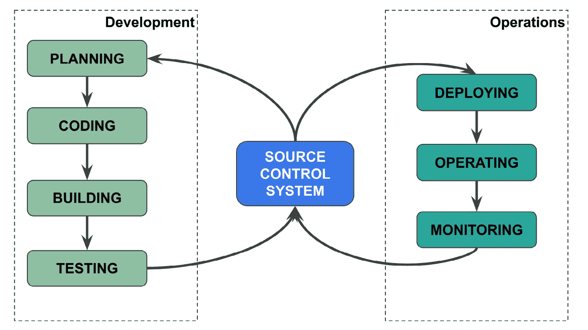

图 7.1–SCS 在 DevOps 中的角色

上图显示的是 DevOps 的生命周期，在 [*第六章*](B17530_06_ePub.xhtml#_idTextAnchor126) 、*将 Comet 集成到 DevOps* 中已经描述过，其中的释放步骤已经被 SCS 取代。实际上，SCS 是一个存储软件并跟踪其更新的仓库。开发团队将软件存储在 SCS 中，并定期更新。运营团队从 SCS 下载软件，当他们批准后，软件就进入生产阶段。由于 SCS 的存在，CI/CD 程序是自动的。

现在您已经熟悉了 CI/CD 的概念，我们可以更详细地研究 SCS 的概念及其工作原理。

## SCS 的概念

一个 SCS，也被称为**版本控制系统** ( **VCS** )，使你能够存储你的代码，跟踪代码历史，合并代码变更，并且如果需要的话返回到先前的代码版本。此外，SCS 允许您与您的团队共享您的代码，并在本地处理您的代码，直到它准备好。因为 SCS 是代码的集中来源，所以您可以使用它来轻松构建 DevOps 生命周期。

下图显示了 SCS 的基本架构:

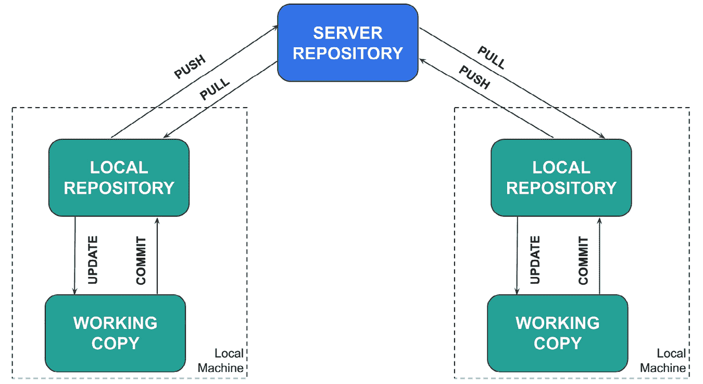

图 7.2–SCS 的基本架构

SCS 由一个中央服务器存储库组成，该存储库存储代码，并跟踪其所有历史，如下所示:

1.  第一次想要下载代码时，需要在构建了本地存储库的本地机器上克隆它。
2.  然后，您可以在本地工作副本上工作，它实际上对应于本地文件系统中的一个目录。您在工作副本中对代码所做的所有更改都不会影响您的本地存储库或服务器存储库。
3.  要将您的本地更改注册到本地存储库中，您应该运行`COMMIT`命令。
4.  要将本地存储库的更改注册到服务器存储库，您应该运行`PUSH`命令。

在对您的代码进行任何更改之前，您应该总是通过`PULL`命令从服务器存储库中更新您的代码，并且通过`UPDATE`命令从您的本地存储库中更新您的代码。

当多个开发人员一起工作时，所描述的机制工作得很好，因为每个开发人员都在他们的本地机器上工作，当代码准备好时，他们将更改保存到服务器存储库中。通过 SCS，您可以将您的提交推给其他开发人员，也可以将他们的提交拉至您的本地存储库。

通常，当您想要对代码提出一些更改时，您不会将它们推送到主存储库。相反，您创建一个包含您的更改的新分支。一个**分支**是从主项目中分离出来的版本的存储库，因为它包含了一些变更的提议。使用分支允许您独立于主存储库中可用的稳定版本来处理代码。将分支与主存储库合并的操作称为合并。

现在您已经了解了 SCS 背后的主要概念，我们可以继续下一点，即 CI/CD 工作流。

## CI/CD 工作流程

下图显示了典型的 CI/CD 工作流程:

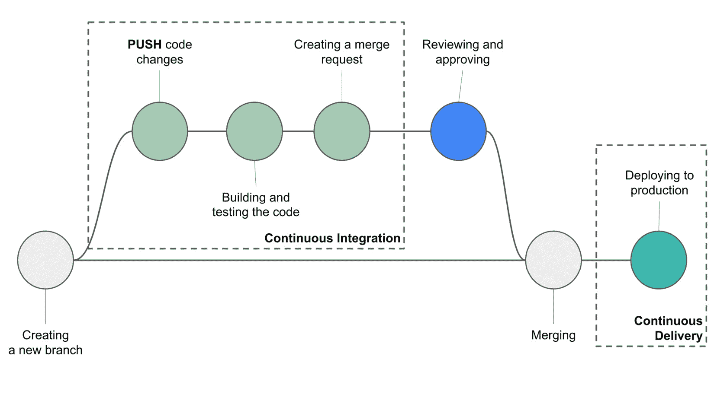

图 7.3–典型的 CI/CD 工作流程

让我们假设您想要对已经托管在 SCS 上的代码进行一些更改。您应该执行以下操作:

1.  为您的代码创建一个新分支。
2.  接下来，将新代码推送到服务器存储库。
3.  CI 策略自动构建和测试您的代码。
4.  如果您的代码通过了测试，您就可以创建一个合并请求。否则，您需要对代码执行其他更改，并创建一个新的 push，这将触发自动构建和测试。
5.  一旦您的代码通过了所有的测试，您需要手动批准它(在 CD 的情况下)或者自动程序批准它(在持续部署的情况下)。
6.  批准后，分支被合并到主存储库中。
7.  最终，新代码被转移到生产中。

许多平台都实现了 CI/CD 工作流。在下一节中，我们将回顾业界最受欢迎的平台之一 GitLab。

# 在 GitLab 中实施 CI/CD 工作流程

GitLab 是一个 SCS，它允许你通过一个版本控制系统来存储你的代码。此外，它还为您提供了实施 CI/CD 工作流的所有工具。GitLab 平台在以下链接可用:【https://gitlab.com/】T4。你可以通过以下链接创建一个帐户来开始使用 git lab:[https://gitlab.com/users/sign_up](https://gitlab.com/users/sign_up)。

该部分的组织结构如下:

*   创建/修改 GitLab 项目
*   探索 GitLab 内部结构
*   探索 CI/CD 的 GitLab 概念
*   构建 CI/CD 管道
*   创建版本

让我们从第一点开始，即创建/修改 GitLab 项目。

## 创建/修改 GitLab 项目

GitLab 项目的基本操作包括以下步骤:

1.  创建新项目
2.  向项目中添加新的分支
3.  创建合并请求

让我们分别研究每个步骤，从第一步开始:创建一个新项目。

### 创建新项目

您可以在 GitLab 中创建一个新项目，如下所示:

1.  登录 GitLab 平台。
2.  在主仪表板上，点击页面右上角的**新项目**按钮。
3.  选择**创建空白项目**，填写表格，然后点击**创建项目**按钮。
4.  现在你的项目在 GitLab 平台上。你可以通过选择左边菜单中的**库**将其下载到你的本地机器上，然后你可以点击**克隆**按钮。将打开一个弹出窗口。您可以复制由带有 HTTPS 标签的**克隆定义的地址，如下图所示:**

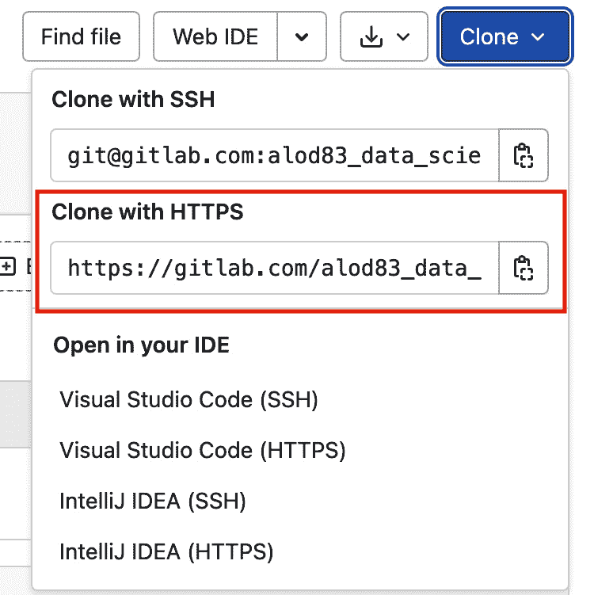

图 7.4–在本地文件系统中复制 GitLab 项目的地址

地址以`https://gitlab.com/`开头，包含您的项目组的路径。

1.  打开一个终端，运行以下命令:

    ```
    git clone <PASTE_HERE_YOUR_COPIED_ADDRESS>
    ```

2.  终端将要求您提供凭证。你可以输入它们。一旦该过程完成，一个新的目录将出现在您的文件系统中。目录的名称是 GitLab 中的项目名称。

此时，您在本地文件系统中有了 GitLab empty 项目的工作副本。可以开始编辑了。

1.  例如，您可以向存储库中添加一个名为`helloWorld.py`的简单文件，该文件只打印`'Hello World!'`字符串，如下面的代码所示:

    ```
    if __name__ == "__main__":
        print('Hello World!')
    ```

2.  您可以将脚本添加到 GitLab 工作副本，如下所示:

    ```
    git add helloWorld.py
    ```

我们使用`add`命令向工作副本添加一个新文件。

1.  您可以将脚本添加到本地 GitLab 存储库中，如下所示:

    ```
    git commit –m "my message"
    ```

2.  最后，您可以将更改保存到远程服务器，如下所示:

    ```
    git push origin main
    ```

关键字`main`表示您正在将更改保存到主分支。`git`命令可能会提示您设置上游，这是当前本地分支的默认远程分支。您可以通过`–u`选项直接设置上游分支，如下所示:

```
git push –u origin main
```

到目前为止，您已经使用了主分支。然而，当你想在一个稳定的项目中添加新的特性时，最好在一个单独的分支上工作。那么，让我们看看如何创建一个新的分支。

### 添加新分支

让我们假设现在你想改变脚本打印的原文如下:

```
if __name__ == "__main__":
```

```
    print('Hi!')
```

现在您想要将更改保存到存储库的一个新分支中。您可以按如下方式进行操作:

1.  首先，创建一个名为`new_branch`的新分支，如下:

    ```
    git checkout -b new_branch
    ```

您可以使用`checkout`关键字来创建一个新的分支，也可以使用`–b`选项来设置分支名称。

1.  然后，将脚本添加到分支，如下所示:

    ```
    git add helloWorld.py
    ```

2.  将更改提交到本地存储库，如下所示:

    ```
    git commit -m "modified greeting string" 
    ```

3.  最后，将变更推送到新的分支，如下所示:

    ```
    git push origin new_branch 
    ```

如果您访问 GitLab 仪表板，您可以看到系统已经创建了一个新的分支，如下图所示:

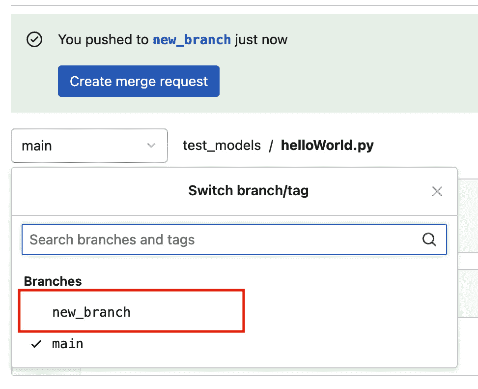

图 7.5–git push 命令后在 GitLab 中创建的新分支

创建的分支保持待定，直到您创建一个合并请求。我们来考察一下如何执行。

### 创建合并请求

*图 7.5* 显示 git lab 平台提出创建分支的合并请求(图顶部绿色矩形，带蓝色按钮)。以下是创建合并请求的步骤:

1.  如果您点击 **Create merge request** 按钮，GitLab dashboard 会要求您为合并请求填写一些字段，比如相关的消息。
2.  然后，您可以再次点击按钮**创建合并请求**。
3.  存储库的维护者将会收到一个通知，指明有一个合并请求。
4.  维护者(在本例中是您)只需点击**合并**按钮就可以批准合并请求，如下图所示:

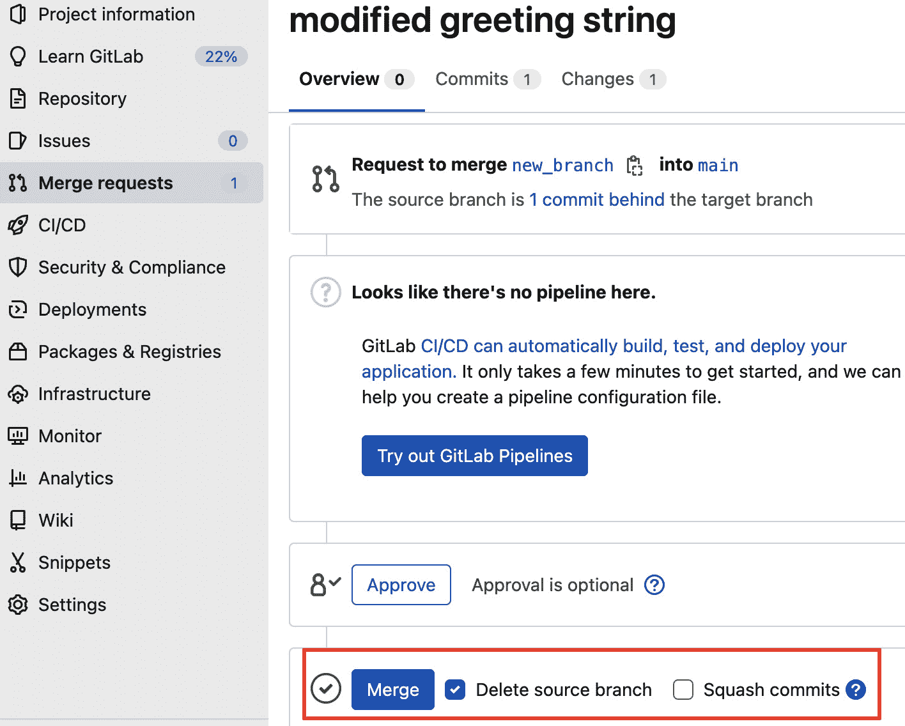

图 7.6–批准合并请求

一旦合并请求被批准，您在分支中执行的所有变更都会被转移到主分支中。

现在您已经学习了在 GitLab 中创建和修改项目的基本概念，我们可以进入下一步，即探索 GitLab 的内部结构。

## 探索 GitLab 的内部结构

为了存储项目的内容，GitLab 使用了以下三个主要概念:

*   一滴
*   树
*   犯罪

让我们分别研究一下每个概念。

### 一滴

一个 **blob** (是**二进制大对象**的缩写)代表一个文件的内容，没有它的元数据或文件名。实际上，文件的 blob 是该文件的关联 SHA1 散列。具有相同内容的不同文件具有相同的 blob。GitLab 将所有 blobs 存储在 GitLab 项目内名为`.git/objects`的本地目录中。每当您通过`git add`命令向存储库添加一个新文件时，一个新的 blob 对象就会被添加到`.git/objects`目录中，前提是在`.git/objects`目录中还没有相同的内容。

### 树

Blobs 是由树组成的,树代表目录。每次你运行一个`git commit`命令，GitLab 就会在`.git/objects`目录中创建一个新的树。树对象包含以下内容:

*   包含在树中的 blob 标识符
*   文件的路径
*   与该目录中所有文件关联的元数据

下面这段代码显示了树内容的一个示例:

```
100644 blob ce013625030ba8dba906f756967f9e9ca394464a
```

```
     file1.txt
```

```
100644 blob e69de29bb2d1d6434b8b29ae775ad8c2e48c5391
```

```
     file2.txt
```

前面的树包含两个名为`file1.txt`和`file2.txt`的斑点。

### 犯罪

当您运行命令`git commit`时，GitLab 还会在`.git/objects`目录中添加一个提交对象。提交对象指向`tree`对象，如下面这段代码所示:

```
tree dca98923d43cd634f4359f8a1f897bf585100cfe
```

```
author Author Name <author's computer name> 1656927878 +0200
```

```
committer Author Name <author's computer name> 1656927878 +0200
```

```
My commit message
```

您可以看到对树的引用、执行提交的作者以及提交消息(示例中的`My commit message`)。

如果您访问`.git/objects`目录，您可以检查对象的类型，如下所示:

1.  首先，取包含要检查的对象的目录名(比如`7f`)。
2.  接下来，将您想要检查的对象的前两个字符附加到目录名中。例如，如果对象名是`dca98923d43cd634f4359f8a1f897bf585100cfe`，你把`dc`附加到`7f`。作为结果字符串，您有`7fdc`。
3.  从`.git/objects`目录中，运行以下命令查看对象的类型:

    ```
    git cat-file –t 7fdc
    ```

您可以输出`blob`、`tree`或`commit`文件类型。

1.  或者，您可以通过运行以下命令来查看对象的内容:

    ```
    git cat-file –p 7fdc
    ```

对于前面的命令，使用`–p`参数。

现在您已经了解了 GitLab 的内部结构，我们可以继续下一点，即探索用于 CI/CD 的 GitLab 概念。

## 探索用于 CI/CD 的 GitLab 概念

GitLab 定义了以下实施 CI/CD 工作流的概念:

*   **作业**:git lab CI/CD 工作流程中可以运行的最小单元。例如，作业可以是编译、构建或运行任务。
*   **阶段**:定义何时运行作业的逻辑表示。
*   **流水线**:在不同阶段组织起来的作业的集合。
*   **Runner** :运行作业的代理。

要在 GitLab 中配置 CI/CD 工作流，应该将`.gitlab-ci.yml`添加到您的项目中。存储库中出现一个`.gitlab-ci.yml`文件会自动触发一个 GitLab 运行程序来执行作业中定义的脚本。

要定义 CI/CD 工作流的阶段，您可以在`.gitlab-ci.yml`文件中使用`stages`关键字，如以下代码所示:

```
stages:
```

```
  - build
```

```
  - test
```

```
  - deploy
```

在前面的例子中，我们定义了三个阶段:`build`、`test`和`deploy`。这些阶段按顺序执行，从第一个阶段开始到最后一个阶段。

要定义作业，可以使用通用名称，后跟作业所属的阶段以及要运行的脚本，如下例所示:

```
my-job:
```

```
  stage: build
```

```
  script:
```

```
    - echo "Hello World!"
```

在前面的例子中，我们定义了一个名为`my-job`的作业，它属于`build`阶段，只是打印以显示句子`"Hello World!"`。

默认情况下，GitLab 运行程序会同时运行同一个阶段中的所有作业。这个过程也称为基本流水线。但是，您可以通过在作业定义中使用`needs`关键字自定义作业的顺序，而不管它们属于哪个阶段。例如，如果您想指定`job2`必须在`job1`之后运行，您可以编写以下代码:

```
job1:
```

```
  stage: build
```

```
  script:
```

```
    - echo "Hello World from Job1!"
```

```
job2:
```

```
  needs:
```

```
 - job1
```

```
  stage: build
```

```
  script:
```

```
    - echo "Hello World from Job2!"
```

我们使用关键字`needs`来表示`job2`对`job1`的依赖。

现在您已经学习了 CI/CD 的基本 GitLab 概念，我们可以实现一个实际的例子。

## 建设 CI/CD 管道

让我们假设现在您想要实现一个 CI/CD 工作流，它在您每次将变更推送到您的存储库的一个分支时被触发。其想法是实施图 7.3 所示的 CI/CD 工作流程。

作为一个用例，我们可以通过向`test_models`存储库添加一个新的脚本来扩展在*创建/修改 GitLab 项目*一节中描述的例子。该脚本只是在众所周知的糖尿病数据集上构建一个线性回归模型，并计算均方误差指标。

要为此项目配置 CI/CD 工作流，您应执行以下步骤:

*   编写主脚本
*   配置流道
*   配置`.gitlab-ci.yml`文件
*   创建合并请求

让我们从第一步开始，也就是写主脚本。

### 编写主脚本

名为`linear_regression.py`的脚本加载 scikit-learn 库提供的众所周知的糖尿病数据集，用训练集对其进行训练，然后计算出**均方误差** ( **MSE** )度量。

下面这段代码显示了实现上述步骤的代码:

```
from sklearn.datasets import load_diabetes
```

```
from sklearn.model_selection import train_test_split
```

```
from sklearn.linear_model import LinearRegression
```

```
from sklearn.metrics import mean_squared_error
```

```
diabetes = load_diabetes()
```

```
X = diabetes.data
```

```
y = diabetes.target
```

```
X_train, X_test, y_train, y_test = train_test_split(X, y, test_size=0.20, random_state=42)
```

```
model = LinearRegression()
```

```
model.fit(X_train,y_train)
```

```
y_pred = model.predict(X_test)
```

```
mse = mean_squared_error(y_test,y_pred)
```

```
print(f"MSE: {mse}")
```

脚本只是打印 MSE 值。由于脚本使用了`scikit-learn`库，我们还在项目存储库中包含了一个`requirements.txt`文件。这个文件仅仅包含了`scikit-learn`库名。

现在，您可以执行以下步骤:

1.  如前一节所述，将文件添加到 GitLab 存储库中:

    ```
    git add linear_regression.py
    git add requirements.txt
    ```

2.  然后，您可以首先将更改提交到您的本地存储库，然后提交到 GitLab 远程服务器，如下所示:

    ```
    git commit –m "added linear regression "
    git push origin main
    ```

一旦推送操作终止，您应该能够在 GitLab 仪表板上看到这些文件。

现在您已经编写了主脚本，我们可以通过执行下一步来实现 CI/CD 工作流，下一步是配置一个 runner。

### 配置流道

首先，我们需要设置一个 runner，这是一个执行作业的进程。在这个例子中，我们将使用 GitLab 提供的共享运行器。然而，你可以按照 GitLab 官方文档中的描述实现你自己的定制运行器，可以从以下链接获得:[https://docs.gitlab.com/runner/](https://docs.gitlab.com/runner/)。

要配置流道，您可以按如下方式进行:

1.  在 GitLab 仪表板上，通过选择**菜单** | **项目** | **您的项目**来访问您的项目。然后，选择您的项目名称，在我们的例子中是`test_models`。
2.  在左侧菜单中，选择**设置**，然后选择 **CI/CD** 。在**滑道**部分，点击**展开**按钮。
3.  确保**下的滑块为项目**启用共享跑步者处于活动状态。如果没有，请启用它。下图中的显示了您应该点击哪里来启用跑步者:

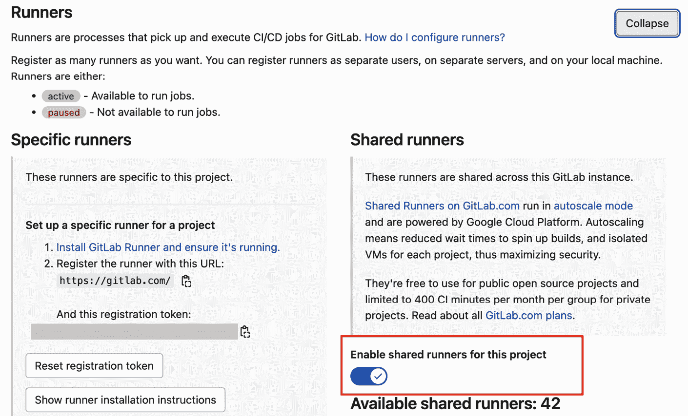

图 7.7–如何启用 GitLab 运行程序

现在您已经配置了跑步者，您可以配置`.gitlab-ci.yml`文件了。

### 正在配置。gitlab-ci.yml 文件

我们需要对`.gitlab-ci.yml`进行如下配置:

1.  在左侧菜单中，选择 **CI/CD** ，然后选择**编辑器**。一个**编辑器**打开，带有一个`.gitlab-ci.yml`文件的基本模板。您可以通过以下步骤修改基本模板。
2.  首先，您可以导入基本的 Docker 图像，如下所示:

    ```
    image: python:3.8
    ```

因为我们的脚本是用 Python 编写的，所以我们只需要导入 Python 解释器。

1.  接下来，您可以定义一个阶段，如下所示:

    ```
    stages:          
      - run
    ```

2.  为了使已安装的包在随后的运行阶段也可以访问，我们缓存了它们。首先，我们定义一个缓存工作目录如下:

    ```
    variables:
      PIP_CACHE_DIR: "$CI_PROJECT_DIR/.cache/pip"
    ```

`$CI_PROJECT_DIR`包含项目的当前目录。

1.  为了缓存已安装的包，您应该将它们安装在虚拟环境中，并且也缓存它们:

    ```
    cache:
      paths:
        - .cache/pip
        - venv/
    ```

`cache`关键字指定了应该缓存的文件列表。`paths`关键字决定将哪些文件添加到缓存中。

1.  现在您定义一个名为`before_script`的特殊作业，它指定了应该在每个脚本之前运行的所有操作。在我们的例子中，我们创建并激活一个虚拟环境，并安装所需的包，如下所示:

    ```
    before_script:
      - pip install virtualenv
      - virtualenv venv
      - source venv/bin/activate
      - pip install -r requirements.txt
    ```

2.  接下来，您可以如下定义`run`作业:

    ```
    run-job:      
      stage: run  
      script:
        - python linear-regression.py
    ```

简单地说，作业运行`linear-regression.py`脚本。

1.  最后，你可以点击**提交修改**按钮。该操作将触发 CI/CD 管道，如您的`.gitlab-ci.yml`文件中所定义的。

如果一切正常，您应该会看到类似下图所示的输出:


图 7.8-成功管道的输出

点击**查看管道**按钮，可以查看已建管道的所有详细信息，如下图所示:

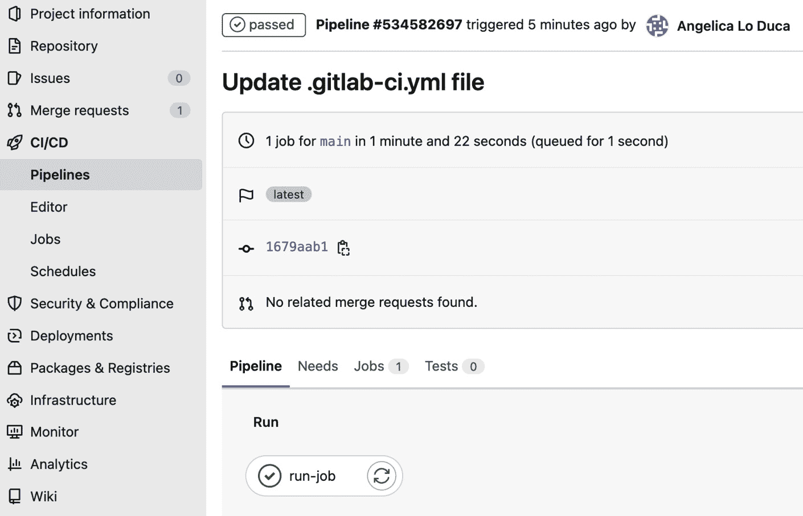

图 7.9-与成功管道相关的细节

在屏幕的底部，您可以看到管道中包含的作业。在我们的例子中，只有一个名为 **run-job** 的作业。您可以点击 **run-job** 按钮查看控制台的输出，如下图所示:

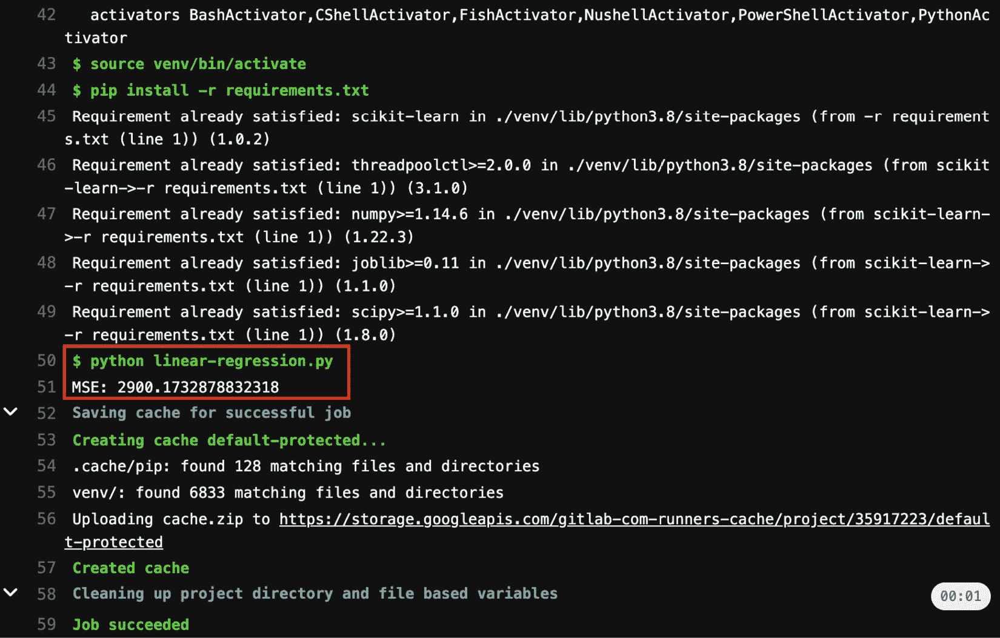

图 7.10–运行作业的输出

你可以清楚的看到`python linear-regression.py`命令的输出，其中显示了计算出的**均方根误差** ( **RMSE** )。

注意

您的管道可能会出现故障。事实上，第一次在 GitLab 中运行 CI/CD 管道时，您需要通过提供有效的信用卡来验证您的帐户。填写完所需信息后，您应该能够运行 CI/CD 管道了。

既然您已经学习了如何配置`.gitlab-ci.yml`文件，我们可以继续下一步，创建一个合并请求。

### 创建合并请求

这一步的目标包括修改`linear-regression.py`脚本，将更改保存到一个新的分支，并创建一个合并请求。

1.  首先，我们通过简单地打印一个新的度量来修改`linear-regression.py`,这个度量就是 RMSE。我们可以写下面的代码:

    ```
    from math import sqrt
    # train the model and calculate MSE
    rmse = sqrt(mse)
    print(f"RMSE: {rmse}")
    ```

2.  接下来，我们创建一个名为`test`的新分支，如下所示:

    ```
    git checkout -b test 
    ```

3.  我们将变更提交到我们的本地存储库和远程 GitLab 存储库，如下所示:

    ```
    git commit –m "modified linear regression"
    git push origin test  
    ```

您可以看到我们已经将更改推送到了`test`分支。

1.  如果您访问 GitLab 仪表板，您可以看到已经创建了一个新的分支。出现一条新消息，要求您创建合并请求，如下图所示:


图 7.11–推送至新分支后出现的消息

您可以点击**创建合并请求**按钮来触发合并请求。该操作触发 CI/CD 管道。

1.  在**合并请求**菜单中，您可以看到我们刚刚创建的合并请求，如下图所示:

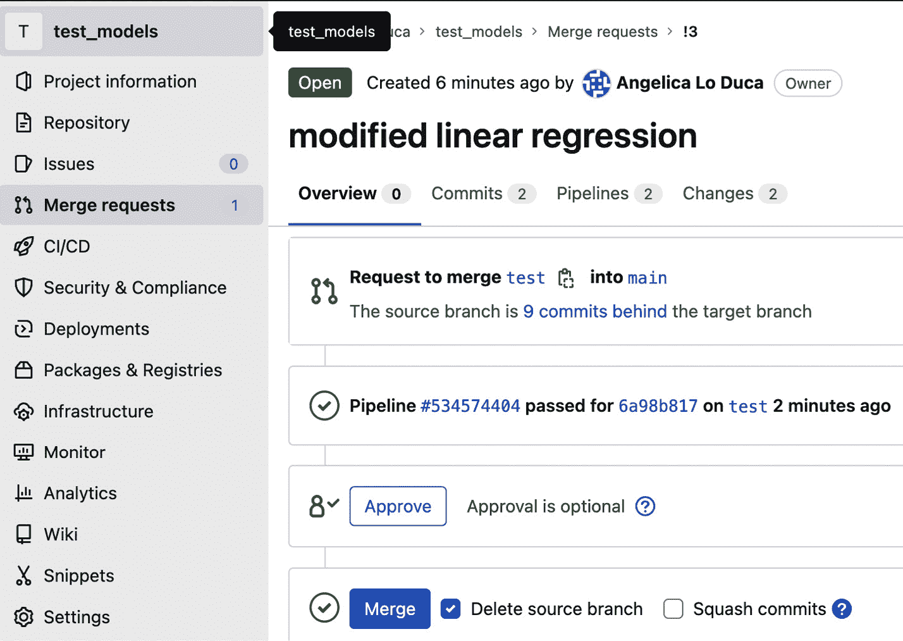

图 7.12–合并请求概述

您可以看到管道上的细节，并且您可以决定批准并将测试分支与主分支合并。

1.  点击**合并**按钮，合并主分支中的变更。

既然您已经学习了如何构建 CI/CD 管道，我们可以进入最后一步，即创建一个发布。

## 创建发布

当您的项目准备好发布并被其他人下载时，您可以创建一个发布版本。发行版是项目的快照，其中还包括安装包和发行说明。要创建一个版本，您的项目必须至少有一个标签，例如，它可以是您项目的版本。

一个版本包括你的代码的四个压缩版本，包括四种不同的格式:`.zip`、`.tar.gz`、`.tar.bz2`和`.tar`。该版本还包括一个 JSON 文件，该文件列出了版本内容，如下例所示:

```
{"release":{
```

```
    "id": 5269390,
```

```
    "name": "Test Models V1",
```

```
    "project":{
```

```
        "id": 35917223,
```

```
        "name": "test_models",
```

```
        "created_at": "2022-05-05T16:33:04.210Z",
```

```
        "description": ""
```

```
    },
```

```
    "tag_name": "v1",
```

```
    "created_at": "2022-07-04T19:45:04.219Z",
```

```
    "milestones": [],
```

```
    "description": "The first release of test models"
```

```
    }
```

```
}
```

JSON 文件包括与发布名称、发布日期、描述等相关的元数据。

GitLab 提供了不同的方法来创建一个版本。在本节中，我们将描述以下两种创建版本的方法:

*   **使用 GitLab 仪表板**:要创建一个新的发布，您可以点击仪表板的左侧选项卡，选择**部署** | **发布**。然后，您可以添加一个新的标签，比如`v1`，并遵循指导过程。
*   **利用。gitlab-ci.yml 文件**:您可以向您的配置文件添加一个名为`release`的新阶段，如下面这段代码所示:

    ```
    release_job:
      stage: release
      image: registry.gitlab.com/gitlab-org/release-cli:latest
      rules:
        - if: $CI_COMMIT_TAG
      release:                                   
        tag_name: '$CI_COMMIT_TAG'
    ```

在这个例子中，只有当提交操作包含一个标签时，才构建一个`release`。您还应该确保您的`release`作业可以访问`release-cli`，因此您应该将它添加到`PATH`中，或者使用 GitLab 注册表提供的映像，如前面示例中的所示。

要向提交操作添加标记，可以按如下方式进行:

1.  在命令行中，您可以在提交代码之前添加一个标记，方法是使用`tag`关键字，如下所示:

```
git tag my_tag 
```

1.  然后，您可以将您的标签保存到远程存储库，如下所示:

```
git push origin my_tag
```

1.  您可以在`git push`命令的末尾添加您的标签名称。

关于创建发布的其他方法的更多细节，你可以参考 GitLab 官方文档，可以从以下链接获得:[https://docs.gitlab.com/ee/user/project/releases/](https://docs.gitlab.com/ee/user/project/releases/)。

现在您已经了解了 GitLab 背后的基本概念，我们可以研究如何将 Comet 与 GitLab 集成。

# 将 Comet 与 GitLab 集成

由于 Comet 和 GitLab 之间的合作，Comet 实验与 GitLab 完全集成。您可以通过以下两种方式集成 Comet 和 GitLab:

*   在 CI/CD 工作流中运行 Comet
*   使用 Webhooks

让我们分别考察这两种方式，从第一种开始。

## 在 CI/CD 工作流中运行 Comet

下图显示了 Comet 如何与 CI/CD 管道集成:

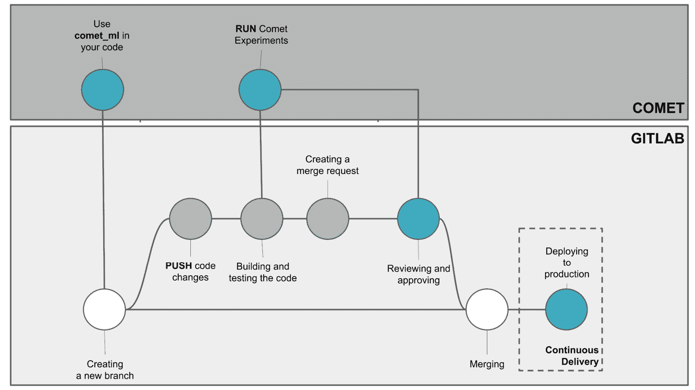

图 7.13–Comet 在 CI/CD 工作流中的集成

假设您已经修改了代码来支持 Comet 实验。如果您的代码是用 Python 编写的，那么您已经导入了`comet_ml`库并使用它来跟踪您的实验。您可以通过为项目创建新的分支来启动 CI/CD 工作流。像往常一样，您推动代码更改，并构建和运行代码。这个过程也触发了与 Comet 平台的连接。然后，CI/CD 工作流继续进行，如前一节所述。当您审查和批准代码时，您还应该考虑 Comet 实验的输出，以确保提议的更改改进了模型。

要使 Comet 和 GitLab 之间的集成工作，您应该在 GitLab 项目中配置 Comet secrets。您可以按如下方式进行操作:

1.  在 GitLab 中，选择您的项目。然后从左侧菜单中选择**设置** | **CI/CD** | **变量** | **展开**。
2.  添加以下两个受保护的变量:`COMET_API_KEY`，它存储您的 Comet API 密钥，以及`COMET_WORKSPACE`，它存储您的 Comet 工作区，如下图所示:

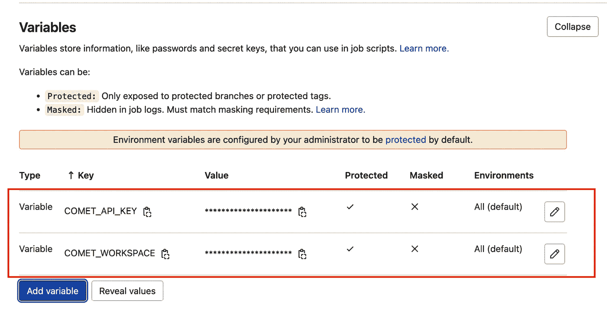

图 7.14–git lab 中配置的变量

我们将两个变量都配置为受保护的。这意味着只有受保护的分支可以访问它们。默认情况下，主分支受到保护。您可以在**保护分支**菜单中设置一个分支为**保护分支**，从项目菜单中按以下路径进入:**设置** → **库** → **保护分支** → **展开**。当您想要保护分支时，您应该选择谁可以修改该分支。例如，可以选择**维护人员** **，**，如下图所示:

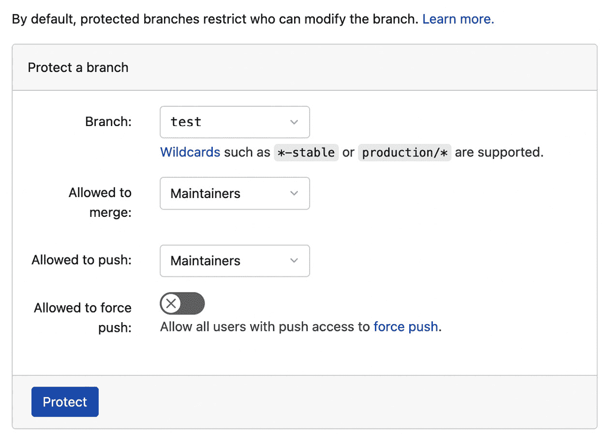

图 7.15–如何保护 GitLab 中的分支

现在您已经学习了如何在 CI/CD 管道中运行 Comet，我们可以继续下一步，即使用 webhooks。

## 使用 webhooks

一个 **webhook** 是一个自动消息，从一个应用程序发送，通知某人发生了一些事情。webhook 包含一个有效负载，即一条消息，它被发送到一个唯一的 URL。您可以将 Comet 配置为与 webhooks 一起工作，以通知外部应用程序注册的模型发生了变化。

下图显示了 Comet webhooks 与 CI/CD 工作流的可能集成:

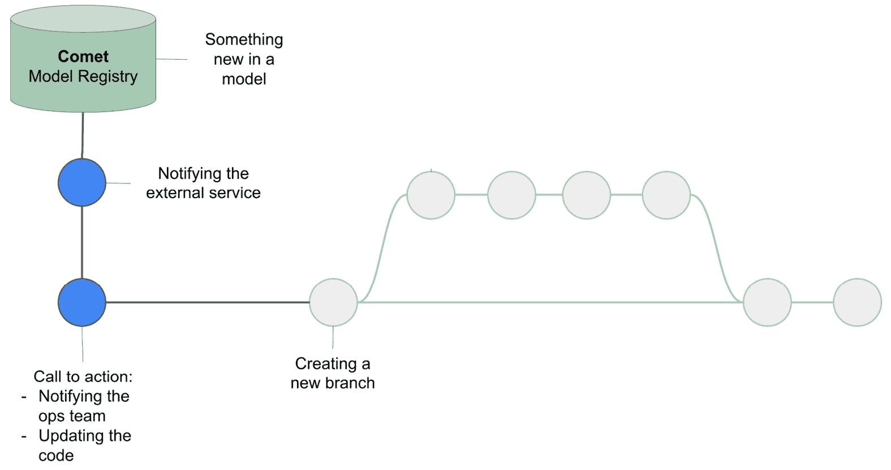

图 7.16–Comet web hooks 与 CI/CD 管道的可能集成

让我们假设您已经配置了一个 webhook，每当在 Comet 模型注册表中注册的模型发生变化时，它都会通知外部服务。当外部服务收到通知时，它可以通知操作团队更新代码，或者触发从 Comet 自动下载新版本的模型。在这两种情况下，产生的动作应该更新存储在 GitLab 存储库中的代码。因此，您应该创建一个新的分支，并遵循上一节中描述的通常的 CI/CD 工作流。

Comet webhooks 是你在 [*第六章*](B17530_06_ePub.xhtml#_idTextAnchor126) *中学到的 Comet REST APIs 的一部分，将 Comet 集成到 DevOps* *。*

要在 Comet 中配置一个 webhook ,步骤如下:

1.  向以下端点生成一个`POST`请求:

    ```
    https://www.comet.ml/api/rest/v2/webhooks/config
    ```

2.  `POST`请求应该包含以下有效载荷:

    ```
    payload = { "workspaceName": <YOUR_COMET_WORKSPACE>,
        "modelName": <YOUR MODEL NAME>,
        "webhookUrls": [{ "url": <URL to the external service>,
            "header": { "Authorization": <secret token>,
                "Other": "other_info"
            }
        }]
    }
    ```

您应该在 Comet 注册表中定义您想要通知的工作区名称和模型名称。在`webhooksUrls`关键字下，您可以指定任意多的外部服务。对于每个服务，您应该指定用于访问它的秘密令牌。

1.  在 Python 中，使用 requests 包将 webhook 配置发送到 Comet REST API 服务，如下所示:

    ```
    import requests
    headers = {'Content-Type':'application/json', 
         "Authorization": f"{<YOUR_COMET_API_KEY>}"
    }
     response = requests.post(url, headers=headers, json=payload)
    ```

一旦您配置了 Comet web hook，每当您的模型的阶段发生变化时，就会向您的外部服务发送一个通知。

既然您已经学习了如何将 Comet 与 GitLab 集成，那么让我们继续看一个展示如何将 Docker 与 CI/CD 工作流集成的实际例子。

# 将 Docker 与 CI/CD 工作流程集成

我们通过一个实际的例子来看看如何将 Docker 与 GitLab CI/CD 工作流集成。作为一个用例，让我们使用在 [*第 6 章*](B17530_06_ePub.xhtml#_idTextAnchor126) *中实现的例子，将 Comet 集成到 DevOps* 中，在*实现 Docker* 部分。该示例构建了一个测试四种不同分类模型(随机森林、决策树、高斯朴素贝叶斯和 k-最近邻)的应用程序，这些模型根据一些输入参数将切割的钻石分为两类(黄金和白银)。此外，应用程序在 Comet 中记录了所有的模型。

您可以通过以下链接从本书的 GitHub 资源库下载该示例的完整代码:[https://GitHub . com/packt publishing/Comet-for-Data-Science/tree/main/07](https://github.com/PacktPublishing/Comet-for-Data-Science/tree/main/07)。

在这个例子中，我们用代码构建了一个 Docker 映像并运行它。在本节中，我们的想法是将该示例包装在 CI/CD 工作流中，并在 GitLab 中运行它。换句话说，这个想法是在 CI/CD 工作流中自动构建和运行 Docker 映像，而不需要手动编写所有的命令。为此，按照以下步骤继续:

1.  首先，我们登录到 GitLab 平台，并创建一个新项目，如前一节所述。
2.  然后，我们在我们的本地文件系统中克隆这个项目，我们将在第六章*中实现的所有文件复制到创建的目录中的*实现 Docker* 部分。*
3.  我们通过以下命令将所有文件添加到 GitLab 存储库中:

    ```
    git add <file_name>
    ```

复制的文件包括以下内容:

*   `Dockefile`
*   `compare-models.py`
*   `requirements.txt`
*   `source/diamonds.csv`

1.  我们通过`commit`命令将更改保存到本地存储库，通过`push`命令保存到远程服务器，如下所示:

    ```
    git commit –m "initial import"
    git push origin main
    ```

2.  现在你应该可以在 GitLab 仪表板上看到这些文件了。
3.  下一步涉及创建与 Comet 相关的环境变量。我们通过 GitLab 仪表板添加以下环境变量，如前一节所述:
    *   `COMET_API_KEY`
    *   `COMET_PROJECT`
    *   `COMET_WORKSPACE`
4.  现在你准备创建一个新的`.gitlab-ci.yml`文件。您可以按照上一节描述的步骤打开文件编辑器。打开编辑器后，就可以配置它了。我们将配置 CI/CD 工作流来处理 Docker 映像，如下所示:

    ```
    image: docker:latest
     services:
      - docker:dind
    ```

5.  然后，我们建立两个阶段，`build`和`run`如下:

    ```
    stages:            
      - build
      - run
    ```

在`build`阶段，我们将构建 Docker 映像，在`run`阶段，我们将它包装在一个容器中，我们将在容器中运行代码。

1.  然后我们定义一些将在下一步中使用的辅助变量如下:

    ```
    variables:
      CONTAINER_TEST_IMAGE: $CI_REGISTRY_IMAGE:$CI_COMMIT_REF_SLUG
      CONTAINER_RELEASE_IMAGE: $CI_REGISTRY_IMAGE:latest
    ```

`CONTAINER_TEST_IMAGE`包含在`build`阶段生成的图像的名称。我们用 GitLab 中的一些系统变量来构建它。有关这些系统变量的更多详细信息，您可以查看 GitLab 官方文档，可从以下链接获得:[https://docs . git lab . com/ee/ci/variables/predefined _ variables . XHTML](https://docs.gitlab.com/ee/ci/variables/predefined_variables.xhtml)。

1.  为了让`run`作业使用在`build`阶段构建的映像，我们需要将映像保存在注册表中。GitLab 提供了一个注册表来存储图像。所以，每次作业前，我们都要登录 GitLab 注册表如下:

    ```
    before_script:
      - docker login -u $CI_REGISTRY_USER -p $CI_REGISTRY_PASSWORD $CI_REGISTRY
    ```

我们使用 [*第六章*](B17530_06_ePub.xhtml#_idTextAnchor126) *中描述的`docker login`命令，将 Comet 集成到 DevOps* 中但不同的是，现在我们登录 GitLab 注册表。我们使用 GitLab 变量提供的用户名和密码。

1.  我们将`build`工作定义如下:

    ```
    job-build:
      stage: build
      script:
        - docker build --pull -t $CONTAINER_TEST_IMAGE .
        - docker push $CONTAINER_TEST_IMAGE
    ```

简单地说，该作业构建 Docker 映像并将其保存到 GitLab 注册表中。

1.  现在我们将`run`任务定义如下:

    ```
    job-run:
      stage: run
      script:
        - docker pull $CONTAINER_TEST_IMAGE
        - docker run --rm -e COMET_API_KEY -e COMET_PROJECT -e COMET_WORKSPACE $CONTAINER_TEST_IMAGE
    ```

该作业从注册表中提取图像，并在容器中运行它。至于 [*第六章*](B17530_06_ePub.xhtml#_idTextAnchor126) *中定义的`run`命令，将 Comet 集成到 DevOps* 中，我们分别传递每个环境变量。

1.  我们可以通过点击按钮**提交更改**来保存`.gitlab-ci.yml`文件。现在管道被触发。让我们等待结果。

如果一切按预期运行，您应该能够在 Comet 中看到您的结果。另外，您可以通过选择您的项目，然后选择**包&注册表** | **容器注册表**来访问生成的映像，如下图所示:

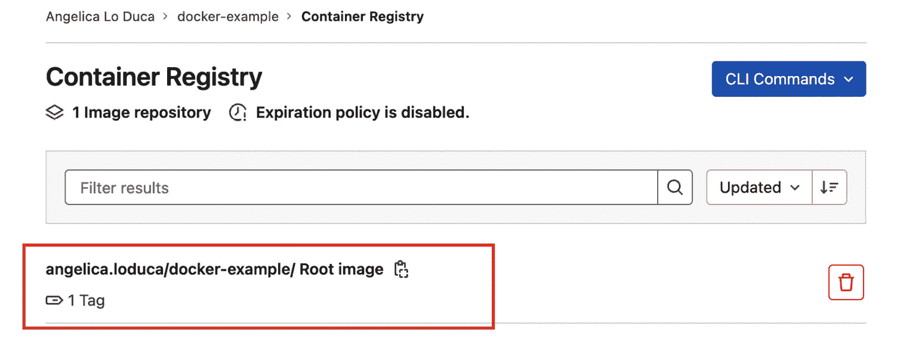

图 7.17–git lab 中的容器注册表和保存的图像

既然 CI/CD 管道已经配置好了，那么每当您对代码进行更改并将其推送到 GitLab 时，您的代码就会自动部署为 Docker 容器。

# 总结

您刚刚学习了如何在 GitLab 中构建和运行 CI/CD 工作流！

在本章中，您已经回顾了一些与 DevOps 相关的高级概念，重点是 CI/CD 工作流。您还学习了一些与 GitLab 平台相关的基本概念，以及如何使用它们来实现 CI/CD 工作流。然后，你已经学会了如何将 Comet 与 GitLab 集成。最后，您实现了一个实际的例子，它将 Docker 构建和运行过程包装在 CI/CD 管道中。CI/CD 工作流在部署应用程序时非常重要，因为它允许您使软件发布过程变得简单、快速和自动化。

在下一章中，我们将回顾一些与机器学习相关的基本概念，以及如何使用 Comet 来构建和运行一个完整的机器学习示例。

# 延伸阅读

*   埃弗斯，J. (2019)。*掌握 GitLab 12:实施 DevOps 文化和存储库管理解决方案*。包装出版公司。
*   O'Grady，A. (2018)。 *GitLab 快速入门指南:为您的所有存储库管理解决方案迁移到 git lab*。帕克特出版有限公司
*   乌马利河(2015 年)。*一个月的午餐学会 Git*。西蒙和舒斯特。