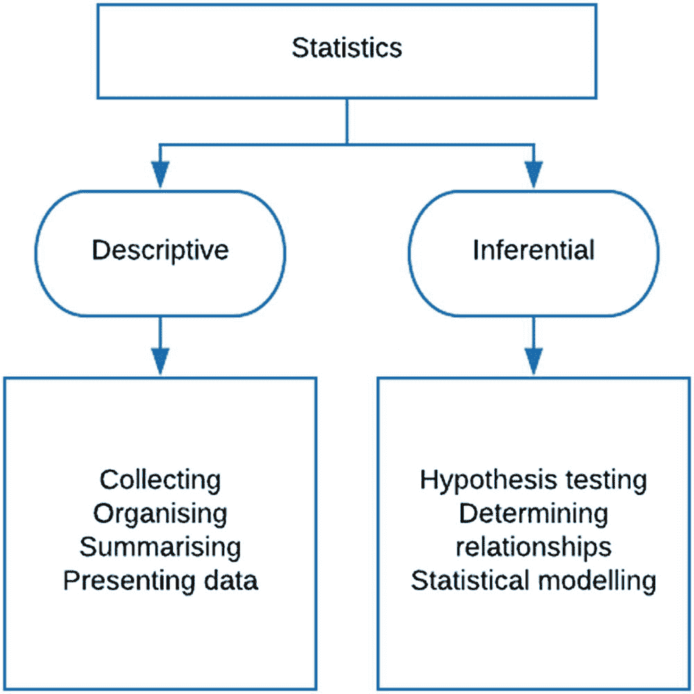
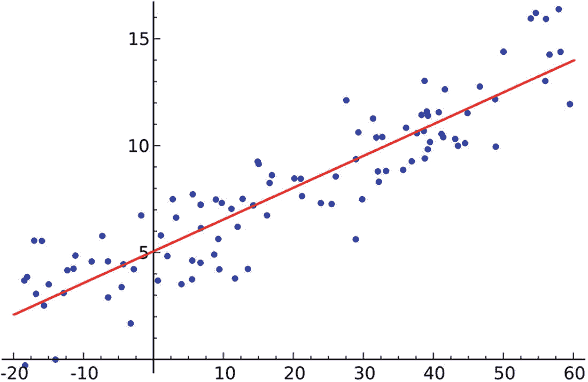
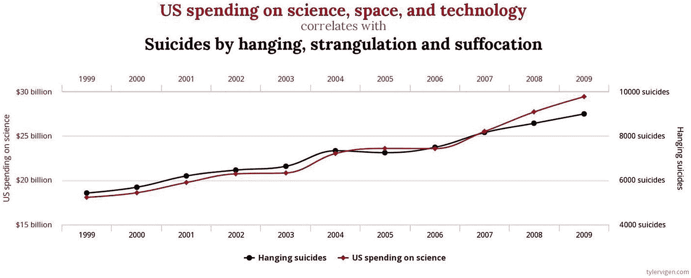
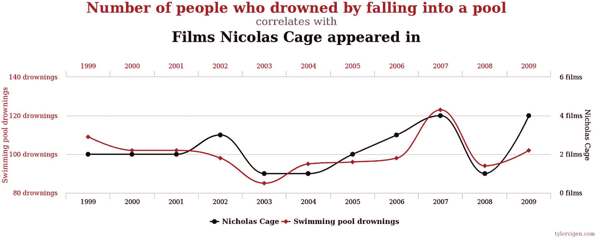
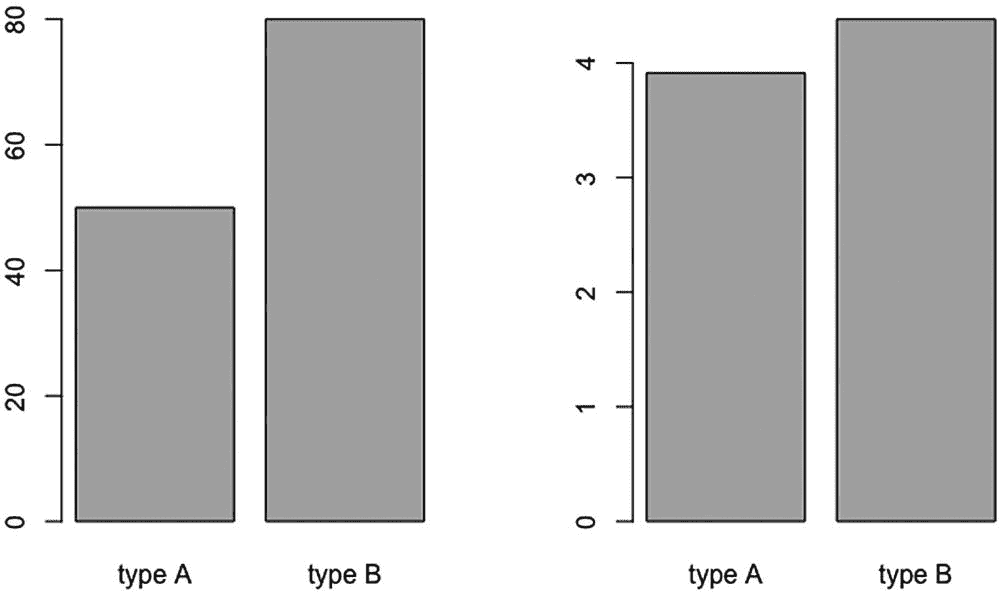
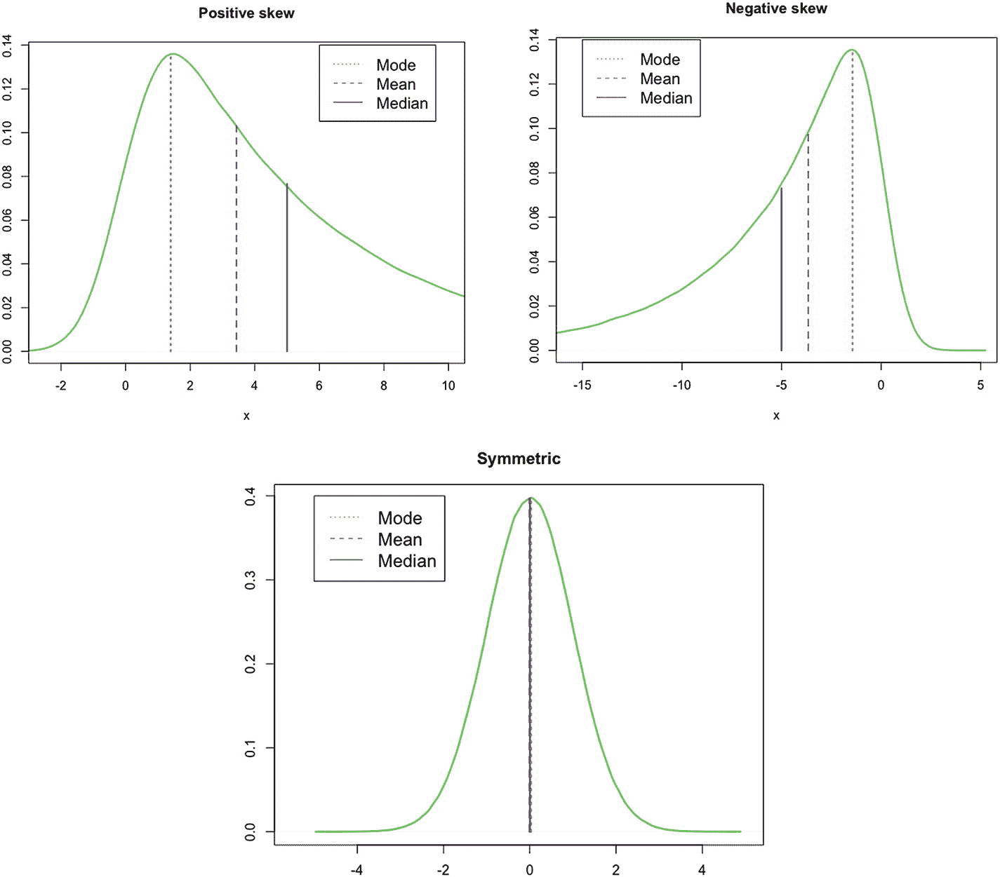

# 六、统计学简介

统计学有两个分支，即描述性统计和推断性统计(图 [6-1](#Fig1) )。

图 6-1

The two branches of the science of statistics

描述性统计是大多数人与统计这个词联系在一起的东西。这些都是你在高中可能做过的事情。它们包括收集数据、使用汇总指标(如平均值)和可视化数据。

当大多数统计学家想到统计这个词时，他们会想到推断统计。它涉及更高级的概念，如抽样和推断人口的参数值。

## 描述统计学

描述性统计以一种方便和信息丰富的方式处理组织、总结和呈现数据。在这种类型的统计中使用了两套方法。

首先，有描述数据的数值方法。这些包括对数据位置的测量，如平均值、中值和众数。它们还包括数据可变性的度量，如范围、方差和标准差。

第二组方法包括呈现数据的图形化方式，您可能非常熟悉，比如条形图、饼图、直方图等等。

我喜欢把描述性统计称为“高中统计”原因是大多数人在高中时被教授描述性统计，他们认为描述性统计是统计科学整体领域的代表。然而，事实却大相径庭。

## 推断统计学

当统计学家谈论统计数据时，这通常是他们所指的。推理统计学比描述统计学有趣和有用得多。它基本上代表了 90%的统计数据，而描述性统计数据仅仅代表了冰山一角。

因此，推断统计学是一套基于样本数据得出关于总体特征的结论或推断的方法。

推理统计学中使用的一些基本术语包括

*   数据、元素、变量和观察值
*   总体——统计学家感兴趣的所有项目的集合
*   样本—从总体中抽取的一组数据
*   参数—对总体的描述性测量
*   统计—对样本的描述性测量
*   推断——一组方法，如估计、测试和预测，用于根据样本数据得出关于总体特征的结论或推断

那么，这一切意味着什么呢？推断统计学实际上做什么？

推理统计学允许我们量化不确定性。换句话说，假设你想了解一个群体的一些情况。让我们用一些简单的东西，比如一个国家人民的平均身高。

现在，要确定这个数字，第一个想法是你必须把这个国家的每个人都算进去，以确定他们的身高。或者，测量每个人。当一个国家有 5000 万人口时，这不是一件容易的事。即使是这么简单的事情，你也要花费大量的时间和金钱去和每个人交谈。

研究每个人至少是不切实际的，但在大多数情况下是不可能的。

使用推断统计，您可以从总体中抽取样本，并通过概率分布来表达不确定性。它帮助我们将不确定性转化为可量化的指标，然后让我们进行计算。这使得我们能够进行统计建模和假设检验。

所以，本质上，你可以以 1000 人为样本，将他们的平均身高外推至 5000 万人口。和 1000 个人一起工作比和 5000 万人一起工作要容易得多。

这种用概率分布来表达不确定性的想法很简单，但是非常强大。人类非常感谢统计学的创始人，如罗纳德·费希尔、杰吉·内曼和卡尔·皮尔逊，他们提出了方差分析和多元线性回归等方法，并为许多现代统计学奠定了数学基础。

没有推理统计学，大多数科学将缺乏做出明智决策的工具。每当你听到医学、心理学、经济学或其他领域的研究时，你应该知道这是可能的，因为有推断统计学。

## 如何使用统计数据

好了，现在是时候看看如何使用统计学了。同样，我们将从一个高层次的角度来看这个问题，不是从统计学家或数据科学家的角度，而是从一个非技术决策者的角度。

首先，很可能你已经以某种形式使用了描述性统计。像平均值和中值这样的指标，或者像条形图和直方图这样的图表，是大多数人都能理解的。然而，重要的是要意识到一些可能出现的陷阱，我们稍后将更详细地讨论这些陷阱。

然后是推断统计，这在两种情况下很有用。它可用于回答关于可变重要性的特定问题，也可用于回答关于总体差异的问题。

学完本节后，你应该明白统计学总是被用来证明一个假设或故事，这涉及到描述性统计的广泛使用。虽然在分析中经常会用到推理统计，但它更倾向于使用描述性统计。

因此，作为一名高管、经理、创始人或决策者，你需要能够理解你是否可以使用统计数据来回答一个问题，这个故事是否有意义，并避免统计推断和结果呈现中可能涉及的所有陷阱和谬误。

### 推断统计的例子

让我们从几个推论统计学的例子开始，让你对这个概念本身有一个更好的了解，同时也看看你如何把它们应用到你的业务中。

假设检验和统计建模是推理统计学的两个主要用途。

预测是另一个领域，它代表了一套允许预测未来值的工具和方法。然而，我们不会进行预测，因为它更具技术性和先进性，并且通常可以使用机器学习来完成。

#### 假设检验

假设检验通常用于两件事，即找出总体参数的值或进行比较。确定人口的价值实质上意味着找出人口的平均身高或平均收入。

另一方面，比较涉及探索相似参数之间的差异和/或相似性。例如，你可以探索基于性别的差异，比较做同样工作的男性是否比女性挣得多。

假设检验是科学的一个极其重要的工具。例如，每当你听说新药的临床试验时，假设检验就被用来检测是否观察到任何显著的效果。当进行假设检验时，我们实际上是在比较两个假设:零假设和替代假设。因此，在临床试验的背景下，无效假设是新药对疾病没有效果。

假设检验会产生一种叫做 p 值的东西。这是给定数据的情况下，零假设为真的概率。如果 p 值很低(通常我们使用 5%的阈值)，那么我们拒绝零假设，接受替代假设。

在商业中，你主要在 A/B 测试中遇到假设测试。因此，当有人在测试两个标题，看哪一个能产生最高的点击率时，他们正在进行一个基于比较的假设测试。

统计测试示例见表 [6-1](#Tab1) 。

表 6-1

Some examples of statistical tests .

  
| 名字 | 使用 |
| :-- | :-- |
| t 检验 | 用于检验两组之间平均值的相等性 |
| 方差分析 | 用于检验多组平均值的相等性 |
| 比例测试 | 用于检验两组的比例是否相等 |
| Wilcoxon 符号秩检验 | t 检验的非参数替代方法 |
| Smirnov-Kolmogorov 测试 | 用于检验变量是否正态分布 |
| 弗里德曼试验 | 方差分析的非参数替代方法 |

#### 统计建模

统计建模主要用在你有兴趣确定一个变量是否影响另一个变量的时候。

例如，让我们说你已经进行了假设检验，关于在同样的职位上男人比女人赚更多的钱，并且已经得出结论，这个陈述是准确的。然而，你想发现什么其他变量可能会影响收入。为了实现这一点，你求助于统计建模。

图 [6-2](#Fig2) 显示了一个线性回归的例子，这是最著名的统计模型。

图 6-2

Example of simple linear regression

所以，你把这些变量输入模型，发现收入也受到年龄、经验、以前的工作等因素的影响。你还可以找出这些变量在多大程度上影响了反应变量——或者说是兴趣变量——在我们的例子中就是收入水平。

你听说过线性回归、逻辑回归或广义线性模型吗？所有这些都是统计模型的例子。这些模型形成了在其他更专业的领域，如计量经济学和心理计量学中使用的模型的基础。见表 [6-2](#Tab2) 。

表 6-2

Examples of statistical models

  
| 名字 | 使用 |
| :-- | :-- |
| 多元线性回归 | 最常见的统计模型，当响应变量是数字时使用 |
| 泊松回归 | 当目标变量由正整数组成时使用 |
| 逻辑回归 | 用于二元结果变量，例如，了解两类客户之间的差异 |
| 生存建模 | 当我们关心某件事情发生故障所需的时间时使用，例如机械零件 |
| 对数线性模型 | 用于检查两个以上分类变量之间关系的模型 |

## 统计数据误导

人们倾向于盲目相信统计数据，这可能是一个问题。接受看似完整的事实是很自然的，尤其是当它们有大量数字和图表等支持的时候。然而事实是，统计数据是可以用来骗人的。它们也可能因为错误导致扭曲的结果。

这一部分非常重要，因为统计数据经常被错误地使用。我们将看看统计数据被滥用的案例，对你来说，了解事情出错的许多方式以及人们试图欺骗你的案例是很重要的。这样，你就能做出更明智的决定。

### 躺在图表上

所以，让我们从我最喜欢的误导统计数据的方式开始，那就是使用包含虚假相关性的图表公然撒谎，这些图表表面上看起来似乎有意义，但实际上，它们根本没有任何意义。

看一下图 [6-3](#Fig3) 和 [6-4](#Fig4) 。图 [6-3](#Fig3) 显示了掉进游泳池淹死的人数和尼古拉斯·凯奇出演的电影数量之间的关系。图 [6-4](#Fig4) 将美国在科学、空间和技术上的花费与上吊、勒死和窒息自杀联系起来。

图 6-4

US spending on science, space, and technology correlates with suicides by hanging, strangulation, and suffocation[2](#Fn2)

图 6-3

Nicolas Cage seems to be driving swimming pool drownings worldwide[1](#Fn1)

现在，乍一看，这些可能看起来像有趣的统计数据。第一张图表似乎暗示，当尼古拉斯·凯奇主演的电影越多，淹死的人越多。仅仅根据这张图表，如果不理解统计数据可能会误导人，你可能会得出结论，人们实际上可能是为了逃离尼古拉斯·凯奇的电影而自杀的。

第二张图表表明，随着上吊、勒死和窒息自杀人数的增加，美国在科学、太空和技术方面的支出也在增加。所以，你可以得出结论，投资 R&D 肯定会增加总人口的死亡率！

当你写出结论的时候，就更容易意识到它们真的没有太多意义。是的，这些都是极端的例子，显示了统计数据是如何被用来误导的，但是存在许多类似的例子，其中相关性是虚假的，即使不是那么明显，这就是为什么你需要小心。

那么，这意味着相关性是虚假的吗？这意味着两个变量是相关的，但是关于发生了什么的基本理论并不存在。它们只是两个相关的变量，没有真正的联系。我们不要忘记相关性并不意味着因果关系。

换句话说，尼古拉斯·凯奇电影的数量与现实世界中的泳池溺水事件完全没有联系，这是一种虚假的关联。相反，如果我们将尼古拉斯·凯奇的收入与他主演的电影数量进行比较，那么这种相关性是有意义的，因为这两者之间存在联系。

第二张图更进一步，试图欺骗人们，因为 X 轴被颠倒了。换句话说，尽管 Y 轴上的值随着高度的增加而增加，但是数字沿着轴是减少而不是增加的。这是一种进一步强制关联的尝试。

因此，统计是一个伟大的工具，但它不是一根魔杖，无论如何都可以提供答案。使用统计学也不意味着没有正确的研究设计就可以逃脱惩罚。在研究问题时，你还需要有正确的框架。

如果你想看更多虚假相关性的例子，请访问 [`http://tylervigen.com/`](http://tylervigen.com/) 。这实际上很有趣，因为在所有这些相关性中，错误总是相同的，即，正在研究的两个变量背后的理论不存在。

请记住，仅仅因为这两个变量之间似乎有很高的相关性，并不意味着这两者实际上是相关的。

问题是，虽然所有这些例子都有虚假的相关性，但在许多情况下，这种相关性并不明显。

例如，让我们说一个人患有糖尿病的时间和在 60 岁之前死亡的人数之间有很高的相关性。从表面上看，无需深究，你可能会得出结论，某人患糖尿病的时间越长，他们在 60 岁之前死亡的可能性就越大。它构成了一个漂亮的图表和一切。

然而，如果你开始深入挖掘，你会发现死亡的原因非常广泛，包括车祸、谋杀、自杀等等。换句话说，第二个变量的一部分是完全不相关的，即使一部分是。结果是一样的，也就是说，决策者研究这样的图表会得出错误的结论。

使用图表的另一种方法是使用不同种类的刻度。在图 [6-5](#Fig5) 的例子中，我们有两个图表，每个图表有两个条形，分别代表 A 型和 b 型。两个图表都使用对数标度，但没有明确说明它们是这样做的。现在，通过使用不同的比例，您可以使两个项目看起来比实际更接近。

图 6-5

Example of how a logarithmic scale can skew perception of the differences between groups

另一个简单的欺骗图表的方法是摆弄比例尺。例如，在图 [6-6](#Fig6) 中，您可以看到左边的图像显示了上升趋势，而右边的图像显示了或多或少的稳定趋势。这两种情况下的数据是相同的。唯一的区别是缩放的程度。

图 6-6

Same data, different view

### 使用描述性统计会产生误导

现在，让我们来看看如何使用描述性统计来误导他人。一种容易撒谎的方法是使用中心性和汇总指标。本质上，有三种主要的中心性度量，即均值、中值和众数。

平均值是一组数字的平均值，也就是说，将所有数字相加，然后除以有多少个数字。中位数是数字列表中的中间值，而众数是列表中出现频率最高的值。

现在，在对称分布中，均值、中值和众数落在同一点上。然而，当我们有一个正偏斜时，均值比中值轻，中值比众数轻，而在负偏斜的分布中则相反。见图 [6-7](#Fig7) 。

图 6-7

Skewness and the relationship between the mean, the median, and the mode

这一点很重要，因为现实生活中很多分布是不对称的。例如，假设有一家公司，首席执行官的年薪为 30 万美元，而其余员工(总共 10 人)的年薪为 5 万美元。

根据你想要展示的形象，你可以展示不同的形象。例如，在我们的情况下，中位数是每年 5 万美元，但平均值是每年 7.2 万美元。

一家恶意的公司在招聘员工时可能会宣传平均年薪为 72000 美元，但实际上，除了首席执行官之外，他们不愿意支付超过 50000 美元的工资。但是通过这种方式，他们可以欺骗一些人，让他们认为他们最终可以每年赚 72000 美元，而且他们甚至不需要出来像数字暗示的那样说出来。

### 抽样中的偏差

现在我们来看看抽样中的偏差。有许多抽样偏差，但我们将集中讨论五个，即选择偏差、区域偏差、自我选择偏差、引导问题偏差和社会期望偏差。这些在商业环境中是最常见的。

#### 选择偏差

选择偏差是最重要的，其他偏差可以被认为是相关的，甚至可以被视为这种偏差的子集。

当样本不具有代表性时，这种类型的偏差就存在，因为存在某种过程来确保样本中的受试者或项目是特殊的。许多其他科目或项目不包括在内。

关于选择偏差的一个有趣的故事是亚伯拉罕·瓦尔德的，他是一位统计学家。二战期间，政府向他伸出援手，要求他提高美军飞机的存活率。沃尔德很聪明，他做的第一件事就是查看之前进行的分析。他注意到选择偏差正在发生。

之前的调查人员一直在分析幸存的飞机，并建议应该给受损最严重的区域增加更多的装甲，从而增加对它们的保护。因此，在飞机被击毁最多的地方，安装了新的装甲来保护这些区域。

结果是更多的飞机坠毁。额外的装甲使飞机更重，导致它们更不灵活和更慢。飞机仍然带着损坏返回同一地区。

问题是，调查人员的结论是建立在飞机受损区域明显有弹性的基础上的。毕竟，他们在那些地区受到了损害，仍然返回基地。

沃尔德意识到，需要保护的是那些没有受到破坏的敏感区域。一旦这些区域增加了装甲，生存能力就会增加。

这是一个非常有趣的例子，它以高度智能的方式使用统计数据，甚至不需要运行分析。他所要做的就是意识到这种选择偏见在起作用，然后他修正了它。

#### 区域偏差

当你试图将一个地区的结果推广到另一个地区时，就会出现地区偏差，这在试图跨文化交流时尤其成问题。

因此，举例来说，你在欧洲进行市场调查，你会自动假设同样的结果将适用于美国。不幸的是，这没有考虑到广泛的因素，包括文化和金融，可能会影响结果的有效性。

#### 自我选择偏差

在自我选择偏差中，一个人参与研究的决定可能与他们已经拥有的特征相关联，这可能会影响研究，使参与者成为不具代表性的样本。

这听起来可能很复杂，但实际上比听起来要简单得多。例如，如果你要设立一个摊位，询问人们的打扮习惯，回应的人更有可能是喜欢照顾自己、早上花更多时间打扮的人。

问题是，你需要和那些早上打扮的人以及那些对打扮不感兴趣的人交谈，这样样本才能有代表性。

#### 引导问题偏差

引导问题偏见是关于问题如何措辞和提问，以及答案选项是什么。

所以，如果你问

你不觉得高中老师工资太少了吗？

1.  是的，他们应该挣得更多。
2.  不，他们不应该挣得更多。
3.  没意见。

大多数人会回答 A，因为这个问题的措辞方式。因此，对于引导性问题，你最终会得到有偏见的结果。

#### 社会期望偏差

当人们想让自己看起来比实际情况更好时，就会出现社会期望偏见。例如，如果你在调查中问人们多久洗一次澡或多久回收一次，你的数据会有偏差，因为没有人愿意承认做了一些不受社会欢迎的事情。

换句话说，即使有人每两周洗一次澡，他们也会告诉你他们一天洗一次，或者每三天洗一次，或者任何他们认为更能被社会接受的次数。不管是什么，都不会是事实。

#### 现实世界中的抽样偏差

前面的例子都很简单。然而，2016 年美国总统大选的民意调查是这些采样偏差共同影响结果的一个很好的例子。另一个例子是英国退出欧盟。 [4](#Fn4)

在这两种情况下，民意测验专家的结果都没有那么准确。对所发生的事情的大多数解释都围绕着采样中的偏差。关于发生了什么有各种各样的理论。

例如，皮尤研究中心陈述如下:

> One possible culprit is what pollsters call unresponsive bias. This happens when certain types of people systematically don't answer the survey, despite the equal opportunity publicity to all parts of voters. We know that some groups—including voters with low education level, who are the key group of Trump on election day—have been having difficulty in getting in touch with pollsters. Frustration and anti-institutional sentiment driving Trump's campaign may also be related to reluctance to respond to polls. [5](#Fn5) T5】

另一个理论是在线投票中存在自我选择，即倾向于回答在线投票的人更有可能支持某个候选人。还有一种假设是，支持另一方的人希望完全避免投票。

这再一次表明，统计数据也可能出错，不是因为数学或模型，而是因为我们无法控制的因素，即抽样偏差。

这在某种程度上类似于虚假相关性，因为统计学是一门应用科学，不会发生在真空中。如果你没有正确的数据，如果你没有正确的理论，你仍然会得出一组数字，但它们没有任何意义。

### 用推理统计撒谎

所以，虽然用推论统计学撒谎可能没那么容易，但你们中那些可能抱有这根本不可能的错觉的人会感到失望，因为这是可以做到的。

这在很大程度上发生在研究中。当您测试一个假设时，您会得到一个 p 值，您希望该值低于某个阈值，以使测试具有统计显著性。通常这个阈值是 0.05。

有一种关于对 p 值 [6](#Fn6) 的崇拜的理论说，有非常多的研究论文的 p 值可疑地接近 0.05。本质上，它们刚好低于 0.05，所以它们满足统计显著性的条件。这可能会使结果变得有意义，但也只是微不足道。

理论上这是故意的。在学术界，竞争非常激烈，人们必须发表论文，否则就会失业。因此，许多人面临压力，要让他们的 p 值看起来比实际更重要。

一种方法是进行多次实验，直到得到你想要的结果，另一种方法是处理数据。然而，在某些情况下，你可能会发现研究的结果是重要的，但研究人员的意图不是欺骗，但它可能是模型假设没有得到满足。

所有的模型和统计数据都有一些假设，不幸的是，有许多研究论文没有正确地解释这些假设。

In Depth: Bayesian vs. Frequentist Statistics

也许你听说过“贝叶斯”这个术语。有许多包含“贝叶斯”一词的模型:“朴素贝叶斯”、“贝叶斯网络”、“贝叶斯推断”等等。

这些都是指统计背后的一个学派。这一切都始于英国数学家托马斯·贝叶斯牧师，他想出了这个简单的公式:

这个公式描述了事件 A 发生的概率，假设 B 也发生了。这后来被皮埃尔·西蒙·拉普拉斯和哈罗德·杰弗里斯爵士进一步发展成现在形成贝叶斯统计的基础。

贝叶斯统计背后的一个主要思想是，有可能将关于某些东西的先验知识纳入我们的分析，无论是模型还是显著性测试。另一方面，频率统计(这是最流行的统计理论)不适应，也不允许。

比如说，你想做一些实验来证明鬼魂的存在。你有两个假设(鬼存在与否)。贝叶斯统计学家可以根据常识预先给不存在鬼魂的假设分配一个非常小的概率。因此，在测试有意义之前，实验应该找到压倒性的支持鬼魂假说的证据。一个常客没有这个选择。

让我们看另一个例子。频数统计是在无数次实验的概念下形成的。例如，如果你掷一枚公平的硬币很多次(数千次或更多)，那么实际的抛头概率将收敛到 0.5。

然而，这种类比如何适用于足球比赛或选举等事件呢？这些事件是独一无二的。两支球队在特定时间点的比赛不会重复。即便如此，其背后的参数(例如，玩家或政党成员的疲劳程度)也可能发生变化。我们无法进行无限次这样的活动。在这种情况下，一个常客遇到了麻烦，但这对于贝叶斯来说不是问题。在贝叶斯统计中，概率表达的是对事件发生的主观信念，而不是重复的实验。

贝叶斯统计已经被证明是非常有用的，并且也为机器学习的部分提供了理论框架。关于哪种理论是最好的，统计学界仍有许多分歧。在实践中，更经常使用频率统计，但也有许多基于贝叶斯统计的应用。再说一次，这是关于为工作找到合适的工具！

Footnotes [1](#Fn1_source)

图由泰勒·维根( [`http://tylervigen.com/view_correlation?id=359`](http://tylervigen.com/view_correlation%3Fid%3D359) )授权于 CC BY 4.0 ( [`https://creativecommons.org/licenses/by/4.0/`](https://creativecommons.org/licenses/by/4.0/) )。

  [2](#Fn2_source)

图由泰勒·维根( [`http://tylervigen.com/view_correlation?id=1597`](http://tylervigen.com/view_correlation%3Fid%3D1597) )授权于 CC BY 4.0 ( [`https://creativecommons.org/licenses/by/4.0/`](https://creativecommons.org/licenses/by/4.0/) )。

  [3](#Fn3_source)

马克·曼格尔和弗朗西斯科·j·萨马涅戈，“亚伯拉罕·瓦尔德在飞机生存能力方面的工作”，《美国统计协会杂志》第 79 卷，第 386 期(1984): 259-267， [`https://people.ucsc.edu/~msmangel/Wald.pdf`](https://people.ucsc.edu/%7Emsmangel/Wald.pdf)

  [4](#Fn4_source)

我也在我的博客上写过这个: [`http://thedatascientist.com/election-forecasting/`](http://thedatascientist.com/election-forecasting/)

  [5](#Fn5_source)

安德鲁·默瑟、克劳迪娅·迪恩和凯莉·麦吉妮，“为什么 2016 年选举民调错过了他们的标志”，皮尤研究中心，2016 年 11 月 9 日， [`www.pewresearch.org/fact-tank/2016/11/09/why-2016-election-polls-missed-their-mark/`](http://www.pewresearch.org/fact-tank/2016/11/09/why-2016-election-polls-missed-their-mark/)

  [6](#Fn6_source)

[T2`www.press.umich.edu/186351/cult_of_statistical_significance`](http://www.press.umich.edu/186351/cult_of_statistical_significance)