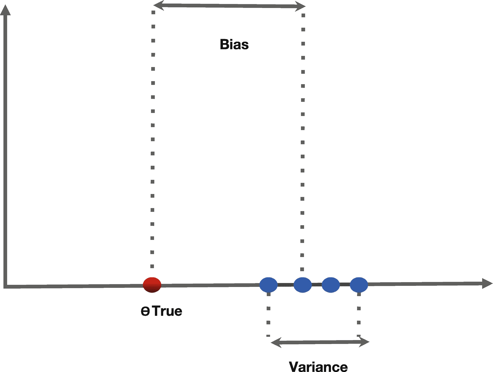
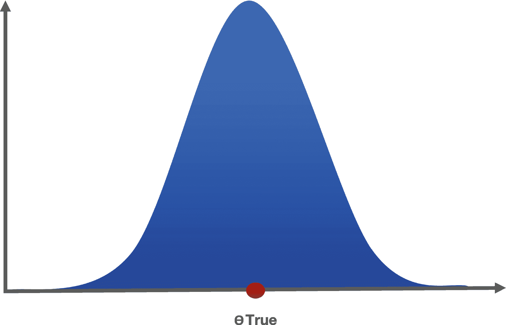
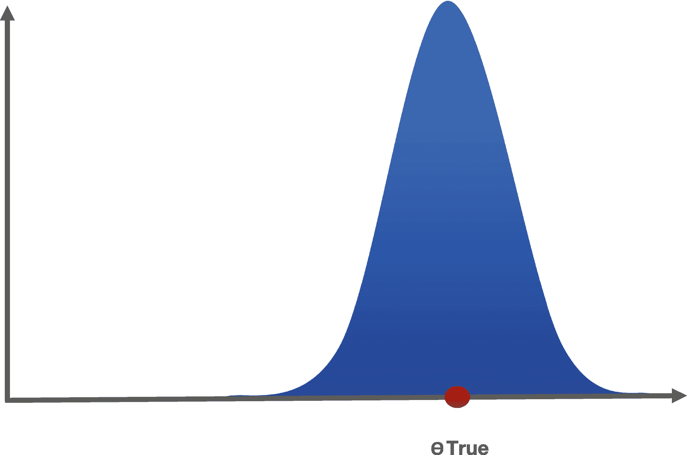

# 二、高级参数方法

前一章中介绍的方法违反了某些回归假设。它不能捕捉噪声，因此在预测未来实例时会出错。解决这个问题最方便的方法是在等式中加入一个惩罚项。

本章介绍了偏差-方差权衡的新概念，然后介绍了正则化模型，如岭回归、内置交叉验证的岭回归和 lasso 回归。最后，比较了这些模型与最小二乘模型的性能。为了心照不宣地理解正则化模型，您必须首先理解偏差-方差权衡的概念。在下一节中，我们适当地介绍这个概念。

## 偏差和方差的概念

*偏差*代表估计值与实际值的接近程度，*方差*代表数据点对于模型的每次实现是如何变化的。当一个模型类不能适应数据时，就会出现偏差引起的误差。开发一个表达能力更强的模型类可以解决这个问题。另一方面，方差引起的误差表示模型对数据点预测的可变性。当一个模型类可以适应数据，但不能这样做时，就会出现这种情况。开发一个表达性较差的模型类可以解决这个问题。



图 2-1

偏差和方差图形定义

图 [2-1](#Fig1) 显示了偏差和方差。

## 偏差-方差权衡

偏差-方差权衡包括减少偏差或方差而牺牲另一个。当数据中有几个变量时，我们减少方差以增加偏差，有一个高度正则化的模型，决策树模型有极度修剪的决策树，K-最近邻模型有一个大 K。图 [2-2](#Fig2) 显示了一个低偏差(或高方差)的例子。



图 2-2

低偏差/高方差

当数据中有几个变量，模型未被正则化，决策树模型未被修剪，或者 K-最近邻模型具有小 K 时，我们减少偏差以增加方差。图 [2-3](#Fig3) 显示了高偏差(或低方差)的示例。



图 2-3

高偏差/低方差

偏差-方差权衡是指解决欠拟合(当偏差误差项较低时)和过拟合(当方差较高时)的问题。我们根据模型的复杂性减少偏差和方差。模型中的几个参数增加了模型的复杂性和方差，并减少了偏差。

## 里脊回归

我们也承认岭回归是吉洪诺夫或 L2 正则化。该模型通过沿着每个特征向量将变量最小化一个小 k 来解决多重共线性问题，以确保在轴上有一个窄的分布。与最小二乘回归器类似，它假设数据是线性和正态的。这两个模型的主要区别在于，岭回归假设数据归一化后，系数很小。它还假设随着 k 值的增加，具有多重共线性的系数会改变它们的行为。在这种假设下，模型会将系数急剧降低到零。至多，岭回归的 k 值小于最小二乘模型的 k 值。

它通过添加偏差(引入惩罚并控制最小二乘函数的收缩)来缩小估计值以稳定可变性。它防止自变量的值爆炸，减少标准误差，并提供更可靠的估计。这一过程使残差的惩罚和最小化，并仔细控制回归模型中相当大的收缩量。它通过添加惩罚项(与系数的平方和相关的项)来改变成本函数。常数惩罚项的范围从 0 到 1。它控制估计值β，因此更有可能出现高方差。最小二乘模型不控制岭模型的损失函数。方程 2-1 表达了一个标准的岭公式。


(Equation 2-1)

这里，λ <sub>2</sub> 表示负责惩罚平方回归系数的岭惩罚项。惩罚项控制系数的大小和正则化的量。

## 里奇夫

RidgeCV 代表“具有内置交叉验证的岭回归”(它衡量模型的预测误差，以验证每个数据点是样本外预测)。CV 方法包括 K 倍法、留一法和广义交叉验证法(GCV)。默认情况下，SciKit-Learn 中的 ridgeCV 回归器使用 GCV。见等式 2-2。


(Equation 2-2)

回想一下 *tr(S)* 是参数的有效个数。

它通过划分数据、寻找最优惩罚项、训练和验证互补回归变量来改变模型行为。

## 套索回归

Lasso 代表“最小绝对收缩选择算子”(也称为 L1 正则化)。它应用收缩技术(将数据居中到其中心点，例如将数据居中到平均值)。该过程产生稀疏模型(参数数量减少的模型)。我们将它用于变量选择和正则化。像岭回归一样，套索回归通过包含惩罚项来增强回归变量的预测能力。它们不同于惩罚项:拉索回归使用 L1 来惩罚残差的总和，而岭回归使用 L2 惩罚项。它假设随着惩罚项的增加，更多的系数被设置为零，这导致较少的变量被选择。L1 正则化使用非零系数并强制系数的绝对值之和(设置 0 系数并增加可解释性)。参见等式 2-3。


(Equation 2-3)

λ1 代表套索惩罚，惩罚回归系数的绝对值之和。

### 可调超参数

如果不想使用缺省参数来完成模型，可以相应地更改超参数。表 [2-1](#Tab1) 突出显示了可调超参数。

表 2-1

可调超参数

<colgroup><col class="tcol1 align-left"> <col class="tcol2 align-left"></colgroup> 
| 

因素

 | 

描述

 |
| --- | --- |
| `alpha` | 确定正则化强度。它是一个乘以该项的常数。选择α时必须谨慎。小α值指定弱正则化，大α值指定强正则化。随着 alpha 的增加，参数变小。如果 alpha 增加，系数会接近 0，使数据欠拟合。默认值为 1。 |
| `fit_intercept` | 确定模型是否必须估计截距。 |
| `normalize` | 决定我们是否必须标准化独立变量。 |
| `copy_X` | 决定我们是否必须复制自变量。 |
| `tol` | 确定精度。默认值为 0.003。 |
| `max_iter` | 确定最大迭代次数。 |
| `tol` | 确定优化的公差 |
| `warm_state` | 确定是初始化解决方案还是清除以前的解决方案。 |

## 开发模型

示例数据来自 GitHub。 <sup>[1](#Fn1)</sup> 它折衷了几个分类自变量。清单 [2-1](#PC1) 使用`LabelEncoder()`方法将分类变量转换成数值。例如，我们将`['VS2' 'VS1' 'VVS1' 'VVS2' 'IF']`转换为`[0,1,2,34]`。清单 [2-2](#PC2) 创建一个 x 和 y 数组，然后分割并归一化数据。

```py
from sklearn.preprocessing import LabelEncoder
categorical_features = ['colour', 'clarity']
le = LabelEncoder()
for i in range(2):
    new = le.fit_transform(df[categorical_features[i]])
    df[categorical_features[i]] = new
df["certification"] = pd.get_dummies(df["certification"])
print(df.clarity.unique())
print(df.colour.unique())
print(df.certification.unique())

[2 1 3 4 0]
[0 1 3 2 4 5]
[1 0]

Listing 2-1

Listing 2-1Convert Variables to Numeric

```

最后，清单 [2-3](#PC3) 训练所有的模型。

```py
from sklearn.linear_model import LinearRegression, Ridge, RidgeCV, RidgeCV
lm = LinearRegression()
lm.fit(x_train,y_train)
ridge = Ridge()
ridge.fit(x_train, y_train)
ridgecv = RidgeCV()
ridgecv.fit(x_train, y_train)
lasso = RidgeCV()
lasso.fit(x_train,y_train)

Listing 2-3Develop Models

```

```py
from sklearn.preprocessing import StandardScaler
from sklearn.model_selection import train_test_split
x = df.iloc[::,0:4]
y = df.iloc[::,-1]
x_train, x_test, y_train, y_test = train_test_split(x,y,test_size=0.2, random_state=0)
scaler = StandardScaler()
x_train = scaler.fit_transform(x_train)
x_test = scaler.transform(x_test)

Listing 2-2Data Preprocessing

```

## 评估模型

表 [2-2](#Tab2) 总结了使用主要评估指标的所有回归器的性能。

表 2-2

所有模型的模型评估结果

<colgroup><col class="tcol1 align-left"> <col class="tcol2 align-left"> <col class="tcol3 align-left"> <col class="tcol4 align-left"> <col class="tcol5 align-left"> <col class="tcol6 align-left"></colgroup> 
|   | 

平均绝对误差

 | 

均方误差(mean square error)

 | 

均方根误差

 | 

R <sup>2</sup>

 | 

解释方差得分

 |
| --- | --- | --- | --- | --- | --- |
| 内源性阿片样物质 | 550.512799 | 528211.610638 | 726.781680 | 0.942619 | 0.944409 |
| 山脉 | 548.303122 | 526871.168399 | 725.858918 | 0.942764 | 0.944672 |
| 山脊 CV | 550.291000 | 528056.270472 | 726.674804 | 0.942636 | 0.944437 |
| 套索 | 550.291000 | 528056.270472 | 726.674804 | 0.942636 | 0.944437 |

表 [2-2](#Tab2) 强调了所有的回归变量解释了数据中 94%以上的可变性。然而，最小二乘回归是最弱的竞争者，具有最低的 R 平方得分和差异。此外，岭回归器的预测值和实际值之间的差异最大。

## 结论

本章探讨了用于正则化最小二乘模型估计的不同模型，如岭、内置交叉验证的岭和 lasso。这些模型充分地处理了由偏差引起的误差和由方差引起的误差。在测试了它们的性能后，我们发现正则化或收缩模式估计可以提高总体性能。岭回归模型是一个微妙的竞争者。如果两种正则化模型都不能提高最小二乘模型的预测能力，请使用 ElasticNet 模型，这是一种可行的岭回归和套索回归的混合模型。

<aside aria-label="Footnotes" class="FootnoteSection" epub:type="footnotes">Footnotes [1](#Fn1_source)

[T2`https://vincentarelbundock.github.io/Rdatasets/csv/Ecdat/Diamond.csv`](https://vincentarelbundock.github.io/Rdatasets/csv/Ecdat/Diamond.csv)

 </aside>