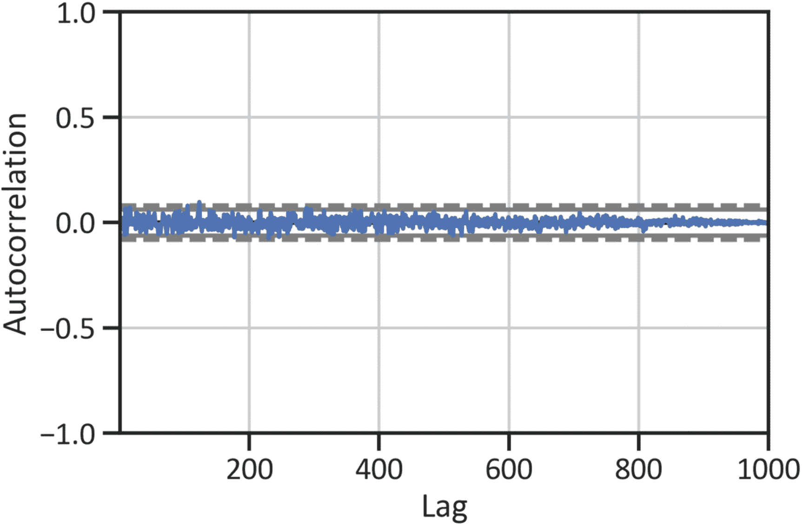
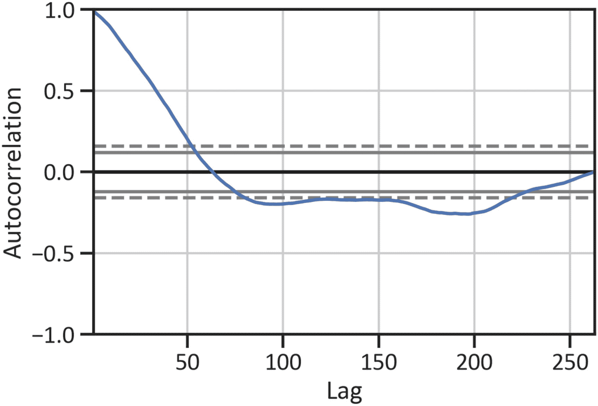
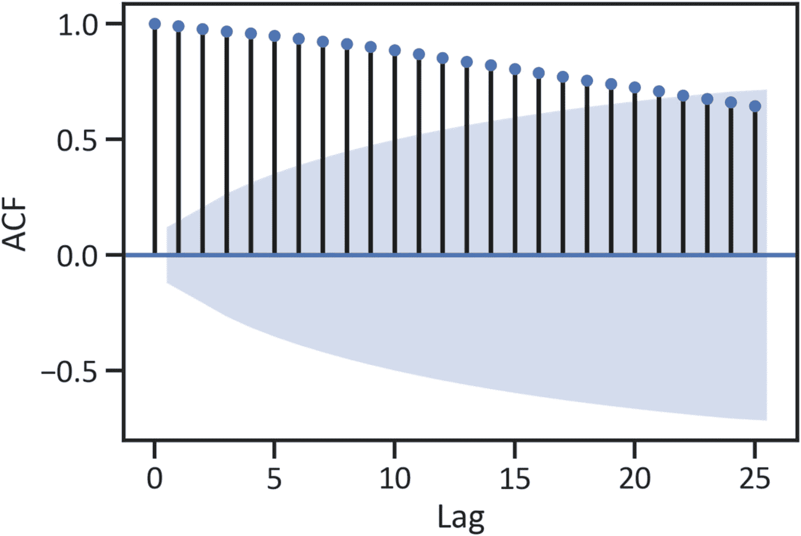
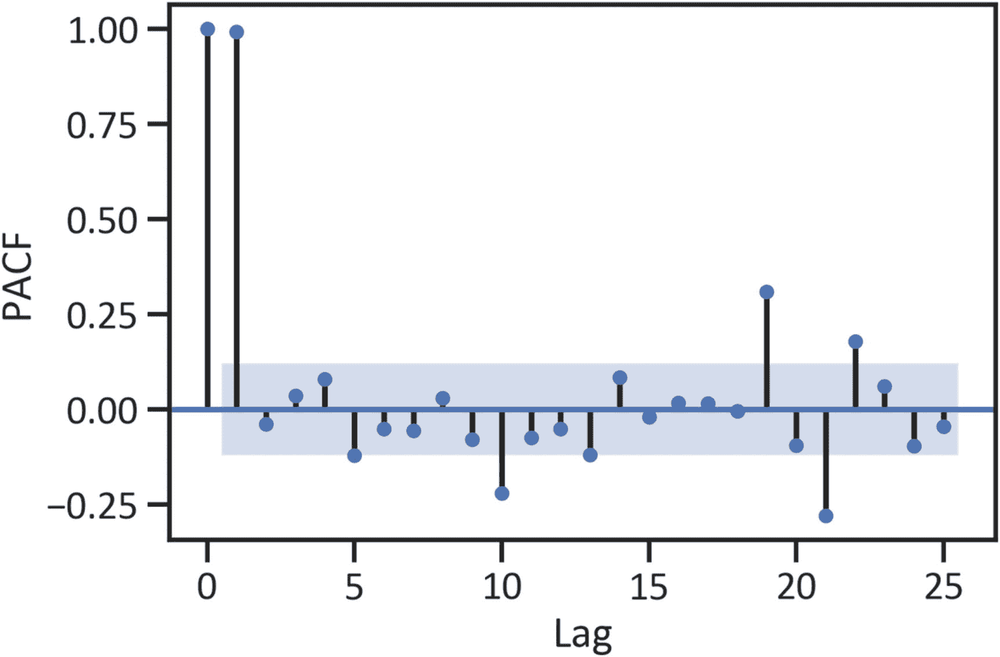
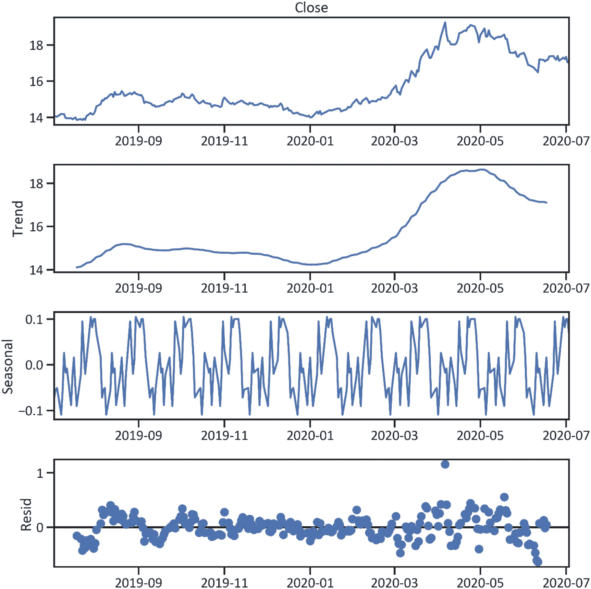
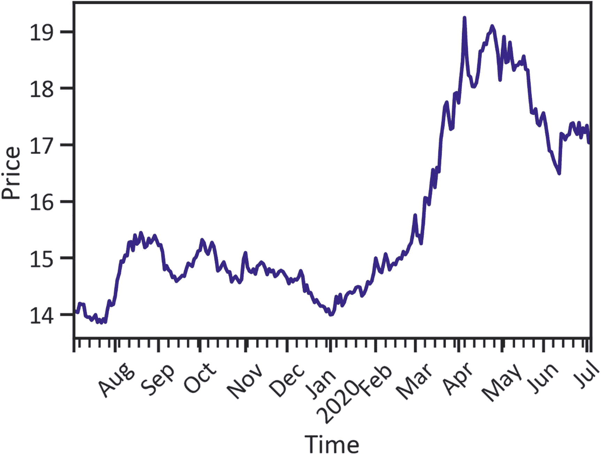
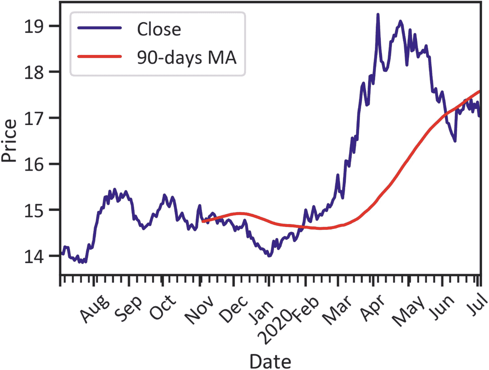
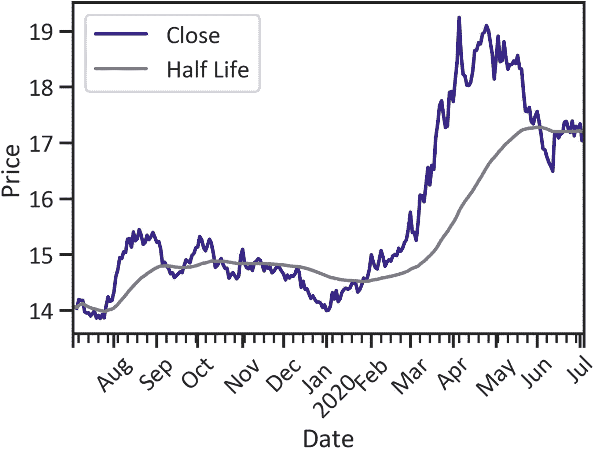
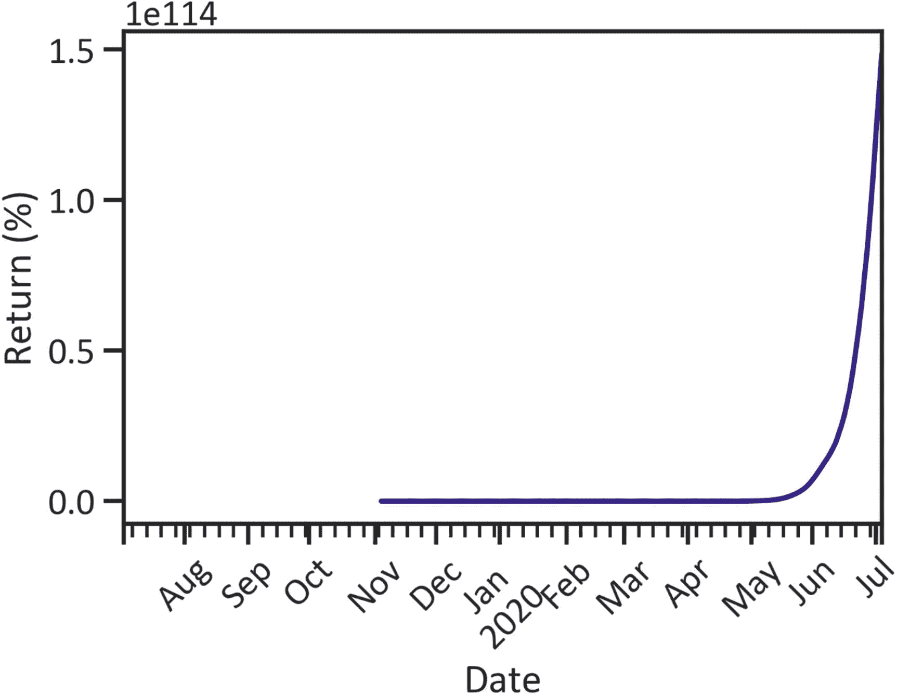
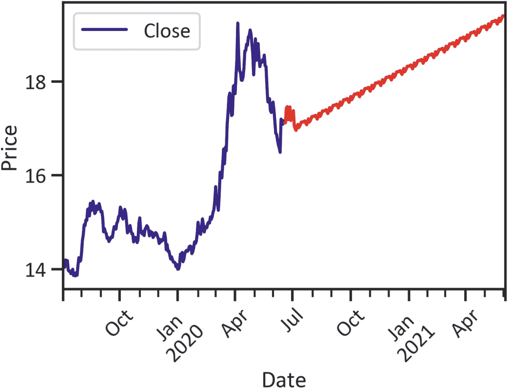

# 三、时间序列分析

这就引入了一个复杂的回归方法，叫做*时序分析*。与回归方法类似，时间序列对数据的基本结构做出强有力的假设。我们认为时间序列分析是一种参数方法，因为它处理的是一个连续变量。记住，我们不把系列分析局限于连续变量；我们还可以分析与时间相关的分类变量。

它介绍了检验假设的经验测试，然后我们介绍了分析时间序列的标准技术，如季节分解和平滑。之后，它会告诉你如何估计收益率，以及如何运行最小值和最大值。最后，它涵盖了 SARIMAX 模型开发和评估。

## 什么是时间序列分析？

时间序列分析使我们能够识别一个序列中明显的趋势和一致的模式。它捕捉变量随时间的变化。在连续时间序列分析中，我们连续检查一个变量。我们在特定的点而不是在每个点定义一个级数。例如，我们将使用外汇收盘价(每笔交易都有一个收盘价)。我们从 Yahoo 获得了示例数据(这是关于从 2010 年 7 月 3 日到 2020 年 7 月 4 日的美元/ZAR 货币对价格的系列数据)。

## 时间序列假设

时序分析模型必须满足以下假设:

*   超过 50 个独立的数据点

*   没有缺失值

*   系列中没有异常值

*   不稳定的

*   无白噪声

*   变量之间的相关性

## 时间序列模型的类型

我们通常使用 box-Jenkins 自回归模型(AR)和移动平均模型(MA)通过平滑或移动平均(MA)来分析一个序列，MA 模型是这些方法的组合，称为 ARMA 模型。当一个序列令人信服地显示一个模式时，我们使用一个宽松版本的模型，即自回归综合移动平均(ARIMA)模型。我们可以使用季节性 ARIMA 或 SARIMAX 模型包含季节性因素。这些方法用线性结构来描述一个数列。有时，存在非线性结构。处理非线性模型时，使用自回归条件异方差(ARCH)模型。处理多个时间序列时，使用 VARMA 模型。

## ARIMA 模式

ARIMA (p，d，q)找到一个关键趋势，并合理地预测序列的未来值，其中 p 代表自回归模型的阶，d 代表差分的程度，q 代表移动平均模型的阶。术语 ARIMA 有三层含义:AR(自回归)代表前面值影响的线性组合，I(综合)代表随机游走，MA(移动平均)代表前面误差的线性组合。

## 文具测试

当有随机趋势(随机游走或单位根)时，序列是平稳的。当数据存在不确定性时，就会出现这种情况。当序列具有随机性时，我们就认识到了这些趋势。它们的可见存在会影响结论。在定型时间序列模型之前，请测试序列是否平稳。我们将假设表述如下:

*   *零假设:*数列是平稳的。

*   *备选假设:*数列不是平稳的。

### 扩充的迪基-富勒试验

检验一个序列是否平稳的最可靠的方法是扩展的 Dick-Fuller (ADF)检验。这是一个单位根测试。在查看结果时，强烈关注 ADF 的 F 统计数据。如果 F 统计量为负值，那么有充分的证据表明存在单位根。我们将假设表述如下:

*   *零假设:*有单位根。

*   *替代假设:*没有单位根。

如果 p 值得分超过 0.05，那么我们坚决拒绝零假设，支持替代假设。有充分的证据表明没有单位根。

#### 进行 ADF Fuller 测试

列表 [3-1](#PC1) 进行 ADF 富勒测试(见表 [3-1](#Tab1) )。

表 3-1

ADF 测试统计

<colgroup><col class="tcol1 align-left"> <col class="tcol2 align-left"></colgroup> 
|   | 

价值观念

 |
| --- | --- |
| **ADF F%统计数据** | -1.031626 |
| **P 值** | 0.741555 |
| **使用的滞后数量** | 0.000000 |
| **观察数量** | 262.000000 |

```py
from statsmodels.tsa.stattools import adfuller
adfullerreport = adfuller(new_df["Close"])
adfullerreportdata = pd.DataFrame(adfullerreport[0:4],
                                  columns = ["Values"],
                                  index=["ADF F% statistics",
                                         "P-value",
                                         "No. of lags used",
                                         "No. of observations"])
Adfullerreportdata

Listing 3-1ADF Fuller Test

```

正如所料，F 统计值为负值。p 值超过 0.05。我们拒绝零假设，支持另一个假设。有确凿的证据表明不存在单位根——这个数列不是平稳的。

## 白噪声测试

当有随机因素时，一个序列就有白噪音。随机性的明显存在表明一个序列的数据点之间没有相关性，自相关为零。白噪声是平稳信号的一个例子。我们将假设表述如下:

*   *零假设:*有白噪声。

*   *替代假设:*没有白噪声。

要检查一个系列是否有白噪声，看平均值。如果平均值为零，则一个系列有白噪声。如果一个序列的均值不为零，那么就没有白噪声。见清单 [3-2](#PC2) 和图 [3-1](#Fig1) 。



图 3-1

随机白噪声

```py
randval = np.random.randn(1000)
autocorrelation_plot(randval)
plt.show()

Listing 3-2Random White Noise

```

在 95%和 99%的置信区间之上有显著的峰值。

### 相关性测试

变量间线性关系强度的相关估计。在时间序列分析中，我们关注的是序列中数据点之间的相关性。如果您还记得，我们假设数据的基本结构是线性的。为了检查一个系列中是否存在相关性，我们不使用皮尔逊相关法。我们用自相关来验证这个假设。

列表 [3-3](#PC3) 和图 [3-2](#Fig2) 显示滞后变量。滞后是最近的数据点和之前的数据点之间的时间差。它验证一个序列是否有随机性。当我们绘制滞后时，我们期望找到一种模式。如果滞后图显示线性模式，则两个滞后变量之间存在相关性。它还检测时间序列中的异常值。如您所见，没有检测到异常值。


图 3-2

制作情节

```py
lag_plot(df["Close"])
plt.show()

Listing 3-3Lag

```

图 [3-2](#Fig2) 显示了序列中的线性模式(数据点与一条假想的直线紧密对齐)。列表 [3-4](#PC4) 产生一个自相关图(见图 [3-3](#Fig3) )。



图 3-3

自相关图

```py
autocorrelation_plot(df["Close"])
plt.show()

Listing 3-4Autocorrelation

```

图 [3-3](#Fig3) 显示了美元/ZAR 的日收益率，其中大多数峰值在统计上并不显著。

## 自相关函数

清单 [3-5](#PC5) 显示了自相关函数(ACF)图。图 [3-4](#Fig4) 考虑了趋势、季节性、周期性和剩余成分。



图 3-4

ACF 绘图

```py
plot_acf(df["Close"])
plt.xlabel("Lag")
plt.ylabel("ACF")
plt.show

Listing 3-5ACF Plot

```

## 偏自相关

列表 [3-6](#PC6) 显示部分自相关(PACF)。图 [3-5](#Fig5) 显示了在低电平滞后时未解释的偏相关系数。在滞后 1 时有一个显著的峰值。第一个滞后解释了所有高阶自相关。



图 3-5

PACF 图

```py
plot_pacf(df["Close"])
plt.xlabel("Lag")
plt.ylabel("PACF")
plt.show()

Listing 3-6PACF

```

## 了解趋势、季节性和不规则成分

将趋势从周期中分离出来是很有挑战性的。理解时间序列数据最简单的方法是将数据分解成不同的部分。季节性分解包括将一个序列分解成三个部分，即趋势、周期、季节性和不规则部分。我们通常使用加法模型，如等式 3-1 所示。

Y(t) = T(t)+C(t)+S(t) x I(t)(等式 3-1)

这里 T(t)表示周期 T 的趋势值，S(t)表示周期 T 的季节值，C(t)表示时间 T 的周期值，I(t)表示周期 T 的不规则(随机)值，季节分解要求正值。当一个序列中有零时，将整个序列加 0.5 或 1。列表 [3-7](#PC7) 分解系列(见图 [3-6](#Fig6) )。



图 3-6

季节性成分

```py
decompose = seasonal_decompose(df["Close"].interpolate(),freq=30)
decompose.plot()
plt.show()

Listing 3-7Seasonal Decomposition

```

## 使用移动平均和指数技术平滑时间序列

分析一个系列最直接的方法是使用平滑技术。有两种主要的平滑技术，即移动平均平滑和指数平滑。

## 原始时间序列

列表 [3-8](#PC8) 以图形方式表示变量随时间的变化。图 [3-7](#Fig7) 有两个轴:x 轴(水平)和 y 轴(垂直)，图形表示为(x，y)。时间(自变量)在 x 轴，因变量在 y 轴。



图 3-7

原始时间序列

```py
Original = new_df["Close"]
fig, ax = plt.subplots()
Original.plot(kind="line", color="navy")
plt.xlabel("Time")
plt.ylabel("Close")
plt.xticks(rotation=45)
plt.show()

Listing 3-8Time Series

```

### 移动平均平滑技术

MA 采用之前和最近数据点的加权平均值。当一个序列中没有季节性，但我们希望预测未来的实例时，这是很有用的。加权取决于一个序列的稳定性。如果一个序列是稳定的，那么最近的数据点权重高，前面的数据点权重低。相反，如果序列不稳定，那么我们对权重较低的最近数据点进行加权，而对权重较高的先前数据点进行加权。清单 [3-9](#PC9) 返回 90 天的移动平均线(见图 [3-8](#Fig8) )。



图 3-8

时间序列(90 天移动平均线)

```py
MA90 = df["Close"].rolling(window=90).mean()
df.plot(kind="line",color="navy")
MA90.plot(kind="line",color="black",label="Rolling MA 90 days")
plt.xlabel("Date")
plt.xticks(rotation=45)
plt.ylabel("Price")
plt.legend()
plt.show()

Listing 3-9Time Series (90 Days of Moving Averages)

```

图 [3-8](#Fig8) 不考虑季节性。收盘价大多在均线之上。然而，它很难跟上潮流。

### 指数平滑技术

MA 方法的替代方法是指数平滑法。它将窗口外的值加权为零。使用这种方法，大的加权值会迅速消失，小的加权值会慢慢消失。清单 [3-10](#PC10) 指定半衰期(指数权重衰减一半的时滞)为 30(见图 [3-9](#Fig9) )。



图 3-9

时间序列(指数)

```py
Exp = df["Close"].ewm(halflife=30).mean()
fig, ax = plt.subplots()
Original.plot(kind="line", color="navy")
Exp.plot(kind="line", color="gray", label="Half Life")
plt.xlabel("Time")
plt.ylabel("Close")
plt.xticks(rotation=45)
plt.legend()
plt.show

Listing 3-10Time Series (Exponential)

```

平滑方法不能为预测或检验模型是否合理提供置信区间。

## 运行最小值和最大值

运行最小值是一个序列中进行的最低值，运行最大值是一个序列中进行的最高值。数列的极值告诉我们很多关于数列的边界。清单 [3-11](#PC11) 使用`expanding()`方法估算跑步最小和最大值(见图 [3-10](#Fig10) )。


图 3-10

运行最小和最大价格值

```py
expanding_df = df
expanding_df["running_min"] = expanding_df["Close"].expanding().min()
expanding_df["running_max"] = expanding_df["Close"].expanding().max()
fig, ax = plt.subplots()
Original.plot(kind="line", color="navy")
expanding_df["running_min"].plot(kind="line", color="red")
expanding_df["running_max"].plot(kind="line", color="red")
plt.xlabel("Date")
plt.ylabel("Close")
plt.legend()
plt.xticks(rotation=45)
plt.show()

Listing 3-11Running Minimum and Maximum Values

```

图 [3-10](#Fig10) 显示，2019 年 7 月 24 日美元/ZAR 收盘价跌至 13.8531 低点。此后，它接近心理水平。在 2019 年最后一个季度，南非兰特兑美元汇率温和企稳。然而，这些收益在年初很快就化为乌有。美元小幅走高，2020 年 4 月 6 日达到 19.2486 的新高。

### 求收益率和滚动收益率

回报是指投资的利润。它显示了投资价值的变化。清单 [3-12](#PC12) 显示了删除扩展。

```py
del df_expanding["Running_min"]
del df_expanding["Running_max"]

Listing 3-12Delete Expansion

```

列表 [3-13](#PC13) 和图 [3-11](#Fig11) 显示了投资组合的回报率。


图 3-11

收益率

```py
pr = df.pct_change()
pr_plus_one = pr.add(1)
cumulative_return = pr_plus_one.cumprod().sub(1)
fig, ax = plt.subplots()
cumulative_return.mul(100).plot(ax=ax, color="navy")
plt.xlabel("Date")
plt.ylabel("Return (%)")
plt.xticks(rotation=45)
plt.show()

Listing 3-13Rate of Return

```

### 求滚动收益率

滚动收益率显示滚动窗口收益率。它传达了回报率的稳定性。清单 [3-14](#PC14) 找到之前平均收益率的线性组合，清单 [3-15](#PC15) 绘制 90 天的滚动收益率(见图 [3-12](#Fig12) )。



图 3-12

滚动回报率

```py
rolling_90_days_rate_of_return = df["Close"].rolling(window=90).apply(get_period_return)
fig, ax = plt.subplots()
rolling_90_days_rate_of_return.plot(color="navy")
plt.xlabel("Date")
plt.ylabel("Return (%)")
plt.xticks(rotation=45)
plt.show()

Listing 3-15Rolling Rate of Return

```

```py
def get_period_return(period_return):
    return np.prod(period_return + 1) – 1

Listing 3-14Rolling Rate of Return Function

```

## SARIMAX 超参数优化

清单 [3-16](#PC16) 将数据分为训练数据和测试数据。

```py
train = df.iloc[:len(df) -12]
test = df.iloc[:len(df) -12]
start = len(train)
end = len(train) + len(train) – 1

Listing 3-16Split Data

```

清单 [3-17](#PC17) 应用`itertools`包，使用阿凯克信息标准(AIC)确定季节性 ARIMA 模型的最佳参数。

```py
import itertools
p = d = q = range(0, 2)
pdq = list(itertools.product(p, d, q))
seasonal_pdq = [(x[0], x[1], x[2], 12) for x in list(itertools.product(p, d, q))]
for param in pdq:
    for param in pdq:
        for param_seasonal in seasonal_pdq:
            try:
                mod = sm.tsa.statespace.SARIMAX(train["Close"],
                                                order=param, seasonal_order=param_seasonal,
                                                enforce_stationarity=False,
                                                enforce_invertibility=False)
                results = mod.fit()
                print('SARIMAX{}x{}12 - AIC:{}'.format(param, param_seasonal, results.aic))
            except:
                continue

Listing 3-17Hyperparameter Optimization

```

AIC 定义为 AIC = -2 lnL + 2k，其中 lnL 是模型的最大对数似然，k 是估计的参数数量。我们发现季节性 ARIMA 模型的最佳参数如下:–ARIMA(1，1，1) x(1，1，1，12)12。

## 开发 SARIMAX 模型

清单 [3-18](#PC18) 用(1，1，1)订单和(1，1，1，12)季节性订单配置 ARIMA 模型。

```py
timeseriesmodel1 = sm.tsa.statespace.SARIMAX(new_df["Close"], order=(1, 1, 1),
                                             seasonal_order=(1, 1, 1, 12),
                                             enforce_stationarity=False,
                                             enforce_invertibility=False)
timeseriesmodel_fit1 = timeseriesmodel1.fit()

Listing 3-18Finalize the SARIMAX Model

```

## 模型摘要

清单 [3-19](#PC19) 和表格 [3-2](#Tab2) 显示了 SARIMAX 模型的轮廓。

表 3-2

SARIMAX 配置文件

<colgroup><col class="tcol1 align-left"> <col class="tcol2 align-left"> <col class="tcol3 align-left"> <col class="tcol4 align-left"></colgroup> 
| 部门。变量: | 关闭 | **观察次数:** | Two hundred and sixty-three |
| **型号:** | SARIMAX(一、一、一)x(一、一、一、十二) | **对数可能性** | Fifty-three point three eight two |
| **日期:** | 2020 年 10 月 16 日，Fri | AIC | -96.765 |
| **时间:** | 16:07:34 | BIC | -79.446 |
| **样本:** | 07-03-2019 | **HQIC** | -89.783 |
|   | - 07-03-2020 |   |   |
| **协方差类型:** | 氧基聚明胶 |   |   |

<colgroup><col class="tcol1 align-left"> <col class="tcol2 align-left"> <col class="tcol3 align-left"> <col class="tcol4 align-left"> <col class="tcol5 align-left"> <col class="tcol6 align-left"> <col class="tcol7 align-left"></colgroup> 
|   | 

**coef**

 | 

**标准误差**

 | 

**Z**

 | 

**P > &#124;z&#124;**

 | 

**【0.025**

 | 

**0.975】**

 |
| --- | --- | --- | --- | --- | --- | --- |
| **空气。L1〔t1〕** | 0.4856 | One point nine seven one | Zero point two four six | Zero point eight zero five | -3.377 | Four point three four eight |
| **马。L1** | -0.5019 | One point nine five two | -0.257 | Zero point seven nine seven | -4.327 | Three point three two four |
| **空气。S.L12** | -4.739e-06 | Zero point zero zero eight | -0.001 | One | -0.015 | Zero point zero one five |
| **马。S.L12** | -0.9322 | Zero point zero four six | -20.178 | Zero | -1.023 | -0.842 |
| **【sigma 2】** | 0.0348 | Zero point zero zero two | Fifteen point one zero seven | Zero | Zero point zero three | Zero point zero three nine |

<colgroup><col class="tcol1 align-left"> <col class="tcol2 align-left"> <col class="tcol3 align-left"> <col class="tcol4 align-left"></colgroup> 
| 

**青盒子(Q):**

 | 

Sixty-six point three two

 | 

**花园-贝拉(JB):**

 | 

Ninety-one point one five

 |
| --- | --- | --- | --- |
| **Prob(Q):** | Zero point zero one | **Prob(JB):** | Zero |
| **异方差(H):** | Five point two eight | **偏斜:** | Zero point five three |
| **Prob(H)(双面):** | Zero | **峰度:** | Five point eight six |

```py
timeseriesmodel_fit1.summary()

Listing 3-19SARIMAX Profile

```

表 [3-2](#Tab2) 显示 AIC 得分为-96.765，与其他订单相比得分较低，ar。马萨诸塞州 L1。L1 和阿肯色州。S.L12 没有统计学意义。p 值得分大于 0.005。这表明 SARIMAX (1，1，1，12)模型不是合适的模型。建议尝试所有订单和季节性订单，以找到最能生成具有显著准确预测的模型的超参数。

## 预测一个萨里马克斯

列表 [3-20](#PC20) 产生序列的未来实例，并用实际值绘制它们(见图 [3-13](#Fig13) )。



图 3-13

SARMIAX (1，1，1，12)预测

```py
predictions1 = timeseriesmodel_fit1.predict(start,end,typ="levels").rename("Prediction")
test.plot(color="navy")
predictions1.plot(color="red")
plt.ylabel("Price")
plt.xlabel("Date")
plt.xticks(rotation=45)
plt.show()

Listing 3-20Forecast

```

## 结论

本章包括时间序列分析。我们训练了一个具有(1，1，1)订单和(1，1，1，12)季节性订单的 SARIMAX 模型。它预测有上升趋势；然而，由于该系列中有影响的数据点，它是不可靠的。该模型在预测序列时会犯重大错误。随后的一章介绍了加法模型。