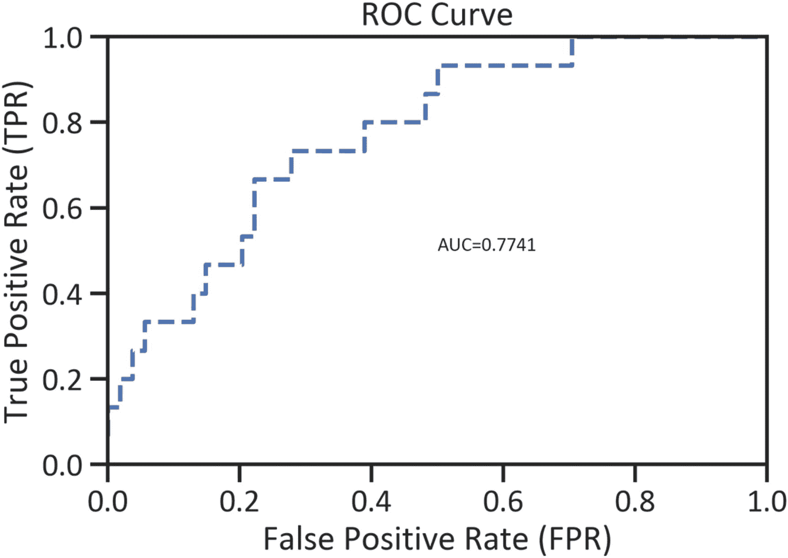
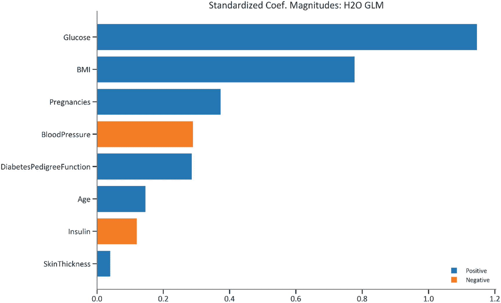
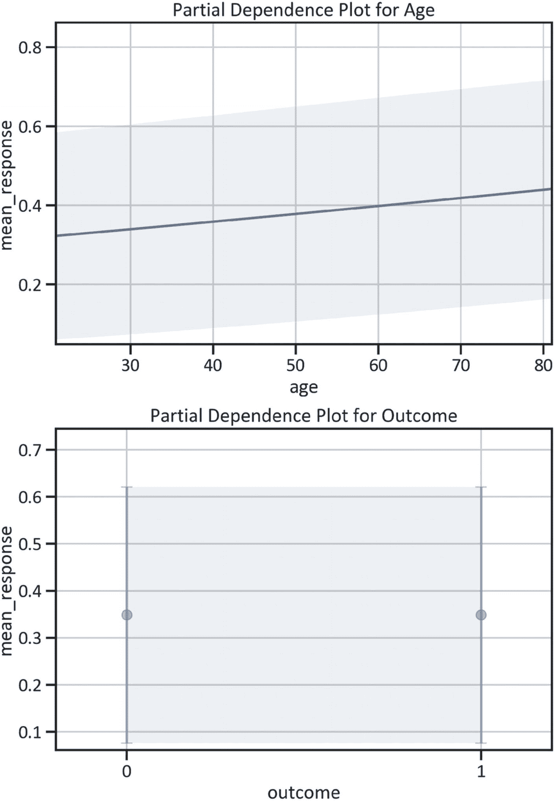
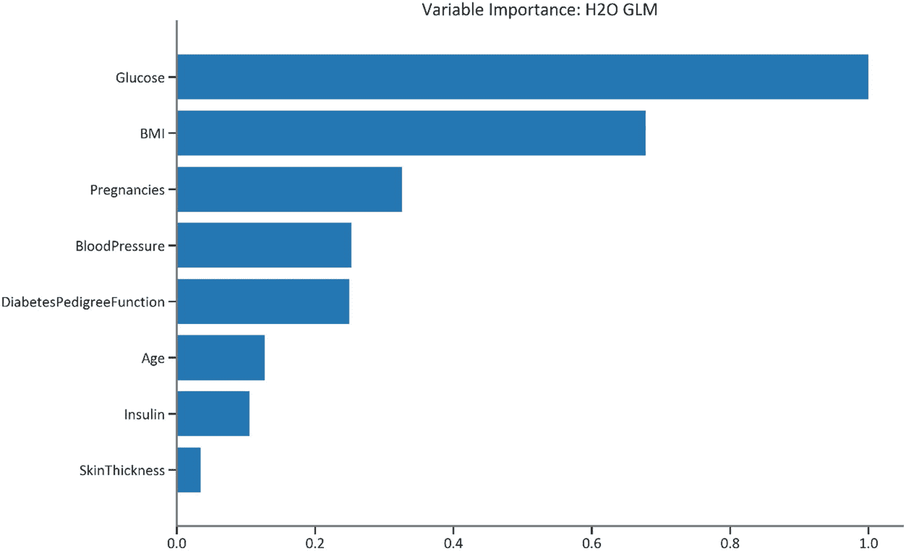

# 十三、使用 H2O 的机器学习

本章总结了一本书，让你熟悉数据科学的世界。这本书涵盖了监督学习和非监督学习，以及降维。此外，它隐藏了机器学习的一个子领域，通常被认为是深度学习。你可能已经意识到机器学习的领域很广。你必须能够设计数据，优化超参数，并开发，测试，验证，部署和扩展模型，以使用机器学习模型和深度学习解决复杂的问题。这通常需要个人知道并应用不同的统计、机器学习和深度学习模型，以及一些编程技术。

对数据科学家的需求很高，但拥有足够技能的数据科学家的供应却很少。在过去的十年里，全球各地的智库一直在为有据可查和开创性的开源软件包做出贡献，这些软件包勇敢地帮助我们使用机器学习解决复杂的问题。公共领域也有各种各样的内容，如在线教程、传统学位课程、在线学习课程、发表的学术研究论文等等。虽然科学界正试图通过让每个人都能轻松使用人工智能来加速人工智能的采用。大多数组织努力一致采用和扩展人工智能解决方案。

要充分利用 H2O，请使用 H2O 流。它充分提供了无需编写多行代码的能力。这是一个面向 H2O 的开源的基于 web 的交互环境，允许您将代码执行、文本、数学、情节和富媒体结合到一个文档中。借助 H2O 流，您可以高效地捕获、重新运行、注释、呈现和共享您的工作流 <sup>[1](#Fn1)</sup> 。在本章中，我们将向您展示如何使用 Python 代码构建和测试模型。在 Python 环境中使用`pip install h2o`安装 H2O，在 Conda 环境中使用`conda install -c h2oai h2o`安装。

## H2O 是如何运作的

H2O 使我们能够在很少的技术努力下开发、测试和验证机器学习和深度学习模型。当使用这个包时，我们不需要写很多行代码。它自动化了大多数数据科学程序。清单 [13-1](#PC1) 初始化 H2O。

表 13-1

环境信息

<colgroup><col class="tcol1 align-left"> <col class="tcol2 align-left"></colgroup> 
| 

H2O 集群正常运行时间:

 | 

07 秒

 |
| --- | --- |
| **H2O 集群时区:** | 美国/洛杉矶 |
| **H2O _ 数据 _ 解析 _ 时区:** | 协调世界时。亦称 COORDINATED UNIVERSAL TIME |
| **H2O _ 集群 _ 版本:** | 3.30.0.7 |
| **H2O _ 集群 _ 版本 _ 年龄:** | 3 个月零 3 天 |
| **H2O 集群名称:** | H2O _ from _ python _ i5 _ lenov _ z4v 4c |
| **H2O 聚类总数节点数:** | one |
| **H2O _ 集群 _ 空闲 _ 内存:** | 2.975 Gb |
| **H2O 集群核心总数:** | Zero |
| **H2O _ 集群 _ 允许 _ 核心:** | Zero |
| **H2O _ 集群 _ 状态:** | 接受新成员，健康 |
| **H2O _ 连接 _ 网址:** | [T2`http://127.0.0.1:54321`](http://127.0.0.1:54321) |
| **H2O _ 连接 _ 代理:** | { " http ":null，" https ":null } |
| **H2O _ 内部 _ 安全:** | 错误的 |
| **H2O _ API _ 扩展:** | 亚马逊 S3，Algos，AutoML，核心 V3，目标编码器，核心 V4 |
| **Python_version:** | 最终版本 |

```py
import h2o
h2o.init()

Listing 13-1Initialize H2O

```

## 数据处理

我们使用`import_file()`方法将数据加载到 H2O 数据帧中。该软件包支持不同的文件格式。同样，我们从 Kaggle 获得了示例数据。 <sup>[2](#Fn2)</sup>

```py
df = h2o.import_file(path_name)

Listing 13-2Load Data into a H2O Dataframe

```

清单 [13-3](#PC3) 返回前 10 个数据点。

```py
df.head()

Listing 13-3View a H2O Dataframe

```

清单 [13-4](#PC4) 将自变量和因变量分配给两个独立的数据帧。

```py
y = "Outcome" x = df.col_names x.remove("Outcome") df["Outcome"] = df["Outcome"].asfactor()

Listing 13-4Allocate Variables to X and Y Dataframe

```

清单 [13-5](#PC5) 应用`split_frame()`方法将数据分成训练数据、测试数据和验证数据。

```py
train, valid, test = df.split_frame(ratios=[.8, .1], seed=1234)
print("Train shape: ", train.shape)
print("Valid shape: ", valid.shape)
print("Test shape: ", test.shape)

Listing 13-5Split Data into Training Data, Test Data and Validation Data

```

## 模特培训

清单 [13-6](#PC6) 完成了逻辑分类器。

```py
from h2o.estimators.glm import H2OGeneralizedLinearEstimator glm = H2OGeneralizedLinearEstimator(family="binomial") glm.train(x=x, y=y, training_frame=train, validation_frame=valid)

Listing 13-6Finalize the Logistic Classifier

```

我们将家庭类型指定为“二项式”，因为我们正在解决二元分类问题。如果我们正在解决一个多类分类问题，那么我们应该将家庭类型指定为“多项式”

### 模型评估

在整本书中，我们根据混淆矩阵、分类报告、ROC 曲线、精确召回曲线和学习曲线来总结二元分类器的性能。与 H2O 软件包相比，SciKit-Learn 软件包提供了一些矩阵。下面，我们充分讨论了 H2O 软件包中可用的分类评估指标，然后我们向您展示如何估计它们。我们从基尼指数开始。

#### 基尼指数

H2O 一揽子方案使我们能够获得基尼指数值，该值衡量了这些值中的不平等程度。我们使用该指数来正确地确定分类器的质量。该索引包含范围从 0 到 1 的值。其中 0 表示分类器完全相等，1 表示分类器完全不相等。当我们开发一个分类器时，我们通常期望找到一个更接近 1 的基尼指数值。清单 [13-7](#PC7) 返回基尼指数的估计值。

```py
glm.gini(train=True, valid=True, xval=False)
{'train': 0.6828073360331426, 'valid': 0.548148148148148}

Listing 13-7Gini Index

```

训练数据的基尼指数值是 0.68，验证数据的值是 0.55。这两种情况都处于平等和不平等之间。我们并不像预期的那样完全不平等。但是，这些值不会小到影响关于分类器的结论。

#### 绝对马修斯相关系数

H2O 软件包中另一个可用的分类模型评估指标是绝对马修斯相关系数(MCC)。我们用它来确定实际类别和分类器预测的类别之间的相关性。MCC 的值范围从-1 到 1。其中-1 表示分类器在预测类别时会犯很多错误，0 表示分类器在猜测类别时会遇到困难，1 表示分类器不善于区分类别。清单 [13-8](#PC8) 返回绝对 MCC 的估计值。

```py
glm.mcc(train=True, valid=True, xval=False)
{'train': [[0.3356601829569534, 0.5297584436640914]],
 'valid': [[0.3790626186045188, 0.39336862882432994]]}

Listing 13-8Absolute MCC

```

上述发现表明，在实际类别和分类器预测的类别之间存在微弱的正相关。

#### 混淆矩阵

清单 [13-9](#PC9) 返回关于分类器性能的抽象信息。(见表 [13-2](#Tab2) )。

表 13-2

混淆矩阵

<colgroup><col class="tcol1 align-left"> <col class="tcol2 align-left"> <col class="tcol3 align-left"> <col class="tcol4 align-left"> <col class="tcol5 align-left"> <col class="tcol6 align-left"></colgroup> 
|   |   | 

Zero

 | 

one

 | 

错误

 | 

速度

 |
| --- | --- | --- | --- | --- | --- |
| **0** | Zero | Three hundred and six | Ninety | 0.2273 | (90.0/396.0) |
| **1** | one | Forty-nine | One hundred and sixty-eight | 0.2258 | (49.0/217.0) |
| **2** | 总数 | Three hundred and fifty-five | Two hundred and fifty-eight | 0.2268 | (139.0/613.0) |

```py
glm.confusion_matrix()

Listing 13-9Confusion Matrix

```

清单 [13-10](#PC10) 找到训练数据和验证数据的 F1 分数。

```py
glm.F1(train=True, valid=True, xval=False)
{'train': [[0.3356601829569534, 0.7073684210526315]],
 'valid': [[0.3790626186045188, 0.5405405405405405]]}

Listing 13-10F1 Score Both the Training Data and Validation Data

```

上述结果表明，逻辑分类器具有良好的进动和召回率。清单 [13-11](#PC11) 求精度系数。

```py
glm.accuracy(train=True, valid=True, xval=False)

{'train': [[0.5331122058852918, 0.7862969004893964]], 'valid': [[0.8926783510054471, 0.8115942028985508]]}

Listing 13-11Accuracy Coefficient

```

清单 [13-12](#PC12) 产生了一条曲线，该曲线总结了分类器在区分类别方面的熟练程度(见图 [13-1](#Fig1) )。



图 13-1

受试者工作特征曲线

```py
glm_perf.plot()

Listing 13-12ROC Curve

```

图 [13-1](#Fig1) 呈现出良好曲线的特征；开始时，它沿着边界的左边走。然而，随着我们增加假阳性率，真阳性率也增加。

#### 标准化系数量值

清单 [13-13](#PC13) 返回一个图形，该图形表示自变量和因变量之间的关系(见图 [13-2](#Fig2) )。



图 13-2

标准化系数量值

```py
glm.std_coef_plot()

Listing 13-13Standard Coefficient Magnitude

```

图 [13-2](#Fig2) 显示了标准化系数的大小。除了血压和胰岛素，大多数独立变量与糖尿病结果正相关。我们也看到葡萄糖和糖尿病结果之间有很强的正相关性。

#### 部分依赖

我们用部分相关来确定变量之间关系的影响。表 [13-3](#Tab3) 强调了年龄和糖尿病结果之间的部分相关性。

表 13-3

年龄部分相关

<colgroup><col class="tcol1 align-left"> <col class="tcol2 align-left"> <col class="tcol3 align-left"> <col class="tcol4 align-left"> <col class="tcol5 align-left"></colgroup> 
|   | 

年龄

 | 

平均响应

 | 

标准开发响应

 | 

标准误差均值响应

 |
| --- | --- | --- | --- | --- |
| **0** | 21.000000 | 0.322744 | 0.261743 | 0.009445 |
| **1** | 24.157895 | 0.328581 | 0.263071 | 0.009493 |
| **2** | 27.315789 | 0.334469 | 0.264344 | 0.009539 |
| **3** | 30.473684 | 0.340407 | 0.265559 | 0.009583 |
| **4** | 33.631579 | 0.346395 | 0.266716 | 0.009624 |

```py
glm.partial_plot(data = df, cols = ["Age", "Outcome"], server=False, plot = True)

Listing 13-14Partial Dependence

```

表 [13-3](#Tab3) 和 [13-4](#Tab4) 强调了变量值和响应平均值、响应标准偏差和响应标准误差平均值的变化。

表 13-4

葡萄糖部分依赖

<colgroup><col class="tcol1 align-left"> <col class="tcol2 align-left"> <col class="tcol3 align-left"> <col class="tcol4 align-left"> <col class="tcol5 align-left"></colgroup> 
|   | 

结果

 | 

平均响应

 | 

标准开发响应

 | 

标准误差均值响应

 |
| --- | --- | --- | --- | --- |
| **0** | Zero | 0.348501 | 0.272299 | 0.009826 |
| **1** | one | 0.348501 | 0.272299 | 0.009826 |

图 [13-3](#Fig3) 显示了变量及其相应的平均响应。它给出了部分相关的概念。



图 13-3

部分依赖

#### 特征重要性

我们使用特征重要性作为降维技术，为每个自变量分配一个值，该值显示每个自变量对因变量的相对重要性。清单 [13-15](#PC15) 绘制特征重要性(见图 [13-4](#Fig4) )。



图 13-4

特征重要性

```py
glm.varimp_plot()

Listing 13-15Feature Importance

```

图 [13-4](#Fig4) 显示葡萄糖是糖尿病结果中最重要的变量。接着是身体质量指数，然后怀孕，等等。如果我们去除年龄、胰岛素和皮肤厚度，我们可以提高分类器的性能。

### 预言

清单 [13-16](#PC16) 列出了预测的类别和类别概率(见表 [13-5](#Tab5)

表 13-5

预测类别和类别概率

<colgroup><col class="tcol1 align-left"> <col class="tcol2 align-left"> <col class="tcol3 align-left"></colgroup> 
| 

预测

 | 

p0 蛋白

 | 

第一亲代

 |
| --- | --- | --- |
| **0** | 0.956033 | 0.0439669 |
| **0** | 0.977438 | 0.0225621 |
| **1** | 0.58329 | 0.41671 |
| **0** | 0.753834 | 0.246166 |
| **1** | 0.269132 | 0.730868 |
| **0** | 0.952432 | 0.0475679 |
| **0** | 0.811075 | 0.188925 |
| **0** | 0.917553 | 0.0824472 |
| **0** | 0.665598 | 0.334402 |
| **0** | 0.813001 | 0.186999 |

```py
y_predglm = glm.predict(test)
y_predglm

Listing 13-16Predicted Classes

```

## AutoML

AutoML 代表自动机器学习。这个术语不言自明。它使我们能够只使用几行代码来构建和严格测试不同的机器学习和深度学习模型。它还自动化了超参数优化和数据建模等过程。与其开发许多模型并单独比较，我们可能会使用它。开发 AutoML 模型很简单。清单 [13-17](#PC17) 完成了 AutoML 模型。

```py
from h2o.automl import H2OAutoML
automl = H2OAutoML(max_runtime_secs=120)
automl.train(x=x, y=y, training_frame=train, validation_frame=valid)

Listing 13-17Finalize the AutoML Model

```

当我们完成它时，我们必须指定不同模型学习数据结构所需的最大秒数。在我们的例子中，我们指定了 2 分钟。当我们在后台使用它时，H2O 软件包会优化可用模型的超参数并训练它们。

### 排行榜

表 [13-6](#Tab6) 突出了所有训练模型的性能，包括一个 5 倍交叉验证模型性能。它根据 AUC 分数对分类器进行排名。列表中第一个分类器具有最高的 AUC 分数，列表中最后一个分类器具有最低的 AUC 分数。它还突出显示了对数损失、精确召回范围、每类误差的平均值、误差的平均和以及误差的均方根和。

表 13-6

AutoML 领导委员会

<colgroup><col class="tcol1 align-left"> <col class="tcol2 align-left"> <col class="tcol3 align-left"> <col class="tcol4 align-left"> <col class="tcol5 align-left"> <col class="tcol6 align-left"> <col class="tcol7 align-left"></colgroup> 
| 

型号 id

 | 

ROC 曲线下的面积

 | 

日志丢失

 | 

aucpr

 | 

平均每类误差

 | 

均方根误差(root-mean-square error)

 | 

均方误差(mean square error)

 |
| --- | --- | --- | --- | --- | --- | --- |
| **stackedendable _ bestfrienly _ automl _ 20201025 _ 135923** | 0.830476 | 0.48388 | 0.703867 | 0.243867 | 0.397547 | 0.158043 |
| **glm _ 1 _ automl _ 20201025 _ 135923** | 0.829476 | 0.486136 | 0.70964 | 0.248761 | 0.397072 | 0.157666 |
| **GBM _ grid _ _ 1 _ AutoML _ 2020 10 25 _ 135923 _ model _ 8** | 0.8278 | 0.483469 | 0.714668 | 0.244595 | 0.398872 | 0.159099 |
| **stackedendable _ all models _ automl _ 20201025 _ 135923** | 0.827573 | 0.486645 | 0.707761 | 0.248918 | 0.399255 | 0.159404 |
| **deep learning _ grid _ 2 _ AutoML _ 2020 10 25 _ 135923 _ model _ 1** | 0.823174 | 0.506595 | 0.695583 | 0.244216 | 0.403943 | 0.16317 |
| **deep learning _ grid _ _ 1 _ AutoML _ 2020 10 25 _ 135923 _ model _ 3** | 0.819415 | 0.571089 | 0.682411 | 0.257378 | 0.415348 | 0.172514 |
| **GBM _ 5 _ automl _ 20201025 _ 135923** | 0.818548 | 0.494956 | 0.675015 | 0.244787 | 0.40579 | 0.164665 |
| **deep learning _ grid _ _ 1 _ AutoML _ 2020 10 25 _ 135923 _ model _ 2** | 0.818118 | 0.554478 | 0.725002 | 0.237461 | 0.41781 | 0.174565 |
| **GBM _ grid _ _ 1 _ AutoML _ 2020 10 25 _ 135923 _ model _ 9** | 0.815156 | 0.502735 | 0.687605 | 0.258513 | 0.408501 | 0.166873 |
| **GBM _ grid _ _ 1 _ AutoML _ 2020 10 25 _ 135923 _ model _ 5** | 0.814243 | 0.498371 | 0.669688 | 0.262178 | 0.40745 | 0.166015 |

```py
leaderboard = automl.leaderboard
leaderboard

Listing 13-18AutoML Leaderboard

```

表 [13-6](#Tab6) 显示领先的二元分类器的 AUC 分数为 0.83，AUCPR 为 0.70。

### 预报

上面，我们找到了主要的分类器。现在让我们考虑预测的类别和类别概率(见表 [13-7](#Tab7) )。

表 13-7

预测类别和类别概率

<colgroup><col class="tcol1 align-left"> <col class="tcol2 align-left"> <col class="tcol3 align-left"></colgroup> 
| 

预测

 | 

p0 蛋白

 | 

第一亲代

 |
| --- | --- | --- |
| **0** | 0.923024 | 0.0769757 |
| **0** | 0.896685 | 0.103315 |
| **1** | 0.625636 | 0.374364 |
| **1** | 0.713157 | 0.286843 |
| **1** | 0.37774 | 0.62226 |
| **0** | 0.922715 | 0.0772854 |
| **0** | 0.836983 | 0.163017 |
| **0** | 0.910994 | 0.0890061 |
| **1** | 0.587552 | 0.412448 |
| **1** | 0.686241 | 0.313759 |

```py
y_pred = automl.predict(test)
y_pred

Listing 13-19Predicted Classes and Class Probabilities

```

## 结论

本章介绍了一个无人驾驶开源软件包，名为 H2O。我们开发并测试了逻辑分类器和 AutoML 模型。您可能已经注意到这个包是多么直观和丰富。它不需要一个人有广泛的技术技能和经验。软件包的易用性使组织能够逐步采用实用的人工智能解决方案。我们预计在可预见的未来会看到更多的无人驾驶开源包。

我们现在已经到了这本书的结尾部分；我们相信您已经对数据科学领域有了足够的了解。现在，应用获得的知识解决复杂的问题。始终跟上最新的研究和技术。永远不要陷入部署不可靠的模型或放弃模型和 web 应用程序的可伸缩性的陷阱。

<aside aria-label="Footnotes" class="FootnoteSection" epub:type="footnotes">Footnotes [1](#Fn1_source)

[<font category = " non portional ">http://docs。h2o。ai/ h2o/最新稳定/ h2o-docs/ flow。html < /强调>](http://docs.h2o.ai/h2o/latest-stable/h2o-docs/flow.html)

  [2](#Fn2_source)

一[<font category = " non proportional ">https://www。卡格尔。com/UC IML/pima-印第安人-糖尿病-数据库< / Emphasis >](https://www.kaggle.com/uciml/pima-indians-diabetes-database)

 </aside>