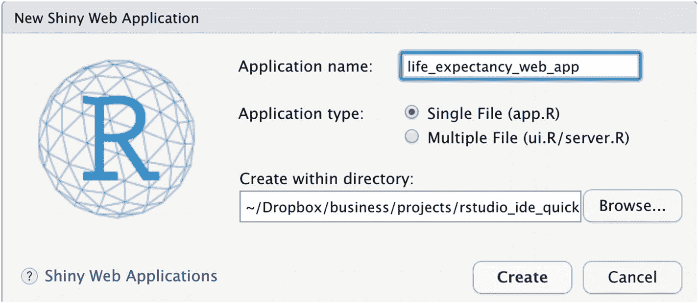
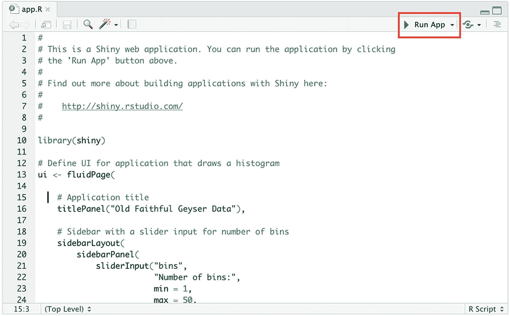
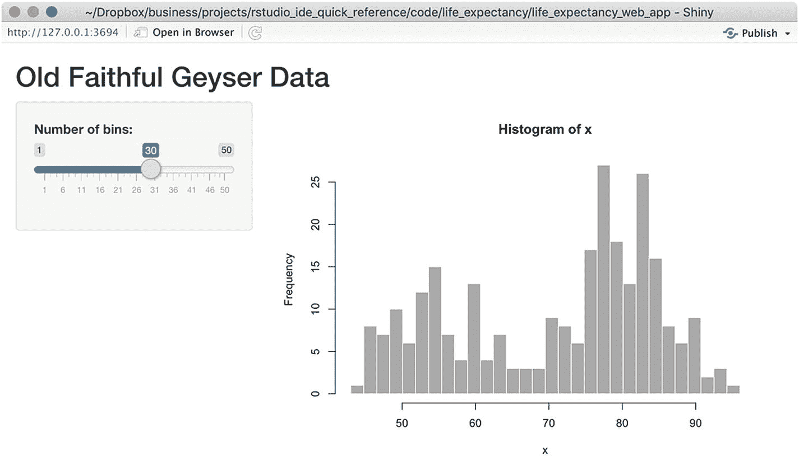
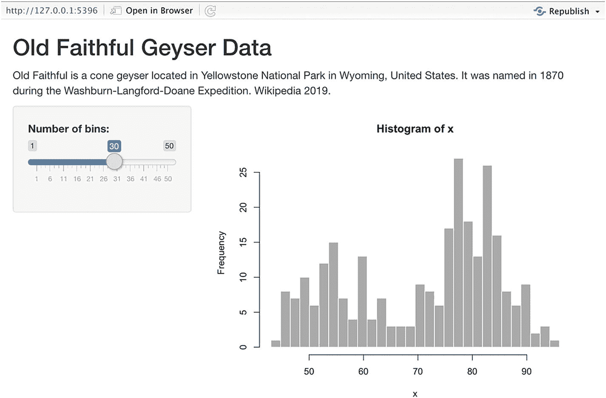
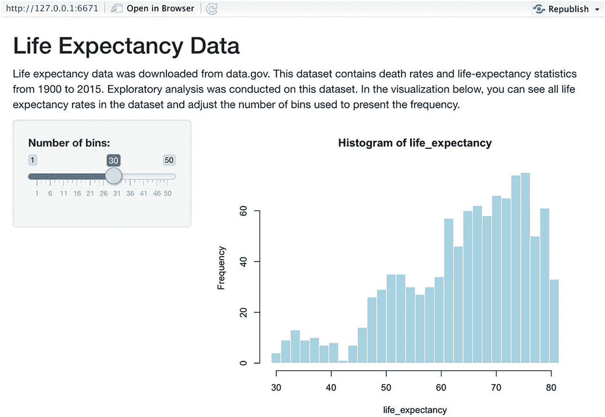

# 九、R Shiny 仪表盘

R Markdown 和`htmlwidgets`将给你创造丰富甚至互动的体验。然而，一些用例需要比这些类型的静态工具所能提供的更多的东西。例如，您可能需要要求用户提供将在分析中使用的参数，连接到后端数据库，或者在用户探索您的分析时执行新的 R 脚本。

您可以在 RStudio 中使用 Shiny 来创建这些类型的数据仪表板，它们具有与 R 系统完全集成的丰富功能。Shiny 是一个用于在 R 中创建交互式 web 应用程序的包。这些应用程序可以在 RStudio 项目中使用，添加到 R Markdown 报告中，或者作为 web 应用程序在线发布。Shiny 提供了一个易于使用的框架来开发这些应用程序，并且您可以使用自己的 CSS 和 JavaScript 代码来进一步扩展 Shiny。

## 闪亮的新应用

将一个闪亮的应用程序添加到 RStudio 项目中是非常容易的。只需进入 RStudio 菜单栏，然后选择“文件”、“新建文件”，然后选择“闪亮的 Web 应用程序…”。将出现如图 [9-1](#Fig1) 所示的对话框。



图 9-1

全新闪亮应用

您可以命名您的应用程序，并选择是否需要一个或两个文件中的代码。单击“创建”按钮构建 web 应用程序。

RStudio 将使用您在对话框中提供的名称在项目中创建一个新文件夹。如果选择“单个文件”，一个名为“app。r”将出现并自动在您的编辑器视图中打开，如图 [9-2](#Fig2) 所示。



图 9-2

app。r 内容

出现的代码是 RStudio 为您创建的一个模板，作为起点。这是一个工作出色的应用程序，它使用内置的 R 数据集作为例子。点击图 [9-2](#Fig2) 所示的“运行应用”按钮，运行网络应用。该应用将开始在由 R 管理的本地 web 服务器上运行，如图 [9-3](#Fig3) 所示。



图 9-3

本地运行的闪亮应用

该直方图非常具有交互性，当您调整左侧的滑块控件时，会执行 R 代码来重新创建右侧的直方图。这比简单地将预烘焙的 popovers 包含到静态报告中更进了一步。

沿着图 [9-3](#Fig3) 的顶部，你会看到一个 http 地址和一个“在浏览器中打开”按钮。该应用程序运行在 web 服务器上，因此您可以使用常规浏览器查看该应用程序，方法是单击“在浏览器中打开”按钮，或者在浏览器的地址栏中键入 http 地址。

你可能还会注意到右边有一个“发布”按钮。闪亮的应用程序被发布到网站上，这样任何人都可以使用它们。这些应用程序可以通过 RStudio 提供的服务公开，也可以通过自己的公司管理私有服务器。要获得发布应用的免费帐户，请前往 [`https://www.shinyapps.io`](https://www.shinyapps.io) 注册。

## 理解闪亮

Shiny 可以用来创建使用 R 脚本的仪表板，并且在 web 上很容易访问。然而，像大多数 R 包一样，你可以更深入系统来构建真正的定制体验。我们将在这里讨论基础知识，给你一个使用 Shiny 的良好起点，但是要真正掌握这个软件包，请前往 [`https://shiny.rstudio.com/`](https://shiny.rstudio.com/) 查看教程和文档，了解使用 Shiny 的可能性。

闪亮的代码被分成两个不同的责任区域:用户界面和服务器。这也被称为“前端”和“后端”。这个想法是，像滑块和按钮这样的视觉用户界面元素属于应用程序的前端部分，而数字处理和数据分析属于应用程序的后端部分。

在我们生成的代码中，只有一个文件同时包含用户界面和服务器。您还会看到这两个组件在它们自己的文件中被分开，这取决于您选择的选项或最初编写应用程序的人。

### 用户界面

用户界面包含在“应用程序”中编码的`ui`对象中。r "文件是为我们创建的。创建`ui`对象的代码位于应用程序的顶部。r 文件:

```r
ui <- fluidPage(

    # Application title
    titlePanel("Old Faithful Geyser Data"),

    # Sidebar with a slider input for number of bins
    sidebarLayout(
        sidebarPanel(
            sliderInput("bins",
                        "Number of bins:",
                        min = 1,
                        max = 50,
                        value = 30)
        ),

        # Show a plot of the generated distribution
        mainPanel(
           plotOutput("distPlot")
        )
    )
)

```

这整个代码块只有一个函数`fluidPage`，这个函数是用逗号分隔的两个参数列表`titlePanel`和`sidebarLayout`调用的。该函数的结果被分配给`ui`对象。这个`ui`对象将在文件末尾用作启动闪亮应用程序的函数的参数。

花一点时间慢下来，真正看看上面的代码。你可能不习惯这样写代码。函数名的用词暗示了正在发生的事情。如果你仔细想想，你可能会认为我们会看到一个页面，它包含一个标题，后面跟着一些更复杂的东西(暂时忽略它)。你可以清楚地看到我们在图 [9-3](#Fig3) 中首次看到的“老忠实喷泉数据”的标题。

构建闪亮前端的基本流程在这里。如果您想在应用程序中添加一些东西，您可以在逗号分隔的列表中包含一个新的函数调用。例如，如果我想添加一个 HTML 段落来解释什么是 Old Faithful，我可以在`titlePanel`后面的空白处添加`p`函数。

```r
# Define UI for application that draws a histogram
ui <- fluidPage(

    # Application title
    titlePanel("Old Faithful Geyser Data"),

    p("Old Faithful is a cone geyser located in Yellowstone National Park in Wyoming, United States. It was named in 1870 during the Washburn-Langford-Doane Expedition. Wikipedia 2019."),

```

结果就是你在图 [9-4](#Fig4) 中看到的 web 应用。它本质上是相同的应用程序，但现在它包括一些文本上下文。



图 9-4

向闪亮的应用程序添加段落

当您构建应用程序时，您将继续向页面中添加内容。有些函数是简单的 HTML 组件，如`p`函数，有些是特定于 Shiny 的。通常，您会发现对象嵌套在其他对象中，以便定义应用程序的布局。

您可以在`sidebarLayout`中看到这一点，它是整个`fluidPage`中的一个对象，而这个对象又由另外两个对象组成，这两个对象作为参数出现在一个逗号分隔的列表中。

```r
    # Sidebar with a slider input for number of bins
    sidebarLayout(
        sidebarPanel(
            sliderInput("bins",
                        "Number of bins:",
                        min = 1,
                        max = 50,
                        value = 30)
        ),

        # Show a plot of the generated distribution
        mainPanel(
           plotOutput("distPlot")
        )
    )

```

上面的两个组件是`sidebarPanel`和`mainPanel`。`sidebarPanel`包含另一个嵌套对象`sliderInput`，它定义了用户将用来控制可视化的滑块。第一个参数值`bins`被称为`inputID`，用于标识 web 应用程序后端的`server`组件。

`mainPanel`包含`plotOutput`，它是显示图形的对象。在`plotOutput`中，该参数被突出显示，因为它将被用作`inputID`，以便`server`组件可以识别该对象。

总之，`ui`对象现在包含显示标题、段落、滑块控件、绘图和其他对象的对象，以加强布局。滑块和绘图这两个对象也有`inputID`参数，以便服务器能够从滑块中检索值，并知道在哪里显示图形。

### 计算机网络服务器

服务器组件负责后端的繁重工作。在本例中，服务器将收集用户在用户界面上定义的参数，以运行 R 代码进行分析并创建绘图。`inputID`用于识别输入和输出组件。下面是突出显示了输入和输出的服务器代码。

```r
# Define server logic required to draw a histogram

server <- function(input, output) {

    output$distPlot <- renderPlot({
        # generate bins based on input$bins from ui.R
        x    <- faithful[, 2]
        bins <- seq(min(x), max(x),
                    length.out = input$bins + 1)

        # draw the histogram with the specified
        # number of bins
        hist(x, breaks = bins,
             col = 'darkgray',
             border = 'white')
    })
}

```

在上面的代码中，我们给服务器对象分配了一个匿名函数。这些功能与我们在上面的用户界面中所做的略有不同。在用户界面中，我们简单地将函数调用的结果分配给`ui`对象，而在这里，我们以匿名函数的形式将一组指令分配给`server`对象。这些指令将用于响应用户界面中的活动。

粗体代码是服务器连接到用户界面的钩子。所有内容都在匿名函数的`input`和`output`参数中引用。`input`包含对用户界面中每个输入组件的引用，而`output`包含对用户界面中每个输出组件的引用。

您使用后跟美元符号的`input`对象和`input`对象`input$bins`的`inputID`来引用一个`input`组件。如果您还记得的话，“bin”是赋予 slider 对象的标识符。`input$bins`将返回用户选择的当前值。

这里的输出对象获取由上面的`renderPlot`函数生成的所有代码。您可以看到，我们使用函数的参数`output$distPlot`以类似的方式引用这个输出组件。您可以在`renderPlot`函数包含的代码行中看到用户输入是如何收集的以及图形是如何显示的。

### 应用

在 Shiny 可以创建 web 应用程序之前，还有一件事必须要做。我们需要关联`ui`和`server`组件，然后用代码`shinyApp(ui = ui, server = server)`启动它们。

这是作为样板代码包含在内的，除非您更改用户界面和服务器对象的名称，否则您可能根本不需要接触这些代码。但是，了解这段代码的位置以及这段代码启动应用程序实例是值得的。

### 定制闪亮的应用程序

让我们把这个样板代码改成适合我们分析的代码。现在，让我们对用户界面做一些小的调整，让我们显示我们的数据，而不是构建的 it `faithful`数据集。

我们需要做的第一件事是将我们的数据集复制到闪亮的文件夹中，这样我们就可以在将来将所有资产部署在一个地方。在 R 命令行上使用以下代码，将数据集作为 rdata 文件保存在 Shiny app 文件夹中:

```r
save(expectancy, file = "life_expectancy_web_app/expectancy.rdata")

```

现在，当应用程序启动时，我们可以将它加载到闪亮的会话中。把代码放在闪亮的应用程序的顶部。r 文件来加载数据集。

```r
load("expectancy.rdata")

expectancy <-
  expectancy %>%
  filter(!is.na(life_expectancy))

```

这将加载数据集，然后移除任何会干扰直方图的缺失值。现在，我们可以查看我们的数据集，而不是忠实的，而是改变`server`组件中的一行代码。

```r
server <- function(input, output) {

    output$distPlot <- renderPlot({
        # generate bins based on
        # input$bins from ui.R
        x  <- expectancy$life_expectancy

        bins <- seq(min(x), max(x),
                    length.out = input$bins + 1)

        # draw the histogram with the
        # specified number of bins
        hist(x, breaks = bins,
             col = 'darkgray',
             border = 'white')
    })
}

```

在我们测试之前，让我们对标题描述进行修改，并在情节中添加我们自己的颜色。你大概能猜到我们会在哪里做这些改变。在下面的代码中，所有的更改都以粗体突出显示。

```r
library(shiny)

library(tidyverse)

load("expectancy.rdata")

expectancy <-

  expectancy %>%
  filter(!is.na(life_expectancy))

# Define UI for application that draws a histogram
ui <- fluidPage(

    # Application title
    titlePanel("Life Expectancy Data"),

    p("Life expectancy data was downloaded from
       data.gov. This dataset contains death rates
       and life-expectancy statistics
       from 1900 to 2015\. Exploratory analysis was
       conducted on this dataset. In the
       visualization below, you can see all life
       expectancy  rates in the dataset and adjust
         the number of bins used to present the
         frequency."),

    # Sidebar with a slider input for number of bins
    sidebarLayout(
        sidebarPanel(
            sliderInput("bins",
                        "Number of bins:",
                        min = 1,
                        max = 50,
                        value = 30)
        ),

        # Show a plot of the generated distribution
        mainPanel(
           plotOutput("distPlot")
        )
    )
)

# Define server logic required to draw
# a histogram

server <- function(input, output) {

    output$distPlot <- renderPlot({
        # generate bins based on
        # input$bins from ui.R
       life_expectancy  <- expectancy$life_expectancy

        bins <- seq(min(life_expectancy),
                    max(life_expectancy),
                    length.out = input$bins + 1)

        # draw the histogram with the
        # specified number of bins
        hist(life_expectancy,
             breaks = bins,
             col = 'lightblue',
             border = 'white')
    })

}

# Run the application
shinyApp(ui = ui, server = server)

```

现在，当您运行这段代码时，您的应用程序将类似于图 [9-5](#Fig5) 中显示的程序。



图 9-5

预期寿命闪亮的应用程序

现在上下文是相关的，我们还调整了直方图中条形的颜色。你可以在作者的 shiny.io 页面上浏览到这个网址: [`https://mattjcamp.shinyapps.io/life_expectancy_web_app`](https://mattjcamp.shinyapps.io/life_expectancy_web_app) 来查看它的出版版本。

## 结论

在这一章中，我们介绍了 Shiny，实际上只是触及了我们用这个工具所能完成的事情的表面。Shiny 开创了一条将数据丰富的应用程序直接部署到网络上的途径，完全不需要特定的网络开发背景。

也就是说，Shiny 是一个非常丰富的包，即使没有接触 JavaScript，你也可以发现自己在数据 web 应用上花费了大量的时间。花些时间学习基础知识，然后用来自 [`https://shiny.rstudio.com`](https://shiny.rstudio.com) 的示例代码遵循本章中的模式。寻找您感兴趣的示例，这些示例可以处理您熟悉的数据，并调整代码以实现您自己的可视化。当你这样做并学习模式时，部署闪亮的应用程序将成为你的第二天性，就像统计编程和数据分析现在对你来说一样。