# 十七、信号处理

在这一章中，我们将探讨信号处理，这是一个在科学和工程的不同分支都有应用的主题。在这种情况下，信号可以是随时间变化的量(时间信号)或作为空间坐标的函数变化的量(空间信号)。例如，音频信号是时间信号的典型示例，而图像是二维空间信号的典型示例。实际上，信号通常是连续函数，但在计算应用中，通常使用离散信号，即在距离均匀的离散点对原始连续信号进行采样。采样定理给出了连续信号何时可以由离散样本序列精确表示的严格和定量条件。

信号处理的计算方法在科学计算中起着中心作用，这不仅是因为它们的广泛应用，而且还因为对于重要的信号处理问题存在非常有效的计算方法。特别是，快速傅立叶变换(FFT)是许多信号处理问题的重要算法，而且它可能是所有计算中最重要的数值算法之一。在本章中，我们将探讨如何在频谱分析中使用 FFT，但除了这一基本应用之外，FFT 还有广泛的用途，可以直接或间接地作为其他算法的一部分。其他信号处理方法，如卷积和相关分析，以及线性滤波器也有广泛的应用，特别是在工程领域，如控制理论。

在本章中，我们将使用 SciPy 库中的`fftpack`和`signal`模块讨论光谱分析和线性滤波器的基本应用。

## 导入模块

在本章中，我们主要使用 SciPy 库中的`fftpack`和`signal`模块。与通常使用 SciPy 库中的模块一样，我们使用以下模式导入模块:

```py
In [1]: from scipy import fftpack
In [2]: from scipy import signal

```

在其中一个例子中，我们还使用 SciPy 的`io.wavefile`模块来读写 WAV 音频文件。我们以下列方式导入该模块:

```py
In [3]: import scipy.io.wavfile
In [4]: from scipy import io

```

对于基本的数字和图形，我们还需要 NumPy、Pandas 和 Matplotlib 库:

```py
In [5]: import numpy as np
In [6]: import pandas as pd
In [7]: import matplotlib.pyplot as plt
In [8]: import matplotlib as mpl

```

## 光谱分析

我们从考虑频谱分析开始探索信号处理。频谱分析是傅里叶变换的一项基本应用，傅里叶变换是一种数学积分变换，允许我们将信号从时域(表示为时间的函数)转换到频域(表示为频率的函数)。信号的频域表示有多种用途，例如，提取信号的主频成分等特征、对信号进行滤波以及求解微分方程(参见第 [9](09.html) 章)，等等。

### 傅立叶变换

连续信号 *f* ( *t* )的傅里叶变换 *F* ( *v* )的数学表达式为 <sup>[1](#Fn1)</sup>

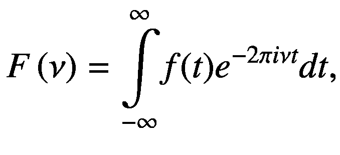

傅立叶逆变换由下式给出

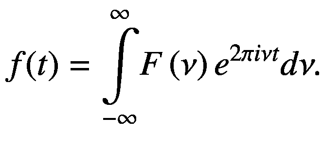

这里 *F* ( *v* )是信号 *f* ( *t* )的复数值幅度谱， *v* 是频率。从 *F* ( *v* )我们可以计算出其他类型的频谱，比如功率谱|*F*(*v*)|<sup>2</sup>。在这个公式中， *f* ( *t* )是一个持续时间无限的连续信号。在实际应用中，我们通常更感兴趣的是使用有限时间内有限数量的样本来逼近 *f* ( *t* )。例如，我们可以在时间间隔*T*∈【0， *T* 】中的*f*(*T*)N 个均匀间隔的点处对函数*f*(*T*)进行采样，从而产生一个样本序列，我们将其表示为( *x* <sub>0</sub> ，*x*1，…， *x* 前文所示的连续傅里叶变换可适用于离散情况:均匀间隔样本序列的离散傅里叶变换(DFT)为

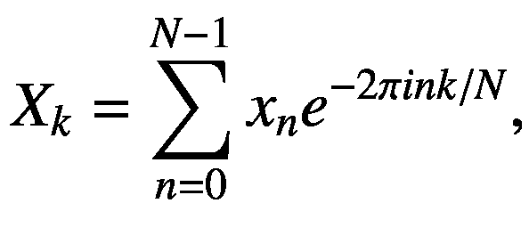

类似地，我们有逆 DFT


其中 *X* <sub>*k*</sub> 是样本的离散傅立叶变换 *x* <sub>*n*</sub> 并且 *k* 是可以与真实频率相关的频率箱号。使用称为快速傅立叶变换(FFT)的算法可以非常有效地计算样本序列的 DFT。SciPy `fftpack`模块 <sup>[2](#Fn2)</sup> 提供 FFT 算法的实现。`fftpack`模块包含多种情况下的 FFT 函数:汇总见表 [17-1](#Tab1) 。这里我们重点演示`fft`和`ifft`函数以及`fftpack`模块中几个助手函数的用法。然而，表 [17-1](#Tab1) 中所有 FFT 功能的一般用法是相似的。

表 17-1

SciPy 中`fftpack`模块所选功能的摘要。有关每个函数的详细用法，包括它们的参数和返回值，请参阅它们的文档字符串，例如使用`help(fftpack.fft).`

<colgroup><col class="tcol1 align-left"> <col class="tcol2 align-left"></colgroup> 
| 

功能

 | 

描述

 |
| --- | --- |
| `fft`，`ifft` | 实值或复值信号的一般 FFT 和逆 FFT。得到的频谱是复数值。 |
| `rfft`，`irfft` | 实值信号的 FFT 和逆 FFT。 |
| `dct`，`idct` | 离散余弦变换及其逆变换。 |
| `dst`，`idst` | 离散正弦变换及其逆变换。 |
| `fft2`、`ifft2`、`fftn`、`ifftn` | 复值信号及其逆信号的二维和 N 维 FFT。 |
| `fftshift, ifftshift, rfftshift, irfftshift` | 分别移动由`fft`和`rfft`产生的结果向量中的频率箱，以使频谱排列成零频率分量位于阵列的中间。 |
| `fftfreq` | 计算`fft`返回结果中 FFT 仓对应的频率。 |

注意，DFT 将离散样本作为输入，并输出离散频谱。为了能够将 DFT 用于原本连续的过程，我们首先必须使用采样将信号减少为离散值。根据采样定理，一个带宽为 *B* 的连续信号(即该信号不包含高于 *B* 的频率)可以从采样频率为*f*<sub>*s*</sub>≥2*B*的离散样本中完全重构出来。这在信号处理中是一个非常重要的结果，因为它告诉我们在什么情况下可以用离散信号代替连续信号。它允许我们在测量连续过程时确定合适的采样速率，因为通常有可能知道或大致猜测过程的带宽，例如，从物理参数。虽然采样速率决定了我们可以用离散傅立叶变换描述的最大频率，但是频率空间中的样本间隔由总采样时间 *T* 确定，或者等效地由采样频率确定后的样本点数确定，*T*=*N*/*f*<sub>*s*</sub>。

作为一个介绍性示例，考虑一个在正态分布噪底之上，具有 1 Hz 和 22 Hz 纯正弦分量的模拟信号。我们首先定义一个函数`signal_samples`，它产生该信号的噪声样本:

```py
In [9]: def signal_samples(t):
   ...:     return (2 * np.sin(2 * np.pi * t) + 3 * np.sin(22 * 2 * np.pi * t) + 2 * np.random.randn(*np.shape(t)))

```

我们可以通过调用这个函数得到一个样本向量，这个函数使用一个数组，以样本时间作为参数。假设我们对计算频率高达 30 Hz 的信号频谱感兴趣。然后我们需要选择采样频率 *f* <sub>*s*</sub> = 60 Hz，如果我们想要获得分辨率为∈*f*= 0.01Hz 的频谱，我们需要采集至少*N*=*f*<sub>*s*/*f*= 6000 个样本，对应于一个采样周期</sub>

```py
In [10]: B = 30.0
In [11]: f_s = 2 * B
In [12]: delta_f = 0.01
In [13]: N = int(f_s / delta_f); N
Out[13]: 6000
In [14]: T = N / f_s; T
Out[14]: 100.0

```

接下来，我们在`N`均匀间隔的时间点对信号函数进行采样，首先创建一个包含采样时间的数组`t`，然后用它来计算`signal_samples`函数:

```py
In [15]: t = np.linspace(0, T, N)
In [16]: f_t = signal_samples(t)

```

产生的信号绘制在图 [17-1](#Fig1) 中。无论是在整个采样时间内还是在较短时间内观察，信号噪声都相当大，在时域观察，添加的随机噪声大多会掩盖纯正弦信号。

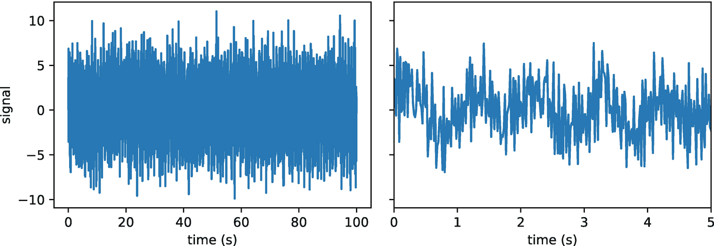

图 17-1

带有随机噪声的模拟信号。左侧为完整信号，右侧为早期放大

```py
In [17]: fig, axes = plt.subplots(1, 2, figsize=(8, 3), sharey=True)
    ...: axes[0].plot(t, f_t)
    ...: axes[0].set_xlabel("time (s)")
    ...: axes[0].set_ylabel("signal")
    ...: axes[1].plot(t, f_t)
    ...: axes[1].set_xlim(0, 5)
    ...: axes[1].set_xlabel("time (s)")

```

为了揭示信号中的正弦分量，我们可以使用 FFT 来计算信号的频谱(或者说，它的频域表示)。我们通过将`fft`函数应用于离散样本阵列`f_t`来获得信号的离散傅立叶变换:

```py
In [18]: F = fftpack.fft(f_t)

```

结果是一个数组`F`，它包含由采样率和样本数量决定的频率下的频谱频率成分。在计算这些频率时，使用辅助函数`fftfreq`很方便，它将样本数和连续样本之间的持续时间作为参数，并返回一个与`F`大小相同的数组，该数组包含每个频率仓对应的频率。

```py
In [19]: f = fftpack.fftfreq(N, 1.0/f_s)

```

由`fft`函数返回的振幅值的频率仓包含正频率和负频率，直到对应于一半采样率的频率，*f*<sub>T5】s</sub>/2。对于实值信号，频谱在正负频率上是对称的，因此我们通常只对正频率分量感兴趣。使用频率阵列`f`，我们可以方便地创建一个掩模，用于提取与我们感兴趣的频率相对应的频谱部分。这里，我们创建一个用于选择正频率成分的屏蔽:

```py
In [20]: mask = np.where(f >= 0)

```

正频率分量的频谱如图 [17-2](#Fig2) 所示。顶部面板包含整个正频谱，并以对数标度绘制，以增加信号和噪声之间的对比度。我们可以看到，在 1 Hz 和 22 Hz 附近有尖锐的峰值，对应于信号中的正弦分量。这些峰值明显突出于频谱中的本底噪声。尽管噪声隐藏了时域信号中的正弦分量，但我们可以在频域表示中清楚地检测到它们的存在。图 [17-2](#Fig2) 中下方的两个面板分别显示了 1 Hz 和 22 Hz 时两个峰值的放大倍数。

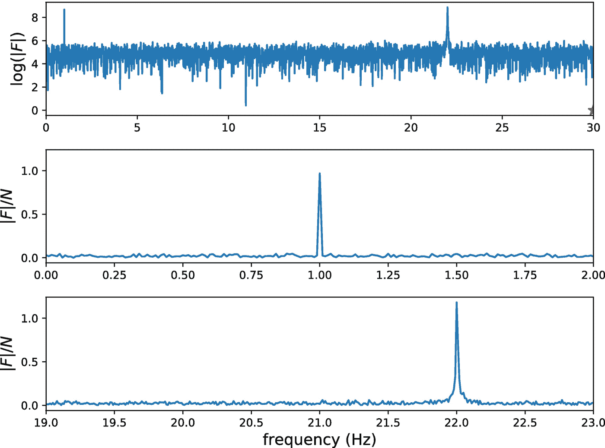

图 17-2

频率成分为 1 Hz 和 22 Hz 的模拟信号的频谱

```py
In [21]: fig, axes = plt.subplots(3, 1, figsize=(8, 6))
    ...: axes[0].plot(f[mask], np.log(abs(F[mask])), label="real")
    ...: axes[0].plot(B, 0, 'r*', markersize=10)
    ...: axes[0].set_ylabel("$\log(|F|)$", fontsize=14)
    ...: axes[1].plot(f[mask], abs(F[mask])/N, label="real")
    ...: axes[1].set_xlim(0, 2)
    ...: axes[1].set_ylabel("$|F|/N$", fontsize=14)
    ...: axes[2].plot(f[mask], abs(F[mask])/N, label="real")
    ...: axes[2].set_xlim(21, 23)
    ...: axes[2].set_xlabel("frequency (Hz)", fontsize=14)
    ...: axes[2].set_ylabel("$|F|/N$", fontsize=14)

```

#### 频域滤波器

正如我们可以使用 FFT 函数`fft`从时域信号计算频域表示一样，我们也可以使用*逆* FFT 函数`ifft`从频域表示计算时域信号。例如，对`F`数组应用`ifft`函数将重建`f_t`数组。通过在应用逆变换之前修改频谱，我们可以实现频域滤波器。例如，仅选择频谱中低于 2 Hz 的频率相当于应用 2 Hz 低通滤波器，抑制信号中的高频成分(本例中高于 2 Hz):

```py
In [22]: F_filtered = F * (abs(f) < 2)
In [23]: f_t_filtered = fftpack.ifft(F_filtered)

```

计算滤波信号的逆 FFT 会产生一个没有高频振荡的时域信号，如图 [17-3](#Fig3) 所示。这个简单的例子总结了许多频域滤波器的本质。本章稍后，我们将更详细地探讨信号处理分析中常用的多种滤波器。

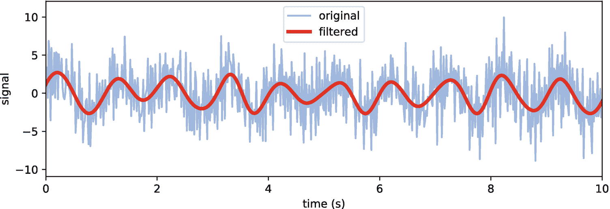

图 17-3

原始时域信号和对信号的频域表示应用低通滤波器后的重构信号

```py
In [24]: fig, ax = plt.subplots(figsize=(8, 3))
    ...: ax.plot(t, f_t, label="original")
    ...: ax.plot(t, f_t_filtered.real, color="red", lw=3, label="filtered")
    ...: ax.set_xlim(0, 10)
    ...: ax.set_xlabel("time (s)")
    ...: ax.set_ylabel("signal")
    ...: ax.legend()

```

### 开窗术

在上一节中，我们直接对信号应用 FFT。这可以给出可接受的结果，但是通常可以通过在应用 FFT 之前对信号应用所谓的窗口函数来进一步改善频谱的质量和对比度。窗口函数是这样一种函数，当与信号相乘时，它调制其幅度，使得它在采样持续时间的开始和结束时接近零。有许多可能的函数可以用作窗口函数，SciPy `signal`模块提供了许多常见窗口函数的实现，包括布莱克曼函数、汉恩函数、汉明函数、高斯窗口函数(具有可变标准偏差)和凯泽窗口函数。 <sup>[3](#Fn3)</sup> 这些功能都绘制在图 [17-4](#Fig4) 中。该图显示，虽然所有这些窗口函数略有不同，但总体形状非常相似。

```py
In [25]: fig, ax = plt.subplots(1, 1, figsize=(8, 3))
    ...: N = 100
    ...: ax.plot(signal.blackman(N), label="Blackman")
    ...: ax.plot(signal.hann(N), label="Hann")
    ...: ax.plot(signal.hamming(N), label="Hamming")
    ...: ax.plot(signal.gaussian(N, N/5), label="Gaussian (std=N/5)")
    ...: ax.plot(signal.kaiser(N, 7), label="Kaiser (beta=7)")
    ...: ax.set_xlabel("n")
    ...: ax.legend(loc=0)

```

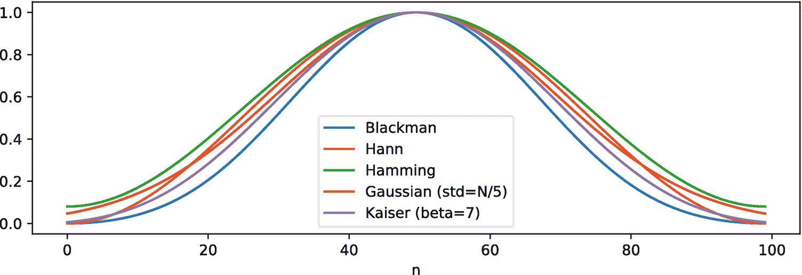

图 17-4

常用窗口函数的示例

可选的窗口函数都有稍微不同的属性和目标，但是在大多数情况下，它们可以互换使用。窗函数的主要目的是减少相邻频率仓之间的频谱泄漏，当信号包含周期不能被采样周期整除的分量时，在离散傅立叶变换计算中会出现频谱泄漏。因此，具有这种频率的信号分量不能适合采样周期中的全部周期数，并且由于离散傅立叶变换假设信号是周期的，因此在周期边界处产生的不连续性会引起频谱泄漏。将信号乘以窗口函数可以减少这个问题。或者，我们也可以增加采样点的数量(增加采样周期)，以获得更高的频率分辨率，但这可能并不总是可行的。

为了了解如何在对时间序列信号应用 FFT 之前使用窗口函数，让我们考虑一下在第 [12 章](12.html)中讨论过的室外温度测量。首先，我们使用 Pandas 库加载数据集，并将其重新采样为均匀间隔的每小时样本，使用`fillna`方法聚集元素。

```py
In [26]: df = pd.read_csv('temperature_outdoor_2014.tsv', delimiter="\t",
    ...:                  names=["time", "temperature"])
In [27]: df.time = (pd.to_datetime(df.time.values, unit="s").
    ...:               tz_localize('UTC').tz_convert('Europe/Stockholm'))
In [28]: df = df.set_index("time")
In [29]: df = df.resample("H").ffill()
In [30]: df = df[(df.index >= "2014-04-01")*(df.index < "2014-06-01")].dropna()

```

一旦创建并处理了 Pandas 数据帧，我们就要求底层 NumPy 数组能够使用`fftpack`模块处理时序数据。

```py
In [31]: time = df.index.astype('int64')/1.0e9
In [32]: temperature = df.temperature.values

```

现在，我们希望在计算 FFT 之前对数组`temperature`中的数据应用一个窗口函数。这里我们使用布莱克曼窗函数，这是一种适合减少频谱泄漏的窗函数。它在 SciPy 的`signal`模块中作为`blackman`函数提供。作为窗口函数的参数，我们需要传递样本数组的长度，它返回一个相同长度的数组:

```py
In [33]: window = signal.blackman(len(temperature))

```

要应用窗口函数，我们只需将其与包含时域信号的数组相乘，并将结果用于后续的 FFT 计算。然而，在对加窗温度信号进行 FFT 之前，我们首先绘制原始温度时间序列和加窗版本。结果如图 [17-5](#Fig5) 所示。将时间序列与窗函数相乘的结果是在采样周期边界附近接近零的信号，并且它可以被视为在周期边界之间具有平滑过渡的周期函数，并且这样加窗信号的 FFT 具有更好的特性。


图 17-5

加窗和原始温度时间序列信号

```py
In [34]: temperature_windowed = temperature * window
In [35]: fig, ax = plt.subplots(figsize=(8, 3))
    ...: ax.plot(df.index, temperature, label="original")
    ...: ax.plot(df.index, temperature_windowed, label="windowed")
    ...: ax.set_ylabel("temperature", fontsize=14)
    ...: ax.legend(loc=0)

```

准备好加窗信号后，剩下的频谱分析如前所述进行:我们可以使用`fft`函数计算频谱，使用`fftfreq`函数计算对应于每个频率仓的频率。

```py
In [36]: data_fft_windowed = fftpack.fft(temperature_windowed)
In [37]: f = fftpack.fftfreq(len(temperature), time[1]-time[0])

```

在这里，我们也通过从数组`f`创建一个屏蔽数组来选择正频率，并绘制产生的正频谱，如图 [17-6](#Fig6) 所示。图 [17-6](#Fig6) 中的频谱清楚地显示了对应于 1 天(1/86400 Hz)及其高次谐波(2/86400 Hz、3/86400 Hz 等)的频率峰值。).


图 17-6

加窗温度时间序列的频谱。主峰出现在对应于 1 天周期及其更高次谐波的频率处。

```py
In [38]: mask = f > 0
In [39]: fig, ax = plt.subplots(figsize=(8, 3))
    ...: ax.set_xlim(0.000005, 0.00004)
    ...: ax.axvline(1./86400, color="r", lw=0.5)
    ...: ax.axvline(2./86400, color="r", lw=0.5)
    ...: ax.axvline(3./86400, color="r", lw=0.5)
    ...: ax.plot(f[mask], np.log(abs(data_fft_windowed[mask])), lw=2)
    ...: ax.set_ylabel("$\log|F|$", fontsize=14)
    ...: ax.set_xlabel("frequency (Hz)", fontsize=14)

```

为了从给定的样本集中获得最精确的频谱，通常建议在应用 FFT 之前对时间序列信号应用窗口函数。SciPy 中可用的大多数窗口函数都可以互换使用，窗口函数的选择通常并不重要。一种流行的选择是 Blackman 窗口函数，它旨在最大限度地减少频谱泄漏。有关不同窗口函数属性的更多细节，请参见第 [9](09.html) 章(Smith，1999)。

### 光谱图

作为本节频谱分析的最后一个例子，我们分析从吉他采样的音频信号的频谱。 <sup>[4](#Fn4)</sup> 首先我们使用 SciPy 库中的`io.wavefile.read`函数从`guitar.wav`文件加载采样数据:

```py
In [40]: sample_rate, data = io.wavfile.read("guitar.wav")

```

`io.wavefile.read`函数返回一个包含采样率`sample_rate`的元组和一个包含音频强度的 NumPy 数组。对于这个特定的文件，我们得到的采样速率为 44.1 kHz，音频信号以立体声录制，由一个具有两个通道的数据阵列表示。每个通道包含 1181625 个样本:

```py
In [41]: sample_rate
Out[41]: 44100
In [42]: data.shape
Out[42]: (1181625, 2)

```

在这里，我们只关心分析单个音频通道，因此我们对两个通道进行平均，以获得单声道信号:

```py
In [43]: data = data.mean(axis=1)

```

我们可以通过将样本数除以采样率来计算录音的总持续时间。结果表明，该记录大约为 26.8 秒。

```py
In [44]: data.shape[0] / sample_rate
Out[44]: 26.79421768707483

```

通常情况下，我们喜欢分段计算信号的频谱，而不是一次计算整个信号的频谱，例如，如果信号的性质在长时间尺度上随时间变化，但在短时间尺度上包含近乎周期性的分量。对于音乐来说尤其如此，从人类感知的角度来看，音乐在短时间尺度(亚秒时间尺度)上可以被认为是近乎周期性的，但在更长的时间尺度上却是变化的。因此，对于吉他样本，我们希望在时域信号的滑动窗口上应用 FFT。结果是一个与时间相关的频谱，通常在音乐设备和应用程序中显示为均衡器图。另一种方法是使用二维热图可视化时间相关的光谱，在这种情况下称为光谱图。下面我们计算吉他样本的声谱图。

在我们进行谱图可视化之前，我们首先计算一小部分样品的光谱。我们首先从全样本阵列中确定要使用的样本数量。如果我们想分析 0.5 秒的时间，我们可以使用采样率来计算要使用的样本数:

```py
In [45]: N = int(sample_rate/2.0) # half a second -> 22050 samples

```

接下来，给定样本数量和采样速率，我们可以计算即将到来的 FFT 计算结果的频率仓的频率 f，以及时域信号中每个样本的采样时间 t。我们还创建了一个频率屏蔽，用于选择小于 1000 Hz 的正频率，稍后我们将使用它来选择计算频谱的子集。

```py
In [46]: f = fftpack.fftfreq(N, 1.0/sample_rate)
In [47]: t = np.linspace(0, 0.5, N)
In [48]: mask = (f > 0) * (f < 1000)

```

接下来，我们从完整样本阵列数据中提取前 N 个样本，并对其应用 fft 函数:

```py
In [49]: subdata = data[:N]
In [50]: F = fftpack.fft(subdata)

```

时域和频域信号如图 [17-7](#Fig7) 所示。左侧面板中的时域信号在第一根吉他琴弦被拨出之前的开始是零。频域频谱显示了与吉他产生的不同音调相对应的几个主要频率。


图 17-7

吉他声音半秒持续时间样本的信号和频谱

```py
In [51]: fig, axes = plt.subplots(1, 2, figsize=(12, 3))
    ...: axes[0].plot(t, subdata)
    ...: axes[0].set_ylabel("signal", fontsize=14)
    ...: axes[0].set_xlabel("time (s)", fontsize=14)
    ...: axes[1].plot(f[mask], abs(F[mask]))
    ...: axes[1].set_xlim(0, 1000)
    ...: axes[1].set_ylabel("$|F|$", fontsize=14)
    ...: axes[1].set_xlabel("Frequency (Hz)", fontsize=14)

```

下一步是对全样品阵列的连续片段重复分析。频谱的时间演变可以被可视化为频谱图，频率在 *x* 轴上，时间在 *y* 轴上。为了能够使用 Matplotlib 中的 imshow 函数绘制频谱图，我们创建了一个二维 NumPy 数组`spectrogram_data`,用于存储连续样本段的频谱。`spectrogram_data`阵列的形状为(`n_max`，`f_values`)，其中`n_max`是样本阵列数据中长度为 N 的段的数量，`f_values`是频率与用于计算掩码的条件相匹配的频率仓的数量(正频率小于 1000 Hz):

```py
In [52]: n_max = int(data.shape[0] / N)
In [53]: f_values = np.sum(mask)
In [54]: spectogram_data = np.zeros((n_max, f_values))

```

为了提高所得谱图的对比度，在计算 FFT 之前，我们还对样本数据的每个子集应用了布莱克曼窗函数。这里，我们选择 Blackman 窗函数，因为它具有减少频谱泄漏的特性，但许多其他窗函数也会给出类似的结果。窗口数组的长度必须与子数据数组的长度相同，因此我们将其长度参数传递给 Blackman 函数:

```py
In [55]: window = signal.blackman(len(subdata))

```

最后，我们可以通过循环大小为 N 的数组切片来计算样本中每个片段的频谱，应用窗口函数，计算 FFT，并将我们感兴趣的频率的结果子集存储在`spectrogram_data`数组中:

```py
In [56]: for n in range(0, n_max):
    ...:     subdata = data[(N * n):(N * (n + 1))]
    ...:     F = fftpack.fft(subdata * window)
    ...:     spectogram_data[n, :] = np.log(abs(F[mask]))

```

当计算出`spectrogram_data`时，我们可以使用 Matplotlib 中的 imshow 函数来可视化频谱图。结果如图 [17-8](#Fig8) 所示。

```py
In [57]: fig, ax = plt.subplots(1, 1, figsize=(8, 6))
    ...: p = ax.imshow(spectogram_data, origin="lower",
    ...:               extent=(0, 1000, 0, data.shape[0] / sample_rate),
    ...:               aspect='auto',
    ...:               cmap=mpl.cm.RdBu_r)
    ...: cb = fig.colorbar(p, ax=ax)
    ...: cb.set_label("$\log|F|$", fontsize=14)
    ...: ax.set_ylabel("time (s)", fontsize=14)
    ...: ax.set_xlabel("Frequency (Hz)", fontsize=14)

```

图 [17-8](#Fig8) 中的频谱图包含大量关于采样信号及其随时间演变的信息。窄的垂直条纹对应于吉他产生的音调，这些信号随着时间的增加慢慢衰减。宽水平带大致对应于吉他拨弦时的时间段，这在短时间内给出了非常宽的频率响应。然而，请注意，颜色轴代表对数标度，因此颜色的小变化代表实际强度的大变化。

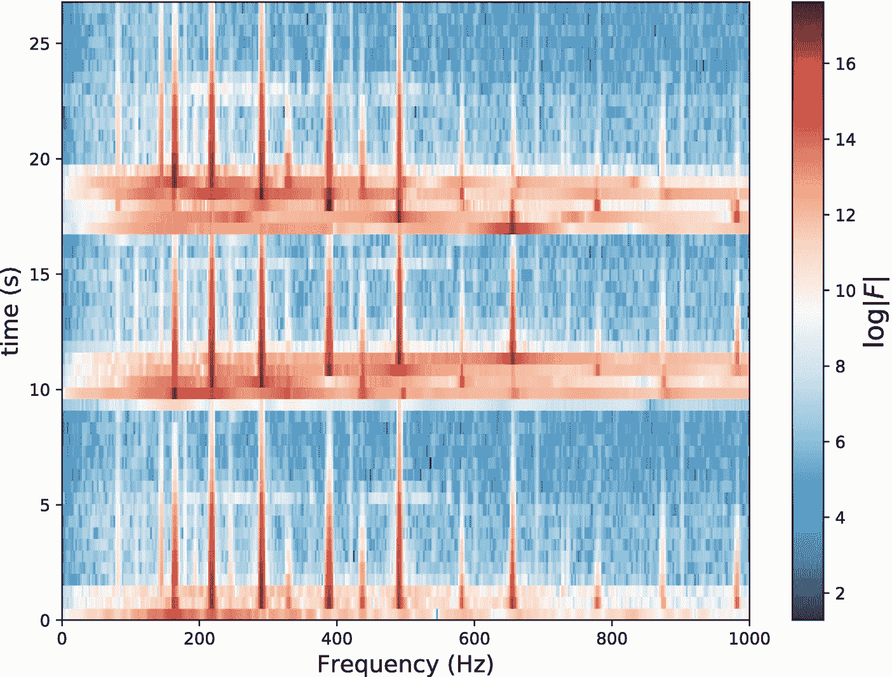

图 17-8

吉他声音的音频采样的声谱图

## 信号滤波器

信号处理的主要目标之一是操纵和变换时间或空间信号以改变它们的特性。典型的应用包括降噪、音频信号中的声音效果以及图像数据中的模糊、锐化、对比度增强和色彩平衡调整等效果。许多常见的变换可以被实现为滤波器，其作用于信号的频域表示，例如，通过抑制某些频率分量。在上一节中，我们看到了一个低通滤波器示例，我们对信号进行傅里叶变换，去除高频成分，最后进行傅里叶逆变换，以获得新的时域信号。利用这种方法，我们可以实现任意频率的滤波器，但是我们不一定要在流信号上实时应用它们，因为它们需要缓冲足够的样本，以便能够执行离散傅立叶变换。在许多应用中，例如，当处理传输中的信号或现场音频信号时，希望应用滤波器并以连续的方式变换信号。

### 卷积滤波器

使用信号与表征滤波器的函数的卷积，可以在时域中直接实现某些类型的频率滤波器。傅立叶变换的一个重要特性是两个函数(例如，信号的频谱和滤波器形状函数)乘积的(逆)傅立叶变换是两个函数(逆)傅立叶变换的卷积。因此，如果我们想要将滤波器 *H* <sub>*k*</sub> 应用于信号 *x* <sub>*n*</sub> 的频谱 *X* <sub>*k*</sub> ，我们可以改为计算 *x* <sub>*n*</sub> 与 *h* <sub>*m* 的卷积一般来说，我们可以把卷积形式的滤波器写成</sub>

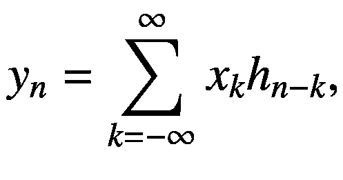

其中 *x* <sub>*k*</sub> 为输入， *y* <sub>*n*</sub> 为输出，*h*<sub>*n*—*k*</sub>为表征滤波器的卷积核。注意，在这种一般形式中，在时间步 *n* 的信号*y*T25】T26】nT28】取决于输入*x*T33】T34】kT36】的较早和较晚的值。为了说明这一点，让我们回到本章的第一个例子，我们将一个低通滤波器应用于成分为 1 Hz 和 22 Hz 的模拟信号。在本例中，我们对信号进行了傅里叶变换，并将其频谱与抑制所有高频成分的阶跃函数相乘，最后我们对信号进行了傅里叶逆变换，使其回到时域。结果是原始噪声信号的平滑版本(图 [17-3](#Fig3) )。使用卷积的另一种方法是对滤波器`H`的频率响应函数进行傅里叶逆变换，并使用结果`h`作为核心，利用该核心我们对原始时域信号`f_t`进行卷积:

```py
In [58]: t = np.linspace(0, T, N)
In [59]: f_t = signal_samples(t)
In [60]: H = abs(f) < 2
In [61]: h = fftpack.fftshift(fftpack.ifft(H))
In [62]: f_t_filtered_conv = signal.convolve(f_t, h, mode="same")

```

为了执行卷积，这里我们使用了 SciPy 中`signal`模块的`convolve`函数。它将包含要计算卷积的信号的两个 NumPy 数组作为参数。使用可选的关键字参数`mode`，我们可以将输出数组的大小设置为与第一个输入相同(`mode='same'`)，在对数组进行零填充以解决瞬态(`mode='full'`)后的完整卷积输出，或者仅包含不依赖于零填充的元素(`mode='valid'`)。这里我们使用`mode='same'`，因此我们可以很容易地将结果与原始信号`f_t`进行比较和绘图。图 [17-9](#Fig9) 显示了应用卷积滤波器`f_t_filtered_conv`的结果，以及使用`fft`和`ifft`计算出的带有修改光谱(`f_t_filtered`)的相应结果。正如所料，这两种方法给出了相同的结果。


图 17-9

左上:频率滤波器。右上:对应于频率滤波器的卷积核(其离散傅里叶逆变换)。下图:通过卷积应用的简单低通滤波器

```py
In [63]: fig = plt.figure(figsize=(8, 6))
​    ...: ax = plt.subplot2grid((2,2), (0,0))
    ...: ax.plot(f, H)
    ...: ax.set_xlabel("frequency (Hz)")
    ...: ax.set_ylabel("Frequency filter")
    ...: ax.set_ylim(0, 1.5)
    ...: ax = plt.subplot2grid((2,2), (0,1))
    ...: ax.plot(t - t[-1]/2.0, h.real)
    ...: ax.set_xlabel("time (s)")
    ...: ax.set_ylabel("convolution kernel")
    ...: ax = plt.subplot2grid((2,2), (1,0), colspan=2)
    ...: ax.plot(t, f_t, label="original", alpha=0.25)
    ...: ax.plot(t, f_t_filtered.real, 'r', lw=2, label='filtered in frequency domain')
    ...: ax.plot(t, f_t_filtered_conv.real, 'b--', lw=2, label='filtered with convolution')
    ...: ax.set_xlim(0, 10)
    ...: ax.set_xlabel("time (s)")
    ...: ax.set_ylabel("signal")
    ...: ax.legend(loc=2)

```

### f.i.r 和 iir 滤波器

在上一节的卷积滤波器示例中，使用卷积实现滤波器，而不是先调用`fft`、频谱修改，然后再调用`ifft`，在计算上没有优势。事实上，这里的卷积一般比额外的 FFT 变换要求更高，SciPy 信号模块实际上提供了一个函数调用`fftconvolve`，它使用 FFT 及其逆来实现卷积。此外，滤波器的卷积核具有许多不良特性，例如非因果性，其中输出信号取决于输入的未来值(见图 [17-9](#Fig9) 中的右上面板)。然而，也有一些重要的特殊情况，可以用专用数字信号处理器(DSP)和通用处理器有效地实现类似卷积的滤波器。这种滤波器的一个重要系列是*有限脉冲响应* (FIR)滤波器，其形式为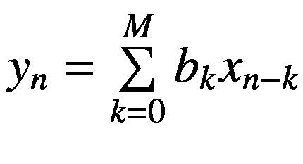。该时域滤波器是随意的，因为输出*y*T10】T11】nT13】仅取决于较早时间步长的输入值。

另一种类似类型的滤波器是*无限脉冲响应* (IIR)滤波器，可以写成的形式。这不是严格意义上的卷积，因为在计算新的输出值(反馈项)时，它还包括了*输出*的过去值，但它的形式是相似的。给定信号和输出的近期历史，FIR 和 IIR 滤波器均可用于评估新的输出值，因此，如果我们知道有限的值序列 *b* <sub>* k *</sub> 和 *a* <sub>* k *</sub> ，则可在时域中顺序评估。

给定一组滤波器特性要求，计算 *b* <sub>*k*</sub> 和 *a* <sub>*k*</sub> 的值称为滤波器设计。SciPy `signal`模块为此提供了许多功能。例如，使用`firwin`函数，我们可以计算给定频带边界频率的 FIR 滤波器的 *b* <sub>*k*</sub> 系数，其中，例如，滤波器从通滤波器过渡到截止滤波器(对于低通滤波器)。`firwin`函数将 *a* <sub>*k*</sub> 序列中值的个数作为第一个参数(在此上下文中也称为 *taps* )。第二个参数`cutoff`以奈奎斯特频率(采样速率的一半)为单位定义低通转换频率。奈奎斯特频率的比例可以选择使用`nyq`参数设置，默认为 1。最后，我们可以通过`window`参数指定窗口函数的类型。

```py
In [64]: n = 101
In [65]: f_s = 1 / 3600
In [66]: nyq = f_s/2
In [67]: b = signal.firwin(n, cutoff=nyq/12, nyq=nyq, window="hamming")

```

结果是系数序列*b*<sub>T5】k</sub>，其定义了 FIR 滤波器，并且可用于实现具有时域卷积的滤波器。给定系数 *b* <sub>*k*</sub> ，我们可以使用`signal`模块中的`freqz`函数评估滤波器的幅度和相位响应。它返回包含频率和相应复值频率响应的数组，适用于绘图目的，如图 [17-10](#Fig10) 所示。

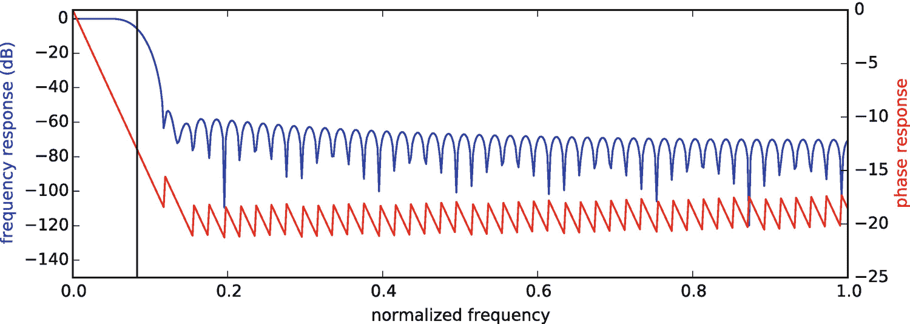

图 17-10

低通 FIR 滤波器的幅度和相位响应

```py
In [68]: f, h = signal.freqz(b)
In [69]: fig, ax = plt.subplots(1, 1, figsize=(12, 3))
    ...: h_ampl = 20 * np.log10(abs(h))
    ...: h_phase = np.unwrap(np.angle(h))
    ...: ax.plot(f/max(f), h_ampl, 'b')
    ...: ax.set_ylim(-150, 5)
    ...: ax.set_ylabel('frequency response (dB)', color="b")
    ...: ax.set_xlabel(r'normalized frequency')
    ...: ax = ax.twinx()
    ...: ax.plot(f/max(f), h_phase, 'r')
    ...: ax.set_ylabel('phase response', color="r")
    ...: ax.axvline(1.0/12, color="black")

```

图 [17-10](#Fig10) 所示的低通滤波器用于通过频率小于*f*<sub>T5】s</sub>/24(用垂直线表示)的信号，抑制高频信号成分。为了能够以 FIR 形式表示滤波器，通带和阻带之间的有限过渡区以及截止频率以上的非完美抑制是我们必须付出的代价。FIR 滤波器的精度可以通过增加系数 *b* <sub>*k*</sub> 的数量来提高，但代价是更高的计算复杂度。

给定系数 *b* <sub>*k*</sub> ，给定系数 *b* <sub>*k*</sub> 和 *a* <sub>*k*</sub> ，可以使用`signal`模块中的`lfilter`函数评估 FIR 滤波器的效果。作为第一个参数，该函数期望数组具有系数 *b* <sub>*k*</sub> ，作为第二个参数，在 IIR 滤波器的情况下，该数组具有系数 *a* <sub>*k*</sub> ，或者在 FIR 滤波器的情况下，该数组具有标量 1。该函数的第三个参数是输入信号数组，返回值是滤波器输出。例如，要将我们在前面的文本中创建的 FIR 滤波器应用于每小时测量温度的数组`temperature`，我们可以使用

```py
In [70]: temperature_filt = signal.lfilter(b, 1, temperature)

```

对信号应用低通 FIR 滤波器的效果是通过消除高频振荡来平滑函数，如图 [17-11](#Fig11) 所示。实现类似结果的另一种方法是应用移动平均滤波器，其中输出是几个附近输入值的加权平均值或中值。来自`signal`模块的函数`medfilt`应用给定输入信号的中值滤波器，使用函数的第二个参数指定的过去附近值的数量:

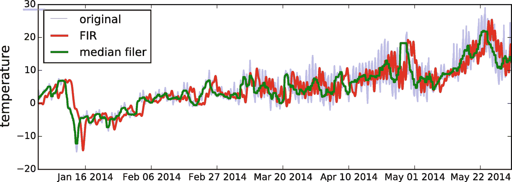

图 17-11

f.i.r 滤波器和中值滤波器的输出

```py
In [71]: temperature_median_filt = signal.medfilt(temperature, 25)

```

将 FIR 低通滤波器和中值滤波器应用于每小时温度测量数据集的结果如图 [17-11](#Fig11) 所示。注意，FIR 滤波器的输出相对于原始信号偏移了一段时间延迟，该时间延迟对应于 FIR 滤波器的抽头数。使用`medfilt`实现的中值滤波器不会遇到这个问题，因为中值是根据过去和未来的值计算的，这使它成为一个非因果滤波器，不能对流式输入数据进行动态评估。

```py
In [72]: fig, ax = plt.subplots(figsize=(8, 3))
    ...: ax.plot(df.index, temperature, label="original", alpha=0.5)
    ...: ax.plot(df.index, temperature_filt, color="red", lw=2, label="FIR")
    ...: ax.plot(df.index, temperature_median_filt, color="green", lw=2, label="median filer")
    ...: ax.set_ylabel("temperature", fontsize=14)
    ...: ax.legend(loc=0)

```

要设计 IIR 滤波器，我们可以使用信号模块中的`iirdesign`函数，或者使用许多预定义的 IIR 滤波器类型之一，包括巴特沃兹滤波器(`signal.butter`)、切比雪夫 I 型和 II 型滤波器(`signal.cheby1`和`signal.cheby2`)以及椭圆滤波器(`signal.ellip`)。例如，要创建一个巴特沃兹高通滤波器，允许高于临界频率 7/365 Hz 的频率通过，同时抑制较低频率，我们可以使用

```py
In [73]: b, a = signal.butter(2, 7/365.0, btype="high")

```

该函数的第一个参数是巴特沃兹滤波器的阶数，第二个参数是滤波器的临界频率(从带阻到带通函数)。例如，可选参数`btype`可用于指定滤波器是低通滤波器(`low`)还是高通滤波器(`high`)。函数的 docstring 中描述了更多选项:例如，参见`help(signal.butter)`。输出`a`和`b`分别是定义 IIR 滤波器的 *a* <sub>*k*</sub> 和 *b* <sub>*k*</sub> 系数。这里我们计算了一个二阶巴特沃兹滤波器，因此`a`和`b`各有三个元素:

```py
In [74]: b
Out[74]: array([ 0.95829139, -1.91658277,  0.95829139])
In [75]: a
Out[75]: array([ 1\.        , -1.91484241,  0.91832314])

```

与之前一样，我们可以将滤波器应用于输入信号(这里我们再次使用每小时的温度数据集作为示例):

```py
In [76]: temperature_iir = signal.lfilter(b, a, temperature)

```

或者，我们可以使用`filtfilt`函数应用过滤器，该函数向前和向后应用过滤器，产生一个非因果过滤器。

```py
In [77]: temperature_filtfilt = signal.filtfilt(b, a, temperature)

```

两种滤波器的结果如图 [17-12](#Fig12) 所示。消除低频分量消除了时间序列的趋势，仅保留了高频振荡和波动。因此，滤波后的信号可以被视为测量原始信号的波动性。在这个例子中，我们可以看到，与冬季的一月和二月相比，春季的三月、四月和五月的日变化更大。

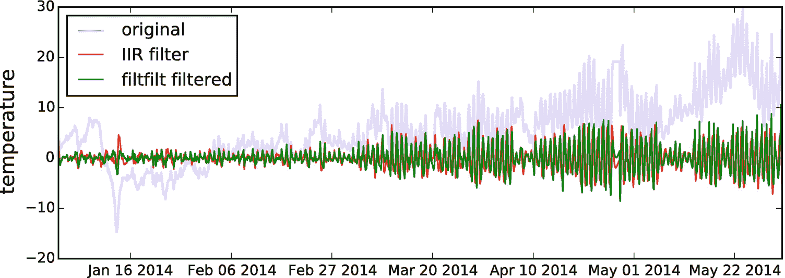

图 17-12

IIR 高通滤波器和相应 filtfilt 滤波器的输出(向前和向后应用)

```py
In [78]: fig, ax = plt.subplots(figsize=(8, 3))
    ...: ax.plot(df.index, temperature, label="original", alpha=0.5)
    ...: ax.plot(df.index, temperature_iir, color="red", label="IIR filter")
    ...: ax.plot(df.index, temperature_filtfilt, color="green", label="filtfilt filtered")
    ...: ax.set_ylabel("temperature", fontsize=14)
    ...: ax.legend(loc=0)

```

这些技术可以直接应用于音频和图像数据。例如，要对吉他样本的音频信号应用滤波器，我们可以使用使用`lfilter`功能。FIR 滤波器的系数*b*<sub>T5】k</sub>有时可以手动构建。例如，要应用一个简单的回声效果，我们可以创建一个 FIR 滤波器，以一定的时间延迟重复过去的信号:*y*<sub>*N*</sub>=*x*<sub>*N*</sub>+*x*<sub>*N*-T25【N</sub>，其中 *N* 是以时间步长为单位的时间延迟相应的系数 *b* <sub>*k*</sub> 很容易构造，并且可以应用于音频信号`data`。

```py
In [79]: b = np.zeros(10000)
    ...: b[0] = b[-1] = 1
    ...: b /= b.sum()
In [80]: data_filt = signal.lfilter(b, 1, data)

```

为了能够听到修改后的音频信号，我们可以使用 SciPy 中的`io.wavefile`模块中的`write`函数将其写入 WAV 文件:

```py
In [81]: io.wavfile.write("guitar-echo.wav", sample_rate,
    ...:                  np.vstack([data_filt, data_filt]).T.astype(np.int16))

```

类似地，我们可以使用`signal`模块中的工具实现许多类型的图像处理过滤器。SciPy 还提供了一个模块`ndimage`，它包含许多常见的图像处理函数和过滤器，专门适用于二维图像数据。Scikit-Image 库 <sup>[5](#Fn5)</sup> 为使用 Python 处理图像提供了一个更高级的框架。

## 摘要

信号处理是一个非常广泛的领域，在大多数科学和工程领域都有应用。因此，在本章中，我们只能涵盖信号处理的一些基本应用，我们将重点介绍使用 Python 计算方法以及 Python 科学计算生态系统中可用的库和工具来处理这类问题的方法。特别是，我们探索了使用快速傅立叶变换对时间相关信号进行频谱分析，以及使用 SciPy 库中的`signal`模块对信号进行线性滤波器的设计和应用。

## 进一步阅读

关于信号处理理论的全面综述，参见 Smith (1999)，也可在 [`www.dspguide.com/pdfbook.htm`](http://www.dspguide.com/pdfbook.htm) 在线查看。有关面向 Python 的信号处理讨论，请参见 Unpingco (2014)，其内容可在 [`http://nbviewer.ipython.org/github/unpingco/Python-for-Signal-Processing`](http://nbviewer.ipython.org/github/unpingco/Python-for-Signal-Processing) 的 IPython 笔记本上获得。

## 参考

史密斯(1999 年)。数字信号处理科学家和工程师指南。圣地亚哥:史蒂文·史密斯。

Unpingco，J. (2014 年)。Python 用于信号处理。纽约:斯普林格。

<aside class="FootnoteSection" epub:type="footnotes">Footnotes [1](#Fn1_source)

傅立叶变换有几种不同的定义，它们在指数系数和变换积分的归一化方面有所不同。

  [2](#Fn2_source)

NumPy 中的`fft`模块也有 FFT 的实现。它提供了与我们在这里使用的`scipy.fftpack`基本相同的功能。一般来说，当 SciPy 和 NumPy 提供相同的功能时，通常最好使用 SciPy(如果可用的话),而在 SciPy 不可用时则使用 NumPy 实现。

  [3](#Fn3_source)

其他几个窗口功能也是可用的。完整列表见`scipy.signal`模块的文档字符串。

  [4](#Fn4_source)

本例中使用的数据来自 [`https://www.freesound.org/people/guitarguy1985/sounds/52047`](https://www.freesound.org/people/guitarguy1985/sounds/52047) `.`

  [5](#Fn5_source)

更多信息见项目网页 [`http://scikit-image.org`](http://scikit-image.org) 。

 </aside>