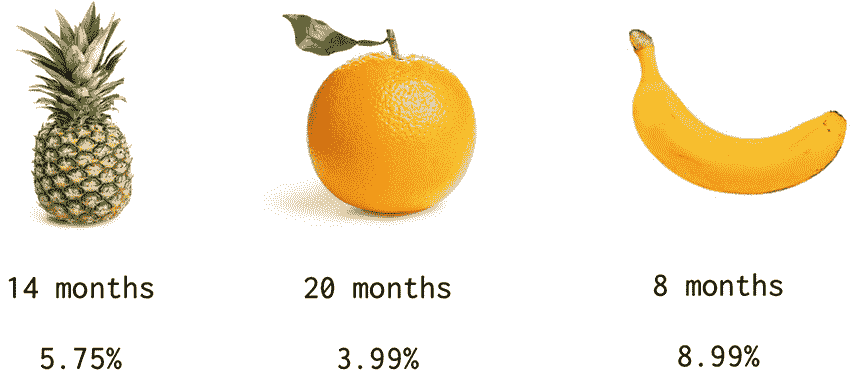
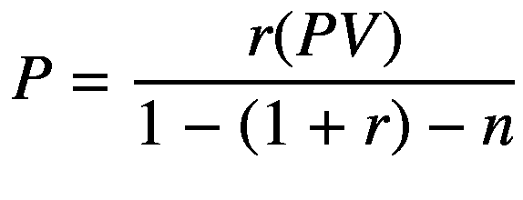
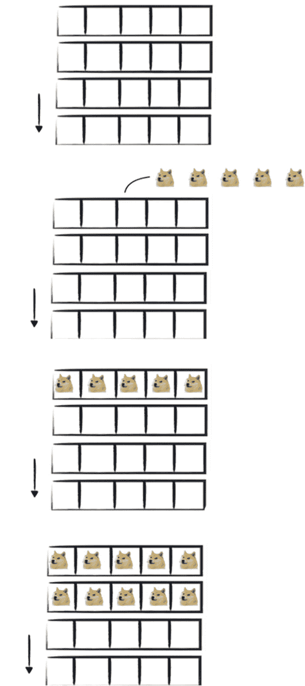

# 四、分期

> 是啊，我有工资，我没有债务(哈)。
> 
> -敌人

我个人厌恶债务。似乎很多千禧一代都这样。即使我试图避免它，我也能意识到债务可以是一个神奇的工具，如果(当)它被正确使用的话。只是…大部分人都没有正确使用。

在我看来，当你买了不能帮你摆脱债务的东西时，债务就被错误地使用了。假期就是一个很好的例子。然而，如果你负债去买一些能推动你前进并帮助你偿还的东西，债务会变得非常强大。

几章前我们谈到了 Dogecoin 采矿。这个例子隐含着花钱赚钱的概念。本章假设一台像样的采矿钻机将花费我们大约 3，000 加元(或者如我们在前一章所学，大约 2，341 美元)。大多数人都没有那么多钱。

如果你的名下只有几百美元，玩 Dogecoin 游戏是不可能的，当然，除非你决定负债。

(如果此时你已经厌倦了 Dogecoin，就假装你需要 3000 美元买一台新笔记本电脑！)

快速声明:债务是一个超级复杂的话题。为了缩小本书的关注范围，我们将只探讨个人贷款。

## 班克斯



当涉及到个人贷款的总利息时，银行通常会混淆细节。

假设我们需要 3000 美元来购买 Dogecoin 装备。我们货比三家，从菠萝帝国银行、桔子国民银行和香蕉自治领银行得到了三个可行的选择。

当然，我们的决定将取决于我们实际能够负担的每月付款额；然而，让我们暂时避开这种约束，在完全感兴趣的基础上评估事情。

以下是选择:菠萝帝国提供 3000 美元，利率为 5.75%，为期 14 个月。Orange National 将以 3.99%的利率支付 3000 美元，期限为 20 个月。香蕉自治领准备以 8.99%的利率借给我们 8 个月的贷款。请注意，每家银行只列出期限和利率。

如果期限都是一样的，橙色国家将是一个显而易见的。但是考虑到每个选项都有不同的期限，我们该如何选择呢？为了找出哪种选择在总利息成本的基础上是最便宜的，我们需要求助于分期计划。

## [会计]分期偿还

*分期偿还时间表*是一个表格，详细列出了分期偿还贷款(如个人贷款)的每笔定期付款。*分期*指的是通过定期付款在一段时间内还清贷款的过程。在分期偿还贷款中，每笔还款的一部分用于支付利息，而剩余部分则用于抵消本金余额。

## 支付

因为这三个选项都是固定还款额的个人贷款，我们可以用下面的公式计算每月还款额:



where:

```py
P = Payment
PV = Present value (the loan)
r = Rate per period
n = Number of periods

```

如果我们使用菠萝帝国贷款开始，我们可以应用 Python 中的付款公式，代码块如下:

```py
loan = 3000.00
rate = 0.0575
term = 14

payment = loan * (rate / 12) / (1 - (1 + (rate / 12))**(-term))
print(round(payment, 2))

222.07

```

有几件事需要注意。首先，双星号(`**`)是幂运算的 Python 符号。第二，我们把(利率)除以 12 是因为大多数银行是按月收取利息的(而一年有 12 个月)。

如果你不想记住分期偿还贷款的支付公式，numpy 有一个方便的`pmt`函数可以帮你做到。

```py
import numpy as np

payment = np.round(-np.pmt(rate/12, term, loan), 2)
print(payment)

222.07

```

## 循环 A

计算出付款后，我们可以在 Pandas 数据框架的基础上建立一个分期偿还计划。首先，让我们实例化计划的第一行。

```py
import pandas as pd

balance = loan
df = pd.DataFrame({
    'month': [0],
    'payment': [np.NaN],
    'interest': [np.NaN],
    'principal': [np.NaN],
    'balance': [balance]
})
print(df)

   balance  interest  month  payment  principal
0   3000.0       NaN      0      NaN        NaN

```

虽然第一行(在索引 0 处)的余额设置为借款金额，但利息、付款和本金(剩余)都设置为 NaN(不是一个数字)，因为贷款付款在整整一个月后生效。

实例化数据框架后，我们现在可以通过运行以下命令来计算第一次付款的利息和本金部分:

```py
interest = round(rate/12 * balance, 2)
principal = payment - interest
balance = balance - principal

print(interest)
print(principal)
print(balance)

14.38
207.69
2792.31

```

为了按顺序为每笔付款执行这些计算，我们可以将逻辑封装在一个循环中，并将计算出的值附加到已经填写了月份 0 的`df`对象。

<colgroup><col class="tcol1 align-left"> <col class="tcol2 align-left"> <col class="tcol3 align-left"> <col class="tcol4 align-left"> <col class="tcol5 align-left"> <col class="tcol6 align-left"></colgroup> 
|   | 

月

 | 

支付

 | 

兴趣

 | 

主要的

 | 

平衡

 |
| --- | --- | --- | --- | --- | --- |
| Zero | Zero | 圆盘烤饼 | 圆盘烤饼 | 圆盘烤饼 | Three thousand |
| one | one | Two hundred and twenty-two point zero seven | Fourteen point three eight | Two hundred and seven point six nine | Two thousand seven hundred and ninety-two point three one |
| Two | Two | Two hundred and twenty-two point zero seven | Thirteen point three eight | Two hundred and eight point six nine | Two thousand five hundred and eighty-three point six two |
| three | three | Two hundred and twenty-two point zero seven | Twelve point three eight | Two hundred and nine point six nine | Two thousand three hundred and seventy-three point nine three |
| four | four | Two hundred and twenty-two point zero seven | Eleven point three eight | Two hundred and ten point six nine | Two thousand one hundred and sixty-three point two four |
| five | five | Two hundred and twenty-two point zero seven | Ten point three seven | Two hundred and eleven point seven | One thousand nine hundred and fifty-one point five four |
| six | six | Two hundred and twenty-two point zero seven | Nine point three five | Two hundred and twelve point seven two | One thousand seven hundred and thirty-eight point eight two |
| seven | seven | Two hundred and twenty-two point zero seven | Eight point three three | Two hundred and thirteen point seven four | One thousand five hundred and twenty-five point zero eight |
| eight | eight | Two hundred and twenty-two point zero seven | Seven point three one | Two hundred and fourteen point seven six | One thousand three hundred and ten point three two |
| nine | nine | Two hundred and twenty-two point zero seven | Six point two eight | Two hundred and fifteen point seven nine | One thousand and ninety-four point five three |
| Ten | Ten | Two hundred and twenty-two point zero seven | Five point two four | Two hundred and sixteen point eight three | Eight hundred and seventy-seven point seven |
| Eleven | Eleven | Two hundred and twenty-two point zero seven | Four point two one | Two hundred and seventeen point eight six | Six hundred and fifty-nine point eight four |
| Twelve | Twelve | Two hundred and twenty-two point zero seven | Three point one six | Two hundred and eighteen point nine one | Four hundred and forty point nine three |
| Thirteen | Thirteen | Two hundred and twenty-two point zero seven | Two point one one | Two hundred and nineteen point nine six | Two hundred and twenty point nine seven |
| Fourteen | Fourteen | Two hundred and twenty-two point zero seven | One point zero six | Two hundred and twenty-one point zero one | -0.04 |

```py
balance = loan

for i in range(1, term + 1):
    interest = round(rate/12 * balance, 2)
    principal = payment - interest
    balance = balance - principal

    df = df.append(
        pd.DataFrame({
            'month': [i],
            'payment': [payment],
            'interest': [interest],
            'principal': [principal],
            'balance': [balance]
        })
    )

df = df.reset_index(drop=True)
df[['month', 'payment', 'interest', 'principal', 'balance']]

```

耶，我们的分期偿还逻辑成功了！(我们还差几便士，但没关系，因为我们必须将付款四舍五入到小数点后两位，因为没有分数便士这种东西。)

虽然我们刚刚成功地在 Python 和 pandas 中构建了一个分期偿还计划，但是我们使用的循环策略并不是非常高效。

我们刚刚做的基本上是这样的:


当我们只需要遍历几个项目时，将行追加到行上是很好的，但是如果面对几十万(甚至几百万)行，事情会变得非常缓慢。

## 环路 B

构建循环分期偿还计划的另一种方法(也是更有效的方法)是在迭代之前构建我们需要的所有行，而不是在运行时追加它们。

在开始时构建一切(或预分配空间)可以让我们实现一些非常难以置信的速度提升，看起来就像这样:



对于所有预构建的行，我们基本上在计算它们时用值填充它们。

调整我们的代码以适应这种预分配模式是相当容易的。我们所要做的就是构建一个 5 列 15 行的空数据帧(15 行，因为这个例子需要 14 个月加上第 0 个月)。

```py
balance = loan
index = range(0, term + 1)
columns = ['month', 'payment', 'interest', 'principal', 'balance']
df = pd.DataFrame(index=index, columns=columns)

```

实例化第一行可以用 pandas 的`.iloc`方法来实现。

```py
df.iloc[0]['month'] = 0
df.iloc[0]['balance'] = balance

```

运行实际循环是通过每列的`df.iloc[i][COLUMN]`来完成的。

我提前停止了循环，这样我们可以看到每一步发生了什么。

<colgroup><col class="tcol1 align-left"> <col class="tcol2 align-left"> <col class="tcol3 align-left"> <col class="tcol4 align-left"> <col class="tcol5 align-left"> <col class="tcol6 align-left"></colgroup> 
|   | 

月

 | 

支付

 | 

兴趣

 | 

主要的

 | 

平衡

 |
| --- | --- | --- | --- | --- | --- |
| Zero | Zero | 圆盘烤饼 | 圆盘烤饼 | 圆盘烤饼 | Three thousand |
| one | one | Two hundred and twenty-two point zero seven | Fourteen point three eight | Two hundred and seven point six nine | Two thousand seven hundred and ninety-two point three one |
| Two | Two | Two hundred and twenty-two point zero seven | Thirteen point three eight | Two hundred and eight point six nine | Two thousand five hundred and eighty-three point six two |
| three | three | Two hundred and twenty-two point zero seven | Twelve point three eight | Two hundred and nine point six nine | Two thousand three hundred and seventy-three point nine three |
| four | four | Two hundred and twenty-two point zero seven | Eleven point three eight | Two hundred and ten point six nine | Two thousand one hundred and sixty-three point two four |
| five | five | Two hundred and twenty-two point zero seven | Ten point three seven | Two hundred and eleven point seven | One thousand nine hundred and fifty-one point five four |
| six | six | Two hundred and twenty-two point zero seven | Nine point three five | Two hundred and twelve point seven two | One thousand seven hundred and thirty-eight point eight two |
| seven | seven | Two hundred and twenty-two point zero seven | Eight point three three | Two hundred and thirteen point seven four | One thousand five hundred and twenty-five point zero eight |
| eight | eight | Two hundred and twenty-two point zero seven | Seven point three one | Two hundred and fourteen point seven six | One thousand three hundred and ten point three two |
| nine | nine | Two hundred and twenty-two point zero seven | Six point two eight | Two hundred and fifteen point seven nine | One thousand and ninety-four point five three |
| Ten | Ten | Two hundred and twenty-two point zero seven | Five point two four | Two hundred and sixteen point eight three | Eight hundred and seventy-seven point seven |
| Eleven | 圆盘烤饼 | 圆盘烤饼 | 圆盘烤饼 | 圆盘烤饼 | 圆盘烤饼 |
| Twelve | 圆盘烤饼 | 圆盘烤饼 | 圆盘烤饼 | 圆盘烤饼 | 圆盘烤饼 |
| Thirteen | 圆盘烤饼 | 圆盘烤饼 | 圆盘烤饼 | 圆盘烤饼 | 圆盘烤饼 |
| Fourteen | 圆盘烤饼 | 圆盘烤饼 | 圆盘烤饼 | 圆盘烤饼 | 圆盘烤饼 |

```py
for i in range(1, 11):
    interest = round(rate/12 * balance, 2)
    principal = payment - interest
    balance = balance - principal

    df.iloc[i]['month'] = i
    df.iloc[i]['payment'] = payment
    df.iloc[i]['interest'] = interest
    df.iloc[i]['principal'] = principal
    df.iloc[i]['balance'] = balance

df

```

在指数 10 处，贷款的剩余余额是 877 美元，我们还有四笔还款要还。如果不在`range(1, 11)`截断循环，分期计划将继续运行到第 14 个月，并将生成与之前相同的计划。

## 功能化

现在我们已经组装了有效的分期偿还逻辑，让我们将代码包装到一个名为`am`的函数中。

```py
def am(loan, rate, term):

    payment = np.round(-np.pmt(rate/12, term, loan), 2)
    balance = loan

    index = range(0, term + 1)
    columns = ['month', 'payment', 'interest', 'principal', 'balance']
    df = pd.DataFrame(index=index, columns=columns)

    df.iloc[0]['month'] = 0
    df.iloc[0]['balance'] = balance

    for i in range(1, term + 1):
        interest = round(rate/12 * balance, 2)
        principal = payment - interest
        balance = balance - principal

        df.iloc[i]['month'] = i
        df.iloc[i]['payment'] = payment
        df.iloc[i]['interest'] = interest
        df.iloc[i]['principal'] = principal
        df.iloc[i]['balance'] = balance

    return df

```

## 评价

定义了`am`之后，我们可以在菠萝帝国(5.75%，14 个月)、Orange National(3.99%，20 个月)和 Banana Dominion(8.99%，8 个月)贷款的基础上运行函数，而不用重复自己的操作。

```py
loan = 3000
pineapple = am(loan, 0.0575, 14)
orange = am(loan, 0.0399, 20)
banana = am(loan, 0.0889, 8)

```

仔细查看其中一个时间表，我们可以看到一切都在按预期进行。

<colgroup><col class="tcol1 align-left"> <col class="tcol2 align-left"> <col class="tcol3 align-left"> <col class="tcol4 align-left"> <col class="tcol5 align-left"> <col class="tcol6 align-left"></colgroup> 
|   | 

月

 | 

支付

 | 

兴趣

 | 

主要的

 | 

平衡

 |
| --- | --- | --- | --- | --- | --- |
| Zero | Zero | 圆盘烤饼 | 圆盘烤饼 | 圆盘烤饼 | Three thousand |
| one | one | One hundred and fifty-five point two nine | Nine point nine seven | One hundred and forty-five point three two | Two thousand eight hundred and fifty-four point six eight |
| Two | Two | One hundred and fifty-five point two nine | Nine point four nine | One hundred and forty-five point eight | Two thousand seven hundred and eight point eight eight |
| three | three | One hundred and fifty-five point two nine | Nine point zero one | One hundred and forty-six point two eight | Two thousand five hundred and sixty-two point six |
| four | four | One hundred and fifty-five point two nine | Eight point five two | One hundred and forty-six point seven seven | Two thousand four hundred and fifteen point eight three |
| five | five | One hundred and fifty-five point two nine | Eight point zero three | One hundred and forty-seven point two six | Two thousand two hundred and sixty-eight point five seven |
| six | six | One hundred and fifty-five point two nine | Seven point five four | One hundred and forty-seven point seven five | Two thousand one hundred and twenty point eight two |
| seven | seven | One hundred and fifty-five point two nine | Seven point zero five | One hundred and forty-eight point two four | One thousand nine hundred and seventy-two point five eight |
| eight | eight | One hundred and fifty-five point two nine | Six point five six | One hundred and forty-eight point seven three | One thousand eight hundred and twenty-three point eight five |
| nine | nine | One hundred and fifty-five point two nine | Six point zero six | One hundred and forty-nine point two three | One thousand six hundred and seventy-four point six two |
| Ten | Ten | One hundred and fifty-five point two nine | Five point five seven | One hundred and forty-nine point seven two | One thousand five hundred and twenty-four point nine |
| Eleven | Eleven | One hundred and fifty-five point two nine | Five point zero seven | One hundred and fifty point two two | One thousand three hundred and seventy-four point six eight |
| Twelve | Twelve | One hundred and fifty-five point two nine | Four point five seven | One hundred and fifty point seven two | One thousand two hundred and twenty-three point nine six |
| Thirteen | Thirteen | One hundred and fifty-five point two nine | Four point zero seven | One hundred and fifty-one point two two | One thousand and seventy-two point seven four |
| Fourteen | Fourteen | One hundred and fifty-five point two nine | Three point five seven | One hundred and fifty-one point seven two | Nine hundred and twenty-one point zero two |
| Fifteen | Fifteen | One hundred and fifty-five point two nine | Three point zero six | One hundred and fifty-two point two three | Seven hundred and sixty-eight point seven nine |
| Sixteen | Sixteen | One hundred and fifty-five point two nine | Two point five six | One hundred and fifty-two point seven three | Six hundred and sixteen point zero six |
| Seventeen | Seventeen | One hundred and fifty-five point two nine | Two point zero five | One hundred and fifty-three point two four | Four hundred and sixty-two point eight two |
| Eighteen | Eighteen | One hundred and fifty-five point two nine | One point five four | One hundred and fifty-three point seven five | Three hundred and nine point zero seven |
| Nineteen | Nineteen | One hundred and fifty-five point two nine | One point zero three | One hundred and fifty-four point two six | One hundred and fifty-four point eight one |
| Twenty | Twenty | One hundred and fifty-five point two nine | Zero point five one | One hundred and fifty-four point seven eight | Zero point zero three |

```py
orange

```

因为每个对象都是 pandas 数据框架中的分期偿还计划，所以我们可以像这样访问利息列:

```py
banana['interest']
0      NaN
1    22.23
2    19.52
3    16.79
4    14.04
5    11.28
6     8.49
7     5.68
8     2.85
Name: interest, dtype: object

```

我们通过调用`.sum()`来总结一切。

```py
banana['interest'].sum()

100.88

```

我们合计每笔贷款的利息。

```py
print(banana['interest'].sum())
print(orange['interest'].sum())
print(pineapple['interest'].sum())

100.88
105.82999999999997
108.93999999999998

```

我们可以看到，香蕉自治领银行贷款是最划算的(如果我们所说的“划算”是指支付的利息最少的话)。

然而，重要的是要注意，香蕉自治领期权的月供比橙色国家贷款多得多。正因为如此，我们可能会认为额外的 5 美元是值得的，因为这最终会减少每月的负担。

## 结论

我漫不经心地放弃了你应该在可能的情况下预先分配的想法，并期望你坚定地相信我。没有证据千万不要相信任何人！

如果你想看看循环 B 比循环 A 快多少，你可以对这个函数运行一些`%%timeit` Jupyter 魔法。

```py
%%timeit

am(3000, 0.0575, 14)

6.9 ms ± 877 μs per loop (mean ± std. dev. of 7 runs, 100 loops each)

```

不幸的是，我们从未将循环 A 的逻辑封装到函数中。所以，就当是作业吧！一旦你函数化了循环 A，你就可以在它上面运行同样的`%%timeit`魔法，亲自看看速度的差别。

试着排几排，然后再排几排。随着行数的增加，速度差异变得难以置信！