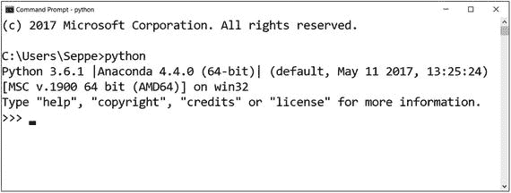
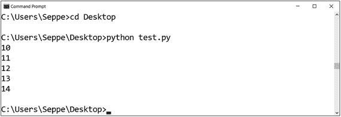

# 一、简介

在这一章中，我们将向您介绍网络搜集的概念，并强调为什么这种做法对数据科学家有用。在举例说明了 web 抓取在各个领域和行业中的一些有趣的最新使用案例之后，我们确保您已经准备好了编程环境，可以开始使用 web 抓取了。

## 1.1 什么是网页抓取？

Web“抓取”(也称为“web 收获”、“web 数据提取”，甚至“web 数据挖掘”)可以定义为“以自动化方式从 web 下载、解析和组织数据的代理的构造”。或者，换句话说:不是人类终端用户在网络浏览器中点击鼠标，然后将感兴趣的部分复制粘贴到电子表格中，而是网络抓取将这项任务卸载到计算机程序中，该程序可以比人类更快、更正确地执行这项任务。

从互联网上自动收集数据的历史可能和互联网本身一样悠久，而术语“抓取”的历史比网络还要长。在“网络抓取”作为一个术语变得流行起来之前，一种被称为“屏幕抓取”的实践已经作为一种从视觉表示中提取数据的方式得到了很好的确立——在计算的早期(想想 20 世纪 60-80 年代)，视觉表示通常可以归结为简单的、基于文本的“终端”就像今天一样，当时的人们也对从这样的终端上“抓取”大量文本并存储这些数据以备后用感兴趣。

### 1.1.1 为什么要对数据科学进行 Web 抓取？

当使用普通的 web 浏览器在网上冲浪时，您可能会遇到多个站点，在这些站点中，您会考虑收集、存储和分析站点页面上显示的数据的可能性。特别是对于数据科学家来说，他们的“原材料”是数据，网络暴露了许多有趣的机会:

*   在一个维基百科页面(或多个页面)上可能有一个有趣的表格，您想要检索它来执行一些统计分析。
*   也许你想从一个电影网站获得一个评论列表来执行文本挖掘，创建一个推荐引擎，或者建立一个预测模型来识别虚假评论。
*   您可能希望获得一个房地产网站上的属性列表，以构建一个有吸引力的地理可视化。
*   您希望基于在 web 上找到的信息收集附加要素来丰富您的数据集，例如，用于预测软饮料销售的天气信息。
*   你可能想知道如何使用网络论坛上的个人资料进行社交网络分析。
*   监视一个新闻站点，寻找关于感兴趣的特定主题的新故事趋势，这可能是很有趣的。

网络包含大量有趣的数据源，为各种有趣的事物提供了宝库。遗憾的是，当前网络的非结构化本质并不总是能让收集或导出这些数据变得容易。Web 浏览器非常擅长以视觉上吸引人的方式显示图像、显示动画和布局网站，但是它们没有公开导出数据的简单方法，至少在大多数情况下没有。比起通过浏览器的窗口一页一页地浏览网页，能够自动收集丰富的数据集不是很好吗？这正是网络抓取进入画面的地方。

如果你对网络有点了解，你可能会想:“这不正是应用编程接口(API)的用途吗？”事实上，如今许多网站都提供了这样的 API，它为外部世界以结构化的方式访问他们的数据存储库提供了一种手段——这意味着由计算机程序而不是人类来消费和访问(当然，尽管这些程序是由人类编写的)。例如，Twitter、脸书、LinkedIn 和 Google 都提供了这样的 API 来搜索和发布推文，获取你的朋友和他们的好友列表，查看你和谁联系，等等。那么，为什么我们还需要网络抓取呢？关键是 API 是访问数据源的好方法，前提是手头的网站提供了一个 API，并且 API 公开了您想要的功能。一般的经验法则是先寻找一个 API，如果可以的话就使用它，然后再开始构建一个 web scraper 来收集数据。例如，你可以很容易地使用 Twitter 的 API 来获得最近的推文列表，而不是自己重新发明轮子。尽管如此，仍然有各种各样的原因说明为什么 web 抓取比使用 API 更好:

*   您要从中提取数据的网站不提供 API。
*   提供的 API 不是免费的(而网站是免费的)。
*   提供的 API 是有速率限制的:这意味着你每秒、每天只能访问它一定的次数…
*   API 不会公开您希望获得的所有数据(而网站会)。

在所有这些情况下，web 抓取的使用可能会派上用场。事实是，如果你能在你的网络浏览器中查看一些数据，你就能通过一个程序访问和检索这些数据。如果您可以通过程序访问它，那么数据就可以以任何方式存储、清理和使用。

### 1.1.2 谁在使用网页抓取？

在 web 上访问和收集数据有许多实际应用，其中许多属于数据科学领域。下面的列表概括了一些有趣的真实使用案例:

*   谷歌的许多产品都受益于谷歌的核心业务——抓取网页。例如，谷歌翻译利用储存在网络上的文本来训练和改进自己。
*   在人力资源和员工分析中，抓取被大量应用。总部位于旧金山的 hiQ 初创公司专门通过收集和检查公开的个人资料信息来出售员工分析，例如，来自 LinkedIn 的信息(LinkedIn 对此很不高兴，但迄今无法在一场诉讼后阻止这种做法；见 [`https://www.bloomberg.com/news/features/2017-11-15/the-brutal-fight-to-mine-your-data-and-sell-it-to-your-boss`](https://www.bloomberg.com/news/features/2017-11-15/the-brutal-fight-to-mine-your-data-and-sell-it-to-your-boss) )。
*   数字市场商人和数字艺术家经常将来自网络的数据用于各种有趣和创造性的项目。例如，Jonathan Harris 和 Sep Kamvar 的“我们感觉很好”搜索了各种博客网站，寻找以“我感觉”开头的短语，其结果可以可视化世界一整天的感觉。
*   在另一项研究中，从 Twitter、博客和其他社交媒体上收集的信息被用来构建一个数据集，该数据集用于建立一个预测模型，以识别抑郁症和自杀想法的模式。这对援助提供者来说可能是一个无价的工具，尽管它当然也保证了对隐私相关问题的全面考虑(见 [`https://www.sas.com/en_ca/insights/articles/analytics/using-big-data-to-predictsuicide-risk-canada.html`](https://www.sas.com/en_ca/insights/articles/analytics/using-big-data-to-predictsuicide-risk-canada.html) )。
*   Emmanuel Sales 也在 Twitter 上发帖，不过他的目标是搞清楚自己的社交圈和帖子的时间线(见 [`https://emsal.me/blog/4`](https://emsal.me/blog/4) )。这里一个有趣的观察是，作者首先考虑使用 Twitter 的 API，但发现“Twitter 严重限制这样做:如果你想获得用户的关注列表，那么你每 15 分钟只能这样做 15 次，这很难操作。”
*   在一篇题为“十亿价格项目:利用网上价格进行测量和研究”(见 [`http://www.nber.org/papers/w22111`](http://www.nber.org/papers/w22111) )的论文中，网络搜集被用来收集一组网上价格信息，这些信息被用来为多个国家构建一个稳健的每日价格指数。
*   银行和其他金融机构正在使用网络搜集进行竞争对手分析。例如，银行经常搜索竞争对手的网站，以了解在哪里开设或关闭分行，或者跟踪提供的贷款利率——所有这些都是有趣的信息，可以纳入他们的内部模型和预测。例如，投资公司也经常使用网络抓取来跟踪有关其投资组合中资产的新闻文章。
*   社会政治科学家正在搜索社交网站，以跟踪人口情绪和政治取向。一篇名为“剖析特朗普最狂热的在线追随者”(见 [`https://fivethirtyeight.com/features/dissecting-trumps-most-rabid-online-following/`](https://fivethirtyeight.com/features/dissecting-trumps-most-rabid-online-following/) )的著名文章使用语义分析来分析用户在 Reddit 上的讨论，以描述唐纳德·特朗普的在线追随者和粉丝。
*   一名研究人员能够根据从 Tinder 和 Instagram 收集的图像以及它们的“喜欢”来训练一个深度学习模型，以预测一张图像是否会被认为是“有吸引力的”(见 [`http://karpathy.github.io/2015/10/25/selfie/`](http://karpathy.github.io/2015/10/25/selfie/) )。智能手机制造商已经在他们的照片应用程序中加入了这种模型，以帮助你刷照片。
*   在《戴砖耳环的女孩》中，卢卡斯·沃特曼开始从 [`https://www.bricklink.com`](https://www.bricklink.com) 中收集乐高积木信息，以确定乐高积木的最佳选择(参见 [`http://lucaswoltmann.de/art'n'img/2017/04/08/the-girl-with-the-brick-earring.html`](http://lucaswoltmann.de/art'n'img/2017/04/08/the-girl-with-the-brick-earring.html) )来代表一个图像(这本书的合著者之一是一个狂热的乐高迷，所以我们不得不包括这个例子)。
*   在“用 Python 分析 1000 多种希腊葡萄酒”中，Florents Tselai 从一家希腊葡萄酒商店搜集了 1000 种葡萄酒的信息(参见 [`https://tselai.com/greek-wines-analysis.html`](https://tselai.com/greek-wines-analysis.html) )来分析它们的原产地、等级、类型和强度(这本书的合著者之一是一个狂热的葡萄酒爱好者，所以我们不得不包括这个例子)。
*   总部位于伦敦的在线时尚市场 Lyst 从网上搜集关于时尚产品的半结构化信息，然后应用机器学习从一个中心网站向消费者清晰而优雅地展示这些信息。其他数据科学家也做过类似的项目，对类似的时尚产品进行聚类(见 [`http://talks.lystit.com/dsl-scraping-presentation/`](http://talks.lystit.com/dsl-scraping-presentation/) )。
*   我们监督了一项研究，其中使用网络抓取从工作网站提取信息，以了解不同数据科学和分析相关工具在工作场所的受欢迎程度(剧透:Python 和 R 都在稳步上升)。
*   我们研究小组的另一项研究涉及使用网络抓取来监控新闻媒体和网络论坛，以跟踪公众对比特币的看法。

无论你感兴趣的领域是什么，几乎总有一个基于数据的用例来改进或丰富你的实践。俗话说“数据是新的石油”，网络上有很多数据。

## 1.2 准备就绪

### 1.2.1 设置

我们将在整本书中使用 Python 3。您可以从 [`https://www.python.org/downloads/`](https://www.python.org/downloads/) 下载并安装适用于您的平台(Windows、Linux 或 MacOS)的 Python 3。

Why Python 3 and Not 2?

按照 Python 的创造者自己的说法，“Python 2 是遗产，Python 3 是语言的现在和未来。”因为我们努力提供一个现代的指南，我们特意选择 Python 3 作为我们的工作语言。也就是说，仍然有很多 Python 2 代码(甚至可能在您的组织中)。如果您在 Python 2 代码中添加以下 import 语句，本书中提供的大多数概念和示例在 Python 2 中也应该适用:

```py
from __future__ import absolute_import, division, print_function

```

您还需要安装 Python 的包管理器“pip”。如果您已经安装了 Python 3 的最新版本，那么它已经安装了 pip。但是，最好通过在命令行上执行以下命令来确保 pip 是最新的:

```py
python -m pip install -U pip

```

或者(如果您使用的是 Linux 或 MacOS):

```py
pip install -U pip

```

Manually Installing pip

你的系统还没有问题吗？参考以下页面将其安装到您的系统中(在“使用 get-pip.py 安装”下): [`https://pip.pypa.io/en/stable/installing/`](https://pip.pypa.io/en/stable/installing/) 。

最后，您可能还希望在系统上安装一个合适的文本编辑器来编辑 Python 代码文件。Python 已经内置了一个基本的编辑器(在你的程序菜单中查找“Idle”)，但是其他的文本编辑器，比如 Notepad++、Sublime Text、VSCode、Atom 和其他的都工作得很好。

### 1.2.2 快速 Python 入门

我们假设您已经有一些编程经验，并且可能已经对阅读和编写 Python 代码有所熟悉。如果没有，下面的概述会让你快速上手。

Python 代码可以通过两种方式编写和执行:

1.  通过使用 Python 解释器 REPL(“read-eval-print-loop”)，它提供了一个交互式会话，您可以在其中逐行输入 Python 命令(read)，这些命令将被计算(eval)，显示结果(print)。这些步骤会重复进行(“循环”)，直到您关闭会话。
2.  通过键入 Python 源代码。py”文件，然后运行它们。

事实上，对于任何用例来说，使用适当的。py”文件并运行这些文件，尽管 Python REPL 在测试一个快速的想法或用几行代码进行实验时非常方便。要启动它，只需在命令行窗口中输入“python”并按回车键，如图 [1-1](#Fig1) 所示。



图 1-1

Opening the Python interpreter from the command line

三个尖括号("> > >")表示提示，意味着 Python REPL 正在等待您的命令。尝试执行以下命令:

```py
>>> 1 + 1
2
>>> 8 - 1
7
>>> 10 * 2
20
>>> 35 / 5
7.0
>>> 5 // 3
1
>>> 7 % 3
1
>>> 2 ** 3
8

```

数学像你预期的那样工作；“//”表示整数除法；“%”是模运算符，它返回除法运算后的余数；“**”的意思是“提升到...的能力”

Python 支持以下数字类型:

*   整数(“int”)，表示有符号的整数值(即非十进制数)，如 10、100、-700 等。
*   长整数(“Long”)，表示有符号的整数值比标准整数占用更多的内存，因此允许更大的数字。它们的写法是在末尾加一个“L”，比如 535633629843L，10L，-100000000L 等等。
*   浮点值(“float”)，即十进制数，如 0.4，-10.2 等。
*   复数(“复数”)，在非数学代码中使用不多。它们的写法是在末尾加一个“j”，例如 3.14j，. 876j 等等。

除了数字，Python 还支持字符串(“str”):用双引号或单引号括起来的文本值，以及布尔(“bool”)逻辑值:“True”和“False”(注意大写)。“无”代表表示虚无的特殊值。尝试下面几行代码来处理这些类型:

```py
>>> 'This is a string value'
'This is a string value'
>>> "This is also a string value"
'This is also a string value'
>>> "Strings can be " + 'added'
'Strings can be added'
>>> "But not to a number: " + 5
Traceback (most recent call last):
 File "<stdin>", line 1, in <module>
TypeError: must be str, not int
>>> "So we convert it first: " + str(5)
'So we convert it first: 5'
>>> False and False
False
>>> False or True
True
>>> not False
True
>>> not True
False
>>> not False and True
True
>>> None + 5
Traceback (most recent call last):
  File "<stdin>", line 1, in <module>
TypeError: unsupported operand type(s)
  for +: 'NoneType' and 'int'
>>> 4 < 3 # > also works
False
>>> 100 >= 10 # <= also works
True
>>> 10 == 10
True
>>> None == False
False
>>> False == 0
True
>>> True == 1
True
>>> True == 2
False
>>> 2 != 3
True
>>> 2 != '2'
True

```

同样，上面的说明应该是不言自明的，除了最后几行。在 Python 中，“==”表示相等比较，因此结果返回 True 或 False。None 既不等于 False 也不等于 True 本身，但在 Python 中 False 被认为等于零(0)，True 被认为等于一(1)。请注意，等式和不等式运算符(" == "和"！= ")一定要考虑正在比较的类型；因此，数字 2 不等于字符串“2”

Is “Is” Equal to “==”?

除了“==”之外，Python 还提供了“is”关键字，如果两个变量指向同一个对象(因此它们的内容也总是相等)，该关键字将返回 True。" == "检查两个变量的内容是否相等，即使它们可能不指向同一个对象。一般来说，“==”是您想要使用的，除了一些例外，即检查变量是否等于 True、False 或 None。所有以此为值的变量都将指向内存中的同一个对象，这样你就可以不用写`my_var == None`而是写读起来更好的`my_var is None`。

在 REPL 互动会话中，我们输入的所有结果都会立即显示在屏幕上。然而，当执行 Python 文件时，情况并非如此，因此我们需要一个函数来显式地在屏幕上“打印”出信息。在 Python 中，这可以通过`print`函数来完成:

```py
>>> print("Nice to meet you!")
Nice to meet you!
>>> print("Nice", "to", "meet", "you!")
Nice to meet you!
>>> print("HE", "LLO", sep="--")
HE--LLO
>>> print("HELLO", end="!!!\n")
HELLO!!!

```

当处理数据时，我们显然希望保留数据，以便在程序的不同部分使用。也就是说，我们希望在变量中存储数字、字符串……Python 简单地使用“=”运算符进行变量赋值:

```py
>>> var_a = 3
>>> var_b = 4
>>> var_a + var_b + 2
9
>>> var_str = 'This is a string'
>>> print(var_str)
This is a string

```

Python 中的字符串可以用多种不同的方式格式化。首先，字符串中以反斜杠(" \ ")为前缀的字符表示所谓的"转义字符"，代表特殊的格式指令。例如，在上面的例子中，“\n”表示换行符。另一方面，“\t”代表制表符，而“\”只是反斜杠字符本身。接下来，可以通过`format`功能格式化字符串:

```py
>>> "{} : {}".format("A", "B")
'A : B'
>>> "{0}, {0}, {1}".format("A", "B")
'A, A, B'
>>> "{name} wants to eat {food}".format(name="Seppe", food="lasagna")
'Seppe wants to eat lasagna'

```

Format Overload

如果有什么是新版本的 Python 不需要的，那就是更多格式化字符串的方法。除了使用这里展示的`format`函数，Python 还允许我们使用“%”操作符来格式化字符串:

```py
"%s is %s" % ("Seppe", "happy")

```

Python 3.6 还增加了“f-strings”，以更简洁的方式格式化字符串:

```py
f 'Her name is {name} and she is {age} years old.'

```

我们将坚持使用`format`，以保持事情清晰。

除了数字、布尔值和字符串，Python 还内置了许多有用的数据结构，我们会经常用到:列表、元组、字典和集合。

列表用于存储有序的事物序列。以下说明概述了它们在 Python 中的工作方式。请注意，下面的代码片段还包含注释，Python 会忽略这些注释，注释以“#”字符开头:

```py
>>> li = []
>>> li.append(1) # li is now [1]
>>> li.append(2) # li is now [1, 2]
>>> li.pop() # removes and returns the last element
2
>>> li = ['a', 2, False] # not all elements need to be the same type
>>> li = [[3], [3, 4], [1, 2, 3]] # even lists of lists
>>> li = [1, 2, 4, 3]
>>> li[0]
1
>>> li[-1]
3
>>> li[1:3]
[2, 4]
>>> li[2:]
[4, 3]
>>> li[:3]
[1, 2, 4]
>>> li[::2] # general format is li[start:end:step]
[1, 4]
>>> li[::-1]
[3, 4, 2, 1]
>>> del li[2] # li is now [1, 2, 3]
>>> li.remove(2) # li is now [1, 3]
>>> li.insert(1, 1000) # li is now [1, 1000, 3]
>>> [1, 2, 3] + [10, 20]
[1, 2, 3, 10, 20]
>>> li = [1, 2, 3]
>>> li.extend([1, 2, 3])
>>> li
[1, 2, 3, 1, 2, 3]
>>> len(li)
6
>>> len('This works for strings too')
26
>>> 1 in li
True
>>> li.index(2)
1
>>> li.index(200)
Traceback (most recent call last):
  File "<stdin>", line 1, in <module>
ValueError: 200 is not in list

```

元组类似于列表，但不可变，这意味着元素在创建后不能添加或删除:

```py
>>> tup = (1, 2, 3)
>>> tup[0]
1
>>> type((1)) # a tuple of length one has to have a comma after the last element but tuples of other lengths, even zero, do not
<class 'int'>
>>> type((1,))
<class 'tuple'>
>>> type(())
<class 'tuple'>
>>> len(tup)
3
>>> tup + (4, 5, 6)
(1, 2, 3, 4, 5, 6)
>>> tup[:2]
(1, 2)
>>> 2 in tup
True
>>> a, b, c = (1, 2, 3) # a is now 1, b is now 2 and c is now 3
>>> a, *b, c = (1, 2, 3, 4) # a is now 1, b is now [2, 3] and c is now 4
>>> d, e, f = 4, 5, 6 # you can also leave out the parentheses
>>> e, d = d, e # d is now 5 and e is now 4

```

集合也类似于列表，但是它们存储唯一且无序的项目集合，就像数学中的集合一样:

```py
>>> empty_set = set()
>>> some_set = {1, 1, 2, 2, 3, 4} # some_set is now {1, 2, 3, 4}
>>> filled_set = some_set
>>> filled_set.add(5) # filled_set is now {1, 2, 3, 4, 5}
>>> other_set = {3, 4, 5, 6}
>>> filled_set & other_set # intersection
{3, 4, 5}
>>> filled_set | other_set # union
{1, 2, 3, 4, 5, 6}
>>> {1, 2, 3, 4} - {2, 3, 5} # difference
{1, 4}
>>> {1, 2} >= {1, 2, 3}
False
>>> {1, 2} <= {1, 2, 3}
True
>>> 2 in filled_set

True

```

字典存储一系列唯一键和值之间的映射:

```py
>>> empty_dict = {}
>>> filled_dict = {"one": 1, "two": 2, "three": 3}
>>> filled_dict["one"]
1
>>> list(filled_dict.keys())
["one", "two", "three"]
>>> list(filled_dict.values())
[1, 2, 3]
>>> "one" in filled_dict # in checks based on keys
True
>>> 1 in filled_dict
False
>>> filled_dict.get("one")
1
>>> filled_dict.get("four")
None
>>> filled_dict.get("four", 4) # default value if not found
4
>>> filled_dict.update({"four":4})
>>> filled_dict["four"] = 4 # also possible to add/update this way
>>> del filled_dict["one"] # removes the key "one"

```

最后，Python 中的控制流也相对简单:

```py
>>> some_var = 10
>>> if some_var > 1:
...   print('Bigger than 1')
...
Bigger than 1

```

注意 if 语句后面的冒号(":")和三个点"。。."在 REPL 中，表示在给定的一段代码可以执行之前，预期会有更多的输出。Python 中的代码是使用空格来构造的，这意味着，例如，在“if”块中的所有内容都应该使用空格或制表符来缩进。

Indentation

一些程序员在第一次使用 Python 时发现这种空白缩进令人沮丧，尽管不可否认它确实导致了可读性更好、组织更整洁的代码。只要确保不要在源代码中混合使用制表符和空格！

Python 中的“If”块还可以包括可选的“elif”和“else”块:

```py
>>> some_var = 10
>>> if some_var > 10:
...   print('Bigger than 10')
... elif some_var > 5:
...   print('Bigger than 5')
... else:
...   print('Smaller than or equal to 5')
...
Bigger than 5

```

Readable If Blocks

请记住，在 Python 中，零(0)整数、浮点数和复数的计算结果都是 False。类似地，空字符串、集合、元组、列表和字典的计算结果也为 False，因此不需要编写`if len(my_list) > 0`:，也可以简单地使用`if my_list:`，这样更容易阅读。

我们已经看到了检查列表、元组、集合和字典成员的“in”操作符。该运算符也可用于编写“for”循环:

```py
>>> some_list = [1, 2, 3]
>>> some_string = 'a string'
>>> 1 in some_list
True
>>> 'string' in some_string
True
>>> for num in some_list:
... print(num)
...
1
2
3
>>> for chr in some_string:
...   print(chr)
...
a

s
t
r
i
n
g

```

为了在数字范围内循环，Python 还提供了有用的内置`range`函数:

*   `range(number)`:返回从零到(不包括)给定数字的可迭代数字。
*   `range(lower, upper)`:返回从`lower`号到`upper`号(不含)的可迭代数字。
*   `range(lower, upper, step)`:返回从`lower`号到`upper`号的可迭代数字，同时递增`step`。

Integers Only

遗憾的是，所有这些函数都需要整数作为输入参数。如果你想迭代一系列的小数值，你必须定义你自己的函数。

注意这里使用了“iterable”这个概念。在 Python 中，iterables 基本上是一个“智能”列表。Python 不会立即用完整的列表填满计算机的内存，而是会避免这样做，直到您真正需要访问元素本身。这就是使用`range`功能显示以下内容的原因:

```py
>>> range(3)
range(0, 3)

```

将 iterables 转换成真实的列表很简单；只需将值转换为显式列表:

```py
>>> list(range(3))
[0, 1, 2]

```

然而，当循环遍历一个 iterable 时，不需要先显式地转换它们。

因此，您可以直接使用`range`功能，如下所示:

```py
>>> for num in range(1, 100, 15):
...   print(num)
...
1
16
31
46
61
76
91

```

当然，Python 也有一个“while”风格的循环:

```py
>>> x = 0
>>> while x < 3:
...   print(x)
...   x = x + 1
...
0
1
2

```

Infinite Loops

忘记加`x = x + 1`行了？尝试过`while True:`，还是你的“for”循环在转圈？你可以按下键盘上的 Control+C 来执行一个“键盘中断”并停止当前代码块的执行。

每当您编写代码时，封装小的可重用代码片段是一个好主意，这样就可以在不同的地方调用和执行它们，而不必复制粘贴大量的代码。这样做的一个基本方法是创建一个函数，使用“def”来完成:

```py
>>> def add(x, y):
...   print("x is {} and y is {}".format(x, y))
...   return x + y  # return value
...
>>> add(5, 6)
x is 5 and y is 6
11
>>> add(y=10, x=5)
x is 5 and y is 10
15

```

这里还有两个值得一提的特殊构造:“*”和“**”。这两者都可以在函数签名中使用，分别表示“其余的参数”和“其余的命名参数”。让我们用一个例子来展示它们是如何工作的:

```py
>>> def many_arguments(*args):
...   # args will be a tuple
...   print(args)
...
>>> many_arguments(1, 2, 3)
(1, 2, 3)
>>> def many_named_arguments(**kwargs):
...   # kwargs will be a dictionary
...   print(kwargs)
...
>>> many_named_arguments(a=1, b=2)
{'a': 1, 'b': 2}
>>> def both_together(*args, **kwargs):
...   print(args, kwargs)

```

除了在方法签名中使用它们之外，您还可以在调用函数时使用它们来指示您想要将 iterable 作为参数传递，或者将字典作为命名参数传递:

```py
>>> def add(a, b):
...   return a + b
...
>>> l = [1,2] # tuples work, too
>>> add(*l)
3
>>> d = {'a': 2, 'b': 1}
>>> add(**d)
3

```

最后，不使用 Python REPL，让我们看看如何使用源文件编写 Python 代码。在容易找到的地方创建一个名为“test.py”的文件，并添加以下内容:

```py
# test.py

def add(x, y):
  return x + y

for i in range(5):
  print(add(i, 10))

```

保存文件，并打开一个新的命令行窗口。您可以通过向“python”可执行文件提供文件名来执行该文件，如图 [1-2](#Fig2) 所示:



图 1-2

Running a Python source file (“test.py”) from the command line

我们的“速射”Python 初级读本到此结束。我们已经跳过了一些细节(比如类、try-except-catch 块、迭代器与生成器、继承等等)，但是这些对于我们真正要做的事情(web 抓取)来说并不是必需的。

如果您正在寻找更多关于 Python 编程的资源，请查看以下链接:

*   Python 3 官方文档: [`https://docs.python.org/3/`](https://docs.python.org/3/)
*   潜入 Python 3: [`http://www.diveintopython3.net/index.html`](http://www.diveintopython3.net/index.html)
*   用 Python 自动化枯燥的东西: [`https://automatetheboringstuff.com/`](https://automatetheboringstuff.com/)
*   Python 的搭便车指南: [`http://docs.python-guide.org/en/latest/`](http://docs.python-guide.org/en/latest/)
*   使用 Python 的第一步: [`https://realpython.com/learn/python-first-steps/`](https://realpython.com/learn/python-first-steps/)