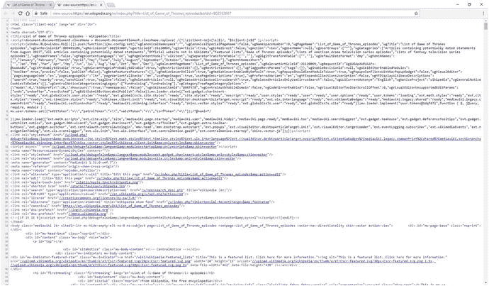
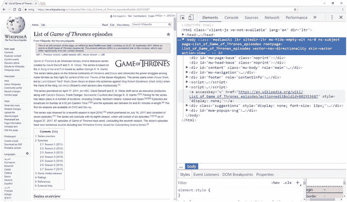
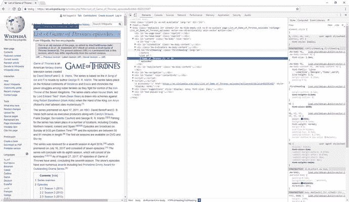

# 3.搅动 HTML 和 CSS 的汤

到目前为止，我们已经讨论了 HTTP 的基础知识，以及如何使用请求库在 Python 中执行 HTTP 请求。然而，由于大多数网页是使用超文本标记语言(HTML)格式化的，我们需要理解如何从这样的网页中提取信息。因此，本章将向您介绍 HTML，以及用于格式化和样式化现代网页的另一个核心构件:级联样式表(CSS)。本章然后讨论了漂亮的汤库，它将帮助我们理解 HTML 和 CSS 的“汤”

## 3.1 超文本标记语言:HTML

在前一章中，我们介绍了 HTTP 的基础知识，并了解了如何使用请求库在 Python 中执行 HTTP 请求，但现在我们需要找出一种解析 HTML 内容的方法。回想一下我们在上一章结束时的小维基百科示例，以及我们从中获得的 HTML:

```py
import requests

url = 'https://en.wikipedia.org/w/index.php' + \
      '?title=List_of_Game_of_Thrones_episodes&oldid=802553687'

r = requests.get(url)
print(r.text)

```

也许你已经尝试在你喜欢的其他网站上运行这个例子了...在任何情况下，一旦你开始稍微了解网络是如何工作的，并在实践中开始抓取网页，你无疑会开始惊叹于你的网络浏览器为你做的所有事情:获取网页；将这些“汤”转换成格式良好的页面，包括图像、动画、样式、视频等等。在这一点上，这可能会让人感到非常害怕——当然，我们不需要从头开始复制 web 浏览器所做的所有事情吧？答案是，幸运的是，我们没有。就像 HTTP 一样，我们将使用一个强大的 Python 库来帮助我们处理这些混乱的文本。而且，与 web 浏览器相反，我们对取出完整页面的内容并呈现它不感兴趣，而只对提取我们感兴趣的部分感兴趣。

如果您运行上面的示例，您将看到以下内容打印在屏幕上:

```py
<!DOCTYPE html>
<html class="client-nojs" lang="en" dir="ltr">
<head>
<meta charset="UTF-8"/>
<title>List of Game of Thrones episodes - Wikipedia</title>
[...]
</html>

```

这就是超文本标记语言(HTML)，创建网页的标准标记语言。尽管有些人将 HTML 称为“编程语言”，但“标记语言”是一个更恰当的术语，因为它规定了文档的结构和格式。没有必要使用 HTML 来格式化网页——事实上，我们在前一章处理的所有例子都只是返回简单的文本页面。然而，如果你想创建视觉上吸引人的页面，在浏览器中看起来也不错(即使它只是在页面上添加一些颜色)，HTML 是一个不错的选择。

HTML 提供了为文档提供结构和格式的构件。这是通过一系列“标签”提供的 HTML 标签通常是成对出现的，用尖括号括起来，其中“<tagname>”是开始标签，“</tagname>”表示结束标签。一些标签以不成对的形式出现，并且不需要结束标签。一些常用的标签如下:

*   把一个段落括起来；
*   `<br>`设置换行符；
*   `<table>...</table>`启动一个表块，内；`<tr>...<tr/>`用于行；和`<td>...</td>`细胞；
*   ``为图片；
*   `<h1>...</h1>`到`<h6>...</h6>`为表头；
*   `<div>...</div>`表示 HTML 文档中的一个“分部”，基本上用来分组一组元素；
*   `<a>...</a>`为超链接；
*   `<ul>...</ul>`、`<ol>...</ol>`分别为无序列表和有序列表；其中，`<li>...</li>`用于每个列表项。

标签可以相互嵌套，所以“

Hello

”是完全有效的，尽管像“

Oops

”这样的重叠嵌套是无效的。即使这不是合适的 HTML，每个 web 浏览器都会尽可能好地解析和呈现 HTML 页面。如果网络浏览器要求所有网页都按照 HTML 标准完美格式化，你可以打赌大多数网站都会失败。HTML 很乱。

成对出现的标签有内容。例如，“”将在你的浏览器中呈现“点击这里”作为超链接。标签也可以有属性，这些属性放在开始标签的内部。比如，“`http://www.example.com/image.jpg`”>。

## 3.2 使用浏览器作为开发工具

如果这一切进行得有点快，不要太担心，因为当我们通过例子学习时，我们会更详细地理解 HTML。在我们继续之前，我们想给你提供一些在构建网页抓取工具时有用的提示。

现在大多数现代网络浏览器都包括一个强大的工具包，你可以用它来了解 HTML 和 HTTP 的发展。在你的浏览器中再次导航到 [`https://en.wikipedia.org/w/index.php?title=List_of_Game_of_Thrones_episodes` `&` `oldid=802553687`](https://en.wikipedia.org/w/index.php%3Ftitle=List_of_Game_of_Thrones_episodes%26oldid=802553687) 处的维基百科页面——我们假设你正在使用谷歌浏览器进行后续操作。首先，知道如何能看一看这个页面的底层 HTML 是有帮助的。要做到这一点，你可以在页面上点击右键，然后按“查看源代码”，或者只需在谷歌浏览器中按 Control+U。一个新的页面将打开，包含当前页面的原始 HTML 内容(与我们使用`r.text`得到的内容相同)；见图 [3-1](#Fig1) 。



图 3-1

Viewing a page’s source in Chrome

此外，你可以打开 Chrome 的“开发者工具”为此，您可以选择浏览器窗口右上角的 Chrome 菜单，然后选择“工具”、“开发者工具”，或者按 Control+Shift+I。或者，您也可以右键单击任何页面元素，然后选择“检查元素”Firefox 和 Microsoft Edge 等其他浏览器也内置了类似的工具。您应该会看到如图 [3-2](#Fig2) 所示的屏幕。



图 3-2

The Chrome Developer Tools window contains a lot of helpful tools for web scrapers Moving Around

花一些时间来探索开发者工具窗格。您的可能会出现在浏览器窗口的底部。如果你喜欢把它放在右边，找到带有三点冒号图标(三点冒号)的菜单，选择不同的“Dock side”

开发人员工具窗格由一系列选项卡组成，其中“元素”和“网络”最有帮助。

让我们先来看看“网络”选项卡。你应该会在工具栏看到一个红色的“录音”图标，表示 Chrome 正在跟踪网络请求(如果图标不亮，按下它开始跟踪)。刷新维基百科页面，看看开发者工具窗格中发生了什么:Chrome 开始记录它发出的所有请求，从顶部对页面本身的 HTTP 请求开始。请注意，您的 web 浏览器还会发出许多其他请求来实际呈现页面，其中大部分是获取图像数据(“Type: png”)。通过单击一个请求，您可以获得关于它的更多信息。例如，点击顶部的“index.php”请求，得到如图 [3-3](#Fig3) 所示的屏幕。选择一个请求会打开另一个窗格，该窗格提供了大量的信息，您应该已经非常熟悉这些信息了，因为您已经使用过 HTTP。例如，确保在侧窗格中选择了“Headers”选项卡，我们会看到一般信息，如服务器发回的请求 URL、方法(动词)和状态代码，以及请求和响应标题的完整列表。

最后，在 Network 选项卡中有许多有用的复选框值得一提。启用“保留日志”将阻止 Chrome 在每次执行新页面请求时“清理”概览。如果您想在浏览网站时跟踪一系列操作，这可能会很方便。“禁用缓存”将阻止 Chrome 使用其“短期记忆”。Chrome 将尝试变得聪明，如果它仍然有最近页面的内容，它会阻止执行请求，但如果你想强制 Chrome 实际执行每个请求，你可以忽略这一点。


图 3-3

Inspecting an HTTP request in Chrome

转到“Elements”选项卡，我们看到一个与查看页面源代码时看到的视图相似的视图，尽管现在被整齐地格式化为基于树的视图，带有我们可以展开和折叠的小箭头，如图 [3-4](#Fig4) 所示。

这里特别有用的是，你可以将鼠标悬停在 Elements 标签中的 HTML 标签上，Chrome 会在网页上相应的可视化表示上显示一个透明框。这可以帮助您快速找到您正在寻找的内容。或者，您可以右键单击网页上的任何元素，然后按“检查元素”,立即在“元素”选项卡中突出显示其对应的 HTML 代码。请注意，Elements 选项卡底部的“breadcrumb trail”显示了您当前在 HTML“树”中的位置

Inspecting Elements versus View Source

你可能想知道为什么“查看源代码”选项对查看页面的原始 HTML 源代码很有用，而元素选项卡提供了一个更加用户友好的选项。这里有一个警告:“查看源代码”选项显示了 web 服务器返回的 HTML 代码，当使用请求时，它将包含与`r.text`相同的内容。另一方面，Elements 选项卡中的视图在 HTML 被 web 浏览器解析后提供了一个“清理过的”版本。例如，重叠的标签被固定，多余的空白被删除。因此，这两种观点之间可能会有细微的差别。此外,“元素”选项卡提供了一个实时、动态的视图。网站可能包含由您的 web 浏览器执行的脚本，这些脚本可以随意更改页面内容。因此，元素选项卡将始终反映页面的当前状态。这些脚本是用一种叫做 JavaScript 的编程语言编写的，可以在HTML 中的标签。几章之后，我们将更仔细地看看 JavaScript，以及为什么它在 web 抓取的上下文中很重要。



图 3-4

Looking at the Elements tab in Chrome

接下来，请注意，可以右键单击 Elements 选项卡中的任何 HTML 元素。“复制、复制选择器”和“复制 XPath”特别有用，我们以后会经常用到。您甚至会看到您可以实时编辑 HTML 代码(网页会自动更新以反映您的编辑)，尽管不要感觉太像 CSI: Miami 风格的黑客:这些更改当然只是局部的。它们不在 web 服务器上做任何事情，一旦你刷新页面，它们就会消失，尽管这是一种有趣的尝试 HTML 的方式。在任何情况下，你的网络浏览器都会成为你在网络抓取项目中最好的朋友。

## 3.3 级联样式表:CSS

在开始用 Python 处理 HTML 之前，我们需要先讨论另一项关键技术:级联样式表(CSS)。在浏览浏览器中的 HTML 元素时，您可能已经注意到一些 HTML 属性出现在许多标签中:

*   “id”，用于将页面唯一标识符附加到某个标签上；
*   “class”，它列出了一系列用空格分隔的 CSS 类名。

尽管“id”可以方便地快速获取我们感兴趣的 HTML 页面部分，但“class”值得进一步介绍，它与 CSS 的概念有关。

CSS 和 HTML 是齐头并进的。回想一下，最初，HTML 是用来定义网站的结构和格式的。在网络的早期，发现大量的 HTML 标签来定义内容应该是什么样子是很正常的，例如“**...**"为粗体文本；”*...*"为斜体文本；还有“<font>...</font>"更改字体系列、大小、颜色和其他字体属性。然而，过了一段时间，web 开发人员开始争论——这是正确的——文档的结构和格式基本上与两种不同的关注点有关。将这与用诸如 Word 之类的文本处理器编写文档进行比较。您可以直接对文档应用格式，但更好的方法是使用样式来表示标题、列表、表格等。，然后可以通过修改样式的定义来轻松更改其格式。CSS 以类似的方式工作。HTML 仍然用于定义文档的一般结构和语义，而 CSS 将决定文档应该如何样式化，或者换句话说，它应该是什么样子。

CSS 语言看起来和 HTML 有些不同。在 CSS 中，样式信息被记为基于冒号分隔的键值的语句列表，每个语句本身由分号分隔，如下所示:

```py
color: 'red';
background-color: #ccc;
font-size: 14pt;
border: 2px solid yellow;

```

这些样式声明可以通过三种不同的方式包含在文档中:

*   在一个普通的 HTML“样式”属性中，例如:“

    ...

    ”。
*   HTML 内部"标签，放置在页面的标签里面。
*   在一个单独的文件中，然后通过页面的“”标签中的“<link>”标签来引用该文件。这是最干净的工作方式。当加载网页时，您的浏览器将执行一个额外的 HTTP 请求来下载这个 CSS 文件，并将其定义的样式应用到文档中。

如果样式声明放在“style”属性中，那么声明应该应用于哪个元素是显而易见的:HTML 标记本身。在另外两种情况下，样式定义需要包含关于 HTML 元素或样式应该应用到的元素的信息。这是通过将样式声明放在花括号中进行分组，并在每个组的开头放置一个“CSS 选择器”来实现的:

```py
h1 {
  color: red;
}
div.box {
  border: 1px solid black;
}
#intro-paragraph {
  font-weight: bold;
}

```

CSS 选择器定义了用来“选择”你想要样式化的 HTML 元素的模式。它们在语法方面相当全面。以下列表提供了完整的参考:

*   `tagname`选择具有特定标记名的所有元素。例如，“h1”简单地匹配所有的“

    # ”页面上的标签. .

*   `.classname` (note the dot) selects all elements having a particular class defined in the HTML document. This is exactly where the “class” attribute comes in. For instance, `.intro` will match with both “

    “还有”

    # ".注意，HTML 元素可以有多个类，例如，“

    ".

*   `#idname`根据元素的“id”属性匹配元素。与类相反，正确的 HTML 文档应该确保每个“id”都是惟一的，并且只赋予一个元素(尽管如果一些特别混乱的 HTML 页面打破了这个惯例，多次使用同一个 id 值，也不要感到惊讶)。
*   这些选择器可以以各种方式组合。例如，`div.box`选择所有“标签，但不选择”标签。
*   可以使用逗号“，”指定多个选择器规则，例如`h1, h2, h3`。
*   `selector1 selector2`定义一个链接规则(注意空格),并选择匹配`selector1`的元素中匹配`selector2`的所有元素。请注意，可以将两个以上的选择器链接在一起。
*   `selector1 > selector2` selects all elements matching `selector2` where the parent element matches `selector1`. Note the subtle difference here with the previous line. A “parent” element refers to the “direct parent.” For instance, `div > span` will not match with the span element inside “” (as the parent element here is a “

    ”标签)，而

    `div span` will.
*   `selector1 + selector2`选择匹配`selector2`的所有元素，这些元素直接位于匹配`selector1`的元素之后(即，在 HTML 层次结构中的同一级别上)。
*   `selector1 ~ selector2`选择与`selector2`匹配的所有元素，这些元素位于`selector1`之后(在 HTML 层次结构中的同一级别上)。同样，这里与前面的规则有一个微妙的区别:这里的优先级不需要是“直接的”:中间可以有其他标记。
*   还可以根据元素的属性添加更好的选择规则。`tagname[attributename]`选择属性名为`attributename`的所有`tagname`元素。注意，标签选择器是可选的，简单地编写`[title]`就可以选择所有带有“title”属性的元素。
*   属性选择器可以进一步细化。`[attributename=value]`也检查属性的实际值。如果要包含空格，请用双引号将值括起来。
*   `[attributename~=value]`做了类似的事情，但是没有执行精确的值比较，这里选择了所有元素，它们的`attributename`属性的值是一个用空格分隔的单词列表，其中一个等于`value`。
*   `[attributename|=value]`选择所有元素，其`attributename`属性的值是以空格分隔的单词列表，其中任何一个都等于“值”或以“值”开头，后跟一个连字符(“-”)。
*   `[attributename^=value]`选择属性值以提供的值开始的所有元素。如果要包含空格，请用双引号将值括起来。
*   `[attributename$=value]`选择属性值以提供的值结尾的所有元素。如果要包含空格，请用双引号将值括起来。
*   `[attributename*=value]`选择属性值包含所提供值的所有元素。如果要包含空格，请用双引号将值括起来。
*   Finally, there are a number of “colon” and “double-colon” “pseudo-classes” that can be used in a selector rule as well. `p:first-child` selects every “

    "标记是其父元素的第一个子元素，并且

    `p:last-child` and `p:nth-child(10)` provide similar functionality.

使用 Chrome 的开发工具(或浏览器中的等效工具)在维基百科页面上玩一玩:尝试找到“class”属性的实例。页面的 CSS 资源通过一个“<link>”标签引用(注意页面也可以加载多个 CSS 文件):

```py
<link rel="stylesheet" href="/w/load.php?[...];skin=vector">

```

我们不打算用 CSS 来建立网站。相反，我们要刮它们。因此，您可能想知道为什么关于 CSS 的讨论对我们的目的有用。原因在于，使用 Python 可以使用相同的 CSS 选择器语法快速查找和检索 HTML 页面中的元素。尝试在 Chrome 的开发者工具窗格的元素选项卡中右键单击一些 HTML 元素，然后按“复制，复制选择器”请注意，您获得了一个 CSS 选择器。例如，这是获取页面上的一个表的选择器:

```py
#mw-content-text > div > table:nth-child(9).

```

或者:“在 id 为“mw-content-text”的元素内部，获取子“div”元素，并获取第 9 个“table”子元素。”一旦我们开始在 web 抓取脚本中使用 HTML，我们就会经常使用这些选择器。

## 3.4 美丽的汤库

我们现在准备开始使用 Python 处理 HTML 页面。回想一下下面几行代码:

```py
import requests

url = 'https://en.wikipedia.org/w/index.php' + \
      '?title=List_of_Game_of_Thrones_episodes&oldid=802553687'

r = requests.get(url)
html_contents = r.text

```

我们如何处理`html_contents`中包含的 HTML？为了正确解析和处理这个“汤”，我们将引入另一个库，名为“美丽的汤”

Soup, Rich and Green

最后，我们明白了为什么我们一直把混乱的 HTML 页面称为“汤”这座美丽的汤库是以刘易斯·卡罗尔的一首诗命名的，这首诗与《爱丽丝漫游奇境记》同名。在这个故事中，这首诗是由一个叫“素甲鱼”的角色唱的，内容如下:“美丽的汤，如此浓郁和绿色，//在一个热碗中等待！//谁会为了这样的美味不弯腰？//晚上的汤，好喝的汤！”。就像故事中一样，Beautiful Soup 试图组织复杂性:它通过修复糟糕的 HTML 并向我们展示一个易于使用的 Python 结构，来帮助解析、构造和组织经常非常混乱的 web。

正如请求的情况一样，使用 pip 安装 Beautiful Soup 很容易(如果您仍然需要设置 Python 3 和 pip，请参考 1.2.1 节)，并注意包名中的“4 ”:

```py
pip install -U beautifulsoup4

```

使用 Beautiful Soup 从创建一个`BeautifulSoup`对象开始。如果你已经有了一个包含在字符串中的 HTML 页面(就像我们一样)，这很简单。不要忘记添加新的导入行:

```py
import requests
from bs4 import BeautifulSoup

url = 'https://en.wikipedia.org/w/index.php' + \
      '?title=List_of_Game_of_Thrones_episodes&oldid=802553687'

r = requests.get(url)
html_contents = r.text

html_soup = BeautifulSoup(html_contents)

```

尝试运行这段代码。如果一切顺利，您应该不会收到任何错误，尽管您可能会看到以下警告:

```py
Warning (from warnings module):
  File "__init__.py", line 181     markup_type=markup_type))

UserWarning: No parser was explicitly specified, so I'm using the best available HTML parser for this system ("html.parser"). This usually isn't a problem, but if you run this code on another system, or in a different virtual environment, it may use a different parser and behave differently.

The code that caused this warning is on line 1 of the file <string>. To get rid of this warning, change code so that it looks like this:

 BeautifulSoup(YOUR_MARKUP})

to this:

 BeautifulSoup(YOUR_MARKUP, "html.parser")

```

啊哦，这是怎么回事？漂亮的 Soup 库本身依赖于一个 HTML 解析器来执行大部分的大量解析工作。在 Python 中，有多种解析器可以做到这一点:

*   “html.parser”:一个不错的内置 Python 解析器(尤其是在使用最新版本的 Python 3 时)，不需要额外安装。
*   “lxml”:非常快，但需要额外安装。
*   “html5lib”:旨在以与网络浏览器完全相同的方式解析网页，但速度稍慢。

由于这些解析器之间存在一些小的差异，如果您不显式地提供一个解析器，Beautiful Soup 会警告您，这可能会导致您的代码在不同的机器上执行相同的脚本时行为略有不同。为了解决这个问题，我们只需自己指定一个解析器——我们将坚持使用默认的 Python 解析器:

```py
html_soup = BeautifulSoup(html_contents, 'html.parser')

```

Beautiful Soup 的主要任务是获取 HTML 内容，并将其转换为基于树的表示。一旦创建了一个`BeautifulSoup`对象，有两种方法可以用来从页面获取数据:

*   `find(name, attrs, recursive, string, **keywords);`
*   `find_all(name, attrs, recursive, string, limit, **keywords).`

Underscores

如果你不喜欢写下划线，Beautiful Soup 还使用“camelCaps”大写来公开它的大多数方法。所以如果你愿意，你也可以用`findAll`来代替`find_all`。

这两种方法看起来非常相似，除了`find_all`多了一个`limit`参数。要测试这些方法，请将以下代码行添加到您的脚本中并运行它:

```py
print(html_soup.find('h1'))

print(html_soup.find('', {'id': 'p-logo'}))

for found in html_soup.find_all(['h1', 'h2']):
    print(found)

```

这两种方法背后的一般思想应该相对清晰:它们用于在 HTML 树中查找元素。让我们一步步讨论这两种方法的论点:

*   `name`参数定义了您希望在页面上“找到”的标签名。您可以传递一个字符串或一列标记。将该参数保留为空字符串只会选择所有元素。
*   `attrs`参数获取属性的 Python 字典，并匹配与这些属性匹配的 HTML 元素。

And or Or?

一些指南指出在`attrs`字典中定义的属性表现为“或-这-或-那”的关系，其中匹配至少一个属性的每个元素都将被检索。然而，这不是真的:在`attrs`中定义的过滤器和在`**keywords`中使用的关键字都应该匹配，这样才能检索到元素。

*   `recursive`参数是一个布尔值，它决定了搜索的深度。如果设置为 True(默认值)，则`find`和`find_all`方法将查看子代、子代的子代等等...查找与查询匹配的元素。如果为 False，它将只查看直接子元素。
*   `string`参数用于根据元素的文本内容执行匹配。

Text or String?

`string`的说法相对较新。在更早的 Beautiful Soup 版本中，这个参数被命名为`text`。事实上，如果你愿意，你仍然可以用`text`代替`string`。如果两个都用(不推荐)，那么`text`优先，`string`出现在下面的`**keywords`列表中。

*   `limit`参数仅在`find_all`方法中使用，可用于限制检索的元素数量。请注意，`find`在功能上等同于在`limit`设置为 1 的情况下调用`find_all`，只是前者直接返回检索到的元素，而后者将总是返回一个项目列表，即使它只包含一个元素。同样重要的是，当`find_all`找不到任何东西时，它返回一个空列表，而如果`find`找不到任何东西，它返回 None。
*   是一种特殊情况。基本上，方法签名的这一部分表明您可以添加任意多的额外命名参数，这些参数将被简单地用作属性过滤器。写作“`find(id='myid')`”因此与“`find(attrs={'id': 'myid'})`”相同。如果您同时定义了`attrs`参数和额外的关键字，所有这些都将一起用作过滤器。提供这一功能主要是为了方便编写易读的代码。

Take Care with Keywords

尽管`**keywords`论点在实践中非常有用，但这里还是要提到一些重要的警告。首先，您不能使用`class`作为关键字，因为这是一个保留的 Python 关键字。这是一个遗憾，因为这将是在 HTML 中搜索内容时最常用的属性之一。幸运的是，美丽的汤提供了一个解决办法。不用`class`，直接把`class_`写成:`find(class_='myclass')`。注意`name`也不能用作关键字，因为它已经被用作`find`和`find_all`的第一个参数名。可悲的是，美丽的汤在这里没有提供一个`name_`选择。相反，如果您想基于“name”HTML 属性进行选择，您需要使用`attrs`。

`find`和`find_all`都返回`Tag`对象。使用这些工具，您可以做许多有趣的事情:

*   访问`name`属性来检索标记名。
*   访问`contents`属性获得一个 Python 列表，其中包含标签的子标签(它的直接后代标签)。
*   属性做同样的事情，但是提供了一个迭代器；`descendants`属性也返回一个迭代器，现在以递归方式包含了所有标签的后代。这些属性在你调用`find`和`find_all`时使用。
*   类似地，您也可以通过使用`parent`和`parents`属性在 HTML 树中“向上”移动。要横向移动(即，在层次结构中的同一级别查找下一个和上一个元素)，可以使用`next_sibling`、`previous_sibling`、`next_siblings,`和`previous_siblings`。
*   将`Tag`对象转换为字符串会将标签及其 HTML 内容显示为字符串。例如，如果您调用 print out`Tag`对象，或者在`str`函数中包装这样一个对象，就会发生这种情况。
*   通过`Tag`对象的`attrs`属性访问元素的属性。为了方便起见，你也可以直接使用`Tag`对象本身作为字典。
*   使用`text`属性以明文形式获取`Tag`对象的内容(没有 HTML 标签)。
*   或者，您也可以使用`get_text`方法，可以给它一个`strip`布尔参数，使得`get_text(strip=True)`等价于`text.strip()`。也可以指定一个字符串，用于将元素中包含的文本连接在一起，例如，`get_text('--')`。
*   如果一个标签只有一个子标签，而这个子标签本身就是文本，那么您也可以使用`string`属性来获取文本内容。然而，如果一个标签包含其他嵌套的 HTML 标签，`string`将返回 None，而`text`将递归地获取所有文本。
*   最后，并不是所有的`find`和`find_` `all`搜索都需要从你原来的`BeautifulSoup`对象开始。每个`Tag`对象本身都可以作为一个新的根，从这里开始新的搜索。

我们已经处理了很多理论。让我们通过一些示例代码来展示这些概念:

```py
import requests
from bs4 import BeautifulSoup

url = 'https://en.wikipedia.org/w/index.php' + \
      '?title=List_of_Game_of_Thrones_episodes&oldid=802553687'

r = requests.get(url)
html_contents = r.text
html_soup = BeautifulSoup(html_contents, 'html.parser')
# Find the first h1 tag
first_h1 = html_soup.find('h1')

print(first_h1.name)     # h1
print(first_h1.contents) # ['List of ', [...], ' episodes']

print(str(first_h1))
# Prints out: <h1 class="firstHeading" id="firstHeading" lang="en">List of
#             <i>Game of Thrones</i> episodes</h1>

print(first_h1.text)       # List of Game of Thrones episodes
print(first_h1.get_text()) # Does the same

print(first_h1.attrs)
# Prints out: {'id': 'firstHeading', 'class': ['firstHeading'], 'lang': 'en'}

print(first_h1.attrs['id']) # firstHeading
print(first_h1['id'])       # Does the same
print(first_h1.get('id'))   # Does the same

print('------------ CITATIONS ------------')
# Find the first five cite elements with a citation class
cites = html_soup.find_all('cite', class_="citation", limit=5)
for citation in cites:

    print(citation.get_text())
    # Inside of this cite element, find the first a tag
    link = citation.find('a')
    # ... and show its URL
    print(link.get('href'))
    print()

```

A Note About Robustness

仔细看看上面例子中的“引文”部分。如果“<cite>”元素中没有“</cite>

在我们继续另一个例子之前，关于`find`和`find_all`还有两个小的评论。如果您发现自己正在遍历一系列标记名，如下所示:

```py
tag.find('div').find('table').find('thead').find('tr')

```

记住《美丽的汤》也允许我们用一种速记的方式来写这个可能是有用的:

```py
tag.div.table.thead.tr

```

类似地，下面一行代码:

```py
tag.find_all('h1')

```

等同于调用:

```py
tag('h1')

```

尽管这也是为了方便起见，我们还是会在本书中继续完整地使用`find`和`find_all`，因为我们发现在这种情况下，稍微明确一点有助于可读性。

现在让我们试着解决下面的用例。你会注意到我们的《权力的游戏》维基百科页面有许多维护良好的表格，列出了剧集的导演、编剧、播出日期和观众人数。让我们尝试使用我们所学的内容一次性获取所有这些数据:

```py
import requests
from bs4 import BeautifulSoup

url = 'https://en.wikipedia.org/w/index.php' + \
      '?title=List_of_Game_of_Thrones_episodes&oldid=802553687'

r = requests.get(url)
html_contents = r.text
html_soup = BeautifulSoup(html_contents, 'html.parser')

# We'll use a list to store our episode list
episodes = []

ep_tables = html_soup.find_all('table', class_="wikiepisodetable")

for table in ep_tables:
    headers = []
    rows = table.find_all('tr')
    # Start by fetching the header cells from the first row to determine
    # the field names
    for header in table.find('tr').find_all('th'):
        headers.append(header.text)
    # Then go through all the rows except the first one
    for row in table.find_all('tr')[1:]:
        values = []
        # And get the column cells, the first one being inside a th-tag
        for col in row.find_all(['th','td']):
            values.append(col.text)
        if values:
            episode_dict = {headers[i]: values[i] for i in range(len(values))}
            episodes.append(episode_dict)

# Show the results
for episode in episodes:
    print(episode)

```

此时，大部分代码应该相对简单，尽管有些事情值得指出:

*   我们不会凭空想出“`find_all('table', class_="wikiepisodetable")`”行，尽管仅仅通过查看代码就可以看出这一点。回想一下我们之前说过的，你的浏览器开发工具成为你最好的朋友。查看页面上的剧集列表。注意它们都是如何通过一个“<表>标签来定义的。但是，该页面也包含我们不想包含的表格。一些进一步的研究引导我们找到了一个解决方案:所有的剧集表都有“wikiepisodetable”作为一个类，而其他的表没有。在想出一个可靠的方法之前，你通常不得不先迷惑地浏览一页。在许多情况下，在到达您想要的位置之前，您必须执行多次`find`和`find_all`迭代。
*   对于每个表，我们首先要检索标题，用作 Python 字典中的键。为此，我们首先选择第一个“”标记，并选择其中的所有“”标记。
*   接下来，我们遍历所有的行(“”标签)，除了第一行(标题行)。对于每一行，我们循环通过""和""标记来提取列值(第一列包含在""标记中，其他列包含在""标记中，这就是为什么我们需要处理这两个标记)。在每一行的末尾，我们准备向“剧集”变量添加一个新条目。为了存储每个条目，我们使用一个普通的 Python 字典(`episode_dict`)。如果您不太熟悉 Python，那么这个对象的构造方式可能看起来有点奇怪。也就是说，Python 允许我们通过在"[...]"或" {...}”括号。在这里，我们使用它来立即遍历`headers`和`values`列表以构建字典对象。注意，这假设这两个列表具有相同的长度，并且这两个列表的顺序匹配，使得例如“`headers[2]`处的报头是与“`values[2]`处的值相对应的报头。因为我们在这里处理的是相当简单的表，所以这是一个安全的假设。

Are Tables Worth It?

到目前为止，这个例子可能不会给你留下深刻的印象。大多数现代浏览器允许你简单地选择或右键单击网页上的表格，并能直接将它们复制到 Excel 等电子表格程序中。确实如此，如果您只有一个要提取的表，这无疑是更容易的方法。但是，一旦您开始处理许多表格，特别是如果它们分布在多个页面上，或者需要定期刷新特定网页中的表格数据，编写 scraper 的好处就开始变得更加明显。

用这个代码片段做更多的实验。您应该能够解决以下问题:

*   尝试从页面中提取所有链接以及它们指向的位置(提示:在“
*   尝试从页面中提取所有图像。
*   尝试从页面中提取“评级”表。这个有点棘手。您可能很想使用“`find('table', class_="wikitable")`”，但是您会注意到它匹配的是页面上的第一个表格，尽管它的 class 属性被设置为“wikitable plainrowheaders”事实上，对于可以接受多个用空格分隔的值的 HTML 属性(比如“class”)，Beautiful Soup 会执行部分匹配。要得到我们想要的表，您要么必须遍历页面上所有的“wikitable”表，并对其`text`属性执行检查，以确保您有想要的表，要么尝试找到一个唯一的父元素，您可以从中向下钻取，例如，“`find('div', align="center").find('table', class_="wikitable")`”——至少现在，您将在下一节中了解一些更高级的漂亮的 Soup 特性。

Classes Are Special

对于可以接受多个用空格分隔的值的 HTML 属性(比如“class”)，Beautiful Soup 将执行部分匹配。如果您想要执行精确匹配，比如“查找包含“myclass”类的元素，并且只查找该类”，那么这可能会很棘手，但是如果您想要选择一个匹配多个类的 HTML 元素，那么也可能会很棘手。在这种情况下，您可以编写类似于“`find(class_='class-one class-two')`”的代码，尽管这种工作方式相当脆弱和危险(这些类应该以相同的顺序出现在 HTML 页面中，并且彼此相邻，但情况可能并不总是如此)。另一种方法是将您的过滤器包装在一个列表中，即"`find(class_=['class-one', 'class-two'])`"，尽管这也不会获得想要的结果:该语句将匹配具有" class-1 "和" class-2 "这两个类的元素，而不是匹配具有这些类中任何一个的元素！为了以一种稳健的方式解决这个问题，我们首先需要多了解一点关于美丽的汤的知识...

## 3.5 更多关于美丽的汤

既然我们已经了解了美丽汤的基础知识，我们就可以进一步探索这个库了。首先，虽然我们已经了解了`find`和`find_all`的基础知识，但需要注意的是，这些方法确实非常通用。我们已经看到了如何过滤简单的标签名或标签列表:

```py
html_soup.find('h1')
html_soup.find(['h1', 'h2'])

```

但是，这些方法也可以接受其他类型的对象，比如正则表达式对象。通过使用 Python 的“re”模块构造一个正则表达式，下面的代码行将匹配所有以字母“h”开头的标签:

```py
import re

html_soup.find(re.compile('^h'))

```

Regex

如果您以前没有听说过正则表达式，正则表达式(regex)定义了一个定义搜索模式的模式序列(表达式)。它经常用于字符串搜索和匹配代码，以查找(和替换)字符串片段。虽然它们是非常强大的构造，但也可能被误用。例如，不要过度使用长的或复杂的正则表达式是一个好主意，因为它们可读性不强，而且可能很难弄清楚某个特定的正则表达式在做什么。顺便说一下，这也是一个很好的提点，您应该避免使用 regex 来解析 HTML 页面。我们本可以在更早的时候引入正则表达式，作为一种从 HTML soup 中解析内容片段的方法，而根本不需要使用漂亮的 soup。然而，这是一个可怕的想法。正如我们所看到的，HTML 页面非常混乱，为了从页面中提取内容，你很快就会得到大量杂乱无章的代码。总是使用像 Beautiful Soup 这样的 HTML 解析器来执行繁重的工作。然后，您可以使用 regex 的小片段(如下所示)来查找或提取内容片段。

除了字符串、列表和正则表达式，还可以传递函数。这在其他方法不起作用的复杂情况下很有帮助:

```py
def has_classa_but_not_classb(tag):
    cls = tag.get('class', [])
    return 'classa' in cls and not 'classb' in cls

html_soup.find(has_classa_but_not_classb)

```

注意，您还可以将列表、正则表达式和函数传递给`find`和`find_all`的`attrs`字典值、`string`和`**keyword`参数。

除了`find`和`find_all`之外，还有很多其他的搜索 HTML 树的方法，与`find`和`find_all`非常相似。不同的是，它们将搜索 HTML 树的不同部分:

*   `find_parent`和`find_parents`沿着树向上，使用标签的`parents`属性查看标签的父标签。记住`find`和`find_all`沿着树向下工作，查看一个标签的后代。
*   `find_next_sibling`和`find_next_siblings`将使用`next_siblings`属性迭代并匹配一个标签的兄弟。
*   `find_previous_sibling`和`find_previous_siblings`做同样的事情，但是使用了`previous_siblings`属性。
*   `find_next`和`find_all_next`使用`next_elements`属性迭代和匹配文档中标签后面的所有内容。
*   `find_previous`和`find_all_previous`将使用`previous_elements`属性反向搜索。
*   记住，`find`和`find_all`在`recursive`参数设置为假的情况下作用于`children`属性，在`recursive`设置为真的情况下作用于`descendants`属性。

So Many Methods

虽然没有真正的文档，但是也可以使用`findChild`和`findChildren`方法(虽然不是`find_child`和`find_children`)，它们分别被定义为`find`和`find_all`的别名。但是没有`findDescendant`，所以请记住，使用`findChild`将默认搜索所有的`descendants`(就像`find`一样)，除非您将`recursive`参数设置为 False。这肯定是令人困惑的，所以最好避免这些方法。

尽管所有这些都能派上用场，但您会发现在浏览 HTML 树时,`find`和`find_all`会占用大部分工作量。然而，还有一个非常有用的方法:`select`。最后，我们在上面看到的 CSS 选择器是有用的。使用这种方法，您可以简单地将 CSS 选择器规则作为字符串传递。

Beautiful Soup 将返回符合此规则的元素列表:

```py
# Find all <a> tags
html_soup.select('a')

# Find the element with the info id
html_soup.select('#info')

# Find <div> tags with both classa and classb CSS classes
html_soup.select(div.classa.classb)

# Find <a> tags with an href attribute starting with http://example.com/
html_soup.select('a[href^="http://example.com/"]')

# Find <li> tags which are children of <ul> tags with class lst
html_soup.select(ul.lst > li')

```

一旦你开始习惯 CSS 选择器，这种方法确实非常强大。例如，如果我们想从我们的《权力的游戏》维基百科页面找到引用链接，我们可以简单地运行:

```py
for link in html_soup.select('ol.references cite a[href]'):
    print(link.get('href'))

```

然而，Beautiful Soup 中的 CSS 选择器规则引擎不如现代 web 浏览器中的强大。以下规则是有效的选择器，但在 Beautiful Soup 中不起作用:

```py
# This will not work:
# cite a[href][rel=nofollow]

# Instead, you can use:
tags = [t for t in html_soup.select('cite a[href]') \
          if 'nofollow' in t.get('rel', [])]

# This will not work:
# cite a[href][rel=nofollow]:not([href*="archive.org"])

# Instead, you can use:
tags = [t for t in html_soup.select('cite a[href]') \
          if 'nofollow' in t.get('rel', []) and 'archive.org' not in t.get('href')]

```

幸运的是，需要求助于如此复杂的选择器的情况很少，请记住，您仍然可以使用`find`、`find_all,`和 friends(尝试使用上面的两个示例，并在完全不使用`select`的情况下重写它们)。

All Roads Lead to Your Element

细心的读者会注意到，通常有多种方法来编写 CSS 选择器以获得相同的结果。也就是说，不写“引用 a”，也可以写“body div . ref list ol . references Li cite . citation a”，得到同样的结果。然而，一般来说，只让您的选择器按照获取您想要的内容所需的粒度进行操作是一个好的实践。网站经常变化，如果你计划在生产中使用 web scraper 相当长的时间，你可以通过在精确性和健壮性之间找到一个好的平衡来为自己省去一些麻烦。这样，您可以尽可能地做好未来的准备，以防网站所有者决定修改 HTML 结构、类名、属性等等。也就是说，可能总有那么一个时刻，一个变化如此重大，以至于最终打破了你的选择器。在你的代码中包含额外的检查，并提供早期的警告信号，对于构建健壮的网页抓取器有很大的帮助。

最后，关于美丽的汤还有一个细节需要提及。到目前为止，我们主要讨论了`BeautifulSoup`对象本身(上面例子中的`html_soup`变量)，以及由`find`、`find_all`和其他搜索操作检索的`Tag`对象。在 Beautiful Soup 中还有两种对象类型，虽然不太常用，但了解它们还是很有用的:

*   对象:这些用来表示标签中的文本，而不是标签本身。一些漂亮的 Soup 函数和属性将返回这样的对象，比如标签的`string`属性。像`descendants`这样的属性也会包含在他们的列表中。此外，如果您使用`find`或`find_all`方法并提供一个没有`name`参数的`string`参数值，那么这些方法也将返回`NavigableString`对象，而不是`Tag`对象。
*   对象:这些用来表示 HTML 注释(可以在注释标签中找到，"<！-...——>”)。这些在网络抓取时很少有用。

如果你喜欢的话，可以随意多喝一些美味的汤。花些时间在 [`https://www.crummy.com/software/BeautifulSoup/bs4/doc/`](https://www.crummy.com/software/BeautifulSoup/bs4/doc/) 浏览一下这个库的文档。注意，Beautiful Soup 的文档没有 requests 的文档结构良好，所以它看起来更像是一个端到端的文档，而不是参考指南。在下一章中，我们从 HTML 后退一步，回到 HTTP 来更深入地探索它。