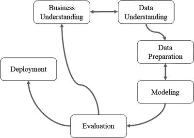

# 7.管理和法律问题

到目前为止，我们一直在关注本书的“网络搜集”部分。现在，我们后退一步，将您学到的概念与数据科学的一般领域联系起来，特别关注当您计划将 web 抓取纳入数据科学项目时会出现的管理问题。本章还提供了一个关于网络搜集的法律方面的彻底讨论。

## 7.1 数据科学流程

作为一名数据科学家(或有志成为数据科学家的人)，您可能已经体验到“数据科学”已经成为一个非常超载的术语。公司逐渐认识到，数据科学包含非常广泛的技能，几乎不可能由一个人来完成，因此需要一个多学科团队，包括:

*   基础理论家、数学家、统计学家(思考:回归、贝叶斯建模、线性代数、奇异值分解等等)。
*   数据辩论者(想想:熟悉 SQL、Python 的 pandas 库和 R 的 dplyr 的人)。
*   分析师和建模师(想想:使用 R 或 SAS 构建随机森林或神经网络模型)。
*   数据库管理员(想想:DB2 或 MSSQL 专家，对数据库和 SQL 有着深刻理解的人)。
*   商业智能专家(想想:报告和仪表板，以及数据仓库和 OLAP 立方体)。
*   IT 架构师和“devops”人员(想想:维护建模环境、工具和平台的人员)。
*   大数据平台专家(想想:了解 Hadoop、Hive 和 Spark 的人)。
*   “黑客”档案(想一想:熟悉命令行的人，什么都知道一点，可以快速移动，并破坏东西)。
*   业务集成商、发起人和拥护者(想想:知道如何将业务问题转化为数据需求和建模任务，并能够将结果转化回利益相关者，并能够强调数据和数据科学在组织中的重要性的人)。
*   管理层(想一想:更高层的人把数据放在日程上，并让它渗透到组织的所有层面)。
*   当然，还有网页抓取工具(想想:到目前为止你学到了什么)。

数据科学和分析继续快速发展。当前围绕人工智能和深度学习的大肆宣传再次引发了组织正在寻找的另一系列技能。

在任何情况下，数据科学都是以一种脚踏实地的方式从数据中提取价值，在这种方式下，人们认识到数据在变得有价值之前需要许多利益相关者的大量处理和工作。因此，数据科学作为一种组织活动，经常通过“流程”来描述:描述数据科学项目中必须采取的步骤的工作流，无论是构建预测模型来预测谁将流失，哪些客户将对营销活动做出积极反应，客户细分任务，还是简单地自动创建列出一些描述性统计数据的定期报告。原始来源是数据。许多这样的过程框架已经被提出，CRISP-DM 和 KDD(数据库中的知识发现)过程是目前最流行的两个。

图 7-1

The CRISP-DM process

CRISP-DM 代表“数据挖掘的跨行业标准过程”KDnuggets ( [`https://www.kdnuggets.com/`](https://www.kdnuggets.com/) )在过去十年进行的民意调查显示，它是行业数据挖掘者和数据科学家使用的领先方法。图 [7-1](#Fig1) 显示了 CRISP-DM 流程的示意图。

CRISP-DM 很受欢迎，因为它明确强调了数据科学的循环性质:如果项目的结果与您预期或希望的不一致，您将经常不得不从头开始寻找新的数据源。KDD 过程比 CRISP-DM 稍早，并且描述了非常相似的步骤(更像是一条直接的路径，尽管这里也必须记住，后退几步也是必要的)。它包括:

*   识别业务问题:类似于 CRISP-DM 中的“业务理解”步骤，第一步包括对业务问题的彻底定义。一些例子:抵押贷款组合的客户细分，后付费电信订阅的保留模型，或信用卡的欺诈检测。定义分析建模练习的范围需要数据科学家和业务专家之间的密切合作。双方需要就一系列关键概念达成一致，例如:我们如何定义客户、交易、流失、欺诈等。；我们想要预测什么(我们如何定义这个)，以及我们什么时候对结果满意。
*   识别数据源:接下来，需要识别所有潜在感兴趣的源数据。这是一个非常重要的步骤，因为数据是任何分析工作的关键要素，数据的选择对后续步骤中构建的分析模型具有决定性影响。
*   选择数据:这里的一般黄金法则是:数据越多越好，尽管与手头问题无关的数据源应该在这个步骤中被丢弃。然后，所有适当的数据将被收集到一个临时区域，并整合到一个数据仓库、数据集市甚至一个简单的电子表格文件中。
*   清理数据:收集数据后，接下来是一系列漫长的预处理和数据争论步骤，以消除所有不一致的地方，比如缺失值、离群值和重复数据。
*   转换数据:预处理步骤通常还包括一个冗长的转换部分。可以考虑其他变换，例如字母数字到数字的编码、地理聚合、改善对称性的对数变换以及其他智能“特征化”方法。
*   分析数据:上述步骤对应于 CRISP-DM 中的“数据理解”和“数据准备”步骤。一旦数据得到充分的清理和处理，实际的分析和建模就可以开始了(在 CRISP-DM 中称为“建模”)。这里，对预处理和转换的数据估计分析模型。根据业务问题，数据科学家将选择并实施特定的分析技术。
*   解释、评估和部署模型:最后，一旦模型被构建，它将被业务专家解释和评估(在 CRISP-DM 中表示为“评估”)。分析模型可能检测到的琐碎模式和洞察仍然很有趣，因为它们提供了模型的验证。但是，当然，关键的挑战是找到未知的、有趣的和可操作的模式，这些模式可以为您的数据提供新的见解。一旦分析模型得到适当的验证和批准，它就可以作为分析应用程序(例如，决策支持系统、评分引擎等)投入生产。).重要的是要考虑如何以用户友好的方式表示模型输出，如何将其与其他应用程序(例如，营销活动管理工具、风险引擎等)集成。)，以及如何确保可以持续地对分析模型进行适当的监控。通常，分析模型的部署需要 IT 专家的支持，这将有助于模型的“生产化”。

## 7.2 网络刮擦适用于哪里？

数据科学过程的各个部分都可以使用网络搜集。然而，在大多数项目中，网络搜集将成为识别和选择数据源的重要组成部分。也就是说，收集和搜集可以包含在数据集中用于建模的数据。

在这里提供一个警告是很重要的，那就是始终记住你构建的模型的生产设置(“模型训练”与“模型运行”的差距)。您是否正在构建一个一次性项目模型，用于描述或发现一些有趣的模式，然后尽可能多地利用所需要的外部数据。但是，如果模型将作为预测分析应用程序进行生产，请记住，模型在部署时需要访问与培训时相同的变量。因此，您需要仔细考虑将抓取的数据源合并到这样的设置中是否可行，因为需要确保相同的数据源仍然可用，并且在前进的过程中可以继续抓取它们。网站可以改变，并且依赖于网络搜集的数据收集部分需要大量的维护，以便及时地实施修复或改变。在这些情况下，您可能仍然希望依赖更健壮的解决方案，如 API。根据您的项目，这个需求处理起来可能或多或少有些麻烦。例如，如果您收集的数据是指在一整年中“保持有效”的聚合数据，那么您当然也可以在部署期间运行模型时继续使用收集的数据(例如，在一年结束之前安排一次数据刷新)。请始终牢记模型的生产设置:在应用和使用模型时，您是否能够访问所需的数据，或者仅在训练模型时才能访问？谁将负责确保这种数据访问？该模型仅仅是一个有限保存期限的概念验证，还是将在未来几年内使用和维护？

在某些情况下，web 抓取部分将构成数据科学项目的主要组成部分。这在这样的情况下是很常见的，一些基本的统计数据和一个吸引人的可视化是建立在粗略的结果之上，以一种用户友好的方式呈现发现和探索收集的数据。尽管如此，这里还是要问同样的问题:这是一个使用时间有限的一次性报告，还是人们希望保持更新并使用更长时间的报告？

你回答这些问题的方式将对你的 web scraper 的设置有很大的影响。如果您只需要使用 web 抓取来收集结果，以便快速验证概念、描述性模型或一次性报告，那么为了快速获取数据，您可以牺牲健壮性。如果在生产过程中也要使用抓取的数据(就像每年汇总的信息一样)，那么抓取结果仍然是可行的，尽管已经考虑到下一次必须刷新数据集并尽可能保持设置的健壮性和良好的文档记录是一个好主意。如果每次模型运行时都必须收集信息，那么“收集”部分现在实际上成为了部署设置的一部分，包括随之而来的关于监控、维护和错误处理的所有问题。确保事先同意哪些团队将对此负责！

我们希望在此提出另外两个“管理警告”。一个与数据质量有关。如果您一直在组织环境中处理数据，那么您肯定听说过 GIGO 原则:垃圾进，垃圾出。当你依靠万维网收集数据时——伴随而来的是混乱和无序——要准备好承受数据质量的“打击”。事实上，在你的抓取工具中尽可能多的加入清理和故障保护功能是至关重要的，尽管你最终几乎总是会遇到一个页面，在那里出现一个额外的不可预见的 HTML 标签，或者你期望的文本不在那里，或者一些内容的格式稍微有些不同。最后一个警告与可靠性有关。事实上，同样的观点不仅适用于 web 抓取，也适用于 API。过去几年里，出现了许多有前途的初创公司，它们利用 Twitter、脸书或其他 API 来提供出色的服务。当网站的提供者或所有者决定提高他们提供给其他人的价格时，会发生什么？如果他们停止提供服务，会发生什么？许多产品消失了，因为他们的供应商改变了规则。使用外部数据通常被认为是一个银弹——“如果我们能得到脸书拥有的信息就好了！”—尽管在被这些想法左右之前，要仔细思考，考虑所有可能的结果。

## 7.3 法律问题

几年前，在 2015 年，一家名为 hiQ Labs 的年轻美国初创公司受到了《经济学人》的采访，解释了他们对人力资源分析的新方法，这是一个数据科学的应用领域，当时迅速得到了越来越多的关注，今天仍然很强劲。这个想法是使用大量的数据集来帮助企业了解失去一名高级员工的成本，预测谁将离开公司，以及谁将是潜在新员工中排名第一的候选人。2017 年 8 月，有人透露，hiQ 实验室拥有和正在收集的大部分“庞大数据集”来自微软旗下的 LinkedIn。

可以理解的是，LinkedIn 和微软的高管们对这种状况不太满意。这些数据属于 LinkedIn，所以他们认为，并发出了停止命令，要求 hiQ 停止收集 LinkedIn 的数据，并实施了各种技术措施来阻止 hiQ 实验室的机器人。

这家初创公司通过诉讼进行了反击，要求 LinkedIn 消除它为阻止 hiQ 使用数据而设置的技术壁垒。LinkedIn 试图辩称，hiQ Labs 通过收集数据违反了 1986 年的《计算机欺诈和滥用法案》(CFAA 是一项经常在类似案件中被提起的立法)。法官不同意这一说法，并提出了对 LinkedIn“出于反竞争目的不公平地利用其在专业网络市场的权力”的担忧(hiQ 提供了证据，证明 LinkedIn 正在开发自己版本的 hiQ 人才监控管理软件)，甚至将 LinkedIn 的说法比作允许网站所有者“基于种族或性别歧视阻止个人或团体的访问”。法院解释说，“当用户访问的数据以其他方式向公众开放时，即使面临技术对策，用户也不会通过使用机器人未经授权访问计算机。”

围绕此案的宣传对 hiQ 肯定是积极的，并导致更多的潜在客户接触(见 [`https://www.bloomberg.com/news/featu`](https://www.bloomberg.com/news/features/2017-11-15/the-brutal-fight-to-mine-your-data-and-sell-it-to-your-boss) [`res/2017-11-15/the-brutal-fight-to-mine-your-data-and-sell-it-to-your-boss`](https://www.bloomberg.com/news/features/2017-11-15/the-brutal-fight-to-mine-your-data-and-sell-it-to-your-boss) )。虽然这个故事对于担心网络抓取法律问题的公司和个人来说听起来很有希望，但这里有两个重要的评论。首先，该裁决是作为初步禁令做出的，在撰写本文时，这可能不是最终结果，因为 LinkedIn 已宣布将向美国第九巡回上诉法院提起诉讼。第二，“数据向公众开放”存在一定的主观性。在这种特殊情况下，hiQ 被允许从 LinkedIn 个人资料中抓取任何可以在不登录该服务的情况下访问的数据，即 LinkedIn 成员指定为公开可见的信息。尚不清楚同样的规定是否适用于要求用户登录的页面。这为旨在保护数据的数据巨头提供了一个容易的漏洞。例如，脸书一直要求用户登录才能查看其信息，即使是那些表明其信息为“公开”的个人资料

结果，在 2014 年，另一家提供购物应用程序的初创公司意外地让电视零售商 QVC 的服务器超载，导致停机，据 QVC 称，这导致他们损失了 200 万美元的收入。在这里，QVC 也寻求基于计算机欺诈和滥用法案的初步禁令。然而，法院还裁定，“结果不是 QVC 的竞争对手，一名不满的 QVC 员工，或一名不满的 QVC 顾客旨在破坏 QVC 的发球，”因此，这家初创公司缺乏破坏 QVC 系统的必要意图。法院还指出，QVC 使用了 Akamai 的缓存服务，所以 Resultly 的 scraper 访问了 Akamai 的服务器，而不是 QVC 的。

其他法庭案例对刮削方来说结果并不那么好:

*   在美联社(AP)诉 Meltwater 一案中，媒体监督公司 Meltwater 一直在爬取美联社的网站，并从美联社的新闻文章中提取和重新发布了大量文本。Meltwater 声称，它是在版权法的合理使用条款下运营的，尽管法院认为该案件有利于 AP。
*   在 Ticketmaster 诉 Riedel Marketing Group (RMG)一案中，后者在网上搜索 Ticketmaster 的网站，以便获得大量想要的门票进行转售。Ticketmaster 辩称，RMG 同意了网站的条款和条件，但却置之不理，法院认为 RMG 侵犯了 Ticketmaster 的版权材料。
*   在 Craigslist 诉 Naturemarket 一案中，Naturemarket 从 Craigslist 网站上搜集电子邮件地址。Craigslist 起诉，声称侵犯了版权，违反了计算机欺诈和滥用法案，违反了使用条款。法院判给 Craigslist 100 多万美元的赔偿金。
*   在 Ryanair Ltd .诉 PR Aviation BV 一案中，欧洲法院裁定，不受数据库指令保护的公开数据库的所有者可以通过其网站上的合同条款自由限制数据的使用。PR Aviation 从瑞安航空公司的网站上提取数据，以便比较价格和预订支付佣金的航班。瑞安航空要求任何在其网站上访问航班数据的人勾选一个方框，以接受其条款和条件，其中包括禁止在未经航空公司允许的情况下出于商业目的从其网站上自动提取数据。法院发现，瑞安航空公司可以自由地对其数据库的使用设定合同限制，因此该案的判决对其有利。
*   2006 年，谷歌卷入了一场与比利时媒体公司 Copiepresse 旷日持久的法律战。比利时一审法院发出了一项禁令，指出 Copiepresse 已请求法院基于侵犯版权的关切，命令谷歌从谷歌新闻网站上撤回其比利时出版物的所有文章、照片和图形，并且该服务还规避了出版商的广告，这些出版商从这些广告中获得了大量收入。基于这些发现，法院认为 Copiepresse 的索赔可以受理，并命令谷歌从其所有网站上撤回 Copiepresse 内容。谷歌对判决提出上诉，但作为报复，谷歌也在几个月内停止在其主要搜索引擎上引用这些报纸的网站(因为判决提到了“所有谷歌网站”)。这导致了 Copiepresse 和谷歌之间的一场丑陋的战斗，以双方在 2011 年达成协议再次包括这些网站而告终。
*   在一个相关的案件中，回到美国，上诉法院第二巡回法庭认为，尽管作品受到版权保护，但谷歌对数百万本图书的扫描事实上是合理使用，因为根据合理使用原则，其行为具有变革性。法院还确认，事实不受版权保护，这表明从网站上收集事实数据本身并不侵权。
*   在脸书诉 Power Ventures 一案中，脸书还声称，被告违反了 CFAA 和 CAN-SPAM 法案，这是一项禁止发送含有重大误导信息的商业电子邮件的联邦法律。法官判原告胜诉。
*   在 LinkedIn 与 Doe 的被告案中，LinkedIn(再次)对数百名匿名个人提起诉讼，指控他们使用机器人从其网站上收集用户资料。该案件仍在进行中，Scraping Hub(为被告提供刮痧服务的公司)已被传唤出庭应诉。

这样的例子不胜枚举。显而易见的是，围绕网络抓取的法律环境仍在演变，许多被指违反的法律在我们的数字时代还不成熟。在美国，大多数法院案例都涉及以下侵权或责任理论之一:

*   违反条款和条件:大多数网站在其页面上张贴条款和条件或最终用户许可协议，经常明确解决通过抓取器访问其网站的问题。这是为了通过在网站所有者和刮刀之间建立合同来产生违约责任。然而，在网站上张贴这样的条款可能不足以表明刮擦者违反了网站的条款，因为刮擦者一方没有主动接受。看起来更有强制力的是使用一个明确的复选框或“我接受”链接，在这个链接中，抓取者必须主动点击以接受条款。这同样适用于登录网站以访问非公共区域的抓取应用程序，因为关联帐户的创建通常还包括明确的条款协议。
*   版权或商标侵权:在美国,“合理使用”的法律原则允许在某些情况下，未经版权所有者的明确许可，有限地使用受版权保护的材料。出于模仿、批评、评论或学术研究等目的的使用被视为合理使用。然而，受版权保护的材料的大多数商业用途不属于这一原则。
*   计算机欺诈和滥用法案(CFAA):有几项联邦和州法律禁止黑客攻击或访问他人的计算机。CFAA 规定，任何人“未经授权而故意访问计算机……并由于这种行为鲁莽地造成损害”基本上都是违法的，特别是如果被侵犯的网站能够证明损失或损害。
*   侵犯动产:这是一个指民事错误的术语，意味着一个实体干涉了另一个实体的个人财产，导致价值损失或损害，有时也被用作网络抓取案件中的侵权理论，如 1999 年易贝诉投标人边缘的案件。
*   Robots Exclusion Protocol:这是一个行业标准，允许网站嵌入一个“robots.txt”文件，该文件向网络爬虫传达指令，指示哪些爬虫可以访问该站点，以及它们可以访问哪些页面。然而，它的法律价值有限，但是在您的 web 抓取脚本中验证该文件可能是一个好主意，以检查网站所有者是否希望阻止爬虫和抓取程序。
*   《数字千年版权法》( DMCA)、《CAN-SPAM 法》:在某些情况下，这些也包括在网络抓取法院案件中。

欧洲联盟(欧盟)的情况受不同的立法和法律制度管辖，但许多相同的原则适用，例如，与条款和条件或版权作品有关的原则。欧盟的大多数网站和数据库所有者倾向于依靠对屏幕抓取者的版权侵权索赔。其他一些关键条款是:

*   1996 年欧盟数据库指令:该指令为不受知识产权保护的数据库的创建者提供法律保护，从而保护数据库中并非作者自己原创的内容。特别是，当“在内容的获取、验证或呈现方面进行了大量的定性和/或定量投资”时，它提供了保护 2015 年欧洲法院在一个涉及瑞安航空的案件中的裁决极大地加强了网站运营商通过合同条款和条件保护其内容的能力，当它们不在数据库指令的范围内时。
*   计算机滥用法案和侵犯动产:除了侵犯知识产权，理论上网站所有者还有其他反对网络抓取的法律论据。与美国一样，在英国，网站所有者可以尝试提起普通法侵权索赔。联合王国的网站所有者也可以寻求依赖 1990 年《计算机滥用法》,该法禁止未经授权访问或修改计算机材料。

显而易见，网络抓取，尤其是大规模或出于商业原因的抓取，会带来复杂的法律影响。因此，在开始此类项目之前，建议咨询律师、适当的专家或合规官，并谨记以下重要原则:

*   获得书面许可:避免法律问题的最好方法是获得网站所有者的书面许可，包括你可以收集哪些数据以及收集到什么程度。
*   检查使用条款:这些条款通常包含反对自动提取数据的明确规定。通常，一个网站的 API 会有自己的使用条款，你也应该检查一下。
*   仅公开信息:如果一个网站公开暴露信息，没有明确要求接受条款和条件，适度抓取很可能是好的。然而，要求你登录的网站是另一回事。
*   不要造成伤害:刮的时候态度好一点！不要用大量的请求来打击网站，使他们的网络超载并阻止他们的正常使用。远离受保护的计算机，不要试图访问您无权访问的服务器。
*   版权和合理使用:版权法似乎为原告辩护提供了最强有力的手段。仔细检查你的刮擦情况是否属于合理使用，不要在商业项目中使用版权作品。