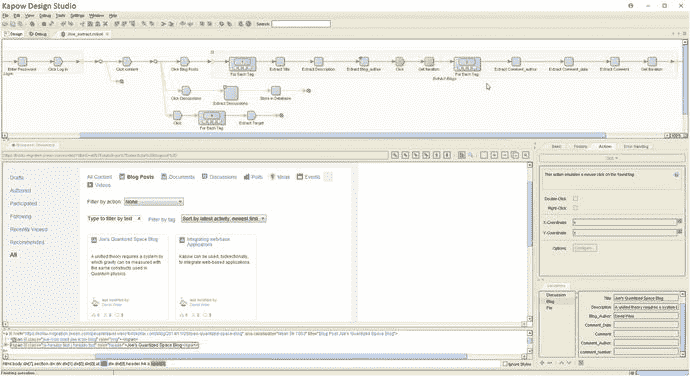

# 8.结束主题

现在，您已经准备好开始自己的 web 抓取项目了。本章最后提供了一些结尾主题。首先，我们提供了您可能希望在 web 抓取上下文中使用的其他有用工具和库的概述，然后是 web 抓取时要考虑的最佳实践和提示的总结。

## 8.1 其他工具

### 8.1.1 替代 Python 库

在本书中，我们一直在使用 Python 3 和 requests、Beautiful Soup 和 Selenium 库。请记住，Python 生态系统还提供了大量其他库来处理 HTTP 消息传递，如内置的“urllib”模块，我们也使用了其中的一些函数，但可以处理所有 HTTP、“httplib2”(参见 [`https://github.com/httplib2/httplib2`](https://github.com/httplib2/httplib2) )、“urllib3”(参见 [`https://urllib3.readthedocs.io/`](https://urllib3.readthedocs.io/) )、“grequests”(参见 [`https://pypi.python.org/pypi/grequests`](https://pypi.python.org/pypi/grequests) )和“aiohttp”(参见 [`http://aiohttp.readthedocs.io/`](http://aiohttp.readthedocs.io/) )。

如果您不想使用 Beautiful Soup，请记住，Beautiful Soup 库本身依赖于一个 HTML 解析器来执行大部分批量解析工作。因此，如果您愿意，也可以直接使用这些低级解析器。Python 中的“html.parser”模块提供了这样一个解析器，我们已经将它用作漂亮的 Soup 的“引擎”,但是它也可以直接使用,“lxml”和“html5lib”是流行的替代方法。有些人最终更喜欢这种方法，因为可以认为漂亮的汤所增加的额外开销会导致速度变慢。这是真的，尽管我们发现在大多数情况下，在刮擦速度成为真正的问题之前，您必须首先处理其他问题，例如，建立一个并行刮擦机制。

### 8.1.2 瘙痒

除了我们到目前为止提到的那些，Python 生态系统中还有其他值得注意的抓取库。Scrapy(参见 [`https://scrapy.org/`](https://scrapy.org/) )是一个综合性的 Python 库，用于抓取网站和从网站中提取结构化数据，也是相当流行的。它处理 HTTP 和 HTML 方面的事情，并提供一个命令行工具来快速设置、调试和部署 web 爬虫。Scrapy 是一个强大的工具，也值得学习，尽管它的编程接口与 requests 和 Beautiful Soup 或 Selenium 有些不同——尽管根据您所学的知识，这应该不会对您造成太多问题。特别是在您必须编写一个健壮的 crawler 的情况下，看一看 Scrapy 会很有用，因为它为重启脚本、并行爬行、数据收集等提供了许多合理的默认设置。使用 Scrapy 的主要优势是非常容易在“Scrapy Cloud”(见 [`https://scrapinghub.com/scrapy-cloud`](https://scrapinghub.com/scrapy-cloud) )这个运行网络爬虫的云平台中部署抓取器。如果你想在一堆服务器上快速运行你的 scraper 而不需要你自己托管这些服务器，这是很有帮助的，尽管注意这个服务是有代价的。另一种选择是在亚马逊 AWS 或谷歌的云平台上设置你的抓取器。Scrapy 的一个显著缺点是它没有模拟一个完整的浏览器堆栈。因此使用这个库处理 JavaScript 会很麻烦。确实存在一个将“Splash”(一种 JavaScript 渲染服务)与 Scrapy 结合起来的插件，尽管这种方法设置和维护起来有点麻烦。

### 缓存

缓存是要讨论的另一个有趣的方面。到目前为止，我们还没有谈到很多关于缓存的内容，尽管记住在构建 web 抓取器时实现一些客户端缓存解决方案是一个好主意，这将把获取的网页保存在它的“内存”中这避免了一次又一次地不断向 web 服务器发送请求，这在脚本开发期间尤其有用(您经常会重新启动脚本来查看是否已经修复了一个 bug，是否得到了您期望的结果，等等)。在这种情况下，一个非常有趣的库是 CacheControl(参见 [`http://cachecontrol.readthedocs.io/en/latest/`](http://cachecontrol.readthedocs.io/en/latest/) )，它可以简单地通过 pip 安装并直接与请求一起使用，如下所示:

```py
import requests
from cachecontrol import CacheControl

session = requests.Session()
cached_session = CacheControl(session)
# You can now use cached_session like a normal session
# All GET requests will be cached

```

### 8.1.4 代理服务器

您还可以在您的开发机器上设置一个本地 HTTP 代理服务器。HTTP 代理服务器充当 HTTP 请求的中介，如下所示:客户端(web 浏览器或 Python 程序)发送 HTTP 请求，尽管现在不是通过联系互联网上的 web 服务器，而是首先将其发送到代理服务器。根据代理服务器的配置，它可能决定在将请求发送到真正的目的地之前修改请求。

使用 HTTP 代理服务器很方便的原因有很多。首先，大多数代理服务器都包括检查 HTTP 请求和回复的选项，因此它们在浏览器的开发工具之上提供了一个可靠的附加组件。第二，大多数代理服务器可以配置为启用缓存，将 HTTP 回复保存在它们的内存中，这样就不必为后续的类似请求多次联系最终目的地。最后，代理服务器也经常用于匿名的原因。注意，目标 web 服务器将看到一个来自 HTTP 代理服务器的 HTTP 请求，它不一定需要在本地开发机器上运行。因此，它们还被用作规避 web 抓取缓解技术的手段，如果 web 服务器看到太多来自同一台机器的请求，您可能会被阻止。在这种情况下，您可以为提供 HTTP 代理服务器池的服务付费(例如，参见 [`https://proxymesh.com/`](https://proxymesh.com/) )，也可以使用 Tor(参见 [`https://www.torproject.org/`](https://www.torproject.org/) )等匿名服务，这是免费的，但主要是为了提供匿名性，可能不太适合 web 抓取工具，因为 Tor 往往相对较慢，许多 web 抓取缓解措施还会保留 Tor“出口点”列表并阻止它们。对于一些稳固的 HTTP 代理服务器实现，看看 Squid ( [`http://www.squid-cache.org/`](http://www.squid-cache.org/) )或者 Fiddler ( [`https://www.telerik.com/fiddler`](https://www.telerik.com/fiddler) )。

### 8.1.5 其他编程语言中的抓取

从 Python 转移到其他语言，很高兴知道 Selenium 还为许多其他编程语言提供了库，Java 是该项目的其他主要目标之一。如果您正在使用 R——数据科学的另一种流行语言——一定要看看“rvest”库(参见 [`https://cran.r-project.org/web/packages/rvest/`](https://cran.r-project.org/web/packages/rvest/) ),它的灵感来自于 Beautiful Soup 等库，使从 R 中抓取 HTML 页面的数据变得很容易。最近，人们越来越关注 JavaScript，这种语言作为服务器端脚本语言也变得越来越可行，这也催生了许多针对这种语言的强大的抓取库。PhantomJS 在这里已经成为一个非常受欢迎的选择(参见 [`http://phantomjs.org/`](http://phantomjs.org/) )，它模拟了一个完整的“无头”浏览器(也可以在 Selenium 中用作“驱动程序”)。由于 PhantomJS 代码可能有点冗长，所以已经提出了其他的库，比如 Nightmare(参见 [`http://www.nightmarejs.org/`](http://www.nightmarejs.org/) )，它们在 PhantomJS 之上提供了一个更加用户友好的高级 API。这个领域中其他有趣的项目是 SlimerJS(参见 [`https://slimerjs.org/`](https://slimerjs.org/) )，它类似于 PhantomJS，只是它运行在 Gecko(Mozilla Firefox 的浏览器引擎)上，而不是 Webkit 上。CasperJS 是另一个高级库(见 [`http://casperjs.org/`](http://casperjs.org/) )，可以在 PhantomJS 或 SlimerJS 之上使用。另一个有趣的近期项目是 Puppeteer(参见 [`https://github.com/GoogleChrome/puppeteer`](https://github.com/GoogleChrome/puppeteer) )，这是一个提供高级 API 来控制无头 Chrome web 浏览器的库。受 PhantomJS 流行的推动，Chrome 的开发者正在花费大量精力提供一个无头版本的浏览器。到目前为止，大多数依赖完整浏览器的 web 抓取器的部署要么使用 PhantomJS，它已经是无头的，但与真正的浏览器略有不同；或者将 Firefox 或 Chrome 驱动程序与虚拟显示器结合使用，例如在 Linux 上使用“Xvfb”。现在，一个真正的无头版本的 Chrome 变得越来越稳定，它正在成为 PhantomJS 的有力竞争者，特别是因为它也可以使用这种无头 Chrome 设置作为 Selenium 的驱动程序。PhantomJS 的前维护者 Vitaly Slobodin 已经声明“人们最终会转向它。Chrome 比 PhantomJS 更快更稳定。而且它不会像疯了一样吃内存。”2018 年 3 月，PhantomJS 的维护者宣布该项目将停止接收进一步的更新，敦促用户转而使用木偶师(见 [`https://github.com/ariya/phantomjs/issues/15344`](https://github.com/ariya/phantomjs/issues/15344) )。将 Puppeteer 与 Python 和 Selenium 一起使用仍然有点“尖端”，但确实有效。如果你对这种方法感兴趣，可以看看 [`https://intoli.com/blog/running-selenium-with-headless-chrome/`](https://intoli.com/blog/running-selenium-with-headless-chrome/) 。

### 命令行工具

还值得一提的是，在调试 web 抓取器和与 HTTP 服务器的交互时，有许多有用的命令行工具可以派上用场。HTTPie(参见 [`https://httpie.org/`](https://httpie.org/) )是一个命令行工具，具有漂亮的输出和对表单数据、会话和 JSON 的支持，使得该工具在调试 web APIs 时也非常有用。

“cURL”是另一个更老的命令行工具，虽然功能非常丰富和健壮，但它支持的不仅仅是 HTTP(参见 [`https://curl.haxx.se/`](https://curl.haxx.se/) )。这个工具与 Chrome 的开发者工具配合得特别好，因为你可以右键单击“网络”标签中的任何请求，然后选择“复制为 cURL”这将把一个命令放到你的剪贴板上，你可以把它粘贴到一个命令行窗口中，它将执行与 Chrome 完全相同的请求，并且应该为你提供相同的结果。如果您陷入了一个困难的调试会话，检查这个命令可能会给出一个提示，告诉您 Python 脚本中没有包含哪个头或 cookie。

### 8.1.7 图形刮擦工具

最后，我们还需要谈一点关于图形抓取工具。这些既可以作为独立程序提供，也可以通过浏览器插件提供。其中一些是免费提供的，如 Portia ( [`https://portia.scrapinghub.com`](https://portia.scrapinghub.com/) )或 Parsehub ( [`https://www.parsehub.com`](https://www.parsehub.com) )，而其他的，如 Kapow ( [`https://www.kofax.com/data-integration-extraction`](https://www.kofax.com/data-integration-extraction) )、Fminer ( [`http://www.fminer.com/`](http://www.fminer.com/) )和席德( [`https://dexi.io/`](https://dexi.io/) )是商业提供的。这些工具的功能集略有不同。有些人会关注他们产品的用户友好性。“只要给我们一个网址，我们就会得到有趣的数据，”就像变魔术一样。这很好，但是基于您到目前为止所看到的，您将能够以更健壮(甚至可能更快)的方式复制相同的行为。正如我们所见，获取表格和链接列表很容易。通常，一旦页面中包含的数据以不太直接的方式构造，或者当页面依赖于 JavaScript 时，这些工具将无法工作。价格较高的产品会更加强劲。这些工具通常还会模拟一个完整的浏览器实例，并允许您使用面向工作流的方法通过拖放和配置各种步骤来编写一个 scraper。图 [8-1](#Fig1) 是 Kapow 的截图，采取了这样的做法。这已经很好了，尽管它也有一些缺点。首先，这些产品中的许多都非常昂贵，这使得它们不太适合实验、概念验证或较小的项目。第二，元素通常是基于用户简单地点击他们想要检索的项目来从页面中检索的。后台发生的事情是，将构造一个 CSS 选择器或 XPath 规则，匹配所选的元素。这本身很好(我们也在脚本中这样做了)，尽管注意程序在微调这个规则方面不如人类程序员聪明。在许多情况下，会构建一个非常细粒度的特定规则，一旦站点返回的结果结构稍有不同或者对网页进行了更新，该规则就会失效。就像用 Python 编写的刮刀一样，你必须记住，你仍然需要维护你的刮刀集合，以防你希望在更长的时间内使用它们。图形工具不能为您解决这个问题，甚至会导致抓取器更快地失败，因为构建的底层“规则”可能非常具体。许多工具将允许您手动更改选择器规则，但是要这样做，您必须了解它们是如何工作的，并且采用面向编程的方法可能会很快变得更有吸引力。最后，在我们使用这些工具的经验中，我们也注意到它们包含的浏览器堆栈并不总是那么健壮或最新的。我们已经看到各种各样的情况，内部浏览器在面对大量 JavaScript 页面时崩溃。



图 8-1

An example of a graphical web scraping tool

## 8.2 最佳实践和技巧

在不同的场合，我们在本书中提供了一些提示。通过以下概述，我们提供了一个最佳实践列表，以总结您在构建 web 抓取工具时应该记住的内容:

*   首先使用 API:总是首先检查你希望抓取的站点是否提供 API。如果它不能，或者它不能提供你想要的信息，或者它应用了速率限制，那么你可以选择一个 web scraper。
*   不要手动解析 HTML:使用一个解析器，比如 Beautiful Soup，而不是试图手动或使用正则表达式来解开这个汤。
*   友好地对待:不要用数百个 HTTP 请求敲打一个网站，因为这最终很有可能让你被屏蔽。考虑联系网站的站长，想出一个合作的办法。
*   考虑用户代理和推荐人:记住“用户代理”和“推荐人”头。许多网站会检查这些以防止抓取或未经授权的访问。
*   Web 服务器很挑剔:无论是 URL 参数、标题还是表单数据，一些 web 服务器对它们的顺序、存在和值都有非常挑剔和奇怪的要求。有些甚至可能偏离 HTTP 标准。
*   检查你的浏览器:如果你不知道哪里出了问题，从一个新的浏览器会话开始，使用你的浏览器开发工具继续一个正常的 web 会话——最好是以“匿名”或“私人浏览”窗口打开(确保你从一组空的 cookies 开始)。如果一切顺利，您也应该能够模拟相同的行为。请记住，您可以使用“curl”和其他命令行工具来调试困难的情况。
*   在使用完整的 JavaScript 引擎之前，先考虑内部 API:在使用 Selenium 等更高级的解决方案之前，检查浏览器的网络请求，看看是否可以直接访问 JavaScript 使用的数据源。
*   假设它会崩溃:网络是一个动态的地方。请确保以这样一种方式编写您的刮板，当出现问题时，它们可以提供早期和详细的警告。
*   爬行是困难的:当编写一个高级的爬行器时，您将很快需要合并一个数据库，处理重启脚本、监控、队列管理、时间戳等等，以创建一个健壮的爬行器。
*   验证码呢:如果一个页面显示一个验证码(完全自动化的公共图灵测试来区分计算机和人类)，这基本上是一种宣布不欢迎抓取器的方式。然而，有办法解决这个问题。一些网站提供“验证码求解 API”(背后有真实的人，例如， [`http://www.deathbycaptcha.com`](http://www.deathbycaptcha.com) )，以合理的价格提供快速求解时间。一些现实生活中的项目已经使用 OCR 软件，例如 Tesseract(参见 [`https://github.com/tesseract-ocr`](https://github.com/tesseract-ocr) 和 [`http://resources.infosecinstitute.com/case-study`](http://resources.infosecinstitute.com/case-study-cracking-online-banking-captcha-login-using-python/) [`-cracking-online-banking-captcha-login-using-python/`](http://resources.infosecinstitute.com/case-study-cracking-online-banking-captcha-login-using-python/) 作为示例用例)来构建验证码求解器。你还会发现深度学习实现来解决验证码，例如，使用卷积神经网络(参见，例如， [`https://medium.com/towards-data-science/deep-learning-drops-breaking-captcha-20c8fc96e6a3`](https://medium.com/towards-data-science/deep-learning-drops-breaking-captcha-20c8fc96e6a3) ， [`https://medium.com/@ageitgey/how-to-break-a-captcha-system-in-15-minutes-with-machine-learning-dbebb035a710`](https://medium.com/@ageitgey/how-to-break-a-captcha-system-in-15-minutes-with-machine-learning-dbebb035a710) 或 [`http://www.npr.org/sections/thetwo-way/2017/10/26/560082659/ai-model-fundamentally-cracks-captchas-scientists-say`](http://www.npr.org/sections/thetwo-way/2017/10/26/560082659/ai-model-fundamentally-cracks-captchas-scientists-say) 关于这个主题的最近故事)。验证验证码是仅在多次请求后出现还是随机出现也是一个好主意，在这种情况下，您可以实施后退或冷却策略，只需等待一段时间，然后再次尝试。提供关于如何使用自动化方法破解 CAPTCHA 的详尽概述超出了本工作的范围，尽管下一章的最后一个示例提供了一些指导，让您开始使用深度学习来破解它们。
*   有些工具是有用的，有些则没有:有很多公司提供“云抓取”解决方案，比如 Scrapy。使用它们的主要好处是，您可以利用它们的服务器群来快速并行化一个 scraper。然而，不要太相信昂贵的图形抓取工具。在大多数情况下，它们只能处理基本页面，不能处理 JavaScript，或者会导致构建一个可能工作的抓取管道，但使用非常细粒度和特定的选择器规则，这将在网站稍微改变其 HTML 时中断。
*   抓取是一场猫捉老鼠的游戏:有些网站为了防止抓取，走得很远。一些研究人员研究了 Selenium 或浏览器(如 PhantomJS)与普通浏览器的不同之处(通过检查它们的头文件或 JavaScript 功能)。绕过这些检查是有可能的，但是会有一个点，在这个点上刮一个特定的站点会变得非常困难。例如，参见 [`https://blog.shapesecurity.com/2015/01/22/detecting-phantomjs-based-visitors/`](https://blog.shapesecurity.com/2015/01/22/detecting-phantomjs-based-visitors/) 中关于检测基于幻像的访问者的有趣概述，或者 [`https://intoli.com/blog/making-chrome-headless-undetectable/`](https://intoli.com/blog/making-chrome-headless-undetectable/) 中关于无头 Chrome 的类似概述。即使在通过 Selenium 使用 Chrome 时，也有专门的解决方案试图识别非人类的模式，例如滚动、导航或单击太快，总是在元素的中间位置单击，等等。在您的项目中，您不太可能会遇到很多这样的情况，但是请记住这一点。
*   请记住管理和法律问题，以及 web 抓取在您的数据科学过程中的位置:如前所述，考虑 web 抓取带来的数据质量、健壮性和部署挑战。同样，请记住，当你开始依赖网络抓取或开始滥用它时，可能会出现潜在的法律问题。