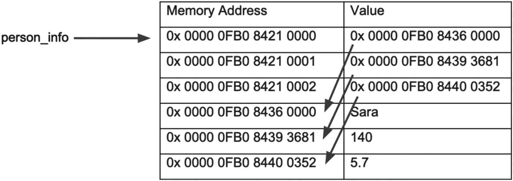
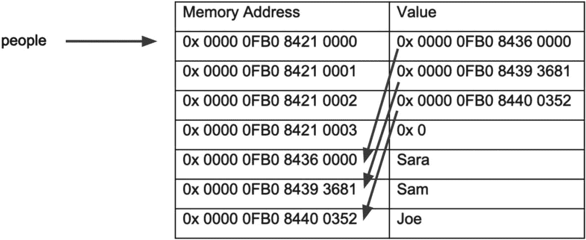
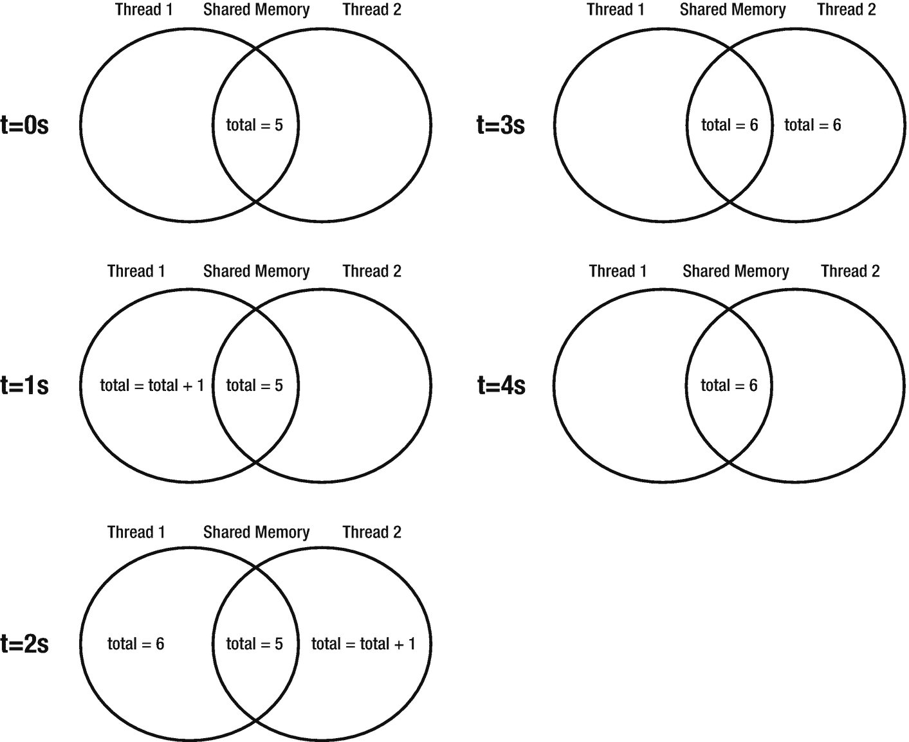
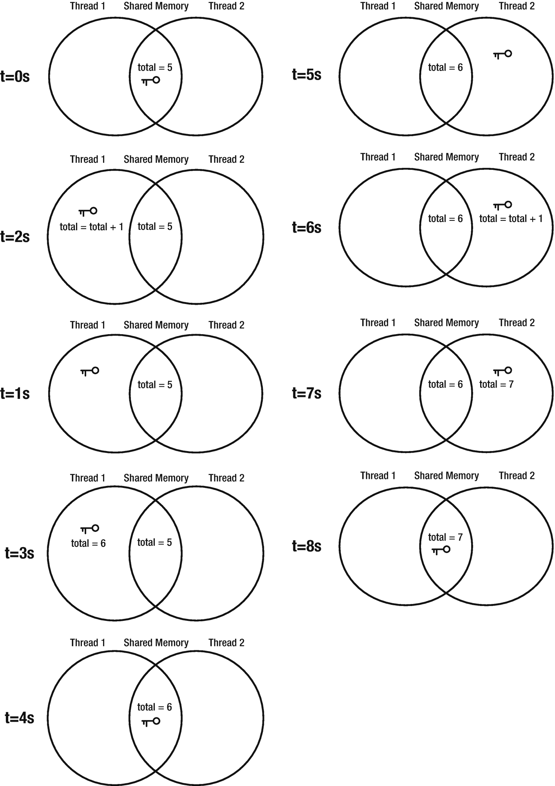
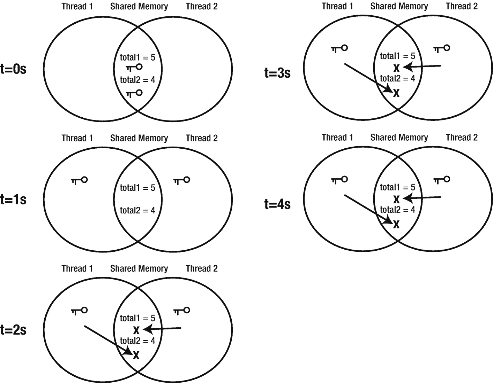

# 三、Pandas 如何在背后工作

与任何编程语言一样，理解底层发生的事情很重要，因为这有助于您编写更显式、更简单、性能更好且正确的代码。一种语言的构建块(它的数据结构和 API)在正确使用时会使操作变得微不足道，而在不正确使用时会使操作变得过于复杂，甚至不可能。Python 包也不例外。

编程语言是简单的文本，易于人类读写，可以翻译成机器可以理解的 CPU 指令。随着编程语言变得越来越高(离计算机理解的机器代码越来越远)，开发人员理解翻译的必要性变得不那么重要了。然而，这样做的一个副产品是，软件可以用非性能和非典型的方式编写，而开发人员不必被迫解决底层问题。现代计算平台上的非高性能解决方案通常在被扩展到能够处理更多数据之前不会表现出明显的非高性能。大数据软件通常在性能影响明显的规模上运行，因为它处理巨大的数据集，经常多次重复一个小的快速操作，其性能变得非常重要。在这种规模下工作时，理解可用的数据结构和性能优化非常重要，这样才能以最少的工作获得最大的价值。这从理解你正在使用的语言中的数据结构的性能开始。

## Python 数据结构

Python 的数据结构是它的构建模块。为您试图解决的问题选择正确的数据结构对于编写正确且高性能的代码至关重要。

首先，我们来看看元组。它们在许多方面类似于 C 数组，实际上是一个底层数组。它们是可迭代的，这意味着您可以遍历它们并查看每个值，尽管它们是不可变的，这意味着一旦创建了元组，这些值就不能更改。它们非常擅长存储相关信息的静态块，比如元数据。当一个小的元组在程序中不再被引用，并且它的内存可以被释放时，Python 会保留它，并将其添加到元组空闲列表中，以便可以再次使用。这节省了解释器的时间，因为它不必为新的元组重新分配内存。在底层，元组转化为固定大小的数组，这意味着指针数组的大小不能改变。清单 [3-1](#PC1) 展示了一个元组的代码示例，图 [3-1](#Fig1) 展示了它在内存中的表示。在清单 [3-1](#PC1) 中，每个索引表示为内存地址 0x0000 0FB0 8421 0000 到 0002。每个索引处的值是一个内存地址或指向内存中实际值的指针。这就是 Python 能够将不相似的类型存储到同一个底层数组对象中的方式。元组的每个地址或索引包含一个指针，只需为指针而不是实际值腾出空间。



图 3-1

内存中列表 [3-1](#PC1) 的表示

```py
person_info = ("Sara", 140, 5.7)

Listing 3-1Example tuple

```

简单地说，列表是一个可变的元组。列表是一个固定大小的数组，但是当元素数量超过 Python 最初分配的大小时，它会创建一个新的固定大小的数组，为更多的元素留出空间，并将旧数组中的元素复制到新数组中。分配的大小是基数 2，所以如果你初始化一个有五个值的列表，Python 下面将分配固定大小的数组来保存八个引用。如果再追加四个值，在第四次追加时，固定大小的数组将被重新分配为两倍大小(16)，以前的值引用将被复制到新数组中，包括不适合以前大小为 8 的数组的新的第四个值引用。与元组不同，它们没有任何后台性能优化来重用释放的内存。这是因为列表是可变的——这意味着它们的值在创建后可以改变，并且它们的大小不是固定的。列表 [3-2](#PC2) 展示了一个列表的例子，图 [3-2](#Fig2) 展示了它在内存中的表现。就像元组一样，列表包含对值的引用，而不是值本身。注意由于列表是用三个值初始化的，下面的固定大小数组的长度是 4，所以在索引 3(元素 4)处，有一个 0x0 的空占位符值。



图 3-2

内存中列表 [3-2](#PC2) 的表示

```py
people = ["Sara", "Sam", "Joe"]

Listing 3-2Example list

```

字典是一个散列表。这些键被散列到内存地址或数组中的特定索引。根据字典中键的数量，使用一定数量的散列位来确定索引。清单 [3-3](#PC3) 显示了一个示例字典，并说明了它在内存中的表示。在清单 [3-3](#PC3) 的例子中，使用了 2 位，因为只有两个元素。散列数组中的值是第二个数组的索引，第二个数组包含完整的散列、键和字典中的键值。注意，散列索引数组中的每个元素只占用 64 个字节(一个指针的大小),相比之下，数据数组占用的字节要多得多，因为它包括散列、键和值。通过为数据数组保留一个单独的索引数组，字典实现能够通过使用较小的散列索引数组而不是较大的数据数组作为未使用的键的占位符来节省内存空间。它还能够根据需要增加散列索引数组，类似于随着更多元素的插入而增加列表，而不是为不存在的散列索引分配大量内存。注意，当哈希位数增加时，哈希索引数组可以完全重新初始化，与数据数组无关。还要注意，由于这个实现，字典键现在按照数据数组中的插入时间排序，从 Python 3.7 开始，字典键现在保证按照插入顺序排序。

```py
word_alphabet = {"a": "apple", "b": "banana"}
Hash-Index            Data
None                  hash("a"), "a", "apple"
0                     hash("b"), "b", " banana"
1
None

Listing 3-3Example dictionary and its representation in memory

```

集合与字典的实现基本相同，只是没有值。它们是一种用于跟踪成员资格的数据结构，执行数学集合论中的几乎所有运算，如并和交。清单 [3-4](#PC4) 显示了一个示例集以及它在内存中的表示方式。

```py
alphabet = {"a", "b"}
Hash-Index           Data
None                 hash("a"), "a"
0                    hash("b"), "b"
1
None

Listing 3-4Example set and its representation in memory

```

还有许多其他数据结构，包括整数、浮点、布尔和字符串。这些基本上直接转化为它们下面的 c 型等价物，不值得在这里赘述。值得一提的是，其中一些在 Python 中有特殊的内置缓存。

Python 有一个字符串和整数缓存。以清单 [3-5](#PC5) 中的 str1 和 str2 为例。它们都被设置为值“foo ”,但是在下面它们指向相同的内存位置。这意味着不是创建一个与 str1 完全相同的新字符串并复制内存，新字符串只是指向现有的字符串值。这里的断言行演示了这一点，其中“is”属性用于比较两个字符串的引用或指针是否相等。

```py
str1 = "foo"
str2 = "foo"
assert(str1 is str2)

Listing 3-5str1 and str2 are pointing to the same memory location

```

然而，字符串缓存只对包含字母、数字和下划线的字符串有效。在处理可能包含其他字母的大型数据集时，了解这一点很有好处。通过消除数据集中阻止字符串缓存的字符串值中的字符，可以节省大量内存。参见清单 [3-6](#PC6) 。

```py
str1 = "foo bar"
str2 = "foo bar"
assert(str1 is not str2)

Listing 3-6str1 and str2 are not pointing to the same memory location

```

整数缓存以类似的方式工作；它只缓存介于-5 和 256 之间的整数。参见清单 [3-7](#PC7) 。

```py
int1 = 22
int2 = 22
int3 = 257
int4 = 257
assert(int1 is int2)
assert(int3 is not int4)

Listing 3-7int1 and int2 are pointing to the same memory location but int3 and int4 are not

```

同样，知道这一点也是有好处的，例如，将一列大数字分成两列来表示科学记数法中的数字，可以节省内存。

## CPython 解释器、Python 和 NumPy 的性能

大多数开发人员通常安装的 Python 解释器称为 CPython。它是推荐与 pandas 一起使用的解释器，因为 pandas 在性能优化方面高度依赖于 C。CPython 是用 C 实现的，它将 Python 代码翻译成所谓的字节码，这是一种运行在 Python 虚拟机上的中间低级格式。有许多不同的 Python 解释器，包括 Jython、IronPython 和 PyPy，它们分别用 Java、C#和 RPython(Python 的一个受限子集)实现。PyPy 是一个即时或 JIT 编译器，这意味着它在运行时将 Python 代码编译成机器代码。这与 CPython 相反，CPython 在 Python 虚拟机上运行字节码并调用预编译的 C 扩展。PyPy 通常比 CPython 快，因为它运行低级别的优化机器代码，而不是在 Python 虚拟机上解析字节码。不幸的是，PyPy 目前并不完全支持 Pandas。

Python 是一种高级语言，这意味着它易于阅读，实现速度快。这也意味着由于所有这些自我管理的细节，它比一些低级语言要慢。这些细微之处包括垃圾收集器、全局解释器锁和动态类型，但它们不是免费的。垃圾收集器负责释放不再使用的内存，以便可以再次使用。全局解释器锁，也称为 GIL，保护对象不被多个线程同时访问。动态类型允许同一个变量保存不同类型的值。因为 CPython 是用 C 实现的，所以它与 C 兼容，从而允许 Python 调用用 C 编写的更高性能的扩展。但是为什么 C 比 Python 性能高这么多呢？Python 相对比 C 慢有几个原因；它是解释的而不是编译的，它有一个全局解释器锁，它允许动态类型，它有一个内置的垃圾收集器。

将 Python 解释成字节码就像将 C 编译成目标文件一样，只是字节码在 Python 虚拟机上运行，而机器码在 CPU 上运行。Python 代码在运行时的解释增加了额外的开销，这使得 Python 通常比 c 运行得慢。解释有几个阶段:将 Python 代码转换为令牌流的令牌化器，运行语法分析的词法分析器，优化 Python 代码并将其转换为字节码的字节码生成器。pyc 文件)，以及解释字节码流并维护字节码解释器状态的字节码解释器。

如果你曾经编辑过一个 Python 文件并重新运行你的程序，却发现它没有按照你刚才所做的修改运行，你就会明白 Python 解释器把字节码缓存在。pyc 文件。正在删除。重新运行前的 pyc 文件迫使解释器将 Python 代码重新解释为字节码——本质上，迫使 Python 解释器清除其字节码缓存。字节码缓存通过不将 Python 代码重新解释为字节码来减少运行时解释的开销，除非 Python 代码发生了变化。但是，在 3.3 之前的 Python 版本中，用于获取。py 文件与 windows 操作系统时间戳不匹配，导致时间戳比。pyc 文件。这意味着解释器没有重新解释。py 文件转换成字节码。同样，如果您移除了一个. py 文件，但仍然在代码中导入它，导入可能会继续进行，因为。pyc 文件仍然存在于您的系统中。虽然这两个问题可能会动摇您使用字节码缓存的意愿，但缓存在提高解释性能方面起着重要作用，并且通常在后台运行，开发人员对此一无所知。字节码缓存对于第三方库尤其有利，因为第三方库安装了代码并且不希望更改，或者库所有者不想公开 Python 源代码。

Python 有一个全局解释器锁，也就是众所周知的 GIL。为了理解 GIL 存在的原因，你真的需要回到过去，探索在 GIL 发明的时候计算机科学发生了什么。它始于线的发明。预见到计算的未来，软件在多核 CPU 之前引入了多线程的概念。线程化使程序能够在相同的内存空间上并行运行多个进程。这是一个改善 CPU 密集型计算性能的绝妙方法。

例如，假设我们想计算 Tiffany 这个名字在列表中出现了多少次。你可以自己计算 Tiffany 在列表中出现的次数，或者你可以将列表分成子列表，给每个朋友一个子列表，每次你们中的一个人看到 Tiffany 这个词，白板上的累计次数就增加一次。在这个例子中，你和你的朋友是线程，白板上的计数是共享内存。一般来说，将问题分解成更小的块并使用线程来并行化计算比在一个线程上计算整个问题要快。这里您可能会遇到的问题是，当您的一个朋友在白板上删除了总数，并在您希望更新的同时更新了总数。幸运的是，你足够聪明地意识到这种情况正在发生，并等到你的朋友完成更新总数后再尝试这样做。另一方面，计算机需要被告知如何处理这个问题，或者需要成为所谓的线程安全。如果一个软件遇到同样的情况，它将简单地挤压价值。这就是所谓的竞争条件。

在图 [3-3](#Fig3) 中，时间在 y 轴上表示为 t，并且有两个线程都希望在几乎相同的时间增加总数。本例中的 Total 位于共享内存中，这意味着两个线程都可以访问该值。这里可以看到，线程 1 首先递增计数器，然后是线程 2。然而，线程 2 实际上并不递增计数器，因为在它获取总数进行递增时，线程 1 的递增还没有生效。最终结果是总数比应该的少 1(6 而不是 7)。



图 3-3

线程 1 和线程 2 之间总增量的竞争条件演示

与这个运行 total 的例子类似，CPython 解释器使用引用垃圾收集器技术，跟踪引用一个对象的位置的数量。垃圾收集器负责跟踪已分配的内存，并在不再使用时将其释放。它通过保存引用程序中每个对象的所有位置的运行总数来做到这一点。当没有更多的引用时，意味着引用计数为零，然后释放内存，意味着它被释放并可用于存储其他内容。在清单 [3-8](#PC8) 中，string foo 的引用计数是 2，因为有两个变量引用它。

```py
ref1 = "foo"
ref2 = "foo"

Listing 3-8Example of creating two references to the string foo

```

回想一下这里的字符串缓存，正因为如此，ref1 和 ref2 都指向下面的同一个值。

当我们删除 ref2 时，string foo 的引用计数为 1，当我们删除 ref1 时，string foo 的引用计数为 0，内存可以被释放。清单 [3-9](#PC9) 展示了这一点。

```py
delete(ref2)       # reference count = 1 after this line executes
delete(ref1)       # reference count = 0 after this line executes

Listing 3-9Example of deleting references to foo that were created in Listing 3-8

```

并不是所有的对象在引用达到 0 时都会被释放，因为有些对象永远不会达到 0。以清单 [3-10](#PC10) 中呈现的场景为例，这种情况在使用 Python 中的类和对象时经常发生。在这个场景中，exec_info 是一个元组，第三个索引处的值是 traceback 对象。traceback 对象包含对框架的引用，但框架也包含对 exc_info 变量的引用。这就是所谓的循环引用，因为没有办法删除一个而不破坏另一个，所以这两个对象必须被垃圾收集。垃圾收集器会定期运行、识别和删除像这样的循环引用对象。

```py
import sys

try:
      raise Exception("Something went wrong.")
except Exception as e:
      exc_info = sys.exc_info()
      frame = exc_info[2].tb_frame # create a third reference

assert(sys.getrefcount(frame) == 3)
del(exc_info)
assert(sys.getrefcount(frame) == 3)

Listing 3-10Example of creating a circular reference

```

跟踪这些参考并不是免费的。每个对象都有一个占用空间的关联引用计数器，代码中的每个引用都要占用 CPU 周期来计算对象引用计数的适当增量或减量。如果将 Python 中对象的大小与 C 中对象的大小进行比较，这就是 Python 中对象的大小要大得多的部分原因，也是 Python 的执行速度比 C 慢的部分原因。这些额外的字节和额外的 CPU 周期部分是由于引用计数跟踪。虽然垃圾收集器确实会影响性能，但它也使 Python 成为一种简单的编程语言。作为开发人员，您不必担心跟踪内存分配和释放；Python 垃圾收集器为您完成了这项工作。

在多线程应用中，引用计数与图 [3-3](#Fig3) 中的总数有相同的问题。一个线程可能与另一个线程同时在共享内存空间中创建对一个对象的新引用，并且出现竞争情况，其中引用计数最终仅增加一次而不是两次。当这种情况发生时，它最终会导致对象在它应该被释放之前被从内存中释放出来(因为竞争条件会导致对象的引用计数增加 1 而不是 2)。在其他情况下，当引用计数器递减时存在竞争条件时，这可能会导致内存泄漏，因为引用计数比它应该的值大 1，所以内存永远不会被销毁。因此，正如您在这里看到的，运行多线程应用程序不仅会对程序操作的数据产生影响，还会对 Python 解释器本身产生影响。

传统上，竞争条件是通过锁来解决的。这实际上是你在下意识地做的事情——也就是说，在你自己更新总数之前，等待你的朋友完成更新。在软件中，这是通过共享内存锁来实现的。当一个线程需要更新总数时，它获取锁，更新总数，然后释放锁。同时，另一个线程等待锁被释放，获取锁，然后也更新总数。这种相互作用如图 [3-4](#Fig4) 所示。



图 3-4

线程 1 和线程 2 之间共享的总锁的演示

这太棒了！我们已经解决了问题！或者我们有吗？考虑图 [3-5](#Fig5) 中的场景，其中有两个锁和两个总数。



图 3-5

线程 1 和线程 2 之间的死锁演示

图 [3-5](#Fig5) 就是所谓的死锁。当两个线程需要执行多条数据，但它们以不同的顺序请求它们时，就会发生这种情况。为了完全避免这类问题，Python 的作者在线程级别实现了一个锁，在任何给定时间只允许一个线程运行。这是解决这个问题的一个简单而优雅的方法。当时，由于多核 CPU 并不常见，它并没有真正影响性能，因为在 CPU 中，这些线程的指令无论如何都会串行运行。然而，随着计算机变得越来越先进，计算变得越来越密集，多核 CPU 已经成为几乎所有现代计算平台的标准。当涉及运行大量 CPU 密集型计算的大数据时，不利用多核 CPU 意味着在某些情况下根本无法运行计算(至少在合理的时间内)。那么如何才能突破 GIL，真正运行多核大数据计算呢？

用 C 而不是 Python 编写的 C 扩展不受 GIL 的约束。pandas 是基于 NumPy 构建的，NumPy 是一个围绕 C 扩展的 Python 包装器，负责所有繁重的计算工作。这意味着使用 pandas 时所有的密集计算都是在 C 中完成的，由于语言的特性，C 中的计算通常会更快。这也意味着 pandas 能够突破 GIL，真正在多个内核上同时运行多核计算。

因为 NumPy 用 C 运行计算，所以它必须将所有 Python 对象转换成 C 兼容的类型。根据 NumPy 文档，只要数组的类型可以转换为 C 类型，GIL 就会在计算之前释放。这意味着当使用 NumPy 时，对可转换为 C 类型的类型进行操作是很重要的。如果对 NumPy 无法转换为 C 的 Python 对象进行操作，则该操作无法在 C 中计算结果。它必须保留在 Python 中，在计算完成之前，GIL 不能被释放。

附录展示了 Python 中的类型到 NumPy 在其 C 扩展中使用的类型(称为标量)的详细映射。所有的 NumPy 类型都被称为 NumPy API 中的 dtypes，并作为 NumPy 库的属性提供。

NumPy 的主要数据结构是一个 N 维数组或 ndarray。这是一个处理 Python-C 边界的特殊数组结构。值得注意的是，NumPy 中的 ndarrays 是同构的，这意味着所有元素都具有相同的类型。这又与 Python 和 C 有关。C 是一种低级语言，开发人员必须自己管理内存分配和释放，它不允许动态类型。对于 C 语言中的数组，所有元素必须具有一致且已知的大小或类型，以便为 C 语言中的输入数据数组和输出数据数组分配适当的内存量，清单 [3-11](#PC11) 显示了一个如何在 C 语言中创建浮点数组的示例，注意内存必须使用 malloc 显式分配，其大小固定为 100，仅足够容纳 100 个浮点。

```py
float* array = (float*) malloc(100 * sizeof(float));

Listing 3-11Allocating memory for an array of 100 floats in C

```

NumPy 使用清单 [3-12](#PC12) 中所示的 ndarray 构建一个固定大小的数组，其中 dtype 用于指定数组中每个元素的类型或者数组中每个元素将占用多少内存。回想一下上一节，Python 的 list 实现是一个动态数组。与 ndarray 相反，Python 的列表类型通过为指向数据的指针而不是数据本身分配空间来处理任何大小的元素。这导致 Python 列表比 ndarray 占用更多的内存，因为存在一个间接层，这是因为列表保存的是指向数据的指针，而不是数据本身。总之，ndarrays 有固定的长度，每个元素都有相同的类型，而 Python 的 list 类型有动态的长度，元素可以是许多不同的类型。这是一个重要的区别，也是为什么 pandas 中的每一列都被分配了一个特定的数据类型。这也是为什么确保 pandas 具有特定列的正确类型是很重要的，以及为什么规范化您的数据以便分配一个类型而不是所有包含的对象类型是很重要的。图 [3-6](#Fig6) 显示了在清单 [3-12](#PC11) 中创建的 ndarray 是如何在内存中表示的。

```py
import numpy as np
groups_waiting_for_a_table = np.ndarray(
     (3,0),
     buffer=np.array([4, 7, 21], dtype=np.uint8),
     dtype=np.uint8,
)

Listing 3-12ndarray of three unsigned 8-bit ints

```


图 3-6

内存中列表 [3-12](#PC12) 的表示。将此与图 [3-2](#Fig2) 进行比较

CPython 解释器提供了一个 C-API，它公开了获取和释放 GIL 的能力。NumPy 使用宏 NPY_BEGIN_THREADS 和 NPY_END_THREADS 来表示 C 代码何时能够在没有 GIL 的情况下运行。NumPy 数学运算是通用函数的实例，被称为 ufunc，用 C 实现，它们都调用这些宏。请参见附录中的常见 ufuncs 列表。

回想一下，在没有 GIL 的情况下运行意味着程序现在可以同时在多个内核上执行指令。这意味着使用 NumPy 时密集的数学运算能够打破计算 Tiffany 在列表中出现多少次的例子，在 C 级使用多线程。虽然 NumPy 本身通常不实现多线程计算(简单地在 C 中运行计算本身就足以提高性能)，但当与 NumPy 结合使用时，还有其他库可以实现多线程计算。

当 NumPy 被编译为使用基本线性代数子例程(称为 BLAS)或线性代数包(称为 LAPACK)时，它会根据内存缓存的大小和系统上可用的内核数量来运行操作。通过根据机器上的资源优化计算，NumPy 能够以比其他方式更快的速度运行计算。BLAS/LAPACK 有几种不同的实现方式，包括 OpenBLAS、ATLAS 和 MKL。我们将在后面的章节中更详细地探讨这些库是如何提高性能的，但现在，只要知道它们的存在，对于大型计算，它们可以在性能上产生巨大的差异。

## Pandas 表演介绍

pandas 是 NumPy 的包装器，NumPy 是 C 的包装器；因此，pandas 的性能来自于用 C 语言而不是 Python 来运行。这个概念是你在 Pandas 身上所做的一切的基础。当你在 C 时，你很快，当你在 Python 时，你很慢。 <sup>[1](#Fn1)</sup>

在处理 pandas 数据帧时，与处理 NumPy 数组相同的要求也适用——也就是说，Python 代码必须可翻译成 C 代码；这包括保存数据的类型和对数据执行的操作。表 [3-1](#Tab1) 是 Pandas 类型到 Pandas 类型的表。请注意，datetimes 和 timedeltas 不会转换为 NumPy 类型。这是因为 C 没有 datetime 数据结构，所以在必须对 datetime 数据进行操作的情况下，将 datetime 转换为自 epoch 以来的整数类型的秒会更有效。

表 3-1

Pandas 到 NumPy 类型

<colgroup><col class="tcol1 align-left"> <col class="tcol2 align-left"></colgroup> 
| 

Pandas 类型

 | 

NumPy 型

 |
| --- | --- |
| 目标 | unicode_string_ |
| int64 | int_， int8， int16， int32， int64， uint8， uint16， uint32， uint64 |
| float64 | 浮动 _，浮动 16，浮动 32，浮动 64 |
| 弯曲件 | 布尔 _ |
| 日期时间 64 | 日期时间 64[ns] |
| 时间间隔[ns] | 钠 |
| 种类 | 钠 |

请注意，category 也不能翻译成 c。category 类似于 tuple，因为它旨在保存分类变量的集合，这意味着元数据具有一组固定的唯一值。因为它不能翻译成 C 语言，所以永远不应该用来保存需要分析的数据。它的优势主要在于它能够高效、简单地按照自定义的排序顺序对事物进行排序。在它下面看起来像一个索引的数据数组，其中索引对应于一个类别数组中的唯一值。文档声称使用字符串类别可以节省大量内存。当然，从上一节中我们知道，Python 已经有了一个内置的字符串缓存，它可以为我们自动处理某些字符串，所以只有当字符串包含字母数字和下划线以外的字符时，才会有所不同。清单 [3-13](#PC13) 显示了一个类别及其在内存中的表示的例子。注意，它使用整数来表示值，这些整数映射到 category 数组中的一个索引。这是 Pandas 保存记忆的常用方法。我们稍后在研究多重索引时会再次遇到这个问题。

```py
import pandas as pd
produce = pd.Series(
     ["apple", "banana", "carrot", "apple"], dtype="category"
)
Data       Categories
0          apple
1          banana
2          carrot
0

Listing 3-13pandas category example and its representation in memory

```

为了利用 NumPy 的性能优化，操作还必须可以翻译成 C。这意味着像清单 [3-14](#PC14) 中的自定义函数将无法执行，因为它们将在 Python 中运行，而不是在 c 中。我们将在第 [6](6.html) 章中更深入地挖掘这个例子和 apply 函数。

```py
import pandas as pd

def grade(values):
    if 70 <= values["score"] < 80:
        values["score"] = "C"
    elif 80 <= values["score"] < 90:
        values["score"] = "B"
    elif 90 <= values["score"]:
        values["score"] = "A"
    else:
        values["score"] = "F"
    return values

scores = pd.DataFrame({"score": [89, 70, 71, 65, 30, 93, 100, 75]}
)
scores.apply(grade, axis=1)

Listing 3-14pandas custom Python operation that isn’t translatable to C

```

由于 pandas 是基于 NumPy 构建的，它使用 NumPy 数组作为 pandas 数据帧的构建块，最终在计算过程中转化为 ndary 数组。

```py
import pandas as pd
restaurant_inspections = pd.DataFrame({
  "restaurant": ["Diner","Diner","Pandas","Pandas"],
  "location": [(4,2),(4,2),(5,4),(5,4)],
  "date": ["02/18","05/18","04/18","01/18"],
  "score": [90,100,55,60]})
>> restaurant_inspections
     restaurant  location   date      score
     Diner       (4, 2)     02/18     90
     Diner       (4, 2)     05/18     100
     Pandas      (5, 4)     04/18     55
     Pandas      (5, 4)     01/18     76

Index           Blocks
restaurant      Diner      Diner     Pandas    Pandas
location        (4, 2)     (4, 2)    (5, 4)    (5, 4)
date            02/18      05/18     04/18     01/18
score           90         100       55        76

Listing 3-15pandas single-index DataFrame and its representation in memory

```

清单 [3-15](#PC15) 是 Pandas 数据帧最简单形式的一个例子。数据是餐厅卫生检查数据。它有四列:餐馆、地点、日期和分数。每列有四行数据。请注意，有些数据是重复的，因为随着时间的推移，可能会对同一家餐厅进行多次检查。在底层，这个 DataFrame 表示为一个名为 Index 的 NumPy 数组(包含列名)和一个名为 Blocks 的二维 NumPy 数组(包含数据)。

同样的数据可以使用多索引数据框架以更具表现力的方式表示，其中每个索引都是一个独特的餐馆。这分两部分完成。首先，我们创建索引，然后将索引附加到数据上，如清单 [3-16](#PC16) 所示。数据的表示方式与上一个示例相同，但是请注意，这里只有两个数据列，而不是四个。

```py
import pandas as pd
restaurants = pd.MultiIndex.from_tuples(
   (
         ("Diner", (4,2)),
         ("Diner", (4,2)),
         ("Pandas", (5,4)),
         ("Pandas", (5,4)),
   ),
   names = ["restaurant", "location"]
)
restaurant_inspections = pd.DataFrame(
  {
        "date": ["02/18", "05/18", "04/18", "01/18"],
        "score": [90, 100, 55, 76],
      },
      index=restaurants,
)
>> restaurant_inspections
                          date    score
restaurant      location
Diner           (4, 2)    02/18   90
                          05/18   100
Pandas          (5, 4)    04/18   55
                          01/18   76

Levels      Names                 Labels
restaurant  Diner   Pandas        0    0
location    (4, 2)  (5, 4)        0    0
                                  1    1
                                  1    1
Index       Blocks
date        02/18     05/18    04/18    01/18
score       90        100      55       76

Listing 3-16pandas multi-index DataFrame and its representation in memory

```

当我们创建多重索引时，会发生一些特殊的事情。下面的索引看起来与单索引示例中的不一样。仍然有一个名为 Levels 的 NumPy 数组保存索引名称；但是，数据不是简单的二维 NumPy 数据数组，而是经过某种形式的压缩。Names 是一个二维 NumPy 数组，用于跟踪索引中的唯一值，Labels 是一个二维 NumPy 整数数组，其值是 Names NumPy 数组中唯一索引值的索引。这与 pandas category 数据类型使用的内存节省技术是一样的，事实上，由于 category 是后来才出现的，所以他们可能从 pandas 多索引中复制了这种技术。

清单 [3-16](#PC16) 中的数据帧最终只有清单 [3-15](#PC15) 中单索引数据帧大小的三分之二，这是由于使用多索引导致的数据压缩。pandas 能够通过使用整数类型而不是另一个更大的类型来跟踪和表示索引数据，从而节省内存。当索引中有大量重复数据时，这当然是有利的，而当索引中几乎没有重复数据时，这就不那么有利了。这也是为什么标准化数据很重要。例如，如果同一个餐馆名称有多个表示(Diner，diner，DINER)，我们就不能像这里一样利用压缩。我们也不能充分利用 Python 字符串缓存的优势。

与多级索引类似，pandas 也允许多级列。使用相同的数据压缩技术，多级列的实现与多级索引相同。清单 [3-17](#PC17) 展示了一个如何创建多索引多层次列数据框架的例子。

```py
import pandas as pd
restaurants = pd.MultiIndex.from_tuples(
  (
        ("Diner", (4,2)),
        ("Pandas", (5,4)),
  ),
  names = ["restaurant", "location"]
)
inspections = pd.MultiIndex.from_tuples(
  (
        (0, "score"),
        (0, "date"),
        (1, "score"),
        (1, "date"),
  ),
  names=["inspection", None],
)
restaurant_inspections = pd.DataFrame(
  [[90, "02/18", 100, "05/18"], [55, "04/18", 76, "01/18"]],
  index=restaurants,
  columns=inspections,
)
>> restaurant_inspections
     inspection             0             1
                            score date    score date
     restaurant location
     Diner      (4, 2)      90    02/18   100   05/18
     Pandas     (5, 4)      55    04/18   76    01/18

Listing 3-17pandas multi-index multi-level column DataFrame

```

## 选择正确的数据框架

选择 Pandas 数据框的方向是一个需要大量考虑和计划的决定。考虑因素包括

*   您将对这些数据进行何种数据处理？

*   您需要对数据进行聚合计算还是分组？

*   所有的数据类型都可以转换成 C 类型吗？你能做些什么来使它们转换成 C 类型呢？

*   你能把数据和元数据分开吗？

*   有没有一个特定的数据帧方向可以使处理更简单、更高效？

考虑以下健康检查数据的示例。每个餐厅都可以进行多次检查，作为数据处理的一部分，我们希望统计每个餐厅进行了多少次检查。

Pandas 数据帧的最简单形式类似于清单 [3-18](#PC18) 中的数据帧。为了计算检查次数，数据必须按餐厅单独汇总，然后计算每个餐厅的检查次数。这个数据帧大约占用 1120 位。

```py
import pandas as pd
restaurant_inspections = pd.DataFrame({
  "restaurant": ["Diner","Diner","Pandas","Pandas"],
  "location": [(4,2),(4,2),(5,4),(5,4)],
  "date": ["02/18","05/18","02/18","05/18"],
  "score": [90,100,55,60]})
>> restaurant_inspections
     restaurant  location     date      score
     Diner       (4, 2)       02/18     90
     Diner       (4, 2)       05/18     100
     Pandas      (5, 4)       02/18     55
     Pandas      (5, 4)       05/18     76
>> total_inspections = restaurant_inspections.groupby(
     ["restaurant", "location"], as_index=False,
)["score"].count()
>> total_inspections.rename(
     columns={"score": "total"}, inplace=True
)
>> total_inspections
     restaurant  location    total
     Diner       (4, 2)      2
     Diner       (4, 2)      2
>> restaurant_inspections = pd.merge(
     restaurant_inspections,
     total_inspections,
     how="outer",
)
>> restaurant_inspections
     restaurant  location    date    score    total
     Diner       (4, 2)      02/18   90       2
     Diner       (4, 2)      05/18   100      2
     Pandas      (5, 4)      02/18   55       2
     Pandas      (5, 4)      05/18   76       2

Listing 3-18Storing and operating on restaurant health inspection data in a single-index DataFrame

```

出于几个原因，对于这种类型的计算，使用单索引数据框架并不理想。首先，我们需要运行一个聚合计算，因此我们需要按唯一的餐馆对数据进行分组。如果有许多组，这种分组可能相当耗时。对每个组运行计算后，您会注意到结果 total_inspections 与原始的 restaurant_inspections 数据框架的维度不同。维度不匹配要求我们做一些欺骗，将新数据放回到原始数据帧中。我们最终使用合并来完成这项工作，这将构建一个全新的数据框架。这意味着我们将在合并期间加倍内存，如果原始数据帧非常大，这可能会导致速度变慢，甚至在我们非常接近最大内存使用量时导致内存崩溃。

相反，如果我们将数据表示为多索引数据帧，如清单 [3-19](#PC19) 所示，那么数据已经按照餐厅进行了唯一分组。这意味着 groupby 会更快，因为数据已经在索引中分组了。这也意味着数据帧将占用更少的内存，因为正如您在上一节中回忆的那样，索引中的数据是压缩的。然而，最重要的是，我们不必像使用单索引数据帧那样进行欺骗。我们能够运行计算并将其放回原始数据帧，而无需创建副本，这将节省大量时间和内存。您将注意到的代码也更简单，更容易理解。这个数据帧占用了下面大约 880 位。回想一下，当我们创建多索引时，索引数据是压缩的，这就是为什么多索引数据帧比单索引数据帧小的原因。

```py
import pandas as pd
restaurants = pd.MultiIndex.from_tuples(
  (
      ("Diner", (4,2)),
      ("Diner", (4,2)),
      ("Pandas", (5,4)),
      ("Pandas", (5,4)),
  ),
  names = ["restaurant", "location"],
)
restaurant_inspections = pd.DataFrame(
  {
       "date": ["02/18", "05/18", "02/18", "05/18"],
       "score": [90, 100, 55, 76],
  },
  index=restaurants,
)
>> restaurant_inspections
                          date         score
  restaurant  location
  Diner       (4, 2)      02/18        90
                          05/18        100
  Pandas      (5, 4)      02/18        55
                          05/18        76
>> restaurant_inspections["total"] = \
     restaurant_inspections["score"].groupby(
         ["restaurant","location"],
     ).count()
>> restaurant_inspections.set_index(
     ["total"],
     append=True,
     inplace=True,
    )
                                      date        score
     restaurant  location    total
     Diner       (4, 2)      2        02/18       90
                                      05/18       100
     Pandas      (5, 4)      2        02/18       55
                                      05/18       76

Listing 3-19Storing and operating on restaurant health inspection data in a multi-index DataFrame

```

如果我们更进一步呢？如果我们把日期作为列名，那么所有的分数都在同一行上，计算就变得简单了。这里，唯一的餐馆是索引，唯一的检查日期是列。请注意，分数现在是唯一的数据。这使得每一行都是唯一的餐馆，因此可以简单地对每一行进行计数。参见清单 [3-20](#PC20) 。

```py
import pandas as pd
restaurants = pd.MultiIndex.from_tuples(
  (
      ("Diner", (4,2)),
      ("Pandas", (5,4)),
  ),
  names = ["restaurant", "location"],
)
restaurant_inspections = pd.DataFrame(
  {
      "02/18": [90, 55],
      "05/18": [100, 76],
  },
  index=restaurants,
)
>> restaurant_inspections
     date                    02/18    05/18
     restaurant  location
     Diner       (4, 2)      90       100
     Pandas      (5, 4)      55       76

>> restaurant_inspections["total"] = \
     restaurant_inspections.count(axis=1)
>> restaurant_inspections.set_index(
     ["total"],
     append=True,
     inplace=True,
    )
     date                                 02/18    05/18
     restaurant  location    total
     Diner       (4, 2)      2            90       100
     Pandas      (5, 4)      2            55       76

Listing 3-20Storing and operating on restaurant health inspection data in a multi-index date column DataFrame

```

该数据帧大约占用 660 位。请注意，这将占用更少的内存，因为我们不再跟踪日期和分数列名称，并且日期值不再重复。这是我们能够获得的最压缩的数据，它允许我们对每个独特的餐馆执行非常有效的聚合计算。让我们看看是否可以在更大的数据集上发现使用这种格式的漏洞。

目前每一行都是一个独特的餐馆，但是如果在不同的位置有多个同名的餐馆会怎么样呢？这仍然意味着每行都有一个独特的餐馆，所以没有问题。

如果不是所有的餐馆都在同一天被检查会怎么样？在大城市，检查员几乎不可能在同一天检查所有的餐馆。这意味着数据中会有漏洞，如清单 [3-21](#PC21) 所示。

```py
date                         02/18    05/18    06/18    07/18
restaurant  location  total
Diner       (4, 2)    2      90       100      NaN      NaN
Pandas      (5, 4)    2      NaN      NaN      55       76

Listing 3-21A representation of Listing 3-20 if not all restaurants were inspected on the same day

```

这些洞可能是一个大问题。回想一下，分数数据表示为一个无符号的 8 位整数，现在因为数据中有 NaN，所以该类型必须适应 NaN 类型大小，这迫使该类型为 32 位浮点型。对于每个分数来说，内存增加了四倍。不仅如此，现在我们的数据中还有一堆空白，浪费了空间，最终也浪费了内存。餐馆之间的约会越少，这个问题就越严重。多级栏目指数来救场！参见清单 [3-22](#PC22) 。

```py
import pandas as pd
restaurants = pd.MultiIndex.from_tuples(
  (
      ("Diner", (4,2)),
      ("Pandas", (5,4)),
  ),
  names = ["restaurant", "location"]
)
inspections = pd.MultiIndex.from_tuples(
  (
      (0, "score"),
      (0, "date"),
      (1, "score"),
      (1, "date"),
  ),
  names=["inspection", "data"],
)
restaurant_inspections = pd.DataFrame(
   [[90, "02/18", 100 "05/18",], [55, "04/18", 76 "01/18",]],
   index=restaurants,
   columns=inspections,
)
>> restaurant_inspections
     inspection                  0                1
                                 score date       score date
     restaurant  location
     Diner       (4, 2)          90  02/18        100  05/18
     Pandas      (5, 4)          55  04/18        76   01/18

>> total = \
     restaurant_inspections.iloc[
         :,
         restaurant_inspections.columns.get_level_values("data") \
             == "score"
     ].count()
>> new_index = pd.DataFrame(
     total.values,
     columns=["total"],
     index=restaurant_inspections.index,
)
>> new_index.set_index("total", append=True, inplace=True)
>> restaurant_inspections.index = new_index.index
>> restaurant_inspections
inspection                     0               1
                               score date      score date
restaurant  location  total
Diner       (4, 2)    2        90  02/18       100  05/18
Pandas      (5, 4)    2        55  04/18       76   01/18

Listing 3-22Storing and operating on restaurant health inspection data in a multi-index multi-level column DataFrame

```

对于这种特定的用例，这可能是我们使用这种数据帧格式所能获得的最佳结果。我们利用多级索引和多级列尽可能多地压缩了数据，并以尽可能最快的计算速度来组织数据帧。注意，这种特殊格式的主要缺点是需要一点欺骗才能将总数返回到索引中，因此，这种解决方案可读性较差。如果这是您打算采用的解决方案，您可以考虑创建两个自定义函数:一个将数据放入索引，另一个将数据放入列。这些函数通过隐藏将级别数据附加到数据帧的细节来提高代码的可读性。

一旦决定了有意义的数据帧格式，您可能需要将原始数据加载到 pandas 中，对其进行规范化，并将其转换为特定的数据帧格式。在第 4 章中，我们将深入一些常见的 pandas 数据加载方法，并更详细地讨论它们提供的规范化选项。

<aside aria-label="Footnotes" class="FootnoteSection" epub:type="footnotes">Footnotes [1](#Fn1_source)

[www . YouTube . com/watch？v = obucgeo 4n 8 w](http://www.youtube.com/watch%253Fv%253DObUcgEO4N8w)

 </aside>