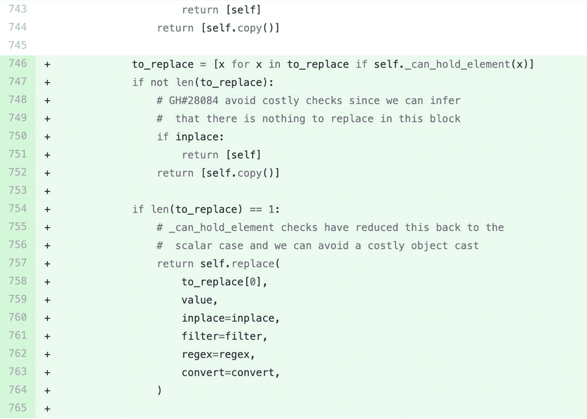
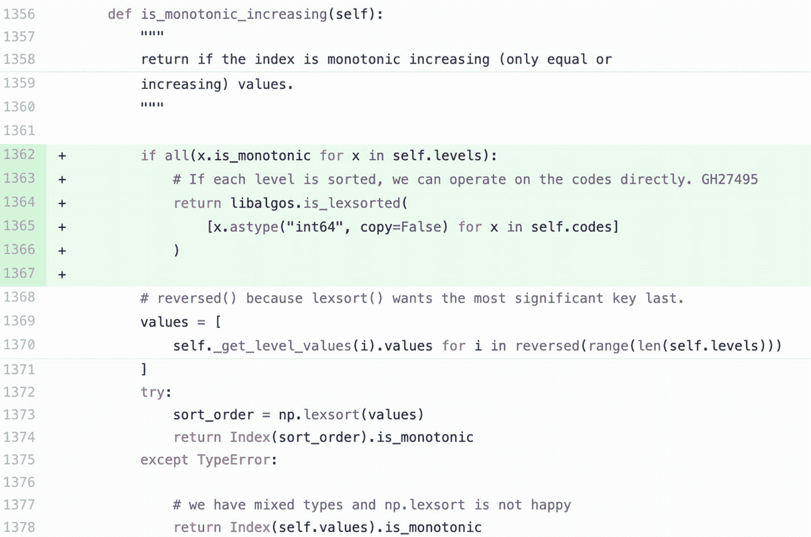

# 九、Pandas 的未来

有越来越多的软件包建立在 Pandas 的基础上或者与 Pandas 兼容。其中一些如 sklearn-pandas 与 scikit-learn 等其他包集成，以利用数据帧进行机器学习。其他的，像 Plotly，提供交互式绘图功能和在线协作。Pandas 在过去的几年里努力拓展其他语言。现在有一个 pandas.js 包和一个 ruby 包装器，使 ruby 用户能够调用 Python pandas API。还有一种推动，即使用一种被称为 Weld 的新兴 LLVM 在更大的全球范围内优化数据分析。它采用了类似于 NumExpr 的方法，但是规模更大。其思想是将所有的数据分析操作懒散地结合在一起，只在需要实际结果时才运行它们。这使得操作可以针对更大规模的并行计算和内存加载进行优化。

## `pandas 1.0`

Pandas 社区一直在狂热地开发 Pandas 1.0，这是自 Pandas 首次发布以来的首次大升级。它解决了以前版本中的许多缺点。

Pandas 1.0 增加了一个新的 Pandas 特有的 NA 类型。这种新类型将使所有类型的列中的空值保持一致。你可能还记得第 4 章中的内容，Pandas 0.25 中的 nan 必须存储为 floats 它们不能是布尔值、整数或字符串。以前，不能将包含 nan 的列作为整数类型加载，必须在加载后将其转换为整数。现在有了 pandas 1.0，可以用 NaNs 作为整数类型加载列。清单 [9-1](#PC1) 与清单 [4-15](4.html#PC15) 中的示例相同；只是现在它使用了 Pandas 1.0 中新的可空整数类型。注意，这种新类型的内存使用比数据类型多占用一个字节。因此，当类型设置为 Int16Dtype 时，每个元素实际上占用三个字节，而不是两个。额外的字节对应于 IntegerArray 实现中的布尔掩码，该掩码标记哪些值为 NA。

```py
>> data = io.StringIO(
     """
     id,age,height,weight
     129237,32,5.4,126
     123083,20,6.1,
     123087,25,4.5,unknown
     """
)
>> df = pd.read_csv(
     data.
     dtype={
         'id': np.int32,
         'age': np.int8,
         'height': np.float16,
         'weight': pd.Int16Dtype()},
     na_values=["unknown"],
     index_col=[0],
)
              age    height  weight
     id
     129237   32     5.4     126
     123083   20     6.1     <NA>
     123087   25     4.5     <NA>
>> df.memory_usage(deep=True)
     Index     24
     age        3
     height     6
     weight     9
>> df.dtypes
     age       int8
     height    float16
     weight    Int16
>> df.index.dtype
     dtype('int64')

Listing 9-1Example of how pandas handles NaNs in the data in 1.0

```

随着 pd 的引入。除了可空的布尔数组和专用的字符串数据类型之外，空值可以在所有数据类型中使用相同的类型一致地表示。这个看似简单的变化也改善了 API 中由于不一致的空类型而导致的微妙的不一致，例如，Categorical.min 现在返回预期的最小值而不是 NaN，如清单 [9-2](#PC2) 所示。

```py
>> pd.Categorical([1, 3, 5, np.nan], ordered=True).min()
NaN
>> pd.Categorical([1, 3, 5, pd.NA], ordered=True).min() # 1.0
1

Listing 9-2Behavior change of pandas 1.0 when computing the minimum of a Categorical

```

引入专用的字符串数据类型(StringDtype)本身也是巨大的。在 pandas 0.25 中，字符串被存储为对象，这将占用大量空间，并且不能保证数据的一致性，因为一个对象可以包含任何类型。使用新的显式 StringDtype，它将占用更少的空间，保证列内的一致性，并且还将标识为文本类型，而不是将文本值与所有通用对象容器类型的值放在一起。清单 [9-3](#PC3) 展示了新的 pandas string 类型使用的内存有多少。当使用新的字符串类型时，每个值只占用 8 个字节，与以前版本相比，这大大减少了内存，以前版本中每个对象值占用大约 60 个字节。

```py
>> data = io.StringIO(
     """
     id,name
     129237,Mary
     123083,Lacey
     123087,Bob
     """
)

>> # Load the data with pandas 0.25.3.
>> df = pd.read_csv(
     data,
     dtype={'id': np.int32},
     index_col=[0],
)
               name
     id
     129237   Mary
     123083   Lacy
     123083   Bob
>> df.memory_usage(deep=True)
     Index     24
     name      197
>> df.dtypes
     name         object

>> # Load the data with pandas 1.0.
>> df = pd.read_csv(
     data,
     dtype={
         'id': np.int32,
         'name': pd.StringDtype()},
         index_col=[0],
)
              name
     id
     129237   Mary
     123083   Lacy
     123083   Bob
>> df.memory_usage(deep=True)
     Index     24
     name      24
>> df.dtypes
     name      string

Listing 9-3Memory usage of the pandas 1.0 string type compared to using object in previous versions

```

可空布尔对于 Pandas 用户来说也是一个巨大的胜利。以前，布尔列不能有可空状态；只允许真和假。这意味着用户必须使用整数表示或对象来表示具有第三种 NaN 状态的布尔值，但现在他们可以使用 pandas BooleanArray 类型。

pandas 中新类型的引入，即可空布尔值、pandas NA 类型和专用字符串类型，显著改进了 pandas 1.0 中的 pandas 类型转换。现在，整数、布尔值和字符串将被识别并存储为更小的数据类型，即使它们包含空值。这对于性能和节省加载内存来说是一个巨大的胜利。请注意，虽然这些新类型是存在的，并且在创建 pandas 数组时被推断出来，但是在创建 DataFrames 时不会被推断出来。创建 pandas 数据帧时，您必须明确指定 pandas 使用的类型。这就是为什么在清单 [9-1](#PC1) 到 [9-3](#PC3) 中，当使用 read_csv 加载数据时，新的 Pandas 类型被明确指定。如果没有显式指定类型，它们将被推断为与以前版本的 pandas 相同的类型。

滚动应用方法现在还支持引擎参数，该参数提供了使用 Numba 而不是 Cython 的选项。Numba 将自定义应用函数转换为类似于 Cython 的优化编译的机器代码，但对于具有数百万行的数据集和在 NumPy ndarrays 上操作的自定义函数，pandas 团队发现 Numba 产生的代码比 Cython 更优化。当然，使用 Numba 只有在您反复运行大量计算时才有意义，因为 Numba 在第一次使用时有编译开销。

在 pandas 1.0 中有很多清理分类数据类型的工作。您可能还记得第 [2](2.html) 章，分类数据类型用于保存具有一组唯一值的元数据。API 中的弃用已被移除，以前对数据类型的操作不返回分类，现在可以了，并且改进了对空值的处理。还有一些性能上的改进，例如，现在，在运行比较之前，传递给 searchsorted 的所有值都被转换为相同的数据类型。清单 [9-4](#PC4) 展示了一个在分类上使用 searchsorted 的例子。Pandas 1.0 中的这个操作比之前的版本快了 24 倍左右。

```py
import pandas as pd
metadata = pd.Categorical(
     ['Mary'] * 100000 + ['Boby'] * 100000 + ['Joe'] * 100000
)
metadata.searchsorted(['Mary', 'Joe'])

Listing 9-4Using searchsorted on Categorical

```

对 groupby 也做了很多重构和 bug 修复。这曾经是一段复杂的代码，有许多错误，但在 pandas 1.0 中有许多改进，包括改进了对空值的处理，当轴是一个时提供了按列名的选择，允许同一列的多个自定义聚合函数匹配 series groupby 行为，等等。

pandas 对读取 CSV 数据的加载和转储选项的支持远远超过了其他加载程序的选项。虽然支持如此多的选项会给开发人员带来复杂的代码，但对用户来说却非常好。一些加载器有很好的选项平衡，但是一些在加载和转储能力上有所欠缺，这可能会导致用户的性能加速。正如我们在第 [3](3.html) 章中看到的，read_sql 缺少在加载期间指定数据类型的能力，而这对于性能来说是相当关键的。另一方面，CSV 加载器有如此多的选项，如果不小心的话，其中一些会导致性能下降。在 pandas 1.0 中，已经做了大量的工作来解决这个问题并标准化输入和输出数据方法的选项。例如，read_json 和 read_csv 现在都能够按照预期解析和解释 Infinity、–Infinity、+Infinity 和 NaNs。在以前的版本中，read_json 不处理 NaNs 或 Infinity 字符串，read_csv 不将 Infinity 字符串转换为 floats。read_excel 中的 usecols 参数也已经过标准化，其行为更像 read_csv 的 usecols 参数。以前，usecols 允许是单个整数值，而现在它是一个整数值列表，就像 read_csv 一样。

Pandas 1.0 还有很多其他细微的性能改进。我们将在这里查看其中的一些方法，以便让您对使用哪些方法来提高性能有所了解。

Pandas 1.0 修复了 infer_type 方法的性能回归问题。如图 [9-1](#Fig1) 所示，当过早运行 isnaobj 比较时，if 语句在实现中下移，以避免因将数据类型转换为对象而导致的性能下降。


图 9-1

infer_type 的性能修复差异

对 replace 方法进行了另一个性能修复，该方法用于将值替换为不同的值。这里，在原始代码的上方插入了一些额外的代码，以利用一些早期退出条件。如果要替换的值列表为空，则只需返回原始值，如果 inplace 为 False，则返回原始值的副本。如果只有一个有效值，请用新值替换该值。这些值还被转换为有效值列表，而不是保留为对于给定列可能合法也可能不合法的值列表。注:虽然图 [9-2](#Fig2) 中没有明确显示，但新的 to_replace 列表也在最终的替换调用中使用。通过这样做，减少了所需的替换次数，并提高了大型数据集的整体性能，在这种情况下，一些列不包含任何要替换的值。



图 9-2

在原始替换逻辑之上插入额外的代码，以利用早期退出条件

比较索引是否相等的性能也得到了改进。这是通过添加图 [9-3](#Fig3) 所示的提前退出条件而实现的另一项性能改进。如果维度不相等，则索引被确定为不相等，并且多索引相等检查提前退出。


图 9-3

插入 is MultiIndex check 的附加代码利用早期退出条件

对索引的 is_monotonic 检查也进行了改进。以前，结果依赖于缓存值的生成，但是当索引的级别已经单独排序时，可以使用代码的 is_lexsorted 来确定单调性。回想一下第 [3](3.html) 章，级别是索引中值的唯一列表，代码保存这些值在索引中的位置。代码将每个值表示为一个整数，该整数是值列表中该值的索引位置。因此，将所有这些放在一起，is_lexsorted 是一个 O(n)算法，它对表示值的整数进行操作，而以前的实现总是在 O(nlog(n))检查中直接对索引值进行操作，首先使用 NumPy 的 lexsort 对它们进行排序，然后根据排序结果确定它们中是否有不按单调顺序排序的。通过使用已经排序的值的整数表示，我们能够更快地确定单调性。图 [9-4](#Fig4) 以粗体显示了变化。



图 9-4

插入额外代码以提高 is_monotonic 检查的性能

pandas 团队说要从所有 pandas 方法中删除 inplace 选项，因此，他们通常建议不要使用它。与其名称所暗示的相反，inplace 选项并不总是在不复制内存的情况下就地运行。这通常是 pandas 类型推断的结果，其中操作导致数据类型改变，因此数据必须用新类型重建。清单 [9-5](#PC5) 展示了这个例子。当 NaN 值被替换为 0.0 时，类型仍然是 float，值可以直接在 NumPy 数组中替换，而不必创建新的数组和复制内存。当用字符串 null 替换 0.0 时，float64 类型不能保存字符串，因此必须重建 NumPy 数组，并且必须将内存复制到 object 类型的新数组中。这两个操作都是用 inplace=True 指定的，但后者会导致内存复制，因为底层数据结构的类型必须更改。

```py
>> data = pd.DataFrame({"size":[np.nan,1.0,3.5]})
>> data.dtypes
     size     float64
>> id(data._data.blocks[0].values)
     4757583472
>> data.fillna(0.0, inplace=True)
>> data.dtypes
     size     float64
>> id(data._data.blocks[0].values)
     4757583472
>> data.replace(0.0, "null", inplace=True)
>> data.dtypes
     size     object
>> id(data._data.blocks[0].values)
     4757572464

Listing 9-5An example of inplace=True copying rather than modifying the data

```

虽然尝试不复制数据可以说是比总是复制数据更好的性能，但为了尽可能少地将用户转移到一个不存在 inplace 的世界，pandas 团队建议不要使用 inplace=True。

在过去的几年里，《Pandas》的原作者韦斯·麦金尼已经开始着手一个名为阿帕奇箭头 <sup>[1](#Fn1)</sup> 的新项目，他希望有一天它能成为 Pandas 的后端。它旨在修复 Pandas 的许多核心问题，包括减少内存开销和启用懒惰评估。

## `Conclusion`

由于 pandas 的用户群多样化，它支持许多不同的选项和许多不同的方法来做同样的事情。pandas 的 API 有一个庞大且不断扩展的特性和选项集，这些特性和选项令人难以置信的强大，并经常导致用户以一种次优的方式实现一些东西。这是一个很难做出的决定:限制功能和选项的数量，以便用户不会做错误的事情，或者提供一组功能，以便用户可以找到一种方法来做他们想做的事情。pandas 肯定在后者方面犯了错误，这使它成为一个非常强大的工具，适用于许多不同类型的大数据问题。对于那些不在乎程序需要一分钟还是一小时的用户来说，他们使用了次优的实现并不是问题。然而，对于这样做的用户来说，很难推理和理解。希望这本书能让你更好地理解 Pandas 是如何工作的，并直觉地知道在某些情况下应该使用哪种方法。

总的来说，我们已经在本书中涵盖了一些基本的编码规则，在您实施未来的 Pandas 项目时，您应该记住这些规则:

*   如果可能的话，在加载数据的同时对数据进行规范化

*   明确指定您的数据类型

*   避免 Python 中的循环

*   仔细选择优化分析的数据帧方向

*   避免重复数据的操作

*   根据需要利用 Cython 或更快的定制实施

通过遵循这些基本的编码规则，现在凭着对给定的 pandas 操作将如何执行的直觉，您应该能够为您的下一个 pandas 项目选择最佳的实现。

<aside aria-label="Footnotes" class="FootnoteSection" epub:type="footnotes">Footnotes [1](#Fn1_source)

[https:// arrow。阿帕奇人 apache .org/](https://arrow.apache.org/)

 </aside>