# 四、变量选择

*变量选择* *是一门艺术*。本章的目标是帮助您理解可用于选择数据集中最佳要素的不同变量选择技术。这是数据科学中的关键过程之一。简单地说，假设你是一支足球队的教练。你想选出赢得世界杯的最佳球队。你需要每个位置都有最好的球员(*最佳特点*)，你不希望在给定的时间点有太多球员打同一个位置(*多重共线性*)。在 PySpark 中，有多种方法可以完成这项任务。在本章中，我们将介绍一些内置和定制的变量选择技术(图 [4-1](#Fig1) )。

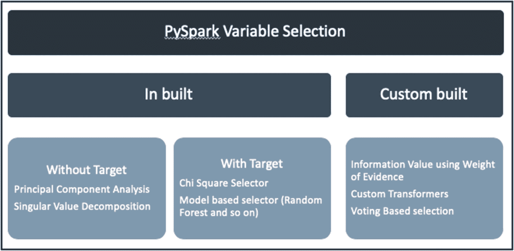

图 4-1

变量选择

在接下来的几页中，我们将探索每种技术背后的概念，手工进行一些计算，看看它们是如何工作的*(必要时)*，最后使用 PySpark 实现它们。在这一整章中，我们将使用位于 [`https://archive.ics.uci.edu/ml/datasets/Bank+Marketing`](https://archive.ics.uci.edu/ml/datasets/Bank+Marketing) 的 UCI 机器学习库中的银行数据集。您需要从*数据*文件夹中下载 *bank.zip* 文件来访问 *bank-full.csv* 文件。在我们继续之前，这里有一个直观的方式来看变量选择(图 [4-2](#Fig2) )。


图 4-2

直觉方式

## 探索性数据分析

探索性数据分析(EDA)是一种用于分析数据的过程，以便使用汇总或可视化来识别数据中存在的特征和模式。在前面的章节中，我们已经通过了大量的代码来详细介绍这一点。我们建议您在使用的任何数据集上使用这些代码。当你更好地理解数据时，你就能迅速做出决定，并解释你的决定背后的原因。EDA 也可以成为变量选择过程中强有力的第一步。如果您想知道是如何做到的，请考虑基数(参见本节中的定义)和缺失值。在进行任何机器学习练习时，检查这两件事是很好的做法。

让我们用这个房价的例子来更好地理解基数和缺失值(图 [4-3](#Fig3) )。


图 4-3

房价数据集

### 基数

基数是变量的唯一值的数量。假设我们正在建立一个预测房价的模型，假设所有五个记录的房屋类型都是“单个家庭单位”。在这种情况下，*家庭类型*变量的基数是 1(“单个家庭单元”)。在这种情况下，*家庭类型*不会提供任何有用的信息，因为，您选择的任何记录，这个变量都会给您相同的信息(“单个家庭单元”)。因此，我们可以忽略这个变量，使用其他变量来建立预测模型。尽管您可以计算任何变量的基数，但基数对于分类变量非常有用。在图 [4-3](#Fig3) 中，*家类型*的基数是 3。

### 缺少值

顾名思义，缺失值是指缺失的一条信息。为了建立一个更好的模型，我们需要了解丢失信息背后的原因。一般来说，数据丢失可能有以下三个原因:

*   随机失踪(三月)

*   完全随机失踪(MCAR)

*   非随机缺失(MNAR)

通过了解缺失信息的类型，我们可以相应地处理数据。我们将使用住宅价格的例子来详细说明。

#### 随机失踪(三月)

当一个数据随机缺失时，缺失数据与观测数据之间存在关系。让我们用住宅价格的例子来更好地理解这一点。当您仔细查看*住宅类型*和 *HOA 费用*(业主协会费用)变量时，您可以看到当*住宅类型*为“城市住宅”或“公寓”时，有一个 *HOA 费用*的值，当*住宅类型*为“单个家庭单位”时，费用缺失这是有意义的，因为单个家庭单位(在大多数情况下)没有任何 HOA 费用。在这种情况下,*“单一家庭单位”住宅的 HOA 费用*可以估算为零。这种类型的缺失数据称为*随机缺失(MAR)* *。*

#### 完全随机失踪(MCAR)

当一个数据完全随机缺失时，缺失数据和观测数据之间没有关系。让我们看看数据中的价格变量。其中一个房价不见了。与我们刚刚讨论的 MAR 示例不同，我们无法为这些缺失的数据推导出任何逻辑。当你开始思考丢失信息背后的原因时，可能有很多。也许房子被拍卖了，或者房子是新建的，卖家还没有确定价格，或者有其他原因。无论如何，缺失的价格与我们观察到的任何数据都没有关系。这是数据*完全随机缺失(MCAR)* 的典型例子。为了估算这些数据，您可能需要使用自己的逻辑。估算是填补数据科学文献中缺失值的一种方式。对于如何处理这种类型的缺失数据，我们有一些建议，如下所示:

*   均值、中值或众数插补

*   基于模型的插补(这将在以后的章节中讨论)

*   多重插补

*   使用业务逻辑来估算缺失的信息

*   删除具有大量缺失数据的要素(变量选择)

*   删除缺少值的行(最不推荐)

如何使用业务逻辑来估算缺失的信息？让我们假设您为 Zillow 工作，并且您知道只有在房子被挂牌拍卖时才会缺少*价格*信息。在这种情况下，您的团队建议您对拍卖中列出的房屋使用默认价格(假设为 1 美元)。然后，你可以用 1 美元估算价格。

#### 非随机缺失(MNAR)

当数据不是随机丢失时，这意味着数据没有被收集。在我们的例子中，我们没有关于房子何时建造的信息(*年*)。该信息缺失是因为我们在数据收集过程中没有考虑*年*变量。要解决这个问题，您应该了解并改进数据收集过程，以解决丢失的信息。

我们已经详细讨论了缺失值的类型。我们可以用它来拒绝数据集中的变量吗？是的，我们可以。大多数数据科学人员拒绝基于数据丢失百分比的变量。例如，如果某个变量有 80%以上的值缺失，您可以拒绝该变量。80%不是一个标准值，可能会因具体情况而异。

Exercise 4-1: Missing Values & Cardinality

下载墨尔本房屋数据集: [`https://www.kaggle.com/dansbecker/melbourne-housing-snapshot/data#`](https://www.kaggle.com/dansbecker/melbourne-housing-snapshot/data) 。

**问题 1:** 计算数据集中每个变量的基数。你能拒绝任何基于基数的变量吗？(提示:寻找基数 1)

**问题 2:** 计算数据集中每个变量的缺失值百分比。你能消除任何基于缺失值的变量吗？(提示:就本练习而言，拒绝任何缺失值超过 45%的变量)

**问题 3:** 用中间值估算*年建*列。(提示:`relativeError`用 0.1)

**问题 4:** 插补*建筑面积*栏，创建一个名为`mean_imputed_BuildingArea`的新变量，并计算插补后的新平均值。

回到银行数据集，让我们加载数据集并进行一些基于 EDA 的变量选择。

```py
filename = "bank-full.csv"
target_variable_name = "y" #This variable can be set later too

```

让我们使用以下代码加载数据:

```py
from pyspark.sql import SparkSession
spark = SparkSession.builder.getOrCreate()
df = spark.read.csv(filename, header=True, inferSchema=True, sep=';')
df.show()

```

您需要确保提供分号(；)作为此数据集的分隔符，否则它将不起作用。此外，我们在文件加载操作中看到一个新选项`inferSchema`。启用此选项时，它会自动推断数据集中每一列的数据类型。图 [4-4](#Fig4) 显示了使用和不使用该选项的模式推理。

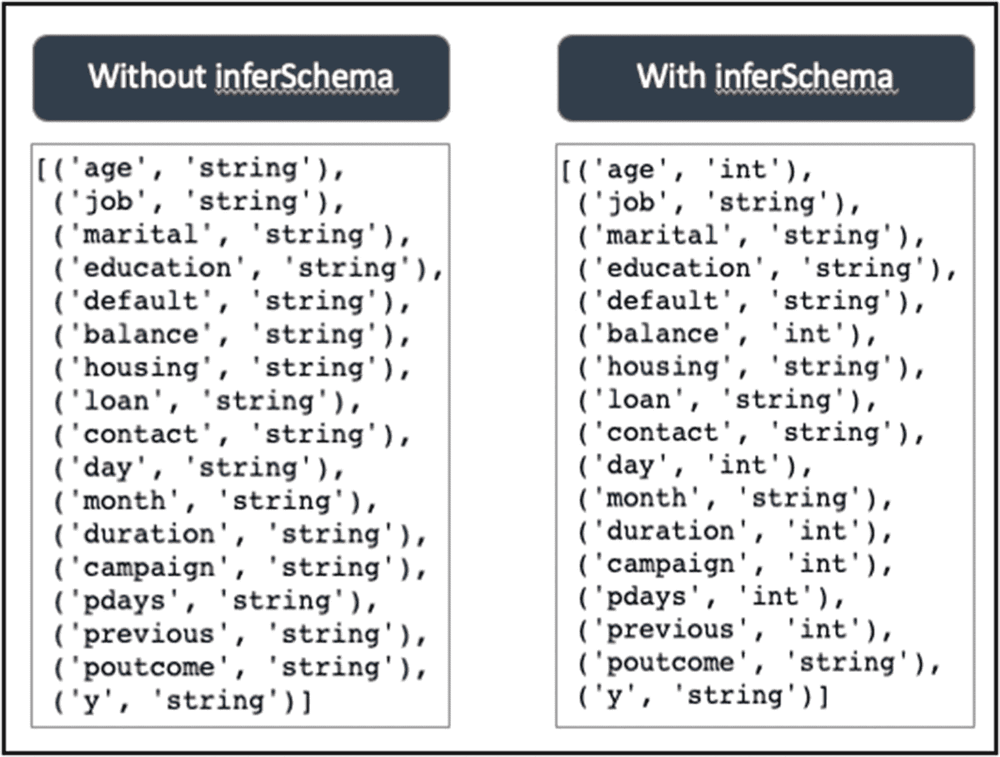

图 4-4

推断模式选项输出差异

好的，我们已经将数据加载到我们的环境中了。这里有一些代码可以让你开始处理数据

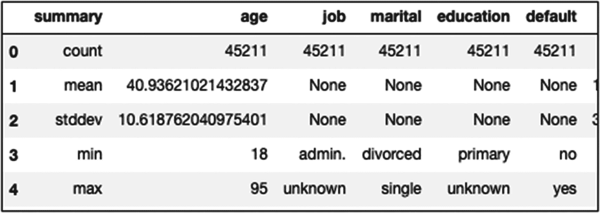

图 4-5

列聚合摘要

```py
#Length of the data
df.count() #45211

#describes data
df.describe().toPandas() #missing and cardinality followup

#type of each variable
df.dtypes
df.printSchema()

#single variable count by group
df.groupBy('education').count().show()

#target count
df.groupBy(target_variable_name).count().show()

#multiple column group by
df.groupBy(['education',target_variable_name]).count().show()

#column aggregations
from pyspark.sql.functions import *
df.groupBy(target_variable_name).agg({'balance':'avg', 'age': 'avg'}).show()

```

我们想要突出显示图 [4-5](#Fig5) 中所示的数据输出，并将其与我们之前讨论过的基数和缺失值联系起来。*摘要*列中的*计数*行给出了变量中非缺失值的计数。总观察值与该列之间的差异给出了每列中缺失值的总数。让我们在这里再检查两个统计数据:在*汇总*列中的*最小*和*最大*行。当*最小*和*最大*行具有相同的变量值时，则变量的基数为 1。如果您无法连接，不要担心。您可以使用以下代码来执行这些检查。

#### 代码 1:基数检查

```py
# Cardinality Check

from pyspark.sql.functions import approxCountDistinct, countDistinct
"""
Note: approxCountDistinct and countDistinct can be used interchangeably. Only difference is the computation time.
"approxCountDistinct" is useful for large datasets
"countDistinct" for small and medium datasets.
"""
def cardinality_calculation(df, cut_off=1):
    cardinality = df.select(*[approxCountDistinct(c).alias(c) for c in df.columns])

    ## convert to pandas for efficient calculations

    final_cardinality_df = cardinality.toPandas().transpose()
    final_cardinality_df.reset_index(inplace=True)
    final_cardinality_df.rename(columns={0:'Cardinality'}, inplace=True)

    #select variables with cardinality of 1
    vars_selected = final_cardinality_df['index'][final_cardinality_df['Cardinality'] <= cut_off]

    return final_cardinality_df, vars_selected

cardinality_df, cardinality_vars_selected = cardinality_calculation(df)

```

#### 代码 2:缺失值检查

```py
#missing values check

from pyspark.sql.functions import count, when, isnan, col

# miss_percentage is set to 80% as discussed in the book
def missing_calculation(df, miss_percentage=0.80):
    #checks for both NaN and null values
    missing = df.select(*[count(when(isnan(c) | col(c).isNull(), c)).alias(c) for c in df.columns])
    length_df = df.count()
    ## convert to pandas for efficient calculations
    final_missing_df = missing.toPandas().transpose()
    final_missing_df.reset_index(inplace=True)
    final_missing_df.rename(columns={0:'missing_count'}, inplace=True)
    final_missing_df['missing_percentage'] = final_missing_df['missing_count']/length_df

    #select variables with cardinality of 1
    vars_selected = final_missing_df['index'][final_missing_df['missing_percentage'] >= miss_percentage]

    return final_missing_df, vars_selected

missing_df, missing_vars_selected = missing_calculation(df)

```

对于 bank 数据集，基于这两个检查，没有任何列被拒绝。但是，在现实世界的数据集中，您会看到在执行基数和缺失值检查后可以消除的少数列。这就是我们需要学习的基于 EDA 的变量选择技术。在我们继续讨论其他选择技术之前，我们将在 EDA 中再做一次特性工程练习。这将确保我们的数据为下游任务做好准备。记住图 [4-4](#Fig4) ，这里我们仍然有一些字符串列。下一组选择技术要求所有的列都是数字。

使用以下选项之一可以将字符串转换为数字:


图 4-6

一个热编码器

1.  将列单独转换为所需的数据类型。这对于大型数据集来说很麻烦。

2.  来自`pyspark.ml.feature.`的`OneHotEncoder`(对于 Spark > = 3.0)或`OneHotEncoderEstimator`(对于 Spark > = 2.3)该选项将为每个类别创建虚拟变量，从而增加我们使用的功能数量。在我们的数据集中，*教育*变量有四个类别:小学、中学、大学和未知。在该列上使用`OneHotEncoder`后，输出如图 [4-6](#Fig6) 所示。*注意:默认情况下，PySpark 不会产生如图所示的输出；这需要使用前一章讨论的* `udf` *函数进行一些调整。*

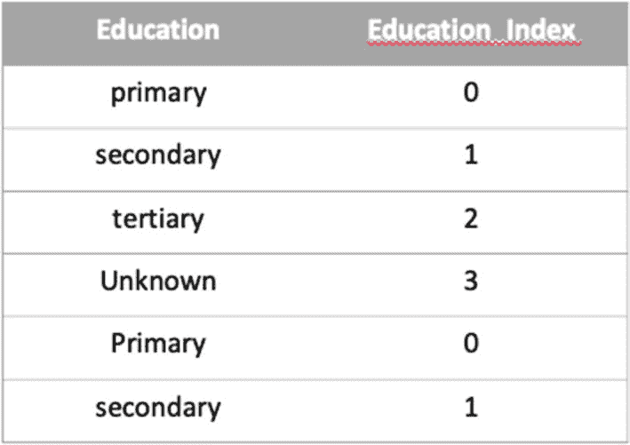

图 4-7

StringIndexer 输出

1.  `StringIndexer`从`pyspark.ml.feature`开始。此选项为每个级别分配一个数字。最频繁的值将得到索引 0，其次是次频繁的值，依此类推。使用`StringIndexer`的*教育*变量的输出将如图 [4-7](#Fig7) 所示。虽然`StringIndexer`的输出看起来像是序数输出(升序)，但不应该认为是序数。大多数算法都没有将这个变量视为标称输出(互斥水平)。这是`StringIndexer`的弊端之一。

1.  最后一种选择是使用加权指数，类似于证据权重，这将在本章后面讨论。它克服了`StringIndexer`和`OneHotEncoder`所面临的两个缺点。它使用目标人群与非目标人群的分布来创建每个类别的权重。

对于我们的例子，让我们使用`StringIndexer`来转换我们所有的列。接下来提供了代码。

#### 步骤 1:识别变量类型

```py
# Identify variable types

def variable_type(df):
    # use the dtypes to separate character and numeric variables
    vars_list = df.dtypes
    char_vars = [] #character variables list
    num_vars = [] #numeric variable list
    for i in vars_list:
        if i[1] in ('string'):
            char_vars.append(i[0])
        else:
            num_vars.append(i[0])

    return char_vars, num_vars

#apply variable_type function on our DataFrame
char_vars, num_vars = variable_type(df)

```

#### 步骤 2:将 StringIndexer 应用于字符列

对步骤 1 ( `char_vars`)中识别的字符变量，应用`StringIndexer`函数。此处提供了代码:

```py
from pyspark.ml.feature import StringIndexer
from pyspark.ml import Pipeline

#converts each category column to index
def category_to_index(df, char_vars):

    char_df = df.select(char_vars)
    indexers = [StringIndexer(inputCol=c, outputCol=c+"_index", handleInvalid="keep") for c in char_df.columns]
    pipeline = Pipeline(stages=indexers)
    char_labels = pipeline.fit(char_df)
    df = char_labels.transform(df)
    return df, char_labels

#apply category_to_index function on our DataFrame
df, char_labels = category_to_index(df, char_vars)

```

这里的代码强调了几件事。第一个是`StringIndexer`操作，它接受一个输入列( *Education* )并产生一个输出列( *Education_index* )。需要注意的一点是`handleInvalid`选项，它被设置为 *keep* ，这样当我们将来遇到新数据时，它仍然会工作。下一个选项是`Pipeline`选项，用于顺序执行我们的步骤。我们将在后面的章节中详细介绍流水线。DataFrame 输出当前包含旧的字符串列和新的数字列。让我们将数据分成所需的列，如下所示:

```py
df = df.select([c for c in df.columns if c not in char_vars])

```

最后，我们有了一个完全数字化的数据框架。对将 *_index* 变量重命名为原来的名称感兴趣的人可以使用下面的代码来执行操作:

```py
#rename _index columns to original variable name
def rename_columns(df, char_vars):
    mapping = dict(zip([i + '_index' for i in char_vars], char_vars))
    df = df.select([col(c).alias(mapping.get(c, c)) for c in df.columns])
    return df

# apply rename_columns to our DataFrame
df = rename_columns(df, char_vars)

```

#### 步骤 3:组装特征

最后一步是将各个变量组合成一个单一的特征向量。这很有用，因为我们可以指向一个变量，而不是在接下来的步骤中提供单独的变量。此外，您可以选择使用`StandardScaler`或`MinMaxScaler`缩放数据帧。这是使用以下代码完成的:

```py
#assemble features into one vector
from pyspark.ml.feature import VectorAssembler

#assemble individual columns to one column - 'features'
def assemble_vectors(df, features_list, target_variable_name):
    stages = []
    #assemble vectors

    assembler = VectorAssembler(inputCols=features_list, outputCol="features")
    stages = [assembler]
    #select all the columns + target + newly created 'features' column
    selectedCols = [target_variable_name, 'features'] + features_list
    #use pipeline to process sequentially
    pipeline = Pipeline(stages=stages)
    #assembler model
    assembleModel = pipeline.fit(df)
    #apply assembler model on data
    df = assembleModel.transform(df).select(selectedCols)
    return df

# exclude target variable and select all other feature vectors
features_list = df.columns
features_list.remove(target_variable_name)

# apply the function on our DataFrame
df = assemble_vectors(df, features_list, target_variable_name)

```

如果您更喜欢查看组合矢量特征的模式，您可以使用以下代码(图 [4-8](#Fig8) ):

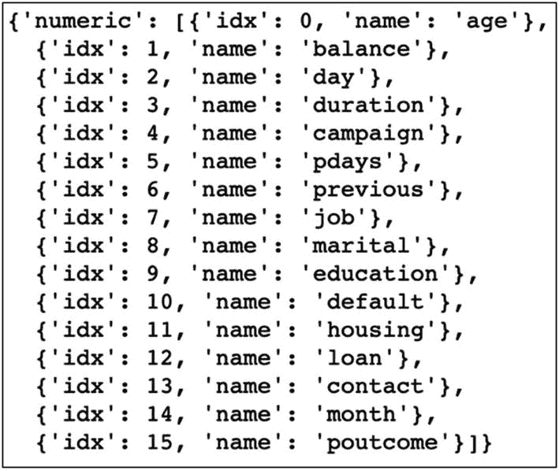

图 4-8

功能列架构

```py
df.schema["features"].metadata["ml_attr"]["attrs"]

```

要使它们成为一个漂亮的熊猫数据帧，可以使用下面的代码:

```py
import pandas as pd

for k, v in df.schema["features"].metadata["ml_attr"]["attrs"].items():
    features_df = pd.DataFrame(v)

```

就是这样。我们现在有了一个与下游任务兼容的数据帧`(df)`。需要注意的一点是目标变量 *y* 经过数值转换后看起来像图 [4-8](#Fig8) (图 [4-9](#Fig9) )。这是因为*否*选项比*是*选项更频繁。你需要记住这一点，这样结果解释才有意义。你也可以根据个人的选择，明确地将目标转换成想要的数值映射。


图 4-9

最终目标映射

Quick Exercise

尝试使用`StandardScaler`和`VectorAssembler`来创建上一步中的缩放数据帧。(提示:您需要在阶段中添加定标器模型，以及汇编器)

## 内置变量选择过程:无目标

在机器学习模型设置中，你可以在没有明确目标的情况下降低数据的维度。这种类型的降维被称为数据压缩。想象一个图像文件。您有多种方法来压缩文件，从而减小文件大小。在这一节中，我们将讨论 Spark ML 中执行这些任务的两个现成实现:PCA 和 SVD。

### 主成分分析

主成分分析(PCA)可用于识别大型数据集中的模式。它可以识别数据中包含最多信息的变量。它是数据集的线性表示。今天，我们有像 Autoencoder 这样的深度学习算法，它们做同样的事情，并对建模复杂的非线性关系非常有用。就本书的范围而言，我们将只关注 PCA。一般的经验法则是:如果变量分布都集中在平均值附近，它通常包含微小的信息。让我们用一个简单的例子来理解 PCA 机制。

#### 力学

假设我们有六个客户，他们在一年的不同月份购买了相同型号和相同品牌的同一辆汽车。我们想了解能够解释他们满意度的最重要的变量(见表 [4-1](#Tab1) )。

表 4-1

抽样资料

<colgroup><col class="tcol1 align-left"> <col class="tcol2 align-left"> <col class="tcol3 align-left"></colgroup> 
| 

参与者 ID

 | 

质量

 | 

可靠性

 |
| --- | --- | --- |
| one | Ten | six |
| Two | nine | four |
| three | eight | five |
| four | three | three |
| five | Two | Two |
| six | one | one |

当我们使用单个变量*质量*并绘制数据时，我们观察到参与者一到三将在该线的上端彼此靠近，其余三个参与者将在该线的下端。即使只有一条数据线，我们也能够推断出前三个参与者是相似的，后三个参与者也是相似的。当我们在二维空间中绘制这些数据时，我们可以看到前三名参与者聚集在右上角，后三名参与者聚集在左下角(图 [4-10a](#Fig10) )。PCA 将指导我们识别对这些变量的聚类最重要的变量。让我们踏上 PCA 是如何计算的旅程。

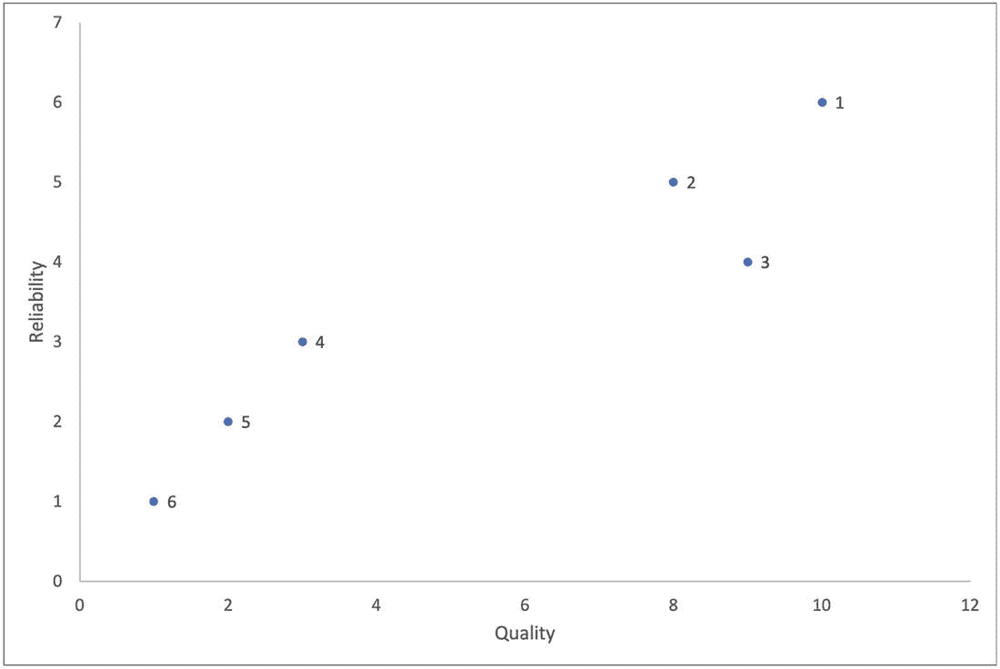

图 4-10a

汽车满意度数据

首先，计算两个变量的平均值。*质量*和*可靠性*的平均值分别为(5.5，3.5)。我们将原点从图 [4-10b](#Fig11) 中所示的(0，0)移动到(5.5，3.5)。这是为了确保数据以原点为中心。

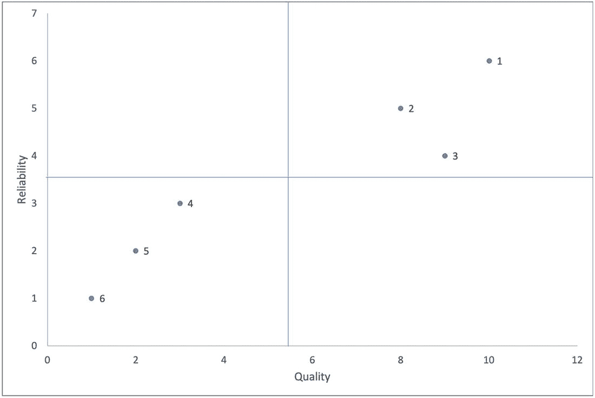

图 4-10b

安讯士汽车满意度数据

现在我们试着拟合一条穿过这些点的线，直到它很好地拟合数据，穿过原点。你如何定义这个标准，并知道一条线是密切配合？你知道，当从数据到直线的投影距离最小时，它是最接近的拟合(点 5 被投影到通过原点的直线上)。同样的条件可以翻转，可以表述为使投影点到原点的距离最大化的一条线(同一图中的深色阴影线)。PCA 通过最大化从投影点到原点的距离的平方和找到最佳拟合线(图 [4-10c](#Fig12) )。

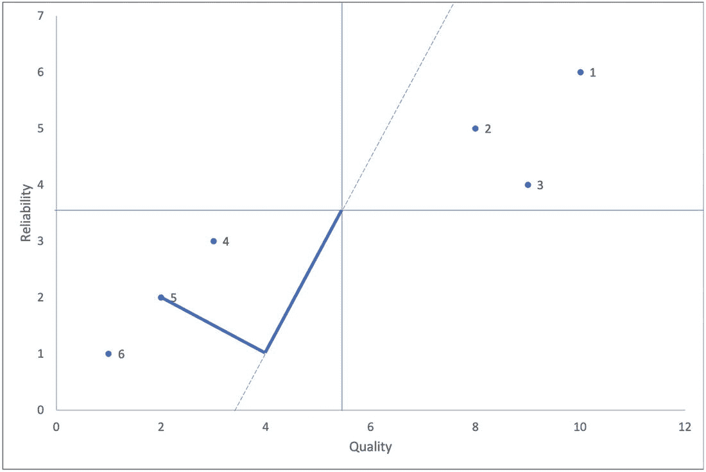

图 4-10c

PCA 预测

我们使用平方距离的原因是为了避免任何负值。我们通过旋转一条穿过原点的任意直线开始这个过程，并开始计算从原点到直线上投影点的距离。在上图中，我们显示了投影点 5 到原点的距离。突出显示的黑线表示距离。为剩余的点计算类似的距离，以达到距离的平方和。对所有这些距离进行比较，选择具有*最大距离平方和*的线(图 [4-10d](#Fig13) )。

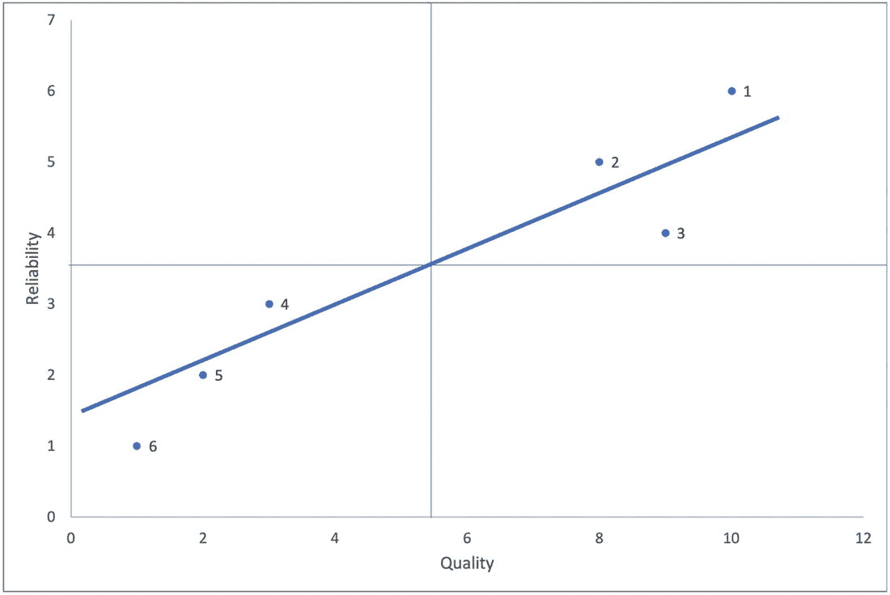

图 4-10d

果仁糖

指示线使所有点之间的平方距离之和最大化。因此，这被认为是 PC1 或主成分 1。假设这条线的斜率为 0.25，我们可以推断，我们在质量方向上每移动四个单位，可靠性就会上升一个单位。这是一个伪指示，表明数据全部分布在质量轴上。因此，质量在定义 PC1 时起着重要作用。这个组件可以被认为是四个质量单位和一个可靠性单位的线性组合。PC2 就是穿过原点并垂直于 PC1 的直线。它的变量比率将与 PC1 的比率相反。这个组件可以被认为是四个可靠性单位和一个质量单位的线性组合。如果我们将这两者换算成单位向量，我们可以计算出 PC 的*加载分数。*特征值*是投影点与被识别主成分原点之间距离的平方和。我们可以通过将每个主成分的*特征值*除以`(sample size -1)`来将其转化为变量。*

下面是 PCA 的 PySpark 实现的代码:

```py
from pyspark.ml.feature import PCA
from pyspark.ml.linalg import Vectors
no_of_components = 3 #custom number
pca = PCA(k=no_of_components, inputCol="features", outputCol="pcaFeatures")
model = pca.fit(df)
result = model.transform(df).select("pcaFeatures")
result.show(truncate=False)

```

`pcaFeatures`是由 PCA 算法产生的可用于下游机器学习过程的精简特征集。请注意，我们运行了 16 个输入变量，最终得到了 3 个组件。本质上，我们已经将维度大小减少了 1/5 (3/16)。要获得每个变量的加载分数，我们可以使用以下代码:

```py
model.pc.toArray()
array([[-3.41021399e-04,  2.79524640e-04,  2.58353293e-03],
       [-9.99998245e-01,  1.83654726e-03,  1.13892524e-04],
       [-1.22934480e-05,  9.79995613e-04,  7.79347982e-03],
       [-1.83671689e-03, -9.99996986e-01, -7.36955549e-04],
       [ 1.48468991e-05,  1.01391994e-03,  2.75121381e-03],
       [-1.13085547e-04,  7.49207153e-04, -9.99889046e-01],
       [-1.26153895e-05, -6.36100089e-06, -1.04654388e-02],
       [-1.78789640e-05, -4.11817349e-05,  5.51411389e-04],
       [ 6.41085932e-06, -5.23364803e-05, -1.45349520e-04],
       [-1.11185424e-05,  1.30366514e-05,  2.01500982e-04],
       [ 2.91665702e-06,  4.42643869e-06,  3.95562163e-05],
       [-1.12221341e-05,  1.26153926e-05,  6.17569266e-04],
       [ 1.01623400e-05,  1.50687571e-05,  8.23933054e-05],
       [-5.68377754e-07,  6.95393403e-05,  1.03951369e-03],
       [-7.60886236e-05, -1.16754927e-04, -3.24662847e-03],
       [-8.55162111e-06, -6.01853226e-05, -4.94522998e-03]])

```

现在，让我们将这些负荷分数映射到各个变量。我们使用的是 *features_list* 变量，它是我们之前提供给`assembler`函数的。

桌子

4-2.

<colgroup><col class="tcol1 align-left"> <col class="tcol2 align-left"></colgroup> 
| o  |

你可以看到，*平衡*变量支配 PC1 成分，*持续时间*第二 PC2 成分，*p 天数*第三 PC3 成分。您应该对这些结果保持谨慎，因为输入数据没有标准化。连续特征支配 PCA 的输出，因为它们具有高的方差。您应该关注的算法的另一个输出是每个组件解释的方差。在 PySpark 中，您可以使用以下代码来实现这一点:

```py
model.explainedVariance
#Output: DenseVector([0.9918, 0.0071, 0.0011])

```

您可以使用以下代码将这些值绘制成图形。这个图被称为*碎石图*。

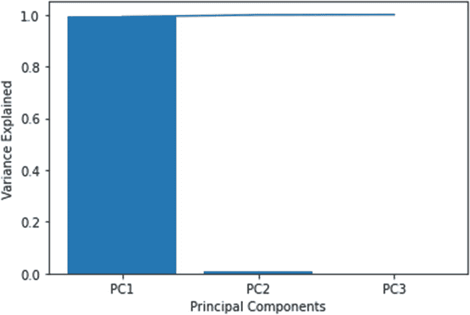

图 4-10e

解释差异

```py
import matplotlib.pyplot as plt
import numpy as np
x = []
for i in range(0, len(model.explainedVariance)):
    x.append('PC' + str(i + 1))
y = np.array(model.explainedVariance)
z = np.cumsum(model.explainedVariance)
plt.xlabel('Principal Components')
plt.ylabel('Variance Explained')
plt.bar(x, y)
plt.plot(x, z)

```

正如你在图 [4-10e](#Fig14) 中看到的，第一个主成分解释了数据中 99%的方差。这是因为我们在使用 PCA 之前没有对数据帧进行缩放。因此，在使用 PCA 之前，让我们用`StandardScaler`再运行一次。你会注意到方差解释图有很大的变化。

```py
from pyspark.ml.feature import VectorAssembler
from pyspark.ml.feature import StandardScaler

#assemble and scale individual columns to one column - 'features2'
def scaled_assemble_vectors(df, features_list, target_variable_name):
    stages = []
    #assemble vectors
    assembler = VectorAssembler(inputCols=features_list, outputCol="assembled_features")
    scaler = StandardScaler(inputCol=assembler.getOutputCol(), outputCol="features2")
    stages = [assembler, scaler]
    #select all the columns + target + newly created 'features' column
    selectedCols = [target_variable_name, 'features2'] + features_list
    #use pipeline to process sequentially
    pipeline = Pipeline(stages=stages)
    #assembler model
    scaleAssembleModel = pipeline.fit(df)
    #apply assembler model on data
    df = scaleAssembleModel.transform(df).select(selectedCols)
    return df
features_list = df.columns
features_list.remove(target_variable_name)
df = scaled_assemble_vectors(df, features_list, target_variable_name)

from pyspark.ml.feature import PCA

from pyspark.ml.linalg import Vectors

pca = PCA(k=3, inputCol="features2", outputCol="pcaFeatures")
model = pca.fit(df)

result = model.transform(df).select("pcaFeatures")
result.show(truncate=False)

```

当您使用前面代码中新创建的数据帧运行 PCA 时，您会发现第一个组件的变化很大(图 [4-10f](#Fig15) )。在使用 PCA 时，尤其是在处理连续变量和分类变量时，需要注意这种情况。

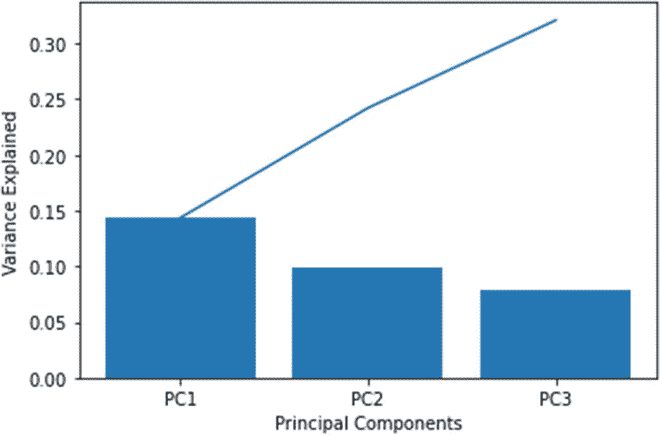

图 4-10f

解释差异

```py
model.explainedVariance
#Output: DenseVector([0.1434, 0.0987, 0.0787])

```

### 奇异值分解

矩阵分解最著名的方法是奇异值分解，或 SVD。任何矩阵都可以用奇异值分解，因此是一种更稳定的算法。SVD 将矩阵分解为三个矩阵 U、σ和 V，因此

a = uσv<sup>t</sup>，

在哪里

*   a 是原矩阵的 *r* `x` *c* 维。*r*–行，*c*–列

*   u 是一个 *r* `x` *r* 矩阵也称为 A 的左奇异向量

*   σ是一个 *r* `x` *c* 对角矩阵。对角线值是原始矩阵 a 的奇异值。

*   V <sup>T</sup> 是 A*c*T0】T5】c 矩阵又称为 A 的右奇异向量

好的，这如何应用于变量选择的概念？答案在于σ成分。假设您有一个包含 1000 个特征的图像。使用 SVD，您可以通过访问σ矩阵获得顶部的 k 个奇异值。你选择这个 *k* 取决于你想要在低维中表示的信息量。在 PCA 场景中，您可以考虑所解释的差异。让我们假设 1000 个特征中的前 100 个( *k* )解释了数据中 80%的信息，并且你对此没有问题。然后，您将从σ中选取前 100 个奇异值，并用σ矩阵中的 0 替换其余的值。由此产生的低秩矩阵可用于创建原始数据的表示，如下所示。

*   u-*r*`x`*k*左奇异值

*   σ-*k*`x`*k*奇异值

*   v<sup>T</sup>–*c*`x`T5】k 右奇异值

SVDs 更多地用于图像数据压缩和图像恢复。由于矩阵分解，它在协同过滤推荐系统中分解一个`user x item`矩阵时也发挥了巨大的作用。让我们来看看 PySpark 代码在我们的数据中实现 SVD:

```py
from pyspark.mllib.linalg import Vectors
from pyspark.mllib.linalg.distributed import RowMatrix

# convert DataFrame to rdd
df_svd_vector = df.rdd.map(lambda x: x['features'].toArray())
mat = RowMatrix(df_svd_vector)

# Compute the top 5 singular values and corresponding singular vectors.
svd = mat.computeSVD(5, computeU=True)
U = svd.U       # The U factor is a RowMatrix.
s = svd.s       # The singular values are stored in a local dense vector.
V = svd.V       # The V factor is a local dense matrix.

```

可以阅读更多关于矩阵特征值分解的内容，对 SVD 有更深入的理解。现在，让我们转到基于目标的变量减少。

## 内置变量选择过程:带目标

在下一节中，我们将探索监督变量选择技术。

### ChiSq 选择器

ChiSq 代表*卡方*。它也被称为“拟合优度”统计，用符号 ***χ2*** **表示。**它使用*卡方独立性检验*来选择最佳特征。这个选择过程在处理分类变量时很有用。但是，如果您更喜欢使用连续变量，那么在使用这种技术之前，您需要将它们绑定到组中。让我们使用下面的 Titanic 数据集( [`https://www.kaggle.com/c/titanic`](https://www.kaggle.com/c/titanic) )例子来详细理解卡方。


图 4-11

泰坦尼克号的例子:性别与幸存

图 [4-11](#Fig16) 所示的表也称为*列联表*。通过查看表格，我们可以注意到女性幸存者的百分比(231/340 = 67.9%)远远高于男性幸存者的百分比(109/340 = 32.0%)。这是否意味着*性别*和*幸存*之间有关系？你可以用卡方检验来回答这个问题。在卡方检验中，你有以下内容:无效假设和替代假设。：

*   *零假设:两个变量之间没有关系*

*   *交替假设:两个变量之间有关系*

我们将在测试中使用 5%的显著性水平。这里提供卡方的公式:

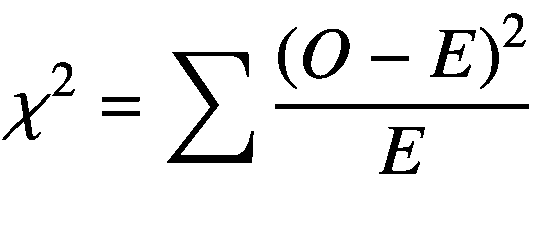

*χ2–卡方，O–观察数据，E–预期数据*

观察数据是指我们在前面的表格中看到的数据。预期数据是根据总计计算的。表 [4-3](#Tab3) 中提供了所有四个电池的预期值。

表 4-3

期望值

<colgroup><col class="tcol1 align-left"> <col class="tcol2 align-left"></colgroup> 
| *性别=女性且幸存=否* | (312*549)/889 = 192.67 |
| *性别=女性且幸存=是* | (312*340)/889 = 119.32 |
| *性别=男性且幸存=否* | (577*549)/889 = 356.32 |
| *性别=男性且幸存=是* | (577*340)/889 = 220.67 |

我们的数据如表 [4-4](#Tab4) 所示。我们使用前面显示的公式计算卡方，并对*卡方*列求和，得出卡方总值。

表 4-4

卡方值

<colgroup><col class="tcol1 align-left"> <col class="tcol2 align-left"> <col class="tcol3 align-left"> <col class="tcol4 align-left"></colgroup> 
| 

*单元格*

 | 

观察

 | 

预期的

 | 

卡方检验

 |
| --- | --- | --- | --- |
| *性别=女性且幸存=否* | Eighty-one | One hundred and ninety-two point six seven | Sixty-four point seven two |
| *性别=女性且幸存=是* | Two hundred and thirty-one | One hundred and nineteen point three two | One hundred and four point five one |
| *性别=男性且幸存=否* | Four hundred and sixty-eight | Three hundred and fifty-six point three two | Thirty-four point nine nine |
| *性别=男性且幸存=是* | One hundred and nine | Two hundred and twenty point six seven | Fifty-six point five one |
|   |   | 总数 | Two hundred and sixty point seven five |

最后一步是计算自由度，使用以下公式:

```py
degrees_of_freedom or df = (r – 1) * (c – 1)

```

在哪里

```py
r = number of rows
c = number of columns

```

在我们的例子中， *r* = 2(性别有两行)和 *c* =2(幸存有两列)。因此，自由度是 1。好的，我们都准备好了。让我们继续使用卡方表( [`https://people.richland.edu/james/lecture/m170/tbl-chi.html`](https://people.richland.edu/james/lecture/m170/tbl-chi.html) )或在线卡方计算器( [`https://stattrek.com/online-calculator/chi-square.aspx`](https://stattrek.com/online-calculator/chi-square.aspx) )来计算 p 值。这个实验的 p 值接近于 0。这意味着我们的结果是有意义的，这意味着我们可以拒绝零假设。由此，我们可以断定*性别*和*幸存*之间存在着某种关系。

Note

卡方易受小频率的影响。当单元格中的期望值小于 5 时，可能会导致结论错误。

这与变量选择有什么关系？在我们的示例中，我们计算出卡方值为 260.75，这说明了两个变量(*性别和存活*)之间的关系。当关系高时，卡方值将高，反之亦然。在变量选择设置中，我们可以选择具有高卡方值的变量，因为它们与目标有很高的关系，从而改进我们的预测结果。

Note

卡方不衡量关系的强度。您应该使用相关性来确定关系的强度。

接下来提供了执行基于卡方的选择的代码。你可能需要重新运行集合向量，因为我们只处理这种类型选择的分类变量。

```py
#select only categorical features present in the dataset
features_list = char_vars #this option is used only for ChiSqselector
#run assembled vectors before running this code with the updated features list

from pyspark.ml.feature import ChiSqSelector
from pyspark.ml.linalg import Vectors

#chisqselector instance initiation
selector = ChiSqSelector(numTopFeatures=6, featuresCol="features",
                         outputCol="selectedFeatures", labelCol="y")
#fit on the data
chi_selector = selector.fit(df)
#result datasets
result = chi_selector.transform(df)
#outputs
print("ChiSqSelector output with top %d features selected" % selector.getNumTopFeatures())
print("Selected Indices: ", chi_selector.selectedFeatures)
features_df['chisq_importance'] = features_df['idx'].apply(lambda x: 1 if x in chi_selector.selectedFeatures else 0)
print(features_df)

```

我们已经成功地实现了基于卡方的分类变量的特征选择技术。

### 基于模型的特征选择

基于模型的特征选择要求我们建立一个机器学习模型来发现重要的特征。我们将在下一章详细讨论这些模型。现在，想象你想要一台计算机来区分*狗*和*猫*。对于人类来说，发现和区分这种差异是很容易的，但是对于计算机来说，自己学习这一点是很困难的。这就是机器学习模型发挥作用的地方。该模型教会计算机寻找特定信息来区分*狗*和*猫*。这种特定的信息是我们的重要特征。

在 PySpark 中，基于树的方法(决策树、随机森林和梯度推进)默认提供了这个选项。在这一节中，我们将特别关注特性重要性方面，而不是实际的模型。以下代码用于计算特征重要性。我们在银行数据集示例中使用了随机森林。你可以用其他算法复制同样的东西。

```py
from pyspark.ml.classification import RandomForestClassifier
rf = RandomForestClassifier(featuresCol='features', labelCol=target_variable_name)
rf_model = rf.fit(df)
rf_model.featureImportances

```

*#输出:*

```py
SparseVector(16, {0: 0.0381, 1: 0.0088, 2: 0.0048, 3: 0.4557, 4: 0.002, 5: 0.0347, 6: 0.0313, 7: 0.0021, 8: 0.0019, 9: 0.001, 10: 0.0001, 11: 0.0112, 12: 0.0017, 13: 0.0215, 14: 0.1484, 15: 0.2366})

```

就是这样。现在我们有了特征重要性分数。让我们使用下面的代码来格式化输出。还记得我们在 vector assembler 部分创建的`features_df`数据帧吗？我们将在这里使用它。

```py
import pandas as pd
for k, v in df.schema["features"].metadata["ml_attr"]["attrs"].items():
    features_df = pd.DataFrame(v)

#temporary output rf_output
rf_output = rf_model.featureImportances
features_df['Importance'] = features_df['idx'].apply(lambda x: rf_output[x] if x in rf_output.indices else 0)

#sort values based on descending importance feature
features_df.sort_values("Importance", ascending=False, inplace=True)

```

现在，我们有了一个好看的表，如图 [4-12](#Fig17) 所示。最重要的特点是*时长*，其次是 *poutcome* 等等。

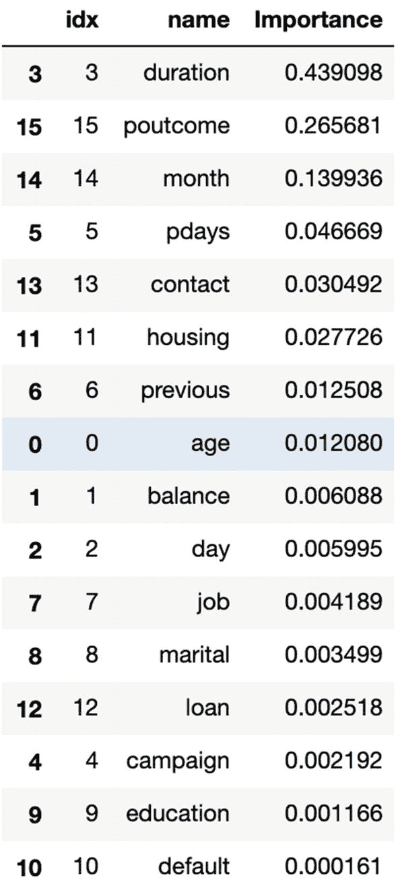

图 4-12

随机森林:特征重要性

此外，您可以使用此表创建一个特性重要性图，如图 [4-13](#Fig18) 所示。

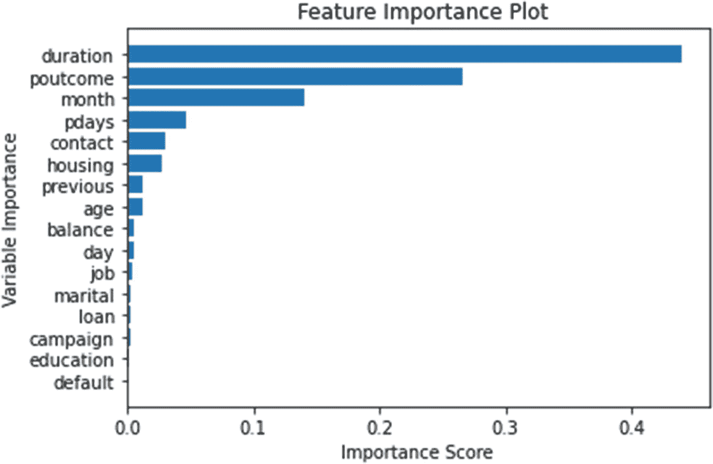

图 4-13

特征重要性图

```py
import matplotlib.pyplot as plt

#just for plotting purposes sort it to ascending
features_df.sort_values("Importance", ascending=True, inplace=True)
plt.barh(features_df['name'], features_df['Importance'])
plt.title("Feature Importance Plot")
plt.xlabel("Importance Score")
plt.ylabel("Variable Importance")

```

很酷，对吧？您可以使用其他算法来完成相同的任务。然而，在处理大型数据集时，基于随机森林的要素选择使该过程变得容易得多。使用基于树的方法的一个缺点是它使用训练数据集来计算特征重要性。这可能会夸大数字和高基数变量的重要性。为了克服这个问题，您可以使用排列重要性，它使用测试数据集来计算要素的重要性。排列的重要性超出了本书的范围。

Note

使用逻辑回归等线性模型时，使用模型中的系数来展示要素的重要性。系数的绝对值越大，变量越重要，反之亦然。

最后，我们将重点关注*连续*和*多项式*目标。

1.  对于连续目标，可以使用回归树(`RandomForestRegressor`或其他树)，可以从`pyspark.ml.regression`模块访问。对于连续模式，您必须使用`LinearRegression`模块，而不是`LogisticRegression`。刚才讨论的代码的其余部分可以被重用来计算特性的重要性。

2.  对于多项目标，除了线性模型`LogisticRegression`之外，您仍然可以使用本节讨论的基于树的模型。当处理多项目标时，使用逻辑回归计算特征重要性有点棘手。我们建议您对此类目标坚持基于树的模型。

到目前为止，我们已经检查了代码，但没有研究功能重要性计算背后的公式。别担心。我们将在下一章讨论树的时候再次回顾这一节。

Exercise 4-2: Model-Based Selection

您可以使用银行数据集或住房数据集。

**问题 1:** 实现决策树特征重要性。与随机森林输出进行比较和对比。

**问题 2:** 实现梯度提升的树特征重要性。与随机森林输出进行比较和对比。

**问题 3:** 实现逻辑回归特征重要性。与随机森林输出进行比较和对比。(提示:使用逻辑回归的系数。注:逻辑回归产生密集向量，而不是稀疏向量。)

## 定制变量选择流程

在下一节中，我们将介绍一些自定义变量选择技术。

### 使用证据权重的信息价值

证据权重(WOE)和信息价值(IV)是执行*变量转换和选择*的简单而强大的技术。这些概念与逻辑回归建模技术密切相关。它被广泛用于信用评分，以衡量好客户与坏客户的区别。例如，如果您试图预测客户是否会拖欠付款，所有已经拖欠的客户将被视为事件，而那些没有拖欠的客户将被视为非事件。

这里提供了计算 WOE 和 IV 的公式:


或者干脆，


图 [4-14](#Fig19) 显示了如何计算这些值。


图 4-14

WOE 和 IV 计算

WOE 转换的优点如下:

1.  处理缺失值

2.  处理异常值

3.  该变换基于分布的对数值。这与逻辑回归输出函数一致。

4.  不需要虚拟变量

5.  通过使用适当的宁滨技术，可以在自变量和因变量之间建立单调关系(增加或减少)。

此外，IV 值可用于根据图 [4-15](#Fig20) 所示的预测功率表选择变量。

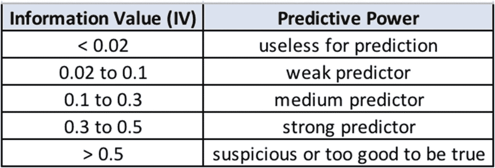

图 4-15

IV 和预测能力

如图 [4-14](#Fig19) 所示，对于 WOE 和 IV 计算，需要类别来执行计算。现在，你可能会想，我该怎么处理连续变量呢？正如我们之前提到的，在执行 WOE 和 IV 计算之前，应该使用适当的宁滨技术将连续数据转换为分类数据。当连续变量的数量很少时(比如说，少于十个)，您可以创建自己的自定义箱，并使用它们进行 WOE 计算。即使这样，创建定制的垃圾箱也是一项单调乏味的任务。现在，考虑一个包含数百个连续变量的大型数据集。创建定制垃圾箱将是一场噩梦。这就是单调宁滨发挥作用的地方。

#### 使用 Spearman 相关的单调宁滨

首先，让我们理解什么是单调。


图 4-16

单调与非单调

从图 [4-16](#Fig21) 中可以看出，在前两种场景中，随着 x 轴变量的增加，y 轴值只有一个趋势:要么增加，要么减少。这是一种单调的关系。在第三个场景中，x 轴变量变化没有单一趋势:增加或减少行为。因此，它是非单调的。当涉及到解释目的时，单调关系是有用的。当两个变量呈现单调关系时，您可以很容易地向非技术观众解释结果。比如说，余额和目标变量有关系，如图 [4-17](#Fig22) 。

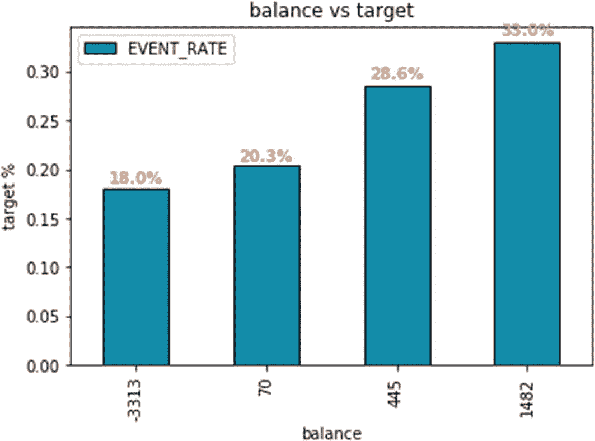

图 4-17

天平与目标箱

通过查看这个图表，你可以很容易地说，“随着余额的增加，目标转化率也增加。”对于非技术观众来说，这个结果很容易理解。

要执行单调宁滨，我们需要了解斯皮尔曼相关性。Spearman 相关性衡量两个变量之间单调关联的强度和方向。好的，它和皮尔逊相关有什么不同？在皮尔逊相关中，我们测试两个变量之间的线性关系。在这种情况下，根据皮尔逊相关性，图 [4-16](#Fig21) 中的第二张图具有中等线性关系。然而，斯皮尔曼相关将认为它是一个强单调的关系。斯皮尔曼相关也被称为*等级顺序相关*。

#### 如何手工计算斯皮尔曼相关？

斯皮尔曼相关公式如下:

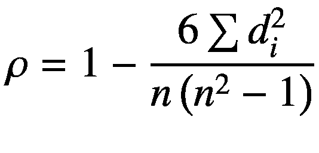T2】

这里， *ρ* 为长枪比试，*d*<sub>T5】I</sub>为成对秩差， *n* 为例数。当你有并列排名，你需要使用以下公式。Rank 是结果集中的有序数。


这里， *i* 是配对分数。现在，我们将只使用第一个公式来计算斯皮尔曼相关性(图 [4-18](#Fig23) )。

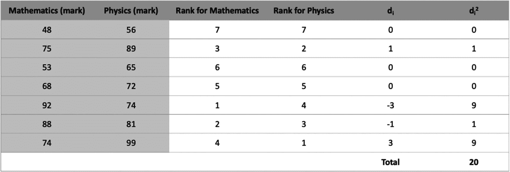

图 4-18

斯皮尔曼相关计算

使用*d*<sub>*I*</sub><sup>*2*</sup>为 20， *n* 为 7，我们可以使用第一个等式计算 *ρ* 值:

```py
p = 1 - ((6*20)/(7*((7*7) - 1))) = 0.64285714

```

从这个数字 0.64 我们可以推断出什么？一般来说，Spearman 相关值的范围是从-1 到+1。当值接近 1 或-1 时，两个变量之间的单调关系更强。当值接近 0 时，两个变量之间没有单调关系。在我们的例子中，数学和物理成绩表现出强烈的单调关系。图 [4-19](#Fig24) 是用于确定关系强度的指南。

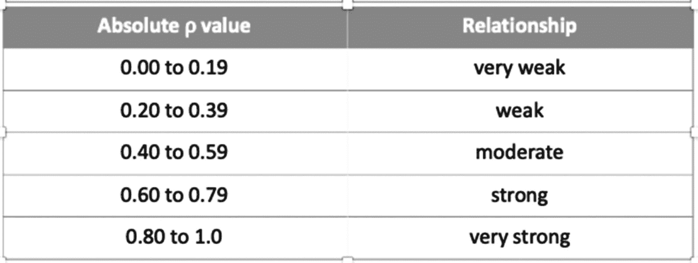

图 4-19

斯皮尔曼相关值指南

#### 如何使用 Spearman 相关性来创建连续变量的单调箱？

在单调宁滨的代码中，您会注意到`mono_bin()`函数使用了一个`max_bin`选项。这是用户指定的值。对于连续变量，我们从用户提供的`max_bin`开始，并随着每一步的进行减少仓位。我们根据`max_bin`创建分位数。接下来，我们根据新创建的分位数箱和目标变量计算 Spearman 相关性。直到我们在连续变量和目标变量之间建立了强单调关系，我们继续减少`max_bin`值以创建新的分位数并计算 Spearman 值。当我们在两个变量之间达到强相关时，宁滨过程就停止了。

下面是计算 WOE 和 IV 的完整代码，包括连续变量的单调宁滨选项。我们提供了从数据加载到 WOE 和 IV 计算的完整代码。这段代码可以在任何数据集上使用。并且，代码是作为自学提供的。

```py
# Default parameters
from pyspark.sql import SparkSession
spark = SparkSession.builder.getOrCreate()
dataset = 2 # 1 or 2
# Load Dataset
from pyspark.sql import functions as F

# if the option is set as 1 load bank dataset
if dataset == 1:
    filename = "bank-full.csv"
    target_variable_name = 'y'
    df = spark.read.csv(filename, header=True, inferSchema=True, sep=';')
    df = df.withColumn(target_variable_name, F.when(df[target_variable_name] == 'no', 0).otherwise(1))
# if the option is not set as 1 load housing dataset

else:
    filename = "melb_data.csv"
    target_variable_name = "type"
    df = spark.read.csv(filename, header=True, inferSchema=True, sep=',')
    df = df.withColumn(target_variable_name, F.when(df[target_variable_name] == 'h', 0).otherwise(1))

df.show()
# target check
df.groupby(target_variable_name).count().show()
#identify variable types and perform some operations
def variable_type(df):

    vars_list = df.dtypes
    char_vars = []
    num_vars = []
    for i in vars_list:
        if i[1] in ('string'):
            char_vars.append(i[0])
        else:
            num_vars.append(i[0])

    return char_vars, num_vars

char_vars, num_vars = variable_type(df)

if dataset != 1:
    char_vars.remove('Address')
    char_vars.remove('SellerG')
    char_vars.remove('Date')
    char_vars.remove('Suburb')
num_vars.remove(target_variable_name)
final_vars = char_vars + num_vars

# WOE & IV code
from pyspark.sql import functions as F
import pandas as pd
import numpy as np

from pyspark.ml.feature import QuantileDiscretizer
from pyspark.ml.feature import VectorAssembler
import scipy.stats.stats as stats

#default parameters
#rho value for Spearman correlation. You can adjust this value
custom_rho = 1
#maximum number of bins to start of with. It will keep decreasing from this number. Adjustable parameter
max_bin = 20

# This function calculates the WOE and IV values based on the PySpark output.
# Note: This portion of the code is Python-based implementation for efficieny purposes
def calculate_woe(count_df, event_df, min_value, max_value, feature):

    # implemeting the table structure shown in WOE & IV calculation figure
    woe_df = pd.merge(left=count_df, right=event_df)
    woe_df['min_value'] = min_value
    woe_df['max_value'] = max_value
    woe_df['non_event'] = woe_df['count'] - woe_df['event']
    woe_df['event_rate'] = woe_df['event']/woe_df['count']
    woe_df['nonevent_rate'] = woe_df['non_event']/woe_df['count']
    woe_df['dist_event'] = woe_df['event']/woe_df['event'].sum()
    woe_df['dist_nonevent'] = woe_df['non_event']/woe_df['non_event'].sum()
    woe_df['woe'] = np.log(woe_df['dist_event']/woe_df['dist_nonevent'])
    woe_df['iv'] = (woe_df['dist_event'] - woe_df['dist_nonevent'])*woe_df['woe']
    woe_df['varname'] = [feature]* len(woe_df)
    woe_df = woe_df[['varname','min_value', 'max_value', 'count', 'event', 'non_event', 'event_rate', 'nonevent_rate', 'dist_event','dist_nonevent','woe', 'iv']]
    woe_df = woe_df.replace([np.inf, -np.inf], 0)
    woe_df['iv'] = woe_df['iv'].sum()
    return woe_df

#monotonic binning function implemented along with Spearman correlation
def mono_bin(temp_df, feature, target, n = max_bin):

    r = 0
    while np.abs(r) < custom_rho and n > 1:

        try:
            #Quantile discretizer cuts data into equal number of observations
            qds = QuantileDiscretizer(numBuckets=n, inputCol=feature, outputCol="buckets", relativeError=0.01)
            bucketizer = qds.fit(temp_df)
            temp_df = bucketizer.transform(temp_df)

            #create corr_df is Python-based implementation

for efficiency purposes
            corr_df = temp_df.groupby('buckets').agg({feature:'avg', target:'avg'}).toPandas()
            corr_df.columns = ['buckets', feature, target]
            r, p = stats.spearmanr(corr_df[feature], corr_df[target]) #spearman correlation
            n = n - 1
        except Exception as e:
            n = n - 1

        return temp_df

#execute WOE for all the variables in the dataset
def execute_woe(df, target):

    count = -1
    for feature in final_vars:
        #execute if the feature is not a target column name. Provided as an extra check.
        if feature != target:
            count = count + 1
            temp_df = df.select([feature, target])

            #perform monotonic binning for numeric variables before doing WOE calculation
            if feature in num_vars:
                temp_df = mono_bin(temp_df, feature, target, n = max_bin)
                # group buckets in numerical
                grouped = temp_df.groupby('buckets')
            else:
                # just group categories in categorical
                grouped = temp_df.groupby(feature)

            #count and event value for each group
            count_df = grouped.agg(F.count(target).alias('count')).toPandas()
            event_df = grouped.agg(F.sum(target).alias('event')).toPandas()

            #store min and max values for variables. for category both takes the same value.
            if feature in num_vars

:
                min_value = grouped.agg(F.min(feature).alias('min')).toPandas()['min']
                max_value = grouped.agg(F.max(feature).alias('max')).toPandas()['max']
            else:
                min_value = count_df[feature]
                max_value = count_df[feature]

            #calculate WOE and IV
            temp_woe_df = calculate_woe(count_df, event_df, min_value, max_value, feature)

            #final dataset creation
            if count == 0:
                final_woe_df = temp_woe_df
            else:
                final_woe_df = final_woe_df.append(temp_woe_df, ignore_index=True)

        # separate IV dataset creation
        iv = pd.DataFrame({'IV':final_woe_df.groupby('varname').iv.max()})
        iv = iv.reset_index()
    return final_woe_df, iv

# invoke WOE & IV code
output, iv = execute_woe(df, target_variable_name)

```

仅此而已。我们不再看重证据和信息价值。

### 定制变压器

到目前为止，我们已经了解了 Spark ML 中一些可用于执行变量选择的高级 API(前面讨论过的内置选择技术)。在本节中，我们将创建一个定制的 Spark ML 转换器来完成同样的事情。为什么我们需要讨论定制变压器？

花点时间想想我们之前用于变量选择的`RandomForest`代码:

```py
from pyspark.ml.classification import RandomForestClassifier
rf = RandomForestClassifier(featuresCol='features', labelCol=target_variable_name)
rf_model = rf.fit(df)
rf_model.featureImportances

```

用几行代码，我们做到了:(1)调用`RandomForest`；(2)定义一个`RandomForest`对象的实例；(3)在数据集上拟合模型；以及(4)显示重要性分数。这就是面向对象编程(OOP)的强大之处。下面是 OOP 概念的快速复习:

1.  *类*–用于创建对象实例的自定义蓝图。在代码行 2 中，`RandomForestClassifier`是一个类，`rf`是对象实例。

2.  *方法*–写在类内部的函数叫做方法。在第 3 行中，`fit`函数是一个*方法*。

3.  *抽象*——这是一个只向用户展示基本信息的概念。这被称为实现隐藏。在前面显示的`RandomForestClassifier`代码中，我们只提供输入变量、目标和数据集来适应模型。我们看不到随机森林模型在后台是如何实现的任何细节。

4.  *封装*——这是一个对用户隐藏信息的概念。这就是所谓的信息隐藏。任何*变量/方法*都可以用这种技术隐藏。*变量/方法*可以是*保护的*(单下划线在前，不能在类外访问`,`，可在类及其子类内访问)，也可以是私有的(双下划线在前，只能在类内访问)。当您查看源代码时，您可能仍然能够看到变量/方法。因此，它们在概念上是隐藏的，但在视觉上不是。

5.  *继承*–这是一个继承父类的特征来创建子类的概念。想象一个正方形的物体。严格来说，它是一个四边相等的长方形。在这种情况下，`rectangle`是父类，`square`是子类。

6.  *多态*——这是一个你可以改变一个物体的特征的概念。这意味着你可以让同一个物体做不同于平常的事情。想想*加号(+)* 符号。最初，它只能对数值变量求和。在 Python 中，当字符串之间包含加法时，它会将它们连接起来。当您执行代码`print("Hello " + "World")`时，它连接字符串以产生`Hello World`输出。在这种情况下，*加法(+)* 符号可以添加字符串和数字。这是多态性的一个例子。

使用 OOP 概念，你可以创建一个强大的机器学习类对象。这使得最终用户使用您的代码变得简单。此外，这些对象更容易合并到单个流水线或工作流中，从而创建高效的端到端流程。好了，让我们快速看一下用来创建这样的定制代码的主要概念。

#### 流水线中的主要概念

*   *DataFrame* :组织在单个 ML 数据集中的不同数据类型的集合

*   *估计器*:这是用来*拟合*一个函数到一个数据帧。在`RandomForestClassifier`中，`fit`函数是我们的估计量。

*   *转换器*:用于*将*数据帧从一个转换到另一个。有时，在应用之前，转换器需要一个合适的函数。在`RandomForestClassifier`中，`predict`功能是一个变压器。

*   *Pipeline* :一个 ML 工作流或一系列要执行的步骤，以获得最终结果。

*   *参数*:估算器和变压器使用统一的 API 来指定参数。

让我们创建一个自定义关联`class`并将其用于变量选择。最后，我们将演示流水线用例。在我们进行任何实现之前，让我们快速浏览一下用于计算数据集相关性的代码。

```py
from pyspark.mllib.stat import Statistics
import pandas as pd
correlation_type = 'pearson' # 'pearson', 'spearman'

#transformer function
for k, v in df.schema["features"].metadata["ml_attr"]["attrs"].items():
    features_df = pd.DataFrame(v)
column_names = list(features_df['name'])
df_vector = df.rdd.map(lambda x: x['features'].toArray())
matrix = Statistics.corr(df_vector, method=correlation_type)
corr_df = pd.DataFrame(matrix, columns=column_names, index=column_names)

```

前面的代码用相关结果生成了一个 pandas 数据帧。我们将添加更多的代码来扩展它的功能。我们将包括一个选项，使用外部参数来查找最相关的变量。

```py
#transformer continuation
final_corr_df = pd.DataFrame(corr_df.abs().unstack().sort_values(kind='quicksort')).reset_index()
final_corr_df.rename({'level_0': 'col1', 'level_1': 'col2', 0: 'correlation_value'}, axis=1, inplace=True)
final_corr_df = final_corr_df[final_corr_df['col1'] != final_corr_df['col2']]
correlation_cutoff = 0.65 #custom parameter
final_corr_df[final_corr_df['correlation_value'] > correlation_cutoff]

```

我们建议您在使用自定义的`class`之前先体验一下前面的代码。

```py
# Import the estimator and transformer classes
from pyspark.ml import Transformer
# Parameter sharing class. We will use this for input column
from pyspark.ml.param.shared import HasInputCol
# Statistics class to calculate correlation
from pyspark.mllib.stat import Statistics
import pandas as pd
# custom class definition
class CustomCorrelation(Transformer, HasInputCol):
    """
    A custom function to calculate the correlation between two variables

.

    Parameters:
    -----------
    inputCol: default value (None)
        Feature column name to be used for the correlation purpose. The input column should be assembled vector.

    correlation_type: 'pearson' or 'spearman'

    correlation_cutoff: float, default value (0.7), accepted values 0 to 1
        Columns more than the specified cutoff will be displayed in the output dataframe.
    """

    # Initialize parameters for the function
    def __init__(self, inputCol=None, correlation_type="pearson", correlation_cutoff=0.7):

        super(CustomCorrelation, self).__init__()

        assert inputCol, "Please provide a assembled feature column name"
        #self.inputCol is class parameter
        self.inputCol = inputCol

        assert correlation_type == 'pearson' or correlation_type == 'spearman', "Please provide a valid option for correlation type. 'pearson' or 'spearman'. "
        #self.correlation_type is class parameter
        self.correlation_type = correlation_type

        assert 0.0 <= correlation_cutoff <= 1.0, "Provide a valid value for cutoff. Accepted range is 0 to 1"
        #self.correlation_cutoff is class parameter
        self.correlation_cutoff = correlation_cutoff

    # Transformer function, method inside a class, '_transform' - protected parameter
    def _transform(self, df):

        for k, v in df.schema[self.inputCol].metadata["ml_attr"]["attrs"].items():
            features_df = pd.DataFrame(v)

        column_names = list(features_df['name'])
        df_vector = df.rdd.map(lambda x: x[self.inputCol].toArray())

        #self.correlation_type is class parameter

        matrix = Statistics.corr(df_vector, method=self.correlation_type)

        # apply pandas dataframe operation on the fit output
        corr_df = pd.DataFrame(matrix, columns=column_names, index=column_names)
        final_corr_df = pd.DataFrame(corr_df.abs().unstack().sort_values(kind='quicksort')).reset_index()
        final_corr_df.rename({'level_0': 'col1', 'level_1': 'col2', 0: 'correlation_value'}, axis=1, inplace=True)
        final_corr_df = final_corr_df[final_corr_df['col1'] != final_corr_df['col2']]

        #shortlisted DataFrame based on custom cutoff
        shortlisted_corr_df = final_corr_df[final_corr_df['correlation_value'] > self.correlation_cutoff]
        return corr_df, shortlisted_corr_df

```

瞧啊。现在我们有了自定义的关联`class`,它的工作方式类似于任何 Spark ML 对象。这段代码可以保存在一个单独的 Python 文件中 *customcorrelation.py* `.`让我们测试一下我们的新类。

```py
from customcorrelation import CustomCorrelation
clf = CustomCorrelation(inputCol='features')
output, shorlisted_output = clf.transform(df)

```

仅此而已。您使用了三行代码来计算数据集中输入要素之间的相关性。这类似于我们之前看到的`RandomForestClassifier`调用。有些人可能会问我们是否可以用*用户定义函数(UDF)*做同样的事情。就代码的抽象而言，你是对的；然而，*UDF*不适合流水线工作流。到目前为止，我们所做的所有这些努力都是为了使我们的工作流水线兼容。那么，让我们也测试一下这个特性。为了演示这个特性，我们将把组装向量步骤和关联步骤合并到一个流水线中。如果需要重新运行，则需要执行到本章前面讨论的*“步骤 2:将 StringIndexer 应用于字符列”*。

```py
from pyspark.ml.feature import VectorAssembler
from customcorrelation import CustomCorrelation
from pyspark.ml import Pipeline

#exclude target variable and select all other feature vectors
features_list = df.columns

features_list.remove(target_variable_name)
stages = []

#assemble vectors
assembler = VectorAssembler(inputCols=features_list, outputCol="features")
custom_corr = CustomCorrelation(inputCol=assembler.getOutputCol())
stages = [assembler, custom_corr]

#use pipeline to process sequentially
pipeline = Pipeline(stages=stages)

#pipeline model
pipelineModel = pipeline.fit(df)

#apply pipeline model on data
output, shorlisted_output = pipelineModel.transform(df)

```

相当酷！现在，您可以实现自己的定制转换器，并创建一个整洁的 ML 工作流。

### 投票选择

到目前为止，我们已经讨论了变量选择过程的多种技术。将所有变量选择选项合并到一个过程中不是很棒吗？我们将使用基于投票的模式来实现这一点。这个想法是应用多种技术来选择变量。当变量选择技术选择一个变量时，我们给这个变量分配一个分数。换句话说，这项技术选择了那个变量。最后，我们计算每个变量的总得分，并选择得分最高的变量(图 [4-20](#Fig25) )。这样，我们最终从各种选择技术中挑选出具有最高“偏好”的变量，这取决于手头的情况，当单独使用时可能不会很好地工作。

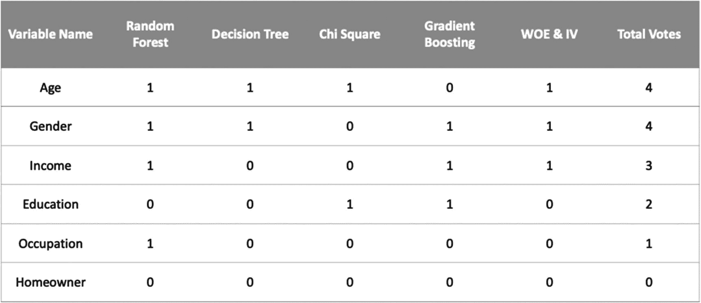

图 4-20

投票选择

本节要求您完成*练习 4-2:基于模型的选择*。为了便于演示，我们在这里提供了练习的解决方案(图 [4-21](#Fig26) )。我们将使用本章前面讨论过的所有基于目标的选择技术。

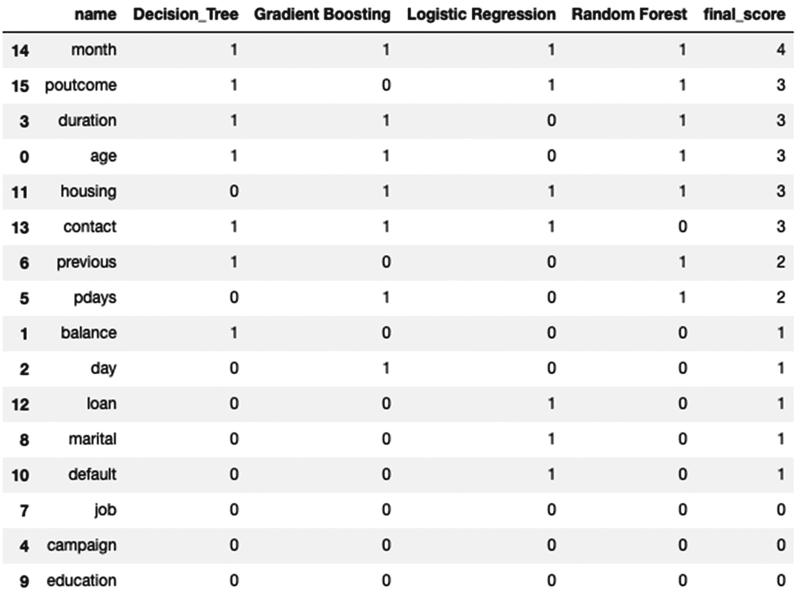

图 4-21

基于投票的选择输出

```py
#decision tree algorithm – solution to Question 1
from pyspark.ml.classification import DecisionTreeClassifier
dt = DecisionTreeClassifier(featuresCol='features', labelCol=target_variable_name)
dt_model = dt.fit(df)
dt_output = dt_model.featureImportances
features_df['Decision_Tree'] = features_df['idx'].apply(lambda x: dt_output[x] if x in dt_output.indices else 0)

#Gradient boosting algorithm – solution to Question 2
from pyspark.ml.classification import GBTClassifier
gb = GBTClassifier(featuresCol='features', labelCol=target_variable_name)
gb_model = gb.fit(df)
gb_output = gb_model.featureImportances
features_df['Gradient Boosting'] = features_df['idx'].apply(lambda x: gb_output[x] if x in gb_output.indices else 0)

#logistic regression algorithm – solution to Question 3
from pyspark.ml.classification import LogisticRegression
lr = LogisticRegression(featuresCol='features', labelCol=target_variable_name)
lr_model = lr.fit(df)
lr_output = lr_model.coefficients
#absolute value is used to convert the negative coefficients. This should be done only for feature importance

.
features_df['Logistic Regression'] = features_df['idx'].apply(lambda x: abs(lr_output[x]))

#random forest – technique which we discussed before
from pyspark.ml.classification import RandomForestClassifier
rf = RandomForestClassifier(featuresCol='features', labelCol=target_variable_name)
rf_model = rf.fit(df)
rf_model.featureImportances
rf_output = rf_model.featureImportances
features_df['Random Forest'] = features_df['idx'].apply(lambda x: rf_output[x] if x in rf_output.indices else 0)

#voting-based selection
features_df.drop('idx', axis=1, inplace=True)
num_top_features = 7 #top n features from each algorithm
columns = ['Decision_Tree', 'Gradient Boosting', 'Logistic Regression', 'Random Forest']
score_table = pd.DataFrame({},[])
score_table['name'] = features_df['name']
for i in columns:
    score_table[i] = features_df['name'].isin(list(features_df.nlargest(num_top_features,i)['name'])).astype(int)
score_table['final_score'] = score_table.sum(axis=1)
score_table.sort_values('final_score',ascending=0)

```

## 摘要

*   我们详细介绍了变量选择技术。

*   我们讨论了基于目标和不基于目标的选择技术。

*   我们创建了自己的 Spark ML transformer，并使其适合 ML 工作流。

*   最后，我们将所有的选择技术结合起来，创建了一个基于投票的选择技术。

干得好！在下一章，我们将学习本书中最激动人心的部分——机器学习模型。继续学习，敬请关注。