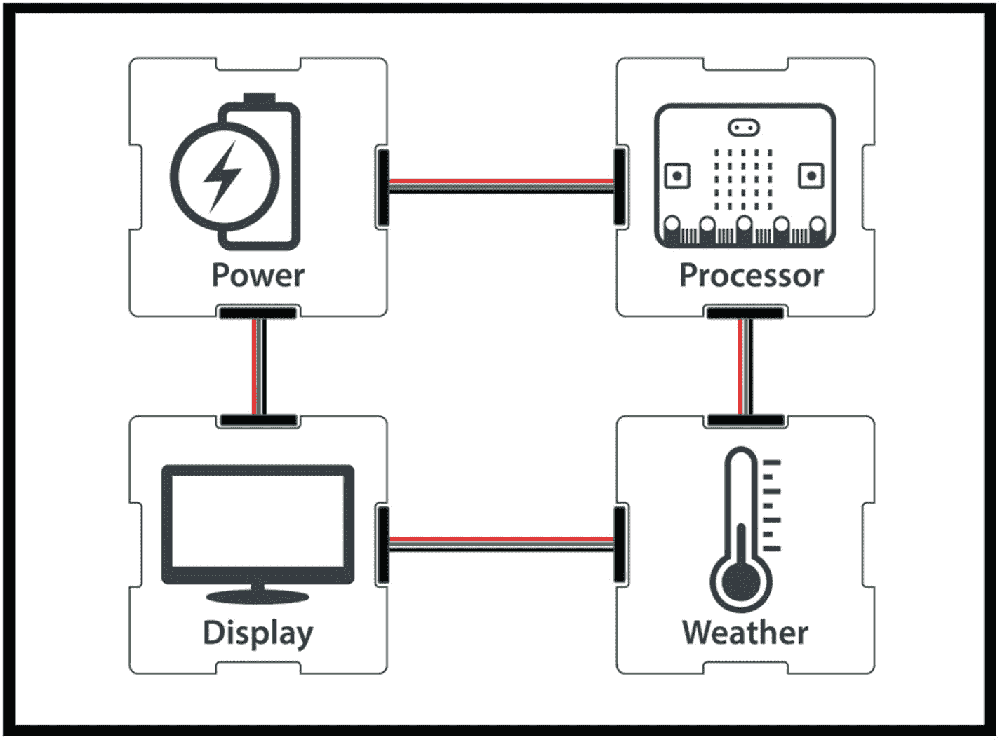
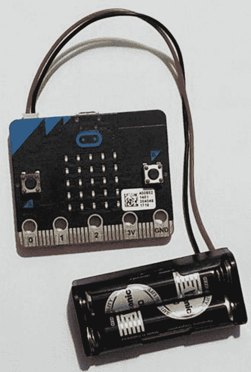
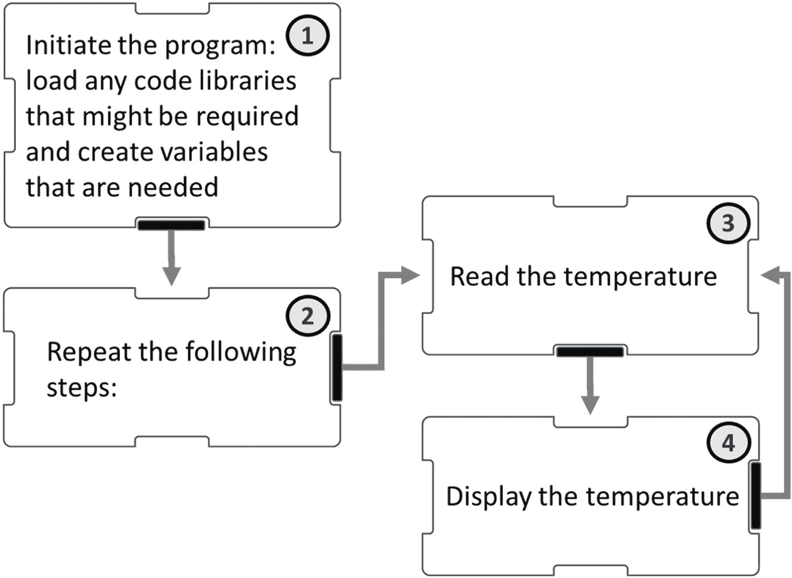
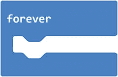
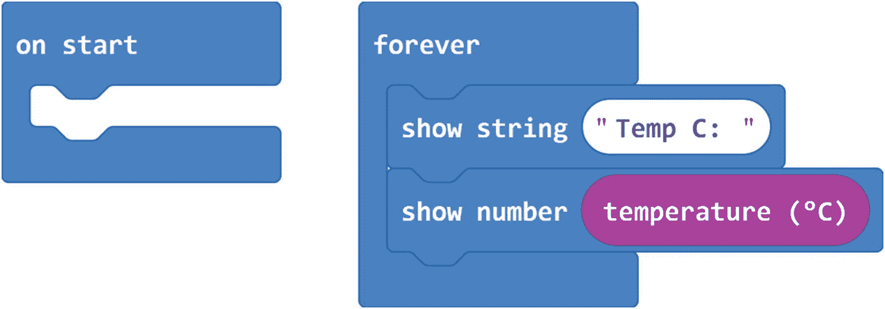
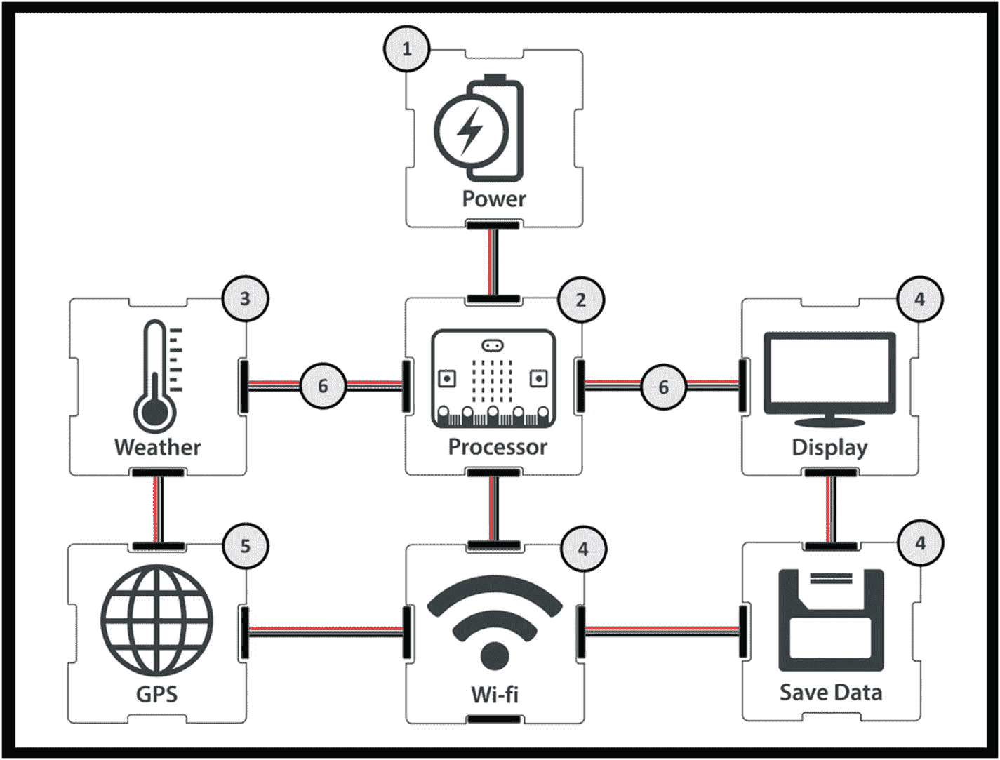
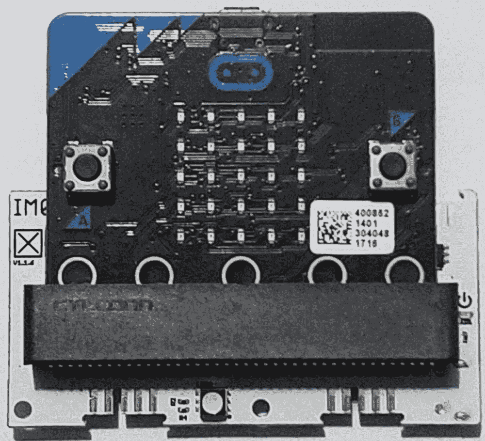
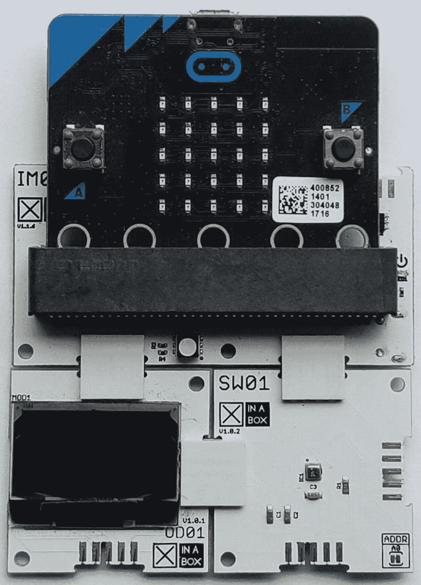
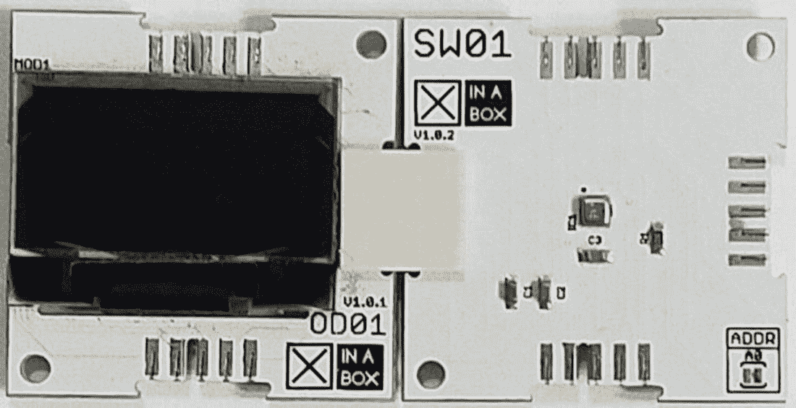
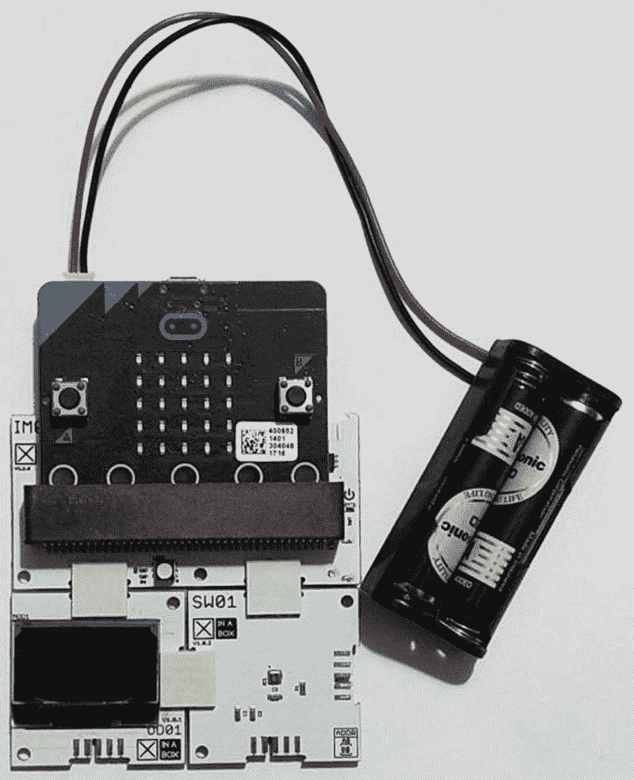

# 二、数据科学走向数字化

在这一章中，我们将识别一组电子元件，用它们我们将构建一系列不同的数字工具。这些工具将用于收集数据，这是我们进入数据科学之旅的必要燃料。

## 2.1 使其数字化

你知道吗，这个星球上的每一个青少年都出生在 21 世纪，在互联网、电子邮件甚至谷歌诞生之后。今天成长起来的许多孩子从来不知道没有数字魔法。我们生活在一个数字化的世界里——它悄悄靠近了我们中的一些人，但我们中越来越多的人出生在这个世界里。人们甚至将我们当前的时代称为数字时代或信息时代，这是对信息融入我们生活方方面面程度的承认。数字革命——用数字等价物取代模拟技术——为我们的现代社会奠定了基础。

虽然模拟温度计在第**章** [**1**](01.html) 中为我们提供了很好的服务，但为了了解更多关于数据科学的知识，我们将需要访问越来越复杂的数据集:随着我们的实验变得更加雄心勃勃，我们将收集数百、数千甚至数百万个数据点。我们的模拟温度计不适合这个目的，其他模拟工具也是如此。我们需要先进的数字工具来实现这一旅程。

## 2.2 数字测量温度

在第**章** [**1**](01.html) 中，我们看到了模拟温度计的工作原理；基本原理对于数字设备是相同的。环境温度会导致某些东西发生反应和变化，这种变化可以通过某种方式观察到:

*   在模拟温度计中，可见的水银柱会发生变化。

*   在数字工具中，反应被转换成计算机(或微处理器)可以感知和解释的电信号。

**图** [**2-1**](#Fig1) 显示了构成数字温度计的不同元件。这是一个非常基本的**“电路”**或**“框图****”**，在本书中通篇使用。

图 2-1

数字温度计的核心组件

任何数字温度计都有以下组件:

1.  **电源**:数字电路需要电能。

2.  一个微处理器:它的作用将在下面详细解释。

3.  **温度传感器**:当给温度传感器供电时，它会对周围的环境温度做出反应。传感器通过电路传输其状态数据，其作用与模拟温度计中的水银相同。

4.  **输出温度数据的方式**:例如在屏幕上。

5.  这些需要以某种方式连接在一起:连接组件的线也很重要。

### 微处理器的作用

微处理器可以比作婴儿的大脑:充满潜力，但实际上什么也做不了。婴儿通过被教导来学习如何执行基本动作，而我们**通过在微处理器上加载计算机程序来“教导”微处理器如何执行基本动作。**

 **微处理器是电路的**“大脑”**。电流流过电路，微处理器**监控这种电流，解释任何编码到其中的数据，然后对其进行处理。作为温度计使用:**

 ***   微处理器知道它需要**【听】**来自温度传感器的任何信号:它知道这一点，因为有人，也许是我们，已经**【编程】**它这样做。当从传感器接收到信号时，微处理器能够将该信号转换成可用的数据点:温度读数。

*   微处理器还知道如何向屏幕发送信息，使其显示单词和数字:它知道这一点，因为程序中已经告诉过它如何操作。它会向屏幕发送信号，让屏幕显示温度。有人，也许是我们，已经编程/告诉微处理器在屏幕上显示什么信息以及如何显示。

## 2.3 构建数字工具

我们真的需要知道如何构建数字工具才能成为数据科学家吗？在专业领域，数据科学家不需要成为工具制造商:

*   有许多现成的产品可以满足您的数据收集需求。你可以购买天气监测器、二氧化碳监测器和告诉你温度的应用程序。

*   一个从事数据科学的团队可能有许多领域的专家，他们都负责过程的不同部分:其他人可能构建数据收集工具。

*   你可以委托某人为你收集数据。很多企业会卖给你各种各样的数据。或者使用在线工具。

这本书是为那些无法使用这些方法的人写的；我们将不得不自己收集数据，我们将建立我们需要的数据收集工具。

知道如何构建数字工具永远是一项有用的技能，但它显然不是数据科学的核心技能。数据科学领域包含许多学科:数据分析师、工具制作者、数据收集者、项目经理和实验设计者等等。他们的所有贡献都在数据科学过程中发挥了作用。在这本书里，我们学到了足够的电路构建知识，使我们能够构建探索数据科学所需的工具。我们将向您展示如何在不需要先成为工程师的情况下做到这一点:阅读本书不需要任何电路构建(或计算机编程)方面的知识。

## 2.4 使用 BBC micro:bit 作为温度计

你知道 BBC micro:bit 有内置温度传感器吗？它易于使用，意味着 micro:bit 可以被编程为像温度计一样工作，这就是我们将要做的。

我们已经看到了了解测量工具如何帮助我们理解它所产生的数据:

当 BBC micro:bit 制造出来的时候，电路板上没有温度传感器。只有在设计完成后，一名工程师才意识到 micro:bit 上有一个内置热传感器的芯片，并有可能从中获取温度。有一个类似的故事，有人意识到 LED 矩阵的光敏性可以用作一个原始的传感器。

要将 micro:bit 用作温度计，我们必须编写一些代码，然后**将这些代码复制到 micro:bit 上**(或 **flash** )。我们制造的每一个数字工具都需要编码。

## 2.5 本书中使用的编码指南

在整本书中，我们将构建更加复杂的数字工具来帮助我们发展数据科学技能，并且每个工具都需要为其编写代码。在编写工具代码时，我们总是提供两种选择:

1.  **无代码选项**:到我们的**资源网站** ( [`http://xib.one/XB`](https://nam12.safelinks.protection.outlook.com/?url%253Dhttp%253A%252F%252Fxib.one%252FXB%2526data%253D02%257C01%257C%257C96ee9c32c458423e9b6a08d7c36cd73f%257C84df9e7fe9f640afb435aaaaaaaaaaaa%257C1%257C0%257C637192744542720716%2526sdata%253D0W1OfWTmIx3U20MIwolvjFvh9lCQJVpw9KNNvUwCdU8%253D%2526reserved%253D0) )找到**“X . Y 节”。**您将看到一个十六进制文件，您可以下载并直接闪存到您的 micro:bit 上。说明书在这一页上。在整本书中，我们将为您提供**【无代码】**解决方案。

2.  **一个你可以自己编码的选项:**在可能的情况下我们会使用**微软 MakeCode** ，这是一个有趣且易于使用的**块代码编辑器**。在 MakeCode 没有提供我们需要的功能的地方，使用了 MicroPython 。我们将使用 **Mu 编辑器**进行 MicroPython 编码。

如果您选择编写自己的代码，我们将首先向您展示**自然语言代码**:用自然语言编写的实现我们目标所需过程的逐步描述。然后，我们将向您展示将自然语言代码**转化为可在您的 micro:bit 上运行的真实代码所需的 **MakeCode** 块(或 **MicroPython** 代码)。这种方法使代码更容易适应不同的硬件平台或不同的编码语言:自然语言代码充当简单但足够的软件规范。**

## 2.6 使用微:位代码编辑器

如果你选择自己写代码，那么你需要选择一个代码编辑器。BBC 微:bit 有几个选项；我们将提供 MakeCode 和 Mu (MicroPython)的指南。

这本书的目的不是向你介绍 BBC micro:bit 上的编码——有很多很棒的书可以供你参考。但对于那些刚刚接触 BBC micro:bit 编码的人来说，有几个关键话题需要了解。你可以在我们的**资源网站** ( [`http://xib.one/XB`](https://nam12.safelinks.protection.outlook.com/?url%253Dhttp%253A%252F%252Fxib.one%252FXB%2526data%253D02%257C01%257C%257C96ee9c32c458423e9b6a08d7c36cd73f%257C84df9e7fe9f640afb435aaaaaaaaaaaa%257C1%257C0%257C637192744542720716%2526sdata%253D0W1OfWTmIx3U20MIwolvjFvh9lCQJVpw9KNNvUwCdU8%253D%2526reserved%253D0) )的链接中读到它们。

## 2.7 使用“无代码”选项

不是每个需要使用气象站的人都想自己编写代码。在某些情况下，编码是一项重要的技能，而在其他情况下，它是不相关的:在计算机科学课上和在地理课上建立一个气象站会有完全不同的方法，并且会有非常不同的学习结果。当然，这本书的重点是数据科学:我们构建的工具和为它们编写的代码只是推动者——我们需要它们来恰当地讲述数据科学的故事，但它们不是故事的英雄。

无代码选项，以及我们在本章后面描述的易于构建的组件系统，将允许您在几分钟内启动并运行您的数字工具。您只需要按照描述构建工具，然后从提供的 URL 下载代码。

而且不要把这当成作弊！当你买了一台新冰箱时，你不会对它进行编程，也不会期望你在开车前对你的车进行编码。那么，为什么您必须编写一个数据收集工具呢？

## 2.8 micro:bit温度计编码

我们现在将建立我们的微:位温度计。

这个的电路非常简单——只需要一个 micro:bit 和一个电源(**图** [**2-2**](#Fig2) )。我们不需要任何额外的东西，因为我们将使用 micro:bit 的板载温度传感器和 5x5 LED 矩阵来显示温度。

图 2-2

微钻头温度计–只有一个微钻头和一个电源(2 个 AAA 电池组)

有几种方法可以为您的 micro:bit 供电，最常见的是:

1.  您可以使用电缆将 micro:bit 插入 USB 插座。

2.  您可以将 micro:bit 附带的 2xAAA 电池组插入可用的连接端口。

在我们的**资源网站** ( [`http://xib.one/XB`](https://nam12.safelinks.protection.outlook.com/?url%253Dhttp%253A%252F%252Fxib.one%252FXB%2526data%253D02%257C01%257C%257C96ee9c32c458423e9b6a08d7c36cd73f%257C84df9e7fe9f640afb435aaaaaaaaaaaa%257C1%257C0%257C637192744542720716%2526sdata%253D0W1OfWTmIx3U20MIwolvjFvh9lCQJVpw9KNNvUwCdU8%253D%2526reserved%253D0) )有更多关于这方面的细节。我们将构建的许多数字工具需要是便携式的，所以你应该确保你有微型:位电池组和一些可用的电池。

我们将需要编写代码来告诉 micro:bit 如何充当温度计:**图** [**2-3**](#Fig3) 为此呈现了**【自然语言代码】**。

图 2-3

数字温度计的自然语言代码

**无代码选项**:您可以在我们的**资源网站**上找到本节所需代码的预编译版本。进入 [`http://xib.one/XB`](https://nam12.safelinks.protection.outlook.com/?url%253Dhttp%253A%252F%252Fxib.one%252FXB%2526data%253D02%257C01%257C%257C96ee9c32c458423e9b6a08d7c36cd73f%257C84df9e7fe9f640afb435aaaaaaaaaaaa%257C1%257C0%257C637192744542720716%2526sdata%253D0W1OfWTmIx3U20MIwolvjFvh9lCQJVpw9KNNvUwCdU8%253D%2526reserved%253D0) ，搜索**章节 2.8** 。

**表** [**2-1**](#Tab1) 展示了如何将之前的**自然语言代码**转换成可以编译并加载到您的 micro:bit 上的 MakeCode 块。

表 2-1

使用 make 代码块开发代码

<colgroup><col class="tcol1 align-left"> <col class="tcol2 align-left"> <col class="tcol3 align-left"></colgroup> 
| 

步骤

 | 

制造商代码

 | 

笔记

 |
| --- | --- | --- |
| one | 打开 MakeCode 并启动一个新项目。 | MakeCode 自动导入核心 micro:bit 库。 |
| Two | 确保您的项目有一个永久循环: | 我们放在一个永久循环中的代码将会一遍又一遍地运行。默认情况下，新项目会预加载一个永久循环。 |
| 3 & 4 | 将以下块添加到永久循环中: | 第一块将使“温度 C:”在 micro:bit led 上滚动。第二块将使温度在微:位发光二极管上滚动。 |

**图** [**2-4**](#Fig4) 显示了 micro:bit 温度计的完整 MakeCode 程序。

图 2-4

制作微型温度计的代码块

现在代码已经写好了，你只需要编译它并下载(“闪存”)到你的 micro:bit 上。如果你不确定如何做，可以查看我们的**资源网站** ( [`http://xib.one/XB`](https://nam12.safelinks.protection.outlook.com/?url%253Dhttp%253A%252F%252Fxib.one%252FXB%2526data%253D02%257C01%257C%257C96ee9c32c458423e9b6a08d7c36cd73f%257C84df9e7fe9f640afb435aaaaaaaaaaaa%257C1%257C0%257C637192744542720716%2526sdata%253D0W1OfWTmIx3U20MIwolvjFvh9lCQJVpw9KNNvUwCdU8%253D%2526reserved%253D0) )。

一旦闪烁过程完成，以摄氏度为单位的温度将显示在 5x5 LED 矩阵上，并持续滚动。输出将类似于**图** [**2-5**](#Fig5) 。

图 2-5

一个温度读数在一个micro:bit上从右向左滚动。每个micro:bit图像代表输出的单个帧

我们放在 micro:bit 上的代码告诉它如何像数字温度计一样工作。我们已经建立了我们的第一个数字工具；现在是时候使用它了。

## 2.9 比较模拟温度计和数字温度计

我们将进行一个快速练习，如**表** [**2-2**](#Tab2) 中所述，我们将同时从 micro:bit 和模拟温度计读取温度，然后比较我们的结果。

表 2-2

练习 2-1 的详细信息

<colgroup><col class="tcol1 align-left"> <col class="tcol2 align-left"></colgroup> 
| 

练习 2-1

 | 

房间里的温度是多少？

 |
| --- | --- |
| 摘要 | 我们使用不同的工具测量房间内的温度，最好由不同的人来读取。数值会有所不同:微:位温度传感器的读数几乎总是比空气温度高，因此很可能比模拟读数高。本练习旨在揭示关于数据质量和所用工具的见解，同时介绍聚合数据的概念。我们如何将所有不同的结果归结为一个单一的度量:房间里的温度是多少？ |
| 持续时间 | 10-15 分钟 |
| 循序渐进的过程 | 1.获取至少一个micro:bit温度计和一个模拟温度计。2.从房间内不同位置的两个设备读取温度，并将其记录在表格中。3.当发现差异时，考虑关于来源的假设。4.收集数据后，完成第 2.9 节中**列出的要点。** |
| 我们将学到什么 | 我们应用我们所了解的数据质量来分析我们的结果，并试图从差异中找出原因。通过试图就房间的温度达成一致，我们被引入聚合和范围。我们还学习如何使用我们设计的 micro:bit 工具来收集数据。 |

## 2.10 分析

在后面的章节中，我们将会看到一些可以用来增强你的分析的工具。但是分析总是从好奇开始——通常是从一些问题开始，比如:

“我家附近的空气质量差吗？”

“湖水是不是一年比一年低了？”

“到月球有多远？”

完成以下部分中的主题。

### 四肢分析

查看 micro:bit 和模拟读数的最大和最小值。**范围**是最大值和最小值之间的差值。哪种工具的范围最大，为什么会这样？这能告诉我们什么，能告诉我们什么吗？更小或更大的范围是理想的吗？为什么？所有这些都与数据的可靠性/有效性相关联。

拥有一个宽广的范围可以反映出房间的不同区域处于不同的温度。然而，一般来说，较小的范围可以表明较高的准确度——如果房间的温度始终保持稳定，那么精确的温度计将具有较小的范围。

但是，我们的微处理器中还有其他东西在起作用:它们的温度计测量安装它们的芯片的工作热量，这通常高于室温。所以它们可能显示出一个更紧密的范围，但也许是因为它们对环境温度不太敏感。

### 平均值分析:“集中趋势”

这个问题真的有完美的正确答案吗:*这个房间*的温度是多少？如果是，房间的哪个部分是准确的温度？我们会选择哪个值来描述这个房间的温度？平均值是一大组数字的方便而有用的汇总。

### 数据质量分析

我们的温度计对吗？还是一个比另一个更正确？请记住将此链接回工具实际测量的内容。

就他们所测量的而言，两者都是正确的——如果有误差，那是因为我们用**外推**。当我们外推时，我们取一个有意义的值，然后把它应用到其他东西上。

因此，当我们取一个适用于房间中很小体积的温度值，并将其应用于整个房间时，我们已经外推了数据。推断会影响数据的有效性:我们推断得越多，数据的有效性就越低。

### 反省

如果我们重复这个练习，会有什么改进？

之前的问题其实没有什么对错的答案；这个练习的价值在于提问和讨论——养成问大量关于数据集的问题的习惯。这是数据分析阶段的核心。

数据分析确实变得更加正式了。数据分析的专业工具非常复杂，支持它的数学也复杂而优雅。但是无论你用什么工具，数据分析都意味着提出问题，然后找到答案。对于数据科学家来说，一组数据就像一盒未开封的巧克力，是一种享受，随时可以被破解和发现。但是首先，一定要检查成分！

## 2.11 为什么选择 micro:bit？

在前面的章节中，模拟温度计可能更容易使用，也可能更精确一些；如果我们想要做的只是测量温度，那么就没有令人信服的理由转向微:位。

展望未来，我们将坚持使用数字工具:数字意味着我们可以获得大量的硬件、软件和知识，可以在我们的数据科学实验中发挥巨大作用。

想象一下，建立一个读取花粉水平的工具，然后将它们实时上传到一个网站，当你四处走动时，该网站会跟踪花粉水平。如果水平太高，添加一个警示灯，让几十个人同时使用它，并实时更新您的路线，带您穿过最不可能引发过敏的区域。这就是应用数据科学，正是对能够做那种非常酷的事情的承诺让我们坚持使用数字工具。

BBC micro:bit 可能不是一个很好的温度计，但它在许多方面满足了我们对微处理器的需求:

*   这是一个非常容易使用的微处理器——它比其他任何选择都更加用户友好。

*   编码编辑器非常容易使用。

*   很多人已经有了它们(大约有 500 万在流通)，而且还在不断生产。这是一个不断发展的平台，尤其是在教育领域。

*   它得到了很好的支持——大量的材料和帮助。

*   它也有一点酷的因素:*从* ***的制作者*** *的博士，又来了 BBC 微:bit* ！

我们将在本书中使用 BBC micro:bit，但当我们列出硬件要求时，我们会建议替代方案。你可以在手边有一个电路游乐场、树莓 Pi 或 Arduino 设备的情况下轻松地跟随这本书。

BBC micro:bit 本身并不能满足我们所有的需求——我们在本章的经历已经向我们展示了一些不足之处:

*   它包括一个温度传感器以及一个磁力计和一个加速计，但没有其他环境传感器。我们需要使用更广泛的传感器来收集有趣的数据。

*   5x5 LED 矩阵不太适合读取大量数据。在某种程度上，我们将需要其他方法从 micro:bit 中获取数据。

我们将走向数字化，我们将使用 BBC micro:bit 作为我们数字工具包中的微处理器。我们还需要用其他一些工具包来增强它，以收集我们需要的所有数据。

## 2.12 我们需要什么套件？

每个数字测量设备都有一些共同的特征:它们由相同的基本元件组成。在本书中，当我们描述如何构建设备时，我们将使用一个电路/框图，如**图** [**2-1**](#Fig1) (前面已显示)和**图** [**2-6**](#Fig6) 来显示所包含的硬件组件。使用这些电路图/框图，您可以使用任何您可以使用的硬件来构建您的工具/仪器。**图** [**2-6**](#Fig6) 显示了一个由七个元件组成的电路示例。

图 2-6

复杂数字工具组件的简单再现

我们在本书中构建的工具将包括以下大部分组件:

1.  **一个电源**:我们会使用 2 个 AAA 电池座或者 micro:bit 自带的 USB 线来供电。

2.  **一个微处理器**:我们要用 BBC 的 micro:bit。

3.  **一个或多个传感器**:测量物体的传感器。有大量的数字传感器可用，到本书结束时，你应该有足够的信心找到一个特定的传感器，并用它来创建一个数字测量工具。

4.  **输出数据的几种方式**:这张图片向我们展示了使用有机发光二极管显示器、文件系统和 Wi-Fi——三种不同的方式来访问从传感器收集的数据。

5.  其他**酷东西**:像 GPS 或者执行器(移动或者控制东西:比如启动马达或者开灯)。

6.  **一种连接所有部件的方法**:当所有部件都连接起来时，我们就有了一个**电路**元件的连接方式是电路的一个关键要素，通常并不简单。

图**[**2-5**](#Fig5)所示的仪器将是一个很好的天气监测工具。GPS 模块将允许我们对我们的结果进行地理标记，以确定读取数据的位置。Wi-Fi 模块将用于将数据从仪器上传到物联网(IoT)平台，并允许我们获得实时时间，该时间将用于对数据进行**时间戳**(当读取数据时，也会记录读取时间)。数据会保存在本地存储卡上，以防 Wi-Fi 连接中断。我们需要一个工具包，让我们能够构建如此复杂的数据收集工具。**

 **## 2.13 选择我们的工具包

大多数电子产品零售商都会储备我们需要的组件:我们只需在谷歌上搜索一下，就能制造出一些非常酷、非常独特的工具。

但是，除非你熟悉微型计算机的世界，否则众多的选择将会令人望而生畏。从新手到经验丰富的制作者，以下问题总是让购买者感到有点紧张:

*   我们怎么知道该买哪些呢？市场上有几十种二氧化碳传感器，哪一种适合我们的需求？

*   我们如何确定我们购买的产品能够协同工作？组件是否都与**兼容**？什么是正确的电压，电压到底是什么？他们说的都是同一种二进制，还是有方言？我该剪断红线还是绿线？

*   一个相关的挑战是**连接性**——组件实际上是如何装配在一起的？我们该怎么加入他们？

为了避免这种担心，也为了避免需要学习任何电路知识，我们将使用来自 **XinaBox** 系列的元件来补充我们的 BBC micro:bit。该系列在许多方面都符合我们的需求:

*   它与 micro:bit 兼容，可以通过 MakeCode 和 MicroPython 轻松编码。

*   组件可以用连接器连接起来——我们可以像用乐高积木一样轻松地制作电路。不需要学什么电路搭建。

*   它提供了我们在本书中需要的所有组件。

*   很容易将**组件“映射”到我们的需求。想加 Wi-Fi？有一种芯片可以解决这个问题。LoRa，或者 GPS，或者蓝牙？有一种芯片可以解决这个问题。测量紫外线、运动或二氧化碳水平的传感器？有一种芯片可以解决这个问题。它们都以同样的方式连接在一起。**

 **使用该系统使我们能够专注于数据科学的核心技能，我们不需要花费大量时间来学习如何用烙铁、试验板和电缆构建复杂的电路。这很有趣，也是一项很好的技能，但这不是本书的内容。

**图** [**2-7**](#Fig7) 显示一个微:bit 坐在一个 **IM01 桥**。

图 2-7

micro:bit 很容易滑入 XinaBox IM01 桥中

**数字** [**2-8**](#Fig8) 和 [**2-9**](#Fig9) 表示两个 **xChips** 连接在一起。id 清晰可见(左边是 OD01，右边是 SW01)。

图 2-9

将 xChips 夹在桥上，你就完成了一个数字工具

图 2-8

使用 xBus 连接器，xChips 可以很容易地夹在一起。只要确保 ID 总是朝上

对于那些不使用 micro:bit 或者没有 XinaBox 工具包的人，请注意

*   虽然每个活动都是使用 micro:bit 和 XinaBox 工具包解决的，但我们每次都提供一个替代的硬件解决方案，自然语言代码应该很容易适应。

*   活动中的硬件是以一种通用的方式描述的——如果你能构建所描述的电路，无论你使用什么系统，那么你应该能按照书上的描述去做。

## 2.14 硬件要求指南

在整本书中，我们将进行一系列越来越复杂的实验。这些都需要我们收集数据，我们需要建立一个工具来完成这些工作。我们将在“硬件要求”一节中定义该工具所需的组件，其中包括以下详细信息:

表 2-3

硬件要求组件列表的示例

<colgroup><col class="tcol1 align-left"> <col class="tcol2 align-left"> <col class="tcol3 align-left"></colgroup> 
| 

我们需要什么

 | 

我们将使用什么

 | 

替代硬件

 |
| --- | --- | --- |
| 力量 | 微型:比特 2xAAA 电池组 | USB 电缆 |
| 微处理器 | 微:位 | 阿达弗洛赛道游乐场 |
| 天气传感器 | 中国盒子 SW01 xChip | 任何安装了博世 BME280 芯片的设备 |
| 显示 | XinaBox OD01 有机发光二极管屏幕 | 微型:5x5 位 LED 矩阵 |
| 连通性 | XinaBox IM01 桥和 xBus 连接器 | 边缘连接器分线点、试验板和连接线 |

1.  将显示一个简单的框图/电路图，标识我们工具中使用的元件。**图** [**2-1**](#Fig1) 和**图** [**2-6**](#Fig6) 就是这些例子。

2.  一个表格会列出这些组件——**表格** [**2-3**](#Tab3) 就是一个例子。我们在**一栏中列出了框图/电路图中的元件以及我们需要的**。我们还在**我们将使用什么**一栏中列出了我们在书中使用的硬件。第三列，**替代硬件**，显示了一个不同的硬件设置，您可以使用它来构建相同的工具。

**图** [**2-10**](#Fig10) 显示了一个**【工具】**用**中所列的硬件构建，我们将使用**表** [**2-3**](#Tab3) 中的**列。

图 2-10

使用“我们将使用什么”一栏中列出的硬件构建的工具

提供的所有代码(no-code、MakeCode 和 MicroPython)将与**表** [**2-3**](#Tab3) 中的**我们将使用什么**列中描述的硬件一起工作。

如果您使用不同的硬件，您可能需要稍微修改代码。特别是，大多数制造商会提供库(或扩展)供您与他们的工具包一起使用。如果您使用不同的硬件，请在制造商的网站上查找有关如何查找和使用相应库的信息。将它们添加到您的工作区应该类似于我们网站上的描述。

## 2.15 摘要

为了进行有意义的数据科学实验，我们需要收集自己的数据。这将需要我们建立数字数据收集工具，我们也需要编码。

我们选择了一个非常简单的硬件系统来构建我们的工具，并提供了多种选项来对它们进行编码。这包括无代码选项，旨在使数据收集工具对不热衷于自己编写代码的人有用:成为计算机程序员和从事数字技术不是一回事。

我们将使用的系统是 BBC micro:bit+xina box“xChips”。除了购买现成的工具来执行我们需要的功能，很难找到更简单的选择。借助该系统，我们可以在没有任何硬件知识的情况下开始我们的数据科学之旅。********