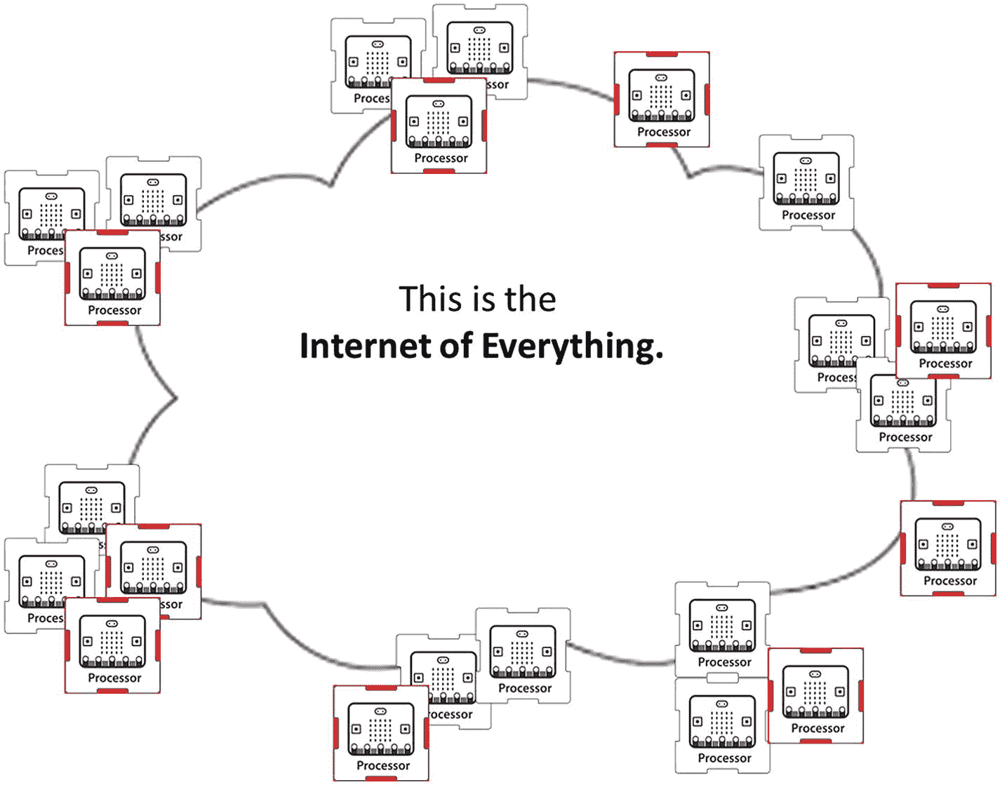
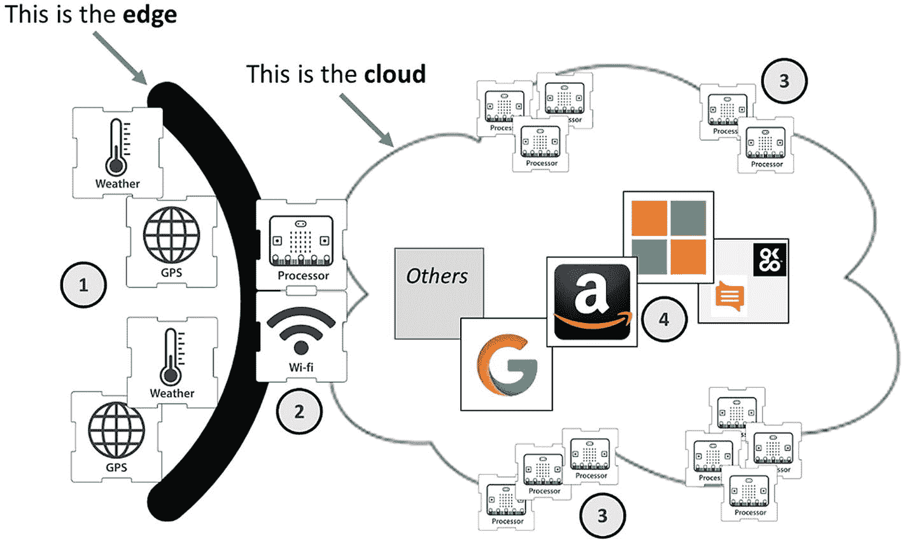
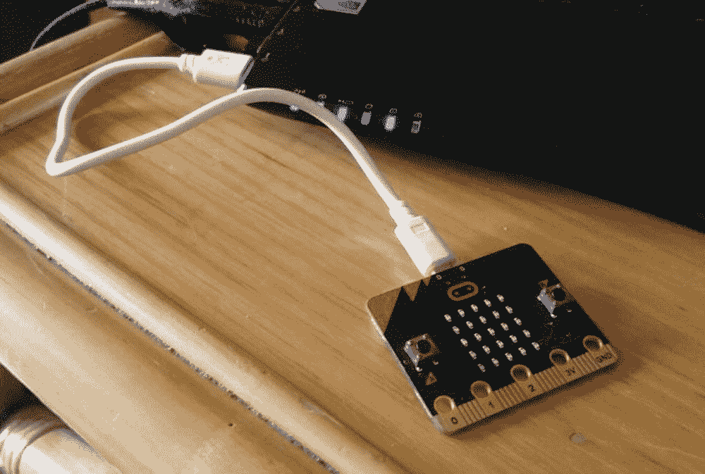

# 六、将物联网引入数据科学

在本章中，我们将从数据科学家的角度来看**物联网** (IoT)。什么是物联网，它如何帮助我们扩展数据科学能力？

## 6.1 我们的数据科学工具包中的弱点

在前面的章节中，我们进行了越来越复杂的数据科学实验。我们的问题和工具变得越来越复杂，但基本流程通常包括以下步骤:

1.  **好奇心**:过程总是从好奇心开始；一个问题。

2.  实验设计:然后我们想出如何回答这个问题——我们应该收集什么数据，我们需要什么工具？我们定义了执行实验的步骤。

3.  **数据收集**:实验涉及一段时间的数据收集。

4.  **数据转移**:已经收集的数据从数据收集工具转移到其他更有利于分析的环境中。到目前为止，我们已经将数据转录到纸上，并将数据保存到文件中。

5.  **分析**:使用适当的技术和软件分析从我们的数据收集工具中获取的数据。

6.  **报告**:我们已经开发了可视化技术，并且看到了数据是如何作为对话事实呈现的。

7.  内省:从实验中吸取经验教训，以改进未来的设计。

到目前为止，我们的数据科学工具包中最大的弱点在第 4 步。我们已经将数据写在一张纸上，并使用 micro:bit 的永久存储器来记录数据，但这些解决方案都不能很好地扩展。为了收集更多的数据，我们需要找到其他方法将数据从基于micro:bit的数据收集工具转移到我们的分析软件中。正是在这里，物联网将向我们证明其价值。

## 6.2 物联网概述

在我们能够在数据科学实验中找到物联网的角色之前，我们需要对物联网实际上是什么有一个清晰而简单的理解。而不是技术上的理解；还有其他的书可以解释。我们需要了解物联网如何在我们的数据科学工作中对我们有用；然后我们将学习如何利用它。

为了理解物联网，首先考虑“万物互联”和“人类互联”是有帮助的。 [1](#Fn1) **图** [**6-1**](#Fig1) 展示了世界上所有相互连接的电脑:万物互联。

图 6-1

万物互联:世界上所有联网的电脑

在**图** [**6-1**](#Fig1) 中，红色突出显示的方块代表人类用来访问脸书、YouTube、电子邮件、网上银行等的电脑和智能设备。这就是“人类互联网”:我们在浏览器或连接的应用程序上的所有体验都发生在这些设备上。

组成物联网的智能设备都是**图** [**6-1**](#Fig1) 中没有用红色突出显示的区块。这些设备在不需要任何直接人工干预的情况下就可以开展业务并相互交互。

IoH 和物联网非常相似:

*   人类互联网(IoH)的建立是为了让**人**能够理解它:数据以一种我们觉得容易消化的方式呈现给我们，当我们需要与 IoH 互动时，这通常对我们来说很容易。

*   物联网(IoT)是以一种**机器**可以轻松理解的方式构建的:它旨在允许数据快速有效地从一个地方移动到另一个地方。

IoH 和物联网不是截然不同的独立系统:

*   IoH 和物联网没有独立的基础设施:就像卡车和汽车在相同的道路上行驶一样，两者的数据通过相同的网络传输。

*   有很多重叠:IoH 使用服务和访问物联网的数据，并被人类用来控制和校准物联网。在某些方面，IoH 是物联网的“前端”:它是一个窗口，通过它我们可以看到物联网并与之交互。

物联网和 IoH 有不同的协议 [2](#Fn2) 和技术。延伸之前使用的汽车类比，这些差异可以与柴油车和汽油车之间的差异相比较。

因此，物联网系统是一个使用互联网的两台或多台机器之间进行交互的系统，在这个过程的任何阶段都没有人参与。

但是，为什么冰箱、房子或卫星想要共享数据，为什么它们要在没有人类参与的情况下这样做呢？各种创新和实用的应用程序已经开发出来，越来越多的应用程序正在被想象和构建:

*   智能房屋。许多家庭使用供暖和照明，这消耗能源和金钱。放置在家中的传感器可以提供关于家中哪些部分需要照明或供暖的信息，中央控制单元可以相应地调节水平。

*   智能路灯越来越普遍。它们不仅有助于减少不必要的照明使用，还经常与报告其他数据的监视器集成在一起——经常使用环境传感器或闭路电视摄像机。

*   支持物联网的健康监控器将医疗数据发送到人工智能系统，人工智能系统对数据进行分析，如果观察到任何相关数据，就会发出警报。

*   一些建筑物有支持物联网的监视器，记录与建筑物状态有关的数据。如果数据表明该建筑需要维护，那么详细信息将被发送给工程团队，他们将前来进行检查。

前面的例子中出现的一个主题是物联网为我们服务:物联网系统通常会收集和分析数据，然后执行有益于人类的操作。当发现不良情况时，它可能会提醒我们，或者它可能会调整系统，使其不那么危险或更有效。

物联网不是计算机接管世界的手段；相反，这是我们作为人类如何将大量活动委托给计算机，以使我们自己的生活更轻松、更舒适。至少现在，电脑会随着人类的节奏起舞。

## 6.3 云的剖析

在我们了解如何将物联网融入我们的数据科学之旅之前，我们还会遇到一些概念，我们需要对这些概念有一个基本的了解。在本节中，我们将阐明一些语义，并了解组成物联网系统的不同组件。

首先，在**第 6.2 节**的基础上，我们将了解互联网、物联网和“云”的定义:

*   互联网。在**第 6.2 节**中，我们提到了万物互联和人类互联，但我们未能确定这两者是否就是短语“互联网”的含义大多数人会把互联网等同于“万物互联”

*   **云**是万物互联网络的一个子集:它由许多计算机组成，通常是强大的服务器，为互联网上的其他计算机提供服务。他们可能会保存数据，或处理数据，或执行交易，甚至提供人工智能(AI)服务。

*   **物联网**可以被认为是互联网内的系统，数据在没有人工干预的情况下传输或处理。

**图** [**6-2**](#Fig2) 显示了不同连接组件如何装配在一起的简化视图。

图 6-2

物联网系统的剖析

参照**图** [**6-2**](#Fig2) 中的编号元素:

1.  **边缘设备**:一些数字设备与现实世界相连，比如记录天气数据或提供 GPS 坐标的传感器。当他们连接到互联网时，他们从外部提供新的数据。因此，这些设备处于物联网的边缘，我们称之为边缘设备。

2.  **网关设备**:网关设备为边缘设备提供连接互联网/物联网的手段。请记住，如果您想要将边缘设备连接到物联网，那么它表明您想要将数据发送到某个地方-发送到其他设备。有两个主要选项(下面的 3 和 4)。

3.  构成万物互联和物联网的其他设备/网络(见**图** [**6-1**](#Fig1) )。

4.  服务提供商:提供在线服务的全球产业非常庞大。电子邮件、图像备份、社交媒体、银行和大量其他服务都可以在云端供我们使用。这些服务构成了云的主干。

因此，云是一个巨大的服务提供商集合，他们提供我们在互联网上使用的工具(如电子邮件和社交媒体)。这些服务不是免费的；例如，提供和维护 Gmail 需要谷歌支付费用。

**云不是一项利他的事业**。服务提供商提供服务是要花钱的，所以他们当然需要把钱赚回来。

在某种程度上，每个进入云的网关都需要为访问他们在云上使用的服务付出代价。我们可能会为特定服务支付现金，或提供对服务提供商有价值的个人信息。通常，他们可以通过让广告商向我们传达营销信息来赚钱。

的确，有些服务是真正免费的，但就像你进入一家商店时，你希望为你带走的任何物品付费一样，当你使用云服务时，你也应该以某种形式付费。

在本书中，我们将使用免费服务来开始使用物联网——大多数提供商都提供免费试用期。但是它们总是受到各种方式的限制，为了无限制地使用这些服务，最终需要付费。

## 6.4 从微位传输数据

在**第 6.1 节**中，我们查看了数据科学流程的不同方面，并确定了我们现有工具集的最大弱点:我们无法使用 micro:bit 来收集任何真实的数据量。它非常适合测量我们需要的数据，只是不太适合存储数据。

物联网为我们提供了一个解决方案:它提供了从记录几十个数据点到几乎无限数量的方法:

通过一记录就传输数据，我们避免了在 micro:bit 上存储数据的固有限制。如果我们可以将数据转移到另一个更适合存储大量数据的平台，那么我们就会受到该平台的限制，而不是 micro:bit。有一些物联网平台旨在轻松做到这一点:它们提供云服务来存储数据。因此，如果我们能够找到一种方法将我们的数据传输到一个合适的物联网平台，那么 micro:bit 的数据存储问题将不再是我们数据科学能力的限制因素。

我们面临的挑战是:我们如何将在 micro:bit 上收集的数据传输到另一个设备上？有四种方法可以做到这一点:

1.  让一个人在记录的时候转录数据，然后手动输入到下一个设备上。我们在前面的章节中尝试过这种事情，但很快就放弃了，因为它太耗费人力了。这不是一个可行的选择。

2.  通过连接可以存储大量数据的外围设备。在第 [5](05.html) 章的结尾，我们看到了一种针对 micro:bit 的 SD 卡解决方案，它允许存储超过 1gb 的数据文件。如果您可以访问硬件，并且不介意只能在收集数据后访问数据，这是一个很好的解决方案。

3.  通过使用电缆连接 micro:bit 和其他设备。我们将在**第 6-6 节**中查看**有线**选项。

4.  通过使用**无线**选项。计算机能够以多种方式无线传输数据，我们在**第 6-5 节**中会讲到。

我们已经将目光放在了将数据从我们的 micro:bit 转移到云端 [3](#Fn3) 上，在那里广泛的工具和功能将使我们能够显著提高数据科学的生产力。我们现在将考虑选项 3 和 4，并在后面的章节中决定选择哪一个。

## 6.5 物联网无线通信选项

无线通信并不新鲜:我们的祖先早在计算机时代之前就使用它了，而且不仅仅是为了相互交谈。信号火和灯塔是利用光波发送信息的无线通信方法。

人和计算机无线通信的方式有很多相似之处:

*   人们可以非常容易和频繁地无线传输和接收数据。说话是最显而易见的方式，但其他因素如肢体语言也被用来与附近听到或注意到我们的人交流数据。

*   计算机可以非常容易和频繁地无线传输和接收数据。传输无线电波是最常见的方式，但也有其他选择。我们不会理会这些。

有三种领先的技术可以发送和接收无线电信号来传输数据，并用于将设备连接到互联网/物联网和访问基于云的服务:

*   **蓝牙**:micro:bit 内置无线电发射器，符合 BLE(蓝牙低能耗)规范。无线电功能可以单独使用，无需调用蓝牙协议。我们将在**章节** [**7**](07.html) 中探索蓝牙的功能，然后在**章节** [**8**](08.html) 中我们将了解如何在没有蓝牙的情况下使用收音机。

*   **Wi-Fi** : **章节**[T5】9](09.html)解释了更多关于 Wi-Fi 的内容，并展示了如何为您的 micro:bit 添加 Wi-Fi 功能。

*   **劳拉旺**和**西格福克斯**:劳拉旺(远程广域网)和西格福克斯。这些都是令人兴奋的和不断发展的技术，但它们目前对 micro:bit 的支持有限。蓝牙、无线电和 Wi-Fi 得到了更好的支持，将适用于广泛的数据科学应用。我们将在本书的剩余部分使用这些无线通信方法。

Note

有些情况下，LoRaWAN 或 Sigfox 是比蓝牙或 Wi-Fi 更合适的技术。LoRa 的范围及其低功耗模式使其非常适合部署远程传感器:这是高海拔实验中的一个受欢迎的选择，例如从气象气球上的传感器传输数据。由于篇幅有限，我们在本书中省略了这些技术。

## 6.6 使用串行连接传输数据

UART (USB)电缆可用于从 micro:bit 提取数据。数据可以通过一根“串行”电缆从一个micro:bit直接传输到一台计算机，在那里它可以被大量保存(**图** [**6-3**](#Fig3) )。

图 6-3

使用 USB 电缆连接到计算机的微型比特可以通过该电缆向计算机传输数据

这种方法屡试不爽，但它确实有一些限制:

*   测量仪器必须离计算机一个电缆长度的距离。这种解决方案将在许多数据科学用例中充分发挥作用，但我们将利用本书的剩余部分来研究无线解决方案:我们可以在 micro:bit 和另一个设备之间传输数据而不受物理连接限制的方法。

*   这个过程并不简单。有代码库和应用程序使它尽可能简单，但选项和配置的范围可能会使初学者有点棘手。

*   毫无疑问，这是一个非常有用的工具，但是没有一个用例可以让我们在本书后面探索的无线选项做得更好。

如果有线解决方案能满足您的所有需求，您应该考虑一下，Micro:bit Foundation 的网站上有您需要的所有详细信息。

Note

有一个相对较新的有线解决方案可用于 micro:bit，它比 Micro:bit 基金会和社区目前推广的方法更容易使用。最新版本的 Excel 中提供了 **Excel Data Streamer** 应用程序，可用于将 micro:bit(或任何边缘设备)中的数据直接输入 Excel(通过串行/USB 端口)。鉴于 Excel 可以轻松地与其他 Office 365 应用程序集成，此解决方案可能非常强大。如果您可以使用 Office 365，并且正在寻找有线解决方案，那么您应该考虑这一点。

## 6.7 总结

在本章中，我们试图揭开与物联网相关的一些术语的神秘面纱，并看看它所基于的技术。我们已经看到了它如何帮助我们解决工具包中的主要弱点:数据存储限制。也有迹象表明，它可以为我们提供其他好处:如果云计算提供我们可以访问的服务，那么这些服务中的一些肯定会对我们的数据科学工作有用吗？我们已经知道，无线通信是连接到物联网的理想方式，使用蓝牙、无线电或 Wi-Fi，我们将建立一个网关，将我们的边缘设备连接到云，从而解决数据存储问题。然后，我们将能够调查 IoT 还能提供什么。

<aside aria-label="Footnotes" class="FootnoteSection" epub:type="footnotes">Footnotes [1](#Fn1_source)

这是一个虚构的短语，在本书之外没有使用，但在本章中它是有意义和有用的。

  [2](#Fn2_source)

要把车从一个地方开到另一个地方，我们不需要太了解发动机是如何工作的。同样，我们正在学习如何在数据科学中使用物联网，而不是如何成为物联网开发者或工程师。这本书避免了对我们的数据科学之旅没有贡献的技术细节，这肯定包括互联网数据传输协议。

  [3](#Fn3_source)

使用第 6.3 节中介绍的术语，从技术上来说，更正确的说法是:“我们已经将目光投向了通过将 micro:bit 连接到网关来制作物联网边缘设备，我们将使用它来将数据发送到基于云的服务。”

 </aside>