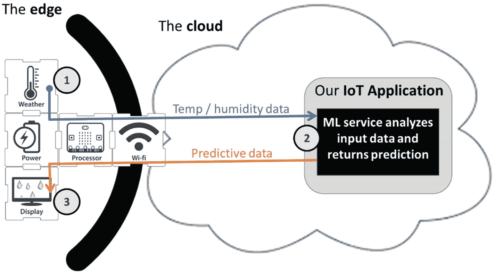
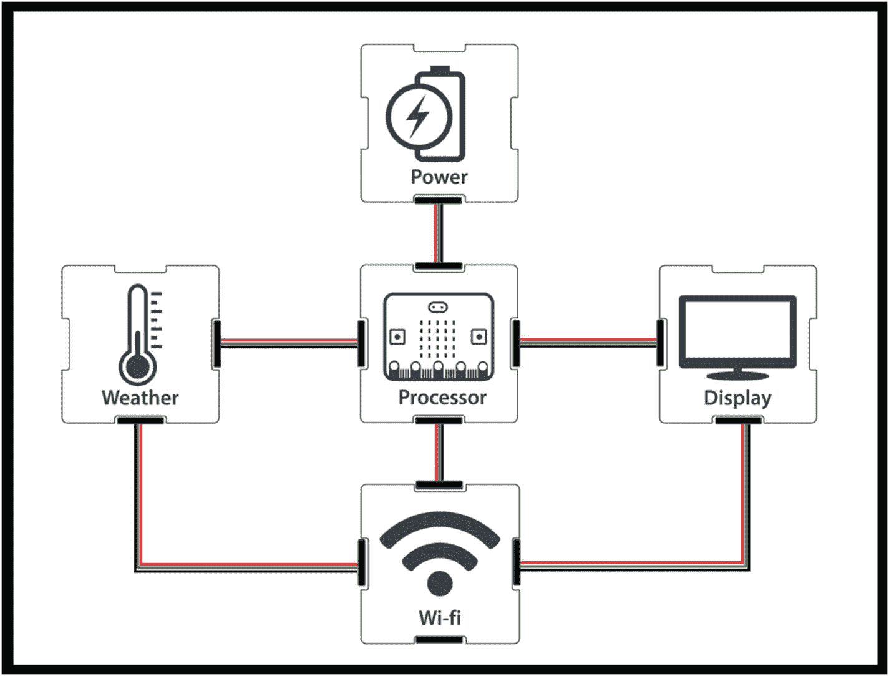
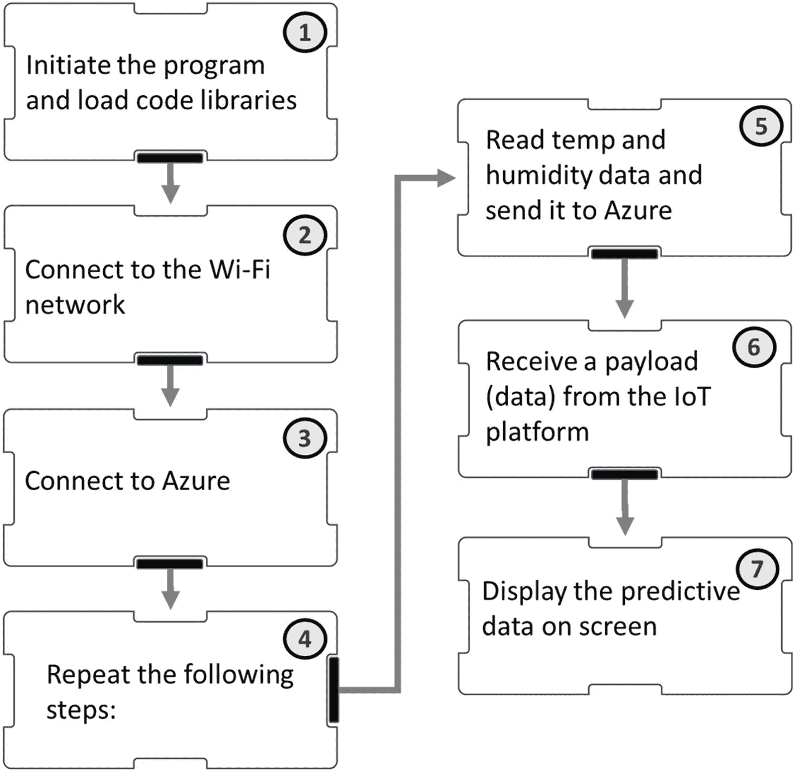
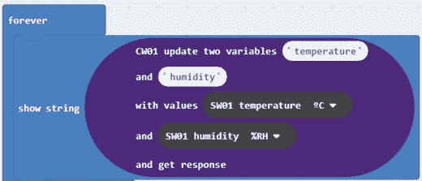
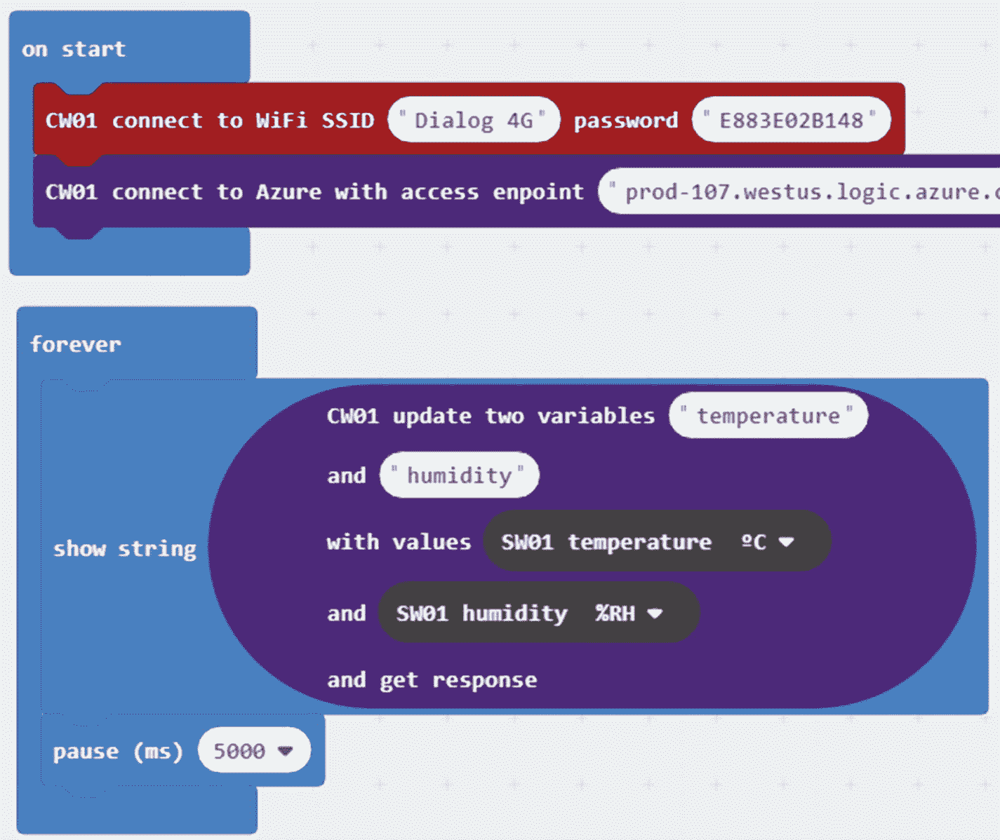
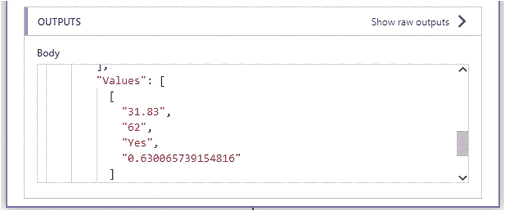
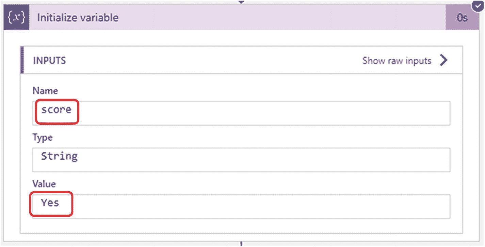
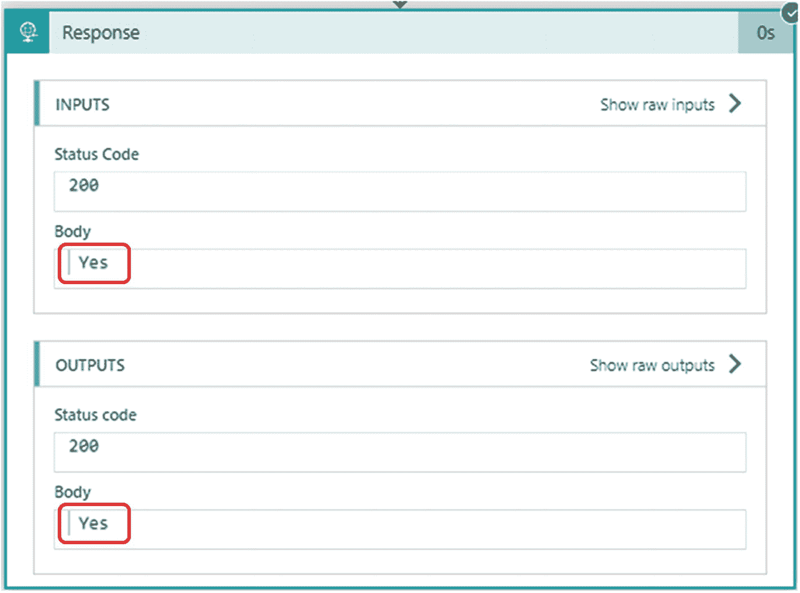

# 十二、将边缘设备连接到物联网应用

在前一章中，我们开发了一个将接收温度和湿度数据的物联网应用。这个数据将由一个 ML 服务处理，并做出预测:是否可能下雨？

我们现在需要做的就是构建一个设备，可以将所需的数据输入到我们的物联网应用中，并构建另一个设备(或者可能是同一个设备)来接收来自 ML 服务的预测数据并显示出来。

## 12.1 选择硬件

在本章中，我们使用了在第**章** [**9**](09.html) 中使用的相同硬件。

在整本书中，我们已经看到，当涉及到数据科学应用时，我们使用的特定硬件工具只是一个使能器:一种达到目的的手段。结果——硬件支持什么——才是重要的，任何数量的替代硬件设备都可以提供相同的结果。

这一点在这里尤其重要:我们刚刚花了漫长而艰巨的一章来构建物联网应用，现在我们将花一小部分时间来构建边缘设备。一旦你投入时间设置你的物联网应用程序，至少相比之下，这相对来说是微不足道的。切换出不同的边缘设备。

可以使用各种不同的边缘设备，包括移动电话。如果你可以在手机上获取温度和湿度数据，你可以通过 Wi-Fi 将其发送到物联网应用程序。也许更有可能的是想用手机接收数据:例如，只要有可能下雨就触发短信。连接移动电话超出了我们的范围，但是使用正确的工具，它类似于连接一个微型:bit。

边缘设备和物联网应用分离的一个含义是，物联网应用实际上是一个独立的“产品”它可以被几家不同的边缘设备制造商使用，甚至是竞争对手。考虑一个记录某人心率并使用人工智能分析数据的心脏监视器。**第** [**11**](11.html) 章表明，构建一个支持人工智能/人工智能的物联网应用来分析心率不太可能是微不足道的。吸收这些数据并生成有用报告的人工智能服务可能对医疗行业具有巨大价值，尤其是对那些有兴趣构建可能使用该服务的边缘设备的人。 [1](#Fn1) 我们构建的物联网应用本身就是“资产”。

我们将使用我们一直使用的相同硬件:一个微型:位和天气传感器，增加了 Wi-Fi 功能，以提供物联网连接。同样的元件我们用在**章**[T3】9T5】中。](09.html)

## 12.2 边缘设备的作用

边缘设备有两个核心功能:

*   测量和发送天气数据

*   接收和显示预测数据

**图** [**12-1**](#Fig1) 显示了边缘设备的作用(参见**项目 1** 和 **3** )以及我们的数据将遵循的线性过程(它从 1 开始，经过 2，然后终止于 3)。

图 12-1

从边缘设备到物联网应用的数据流

参照**图** [**12-1**](#Fig1) 中的数字:

1.  数据源自我们的边缘设备:
    *   最初，我们需要连接到我们的物联网应用。

    *   然后我们需要测量温度和湿度数据。

    *   这些数据通过 Wi-Fi 输出到我们的物联网应用。

2.  我们的物联网应用遵循其工作流程，按照**章** [**11**](11.html) 。

3.  预测数据返回:
    *   我们的边缘设备连接到我们的物联网应用，并监听来自它的消息。

    *   当消息被接收时，它被解析成我们可以使用的格式。

    *   我们从信息中提取的预测数据显示在屏幕上。

## 12.3 构建边缘设备

我们将使用的仪器与第**章** [**9**](09.html) 中描述的仪器相同。**图** [**12-2**](#Fig2) 显示了硬件组件；更多细节请参考**章** [**9**](09.html) 。将你手头的部件连接起来，构建一个近似于**图** [**12-2**](#Fig2) 的仪器。

图 12-2

我们边缘设备的硬件组件

## 12.4 编码边缘设备

硬件工具只不过是一个镇纸，直到我们编写代码，让它按照我们想要的方式工作。在我们开始编码之前，我们需要确切地理解我们需要代码做什么。

**图** [**12-3**](#Fig3) 表示我们将转换成 MakeCode 块的自然语言代码。

图 12-3

边缘设备的自然语言代码

**无代码选项**:不可能为此工具提供无代码选项——每个程序都需要更新，以包含您的 Wi-Fi 凭据和 Azure **HTTP Post URL** 。

有关如何找到 **HTTP Post URL** 的详细信息，请参见**第 12.7 节“收到 HTTP 请求时**”。

支持网站上提供了完整版本的代码供您编辑。

**表** [**12-1**](#Tab1) 显示了自然语言代码的每一步如何翻译成 MakeCode 动作或块。

表 12-1

使用 make 代码块开发代码

   
| 

步骤

 | 

制造商代码

 |
| --- | --- |
| one | 开始一个新项目。添加 XinaBox CW01 和 SW01 扩展。 |
| Two | 将 **CW01 connect to WiFi** 块添加到 **on start** 块内。键入 Wi-Fi 网络的 SSID 和密码。 |
| three | 添加 **CW01 连接到具有访问端点**的 Azure 块。然后复制粘贴 **HTTP 帖子网址**。参见**第 12.7 节**以帮助找到 **HTTP 帖子 URL** 。将 HTTP POST URL 添加到块中时，请确保删除其中的“https://”部分。 |
| four | 加一个**永远的**块。 |
| 第五、六和七条 | 第 5 步、第 6 步和第 7 步都由一个代码块完成:将 **CW01 更新两个变量**块添加到**永久**块。在四个可用空间中添加以下内容:**第一个变量**:输入**“温度”**。**第二变量**:输入**“湿度”**。2[2](#Fn2)T7】**第一个值**:添加 **SW01 温度(°C)**块。**第二值**:添加 **SW01 湿度(%RH)** 块。 |
| 最后加一个**暂停**块。延迟时间至少应该足够长，以便响应可以在屏幕上滚动。 |  |

**图** [**图 12-4**](#Fig4) 显示了完整的代码清单。

图 12-4

为一个 micro:bit 气象站制作代码块

代码完成后，将其闪存到您的 micro:bit 上，然后移除 USB 电缆。

之前使用的函数( **CW01 update two variables** …)是高度专门化的:它是专门为将 BBC micro:bit 与 Azure ML 服务集成而构建的，这些服务将两个变量作为输入，同时返回一个变量作为输出。

CW01 MakeCode 扩展还包括通用 MQTT 块(我们在第**章** [**9**](09.html) 中使用了它们)，这些块可用于连接任何基于 MQTT 的物联网平台。我们不能在这个上下文中使用这些块:Azure 不容易从 micro:bit 连接到。

## 12.5 使用边缘设备

edge 设备构建完成并编程后，我们现在需要做的就是启动并使用它。

> *需要以特定的方式给气象站加电，请按照第* ***章***[***9***](09.html)***、9.9 节*** *中描述的步骤进行。*

**第** [**9**](09.html) 章还列出了仪器首先连接到 Wi-Fi 路由器，然后连接到目标物联网平台时将经历的阶段。在这种情况下略有不同，因为我们也从物联网平台接收和显示数据。如果该过程正常工作，您应该看到以下内容:

1.  如果仪器已连接到 Wi-Fi 网络，字母 C 将显示在 micro:bit LED 屏幕上。

2.  然后，micro:bit 将尝试连接到 Azure，并开始向我们的物联网应用程序发送数据。

3.  当数据成功传输时，屏幕上会显示一个勾号，随后是降雨预测结果(“是”或“否”)。

气象站将继续共享和显示这些数据，直到您将其关闭。

当你第一次看到 micro:bit 发光二极管上滚动的“是”或“否”时，你有资格感到极大的满足感:你已经取得了甚至在几年前都不可能实现的成就。天气预报应用程序是(非官方的)Hello World！和**章** [**13**](13.html) 将详细阐述什么其他的，更复杂的，应用这个简单的 ML 实验为我们解锁。

## 12.6 改进边缘设备

边缘设备非常简单:只使用了最少的代码和硬件，只有五个硬件模块和六个代码块。

我们可以通过添加更多组件或使代码更加复杂来增强仪器。使用本书中介绍的技术，您应该能够实现以下一些增强功能:

*   添加一个像样的显示和打印数据给它。

*   单击 A 按钮时，显示连接的状态。

*   处理预测数据——当预测为“是”时做一些事情，当预测为“否”时做一些事情——为什么不显示一个图形来指示下雨呢？

*   控制发送和接收数据的频率，或者只在单击 B 按钮时发送。

*   您是否有多个 Wi-Fi 网络的凭证？使用常量变量并尝试自动连接到范围内的变量。

## 12.7 窥视物联网应用的内部

看着我们的微型屏幕滚动着“是”或“否”的单词，然后看着窗外看看是否在下雨…这只是很长一段时间的乐趣。当你对此感到厌倦时，在边缘设备仍处于活动状态时，返回到物联网应用程序，看看那里正在发生什么。

打开 **Azure logic app 设计器**，点击设计器工具栏上的**运行**，通过工作流运行数据。可能需要一些时间来加载，之后将显示工作流。你应该从**章** [**11**](11.html) 中认出**图** [**12-5**](#Fig5) 中列出的五个步骤。

图 12-5

手动触发的工作流程:“响应”标签上的绿色勾号表示它处于运行模式

如果边缘设备仍在工作，您应该已经在**运行**模式下打开工作流:如果它已经正确加载，您将看到一个勾号图标(绿色圆圈上的白色勾号)添加到**响应**动作的标题栏。这表明您的逻辑应用程序已收到 Azure 和 micro:bit 之间的数据事务已成功完成的确认。从这里，我们可以查看工作流的每个阶段，了解正在发生什么，并检查正在处理的实时数据。

Tip

如果您仍然在**响应**动作的标题栏上看到一个“**十字**图标，请确保边缘设备功能正常，然后再次运行逻辑应用程序，如此反复，直到您看到“**勾**”。

我们将看看工作流程的几个要素。

### 剖析 JSON

当我们创建工作流时，我们的 Parse JSON 文件是为我们设置的，它包含变量名，而不是值。现在数据正在通过工作流传递，我们可以看到 JSON 文件与实时内容的关系:

*   点击**解析 JSON** 动作。

*   向下滚动并找到部分**输出**。

*   单击正文并向下滚动文本框。

**图** [**12-6**](#Fig6) 显示解析后的数组，包含来自 micro:bit 的温度和湿度值，以及来自 ML 服务的降雨预测结果。

图 12-6

解析 JSON 操作的输出

### 初始化变量

*   点击**初始化变量**动作。

最初建立工作流时，创建了一个名为 **score** 的变量。这是存储我们预测的变量:它是一个包含“是”或“否”的字符串。

**图** [**12-7**](#Fig7) 显示当前得分结果**是**。

图 12-7

初始化变量操作的输出

### 反应

*   点击**响应**动作。

**分数**变量(前面讨论过)已经被分配给响应消息的**主体**(**图** [**12-8**](#Fig8) )。这是我们作为结果传回给 micro:bit 的内容。

图 12-8

响应操作的输出

### 当接收到 HTTP 请求时

*   当一个 **HTTP 请求** **收到**动作时点击**。**

此信息在工作流运行期间不会更改；这里可以找到 **HTTP 帖子的网址**(图 [12-9](#Fig9) )。这个参数至关重要，因为它在 MakeCode 块 **CW01 中使用，通过访问端点**连接到 Azure，以连接到基于 Azure 的物联网应用。

图 12-9

收到 HTTP 请求时显示 HTTP POST URL 的操作

## 12.8 数据分析

在数据科学实验的这个阶段，开始分析我们收集的数据是正常的。但是，当 ML 服务使用温度和湿度数据来产生我们的预测时，这不是已经完成了吗？我们的角色被颠覆了吗:我们现在在分析阶段是多余的吗？

答案是响亮的不！与数据科学过程的大多数领域一样，自动化将我们从重复和费力的任务中解放出来，并允许我们使用非人工智能专注于无法自动化的事情。

在这种情况下，我们的分析目光落在结果上:它们有多聪明或有用？我们能对结果做些什么来从中提取价值呢？有没有什么伦理上的考虑？我们不应该只接受表面上的结果:我们的角色是质疑它们，并检查它们是否合乎逻辑、可信和有用。我们应该问人工智能是否真的在推动分析，或者它只是一种复杂的算法？

为什么不记录一段时间内 ML 服务的结果，并添加您自己的数据(无论是否下雨)。然后使用分析技术来看看这些预测到底有多有效。ML 服务所做的预测与实际下雨的关联有多强？

虽然这些问题及其答案将关系到我们对天气预报数据的信任程度，但与我们在本章中所取得的成就相比，天气预报的功效只是次要的。使用一个 ML 服务意味着能够使用多个，我们将在第**章** [**13**](13.html) 中讨论。

可能引起一些读者关注的是，没有任何明显的方法可以让 ML 服务学习:如果我们不提供关于预测准确性的反馈，那么服务如何知道它的预测是否准确，以及它如何从它的错误中学习？

我们的物联网应用缺少的元素是**培训**。当 ML 服务首次建立时，它会经历一段时间的培训，在此期间，人工操作员会提供有关其生成的结果的准确性的信息。

一个简单的例子是可以区分猫和狗的图像的 ML 服务。当 ML 服务最初建立时，一个人将向它提供被识别为“猫”或“狗”的图像。ML 将推断与“猫”或“狗”相关的视觉特征，并将开始对所提供的新图像进行分类。当 ML 开始区分猫和狗时，人的角色是通过回顾结果并识别正确/不正确的来训练 ML。ML 将继续适应，直到这个人接受模型的准确性并停止训练它。

我们在这里没有关注培训:我们在本书中的目标是将 ML 服务用于数据科学工作，而不是学习如何构建/设置机器学习服务或帮助使其更加准确。培训 ML 服务是有趣的，并且有助于提供对它如何工作的直观理解，但是消费者 ML 服务不需要包括培训元素。当我们作为消费者使用电子邮件服务时，我们并不期望必须训练它如何发送电子邮件。同样，非专业消费者也需要完全成型的 ML 服务(就像我们以前使用的那样)。建立一个 ML 服务的过程，包括训练它，是将来使用 ML 服务的大部分人所知甚少的事情。

## 12.9 摘要

我们的数据科学之旅已经接近尾声，在此过程中，我们研究了广泛的技术和技巧，它们都在某种程度上对我们的数据科学工作有用。

开发人员建立一个他们广泛重用的模块/函数库是很正常的:他们的工具包。当程序员掌握一个新概念时，他们开发代码片段/函数来帮助他们利用它。几年后，他们可能已经忘记了这个概念的某些方面，但是他们仍然确切地知道如何使用他们的功能。

你应该将你在本书中成功实现的不同技术视为你的工具包的一部分；在本章构建边缘设备的过程中，我们做了很少的创新(除了在 MakeCode 中使用了一些新的模块):我们将已经开发的东西结合起来。我们能够轻松地构建所需的工具，这已经隐含地证明了前面提到的模块化和可重用性的价值。

您的工具包现在已经达到了一个临界点:有潜力用于各种各样的新奇和意想不到的应用程序。在下一章，也是最后一章，我们将看看一旦你放下这本书，我们在这本书里建立的工具包是如何对你有用的。

<aside aria-label="Footnotes" class="FootnoteSection" epub:type="footnotes">Footnotes [1](#Fn1_source)

在我们发现自己所处的新的 covid19 世界中，也许有人会建立一个机器学习系统，该系统从一系列传感器中获取数据，这些传感器读取各种与个人健康相关的状况(也许是红外温度、微粒和呼出气体中的二氧化碳、心跳不规则、咳嗽的频率和音调；有许多不同的传感器可用)。ML 服务将被训练来预测是否有人感染了病毒，使我们能够识别最需要早期帮助的人。

  [2](#Fn2_source)

这些是我们在设置物联网应用程序时在第**章** [**11**](11.html) 中看到的相同变量名。这些名称源自我们使用的 ML 服务，在设置物联网应用程序的整个过程中，我们根本不需要输入它们。在 Azure 工作流中有几个地方可以查看变量名——例如，检查**章节** [**11**](11.html) ，**第 11.7 节**，步骤 1。必须正确拼写变量，并使用与物联网应用程序中完全相同的大小写。

  [3](#Fn3_source)

如果消费者 ML 服务允许公众成员训练它，那么就存在着人们会无意或有意地误导它的风险。有时候让公众训练一个 ML 是个好主意:

*   据称，谷歌的验证码软件可以识别试图访问网站的机器人。我们在使用 Captcha 时提供的响应用于训练 Google 的 ML 图像识别软件。

众所周知，这也会适得其反:

*   2016 年，微软在 twitter 上发布了一款名为 Tay 的聊天机器人。Tay 的成立是为了从对话中学习。一天之内，Tay 就发展出一种令人讨厌的趋势，导致微软不得不暂停其帐户。这是一个故意错误训练人工智能的例子，表明在训练人工智能服务时应该小心谨慎。

 </aside>