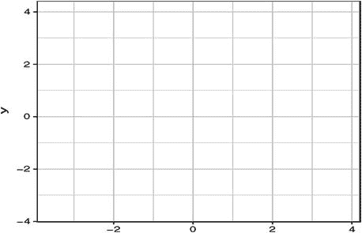
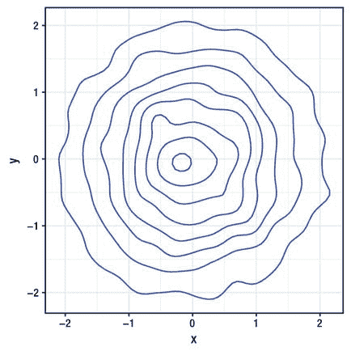
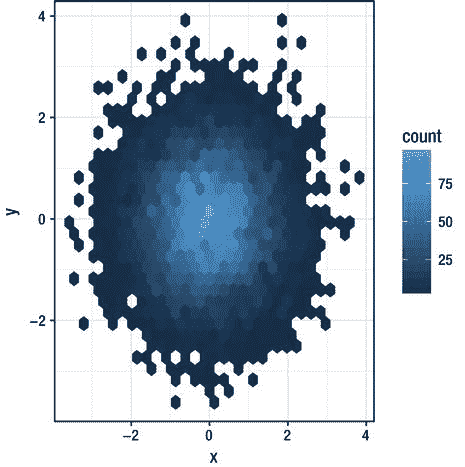
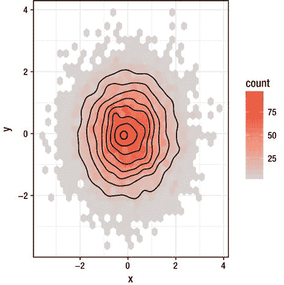

托马斯 mailund 2017 年

Thomas Mailund,《在 R 开始数据科学》, 10.1007/978-1-4842-2671-1_5

# 5.使用大型数据集

Thomas Mailund <sup class="calibre6">1</sup> 的缩写形式

①丹麦奥胡斯

*大数据*的概念指的是非常大的数据集，数据集的大小需要数据仓库来存储数据，通常需要复杂的算法来处理数据，并且需要分布式计算来处理数据。至少，我们谈论许多千兆字节的数据，但也经常处理兆兆字节或千兆字节的数据。

处理大数据也是数据科学的一部分，但超出了本书的范围。这一章是关于大型数据集以及如何处理会降低分析速度的数据，但不是关于大到无法在自己的台式计算机上分析的数据集。

如果我们忽略大数据问题，那么什么是大数据集在很大程度上取决于您想要对数据做什么。这归结于你试图实现的目标的复杂性。一些算法速度很快，可以在线性时间内扫描数据，这意味着分析数据所需的时间与数据点的数量成线性关系，而其他算法则需要指数级时间，实际上无法应用于具有几十或数百个数据点的数据集。关于在给定的时间或给定的空间(无论是 RAM 或磁盘空间还是任何你需要的空间)内你可以用数据做什么的科学被称为*复杂性理论*，是计算机科学的基本主题之一。然而，实际上，这通常归结为你愿意等多久才能完成分析，这是一个非常主观的决定。

在这一章中，我们考虑了我在自己的工作中发现的几个案例，在这些案例中，数据变得有点太大，无法完成我想要的任务，我必须用各种方法来处理它。你的案例可能会有所不同，但也许你至少可以从这些案例中得到一些启发。

## 在分析整个数据集之前，对数据进行子采样

不过，我想说的第一点是:你很少需要分析一个完整的数据集来了解数据的行为。除非你在寻找非常罕见的事件，否则你会从几千个数据点的数据中获得和几百万个数据点一样多的感觉。

有时候你确实需要非常大的数据来找到你要找的东西。例如，在寻找遗传变异和常见疾病之间的关联时，这种关联可能非常微弱，因此您需要大量数据来区分偶然关联和真实关联。但是对于数据中具有实际重要性的大多数信号，您将在较小的数据集中看到这些信号。因此，在您将所有数据的全部力量用于分析之前，尤其是如果分析结果非常缓慢，您应该探索较小的数据样本。

在这里，选择一个随机的样本是很重要的。除了数据框中的列之外，数据中通常还有结构。这可能是收集数据时造成的结构。如果数据是按数据收集时间排序的，那么您拥有的第一个数据点可能与后面的数据点不同。这在数据中没有明确表示出来，但是结构还是存在的。将你的数据随机化可以缓解由此产生的问题。随机化可能会消除一个微妙的信号，但借助统计学的力量，我们可以处理随机噪声。处理我们不知道的持续偏见要困难得多。

如果您有一个大型数据集，并且您的分析因此而变慢，不要害怕选择一个随机子集并进行分析。您可能会在子样本中看到完整数据集中没有的信号，但这种可能性比您担心的要小得多。当你在数据中寻找信号时，你总是要担心错误的信号。但是在较小的数据集中并不比在较大的数据集中更容易出现。有了一个更大的数据集来检查您的结果，您就不太可能在分析结束时坚持错误的结果。

得到虚假的结果是传统假设检验最关心的问题。如果您为信号在 p 值的 5%时的显著性设置阈值，您将会看到二十分之一的虚假结果。如果你不对多重测试进行校正，你几乎肯定会看到错误的结果。当您稍后将完整的数据扔给模型时，这些不太可能存活。

在任何情况下，对于大型数据集，您更有可能与空模型存在统计上的显著偏差，而空模型与您的分析完全无关。在分析数据时，我们通常使用非常简单的零模型，任何复杂的数据集都不是从简单的零模型生成的。有了足够的数据，你看到的任何东西都有可能与你简单的零模型有显著的偏差。现实世界不会从简单的线性模型中抽取样本。总有一些额外的复杂性。你不会用几个数据点看到它，但是有了足够的数据，你就可以拒绝任何零模型。这并不意味着你所看到的有任何实际的重要性。

如果您在较小的数据子集中发现了信号，并且这些信号在查看整个数据集时仍然存在，那么您可以更加信任它们。

因此，如果数据量让你慢了下来，那么缩减采样并分析它的一个子集。

您可以使用 dplyr 函数 sample_n()和 sample_frac()从数据框中进行采样。使用 sample_n()获取固定数量的行，使用 sample_frac()获取一小部分数据:

```py
iris %>% **sample_n**(size = 5)
##     Sepal.Length Sepal.Width Petal.Length
## 15           5.8         4.0          1.2
## 59           6.6         2.9          4.6
## 52           6.4         3.2          4.5
## 128          6.1         3.0          4.9
## 141          6.7         3.1          5.6
##     Petal.Width    Species
## 15          0.2     setosa
## 59          1.3 versicolor
## 52          1.5 versicolor
## 128         1.8  virginica
## 141         2.4  virginica
iris %>% **sample_frac**(size = 0.02)
##     Sepal.Length Sepal.Width Petal.Length
## 61           5.0         2.0          3.5
## 127          6.2         2.8          4.8
## 48           4.6         3.2          1.4
##     Petal.Width    Species
## 61          1.0 versicolor
## 127         1.8  virginica
## 48          0.2     setosa
```

当然，要使用 dplyr 进行采样，您需要使用 dplyr 可以处理的形式的数据，如果数据太大，甚至无法加载到 R 中，那么您就无法从数据框中获取数据。幸运的是，dplyr 支持以各种后端格式使用存储在磁盘而不是 RAM 中的数据，您很快就会看到这一点。例如，可以将数据库连接到 dplyr，并以这种方式从大型数据集进行采样。

## 分析期间内存不足

r 会非常浪费内存。即使您的数据集足够小，可以容纳在内存中，并且足够小，分析时间不会成为大问题，也很容易耗尽内存，因为 R 记住的内容比立即显现的要多。

在 R 中，所有的对象都是不可变的， [<sup class="calibre6">1</sup>](#Fn1) 所以每当你修改一个对象的时候，你实际上是在创建一个新的对象。这种实现非常智能，当数据实际上不同时，您只有独立的数据副本。让两个不同的变量引用同一个数据框并不意味着数据框被表示两次，但是如果您修改了其中一个变量中的数据框，那么 R 将创建一个包含修改内容的副本，您现在拥有两次数据，可以通过这两个变量访问。如果只通过一个变量引用数据帧，那么 R 很聪明，不会复制数据帧。

您可以使用 pryr 包检查内存使用情况和内存变化:

```py
**library**(pryr)
```

例如，您可以看到创建一个新向量的成本:

```py
**mem_change**(x <- **rnorm**(10000))
## 80.5 kB
```

修改这个 vector——R 实际上不允许，所以发生的情况是用修改创建一个新的副本——不会显著增加内存使用，因为 R 很聪明，只在多个变量引用一个对象时才进行复制:

```py
**mem_change**(x[1] <- 0)
## 1.3 kB
```

如果我们将向量赋给另一个变量，我们不会使用两倍的内存，因为两个变量都指向同一个对象:

```py
**mem_change**(y <- x)
## 1.36 kB
```

但是，如果我们修改其中一个向量，我们将不得不制作一个副本，以便另一个向量保持不变:

```py
**mem_change**(x[1] <- 0)
## 81.4 kB
```

除了污染名称空间之外，这是在分析过程中使用流水线而不是分配给许多变量的另一个原因。不过，如果你把它赋回给一个变量，就没问题了，所以% <> %操作符不会导致大量的复制。

尽管如此，即使使用流水线，您仍然必须小心。R 中的很多函数还是会复制数据。

如果一个函数对数据做了任何修改，它会被复制到一个局部变量。可能会有一些共享，例如，仅引用局部变量中的数据帧并不会创建副本，但如果您将数据帧拆分为函数中的训练数据和测试数据，那么您将会复制并两次表示所有数据。这个内存是在函数完成计算后释放的，所以只有当你非常接近 RAM 的极限时才是个问题。

但是，如果这样复制的数据保存在函数的输出中，当函数返回时释放的是*而不是*。例如，模型拟合函数将整个拟合数据保存在返回的对象中，这并不罕见。线性回归函数 lm()将不仅存储输入数据帧，还存储响应变量和所有解释变量，本质上是复制，因此所有数据都存储两次(并且不会重复使用内存)。如果你想避免这种情况，你必须明确告诉它不要这样做，使用参数 model、x、y 和 qr。

当您在 R 中的数据分析中遇到内存不足的问题时，通常不是您最初不能表示您的数据，而是您最终有许多副本。通过不在变量中存储临时数据帧和不在函数输出中隐式存储数据帧，可以在一定程度上避免这种情况，或者可以使用 rm()函数显式删除存储的数据来释放内存。

## 太大而无法出图

对于大型数据集，我通常遇到的第一个问题不是内存不足，而是在绘图时。尤其是在制作散点图时；箱线图和直方图汇总了数据，通常不成问题。

用大量数据制作散点图有两个问题。首先，如果您从散点图创建文件，您将创建一个包含每个单独点的图。这可能是一个非常大的文件。更糟糕的是，它将花费永远的时间来绘制，因为观众将不得不考虑每一个点。您可以通过创建光栅图形而不是 pdf 来避免这个问题，但这将我们带到第二个问题。如果点太多，散点图就不再能提供信息。点会重叠，您看不到有多少单独的数据点落在图上。这通常在计算时间成为问题之前很久就成为问题了。

例如，如果我们有一个包含 10000 个点的数据帧:

```py
d <- **data.frame**(x = **rnorm**(10000), y = **rnorm**(10000))
```

我们仍然可以制作一个散点图，如果该图保存为光栅图形而不是 PDF，文件不会太大而无法查看或打印:

```py
d %>% **ggplot**(**aes**(x = x, y = y)) +
  **geom_point**()
```

结果不会提供太多信息；见图 [5-1](#Fig1) 。这些点一个接一个地显示，很难看出这些大黑云点是否有不同的密度。


###### 图 5-1。有太多点的散点图

解决方案是以这样一种方式来表示点，即使有许多重叠点，它们仍然是可见的。如果这些点因为实际上具有相同的 x 或 y 坐标而重叠，您可以抖动它们，就像您在上一章中看到的那样。同样问题的另一个解决方案是用 alpha 级别绘制点，这样每个点都是部分透明的。你可以看到点的密度，因为它们是部分透明的，但你最终仍然会得到一个有很多点的图，如图 [5-2](#Fig2) 所示。



###### 图 5-2。带有 alpha 值的散点图

```py
d %>% **ggplot**(**aes**(x = x, y = y)) +
**geom_point**(alpha = 0.2) 
```

这并没有解决文件会画出每一个点并导致打印和文件大小问题的问题。不过，带有透明度的散点图只是显示 2D 密度的一种方式，您可以直接使用 geom_density_2d()函数来实现，如图 [5-3](#Fig3) 所示。



###### 图 5-3。2D 密度图

```py
d %>% **ggplot**(**aes**(x = x, y = y)) +
  **geom_density_2d**()
```

图 [5-3](#Fig3) 显示了密度的等高线。

显示 2D 密度的另一种方法是使用所谓的六边形图。这是直方图的 2D 等价物。2D 平面被分成六边形箱，该图显示了落入每个箱的点数。

要使用它，需要安装软件包 hexbin，使用 ggplot2 函数 geom_hex()，如图 [5-4](#Fig4) 所示。



###### 图 5-4。一个邪恶的阴谋

```py
d %>% **ggplot**(**aes**(x = x, y = y)) +
  **geom_hex**()
```

geom_hex()使用的颜色是填充颜色，因此您可以使用 scale_fill 函数来更改它们。您还可以将十六进制和 2D 密度图结合起来，以显示面元和轮廓，如图 [5-5](#Fig5) 所示。



###### 图 5-5。结合十六进制和 2D 密度的图

```py
d %>% **ggplot**(**aes**(x = x, y = y)) +
  **geom_hex**() +
  **scale_fill_gradient**(low = "lightgray", high = "red") +
  **geom_density2d**(color = "black")
```

## 太慢，无法分析

绘制数据时，问题通常只出现在散点图中。否则就不用担心点太多或者剧情文件太大。即使在绘制大量点时，真正的问题也不会出现，直到您创建一个 PDF 绘图并将其加载到您的查看器或发送到打印机。

然而，有了足够的数据点，大多数分析都会变慢，这可能是个问题。

简单的解决方法还是对数据进行二次抽样，然后进行处理。它会向您显示数据中的相关信号，而不会减慢您的分析速度。

如果这不是你的解决方案，你需要选择更有效的分析算法。这通常意味着线性时间算法。不幸的是，许多标准算法不是线性时间的，即使它们是线性时间的，实现也不一定容易批量拟合数据，其中模型参数可以一次更新一批。您经常需要找到专门为此编写的包，或者自己制作包。

biglm 包提供了内存高效的线性模型拟合(它避免了创建每个数据点都有行的模型矩阵并求解方程)和批量更新模型的功能:

```py
**library**(biglm)
```

可以使用 biglm()函数代替 lm()函数将其用于线性回归，也可以使用 biglm()函数代替 glm()函数用于广义线性回归，(详见第 [6](06.html) 章)。

如果您使用的数据框格式将数据存储在磁盘上并支持 biglm(请参见下一节)，则包会将数据分割成可加载到内存中并进行分析的块。如果您没有自动处理这种情况的包，您可以自己将数据分割成块。作为一个玩具示例，我们可以考虑 cars 数据集，并尝试拟合停车距离作为速度函数的线性模型，但以 10 个数据点为一批进行。当然，我们可以很容易地适应这样一个小数据集，而不用将其分成几批——我们甚至不需要对它使用 biglm()函数——但作为一个例子，它就可以了。

定义切片索引需要一些算法，然后我们可以使用 dplyr 中的 slice()函数提取数据的子集。我们可以从第一个切片创建一个线性模型，然后使用以下代码进行更新:

```py
slice_size <- 10
n <- **nrow**(cars)
slice <- cars %>% **slice**(1:slice_size)
model <- **biglm**(dist ∼ speed, data = slice)
for (i in 1:(n/slice_size-1)) {
  slice <- cars %>% **slice**((i*slice_size+1):((i+1)*slice_size))
  model <- **update**(model, moredata = slice)
}
model
## Large data regression model: biglm(dist ∼ speed, data = slice)
## Sample size =  50
```

贝叶斯模型拟合方法有一个缓慢的名声，但是基于共轭先验的贝叶斯模型实际上是理想的。拥有共轭先验意味着您通过分析一个数据集得到的后验分布可以用作下一个数据集的先验分布。通过这种方式，您可以将数据分割成多个切片，第一个切片符合真实的先验，后续切片符合先前模型的结果。

项目 2 中的贝叶斯线性回归模型就是这样一个模型。在这里，我们实现了一个 update()函数，它基于一个数据集和一个先前拟合的模型来拟合一个新模型。对汽车数据使用它，将数据分成大小为 10 的块，看起来与 biglm 示例非常相似。

更好的模型是，您可以独立地分析切片，然后组合结果以获得完整数据集的模型。这些不仅可以批量分析，而且切片可以并行处理，利用多个内核或多个计算机节点。对于梯度下降优化方法，您可以独立计算切片的梯度，然后将它们组合起来，以进行优化。

但是，对于处理太大而无法有效分析的数据，没有通用的解决方案。它需要考虑所使用的算法，通常还需要一些自定义的实现，除非你运气好，能找到一个可以批量处理数据的包。

## 太大，无法加载

r 想把它处理的数据保存在内存中。所以如果你的电脑没有足够的内存来容纳它，你就不走运了。至少如果您使用默认的数据表示，如 data.frames. R，通常也希望使用 32 位整数作为索引，并且因为它使用正数和负数作为索引，所以您只能索引大约 20 亿个数据点。即使你能在记忆中容纳更多。

有不同的解决方案。ff 套件就是其中之一。它与我们目前使用的那种表一起工作，但是使用内存映射文件来表示数据，并根据需要将数据块加载到内存中。

```py
**library**(ff)
```

它本质上创建平面文件，并具有在分析它们时将这些文件的块映射到内存中的功能。

它将数据帧表示为 ffdf 类的对象。如果您这样使用它们，它们的行为就像数据框一样，并且您可以使用 as.ffdf()函数将数据框转换为 ffdf 对象。

例如，您可以使用以下代码将汽车数据转换为 ffdf 对象:

```py
ffcars <- **as.ffdf**(cars)
**summary**(ffcars)
##       Length Class     Mode
## speed 50     ff_vector list
## dist  50     ff_vector list
```

当然，如果您已经可以在内存中表示一个数据帧，就不需要这种转换，但是 ff 也有从文件创建 ffdf 对象的函数。例如，如果您有一个逗号分隔值的大文件，您可以使用 read.csv.ffdf()。

使用 ff，您可以从内存映射平面文件中获得各种有效计算汇总统计数据的函数。这些是作为通用函数实现的(通用函数在第 [10 章](10.html)中介绍),这意味着对于大多数常见的摘要，您可以有效地使用 ffdf 对象。然而，并不是每个函数都支持这一点，所以有时函数会(隐式地)处理 ffdf 对象，就好像它是一个普通的 data.frame 对象一样，这可能会导致平面文件被加载到内存中。如果数据太大而无法容纳，这通常不起作用。

为了处理无法加载到内存中的数据，您必须成批地对其进行分析。这意味着您需要特殊的函数来分析数据，并且通常这意味着您必须自己实现分析算法。

对于线性模型和广义线性模型，biglm 包将它们实现为通用函数。这意味着实际运行的代码取决于输入数据的格式。如果你只是给他们一个 ffdf 对象，他们会把它当作一个 data.frame 对象，而不会利用数据可以分块存储的特性。ffbase 包通过实现一个作用于 ffdf 对象的特殊的 bigglm()函数来处理这个问题。尽管这是针对广义线性模型的，但您仍然可以将其用于线性回归，因为线性模型是广义线性模型的特例。

要拟合线性模型(或广义线性模型)，只需加载包:

```py
**library**(ffbase)
```

如果数据表示为 ffdf 对象，则使用特殊函数来拟合数据:

```py
model <- **bigglm**(dist ∼ speed, data = ffcars)
**summary**(model)
## Large data regression model: bigglm(dist ∼ speed, data = ffcars)
## Sample size =  50
##                 Coef     (95%     CI)     SE
## (Intercept) -17.5791 -31.0960 -4.0622 6.7584
## speed         3.9324   3.1014  4.7634 0.4155
##                  p
## (Intercept) 0.0093
## speed       0.0000
```

该函数采用一个参数 chunksize 来控制一次将多少数据点加载到内存中。有一个比我们之前使用的 10 更合理的缺省值，但是通常您可以像在 data.frame 对象上使用 lm()或 glm()一样在 ffdf 对象上使用 bigglm()函数。

不能将 ffdf 对象与 dplyr 一起使用，这是使用 ff 表示数据的主要缺点，但是有一个开发版本的软件包 ffbase2 支持这一点。请访问位于 https://github.com/edwindj/ffbase2 的 GitHub 库了解更多信息。

dplyr 包确实提供了对不同后端的支持，比如关系数据库。如果您可以以平面文件的形式处理数据，那么将数据放在数据库中没有任何好处，但是大型数据集通常存储在数据库中，可以通过*结构化查询语言* (SQL)来访问这些数据库。这是一种值得学习但超出了本书范围的语言，而且无论如何，dplyr 都可以用来访问这样的数据库。这意味着您可以编写数据操作函数调用的 dplyr 流水线。这些调用将被翻译成 SQL 表达式，然后被发送到数据库系统，您可以得到结果。

使用 dplyr，您可以访问常用的数据库系统，如 MySQL 或 PostgreSQL。但是，这些系统要求您为数据建立一个服务器，所以如果您的数据还没有存储在数据库中，一个更简单的解决方案是使用 LiteSQL。

LiteSQL 只在您的文件系统上工作，但是提供了一种文件格式和使用 SQL 访问它的方法。您可以使用 src_sqlite()函数打开或创建 LiteSQL 文件:

```py
iris_db <- **src_sqlite**("iris_db.sqlite3", create = TRUE)
```

使用 copy_to()将数据集加载到其中:

```py
iris_sqlite <- **copy_to**(iris_db, iris, temporary = FALSE)
```

当然，如果您已经可以在 RAM 中表示一个数据帧，您通常不会将它复制到数据库中。与将数据保存在内存中相比，通过数据库系统进行分析只会降低分析速度。但是重点是，当然，您可以在 R 之外填充数据库，然后使用 dplyr 访问它。

这里函数的临时选项确保您填充到数据库中的表在会话之间仍然存在。如果不将 temporary 设置为 FALSE，它将只在数据库打开时存在；关闭后，它将被删除。这对许多操作都很有用，但不是我们这里想要的。

一旦连接到数据库，就可以使用 tbl()拉出一个表:

```py
iris_sqlite <- **tbl**(iris_db, "iris")
```

然后，您可以使用 dplyr 函数对其进行查询:

```py
iris_sqlite %>% **group_by**(Species) %>%
  **summarise**(mean.Petal.Length = **mean**(Petal.Length))
## Source:   query [?? x 2]
## Database: sqlite 3.8.6 [iris_db.sqlite3]
##
##      Species mean.Petal.Length
##        <chr>             <dbl>
## 1     setosa             1.462
## 2 versicolor             4.260
## 3  virginica             5.552
```

将 dplyr 与 SQL 数据库一起使用超出了本书的范围，所以我将向您推荐位于[https://cran . r-project . org/web/packages/DP lyr/vignettes/databases . html](https://cran.r-project.org/web/packages/dplyr/vignettes/databases.html)的文档。

当然，在数据库后端使用 dplyr 操作数据只对专门使用 dplyr 进行分析有用。为了适应模型等，您仍然需要批量处理数据，因此通常仍然需要一些自定义代码。

## 练习

尝试以下练习，以便更好地理解本章中讨论的概念。

### 二次抽样

使用你在前两章中使用的数据集，选择一个数据子集。对其进行总结，并与使用完整数据得到的结果进行比较。绘制子样本图，并将其与您用完整数据创建的图进行比较。

### 十六进制和 2D 密度图

如果您使用散点图来查看您的数据，请将其转换为十六进制或 2D 密度图。

# 脚注

这并不完全正确；制作可变对象*是可能的*，但是这需要一些工作。除非你特意去创建可变对象，否则这句话是对的。