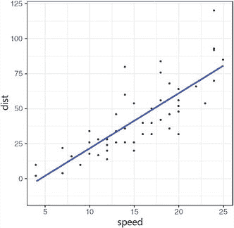
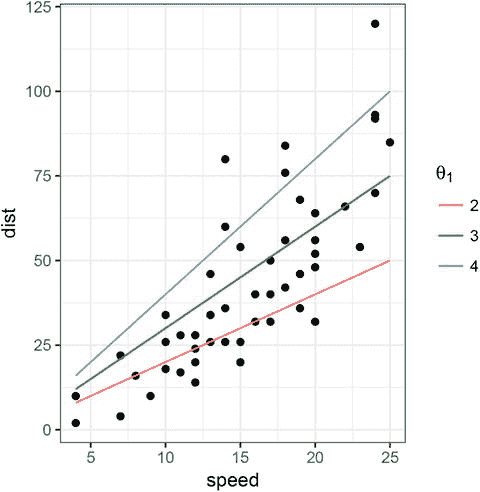
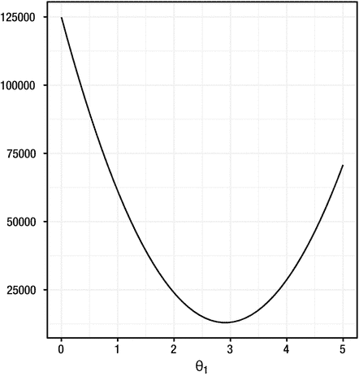
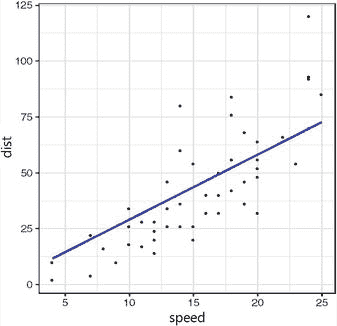
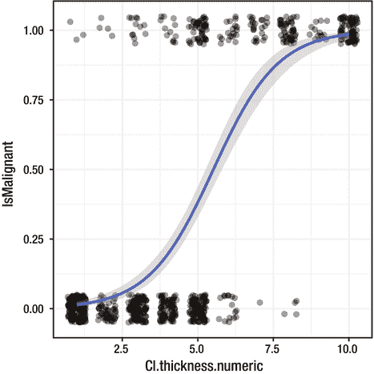
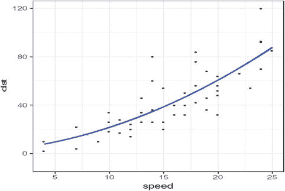
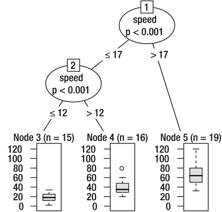

# 六、监督学习

本章和下一章关注数据的数学建模，这是数据科学的核心。我们可以称之为统计学，也可以称之为机器学习。从本质上讲，这是一回事。这就是从数据中提取信息。

## 机器学习

机器学习是开发和应用从数据中学习的模型和算法的学科。传统算法执行固定的规则来解决特定的问题。比如排序数字或者寻找两个城市之间的最短路线。要开发这样的算法，你需要对你试图解决的问题有深刻的理解。除非问题特别简单，或者你已经抽象出所有有趣的案例，否则你很难获得彻底的理解。更常见的是，你可以收集你想要解决的问题的好的或坏的解决方案的例子，而不能够确切地解释为什么给定的解决方案是好的或坏的。或者，您可以获得提供您感兴趣的数据之间的关系的示例的数据，而不必理解这些关系的潜在原因。

这就是机器学习可以发挥作用的地方。机器学习关注从数据中学习；你不需要明确地开发一个算法来解决一个特定的问题。取而代之的是，你使用一个通用的学习算法，你给它输入解决方案的例子，让它从这些例子中学习如何解决问题。

这听起来可能很抽象，但大多数统计建模确实是这样的例子。以线性模型*y*=*αx*+*β*+*ε*为例，其中 *ε* 为随机噪声(通常假设为正态分布)。当你想在 *x* 和 *y* 之间建立一个线性关系模型时，你不会从第一原理中算出 *α* 和 *β* 。你可以在没有事先研究数字的情况下编写一个对数字进行排序的算法，但是如果不查看数据，你通常无法计算出 *y* 和 *x* 之间的线性关系。当你拟合线性模型的时候，你就是在做机器学习。(嗯，我想如果你用手来做就不是机器学习，但是你不太可能经常用手来拟合线性模型。)人们通常不会将线性回归这样的简单模型称为机器学习，但这主要是因为“机器学习”这个术语比这些模型年轻得多。线性回归和神经网络一样是机器学习。

## 监督学习

当您想要使用其他变量来预测变量时，可以使用监督学习。像线性回归这样的情况，你有一些输入变量，例如， *x* ，你想要一个预测输出(或响应)变量的模型， *y = f (x)* 。

第 7 章[的主题](07.html)是无监督学习，相反，当你不一定知道你对什么样的问题感兴趣时，它关注的是发现数据中的模式。当您没有 *x* 和 *y* 值并想知道它们之间的关系，但却有一组数据，并且想发现数据中有哪些模式时。

对于监督学习的最简单的情况，我们有一个响应变量， *y* ，和一个输入变量， *x* ，我们想要找出一个函数， *f* ，将输入映射到输出，即，使得 *y = f (x)* 。我们必须处理的是匹配 *x* 和 *y* 的示例数据。我们可以写成向量**x**=(*x*<sub class="calibre10">*1*</sub>*，…，x* <sub class="calibre10">*n*</sub> )和**y**=(*y*<sub class="calibre10">*1*</sub>*，…，y* <sub class="calibre10">*n*</sub> )

我们通常会接受在我们的观察中可能会有一些噪声，所以从 *x* 到 *y* 的 *f* 并不是完美的映射。所以我们可以稍微改变一下设置，假设我们拥有的数据是**x**=(*x*<sub xmlns:xsi="http://www.w3.org/2001/XMLSchema-instance" class="calibre10">*1*</sub>*，…，x* <sub xmlns:xsi="http://www.w3.org/2001/XMLSchema-instance" class="calibre10">*n*</sub> )和**t**=(*t*<sub xmlns:xsi="http://www.w3.org/2001/XMLSchema-instance" class="calibre10">*1*</sub>*，…，t*<sub xmlns:xsi="http://www.w3.org/2001/XMLSchema-instance" class="calibre10">*n *其中 **t** 是*目标*值并且其中*t*<sub xmlns:xsi="http://www.w3.org/2001/XMLSchema-instance" class="calibre10">*I*</sub>*= y*<sub xmlns:xsi="http://www.w3.org/2001/XMLSchema-instance" class="calibre10">*I*</sub>*+ε*<sub xmlns:xsi="http://www.w3.org/2001/XMLSchema-instance" class="calibre10">*I*</sub>，*y*<sub xmlns:xsi="http://www.w3.org/2001/XMLSchema-instance" class="calibre10">*I*</sub>*= f(t***</sub>

我们如何对误差*ε*<sub xmlns:xsi="http://www.w3.org/2001/XMLSchema-instance" class="calibre10">T3】I</sub>和函数 *f* 建模是由我们自己选择的。毕竟这只是一个模型，我们可以做任何我们想做的事情。当然，并不是所有的模型都一样好，所以我们需要对我们的选择以及如何评估选择是好是坏稍加小心，但原则上，我们可以做任何事情。

大多数机器学习的工作方式是，算法隐式或显式地定义一类参数化函数*f()；θ)* ，每个映射输入到输出*f(；θ):x*↦*f(x；θ) =y(θ)* (现在我们得到的输出值取决于函数的参数， *θ* )，并且学习包括选择参数 *θ* ，使得我们最小化误差，即，使得*f(x*<sub class="calibre10">*I*</sub>*；θ)* 是我们所能得到的最接近 *t* <sub class="calibre10">*i*</sub> 的距离。我们希望我们所有的数据点都接近，或者至少平均接近，那么如果我们让 **y** *(θ)* 表示向量( *y(θ)* <sub class="calibre10">1</sub> *，…，y(θ)*<sub class="calibre10">*n*</sub>)=(*f(x*<sub class="calibre10">1</sub>*；θ)，…，f(x*<sub class="calibre10">*n*</sub>*；θ)* )我们要最小化 y *(θ)* 到 **t** ，∨y*(θ)***t**∨的距离，对于某些距离度量∨∨。

### 回归与分类

有两种类型的监督学习:回归和分类。当我们试图确定的输出变量是一个数字时，就会用到回归。当我们试图以分类变量为目标时，就要用到分类。

取线性回归， *y = αx + β* (或 *t = αx + β +ε* )。这是回归，因为我们试图针对的变量是一个数字。函数的参数化类， *f* <sub class="calibre10">*θ*</sub> 都是线。如果我们让 *θ = θ* <sub class="calibre10">1</sub> *，θ* <sub class="calibre10">0</sub> 而α = *θ* <sub class="calibre10">1</sub> ，β = *θ* <sub class="calibre10">0</sub> 那么*y(θ)= f(x；θ)=θ*<sub class="calibre10">1</sub>*x*+*θ*<sub class="calibre10">0</sub>拟合线性模型包括找到最佳的 *θ* ，其中*最佳的*被定义为得到最接近 **t** 的 y *(θ)* 的 *θ* 。线性回归中使用的距离度量是平方欧几里德距离

。

之所以是距离的平方，而不仅仅是距离，主要是因为数学上的方便——这样更容易使 *θ* 最大化——但也与我们将误差项 *ε* 解释为正态分布有关。每当你在线性回归中拟合数据时，你都在最小化这个距离；您正在寻找在以下意义上最符合数据的参数 *θ* :

```r
$$ \hat{\theta} =  \operatorname*{arg\,min}_{\theta_1,\theta_0}\sum_{i=1}^n(\theta_1 x_i + \theta_0 - t_i)^2\. $$
```

作为分类的例子，假设目标*t*<sub xmlns:xsi="http://www.w3.org/2001/XMLSchema-instance" class="calibre10">T3】IT5】是二进制的，编码为 0 和 1，但是输入变量 *x* <sub xmlns:xsi="http://www.w3.org/2001/XMLSchema-instance" class="calibre10">*i*</sub> 仍然是实数。定义映射函数 *f()的常用方法是:θ)* 就是让它把 *x* 映射到单位区间【0，1】上，把得到的 *y(θ)* 解释为 *t* 为 1 的概率。在分类设置中，如果*f(x；θ)* < 0.5 并预测 1 if*f(x；θ)* > 0.5(并有应对*f(x；*θ)<0.5。在线性分类中，函数 *f* <sub xmlns:xsi="http://www.w3.org/2001/XMLSchema-instance" class="calibre10">*θ*</sub> 可以是这样的:
</sub>

其中σ是一个 sigmoid 函数(一个映射ℝ → [0，1]的“s 形”函数)。σ的常见选择是逻辑函数，在这种情况下，我们称 *f 的拟合为:θ)逻辑回归*。

无论我们是在做回归还是分类，无论我们有没有线性模型，我们都只是在努力寻找参数 *θ* ，让我们的预测 y *(θ)* 尽可能接近我们的目标 **t** 。不同机器学习方法之间的不同细节在于预测函数的类别*f(-;θ)* 被定义，我们有什么样的参数 *θ* ，我们如何测量 y *(θ)* 和 **t** 之间的距离。这里有许多不同的选择和许多不同的机器学习算法。然而，它们中的许多已经在 R 中实现了，所以我们很少需要实现我们自己的。我们只需要找到正确的包来实现我们需要的学习算法。

### 推理对预测

当我们拟合一个模型的参数时，一个总是值得考虑的问题是:我们是关心模型的参数，还是只想建立一个善于预测的函数？

如果你像我一样学习统计学，你对线性回归的介绍主要集中在模型参数上。你推断参数 *θ* <sub class="calibre10">1</sub> 和 *θ* <sub class="calibre10">0</sub> 主要是为了搞清楚 *θ* <sub class="calibre10">1</sub> ≠ 0，即搞清楚 *x* 和 *y* 之间是否存在(线性)关系。当我们用函数拟合数据来了解参数时，我们说我们在做推断，我们在推断参数。

这种对模型参数的关注在许多情况下是有意义的。在线性模型中，系数 *θ* <sub class="calibre10">1</sub> 告诉我们 *x* 和 *y* 之间是否存在显著的相关性，意味着我们在统计上相对确定这种相关性是存在的，以及它是否是实质性的，意味着 *θ* <sub class="calibre10">1</sub> 足够大，可以在实际情况下关心。

当我们关心模型参数时，我们通常想知道的不仅仅是最佳拟合参数，。我们想知道我们有多确定“真实参数”接近我们估计的参数。这通常意味着不仅要估计最佳参数，还要估计参数的置信区间或后验分布。估计这些的难易程度在很大程度上取决于所使用的模型和算法。

我将“真实参数”放在引号中，我在这里谈到估计值与真实参数有多接近，这是有原因的。只有当您正在分析的数据是从函数 *f* <sub xmlns:xsi="http://www.w3.org/2001/XMLSchema-instance" class="calibre10">*θ*</sub> 模拟的，并且存在真值 *θ* 时，才存在真值参数。当您估计参数时，您正在寻找参数*的最佳选择，假设*数据由函数 *f* <sub xmlns:xsi="http://www.w3.org/2001/XMLSchema-instance" class="calibre10">* θ *</sub> 生成。在统计学教科书之外，没有理由认为您的数据是由您考虑的函数类中的函数生成的。除非我们试图对因果关系建模——对我们认为世界实际上是如何作为自然力运行的建模——否则这通常不是模型拟合的基本假设。我们对推断参数进行统计的许多理论*都假定我们有正确的函数类，这就是你得到置信区间的地方。在实践中，数据并不来自这些函数，所以对待你从理论中得到的结果要有所怀疑。*

如果我们有大量的数据——我们在做数据科学时通常会有——使用抽样方法，我们可以直接从数据中获得更多的参数经验分布。我将在这一章的后面简要地回到这一点。

不过，我们并不总是关心模型参数。对于线性回归，很容易解释参数的含义，但在许多机器学习模型中，参数不是那么容易解释，我们也不关心它们。我们所关心的是我们拟合的模型是否能很好地预测目标值。评估我们期望一个函数能够预测的有多好也是我们有时有理论结果的事情，但是对于参数估计，我们不应该太相信这些。最好使用实际数据进行估计，至于获得模型参数的经验分布，我们将在后面讨论。

您是否关心模型参数取决于您的应用程序，并且通常取决于您认为您的模型如何与现实相关。

## 指定型号

在 R 中指定模型的一般模式是使用所谓的“公式”。最简单的形式是 y∞x，我们应该理解为说 *y = f (x)* 。隐含地假设了用模型参数索引的某类函数，*f(—;θ)* ，而我们在用哪一类函数，取决于我们用的是哪几个 R 函数。

### 线性回归

如果我们取一个简单的线性回归，*f*<sub class="calibre10">*θ*</sub>*(x)=θ*<sub class="calibre10">1</sub>*x+θ*<sub class="calibre10">0</sub>，我们需要函数 lm()。

例如，我们可以使用内置数据集 cars，它只包含两个变量，速度和制动距离，其中我们可以将速度视为 *x* 值，将制动距离视为 *y* 值。

```r
cars %>% head
##   speed dist
## 1     4    2
## 2     4   10
## 3     7    4
## 4     7   22
## 5     8   16
## 6     9   10
```

如果我们绘制数据集(见图 [6-1](#Fig1) )，我们会发现速度和距离之间存在非常明显的线性关系。



###### 图 6-1。汽车制动距离与速度的关系图

```r
cars %>% **ggplot**(**aes**(x = speed, y = dist)) +
  **geom_point**() +
  **geom_smooth**(method = "lm")
```

在这个图中，我使用“lm”方法对统计数据进行平滑，以查看拟合情况。默认情况下，geom_smooth()函数会给我们一条黄土曲线，但是由于我们对线性拟合感兴趣，我们告诉它使用 lm 方法。默认情况下，geom_smooth()也将绘制拟合的不确定性。这就是剧情中的灰色地带。这是线可能所在的区域(假设数据是由线性模型生成的)。但是，不要将这与数据点可能在的位置混淆。如果目标值由*t =θ*<sub class="calibre10">1</sub>*x+θ*<sub class="calibre10">0</sub>+*ε*给出，其中 *ε* 具有非常大的方差，那么即使我们非常确定地知道 *θ* <sub class="calibre10">1</sub> 和 *θ* <sub class="calibre10">0</sub> ，我们仍然不能高精度地预测任何单个点将落在哪里预测精度和推断精度是有区别的。我们可能以非常高的精度知道模型参数，但不能很好地预测。我们也可以在不知道所有模型参数的情况下进行很好的预测。如果给定的模型参数对目标变量的位置几乎没有影响，那么训练数据给我们的关于该参数的信息就很少。不过，这通常不会发生，除非模型比它需要的更复杂，因为我们经常想要删除不影响数据的参数。

为了实际拟合数据并获得关于拟合的信息，我们使用 lm()函数和模型规格 dist∞speed，并且我们可以使用 summary()函数来查看关于拟合的信息:

```r
cars %>% **lm**(dist ∼ speed, data = .) %>% summary
##
## Call:
## lm(formula = dist ∼ speed, data = .)
##
## Residuals:
##     Min      1Q  Median      3Q     Max
## -29.069  -9.525  -2.272   9.215  43.201
##
## Coefficients:
##             Estimate Std. Error t value Pr(>|t|)
## (Intercept) -17.5791     6.7584  -2.601   0.0123
## speed         3.9324     0.4155   9.464 1.49e-12
##
## (Intercept) *
## speed       ***
## ---
## Signif. codes:
## 0 '***' 0.001 '**' 0.01 '*' 0.05 '.' 0.1 ' ' 1
##
## Residual standard error: 15.38 on 48 degrees of freedom
## Multiple R-squared:  0.6511, Adjusted R-squared:  0.6438
## F-statistic: 89.57 on 1 and 48 DF,  p-value: 1.49e-12
```

或者，我们可以使用 coefficients()函数获得参数的点估计值，使用 confint()函数获得参数的置信区间:

```r
cars %>% **lm**(dist ∼ speed, data = .) %>% coefficients
## (Intercept)       speed
##  -17.579095    3.932409
cars %>% **lm**(dist ∼ speed, data = .) %>% confint
##                  2.5 %    97.5 %
## (Intercept) -31.167850 -3.990340
## speed         3.096964  4.767853
```

这里，(截距)是*θ*T2 0，速度是*θ*T6】1。

为了说明拟合过程并使点归位，我们可以用不同的参数显式地绘制模型，即，用不同的 *θ* 选择来画线。为了简单起见，我将设置 *θ* <sub class="calibre10">0</sub> = 0。然后我就可以针对 *θ* <sub class="calibre10">1</sub> 的不同选择，画出 *y = θ* <sub class="calibre10">1</sub> *x* 的线，直观地看到适合度；见图 [6-2](#Fig2)



###### 图 6-2。不同参数选择的预测线

```r
predict_dist <- function(speed, theta_1)
  **data.frame**(speed = speed,
             dist = theta_1 * speed,
             theta = **as.factor**(theta_1))

cars %>% **ggplot**(**aes**(x = speed, y = dist, colour = theta)) +
  **geom_point**(colour = "black") +
  **geom_line**(data = **predict_dist**(cars$speed, 2)) +
  **geom_line**(data = **predict_dist**(cars$speed, 3)) +
  **geom_line**(data = **predict_dist**(cars$speed, 4)) +
  **scale_color_discrete**(name=**expression**(theta[1]))
```

在这个图中，我想根据线的 *θ* <sub class="calibre10">1</sub> 参数给线着色，但是因为汽车数据框没有θ列，所以我硬连线了这些点，应该用黑色绘制。这些线是根据它们的 theta 值绘制的，我在 predict_dist()函数中设置了这个值。

每一行都显示了一种型号选择。给定一个输入值 *x* ，它们都产生一个输出值。*y*(*θ*)=*f*(*x；θ* )。所以我们可以固定 *θ* 并考虑映射*x*↦*θ*t16】1t18】x .这是我们在预测给定值 *x* 的输出时使用的函数。如果我们改为固定 *x* ，我们也可以将其视为θ的函数:*θ*t26】1↦*θ*t30】1t32】x。这就是我们在将参数拟合到数据时使用的方法，因为如果我们保持数据集固定，这种映射会定义一个误差函数，也就是说，一个给定参数的函数会为我们提供预测值与目标值之间的距离。如果像以前一样，我们的输入值和目标值是向量 **x** 和 **t** ，那么误差函数如下:


我们可以针对 *θ* <sub xmlns:xsi="http://www.w3.org/2001/XMLSchema-instance" class="calibre10">1</sub> 的不同选择绘制误差图(见图 [6-3](#Fig3) )。在这个函数最小化的地方，我们找到了对*θ*T8】1 的最佳估计。



###### 图 6-3。不同参数选择的误差值

```r
thetas <- **seq**(0, 5, length.out = 50)
fitting_error <- **Vectorize**(function(theta)
  **sum**((theta * cars$speed - cars$dist)**2)
)

**data.frame**(thetas = thetas, errors = **fitting_error**(thetas)) %>%
  **ggplot**(**aes**(x = thetas, y = errors)) +
  **geom_line**() +
  **xlab**(**expression**(theta[1])) + **ylab**("")
```

总结这个例子，我们也可以绘制和拟合最佳模型，其中 *θ* <sub class="calibre10">0</sub> = 0。移除截距所需的公式是“y∞x-1”的形式。是“- 1”删除了截距。

```r
cars %>% **lm**(dist ∼ speed - 1, data = .) %>% coefficients
##    speed
## 2.909132
```

我们还可以使用 geom_smooth()绘制这条回归线，以及它所在位置的置信区间。见图 [6-4](#Fig4) 。不过，这里我们需要使用公式 y∞x-1，而不是 dist∞speed-1。这是因为 geom_smooth()函数作用于具有 x 和 y 坐标的 ggplot2 图层，而不是数据框中的数据。在美学中，我们将速度变量映射到 x 轴，将距离变量映射到 y 轴，但是 geom_smooth()处理的是 x 和 y 轴。



###### 图 6-4。穿过(0，0)的最佳回归线

```r
cars %>% **ggplot**(**aes**(x = speed, y = dist)) +
  **geom_point**() +
  **geom_smooth**(method = "lm", formula = y ∼ x - 1)
```

### 逻辑回归(分类，真的)

使用其他统计模型的工作方式相同。我们指定函数的类别， *f* <sub class="calibre10">*θ*</sub> ，使用公式并使用函数来拟合其参数。考虑二元分类和逻辑回归。

这里，我们可以使用第 [3](03.html) 章中讨论的 mlbench 库中的乳腺癌数据，并询问肿块厚度是否对肿瘤恶性风险有影响。也就是说，我们想看看是否可以从 Cl.thickness 变量预测 Class 变量。

```r
**library**(mlbench)
**data**("BreastCancer")
BreastCancer %>% head
##        Id Cl.thickness Cell.size Cell.shape
## 1 1000025            5         1          1
## 2 1002945            5         4          4
## 3 1015425            3         1          1
## 4 1016277            6         8          8
## 5 1017023            4         1          1
## 6 1017122            8        10         10
##   Marg.adhesion Epith.c.size Bare.nuclei
## 1             1            2           1
## 2             5            7          10
## 3             1            2           2
## 4             1            3           4
## 5             3            2           1
## 6             8            7          10
##   Bl.cromatin Normal.nucleoli Mitoses     Class
## 1           3               1       1    benign
## 2           3               2       1    benign
## 3           3               1       1    benign
## 4           3               7       1    benign
## 5           3               1       1    benign
## 6           9               7       1 malignant
```

我们可以根据拟合绘制数据，如图 [6-5](#Fig5) 所示。由于恶性状态为 0 或 1，这些点会重叠，但如果我们在图中添加一点抖动，我们仍然可以看到它们，如果我们使它们稍微透明，我们可以看到点的密度。


###### 图 6-5。乳腺癌等级与肿块厚度

```r
BreastCancer %>%
  **ggplot**(**aes**(x = Cl.thickness, y = Class)) +
  **geom_jitter**(height = 0.05, width = 0.3, alpha=0.4)
```

对于分类，我们仍然使用公式 y∞x 指定预测函数*y = f(x)*。y∞x 的结果参数现在只是二元的。为了拟合逻辑回归，我们需要使用 glm()函数(*广义*线性模型)，将族设置为“二项式”。这指定我们使用逻辑函数从线性空间 *x* 和 *θ* 映射到单位区间。除此之外，拟合和获得结果非常相似。

然而，我们不能用逻辑回归直接拟合乳腺癌数据。有两个问题。第一个是乳腺癌数据集考虑了团块厚度有序因子，但对于逻辑回归，我们需要输入变量为数字。虽然一般来说，直接将分类数据转换成数字数据是不可取的，但从图中判断，在这种情况下似乎是可以的。使用函数 as.numeric()可以做到这一点，但是请记住，在处理因子时，这是一种有风险的方法！它实际上适用于这个数据集，但是我们将使用更安全的方法，首先将因子转换成字符串，然后转换成数字。第二个问题是 glm()函数期望响应变量是数字的，将类编码为 0 或 1，而乳腺癌数据将类编码为因子。一般来说，对于不同的算法，分类所期望的是一个因子还是一个数字编码会有所不同，所以您总是需要查看文档，但是无论如何，在两种表示之间进行转换是足够简单的。

我们可以将输入变量转换为数值，将响应变量转换为 0 和 1，并将数据与拟合模型一起绘制，如图 [6-6](#Fig6) 所示。对于 geom_smooth()函数，我们指定方法为 glm，族为二项式。要指定族，我们需要将这个参数传递给 smoothing 方法，这是通过给 method.args 参数一个命名参数列表来完成的；这里我们只给出它的列表(family = "binomial)。



###### 图 6-6。符合乳腺癌数据的逻辑回归

```r
BreastCancer %>%
  **mutate**(Cl.thickness.numeric =
                **as.numeric**(**as.character**(Cl.thickness))) %>%
  **mutate**(IsMalignant = **ifelse**(Class == "benign", 0, 1)) %>%
  **ggplot**(**aes**(x = Cl.thickness.numeric, y = IsMalignant)) +
  **geom_jitter**(height = 0.05, width = 0.3, alpha=0.4) +
  **geom_smooth**(method = "glm",
              method.args = **list**(family = "binomial"))
```

为了实际获得拟合的对象，我们使用 glm()，就像我们使用 lm()进行线性回归一样。

```r
BreastCancer %>%
  **mutate**(Cl.thickness.numeric =
                **as.numeric**(**as.character**(Cl.thickness))) %>%
  **mutate**(IsMalignant = **ifelse**(Class == "benign", 0, 1)) %>%
  **glm**(IsMalignant ∼ Cl.thickness.numeric,
      family = "binomial",
      data = .)
##
## Call:  glm(formula = IsMalignant ∼ Cl.thickness.numeric, family = "binomial",
##     data = .)
##
## Coefficients:
##          (Intercept)  Cl.thickness.numeric
##              -5.1602                0.9355
##
## Degrees of Freedom: 698 Total (i.e. Null);  697 Residual
## Null Deviance:       900.5
## Residual Deviance: 464.1     AIC: 468.1
```

### 模型矩阵和公式

大多数统计模型和机器学习算法实际上不是从单个值创建地图，*f*(*；θ* ): *x* ↦ *y* ，而是从一个向量，*f*(*；θ* ): **x** ↦ *y* 。当我们拟合单个 *x* 和 *y* 值的直线时，我们实际上也在拟合一个向量，因为我们既有 *x* 值也有要拟合的截距。这就是为什么模型有两个参数， *θ* <sub class="calibre10">0</sub> 和 *θ* <sub class="calibre10">0</sub> 。对于每个 *x* 值，我们实际上使用的是向量(1， *x* ),其中 1 用于拟合截距。

但是，我们不应该将它与作为模型拟合输入的向量相混淆。如果我们有数据( **x** ， **t** )要拟合，那么我们已经有了输入数据的向量。但是线性模型实际上看到的是一个用于 **x** 的矩阵，所以我们称之为 x。这个矩阵被称为*模型矩阵*，在 **x** 中每个值有一行，它有两列，一列用于截距，一列用于 *x* 值。
T13
T15】

使用 model.matrix()函数，我们可以看到矩阵 R 为给定的数据集和公式生成了什么模型。对于汽车数据，如果我们想拟合距离与速度的关系，我们得到这样的结果:

```r
cars %>%
  **model.matrix**(dist ∼ speed, data = .) %>%
  **head**(5)
##   (Intercept) speed
## 1           1     4
## 2           1     4
## 3           1     7
## 4           1     7
## 5           1     8
```

如果我们去掉截距，我们会得到这个:

```r
cars %>%
  **model.matrix**(dist ∼ speed - 1, data = .) %>%
  **head**(5)
##   speed
## 1     4
## 2     4
## 3     7
## 4     7
## 5     8
```

几乎所有的学习算法都在一个模型矩阵上工作，所以在 R 中，它们被实现为采用一个公式来指定模型，然后根据这个公式和输入数据来构建模型矩阵。

对于线性回归，映射非常简单。如果我们让参数 *θ* = ( *θ* <sub class="calibre10">0</sub> ， *θ* <sub class="calibre10">1</sub> )那么它只是乘以模型矩阵， *X* 。
T13
T15】

公式和模型矩阵的这种组合是指定模型的强大工具。因为我们用来拟合数据的所有算法都是在模型矩阵上工作的，所以没有理由在给出复杂的公式方面有所保留。公式无论如何都会被转化成模型矩阵，它们都可以处理它们。

如果你想拟合多个参数，没问题。你只要写出 y∞x+z，模型矩阵就会有三列。
![$$ X=\kern0.36em \left[\;\begin{array}{ccc}\hfill 1\hfill & \hfill {x}_1\hfill & \hfill {z}_1\hfill \\ {}\hfill 1\hfill & \hfill {x}_2\hfill & \hfill {z}_2\hfill \\ {}\hfill 1\hfill & \hfill {x}_3\hfill & \hfill {z}_3\hfill \\ {}\hfill \vdots \hfill & \hfill \vdots \hfill & \hfill \vdots \hfill \\ {}\hfill 1\hfill & \hfill {x}_n\hfill & \hfill {z}_n\hfill \end{array}\right] $$](img/A439481_1_En_6_Chapter_Equg.gif)
T3】

我们的模型拟合函数很乐意拟合这个模型矩阵，就像我们从单个变量中得到的模型矩阵一样。

因此，如果我们想让乳腺癌数据符合细胞厚度和细胞大小，我们可以通过在公式中添加两个解释变量来实现。

```r
BreastCancer %>%
  **mutate**(Cl.thickness.numeric =
           **as.numeric**(**as.character**(Cl.thickness)),
         Cell.size.numeric =
           **as.numeric**(**as.character**(Cell.size))) %>%
  **mutate**(IsMalignant = **ifelse**(Class == "benign", 0, 1)) %>%
  **model.matrix**(IsMalignant ∼ Cl.thickness.numeric + Cell.size.numeric,
               data = .) %>%
  **head**(5)
##   (Intercept) Cl.thickness.numeric
## 1           1                    5
## 2           1                    5
## 3           1                    3
## 4           1                    6
## 5           1                    4
##   Cell.size.numeric
## 1                 1
## 2                 4
## 3                 1
## 4                 8
## 5                 1
```

那么广义线性模型拟合函数将愉快地工作:

```r
BreastCancer %>%
  **mutate**(Cl.thickness.numeric =
           **as.numeric**(**as.character**(Cl.thickness)),
         Cell.size.numeric =
           **as.numeric**(**as.character**(Cell.size))) %>%
  **mutate**(IsMalignant = **ifelse**(Class == "benign", 0, 1)) %>%
  **glm**(IsMalignant ∼ Cl.thickness.numeric + Cell.size.numeric,
      family = "binomial",
      data = .)
##
## Call:  glm(formula = IsMalignant ∼ Cl.thickness.numeric + Cell.size.numeric,
##     family = "binomial", data = .)
##
## Coefficients:
##          (Intercept)  Cl.thickness.numeric
##              -7.1517                0.6174
##    Cell.size.numeric
##               1.1751
##
## Degrees of Freedom: 698 Total (i.e. Null);  696 Residual
## Null Deviance:       900.5
## Residual Deviance: 212.3     AIC: 218.3
```

将数据转换为模型矩阵也适用于因子，它们只是表示为每个级别的二进制向量:

```r
BreastCancer %>%
  **mutate**(IsMalignant = **ifelse**(Class == "benign", 0, 1)) %>%
  **model.matrix**(IsMalignant ∼ Bare.nuclei, data = .) %>%
  **head**(5)
##   (Intercept) Bare.nuclei2 Bare.nuclei3
## 1           1            0            0
## 2           1            0            0
## 3           1            1            0
## 4           1            0            0
## 5           1            0            0
##   Bare.nuclei4 Bare.nuclei5 Bare.nuclei6
## 1            0            0            0
## 2            0            0            0
## 3            0            0            0
## 4            1            0            0
## 5            0            0            0
##   Bare.nuclei7 Bare.nuclei8 Bare.nuclei9
## 1            0            0            0
## 2            0            0            0
## 3            0            0            0
## 4            0            0            0
## 5            0            0            0
##   Bare.nuclei10
## 1             0
## 2             1
## 3             0
## 4             0
## 5             0
```

有序因子的翻译有点复杂，但 R 会很乐意为您完成:

```r
BreastCancer %>%
  **mutate**(IsMalignant = **ifelse**(Class == "benign", 0, 1)) %>%
  **model.matrix**(IsMalignant ∼ Cl.thickness, data = .) %>%
  **head**(5)
##   (Intercept) Cl.thickness.L Cl.thickness.Q
## 1           1    -0.05504819    -0.34815531
## 2           1    -0.05504819    -0.34815531
## 3           1    -0.27524094    -0.08703883
## 4           1     0.05504819    -0.34815531
## 5           1    -0.16514456    -0.26111648
##   Cl.thickness.C Cl.thickness^4 Cl.thickness^5
## 1      0.1295501     0.33658092    -0.21483446
## 2      0.1295501     0.33658092    -0.21483446
## 3      0.3778543    -0.31788198    -0.03580574
## 4     -0.1295501     0.33658092     0.21483446
## 5      0.3346710     0.05609682    -0.39386318
##   Cl.thickness^6 Cl.thickness^7 Cl.thickness^8
## 1     -0.3113996      0.3278724      0.2617852
## 2     -0.3113996      0.3278724      0.2617852
## 3      0.3892495     -0.5035184      0.3739788
## 4     -0.3113996     -0.3278724      0.2617852
## 5      0.2335497      0.2459043     -0.5235703
##   Cl.thickness^9
## 1     -0.5714300
## 2     -0.5714300
## 3     -0.1632657
## 4      0.5714300
## 5      0.3809534
```

如果希望包含参数之间的交互，可以使用*而不是+来指定:

```r
BreastCancer %>%
  **mutate**(Cl.thickness.numeric =
           **as.numeric**(**as.character**(Cl.thickness)),
         Cell.size.numeric =
           **as.numeric**(**as.character**(Cell.size))) %>%
  **mutate**(IsMalignant = **ifelse**(Class == "benign", 0, 1)) %>%
  **model.matrix**(IsMalignant ∼ Cl.thickness.numeric * Cell.size.numeric,
               data = .) %>%
  **head**(5)
##   (Intercept) Cl.thickness.numeric
## 1           1                    5
## 2           1                    5
## 3           1                    3
## 4           1                    6
## 5           1                    4
##   Cell.size.numeric
## 1                 1
## 2                 4
## 3                 1
## 4                 8
## 5                 1
##   Cl.thickness.numeric:Cell.size.numeric
## 1                                      5
## 2                                     20
## 3                                      3
## 4                                     48
## 5                                      4
```

交互的建模方式在一定程度上取决于您的参数是因子还是数值，但是对于数值，模型矩阵将只包含两个值相乘的新列。对于因子，因子的每个级别都有一个新列:

```r
BreastCancer %>%
  **mutate**(Cl.thickness.numeric =
           **as.numeric**(**as.character**(Cl.thickness))) %>%
  **mutate**(IsMalignant = **ifelse**(Class == "benign", 0, 1)) %>%
  **model.matrix**(IsMalignant ∼ Cl.thickness.numeric * Bare.nuclei, data = .) %>%
  **head**(3)
##   (Intercept) Cl.thickness.numeric Bare.nuclei2
## 1           1                    5            0
## 2           1                    5            0
## 3           1                    3            1
##   Bare.nuclei3 Bare.nuclei4 Bare.nuclei5
## 1            0            0            0
## 2            0            0            0
## 3            0            0            0
##   Bare.nuclei6 Bare.nuclei7 Bare.nuclei8
## 1            0            0            0
## 2            0            0            0
## 3            0            0            0
##   Bare.nuclei9 Bare.nuclei10
## 1            0             0
## 2            0             1
## 3            0             0
##   Cl.thickness.numeric:Bare.nuclei2
## 1                                 0
## 2                                 0
## 3                                 3
##   Cl.thickness.numeric:Bare.nuclei3
## 1                                 0
## 2                                 0
## 3                                 0
##   Cl.thickness.numeric:Bare.nuclei4
## 1                                 0
## 2                                 0
## 3                                 0
##   Cl.thickness.numeric:Bare.nuclei5
## 1                                 0
## 2                                 0
## 3                                 0
##   Cl.thickness.numeric:Bare.nuclei6
## 1                                 0
## 2                                 0
## 3                                 0
##   Cl.thickness.numeric:Bare.nuclei7
## 1                                 0
## 2                                 0
## 3                                 0
##   Cl.thickness.numeric:Bare.nuclei8
## 1                                 0
## 2                                 0
## 3                                 0
##   Cl.thickness.numeric:Bare.nuclei9
## 1                                 0
## 2                                 0
## 3                                 0
##   Cl.thickness.numeric:Bare.nuclei10
## 1                                  0
## 2                                  5
## 3                                  0
```

交互列的名称中都有:符号，您也可以通过在模型公式中写入来直接指定交互术语:

```r
BreastCancer %>%
  **mutate**(Cl.thickness.numeric =
           **as.numeric**(**as.character**(Cl.thickness))) %>%
  **mutate**(IsMalignant = **ifelse**(Class == "benign", 0, 1)) %>%
  **model.matrix**(IsMalignant ∼ Cl.thickness.numeric : Bare.nuclei, data = .) %>%
  **head**(3)
##   (Intercept) Cl.thickness.numeric:Bare.nuclei1
## 1           1                                 5
## 2           1                                 0
## 3           1                                 0
##   Cl.thickness.numeric:Bare.nuclei2
## 1                                 0
## 2                                 0
## 3                                 3
##   Cl.thickness.numeric:Bare.nuclei3
## 1                                 0
## 2                                 0
## 3                                 0
##   Cl.thickness.numeric:Bare.nuclei4
## 1                                 0
## 2                                 0
## 3                                 0
##   Cl.thickness.numeric:Bare.nuclei5
## 1                                 0
## 2                                 0
## 3                                 0
##   Cl.thickness.numeric:Bare.nuclei6
## 1                                 0
## 2                                 0
## 3                                 0
##   Cl.thickness.numeric:Bare.nuclei7
## 1                                 0
## 2                                 0
## 3                                 0
##   Cl.thickness.numeric:Bare.nuclei8
## 1                                 0
## 2                                 0
## 3                                 0
##   Cl.thickness.numeric:Bare.nuclei9
## 1                                 0
## 2                                 0
## 3                                 0
##   Cl.thickness.numeric:Bare.nuclei10
## 1                                  0
## 2                                  5
## 3                                  0
```

如果您想使用数据中除响应变量之外的所有变量，您甚至可以使用公式 y∾。在哪里？会给出数据中除 y 以外的所有参数。

使用公式和模型矩阵也意味着我们不必使用原始数据。在交给我们的学习算法之前，我们可以对它进行转换。一般来说，我们可以使用函数 *ϕ* 来转换我们的数据。它之所以被称为 phi，是因为我们将它产生的数据称为*特征*，它的目的是提取数据的相关特征，以提供给学习算法。它通常从向量映射到向量，因此您可以使用它将原始数据中的每一行转换为模型矩阵的行，然后我们将它称为*φ*而不是 *X* 。
![$$ \varPhi =\left[\begin{array}{c}\hfill -\phi \left({\boldsymbol{x}}_1\right)-\hfill \\ {}\hfill -\phi \left({\boldsymbol{x}}_2\right)-\hfill \\ {}\hfill -\phi \left({\boldsymbol{x}}_3\right)-\hfill \\ {}\hfill \dots \hfill \\ {}\hfill -\phi \left({\boldsymbol{x}}_n\right)-\hfill \end{array}\right] $$](img/A439481_1_En_6_Chapter_Equi.gif)
![$$ \varPhi =\left[\begin{array}{c}\hfill -\phi \left({\boldsymbol{x}}_1\right)-\hfill \\ {}\hfill -\phi \left({\boldsymbol{x}}_2\right)-\hfill \\ {}\hfill -\phi \left({\boldsymbol{x}}_3\right)-\hfill \\ {}\hfill \dots \hfill \\ {}\hfill -\phi \left({\boldsymbol{x}}_n\right)-\hfill \end{array}\right] $$](img/A439481_1_En_6_Chapter_Equj.gif)

如果这听起来很抽象，也许看一些例子会有帮助。我们回到汽车数据，但这一次，我们想用多项式而不是直线来拟合数据。如果 *d* 表示制动距离， *s* 表示速度，那么我们要拟合*d*=*θ*<sub xmlns:xsi="http://www.w3.org/2001/XMLSchema-instance" class="calibre10">0</sub>+*θ*<sub xmlns:xsi="http://www.w3.org/2001/XMLSchema-instance" class="calibre10">1</sub>*s*+*θ*<sub xmlns:xsi="http://www.w3.org/2001/XMLSchema-instance" class="calibre10">2</sub>*s*<sup xmlns:xsi="http://www.w3.org/2001/XMLSchema-instance" class="calibre6">2</sup>+*θ*<sub xmlns:xsi="http://www.w3.org/2001/XMLSchema-instance" class="calibre10">*我们只做 *n* = 2，所以我们想拟合一个二次多项式。不要对多项式的高次感到困惑，它仍然是一个线性模型。线性模型中的*线性*是指 *θ* 参数，不是数据。我们只需要将单个 *s* 参数映射到具有不同多项式次数的向量，因此 1 表示截距， *s* 表示线性分量，*s*s<sup xmlns:xsi="http://www.w3.org/2001/XMLSchema-instance" class="calibre6">2</sup>表示平方分量。所以 *ϕ(s)* = (1， *s* ， *s* <sup xmlns:xsi="http://www.w3.org/2001/XMLSchema-instance" class="calibre6">2</sup> )。*</sub>

我们可以把它写成一个公式。在这里，我们不需要明确指定截取项——默认情况下会包含它，如果我们不想要它，我们必须明确删除它——但是我们需要速度，我们需要 speed^2.

```r
cars %>%
  **model.matrix**(dist ∼ speed + speed^2, data = .) %>%
  head
##   (Intercept) speed
## 1           1     4
## 2           1     4
## 3           1     7
## 4           1     7
## 5           1     8
## 6           1     9
```

现在这不太管用，原因是乘法被解释为相互作用项，即使它是与参数本身的相互作用。和它自身的互动不会进入模型矩阵，因为那是愚蠢的。

为了避免这个问题，我们需要告诉 r，speed^2 项应该按照它本来的样子来解释。我们使用 identity 函数 I():

```r
cars %>%
  **model.matrix**(dist ∼ speed + **I**(speed^2), data = .) %>%
  head
##   (Intercept) speed I(speed^2)
## 1           1     4         16
## 2           1     4         16
## 3           1     7         49
## 4           1     7         49
## 5           1     8         64
## 6           1     9         81
```

现在我们的模型矩阵有三列，这正是我们想要的。

我们可以使用线性模型函数拟合多项式，如下所示:

```r
cars %>% **lm**(dist ∼ speed + **I**(speed^2), data = .) %>%
  summary
##
## Call:
## lm(formula = dist ∼ speed + I(speed^2), data = .)
##
## Residuals:
##     Min      1Q  Median      3Q     Max
## -28.720  -9.184  -3.188   4.628  45.152
##
## Coefficients:
##             Estimate Std. Error t value Pr(>|t|)
## (Intercept)  2.47014   14.81716   0.167    0.868
## speed        0.91329    2.03422   0.449    0.656
## I(speed^2)   0.09996    0.06597   1.515    0.136
##
## Residual standard error: 15.18 on 47 degrees of freedom
## Multiple R-squared:  0.6673, Adjusted R-squared:  0.6532
## F-statistic: 47.14 on 2 and 47 DF,  p-value: 5.852e-12
```

或者我们可以这样绘制(见图 [6-7](#Fig7) ):



###### 图 6-7。cars 数据符合二次多项式

```r
cars %>% **ggplot**(**aes**(x = speed, y = dist)) +
  **geom_point**() +
  **geom_smooth**(method = "lm", formula = y ∼ x + **I**(x^2))
```

这是一个稍微更适合的模型，但这不是重点。您可以看到如何转换公式中的数据，以便为拟合算法提供不同的特征。

## 验证模型

我怎么知道多项式拟合比线性拟合好？理论上，二次多项式总是比直线更适合，因为直线是多项式的特例。我们只是将 *θ* <sub class="calibre10">2</sub> 设置为零。如果最佳拟合多项式没有*θ*<sub class="calibre10">2</sub>= 0，那是因为如果没有，我们可以更好地拟合数据。

多项式拟合的结果告诉我，在 summary()函数的输出中，变量并不重要。它告诉我，无论是从线性分量还是平方分量，它都不是很有用。很明显，这些点在一条线上，所以没有线性分量是不正确的。我不能用总结，因为它只是告诉我，当我有两个组成部分，那么他们都没有统计学意义。那没什么意义。

但是我应该在乎吗？如果我知道更复杂的模型总是更适合，那么我不应该总是使用它吗？这种想法的问题是，尽管最复杂的模型总是更适合训练数据，但它不一定能更好地概括。如果我使用一个足够高的次数多项式——如果我的次数与数据点的数量相同——我就可以完美地拟合数据。但是它将拟合出 *x* 和 *y* 和*之间的系统关系以及*我们目标中的统计误差 *t* 。这对于预测点数 *n* + 1 可能完全没有用。

我真正需要知道的是，是否有一个或另一个模型更好地从速度预测距离。

我们可以拟合这两个模型，并使用 predict()函数获得它们的预测。它将拟合模型作为第一个参数，将预测数据作为第二个参数:

```r
line <- cars %>% **lm**(dist ∼ speed, data = .)
poly <- cars %>% **lm**(dist ∼ speed + **I**(speed^2), data = .)

**predict**(line, cars) %>% head
##         1         2         3         4         5
## -1.849460 -1.849460  9.947766  9.947766 13.880175
##         6
## 17.812584
**predict**(poly, cars) %>% head
##         1         2         3         4         5
##  7.722637  7.722637 13.761157 13.761157 16.173834
##         6
## 18.786430
```

### 评估回归模型

为了比较这两个模型，我们需要衡量它们的吻合程度。由于这两个模型都在拟合从预测到目标的平方距离，一个公平的衡量标准应该是均方差。不过，它的单位是距离的平方，所以我们通常用这个平均距离的平方根来衡量预测的质量，这将给我们以距离为单位的误差。

```r
rmse <- function(x,t) **sqrt**(**mean**(**sum**((t - x)^2)))

**rmse**(**predict**(line, cars), cars$dist)
## [1] 106.5529
**rmse**(**predict**(poly, cars), cars$dist)
## [1] 104.0419
```

现在显然多项式拟合得稍微好一点，这应该是基于理论的，但这里有一点欺骗。我们正在研究模型如何对我们用来拟合它们的数据起作用。更复杂的模型在这方面总是更好。这就是我们正在处理的问题。更复杂的模型可能会过度拟合数据，并捕获我们不希望它捕获的统计噪声。我们真正想知道的是模型概括得有多好；他们对尚未见过的数据的处理能力如何，以及如何使用这些数据来拟合他们的参数？

我们使用了所有的数据来拟合模型。这通常是个好主意。您希望使用所有可用的数据来获得最合适的模型。但是为了比较模型，我们需要有拟合中没有用到的数据。

我们可以将数据分成两组，一组用于训练，另一组用于测试模型。有 50 个数据点，所以我可以用前 25 个数据点来训练我的模型，然后用后 25 个数据点来测试它们。

```r
training_data <- cars[1:25,]
test_data <- cars[26:50,]

line <- training_data %>% **lm**(dist ∼ speed, data = .)
poly <- training_data %>% **lm**(dist ∼ speed + **I**(speed^2), data = .)

**rmse**(**predict**(line, test_data), test_data$dist)
## [1] 88.89189
**rmse**(**predict**(poly, test_data), test_data$dist)
## [1] 83.84263
```

二次多项式还是比较好的，但是我也还是在作弊。我的数据集中有更多的结构，而不仅仅是速度和距离。数据帧根据距离排序，因此训练集包含所有短距离数据，测试数据包含所有长距离数据。两者并不相似。这可不好。

一般来说，你无法知道你的数据中是否有这样的结构。在这种特殊情况下，很容易看到，因为结构是如此明显，但有时它是微妙的。因此，当您将数据分为训练数据和测试数据时，您会希望随机地对数据点进行采样。它去掉了数据点的顺序结构。

我们可以使用 sample()函数随机采样 0 和 1:

```r
sampled_cars <- cars %>%
  **mutate**(training = **sample**(0:1, **nrow**(cars), replace = TRUE))

sampled_cars %>% head
##   speed dist training
## 1     4    2        1
## 2     4   10        0
## 3     7    4        0
## 4     7   22        0
## 5     8   16        1
## 6     9   10        1
```

这并没有给我们 50/50 的训练和测试数据，因为哪个数据点进入每个类别将取决于随机样本，但它将大约是我们获得的训练数据的一半:

```r
training_data <- sampled_cars %>% **filter**(training == 1)
test_data <- sampled_cars %>% **filter**(training == 0)

training_data %>% head
##   speed dist training
## 1     4    2        1
## 2     8   16        1
## 3     9   10        1
## 4    11   28        1
## 5    12   20        1
## 6    13   26        1
test_data %>% head
##   speed dist training
## 1     4   10        0
## 2     7    4        0
## 3     7   22        0
## 4    10   18        0
## 5    10   26        0
## 6    10   34        0
```

现在我们可以更好地估计这些函数是如何工作的:

```r
line <- training_data %>% **lm**(dist ∼ speed, data = .)
poly <- training_data %>% **lm**(dist ∼ speed + **I**(speed^2), data = .)

**rmse**(**predict**(line, test_data), test_data$dist)
## [1] 82.45426
**rmse**(**predict**(poly, test_data), test_data$dist)
## [1] 81.2045
```

当然，当我们创建训练和测试数据时，准确性分数取决于随机抽样，因此您可能希望使用更多样本。我们将在下一节回到这个问题。

现在，一旦你想出了什么是最好的模型，你仍然会想用你所有的数据来训练它。分割数据只是评估不同模型工作效果的一种工具。对于你选择的最终模型，你总是想用你所有的数据来拟合它。

### 评估分类模型

如果你想做分类而不是回归，那么均方根误差不是用来评估你的模型的函数。有了分类，你想知道有多少数据点分类正确，有多少分类不正确。

例如，我们可以获取乳腺癌数据并拟合一个模型:

```r
formatted_data <- BreastCancer %>%
  **mutate**(Cl.thickness.numeric =
           **as.numeric**(**as.character**(Cl.thickness)),
         Cell.size.numeric =
           **as.numeric**(**as.character**(Cell.size))) %>%
  **mutate**(IsMalignant = **ifelse**(Class == "benign", 0, 1))

fitted_model <- formatted_data %>%
  **glm**(IsMalignant ∼ Cl.thickness.numeric + Cell.size.numeric, data = .)
```

为了得到它的预测，我们可以再次使用 predict()，但是我们将看到，对于这个特定的模型，预测是肿瘤为恶性的概率。默认情况下，我们使用 glm()创建的模型将采用“logit”单位，但是我们可以使用 type 参数来获得概率使用的输入单位。

```r
**predict**(fitted_model, formatted_data, type = "response") %>% head
##          1          2          3          4
## 0.05266571 0.65374326 0.01591478 0.99740926
##          5          6
## 0.02911157 0.99992795
```

我们需要将其转化为实际的预测。这里的自然选择是将概率分成 50%。如果我们更确定一个肿瘤是恶性的而不是良性的，我们会把它归类为恶性的。

```r
classify <- function(probability) **ifelse**(probability < 0.5, 0, 1)
classified_malignant <- **classify**(**predict**(fitted_model, formatted_data))
```

你想把如何分类的阈值放在哪里取决于你的数据和分类的结果。在临床情况下，您可能希望进一步检查恶性概率低于 50%的肿瘤，或者您可能不想告诉患者肿瘤可能是恶性的，如果它只有 50%的可能性。分类应该考虑到你对分类的确信程度，这在很大程度上取决于你所处的情况。当然，你不会想赌上你所拥有的最好的知识，所以我并不是建议你把所有低于概率 75%的事情归为“错误”类。你从中获得的唯一收获是做出比你可能做出的更糟糕的预测。但是有时你想留下一些不可预测的数据。所以这里你可以使用模型预测的概率来留下一些数据点作为 NA。你想如何使用你的预测给出的概率而不仅仅是类别-假设是这样，这取决于用于分类的算法-取决于你和你正在分析的情况。

#### 混淆矩阵

在任何情况下，如果我们只是将分类阈值设为 50/50，那么我们可以使用 table()函数将预测分类与实际分类进行比较，如下所示:

```r
**table**(formatted_data$IsMalignant, classified_malignant)
##    classified_malignant
##       0   1
##   0 450   8
##   1  42 199
```

这张表格将预测与真实类别进行对比，被称为*混淆矩阵*。行计算我们在 formatted _ data $ IsMalignant 参数中看到的 0 和 1 的数量，列计算我们在 classified _ malignant 参数中看到的 0 和 1 的数量。所以第一行是数据显示肿瘤*不是*恶性，第二行是数据显示肿瘤*是*恶性。第一列是预测说肿瘤不是恶性的，而第二列是预测说它们是恶性的。

当然，这取决于 table()参数的顺序，它不知道哪个参数包含数据类，哪个包含模型预测。要记住哪个维度(行或列)是预测可能有点困难，但是您可以提供一个参数 dnn ( *dimnames* names)，让表为您记住它。

```r
**table**(formatted_data$IsMalignant, classified_malignant,
      dnn=**c**("Data", "Predictions"))
##     Predictions
## Data   0   1
##    0 450   8
##    1  42 199
```

正确的预测在对角线上，非对角线值是我们的模型预测不正确的地方。

第一行是数据显示肿瘤不是恶性的地方。第一个元素，模型预测肿瘤是良性的，数据也是一致的，称为*真阴性*。它右边的元素被称为*假阳性*，模型显示肿瘤是恶性的，但数据显示不是。

第二行是数据显示肿瘤是恶性的。第一列是预测说它不是恶性肿瘤，这些被称为*假阴性*。第二列是模型和数据都说肿瘤是恶性的情况。那就是*真正的阳性*。

术语*阳性*和*阴性*在这里有点棘手。我设法把它们偷偷放在你面前，通过把这些类叫做 0 和 1，你已经把它们和真、假、正、负联系在一起，通过一个数据集，在这个数据集里，我们更自然地认为恶性肿瘤是我们想要预测的。

类别不一定是 0 和 1。在这个特定的模型中，我必须将类翻译成逻辑分类的 0 和 1，这样做更容易。但实际上，这些阶层有“良性”和“恶性”之分。

```r
classify <- function(probability)
  **ifelse**(probability < 0.5, "benign", "malignant")
classified <- **classify**(**predict**(fitted_model, formatted_data))

**table**(formatted_data$Class, classified,
      dnn=**c**("Data", "Predictions"))
##            Predictions
## Data        benign malignant
##   benign       450         8
##   malignant     42       199
```

什么是*阳性*什么是*阴性*现在取决于我们要预测的是恶性肿瘤还是良性肿瘤。当然，我们真的想很好地预测这两个类，但是术语认为一个类为真，另一个类为假。

这些术语延续到下面描述的分类中使用的几个术语中，其中没有明确说明类别和预测。在混淆矩阵中，我们总是可以准确地看到真实的类是什么，预测的类是什么，但是一旦我们开始以各种方式总结它，这些信息就不再明确可用。尽管如此，总结仍然常常取决于我们认为哪一类是“积极的”，哪一类是“消极的”。

因为哪个类是哪个类实际上是任意的，所以决定你想调用哪个类，以及在你的分析的任何文档中明确你想做的事情，总是值得考虑的。

#### 准确

衡量分类好坏的最简单的方法是*准确度*。它测量从总数中得到多少个类，所以它是混淆矩阵的对角线值除以总数。

```r
confusion_matrix <- **table**(formatted_data$Class, classified,
                          dnn=**c**("Data", "Predictions"))

(accuracy <- **sum**(**diag**(confusion_matrix))/**sum**(confusion_matrix))
## [1] 0.9284692
```

这种分类精度的度量很容易理解，但是你必须小心你认为是好的精度。当然“好”是一个主观的术语，所以我将从技术的角度，用“比机会更好”来思考。这意味着你认为“好”的基线是随机猜测的。这至少不是主观的。

尽管如此，这仍然是你需要仔细考虑的事情。因为随机猜测是什么意思？我们很自然地认为随机猜测是以相同的 50%概率选择任何一个类别。如果两个类别的数据具有相同数量的观察值，那么这将是一个很好的策略，并且将获得 0.5 的平均精度。所以在这种情况下，比机会好会比 0.5 好。每个类的数据不必有相同数量的实例。乳腺癌的数据没有。乳腺癌数据中良性肿瘤多于恶性肿瘤。

```r
**table**(BreastCancer$Class)
##
##    benign malignant
##       458       241
```

在这里，你最好猜测良性而不是恶性。如果你不得不猜并且已经知道你患良性肿瘤的可能性是恶性肿瘤的两倍以上，你总是会猜良性的。

```r
tbl <- **table**(BreastCancer$Class)
tbl["benign"] / **sum**(tbl)
##    benign
## 0.6552217
```

总是猜“良性”比五五开好多了。当然，这是否是猜测是有争议的，但是*是*一个猜测的策略，你希望你的模型比这个简单的策略做得更好。

总是猜测最频繁的类——假设数据集中类的频率也代表新数据中的频率(这*是*一个强假设)——是猜测的最佳策略。

如果你真的想看到“随机”猜测，你可以通过简单地改变数据中的类来得到一个估计。函数 sample()可以做到这一点:

```r
**table**(BreastCancer$Class, **sample**(BreastCancer$Class))
##
##             benign malignant
##   benign       311       147
##   malignant    147        94
```

这给了你一个随机猜测的估计值，但是因为它是随机的，你会想要得到多个估计值来感受它随猜测值的变化。

```r
accuracy <- function(confusion_matrix)
  **sum**(**diag**(confusion_matrix))/**sum**(confusion_matrix)

**replicate**(8, **accuracy**(**table**(BreastCancer$Class,
                            **sample**(BreastCancer$Class))))
## [1] 0.5193133 0.5507868 0.5650930 0.5422031
## [5] 0.5565093 0.5479256 0.5708155 0.5450644
```

如你所见，即使是随机排列也比 50/50 要好——但更好的猜测仍然是最常见的类别，至少你会想打破这个纪录。

#### 敏感性和特异性

我们希望分类器具有高精度，但是精度不是一切。在现实生活中，当你将良性肿瘤归类为恶性肿瘤时，与将恶性肿瘤归类为良性肿瘤时，错误归类的成本往往会产生不同的后果。在临床环境中，你必须权衡假阳性和假阴性及其后果。你感兴趣的不仅仅是纯粹的准确性。

我们通常使用两种衡量分类器预测的方法来考虑这一点。模型的*特异性*和*敏感性*。第一个度量捕获模型正确预测负面情况的频率。在乳腺癌数据中，这是当模型预测肿瘤为良性时，它实际上是良性的频率。

```r
(specificity <- confusion_matrix[1,1]/
  (confusion_matrix[1,1] + confusion_matrix[1,2]))
## [1] 0.9825328
```

除了积极的一面，敏感也有同样的作用。当数据具有正类时，它捕捉到您的模型对此的正确预测程度。

```r
(sensitivity <- confusion_matrix[2,2]/
  (confusion_matrix[2,1] + confusion_matrix[2,2]))
## [1] 0.8257261
```

如果你的准确率是 100%，那么这两个也会是 100%。但这两者之间通常会有所取舍。使用“最佳猜测”策略，总是选择最频繁的类，将两者之一设置为 100%，但以另一个为代价。在乳腺癌数据中，最好的猜测总是良性的，即阴性病例，并且总是猜测良性将给我们 100%的特异性

这种策略总是可以实现两个度量之一的 100%，但代价是将另一个设置为 0%。如果你只猜测一个类，当数据实际上来自那个类时，你是完美的，但是当数据来自另一个类时，你总是错的。

正因为如此，我们从来没有兴趣单独优化任何一个度量。这是微不足道的。我们希望两者都得到优化。我们可能认为特异性比敏感性更重要，反之亦然，但即使我们希望一个是 100%，我们也希望另一个尽可能好。

为了评估我们比随机排列做得好多少，我们可以再次比较随机排列。这告诉我们，与两者的随机猜测相比，我们做得有多好。

```r
specificity <- function(confusion_matrix)
  confusion_matrix[1,1]/(confusion_matrix[1,1]+confusion_matrix[1,2])

sensitivity <- function(confusion_matrix)
  confusion_matrix[2,2]/(confusion_matrix[2,1]+confusion_matrix[2,2])

prediction_summary <- function(confusion_matrix)
  **c**("accuracy" = **accuracy**(confusion_matrix),
    "specificity" = **specificity**(confusion_matrix),
    "sensitivity" = **sensitivity**(confusion_matrix))

random_prediction_summary <- function()
  **prediction_summary**(**table**(BreastCancer$Class,
                           **sample**(BreastCancer$Class)))

**replicate**(3, **random_prediction_summary**())
##                  [,1]      [,2]      [,3]
## accuracy    0.5565093 0.5422031 0.5336195
## specificity 0.6615721 0.6506550 0.6441048
## sensitivity 0.3568465 0.3360996 0.3236515
```

#### 其他措施

特异性也被称为*真阴性率*，因为它测量了多少阴性分类是真的。同样，敏感度被称为*真阳性率*。有类似的方法来衡量错误。*假阴性率*是真阴性率的模拟，但它不是用真阴性除以所有阴性，而是用假阴性除以所有阴性。*假阳性率*类似地将假阳性除以所有阳性。将这两项指标与灵敏度和特异性结合起来并没有增加多少价值。真阴性率就是 1 减去假阴性率，真阳性率和假阳性率也差不多。他们只是关注模型什么时候出错，而不是什么时候正确。

所有四个度量都将令人困惑的矩阵分成两行。他们查看数据何时表明该类为真，何时表明该类为假。我们也可以改为查看列，并考虑预测何时为真，何时为假。

当我们查看预测为假的列时——对于预测为良性肿瘤的乳腺癌——我们得到了*假遗漏率*,即假阴性除以所有预测阴性:

```r
confusion_matrix[2,1] / **sum**(confusion_matrix[,1])
## [1] 0.08536585
```

相反，*阴性预测值*是真实阴性值除以预测阴性值。

```r
confusion_matrix[1,1] / **sum**(confusion_matrix[,1])
## [1] 0.9146341
```

这两个总是合二为一，所以我们只对其中一个感兴趣，但是我们选择哪个取决于我们认为哪个更重要。

对于预测阳性，我们有*阳性预测值*和*错误发现率*。

```r
confusion_matrix[2,2] / **sum**(confusion_matrix[,2])
## [1] 0.9613527
confusion_matrix[1,2] / **sum**(confusion_matrix[,2])
## [1] 0.03864734
```

错误发现率，通常缩写为 FDR，是最常用的一种。它与经典假设检验中用于 p 值的阈值(显著性阈值)密切相关。请记住，如果你在经典假设检验中有一个 5%的显著性阈值，这意味着当零假设为真时，你将预测它有 5%的时间是假的。这意味着你的误发现率是 5%。

传统的方法是选择一个可接受的错误发现率，按照惯例这是 5%,但这个数字没有什么神奇的——它只是惯例——然后这个阈值决定了在我们从预测负面转向预测正面之前测试统计必须有多极端。这种方法完全忽略了数据来自正类的情况。它有它的用途，但不是用于分类，因为在分类中你既有正类的数据，也有负类的数据，所以我们在这里不再考虑它。你会在统计学课上看到它，你可以在任何统计学教科书里学到更多。

#### 超过两节课

以上都考虑了这样一种情况，我们有两个类，一个我们称之为正类，一个我们称之为负类。这是一个常见的情况，这就是为什么我们有这么多的措施来处理它，但它不是唯一的情况。我们经常需要将数据分为两类以上。

唯一可以重复使用的度量标准是准确性。精度总是沿着对角线的总和除以观察的总数。在这些情况下，准确性仍然不是一切。有些类可能比其他类更重要，或者说比其他类更难搞清楚，所以在评估一个分类时，你必须运用大量合理的判断。这里使用的经验法则更少，所以你更倾向于自己判断。取样方法

为了验证分类器，我建议将数据分成训练数据集和测试数据集。我还提到在你的数据集中可能有隐藏的结构，所以你总是想让这种分割成为数据的随机分割。

一般来说，随机分割数据或对数据进行随机二次抽样有很多好处。我们在本章中主要考虑了预测，将数据分为训练数据和测试数据让我们评估模型在预测未知数据方面的表现。但是从数据中随机拆分或二次采样对于推断也非常有用。当我们进行推断时，我们通常可以获得模型参数的置信区间，但这些是基于假设数据来自某种(通常)简单分布的理论结果。数据一般不是。如果你想从数据的经验分布中知道一个参数是如何分布的，你会想要二次抽样，看看你得到的是什么分布。

### 数据的随机排列

利用 cars 数据，我们将观察结果分成两个大小相等的数据集。由于此数据是按停车距离排序的，因此将其分为前半部分和后半部分会使数据集的分布有所不同。

避免这个问题的最简单的方法是在拆分数据之前随机对数据进行重新排序。使用 sample()函数，我们可以获得任何输入向量的随机排列(我们之前已经看到了)，并且我们可以利用这一点来获得数据集的随机顺序。

使用 sample(1:n)我们得到一个从 1 到 n 的随机排列。我们可以通过给数据框一个索引向量来选择数据框中的行。结合这两个观察值，我们可以这样得到 cars 观察值的随机顺序:

```r
permuted_cars <- cars[**sample**(1:**nrow**(cars)),]
permuted_cars %>% **head**(3)
##    speed dist
## 34    18   76
## 25    15   26
## 29    17   32
```

数据框左边的数字是原始的行号(它实际上是行名，但在这种情况下是相同的)。

我们可以为一般数据帧编写一个简单的函数:

```r
permute_rows <- function(df) df[**sample**(1:**nrow**(df)),]
```

利用这一点，我们可以将它添加到数据分析流水线中，我们可以这样写:

```r
permuted_cars <- cars %>% permute_rows
```

将数据分成两组，训练和测试，是二次抽样的一种方法，但这种方法的一般版本用于所谓的*交叉验证*。这里的想法是从我们使用的随机排列中得到不止一个结果。如果我们使用单一的训练/测试分割，我们只能得到一个模型在数据集上表现的评估。使用 more 可以让我们了解这个变量的变化。

我们可以将数据集分成 *n* 组，如下所示:

```r
group_data <- function(df, n) {
  groups <- **rep**(1:n, each = **nrow**(df)/n)
  **split**(df, groups)
}
```

您现在不需要了解这个函数的细节，但是尝试弄清楚它是一个很好的练习，所以欢迎您查看文档，看看您是否能解决它。

结果是一个列表，一个我们还没有探索过的数据结构(但是可以随意跳到第 [8](08.html) 章阅读它)。这里有必要使用一个列表，因为向量或数据框不能保存复杂的数据，所以如果我们将结果合并到其中一个数据结构中，它们将在这里被合并回单个数据框。

实际上，我们得到了包含 *n* 个数据结构的东西，每个数据结构都有一个与汽车数据相同形式的数据帧:

```r
cars %>% permute_rows %>% **group_data**(5) %>% **head**(1)
## $`1`
##    speed dist
## 10    11   17
## 9     10   34
## 7     10   18
## 43    20   64
## 46    24   70
## 26    15   54
## 39    20   32
## 29    17   32
## 17    13   34
## 21    14   36
```

现在您真正需要知道的是，要获得列表中的条目，您需要使用[[]]索引而不是[]索引:

```r
grouped_cars <- cars %>% permute_rows %>% **group_data**(5)
grouped_cars[[1]]
##    speed dist
## 30    17   40
## 12    12   14
## 10    11   17
## 24    15   20
## 27    16   32
## 4      7   22
## 18    13   34
## 28    16   40
## 5      8   16
## 42    20   56
```

如果您使用[]您也将获得数据，但是结果将是一个具有一个元素的列表，这不是您想要的(但是是 head()先前提供给您的):

```r
grouped_cars[1]
## $`1`
##    speed dist
## 30    17   40
## 12    12   14
## 10    11   17
## 24    15   20
## 27    16   32
## 4      7   22
## 18    13   34
## 28    16   40
## 5      8   16
## 42    20   56
```

我们可以使用不同的组来获得汽车线性模型中模型参数的估计值:

```r
grouped_cars[[1]] %>%
  **lm**(dist ∼ speed, data = .) %>%
  .$coefficients
## (Intercept)       speed
##   -7.004651    2.674419
```

通过一点编程，我们可以得到每组的估计值:

```r
estimates <- grouped_cars[[1]] %>%
  **lm**(dist ∼ speed, data = .) %>%
  .$coefficients

for (i in 2:**length**(grouped_cars)) {
  group_estimates <- grouped_cars[[i]] %>%
    **lm**(dist ∼ speed, data = .) %>%
    .$coefficients
  estimates <- **rbind**(estimates, group_estimates)
}

estimates
##                 (Intercept)    speed
## estimates         -7.004651 2.674419
## group_estimates  -25.709091 4.366234
## group_estimates  -20.037464 4.741457
## group_estimates  -18.849797 4.336942
## group_estimates  -13.846071 3.207831
```

现在，我将强调这不是最好的方法，但是它向你展示了如何去做。我们将很快找到更好的方法。不过，您可以看到这样分割数据如何让我们获得模型参数的分布。

有几个原因说明这不是编码的最佳方式。行名很难看，但是很容易修复。我们在数据框中组合估计值的方式是低效的——尽管对于如此小的数据集来说这并没有多大关系——在本书的后面，我们将了解原因。不过，主要原因是，像这样的显式循环很难跟踪数据转换，因为它不是一个处理流水线。

purrr 包允许我们使用流水线来处理列表。您可以按如下方式导入包:

```r
**library**(purrr)
```

然后，您可以访问函数映射()，该映射允许您将函数应用于列表中的每个元素:

```r
estimates <- grouped_cars %>%
  **map**(. %>% **lm**(dist ∼ speed, data = .) %>% .$coefficients)

estimates
## $`1`
## (Intercept)       speed
##   -7.004651    2.674419
##
## $`2`
## (Intercept)       speed
##  -25.709091    4.366234
##
## $`3`
## (Intercept)       speed
##  -20.037464    4.741457
##
## $`4`
## (Intercept)       speed
##  -18.849797    4.336942
##
## $`5`
## (Intercept)       speed
##  -13.846071    3.207831
```

结果是另一个列表，但是我们真正想要的是一个数据框，我们可以使用名为 do.call("rbind ")的神奇调用来得到它。):

```r
estimates <- grouped_cars %>%
  **map**(. %>% **lm**(dist ∼ speed, data = .) %>% .$coefficients) %>%
  **do.call**("rbind", .)

estimates
##   (Intercept)    speed
## 1   -7.004651 2.674419
## 2  -25.709091 4.366234
## 3  -20.037464 4.741457
## 4  -18.849797 4.336942
## 5  -13.846071 3.207831
```

这个就不多说了。它只是使用 rbind()函数组合列表中的元素，结果是一个数据框。它并不特别漂亮，但它正是您在这里需要的调用。

### 交叉验证

将数据分成许多小组的一个问题是，我们会得到一个很大的估计方差。我们可以删除其中一个数据集，然后处理所有其他数据集，而不是单独处理每个小数据集。这将意味着我们的估计不再独立，但方差下降。删除数据的一个子集，然后在各个组中循环，为被遗漏的每个组评估一个函数，这种想法被称为*交叉验证*。当我们用它来验证预测时，我们称之为交叉验证，但它同样适用于推断参数。

如果列表中已经有了分组的数据框，我们可以使用[-i]索引从列表中移除一个元素，就像我们对向量所做的一样，结果是一个包含所有其他元素的列表。然后，我们可以使用 do.call("rbind ")将列表中的元素组合成一个数据帧。)神奇的祈福。

因此，我们可以编写一个函数，它获取分组的数据帧，并给出另一个数据帧列表，其中包含遗漏了单个组的数据。

```r
cross_validation_groups <- function(grouped_df) {
  result <- **vector**(mode = "list", length = **length**(grouped_df))
  for (i in **seq_along**(grouped_df)) {
    result[[i]] <- grouped_df[-i] %>% **do.call**("rbind", .)
  }
  result
}
```

vector(mode = "list "，length = length(grouped_df))在这里有点误导。它实际上并没有创建一个向量，而是创建了一个列表。这不是我的错，而是 R 创建列表的方式。

该函数确实有一个 for 循环，这是我建议您一般避免的，但是通过预先构造一个列表，然后给列表中的元素赋值，我避免了处理循环时常见的性能损失。通过隔离函数中的循环，我们仍然可以在不使用循环的情况下编写数据处理流水线。

我们可以将它与 group_data()函数结合起来，但是我更喜欢编写只做一件简单事情的函数，并使用流水线将它们结合起来。我们可以使用这个函数和我们之前做的所有东西，通过交叉验证得到估计值。

```r
cars %>%
  permute_rows %>%
  **group_data**(5) %>%
  cross_validation_groups %>%
  **map**(. %>% **lm**(dist ∼ speed, data = .) %>% .$coefficients) %>%
  **do.call**("rbind", .)
##      (Intercept)    speed
## [1,]   -16.42502 3.911860
## [2,]   -17.92765 3.835678
## [3,]   -17.97865 3.976987
## [4,]   -17.51737 4.010904
## [5,]   -17.58658 3.898504
```

交叉验证通常用于省去测试数据的一个子集，而将其余部分用于训练的情况。

我们可以编写一个简单的函数来这样分割数据，类似于 cross_validation_groups()函数。它不能返回数据帧的列表，但需要返回列表的列表，每个列表包含一个训练数据帧和一个测试数据帧。看起来是这样的:

```r
cross_validation_split <- function(grouped_df) {
  result <- **vector**(mode = "list", length = **length**(grouped_df))
  for (i in **seq_along**(grouped_df)) {
    training <- grouped_df[-i] %>% **do.call**("rbind", .)
    test <- grouped_df[[i]]
    result[[i]] <- **list**(training = training, test = test)
  }
  result
}
```

如果你不了解它的所有细节，也不要担心。阅读完后面的编程章节后，您将会明白。现在，我希望你能抓住要点。

我不会给你看结果。它很长，也不是很漂亮，但是如果你想看，你可以输入:

```r
cars %>%
  permute_rows %>%
  **group_data**(5) %>%
  cross_validation_split
```

正如我们已经看到的，我们可以使用[[]]索引到一个列表中。我们还可以像对数据帧一样使用$name 索引，因此，如果我们有一个包含训练数据集和测试数据集的列表 lst，我们可以将它们作为 lst$training 和 lst$test:

```r
prediction_accuracy_cars <- function(test_and_training) {
  result <- **vector**(mode = "numeric",
                   length = **length**(test_and_training))
  for (i in **seq_along**(test_and_training)) {
    training <- test_and_training[[i]]$training
    test <- test_and_training[[i]]$test
    model <- training %>% **lm**(dist ∼ speed, data = .)
    predictions <- test %>% **predict**(model, data = .)
    targets <- test$dist
    result[i] <- **rmse**(targets, predictions)
  }
  result
}
```

你应该能够理解这个函数的大部分内容，即使我们还没有涉及很多 R 编程，但是如果你不理解，那么不要担心。

然后，您可以将此函数添加到您的数据分析流水线中，以获得不同组的交叉验证准确性:

```r
cars %>%
  permute_rows %>%
  **group_data**(5) %>%
  cross_validation_split %>%
  prediction_accuracy_cars
## [1] 197.0962 244.4090 192.4210 228.2972 179.1443
```

预测精度函数不是通用的。硬连线使用线性模型和公式 dist 速度。创建一个更通用的函数是可能的，但是这需要更多的 R 编程技巧，所以我们将把例子留在这里。

### 选择随机训练和测试数据

在前面的例子中，我使用 sample(0:1，n，replacement = TRUE)将数据 car 分为训练数据和测试数据。我没有排列数据，然后确定性地分割它。相反，我根据选择任何给定行作为训练和测试的概率对训练和测试进行了采样。

我所做的是在数据框中添加一列，在那里我随机选择一个观察值应该用于训练还是测试数据。因为它需要首先添加一个新列，然后基于它选择行，所以它不适合作为数据分析流水线的一部分。我们可以做得更好，同时稍微推广这种方法。

为此，我无耻地从 purrr 包的文档中窃取了两个函数。它们和我之前写的分组函数做同样的事情。如果你不完全遵循这个例子，不要担心。但是我建议你试着去阅读你不理解的函数的文档，至少试着弄清楚到底发生了什么。尽可能地跟随它，但是如果有你不完全理解的事情，不要担心。读完整本书后，你可以随时回到例子。

之前的分组功能通过将数据分成大小相等的 *n* 个组来定义组。这里的第一个函数是从概率指定的组中取样。它创建了一个命名组的向量，就像我之前做的一样。它只是根据概率向量中的命名值来命名组，并根据该向量给出的概率来创建组向量:

```r
random_group <- function(n, probs) {
  probs <- probs / **sum**(probs)
  g <- **findInterval**(**seq**(0, 1, length = n), **c**(0, **cumsum**(probs)),
                    rightmost.closed = TRUE)
  **names**(probs)[**sample**(g)]
}
```

如果我们把函数分开，我们看到它首先归一化了一个概率向量。这只是意味着，如果我们给它一个和不等于 1 的向量，它仍然有效。为了使用它，如果代码已经合计为 1，它会使代码更容易阅读，但是函数可以处理它，即使它没有。

第二行是最难阅读的地方，它只是将单位区间分成 *n* 个子区间，并根据概率向量为每个子区间分配一个组。这意味着 *n* 个间隔的第一个块被分配给第一组，第二个块被分配给第二组，等等。它还没有进行任何采样，它只是将单位区间划分为 *n* 子区间，并将每个子区间分配给一个组。

第三行是采样的地方。现在，它获取 *n* 个子区间，对它们进行排列，并返回每个子区间所属的概率向量的名称。

我们可以通过调用几次来查看它的运行情况。我们给它一个概率向量，我们称第一个概率为“训练”，第二个概率为“测试”:

```r
**random_group**(8, **c**(training = 0.5, test = 0.5))
## [1] "test"     "training" "training" "test"
## [5] "training" "test"     "test"     "training"
**random_group**(8, **c**(training = 0.5, test = 0.5))
## [1] "training" "training" "test"     "training"
## [5] "training" "test"     "test"     "test"
```

当我们采样时，我们得到不同的类，但是每个类都是以 0.5 的概率选取的。不过，我们不一定要对半选他们。例如，我们可以选择比测试数据更多的训练。

```r
**random_group**(8, **c**(training = 0.8, test = 0.2))
## [1] "training" "training" "test"     "training"
## [5] "training" "test"     "training" "training"
```

第二个函数只是使用这个随机分组来分割数据集。它的工作方式与我们之前看到的交叉验证分割完全一样。

```r
partition <- function(df, n, probs) {
  **replicate**(n, **split**(df, **random_group**(**nrow**(df), probs)), FALSE)
}
```

该函数复制子采样 *n* 次。这里的 *n* 不是数据框中的观测值数量，而是函数的一个参数。它允许您选择想要多少数据子样本。

我们可以用它来选择四个随机分区。在这里，通过训练和测试，以 50/50 的概率进行选择。

```r
random_cars <- cars %>% **partition**(4, **c**(training = 0.5, test = 0.5))
```

如果你在你的电脑上评估它，看看 random_cars，你会发现现在得到的值要长得多。这是因为我们这次没有看到更小的数据集；我们有和以前一样多的观察值(50 个)，但是我们已经对它们进行了随机划分。

我们可以将这个 partition()函数与之前的精度预测结合起来。

```r
random_cars %>% prediction_accuracy_cars
## [1] 93.75803 81.01278 70.82501 80.13141
```

## 监督学习包示例

到目前为止，在这一章中，我们看了回归(线性模型)和分类(逻辑回归)的经典统计方法，但是对于这两者都有许多机器学习算法，并且许多是作为 R 包提供的。

它们的工作方式都与经典算法相似。您给算法一个数据集和一个指定模型矩阵的公式。从这里，他们施展他们的魔法。本章介绍的所有观点都可以和他们一起使用。

接下来我浏览了几个包，但是还有更多。如果你有兴趣应用某个特定的算法，谷歌搜索应该能帮你找到一个包。

我用我们以前用过的两个数据集展示了它们的用途，cars 数据，我们的目的是根据速度预测停车距离，乳腺癌数据，我们试图根据细胞厚度预测分类。对于这两种情况，经典模型(线性模型和逻辑回归)是更理想的解决方案，这些模型不会超过它们，但对于更复杂的数据集，它们通常非常强大。

### 决策树

决策树的工作方式是从输入数据中构建一棵树，根据变量值在每个内部节点中分割一个参数。这可以根据某个数值是高于还是低于某个阈值或者某个因子的级别来划分。

决策树是在 rpart 包中实现的，模型是拟合的，就像线性模型一样:

```r
**library**(rpart)

model <- cars %>% **rpart**(dist ∼ speed, data = .)
**rmse**(**predict**(model, cars), cars$dist)
## [1] 117.1626
```

构建分类模型的工作非常相似。不过，我们不需要将细胞厚度转换成数值；我们可以按原样使用数据框(但是如果您有兴趣探索这个问题，可以尝试将因子转换成数字)。

```r
model <- BreastCancer %>%
  **rpart**(Class ∼ Cl.thickness, data = .)
```

当我们使用 glm()函数时，预测是肿瘤为恶性的概率。使用决策树做出的预测给出了良性和恶性的概率*和*:

```r
**predict**(model, BreastCancer) %>% head
##       benign malignant
## 1 0.82815356 0.1718464
## 2 0.82815356 0.1718464
## 3 0.82815356 0.1718464
## 4 0.82815356 0.1718464
## 5 0.82815356 0.1718464
## 6 0.03289474 0.9671053
```

为了得到混淆矩阵，我们需要将这些概率转换成相应的类别。predict()的输出不是数据帧，而是一个矩阵，因此我们首先使用函数 as.data.frame()将其转换为数据帧，然后在下一步中使用流水线中的%$%运算符按名称访问列。

```r
predicted_class <- **predict**(model, BreastCancer) %>%
  as.data.frame %$%
  **ifelse**(benign > 0.5, "benign", "malignant")

**table**(BreastCancer$Class, predicted_class)
##            predicted_class
##             benign malignant
##   benign       453         5
##   malignant     94       147
```

决策树的另一个实现是 party 包中的 ctree()函数:

```r
**library**(party)
model <- cars %>% **ctree**(dist ∼ speed, data = .)
**rmse**(**predict**(model, cars), cars$dist)
## [1] 117.1626
model <- BreastCancer %>%
  **ctree**(Class ∼ Cl.thickness, data = .)

**predict**(model, BreastCancer) %>% head
## [1] benign    benign    benign    benign
## [5] benign    malignant
## Levels: benign malignant
**table**(BreastCancer$Class, **predict**(model, BreastCancer))
##
##             benign malignant
##   benign       453         5
##   malignant     94       147
```

我更喜欢这个包，因为它可以绘制出合适的模型；见图 [6-8](#Fig8) :



###### 图 6-8。汽车决策树图

```r
cars %>% **ctree**(dist ∼ speed, data = .) %>% plot
```

### 随机森林

随机森林通过构建几个决策树并组合它们来推广决策树。它们在 randomForest 包中实现，如下所示:

```r
**library**(randomForest)
model <- cars %>% **randomForest**(dist ∼ speed, data = .)
**rmse**(**predict**(model, cars), cars$dist)
## [1] 83.5496
```

对于分类，预测是作为一个因素的实际类别，因此不需要翻译来获得混淆矩阵:

```r
model <- BreastCancer %>%
  **randomForest**(Class ∼ Cl.thickness, data = .)

**predict**(model, BreastCancer) %>% head
##         1         2         3         4         5
##    benign    benign    benign malignant    benign
##         6
## malignant
## Levels: benign malignant
**table**(BreastCancer$Class, **predict**(model, BreastCancer))
##
##             benign malignant
##   benign       437        21
##   malignant     76       165
```

### 神经网络

你可以用一个叫做 nnet 的包来构造神经网络。

```r
**library**(nnet)
```

您可以将它用于分类和回归。我们可以在 cars 数据集上看到它的作用:

```r
model <- cars %>% **nnet**(dist ∼ speed, data = ., size = 5)
## # weights:  16
## initial  value 122462.309952
## final  value 120655.000000
## converged
**rmse**(**predict**(model, cars), cars$dist)
## [1] 347.3543
```

神经网络需要一个大小参数来指定网络内层需要多少个节点。这里我用了五个。

对于分类，您可以使用类似的调用:

```r
model <- BreastCancer %>%
  **nnet**(Class ∼ Cl.thickness, data = ., size = 5)
## # weights:  56
## initial  value 718.232444
## iter  10 value 227.662158
## iter  20 value 225.222217
## iter  30 value 225.099474
## iter  40 value 225.098372
## final  value 225.098275
## converged
```

predict()函数的输出是肿瘤为恶性的概率:

```r
**predict**(model, BreastCancer) %>% head
##        [,1]
## 1 0.3461458
## 2 0.3461458
## 3 0.1111090
## 4 0.5294166
## 5 0.1499927
## 6 0.9130590
```

我们需要将它转换成类，为此，我们可以使用 lambda 表达式:

```r
predicted_class <- **predict**(model, BreastCancer) %>%
  { **ifelse**(. < 0.5, "benign", "malignant") }

**table**(BreastCancer$Class, predicted_class)
##            predicted_class
##             benign malignant
##   benign       437        21
##   malignant     76       165
```

### 支持向量机

另一种流行的方法是支持向量机。这些是在 kernlab 包中的 ksvn()函数中实现的:

```r
**library**(kernlab)
model <- cars %>% **ksvm**(dist ∼ speed, data = .)
**rmse**(**predict**(model, cars), cars$dist)
## [1] 102.3646
```

对于分类，输出也是一个我们可以直接用来获得混淆矩阵的因素:

```r
model <- BreastCancer %>%
  **ksvm**(Class ∼ Cl.thickness, data = .)

**predict**(model, BreastCancer) %>% head
## [1] benign    benign    benign    malignant
## [5] benign    malignant
## Levels: benign malignant
**table**(BreastCancer$Class, **predict**(model, BreastCancer))
##
##             benign malignant
##   benign       437        21
##   malignant     76       165
```

## 朴素贝叶斯

朴素贝叶斯基本上假设每个解释变量相互独立，并使用每个数据类别的解释变量的分布来构建给定解释变量的响应变量的分布。

e1071 包中实现了朴素贝叶斯:

```r
**library**(e1071)
```

该软件包不支持回归分析—毕竟，它需要查看每个输出变量值的条件分布—但我们可以将其用于分类。我们需要的函数是 naiveBayes()，我们可以直接使用 predict()输出来获得混淆矩阵:

```r
model <- BreastCancer %>%
  **naiveBayes**(Class ∼ Cl.thickness, data = .)

**predict**(model, BreastCancer) %>% head
## [1] benign    benign    benign    malignant
## [5] benign    malignant
## Levels: benign malignant
**table**(BreastCancer$Class, **predict**(model, BreastCancer))
##
##             benign malignant
##   benign       437        21
##   malignant     76       165
```

## 练习

尝试以下练习，以便更好地理解本章中讨论的概念。

### 拟合多项式

使用 cars 数据来拟合高次多项式，并使用训练和测试数据来研究它们是如何概括的。在什么程度上你能得到更好的概括？

### 评估不同的分类方法

早些时候，我编写了计算分类的准确性、特异性(真阴性率)和敏感性(真阳性率)的函数。为前面描述的其他度量编写类似的函数。像我前面做的那样，将它们组合在一个 prediction_summary()函数中。

### 乳腺癌分类

您了解了如何使用 glm()函数来预测乳腺癌数据的类别。使用它对训练和测试数据进行预测，将数据随机分为这两类，并使用 predict_summary()函数评估所有度量。

如果可以的话，试着做一些类似于我用来分割数据和评估汽车数据模型的函数。

### 留一项交叉验证(稍微困难一些)

我之前写的代码将数据分成 *n* 组，并基于此构建训练和测试数据。这被称为*n*-折叠交叉验证。还有另一种常见的交叉验证方法，叫做*省去一个*交叉验证。这里的想法是删除一个单独的数据观察，并使用该数据进行测试，其余的数据用于训练。

如果您有大量数据，则不会经常使用这种方法-如果您有大量数据点，则忽略单个数据点不会对训练模型产生太大影响-但对于较小的数据集，这种方法可能很有用。

尝试编写一个函数来构建此策略的二次抽样训练和测试数据。

### 决策树

使用乳腺癌数据预测肿瘤类别，但尝试包括更多的解释变量。使用交叉验证或训练/测试数据的采样来探究它如何影响预测准确性。

### 随机森林

使用乳腺癌数据预测肿瘤类别，但尝试包括更多的解释变量。使用交叉验证或训练/测试数据的采样来探究它如何影响预测准确性。

### 神经网络

nnet 函数的 size 参数指定了模型的复杂性。测试乳腺癌数据分类的准确性如何依赖于该变量。

我们仅使用细胞厚度变量来预测肿瘤类别。包括其他解释变量，并探索拥有更多信息是否会提高预测能力。

### 支持向量机

使用乳腺癌数据预测肿瘤类别，但尝试包括更多的解释变量。使用交叉验证或训练/测试数据的采样来探究它如何影响预测准确性。

### 比较分类算法

比较逻辑回归、神经网络、决策树、随机森林和支持向量机在乳腺癌数据中对肿瘤分类的效果。对于每一个，选择你在实验中获得的最佳模型。