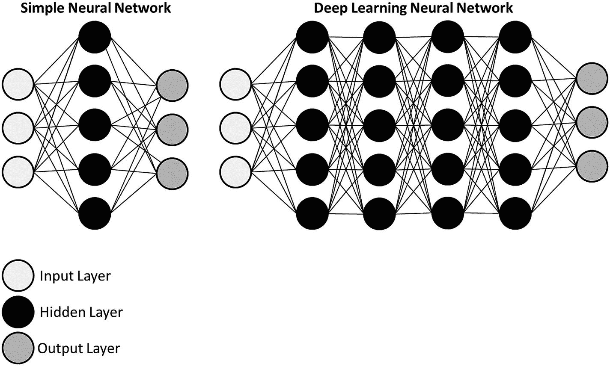

# 一、数据科学和所有其他时髦词汇的揭秘

在商业世界中，数据已经成为一件大事。你会听到各种各样的流行语被抛向左边、右边和中间。大数据、人工智能、机器学习、数据挖掘、深度学习等等。这可能会变得令人困惑，让你不知道在什么情况下什么是最好的技术。在这一章中，我们将通过简短地回顾数据科学的历史来揭开所有这些术语的神秘面纱。您将了解数据分析的历史如何催生了不同的思想流派和学科，它们现在都聚集在术语数据科学的保护伞下。

## 什么是数据科学？

2017 年，我们产生的数据超过了我们历史上 5000 年的总和。 [1](#Fn1) 数据真多。这并不奇怪。我们拥有的每台设备都会产生数据，我们与这些设备的所有交互都会产生更多的数据。

所以，你用你的智能手机拍照？你已经生成了数据。你在平板电脑上看新闻？你在生成数据。你在笔记本上听播客？你在生成数据。你去脸书更新你的状态？你已经生成了数据。

你明白了。很有可能我们做的唯一不产生数据的事情是呼吸，但考虑到所有可用的可穿戴设备，这些设备可以跟踪从心率到燃烧的卡路里等一切，即使是这样也是有争议的。 [2](#Fn2)

这些数据会发生什么变化？它必须有一些用途，否则事情不会被设置，所以我们在第一时间生成它。

目前，有些是，有些不是。事实上，一些研究发现，只有不到 0.5%的数据被分析并转化为可操作的见解。 [3](#Fn3) 不过以后还要更上一层楼。

重要的是所有的数据都可以用。我们只需要找出更好的方法来做到这一点。

这就是数据科学的用武之地。数据科学有很多定义。其中一个这样的定义是

> Data science is "unifying the concepts of statistics, data analysis, machine learning and related methods", aiming at "understanding and analyzing actual phenomena" with data. [4](#Fn4) T5】

好吧，这些是很多又大又花哨的词，可能会让人感到困惑。让我们把它归结为最简单的定义:

> Data science is to use data to do useful things.

简明扼要。这正是数据科学的意义所在。当然，我们使用的方法很重要，但这门学科的本质是它允许我们获取数据并对其进行转换，这样我们就可以用它来做有用的事情。

比如说，有人因为气短去看医生。他们正在经历胃灼热和胸痛。医生会进行基本的测试，包括测量血压，但似乎没有什么异常。

由于患者超重，医生立即认为症状是由患者的体型引起的，并建议更健康的饮食和锻炼。

三个月后，同一个病人被送进急诊室，最后因为心脏缺陷死在了手术台上。

这可能听起来像你最喜欢的医学节目中的一集，也就是说，一部小说，但它发生的频率比你想象的要高得多。事实上，在美国，5%的患者被误诊，而误诊在 2014/2015 财年使英国损失超过 1.97 亿英镑。 [5](#Fn5)

然而，由于数据科学，这种情况可以避免。对类似病例的分析表明，我们的病人表现出的症状不仅仅是由肥胖引起的，也是由一些心血管疾病引起的。

拥有能够分析数据并将其与新数据输入进行比较的系统可以帮助医生更快地识别问题，而不仅仅依靠他们自己的个人经验和知识。

因此，在许多其他应用中，数据科学可以用来拯救生命，这非常有用。

### 数据科学是多学科的

数据科学涉及多个学科，这就是为什么寻找具备必要技能的人成为数据科学家会很困难。

因此，数据科学涉及从统计和模式识别到业务分析和通信的方方面面。它既需要分析性思维，也需要创造性思维。 [6](#Fn6)

因此，数据科学包括发现哪些数据是有用的，以及管理这些数据的有效方法。它还需要确定应该如何处理数据，以及可以从大量可用数据中获得什么类型的见解。

数据科学需要编程和计算方面的知识，但也需要可视化，这样才能以每个人都能理解的方式呈现见解。

此外，商业敏锐性也是必要的，因为虽然数据科学可以应用于任何业务领域，但了解业务需要什么类型的答案以及如何呈现所述见解以便领导层可以理解它们至关重要。

### 数据科学的核心领域

数据科学有三个核心领域，即人工智能、机器学习和统计学。

人工智能就是在机器中复制人脑的功能。人工智能应该执行的主要功能是逻辑推理、自我修正和学习。虽然它有广泛的应用，但它也是一项高度复杂的技术，因为要让机器变得智能，需要大量的数据和计算能力。

机器学习是指计算机在其编程范围之外的学习和改进能力。因此，它依赖于创建能够从提供给它们的数据中学习的算法。他们还被设计用来获得洞察力，然后对他们以前没有分析过的数据做出预测。

机器学习有三种方法，即监督、非监督和强化学习，加上一些子领域(如半监督学习)。在这里，我们将只讨论监督和非监督学习，因为这是主要用于商业。

假设您想根据内容对所有照片进行排序。在监督学习中，你会给计算机提供带标签的例子。所以，你会给它一张狗的照片，并给它贴上动物的标签。然后你给它一张人的照片，并给它贴上人类的标签。然后，机器将对所有剩余的图片进行分类。

在无监督学习中，你只需给机器所有的照片，让它找出不同的特征并组织你的照片。

在强化学习中，机器基于错误和奖励进行学习。因此，机器分析它的动作和结果。强化学习的一个很好的例子是迷宫中的一只老鼠，它需要找到一片奶酪。帮助老鼠实现这一点的学习过程可以通过强化学习在机器中实现。这是最深奥的机器学习类型之一。

统计学是任何数据科学家的基本工具，因为它有助于开发和研究收集、分析、解释和呈现数据的方法。它使用的众多方法使数据科学家能够

*   设计实验并解释结果以改进产品决策
*   建立信号预测模型
*   将数据转化为洞察力
*   了解参与、转化、保留、销售线索等
*   做出明智的估计
*   用数据来讲述故事

让我们仔细看看这三者。

#### 人工智能:一点历史

1954 年，人工智能研究领域在达特茅斯学院的一个研讨会上诞生。在那里，与会者讨论了将在未来几年影响该领域的话题。

正如我们已经解释过的，人工智能的目标是创造一个“思维机器”，也就是说，一个模仿人脑功能的机器。当然，要做到这一点，需要了解人类的思维，这也是 AI 与认知科学领域密切相关的原因。

认知科学涉及研究人类思维及其过程，包括智力和行为。记忆、语言、感知、注意力、情感和推理都被研究，为了更好地理解这些能力，科学家们借鉴了其他领域，包括

*   语言学
*   心理学
*   哲学
*   神经系统科学
*   人类学
*   人工智能

人工智能在认知科学的发展中发挥了关键作用，认知心理学和人工智能之间有很大的相互影响。对人类认知的理解帮助我们提高了对如何在机器内部转移这种认知的理解。反之亦然，心灵的计算理论 [7](#Fn7) 是认知科学中的主导范式之一。根据这一理论，大脑像计算机一样工作，有过程和有限的记忆。虽然这现在被认为是过时的，但它推动了几十年的研究。

##### 人工智能梦想

这一切都始于一个宏伟的愿景。被认为是人工智能之父的麻省理工学院人工实验室主任马文·明斯基说:“人工智能是一门让机器做一些如果由人来做则需要智能的事情的科学。” [8](#Fn8) 换句话说，梦想就是创造一台智能机器。

那么，人们将如何着手去做呢？首先，我们从直觉开始，即人类独特的逻辑推理能力。

逻辑推理本质上是基于各种前提进行推理以得出具有逻辑确定性的结论的能力。比如:

> If all people are mortal and Socrates is human, then Socrates is also mortal.

或者:

> If it rains outside, and I don't bring my umbrella, I will get wet when I go out.

为了将这种逻辑推理能力转化为机器，使用了基于规则或符号的方法。这涉及到人类构建一个计算机编程的规则系统。使用这些规则，推理算法能够得出逻辑结论。

一个很好的例子是 MYCIN， [9](#Fn9) ，这是一个早期成功的基于推理算法的工作系统。它被用来诊断感染和确定引起问题的细菌类型。它从未在临床环境中使用过，但它是专家系统的一个极好的例子，也是机器学习的前身。

该系统于 20 世纪 70 年代在斯坦福大学开发，有大约 600 条规则。用户被要求提供各种问题的答案，然后程序会提供一个可能导致问题的潜在细菌的列表，按照概率从高到低排序。它还将提供对每个诊断的概率以及如何得出结论的信心。最后，它将提供推荐的疗程。

它有 69%的准确率，据称该程序比初级医生更有效，与一些专家处于同一水平。 [11](#Fn11)

该计划是通过采访大量提供专业知识和经验的专家创建的。它使用 IF(条件)THEN(结论)形式的规则。比如 IF(打喷嚏咳嗽或者头疼)THEN(流感)。

这个程序的一个限制是计算能力。整个系统大约需要 30 分钟，这在真实的临床环境中浪费了太多时间。

还提出了另一个问题，即道德和法律问题。因此，问题就出现了，谁应该为这个项目做出错误的诊断或推荐错误的治疗方法负责。

虽然它从未被使用过，但它仍然在将我们带到今天的位置上发挥了非常重要的作用，因为它是人工智能的早期成功之一，证明了什么是可能的并得到了加强。

##### 自动化规划

规划是理性行为的重要组成部分。自动计划和调度是人工智能的一个领域，它涉及创建一个能够选择和组织行动以实现特定结果的系统。

一个例子是传教士和食人族的问题， [12](#Fn12) 这是一个经典的人工智能难题。它是这样定义的:

> There are three missionaries and three cannibals on the bank of a river. They all want to cross the river. There is a boat that can accommodate two people. However, if there are more cannibals on both sides of the river than missionaries, missionaries will be eaten. How to safely transport all missionaries and cannibals across the river by boat?

这有点可怕，也可能看起来微不足道，但类似的方法可以用于日程计划。

其他类似的问题还有汉诺塔 [13](#Fn13) 和旅行推销员问题。旅行推销员问题是优化中的一个传奇基准，其目标是为推销员找到一条穿越一个国家(或一些其他地理区域)的所有城市的路径。这条路绝对不能两次穿过同一个城市，同时也要尽可能短。很容易看出这与现实生活中的车辆路径有什么关系。在图 [1-1](#Fig1) 中，你可以看到德国所有主要城市的旅行推销员示例。

图 1-1

Example of the travelling salesman problem

本质上，计算机所做的是分析每一种可能性，舍弃不符合参数的可能性，同时给出所有符合参数的选项。

##### 人工智能冬天

如果不是经历了“冬天”，人工智能可能会走得更远。人工智能冬天一词指的是人们对人工智能的兴趣减弱，因此资金有限的时期。

1967 年，马文·明斯基预言“在一代人的时间内，创造‘人工智能’的问题将得到实质性的解决。”然而，到 1982 年，他承认“人工智能问题是有史以来最困难的科学之一。” [14](#Fn14)

第一次主要的 AI 冬季开始于 1974 年，结束于 1980 年，而第二次开始于 1987 年，结束于 1993 年。还有其他较小的问题，例如

*   1966 年——机器翻译的失败
*   1970 年——联结主义的放弃
*   1971-1975 年——DARPA 对卡内基梅隆大学的语音理解研究项目的挫败感
*   1973 年——英国的人工智能研究因莱特希尔报告而大幅减少
*   1973-1974 年——DARPA 对学术人工智能研究的削减
*   1987 年 Lisp 机器市场的崩溃
*   1988 年——战略计算倡议取消了人工智能的新支出
*   1993 年—专家系统慢慢到达底部
*   20 世纪 90 年代——第五代计算机项目最初目标的悄然消失

第一个冬天在很大程度上是由三个主要因素造成的。首先是莱特希尔报告，詹姆斯·莱特希尔爵士教授在报告中总结说，其他科学可以做人工智能正在做的一切，这意味着许多最成功的人工智能算法将无法解决现实世界的问题。 [十五](#Fn15)

尽管有争议，该报告仍然导致英国人工智能研究的完全关闭，只有几所大学继续研究。结果是整个欧洲都削减了这项研究的经费。 [16](#Fn16)

1969 年，美国通过曼斯菲尔德修正案，要求 DARPA 资助有明确使命的研究，而不是没有明确方向的基础项目。从本质上讲，研究人员必须证明他们的项目能够迅速产生对军方有用的技术。

莱特希尔的报告被用来证明人工智能研究在可预见的未来不太可能提供任何有用的东西，与此相呼应，DARPA 停止了对这类研究的资助。到 1974 年，人工智能的资金几乎不可能找到。 [17](#Fn17)

另一个问题是卡内基梅隆大学的言语理解研究项目。DARPA 想要一个可以对飞行员的口头命令做出反应的系统，尽管该团队开发了一个可以理解口语的系统，但单词必须按照一定的顺序说出。

DARPA 觉得他们被误导了，于是在 1974 年取消了拨款。有趣的是，到 2001 年，语音识别市场已经达到 40 亿美元，并且使用了卡耐基梅隆大学团队开发的技术。 [19](#Fn19)

1980 年，专家系统的商业成功重新点燃了人们对人工智能领域的兴趣。到 1985 年，超过 10 亿美元被用于人工智能和一个支持该领域发展的产业。被称为 Lisp 机器的专用计算机是为了更好地处理人工智能首选的编程语言而建造的。

不幸的是，Lisp 机器市场崩溃了，因为像 Sun Microsystems 这样的公司开发了更有效的替代品。这些通用工作站有更好的性能，这是 Lisp 机器无法比拟的。这就导致了第二次 AI 寒冬。

##### 我们从人工智能研究中学到了什么

尽管存在这些问题，对人工智能的研究发现了许多有益的东西。例如，如果不是 AI 研究，我们就不会有符合逻辑规则的算法。

这种算法的早期例子是 Prolog 语言。作为最早的基于逻辑的编程语言之一，即使在今天，它仍然是最受欢迎的语言之一。它已被用于证明定理、专家系统、类型推理和自动规划。

这是人工智能帮助我们的另一个领域。否则，用于驱动制造业自动化机器人等事物的自动化规划和调度就不会存在。专家系统或知识表示也不会。

当然，从那时起，所有这些事情都发生了显著的演变，我们越来越接近创造真正的人工智能，但在我们拥有真正的智能机器之前，我们还有很长的路要走。

另一个有趣的方面是，认知科学借鉴人工智能的程度与反过来是一样的。开发能像人一样思考的智能机器的愿望需要更好地理解人类的思维。这导致了对记忆、感知等更多方面的研究。

#### 下一步:进入机器学习

作为一个术语，机器学习是由阿瑟·塞缪尔在 1959 年创造的，他是计算机游戏和人工智能的先驱，当时他在 IBM 工作。 [二十](#Fn20)

他是这样定义的:

> Machine learning gives the computer the ability to learn without explicit programming.

机器学习和人工智能之间开发的基于逻辑和知识的方法引起的裂痕。到了 20 世纪 80 年代，专家系统主导了人工智能，统计学不再令人感兴趣。

机器学习随后被重组为一个独立的领域，并在 20 世纪 90 年代开始受到重视。机器学习不再专注于创造人工智能，而是转变了方法，专注于解决更多的实际问题。因此，它没有采用人工智能中如此普遍的符号方法，而是开始采用来自统计学和概率论的模型。

虽然机器学习作为一个概念是人工智能的一个子领域，但它的方法实际上与迄今为止所做的研究相反。 [21](#Fn21)

因此，“经典人工智能”或“传统的人工智能”采取了基于规则的、自上而下的方法。本质上，它意味着给计算机规则，让它们必须遵循这些规则才能达到预期的结果。这种方法的问题是它需要大量的人力投入。

系统的设计者必须能够预测每一种可能性，并为其创建一套规则。此外，不确定性不容易处理，因为机器以如果/那么的模式思考。

不幸的是，世界并不总是如此清晰。在现实世界中，如果(事件 A)发生了，那么(行动 B)并不总是解决方案。例如，如果(晴天)并不总是导致然后(穿单衣)。外面可能是冬天，你可能需要一件厚外套。此外，系统只知道提供这个答案，因为它已经被告知要做什么。

另一方面，机器学习采用自下而上、数据驱动的方法。因此，机器学习不是用计算机必须遵循的规则给计算机编程，而是用数据来教计算机做什么。

除了提供数据之外，很少涉及人工输入。这使得机器能够更自然地处理不确定性，使其成为一种更有效的方法，因为这个世界从根本上讲是概率性的，而不是确定性的。

用我们的雨类比，机器学习会像这样工作。这个系统被输入大量的数据，它分析当有某种类型的天气时会发生什么。所以，当天气晴朗时，它看到人们穿着轻便和厚重的衣服出门。当它发现温度也很重要时，它会学到更多。本质上，它识别模式:太阳+寒冷的温度=更温暖的衣服。机器通过分析和学习给它的数据自己完成这项工作。

有一段时间，机器学习的问题是它需要大量数据才能有效工作。令人欣慰的是，随着互联网和廉价存储的发展等技术进步，数据驱动的方法变得更加流行。它不仅更有效，而且从经济和技术角度来看也更可行。

##### 机器学习的问题是

当然，机器学习也有它的缺点，就像其他任何事情一样。首先，机器学习无法直接处理逻辑规则，我们如何将机器学习与推理融合是一个悬而未决的问题。

让我们以重力为例。机器学习可以得出这样的结论:如果你放手，物体下落的概率是 0.99。然而，这是基于过去的数据，它不能做出逻辑上的跳跃，即如果你因为重力而放开它，“任何”物体都会下落。它可以根据过去的事件给出概率，但不能得出结论:如果(重力)那么(物体坠落)。这种逻辑上的飞跃甚至是婴儿都可以做到的，这表明尽管机器学习可能非常强大，但它远非人工智能发明者所设想的那样智能。

另一个问题是，机器学习并不完全透明。大多数算法是一个“黑箱”，输入从一边进入，结果从另一边排出。然而，我们看不到盒子里面发生了什么。想想谷歌著名的搜索算法。我们知道我们输入一个搜索字符串，我们得到“最”相关的结果，但我们不知道这是如何发生的。

可解释的机器学习现在是一个非常活跃的研究领域。 [22](#Fn22)

##### 深度学习

深度学习是研究深度神经网络的研究领域，深度神经网络是具有多个层的神经网络。一个神经网络会有一到两层，而深度神经网络会有更多层(图 [1-2](#Fig2) )。

图 1-2

Example of a regular neural network vs. a deep neural network

被视为“深度学习教父”的英国认知心理学家和计算机科学家杰弗里·辛顿(Geoffrey Hinton)发现，他对神经网络的研究不可能发表，因此他必须发明一个“更酷”的新术语。 [23](#Fn23)

神经网络由神经元和人脑中连接它们的路径组成。由于大脑是人类已知的最强大的计算机器，试图模仿它的架构是有意义的，这导致了人工神经网络的创建。

神经网络传统上由三层组成:输入层、中间层和输出层。中间层为神经网络提供了执行非线性计算的能力，并将它们转变为强大的学习机器。

深度学习背后的想法已经存在了几十年。然而，人们认为增加更多的层并没有真正的用处。此外，很难训练这些网络。

深度学习利用人工神经网络，使机器能够更快、更准确、更大规模地学习。因此，它被用来帮助开发许多以前无法解决的问题的解决方案，如语音识别、计算机视觉和自然语言处理。

例如，像 Siri 或 Cortana 这样的应用程序能够理解你想要的东西，这要归功于深度学习。例如，图像识别可以帮助你找到你在现实世界中看到的家具。只需给作品拍张照片，应用程序就会帮你在网上找到。

得益于深度学习，机器还可以识别照片中的不同主题——比如区分人、马、猫和狗。它还可以用来自动给照片上色，最近还可以用来自动去除照片的背景，这是许多设计师非常感激的。

它也被用来自动生成文本。换句话说，由于深度学习，你的计算机可以听你说什么，并把你的话变成文本。

基本上，深度学习可以做很多非常酷的事情！

但是，它是如何做到这一点的，为什么它的效果如此之好？深度神经网络的多层允许它提取分级特征。我们的视觉系统是分层组织的。我们的大脑在提取形状(如正方形和圆形)之前，先提取简单的斑点和边缘，然后转移到面部特征或其他更高级的概念。深度神经网络本质上模仿了这种功能。如果我们看看深度神经网络的中间层正在进行的处理，那么我们可以看到它们提取了一个层次的特征。这就是为什么深度神经网络在计算机视觉和语言应用中如此成功。这些领域本质上受等级特征支配。conv net Playground[25](#Fn25)有一个模型资源管理器，可以让你看到 Inception(一个著名的深度神经网络)的不同层如何随着网络的深入而创建越来越复杂的图像表示。

然而，深度神经网络并不是万能的。 [26 因此，例如，如果您有一个 1000 行和 10 个变量的数据集，您最好使用一个更简单的模型(例如，线性回归)，因为该模型训练速度更快，并且不太可能过度拟合。](#Fn26)

过拟合 [27](#Fn27) 是所有机器学习算法的克星，指的是现实世界中的表现比训练时差很多的情况。更复杂的模型可能会遇到这个问题。这就是为什么深度神经网络需要过多的调整和测试来确保它们正常工作。

#### 统计数字

数据科学的另一个核心领域是统计学，它是数学的一个分支，始于 18 世纪左右，是系统分析数据的第一次尝试。它产生了所有现代数据分析的基石，包括汇总统计、回归和分类、重要测试、预测等等。

##### 是什么让统计独一无二？

统计学通常处理较小的样本，这在很大程度上是由于历史原因。如今，互联网使得收集大量数据成为可能，但在过去，数据通常必须亲自收集，这就是样本量如此之小的原因。

然后将结果外推至整个人群，误差幅度为。此外，考虑到它是在 17 世纪开发的，这意味着一切都必须手工计算。解决一个模型需要几天或几周的时间。

统计学对模型假设和开发也非常严格，因为它植根于数学。在这个意义上，它几乎就像经典的人工智能。在部分机器学习建立在贝叶斯统计基础上之后，这种差距确实缩小了。

但是，心态还是不一样。在机器学习中，一切都是为了完成任务，并在以后提出问题。然而，在统计学中，在做任何事情之前，假设必须被证实和验证。

虽然统计提供了更高程度的透明度和可解释性，但机器学习已经带来了令人难以置信的性能。这种惊人的性能使我们能够完成以前认为不可能的任务！

当然，人们必须记住，机器学习是计算机时代的产物，这意味着更快的计算。一个模型不需要几天的工作，只需要几分钟——如果可能的话——而且可以在一天内尝试多种方法。

##### 战斗:统计学与机器学习

一些统计学家非常反对机器学习。 [29](#Fn29) 宗教上的反对。有时候，这真的有点令人担忧。他们的问题是机器学习缺乏透明度，也缺乏理论。

然而，在现实中，统计和机器学习是一个硬币的两面。此外，它们是数据科学家工具箱中的工具，可以根据情况需要加以应用。因此，如果你在寻找可解释性，那么统计学是你的最佳选择，而机器学习将更好地提供预测能力。

### 数据科学的子领域

在发展上述数据科学核心领域的同时，其他领域也在发展。这些都在某种程度上与数据分析、人工智能等相关。这些领域包括诺伯特·维纳在 1947 年开发的控制论、1943 年麦卡洛克和皮茨开发的人工神经网络、1990 年开发的计算智能、1959 年开发的机器学习以及 1990 年 Gregory Piatetsky-Shapiro 开发的数据库中的数据挖掘和知识发现。 [三十](#Fn30)

所有这些术语的问题在于，并非每个人都以相同的方式理解它们或它们之间的关系。在某些情况下，他们之间存在概念上的差异，但有时这取决于谈论他们的人是谁以及他们的研究背景。还有营销的问题，它也可以给一个特定的子领域一个不同的旋转。

例如，一些人认为人工智能是核心领域，自然语言处理、专家系统、神经网络、模糊逻辑和机器人技术是卫星领域。其他人认为人工智能是计算机科学的一部分，而管理知识、机器学习和大脑逆向工程对人工智能来说是必不可少的。还有一些人认为机器学习、深度学习和表征学习包含在人工智能中。

换句话说，人们对所有这些技术术语的含义以及它们之间的关系有不同的解释，这可能会使其非常混乱。为了进一步证明我的观点，以下是在第 11 届英国计算智能研讨会上对计算智能的定义:

> Intelligence (CI) is a branch of artificial intelligence, which focuses on heuristic algorithms, such as fuzzy system, neural network and evolutionary computation. It is usually contrasted with "traditional", "symbolic" or "old artificial intelligence (GOFAI)". IEEE Institute of Computing Intelligence uses the slogan of "simulating nature to solve problems" to describe computing intelligence, although simulating nature is not an essential element.

> Besides the three pillars of CI (fuzzy system, neural network and evolutionary computation), computational intelligence also includes elements of learning, adaptation, heuristic and meta-heuristic optimization, and any hybrid method using one or more of these technologies. Recently, artificial immune system, swarm intelligence, chaotic system and other emerging fields have been added to the scope of computational intelligence technology. The term "soft computing" is sometimes used almost interchangeably with computational intelligence. [31](#Fn31)

现在，让我们来看一下数据库中知识发现的定义:

> Knowledge Discovery in Databases (KDD for short) refers to the extensive process of discovering knowledge in data, emphasizing the "advanced" application of specific data mining methods. Researchers of machine learning, pattern recognition, database, statistics, artificial intelligence, knowledge acquisition of expert system and data visualization are interested in it. The unified goal of KDD process is to extract knowledge from the data of large databases. [32](#Fn32) T5】

粗体术语表示所有字段和子字段之间的重叠，直到一些核心字段被认为是子字段的子字段。是的，它令人困惑，这正是问题所在。

所有这些领域都是跨学科的，因为它们互相借用工具，尽管它们有时可能采取不同的方法，但仍然有太多的重叠，这是令人难以置信的问题。甚至让研究这些领域的人很困惑。

以 Christopher M. Bishop 的《模式识别与机器学习》为例， [33](#Fn33) 这是机器学习最重要的教科书之一。每个人都读过它，然而，人们不得不怀疑模式识别和机器学习之间的区别。然而，一旦你进入它，你会意识到它进入了统计理论，并且，一般来说，只是使事情变得更加复杂。

这还不是事情的结束。还有许多其他相关的流行词汇和领域，如

*   自然语言处理，这是机器学习的一个子领域，只专注于语言——通常它依赖于文本，但也可以包括语音。
*   推荐系统，这是一个致力于研究像亚马逊和网飞使用的推荐引擎的领域。
*   预测分析，这不是一个子学科，而是一个术语，主要指预测模型的开发，即可以预测未来的算法。后者可以使用机器学习或统计学来开发。

换句话说，这真的非常非常令人困惑，这就是“数据科学”这个术语的由来。

## 数据科学:所需的技能

数据科学使解释一切变得容易得多，除非你想花半个小时解释所有的领域和子领域。即使这样，大多数人也不会理解，尤其是如果他们不在相关领域的话。

说一个人是用数据做事的数据科学家要简单得多。这当然比长篇大论地谈论机器学习、数据挖掘、统计学等等要好得多。

然而，即使是数据科学也不是一个绝对可靠的术语，可能会引起一些混乱。有些人可能认为数据工程、数据库、大数据和数据分析师几乎是一回事。但事实并非如此。那么，有什么区别呢？好吧，让我们来看看这些术语是什么意思。

*   数据科学家数据科学家是与数据打交道的人。然而，这个术语最近已经扩展到指分析数据但也在相关领域受过某种形式的高级培训的人，如机器学习博士或统计学硕士。
*   数据工程师数据工程师是设计、构建和管理大数据信息基础架构的人。这是开发帮助分析和处理数据的架构的人。打个烹饪的比方，数据科学家是厨师，而数据工程师包括所有的工具制造商(刀、锅、平底锅、炉子等等。)和配料供应商，他们为厨师提供制作一道菜所需的一切。
*   大数据大数据是一个时髦的词，因为它只是指如此庞大和复杂的大规模数据集；传统的数据处理应用软件根本无法处理它们。它涉及到 NoSQL 数据库、云计算、Hadoop 等等。

表 [1-1](#Tab1) 显示了不同类别的数据专业人员的重要技能。

表 1-1

Important skills for different categories of data professionals, ranked out of 3.

<colgroup><col align="left"> <col align="left"> <col align="left"> <col align="left"> <col align="left"></colgroup> 
|   | 数据分析师 | 机器学习工程师 | 数据工程师 | 数据科学家 |
| :-- | :-- | :-- | :-- | :-- |
| 程序设计工具 | 3/3 | 1/3 | 3/3 | 3/3 |
| 数据直觉 | 3/3 | 3/3 | 1/3 | 3/3 |
| 数据可视化 | 3/3 | 2/3 | 1/3 | 3/3 |
| 统计数字 | 2/3 | 2/3 | 0/3 | 3/3 |
| 机器学习 | 0/3 | 3/3 | 0/3 | 3/3 |
| 软件工程 | 0/3 | 2/3 | 3/3 | 2/3 |
| 数据争论 | 0/3 | 3/3 | 3/3 | 3/3 |
| 数学 | 0/3 | 3/3 | 0/3 | 2/3 |
| 数据库 | 0/3 | 1/3 | 3/3 | 2/3 |

### 数据科学家需要知道什么？

我们将在本书后面更深入地研究数据科学家，但这里有一个快速概述。

虽然数据科学家可能来自不同的背景，但您通常会发现三种类型。

首先是统计学家，他们中的一些人不喜欢被称为数据科学家。

然后是有计算机科学背景的人，他们研究机器学习，在这个领域有硕士或博士学位。

最后，有些人来自其他学科，比如物理学；您学会了使用数据科学工具，并迁移到了这个领域。

The Question of General Artificial Intelligence

我们这个时代最热门的趋势话题之一是“通用人工智能”这个术语指的是能够像我们一样聪明的人工智能的创造。相信这在可预见的未来可以实现的人也相信“奇点”的概念。物理学中的奇点被定义为物理模型崩溃的时刻(例如，存在于黑洞中心的情况)。技术奇点是这样一种情况，我们所知道的关于社会和技术的一切都将崩溃，一些新的和不可预测的东西将出现。

这是基于下面一种推理。虽然我们人类拥有智力，但我们的认知能力有限。我们的大脑无法容纳无限量的信息。我们可以快速思考，但不会比计算机计算更快。此外，我们可能会累，我们需要睡觉。

一个普通的人工智能会有我们自己的思考能力，但没有我们的局限性。因此，如果一台机器拥有天才数学家的智力，那么理论上，它可以在几秒钟内提出大量的数学定理。它可以发展能力，做出人类要花好几辈子才能实现的发明。

有些人，如埃隆·马斯克或已故的斯蒂芬·霍金，曾将人工智能描述为对人类的威胁。另一方面，其他人更看好通用人工智能改善生活的潜力。

不管哪一方是对的，现在所有专家都同意一些事情:

1.  我们没有一条通向 AI 将军的清晰道路。没有一种方法或技术能保证达到这一结果。
2.  基于目前的技术进步，我们很可能会在我们的世纪内看到通用人工智能的实现。
3.  虽然 AI 将军的结果可能不像一些人预期的那样引人注目，但每个人都同意，在多个领域将出现巨大的破坏:从健康研究到军事。

我们绝对生活在有趣的时代！

Footnotes [1](#Fn1_source)

David Sønstebø，"IOTA Data Marketplace"，IOTA，2017 年 11 月 28 日， [`https://blog.iota.org/iota-data-marketplace-cb6be463ac7f`](https://blog.iota.org/iota-data-marketplace-cb6be463ac7f)

  [2](#Fn2_source)

[T2`www.wired.co.uk/article/hospital-prescribing-tech`](http://www.wired.co.uk/article/hospital-prescribing-tech)

  [3](#Fn3_source)

[T2`www.technologyreview.com/s/514346/the-data-made-me-do-it/`](http://www.technologyreview.com/s/514346/the-data-made-me-do-it/)

  [4](#Fn4_source)

Chikio Hayashi，[“什么是数据科学？基本概念和一个启发性的例子，《数据科学、分类和相关方法》中的](https://www.springer.com/book/9784431702085)，eds。Chikio Hayashi，Keiji Yajima，Hans-Hermann Bock，Noboru Ohsumi，Yutaka Tanaka 和 Yasumasa Baba(日本东京:Springer-Verlag，1998 年)，第 40-51 页。

  [5](#Fn5_source)

Lena Sun，“大多数美国人一生中至少会得到一次错误或晚期诊断”，《华盛顿邮报》，2015 年 9 月 22 日，[`www.washingtonpost.com/news/to-your-health/wp/2015/09/22/most-americans-who-go-to-the-doctor-will-get-a-wrong-or-late-diagnosis-at-least-once-in-their-lives-study-says/`](https://www.washingtonpost.com/news/to-your-health/wp/2015/09/22/most-americans-who-go-to-the-doctor-will-get-a-wrong-or-late-diagnosis-at-least-once-in-their-lives-study-says/)；“2014/15 年 NHS 医院的顶级误诊情况”，格雷森， [`www.graysons.co.uk/advice/the-top-misdiagnosed-conditions-in-nhs-hospitals/`](http://www.graysons.co.uk/advice/the-top-misdiagnosed-conditions-in-nhs-hospitals/)

  [6](#Fn6_source)

看看布伦丹·蒂尔尼的这张信息图: [`https://oralytics.com/2012/06/13/data-science-is-multidisciplinary/`](https://oralytics.com/2012/06/13/data-science-is-multidisciplinary/)

  [7](#Fn7_source)

[T2`https://plato.stanford.edu/entries/computational-mind/`](https://plato.stanford.edu/entries/computational-mind/)

  [8](#Fn8_source)

《人工智能的反思》(埃克塞特，英国:智力图书，1996 年)。

  [9](#Fn9_source)

一个很好的老参考约翰·麦卡锡霉素可以在这里找到: [`www-formal.stanford.edu/jmc/someneed/someneed.html`](http://www-formal.stanford.edu/jmc/someneed/someneed.html)

  [10](#Fn10_source)

布鲁斯·G·布坎南和爱德华·H·肖特利弗,《基于规则的专家系统》(雷丁，麻州:艾迪生-卫斯理出版社，1985 年)。

  [11](#Fn11_source)

余，“抗菌药物的计算机选择”，《美国医学杂志》242 卷，第 12 期(1979): 1279， [`https://jamanetwork.com/journals/jama/article-abstract/366606`](https://jamanetwork.com/journals/jama/article-abstract/366606)

  [12](#Fn12_source)

你可以在这里玩一个版本的游戏: [`www.novelgames.com/en/missionaries/`](http://www.novelgames.com/en/missionaries/)

  [13](#Fn13_source)

[T2`www.mathsisfun.com/games/towerofhanoi.html`](http://www.mathsisfun.com/games/towerofhanoi.html)

  [14](#Fn14_source)

弗雷德里克·e·艾伦，“人工智能的神话|美国遗产”，Americanheritage.Com，2001 年最后修改， [`www.americanheritage.com/content/myth-artificial-intelligence`](http://www.americanheritage.com/content/myth-artificial-intelligence)

  [15](#Fn15_source)

莱特希尔教授，詹姆斯爵士(1973)。《人工智能:概述》人工智能:论文研讨会。科学研究委员会。

  [16](#Fn16_source)

丹尼尔·克勒维耶，《人工智能探索的混乱历史》(纽约，纽约:基础图书，1993)；拉塞尔&诺维格 2003；吉姆·豪，“信息学院:爱丁堡人工智能的历史”。编辑 Ac.Uk，2007 年最后修改， [`www.inf.ed.ac.uk/about/AIhistory.html`](http://www.inf.ed.ac.uk/about/AIhistory.html)

  [17](#Fn17_source)

国家研究委员会工作人员，《资助一场革命》(华盛顿:国家科学院出版社，1999 年)。

  [18](#Fn18_source)

克勒维耶 1993；麦科达克 2004；国家研究委员会 1999 年。

  [19](#Fn19_source)

国家研究委员会 1999 年。

  [20](#Fn20_source)

Arthur L. Samuel，“使用跳棋游戏进行机器学习的一些研究”，《IBM 研发杂志》第 44 期，第 12 期(1959 年):206-226， [`http://citeseerx.ist.psu.edu/viewdoc/download?doi=10.1.1.368.2254&rep=rep1&type=pdf`](http://citeseerx.ist.psu.edu/viewdoc/download%3Fdoi%3D10.1.1.368.2254%26rep%3Drep1%26type%3Dpdf)

  [21](#Fn21_source)

[T2`http://thedatascientist.com/machine-learning-vs-ai/`](http://thedatascientist.com/machine-learning-vs-ai/)

  [22](#Fn22_source)

[T2`http://thedatascientist.com/interpretable-machine-learning`](http://thedatascientist.com/interpretable-machine-learning)

  [23](#Fn23_source)

克里斯·索伦森，“U Of T 的深度学习'教父'如何重新想象 AI”，《多伦多大学新闻》，2017 年 11 月 2 日，[`www.utoronto.ca/news/how-u-t-s-godfather-deep-learning-reimagining-ai`](http://www.utoronto.ca/news/how-u-t-s-godfather-deep-learning-reimagining-ai)；阿德里安·李(Adrian Lee)，“深度学习的‘教父’杰弗里·辛顿(Geoffrey Hinton)论 AlphaGo”，麦克林，2016 年 3 月 18 日， [`www.macleans.ca/society/science/the-meaning-of-alphago-the-ai-program-that-beat-a-go-champ/`](http://www.macleans.ca/society/science/the-meaning-of-alphago-the-ai-program-that-beat-a-go-champ/)

  [24](#Fn24_source)

[T2`http://thedatascientist.com/what-deep-learning-is-and-isnt/`](http://thedatascientist.com/what-deep-learning-is-and-isnt/)

  [25](#Fn25_source)

[T2`https://convnetplayground.fastforwardlabs.com/#/models`](https://convnetplayground.fastforwardlabs.com/%23/models)

  [26](#Fn26_source)

詹姆斯·萨默斯，“人工智能的进步似乎正在加速，但这就是为什么它可能会停滞不前，”麻省理工科技评论，2017 年 9 月 29 日， [`www.technologyreview.com/s/608911/is-ai-riding-a-one-trick-pony/`](http://www.technologyreview.com/s/608911/is-ai-riding-a-one-trick-pony/)

  [27](#Fn27_source)

[T2`www.quora.com/What-is-an-intuitive-explanation-of-over-fitting-particularly-with-a-small-sample-set-What-are-you-essentially-doing-by-over-fitting-How-does-the-over-promise-of-a-high-R%C2%B2-low-standard-error-occur`](http://www.quora.com/What-is-an-intuitive-explanation-of-over-fitting-particularly-with-a-small-sample-set-What-are-you-essentially-doing-by-over-fitting-How-does-the-over-promise-of-a-high-R%C2%B2-low-standard-error-occur)

  [28](#Fn28_source)

Walter F. Willcox，“统计学的创始人”，《国际统计研究所杂志/国际统计研究所评论》第 5 期，第 4 期(1938 年):321 页，`www.jstor.org/stable/1400906`

  [29](#Fn29_source)

[T2`http://thedatascientist.com/statistics-vs-machine-learning-two-worlds/`](http://thedatascientist.com/statistics-vs-machine-learning-two-worlds/)

  [30](#Fn30_source)

flo·康威和吉姆·西格曼，《信息时代的黑暗英雄》(纽约:基础图书，2006)；沃伦·s·麦卡洛克和沃尔特·皮茨，“神经活动中内在思想的逻辑演算”，《数学生物物理学通报》5，第 4 期(1943): 115-133，[`www.cse.chalmers.se/~coquand/AUTOMATA/mcp.pdf`](http://www.cse.chalmers.se/%7Ecoquand/AUTOMATA/mcp.pdf)；Russell & Norvig 2003，第 25–26 页；塞缪尔 1959；数据库中的知识发现:进展报告，《知识工程评论》9，第 01 期(1994): 57。

  [31](#Fn31_source)

“UKCI 2011—简介:什么是计算智能”， [`http://ukci.cs.manchester.ac.uk/intro.html`](http://ukci.cs.manchester.ac.uk/intro.html)

  [32](#Fn32_source)

大学 DBD，“KDD 进程/概述”， [`www2.cs.uregina.ca/~dbd/cs831/notes/kdd/1_kdd.html`](http://www2.cs.uregina.ca/%7Edbd/cs831/notes/kdd/1_kdd.html)

  [33](#Fn33_source)

Christopher M. Bishop，模式识别和机器学习(纽约，斯普林格)。