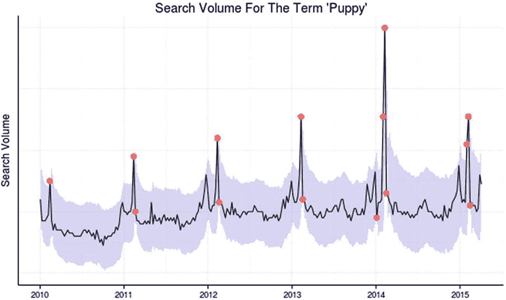
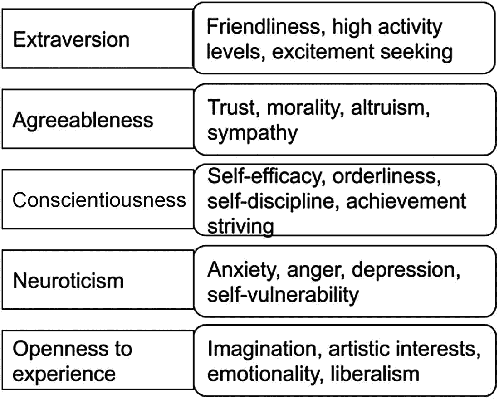

# 7.机器学习简介

不同的研究人员已经以多种方式定义了机器学习。以下是该领域一些最杰出的研究人员的定义:

> Machine learning is to program a computer to use sample data or past experience to optimize performance standards. —Ethem Alpaydin [1](#Fn1)

> The goal of machine learning is to develop a method that can automatically detect patterns in data, and then use the discovered patterns to predict future data or other interesting results. —Kevin p . Murphy [2](#Fn2)

> The field of pattern recognition involves automatically discovering rules in data by using computer algorithms, and using these rules to take action. —Christopher M. Bishop [3](#Fn3)

因此，虽然这些定义略有不同，但在某种程度上，它们涉及到可以通过识别模式或使用其他方法从经验和数据中学习的算法。然后，他们利用所学采取行动。

让我们看一个简单的例子来更好地理解机器学习的工作原理。在图 [7-1](#Fig1) 中，我向你展示了一个由猫和狗的图像组成的虚构数据集。

图 7-1

Classification example.

如果我问你哪些图像描绘了狗，哪些描绘了猫，这是非常容易做到的。但是它是如何发生的呢？

首先，你的大脑已经接触到了大量的猫和狗的图像，但也有现实生活中那些动物的例子。通过来自家庭、学校和电视等来源的无数轮反馈，你已经训练自己能够区分这两种动物和其他动物。

然而，整个过程并不像看起来那么简单。你的大脑已经通过成千上万年的进化得到优化，可以很容易地做出这些联想。即使你对猫和狗一无所知，你的大脑也会很快发现这两个实体看起来像不同的动物。你的大脑可以非常迅速地将这些图像聚合起来，并且它立即理解到，尽管它们是不同的，但它们都指的是同一个物种。

然而，对于机器来说，这要困难得多，这就是为什么机器学习如此重要，因为它是关于模仿这个过程并在机器中复制它。

## 机器学习的主要优势

从数据中学习对人脑来说很容易，但对机器来说很难，因为这需要正确的算法和大量数据来实现。

然而，对机器来说容易的是实现和自动化。一旦你有了算法，机器很容易通过数千甚至数百万张图像而不会感到疲劳，这是人脑不可能做到的。

这意味着你可以用超人的能力创造出非常强大的东西，即使我们谈论的是一个狭窄的应用领域，比如图像分类。这正是机器学习和大数据如此强大的结合。

## 机器学习的类型

现在，我们将快速浏览一下机器学习的不同领域(表 [7-1](#Tab1) )。机器学习的主要领域是监督学习和非监督学习。强化学习已经取得了进展，相关领域如推荐系统也可以与机器学习相联系，但它们更适合，不在本书的范围内。

表 7-1

Types of machine learning

<colgroup><col align="left"> <col align="left"></colgroup> 
| 名字 | 使用 |
| :-- | :-- |
| 监督学习 | 使用模型 M 从输入 x 预测目标变量 Y。 |
| 无监督学习 | 在变量 X 中寻找模式(聚类是最常见的例子)。 |
| 强化学习 | 教代理如何优化环境的奖励功能。例如，视频游戏 AI 可以采取 10 种不同的动作，这些动作需要作为对环境的响应来完成，以便最大化地达到目标(例如，最大化得分或击败人类玩家)。 |
| 主动学习 | 人类主动反馈的监督学习。 |
| 半监督学习 | 监督学习，其中一些例子是未标记的。例如，可以通过半监督学习技术来分析包含 10000 幅图像的数据集，其中 1000 幅图像没有标签。 |
| 推荐系统 | 找到向用户提供的用户可能喜欢的一组项目(例如，要看的电影、要购买的产品、要听的歌曲)。与监督学习密切相关。 |

### 监督学习

监督学习可以分为分类和回归，两者非常相似。在监督学习中，有某种形式的算法监督。我们为算法提供了一个原始数据集，但我们也为它提供了一个目标。后者可以是单个变量，也可以是多个变量。

然后，算法试图理解如何匹配输入和输出。例如，您向算法提供客户数据，然后它尝试确定某人是否会购买。

主管监督算法在做什么。每次算法出错，主管都会试图纠正。基本上就像算法在老师的指导下学习一样。

### 无监督学习

无监督学习，在机器学习的背景下，通常指的是聚类。在这种情况下，我们为算法提供原始数据，但不是提供目标，而是允许算法本质上做自己的事情，并在提供的数据中识别模式。它试图找到任何看起来有意义的规律，但不涉及监督。

这种类型的学习是一个非常困难的问题，因为它是不明确的，并且通常在流水线的最后阶段几乎总是需要人来解释。例如，算法可能会识别出与您正在尝试做的事情无关的模式，这就是为什么您需要深入研究结果并尝试更好地定义它们。

另一方面，监督学习更容易一些，因为你可以运行一个算法，你可以立即确定它是如何工作的。例如，您可以分析客户数据，并以 80%的准确率预测保留率。这使得监督学习成为机器学习家族中最受欢迎的领域之一。

值得注意的是，我们使用的一些术语，如分类、回归和聚类，在统计学和机器学习中也有使用。然而，即使术语指的是几乎相同的东西，仍然存在一些差异。

在统计学中，可解释性是重要的，而在机器学习中，可解释性是无关紧要的。同样，在机器学习中，我们对算法的预测性能感兴趣，而在统计学中这很重要。

当比较从统计到机器学习的术语时，术语可能看起来有点混乱，因为有一些模型，如逻辑回归模型，是分类模型，并在机器学习的上下文中被视为分类模型。这些差异主要是由于这些领域的不同历史造成的，所以如果你听到不同背景的人以稍微不同的方式使用这些术语，不要感到困惑。

### 近距离观察监督学习

监督学习分为分类和回归。两者的区别很简单。在分类中，我们试图确定某样东西是否属于某个特定的类别，而在回归中，我们试图预测一个实数。

分类模型的一个简单例子是我们试图确定一封电子邮件是否是垃圾邮件。这是每一本机器学习入门教材中都有的任务。另一个受欢迎的任务是图像识别或物体识别，例如“这是动物的图像吗？”或者“这个图像包含一个人吗？”或者“你能在这张照片的什么地方找到人脸？”。

分类也可以是关于其他的东西。确定股票是上涨还是下跌就是这样一个应用，它通常被称为二元分类，因为有两个类别——上涨或下跌。另一个应用是确定是否有人会点击广告，或者温度是否会上升到 0 度以上。

在一些问题中，你也可以有多个类别。例如，如果你想预测选举，在大多数情况下，你有两个以上的选举政党。在这种情况下，您可能有四个或五个类别，每个类别代表参加选举的一个政党。

另一方面，回归试图预测一个实数。因此，我们不去问股票的价格会上涨还是下跌，而是试图确定股票的价格在两周内会是多少。或者，如果我们试图确定客户对某一特定产品的需求，我们可以尝试计算出 5 天后的需求情况。也许我们不是试图了解是否有人会点击广告，而是想知道有多少人会点击广告——这可能是一个相关的问题，但仍然是一个不同的问题。

温度也是如此。对气温是否会上升的模糊认识可能不足以满足你的需求，所以你可能会试图确定 3 周后的确切气温。

这两类问题——分类和回归——可以在许多领域和许多不同的环境中找到。

需要注意的是，同样的问题可以用不同的方法解决。假设我们为一家对冲基金工作，我们想预测股票价格，这样我们就可以获得可观的利润。

这个问题可以通过使用统计预测、机器学习回归，甚至分类来解决，后者试图确定价格的走向，即上涨或下跌。

不过，每种方法的性能上限(或者说你能获得的最佳性能)会有所不同。这可能会对你的策略产生不同的影响，这取决于你想要达到的目标。

例如，您可能首先尝试使用分类模型来预测股票价格。但是你意识到你只会知道价格是上涨还是下跌。这不太适合直接交易，所以你可以考虑点差交易。然而，你可能会决定采用稍微困难一点的回归模型，因为增加的利润会让你觉得值得。

关键是要明白，一个问题往往不仅仅是一个单一的问题，而是你的主要问题中的一系列其他问题。把它想象成一个乐高模型。每个模型都是一个整体——一座城堡、一架直升机、一艘宇宙飞船——但它是由独立的积木搭建而成的。在这种情况下，问题是由子问题或块组成的城堡。

尝试多种方法来确定哪种方法最能满足您的需求也是值得的。这就像一个多模型的乐高玩具。你可以用不同的方式使用相同的砖块来达到你想要的结果。

除此之外，与乐高套装不同，你没有说明书，甚至没有鼓舞人心的图片来帮助你的旅程——你必须不断测试不同的组装方法，直到你最终得到你需要的东西。

然而，如果你身边有一个有创造力的数据科学家来帮助你，这就像手头有那些乐高说明和图片一样，让生活变得容易多了。

明智地选择战斗也很重要。如果您发现回归模型会产生更好的性能，即使它更难实现并且不是您最初的选择，转换它仍然是一个好主意，以确保更好的结果。

### 对无监督学习的更好理解

无监督学习是在没有任何指导的情况下从数据中学习模式。主要应用是聚类，这是一种自动创建组的方式，如图 [7-1](#Fig1) 中的图像。

因此，你可以将一堆动物图片输入到一个无监督的学习算法中，它可以在没有任何额外反馈的情况下自动将它们分为两类(猫和狗)。

无监督学习算法在商业中最突出的用途之一是用于客户细分。因此，你给算法输入客户数据，它就会识别模式，并据此对你的客户群进行细分。

另一个应用是异常检测，有些人认为它是自己独立的类别，因为它不仅使用无监督学习，还借鉴了监督学习的一些技术。然而，我把它包含在这里是因为知道它的存在是件好事。

降维是另一个应用，它将大量变量降维为所谓的“因子”或超级变量。例如，你可以把 20 个变量归入一个因素。有点像聚类，但是对于变量来说。这样做的主要原因是因为这样更容易理解数据。

#### 聚类的例子

如前所述，无监督学习和聚类从根本上说是非常困难的问题，主要是因为它们定义不清。因此，让我们假设给定图 [7-2](#Fig2) 中的对象进行聚类。

图 7-2

Clustering example

问题是有很多方法。你可以根据颜色分类。或者，您可以按类型进行聚类，即基于对象是水果还是蔬菜。或者，您可能希望根据形状进行分类。

但是，如果您想要进行聚类，例如，基于颜色，这并不意味着其他方法是错误的。所有的模式都是有效的。问题是它们是否有用，答案取决于你的目标是什么。

因此，聚类算法试图识别这些模式，但有时结果并不那么有用，或者与您的需要不相关。这就是为什么在你做对之前，你总是需要一些实验。不过，在一天结束时，如果你知道自己在做什么，并且尝试了几种不同的算法，你最终会找到一种有效的算法。

无监督学习已经存在了几十年，因此有许多非常强大的算法可以识别数据中的模式(如果它们存在的话)。然而，重要的是要记住，仅仅因为你认为对象应该以某种方式聚集，并不意味着你尝试的第一个算法会得出相同的结果。

#### 异常检测的示例

异常检测是关于不同环境下的异常或不寻常的行为。图 [7-3](#Fig3) 是一个时间序列，通过运行异常检测算法，我们可以看到每年一月‘小狗’这个词的搜索量都会出现峰值。

图 7-3

Anomaly detection example over a time series[4](#Fn4)

这有什么用？好吧，如果你拥有一家宠物店，或者如果你经营一家狗狗收容所，你会知道什么时候是将小狗与新家庭相匹配或者增加你的小狗相关库存的最佳时机。

同样，这种分析也有广泛的应用。它可以用于各种产品的零售，也可以用于分析社交媒体活动，以了解人们是否谈论特定主题，以及某个主题是否产生了峰值。

异常检测在网络安全中被广泛用于检测黑客。因此，如果流向服务器的流量中有 99%是正常的，而有 1%表现出异常行为，异常检测算法将标记可疑行为，以便采取相应的措施。

#### 降维的例子

在图 [7-4](#Fig4) 中，可以看到五大人格特质的总结。这是心理学中最成功的理论之一。

图 7-4

Summary of the Big Five personality traits

那么，大五人格理论和降维有什么关系呢？这个理论是通过运行因子分析得出的，它是最著名的降维技术之一。

这种人格理论是人们在问卷中回答大量问题，然后应用因素分析将这些问题分成五个整体因素的结果。如你所见，根据这个理论，人格被分解成

*   外向性
*   宜人性
*   尽责
*   神经质
*   对经验的开放

这是使用降维的一个很好的例子。它有时也用于监督学习，因为它可以消除数据中的噪声，但这更多的是一个技术问题。然而，它也可以用在任何其他有大量变量的环境中。

例如，在我的博士论文中，我使用了托特纳姆热刺足球俱乐部训练期间的 GPS 数据。我们使用的 GPS 装置收集了 100 多个不同的变量，运动科学团队发现很难解释这些变量。所以，我求助于有监督的主成分分析，将它们缩减为五六个与伤害相关的因素， [5](#Fn5) ，这使得结果更容易理解。

如你所见，它可以应用于许多事情。没有人说你不能对用户统计或客户数据等做同样的事情。

Interpretable Machine Learning

机器学习经常被称为黑匣子，这是正确的。不仅算法对门外汉来说似乎难以理解，而且算法通常是为性能和预测能力而设计的，而不是可解释性。

然而，机器学习中有一个新的领域将改变这一切:可解释的机器学习。

可解释的机器学习专注于提出技术和方法，以便使机器学习模型更加透明。例如，一种简单的技术叫做“代理模型”技术。决策树适合更复杂模型(例如深度神经网络)的预测。决策树很容易理解，即使不是数据科学家的人也可以理解，并且可以非常快速地帮助您找出最重要的变量以及它们是如何相互作用的。

另外两个更先进的技术是石灰和沙普利值解释。LIME 代表局部可解释的模型不可知解释，是一种可以用来解释任何结果的技术。Shapley 值解释是一种受博弈论启发的技术，可用于理解变量的重要性以及它们如何在模型中交互以得出特定的结论。

在图 [7-5](#Fig5) 中，你可以看到，例如，LIME 可以为文本分类器找出最重要的单词。文本分类器试图区分谈论无神论的帖子和谈论基督教的帖子。该算法可以生成不同单词的重要性列表，然后在文本中突出显示。

图 7-5

Example of how LIME can examine feature importance[6](#Fn6)

随着算法越来越经常地被用于我们生活的各个方面来做出决策，可解释的机器学习方法将变得越来越重要。可以在 [`https://thedatascientist.com/interpretable-machine-learning/`](https://thedatascientist.com/interpretable-machine-learning/) 了解更多

Footnotes [1](#Fn1_source)

Ethem Alpaydin，机器学习导论，第 4 版。(麻省剑桥:麻省理工学院出版社，2014 年)。

  [2](#Fn2_source)

凯文·p·墨菲，《机器学习:概率视角》(麻省剑桥:麻省理工学院出版社，2012 年)。

  [3](#Fn3_source)

Christopher M. Bishop，《模式识别和机器学习》(纽约:Springer，2013 年)

  [4](#Fn4_source)

图是由约翰·格里尔( [`https://jgeer.com/anomaly-detection-how-to-analyze-your-predictable-data/`](https://jgeer.com/anomaly-detection-how-to-analyze-your-predictable-data/) )在 CC 下通过 3.0 未上传( [`https://creativecommons.org/licenses/by/3.0/`](https://creativecommons.org/licenses/by/3.0/) )

  [5](#Fn5_source)

[T2`http://thedatascientist.com/supervised-pca-practical-algorithm-datasets-lots-features/`](http://thedatascientist.com/supervised-pca-practical-algorithm-datasets-lots-features/)

  [6](#Fn6_source)

图片来源: [`https://github.com/marcotcr/lime`](https://github.com/marcotcr/lime)