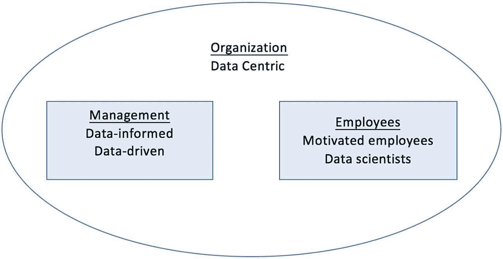
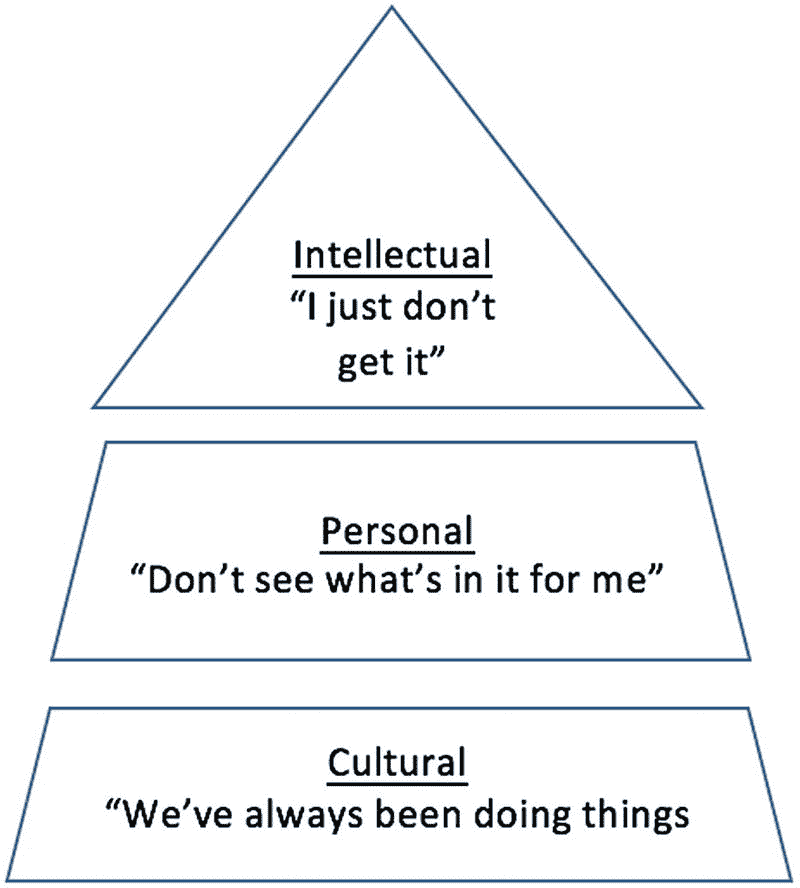

# 十一、构建数据科学文化

因此，正如我之前承诺的那样，我们现在将着眼于数据科学文化。我们将了解数据科学文化是什么样的，以及在您自己的公司中开始建立这种文化需要做些什么。

## 数据科学文化概述

首先，让我们看看拥有数据科学文化意味着什么。

### 了解数据科学文化是什么

在进入正题之前，我想先谈一谈电影《摇钱树》。如果你还没有看过这部电影，我强烈建议你去看，因为它与眼前的情况有关。换句话说，这就是在组织内建立以数据为中心的文化。

这部电影是根据同名的书 [1](#Fn1) 改编的，基本上描述了比利·比恩在奥克兰运动家队的工作。这个棒球队几乎是美国棒球锦标赛中最差的球队之一。然而，由于比利·比恩的努力，车队基本上从垫底变成了最好的车队之一，实际上是领先的竞争者。

比恩通过分析和统计做到了这一点。本质上，他分析了球员，即使他们的个人表现很差，他也看到他们在一起会成为一个伟大的团队。于是，他收购了他们，由于他们的个人表现不佳，其他球队认为他们是失败者，他们被廉价收购。所以，基本上，他组建了一个预算惊人的优秀团队。

在整个团队中，你可以看到布拉德·皮特(饰演比利·比恩的角色)遇到的阻力，这是因为俱乐部中的老将们采用了传统的思维方式。他们根本不会接受他试图实施的新方法。当然，他证明他们是错的。

这是一部非常有趣的电影，但我不会进一步谈论它。如果你对这个话题感兴趣，你绝对应该看一看，因为你正在读这本书，所以我假设你是感兴趣的。

现在，让我们来分解一下数据科学文化的重要性。

### 数据科学文化的三个层次

数据科学文化应在三个层面上进行分析，即管理层面、员工层面和组织层面(图 [11-1](#Fig1) )。

图 11-1

A data-centric organization encapsulates data-driven management, a data-friendly workforce, and data scientists

#### 管理水平

在管理层面，这完全是理性的，而不是被直觉或传统方法所驱使，就像在 Moneyball 中一样。在这个层面上，在数据科学文化中，内脏的唯一作用是消化食物，这是它们存在的首要目的。

它也是关于数据信息和数据驱动的。我们一会儿会更仔细地看看这些术语。

#### 员工级别

在员工层面，一切都与我们之前讨论的内容有关，即雇用数据科学家并管理他们。而是找到合适的人，为他们创造一个友好的环境。这也是为了确保需要与数据科学家(软件开发人员、产品经理等)互动的员工。)了解数据并相信数据科学的使用。

#### 组织层面

在组织层面上，拥有正确的文化意味着将管理层面和员工层面的正确元素结合起来。结果是一个以数据为中心的组织。这将使您能够从数据收集阶段到研究和应用阶段最大限度地发挥数据科学的影响。这时，您将开始在您的组织中看到一些真正的成果。

#### 了解数据和数据驱动

让我们从了解数据和数据驱动之间的区别开始。当我们说一个组织或一个人了解数据时，这意味着他们实际上正在使用数据和数据的上下文作为他们谈话和决策过程的输入。

因此，如果您使用仪表板和 KPI 之类的东西，那么您就是数据知情的。如今，数据信息变得非常容易。您可以使用 Excel 或其他简单的工具，制作一些简单的图表来查看您的组织内发生了什么并不困难。

数据驱动意味着将它提升到一个新的水平。这是你开始使用更智能的算法和方法来获取数据的时候。然后，您通过使用算法来为您做出决定，或者通过将算法的输出考虑在内，来转变决策过程。

这种方法的反面是什么？好吧，与数据灵通或数据驱动相反的是，当你用你的勇气做决定。或者传统，在准确性和有效性方面也好不到哪里去。

我们再来看几个例子。

当您了解数据时，您可能会使用仪表板或 Excel 从多个来源收集数据。当然，你已经像我们之前在第 [2](02.html) 章中讨论的那样适当地组织了数据，并确保记录了过程以避免任何问题。数据也是可访问的，并且您的所有员工都知道它，知道它可以放在哪里以及如何使用它。

数据驱动意味着更进一步。这是大多数公司未来应该努力的方向。当你达到这一点时，这意味着你允许数据和数据科学帮助你做出潜在的破坏性决策。在某些情况下，它们甚至可能完全取代人类的决策。

所以，举例来说，如果你用算法交易，那么你就是数据驱动的。如果你的应用或网站使用推荐系统，那么你就是数据驱动的。

显然，数据驱动并不意味着算法需要做出每一个决定，但它确实意味着你在组织的某些部分和决策过程中使用算法的输出。

那么，你为什么想这么做呢？数据驱动提高了效率，实际上可以改善决策。例如，对于客户可能想要什么，推荐系统可以做出比人更好的决定。此外，如果你想大规模销售，在某个点之后，你需要有一种算法，可以在推荐商品或管理内容时真正取代人类。这只是一个例子，但在不同的行业还有很多其他的例子。

Warning!

Eric Peterson 从埃森哲的首席科学家 Kishore swami nathan[2](#Fn2)处引出了一个关于“首席执行官应该了解的分析知识”的讨论:

数据是一把双刃剑。如果使用得当，它可以带来明智的决策。如果使用不当，同样的数据不仅会导致糟糕的决策，还会导致信心十足地做出糟糕的决策，进而导致错误且代价高昂的行动。

换句话说，如果你正确使用数据和数据科学，你会看到效率的提高和利润的增加。然而，如果您没有以正确的方式使用数据，那么很容易陷入图 [11-2](#Fig2) 中的危险区域，这是上一章重复的内容。

问题是，你最终会在决策过程中使用数据，因为你没有正确的理论，或者你没有进行正确的测试，所以决策是错误的。然而，你仍然完全有信心，因为你认为你用了科学的方法。

图 11-2

The data scientist Venn diagram

减轻这种风险的最简单的方法是雇用数据科学家，他们涵盖图表中的数学和统计领域，并将使用正确的理论和流程来进行数据科学研究。当然，你需要正确的文化，这样科学家可以与其他部门互动，每个人都可以审查其他人的工作。

### 为数据科学家创造友好的环境

在员工层面，您希望为数据科学家创造一个友好的环境。在关于雇佣数据科学家的上一章中，我们已经讨论了很多。本质上，你需要记住，数据科学家不仅仅追求金钱回报。他们也想要正确的文化，他们想要精神上的刺激，他们想要感觉他们正在进步，他们正在学习新的东西，他们的工作有影响。

此外，请记住，数据科学家往往是内向的人。对每个人来说，与他们喜欢的人和正确的文化一起在团队中工作是很重要的，但对这些人来说，这甚至比普通人更重要。

记住所有这些是拥有快乐员工的关键，这将转化为生产力的提高。

### 在组织层面上以数据为中心

当数据科学处于核心地位时，组织就是以数据为中心的，这意味着几件不同的事情。

首先，它意味着你对数据和数据科学方面正在发生的事情有一个 360 度的视角。数据科学是一个独立的部门，这意味着数据科学家有更多的自由和许可证来探索新事物，即使它们具有潜在的破坏性。他们有更多的责任，这可以激励他们，但也带来更大程度的风险。

然而，因为你有 360 度的视角，你可以减轻这种风险。所有重要部门之间都存在正确的沟通和报告渠道，尤其是开发人员和数据科学家之间，以及数据科学家和管理层之间。

这一点很重要，因为你想确保数据科学家的工作产生影响，还因为你需要了解正在收集的数据、这些数据是如何被使用的，以及这些数据是如何被实施的，而这些都很容易被忽略。

为了澄清，当我们谈论数据收集时，决策者需要注意两个大问题。

一个是法律问题，由于欧盟和英国的 GDPR，这个问题现在变得非常重要。数据隐私有各种各样的问题，没有借口不知道数据是如何被使用和收集的。

其次，了解数据科学家正在研究什么，并确保以积极的方式在组织中实施和使用，这一点很重要。因此，这就是拥有有效的沟通渠道变得非常重要的地方。一个部门可以仔细检查另一个部门的工作，以确保正在做的事情与组织相关。

让我们看几个例子，看看事情是如何出错的。

#### 示例 1:当数据不是核心时

让我们从一个例子开始，当数据科学不是核心时会发生什么。这种情况往往发生在那些因为现金短缺而试图降低成本的中小型企业中。

当一家公司想做数据科学，但他们不想雇用新人时，他们可能会转向自己的人员来做数据科学。他们可能会雇用一名开发人员来进行机器学习，但仅此而已。

有人监督软件开发人员是个不错的主意。否则，有人可能会运行他们从库中获得的模型，而他们不知道如何正确地测试这个模型。例如，他们可能会使用交叉验证方案。模型投入生产，你最终会得到灾难性的结果，因为你处于危险地带。换句话说，你正在使用一个拥有黑客技术和领域专业知识的人，但是他们没有理论知识来支持它。

所以，你做出了你非常自信的决定，但它们实际上是错误的。从技术上讲，犯错并对自己的错误充满信心比仅仅犯错更糟糕。

#### 例子 2:事情没有实现

另一个常见的例子主要发生在存在人事问题和沟通问题的大组织中，那就是当你雇佣数据科学家时，事情没有得到实施。

虽然有些事情可能无法实现，但是让我们看看一个不熟悉某个领域的数据科学家的情况。所以，你雇了一个理论上看起来很不错的人。你也真的相信数据科学，你给他们自由和资源去做他们想做的任何事情。

问题是，在这些情况下很容易产生孤岛，特别是当数据科学家在某种意义上对其他部门说另一种语言时。一个常见的错误是，数据科学家花了几个月的时间做某件事情，然后因为不熟悉领域而无法实现。他们无法理解他们所创造的东西无法实现，因为实际的工作限制或者从业务角度来看缺乏相关性。

这往往发生在最近完成博士学位的人身上，他们仍然处于这种非常学术的心态，试图做复杂和花哨的事情，而不是有影响的简单事情。

因此，在数据科学中拥有正确的文化不仅仅是了解数据，而是将创造力转化为成果。这是为了给数据科学家自由和资源，但也要确保适当的检查到位，以确保工作是相关的，并且能够和将会得到实施。

#### 例子 3:沟通不畅

事情可能出错的另一个例子是当你沟通不畅时，这种情况经常发生。

假设没有人监督软件开发人员和数据科学家之间的交流。尽管他们都是技术人员，但大多数时候他们说的是不同的语言。结果是产生了孤岛，而这些孤岛很难被打破。孤岛会导致不好的实践，并增加开发时间。

首先，问题在于沟通方式的不同。例如，与开发人员相比，数据科学家是否喜欢大量使用数学和不同的表达方式？此外，对彼此的做法缺乏了解也是一个问题。

开发人员喜欢事情被很好地记录，他们喜欢运行测试。另一方面，数据科学家可以有不同的方法。他们甚至可能使用不同的编程语言，这也是一个问题。

在这种情况下，一个解决办法是让人们两人一组工作。另一个选择是雇用有机器语言经验的人，他们可以弥补数据科学家和开发人员之间的沟通不畅。

或者你可能想反其道而行之，雇佣一个有一些软件开发经验的数据科学家。

其他人建议尝试在所有部门中强制实施特定的软件开发方法。

问题是这些并不总是有效，主要是因为数据科学与软件开发有点不同，有时你会发现自己处于尴尬的境地。因此，主要的区别在于数据科学的进步并不像软件开发那样是渐进的。有点孤注一掷了。

你可能会花几个星期做研究，然后突然得到结果。相反，在软件开发中，你可能每天都要添加一个新的特性。

因此，即使单口相声不是一个坏主意，例如，人们可以分享他们每天的工作，也不要考虑所有关于软件方法的建议。当然，你可以考虑它们，但是要让它们适应你的具体情况。

Moneyball: A Story About Data Science Culture

体育界过去与科技和统计界非常疏远。大多数体育专业人士可能会发现关于数据库或机器学习算法的讨论非常无聊。体育是一个完全不同的世界，比利·比恩的方法似乎与棒球界格格不入。

比利·比恩认为游戏中使用的大部分指标都已经过时了。球员是由曾经是教练或者球员本人的球探挑选出来的。比利·比恩发现，像上垒率(击球手上垒的频率)这样的统计数据比传统上使用的其他统计数据更能预测成功。

通过这种方式，奥克兰运动家队能够创造出与过去完全不同的估值，并以大约 4400 万美元的预算与花费近三倍的团队竞争。这种方法被称为“sabermetrics”这个术语来源于首字母缩略词 SABR，代表美国棒球研究协会。

不幸的是，奥克兰运动家队没有赢得冠军(即使他们非常接近冠军)，然后他们失去了优势，一旦其他俱乐部开始复制他们的方法。

自那以后，数据科学入侵了体育世界，设备和算法统治了比赛的许多方面。体育分析方面的会议正在举行，最大的一次在麻省理工学院斯隆管理学院( [`www.sloansportsconference.com`](http://www.sloansportsconference.com) )举行。

我还做过体育分析方面的研究，致力于预测运动损伤和运动结果(比如哪个队会赢得比赛)。你可以在我的博客 [`http://thedatascientist.com`](http://thedatascientist.com) 上了解更多。

## 构建数据科学文化的步骤

让我们来看看建立有利于数据科学的文化需要采取的步骤。

### 为什么首先需要数据科学？

首先，你需要问自己为什么需要数据科学。商业中有三种常见的情况:

1.  数据科学是你的业务不可或缺的一部分:也许你是一家人工智能或机器人公司，或者你在某种程度上是一家深度技术公司，在这种情况下，你通常需要自己拥有这些知识。
2.  例如，你经营一家公司，想要提高效率，所以你可能想要改善运营。
3.  你想提高销售额，所以也许你想建立你的推荐系统，以提高你的 B2C 产品。

你不太可能属于第一类，否则你不会读这本书。所以，你要么在两个或三个，显然这些可以结合起来。

在这一点上，你需要问自己为什么需要数据科学，这样你就知道你下一步要去哪里。现在，让我们看看变革的阻力。

### 变革阻力

如果你是一家初创公司，那么你最有可能是灵活的，所以抵制变化不会是一个问题。然而，如果你是一个大组织的一部分，以下几点将会非常相关。

变革的三种阻力是文化的、个人的和智力的(图 [11-3](#Fig3) )。

图 11-3

Types of resistance to change

#### 对变革的文化抵制

我们在《摇钱树》中看到了文化对变革的抵制。我们有一个庞大而古老的组织或多层管理或领域，它们与数学、统计学或数据没有太多关系。体育和金融的对比就是一个很好的例子。

正如 Moneyball 所显示的，体育界仍在试图深入分析，但还没有到那一步。即使回到 Moneyball 事件发生的时候，比利·比恩试图在 Oakland Athletics 实施的这种事情在金融领域也没什么特别的，这通常是数据分析的前沿领域之一。

#### 个人对变革的抵制

个人对变革的抵制也发生在较小的公司，当员工不喜欢变革时。

给你一个亲身经历的例子，我和一个客户一起工作，等了两个月才有人给我一个数据库专家。然后，我不得不打电话给主管，再等一个月。

可能发生的情况是，员工可能已经超负荷工作，他们被分配了更多的工作。因此，员工看不出做任何事情有什么好处，比如导出数据库或尝试实现算法。

#### 对变革的理智抵制

最后，我们有这样一种情况，人们害怕他们不理解的东西。想想《终结者》电影中的天网，就像人们害怕机器会接管世界一样。

对组织中的变化没有太多的智力阻力，因为大多数人都明白数据是有用的，因为它可以提高效率和销售。然而，如果有一丝智力上的抗拒，雇佣一个好的数据官就是一个好的开始。这个人可以拥有数据，可以向人们展示数据，也可以展示数据如何改善公司内部的几乎所有事情。

### 变革之旅

谈到你的改变之旅，有三点要记住。首先，你必须确定数据科学家将如何带你去那里。这意味着创造一个数据科学友好的环境，让他们可以谈论数据科学，并尝试运行具有巨大潜在影响的项目。改变是缓慢的，但如果人们开始看到结果，他们就会慢慢改变想法，因为他们会明白好处。

在某些情况下，找到冠军也是非常重要的。这是一个能在这个新方向上创造热情的人。冠军是真正相信这种新方法的人，他们有热情和地位来推动公司的其他人朝着这个新目标前进。

通常是一个很受欢迎的高级职员。可能是您，也可能是数据科学家或首席数据官。

一般来说，最好的选择是已经在组织中的人，受欢迎的人，人们尊重和倾听的人，不管他们在谈论什么。这也有助于员工将此视为一次学习经历，对公司和他们自己都更积极。

在你的变革之旅中要记住的最后一点是，关注员工的福利很重要，因为每个人都讨厌做更多的工作却没有回报。然而，求知欲强、有动力的员工会看到学习的好处，也会帮助组织，因为这可以转化为他们自己的成果。

### 如何开始

说到实现数据科学文化，我看到了两种方法。第一种是循序渐进的方法，第二种是用例方法。

在循序渐进的方法中，您收集大量数据，决策者在数据科学方面自学。然后，他们尝试使用简单的图表和统计数据，因此他们变得更加了解数据。一旦他们对数据感到满意，他们就会采取下一步行动，雇佣一些人来理解这些数据。

用例方法更像是自顶向下的方法。这是指当一家公司遇到某种类型的问题时，他们制定了一个计划，并可能从雇佣某人来帮助他们设计计划和解决特定的问题开始。然后，他们将考虑这些发现如何与其他用例相关联。

循序渐进的方法是最常见的，因为它很容易在 Excel 或仪表板中收集和可视化数据。当一家公司对数据感兴趣时，就会发生这种情况，因为他们听说其他人都在收集和使用数据，但这并不是一个优先事项。

因此，在某一点上，该公司已经解决了它的主要问题，并实现了盈利，他们决定雇用某人，因为他们拥有所有这些数据，并希望利用这些数据做点什么。这种方法很有意义，因为它不会对当前的运营造成太大的干扰，而且如果数据收集不是您的首要任务，您也不必把事情做得太快太远。

然而，它也会引起各种各样的问题。这是采用数据科学的一种较慢的方式，但你也会遇到我们在第 [2](02.html) 章中谈到的所有问题。换句话说，一堆数据是在没有事先思考或目标的情况下收集的，它会变成一场灾难。

用例方法不太常见，它发生在公司有一个清晰的用例的时候。优势在于它可以使用更有针对性的方法提供更直接的结果。然而，这需要一定程度的数据意识，并且公司需要能够接触到他们可以信任的数据科学家。

请注意，公司不必选择一种方法而不是另一种。通常，他们可能以第一种方式开始，以第二种方式结束。

### 从哪里开始

地点和方式同样重要。因此，您首先需要规划您的组织对数据的使用。你需要了解数据从收集到使用的流程，并发现你可能拥有的任何黑暗数据。

此外，强调战略和创新，并努力帮助员工理解为什么这很重要。奖励好的行为，这对数据科学家来说非常重要。许多数据科学家希望得到认可，并感觉他们正在对世界或他们的公司产生影响。因此，在博客和社交媒体上宣传好的工作会有很大帮助，也可以与公司的每个人分享最佳用例。

最后，创造一种嵌入式文化是打破隔阂和改善沟通的方法。您希望数据科学家与开发人员、产品负责人和经理紧密合作。

这是唯一的方法来确保研究是相关的，结果是可实施的，并且在公司内部产生影响。

#### 理解和使用暗数据

暗数据是没有被使用的运营数据，例如日志文件、销售电话或电子邮件的记录以及类似的信息。

这种类型的数据是相关的，因为有很多这样的数据，它们被搁置在那里积灰。德勤报告称，到 2020 年，我们将拥有 44ZB 的数据。 [3](#Fn3) 这个数字可能不是 100%准确，但它仍然是一个巨大的数据量。请注意，许多数据的来源没有指定；它包括音频、笔记、视频、图像文件等等。

此外，德勤还特别提到了物联网和其他非传统来源。这种类型的数据很容易收集，但并不总是被使用。因此，它很快就变成了黑暗的数据，只是坐在数据仓库中等待有人来理解它。

##### 黑暗数据能为你做什么？

黑暗数据可以为你做很多事情，但提供一套适用于所有情况的通用准则并不容易。然而，这里有几个例子。

所以，你可能有一些电子邮件地址。在某些情况下，您可以从电子邮件地址中提取性别和年龄，从日志文件中提取访问者行为，或者从客户电话中提取情感。然后，例如，您可以从使用日志或客户日志中创建用户保留的预测模型。这只是一个例子，还有无数种可能性。

请记住，数据的非结构化性质会使其难以使用。然而，如果你能做到这一点，它会是非常有益的。

### 提高数据驱动力的其他步骤

如前所述，你需要创造一种促进战略和创新的开放文化。冠军可以成为重要的资产，因为他们有助于激励员工。

有很多方法可以创造这种文化。例如，你可以每月组织一到两次内部黑客马拉松，或者让员工发挥自己的创意。其他公司已经成功做到了这一点，它之所以有效，是因为它让人们保持快乐和参与。

另一个有趣的方法是使用 Kaggle 来创建内部竞赛。如果您的公司中有大量的数据科学家，这是可行的。它给人们一个娱乐和学习新事物的机会。

最后，如果可以的话，开放你的数据，允许你的员工邀请其他人参与小项目。当然，这并不适用于每家公司。然而，如果可以的话，这是发现新人才的好方法。

### 奖励良好行为

说到奖励良好行为，有好想法的员工需要某种形式的认可。也许你在博客上发表他们的成果，或者你把库和软件开源并归属于开发者。这是该领域的大型组织正在做的事情。

比如谷歌 [4](#Fn4) 和脸书[T5】5](#Fn5)都有自己的研究博客。脸书也有一个名为 Prophet [6](#Fn6) 的预测库，你可以阅读创建这个库的公司内部人员写的一篇文章。

这是一个很好的方法，因为每个人都希望自己对新奇事物的贡献得到回报。他们没有理由匿名。他们的名字就在那里。此外，数据科学家喜欢展望未来。如果他们想找另一份工作，让他们知道新雇主可以很容易地在网上找到他们和他们的工作是有好处的。这也是为什么数据科学家和软件开发者也有 GitHub 账号的原因。

所以，这不仅仅是奖金的问题，也是自我的问题。

### 创建嵌入式文化

最后，在尝试为数据科学建立正确的文化时，最重要的事情之一是创建嵌入式文化。这意味着您希望数据科学家与其他部门密切合作，并且希望各方之间有良好的沟通以及完全透明。

人们分享他们正在做的事情的单口相声是促进交流和透明度的一种非常标准的方式。然而，要小心，因为数据科学家的工作节奏缓慢，每天的站立会令人恼火。这不是渐进的，你最不希望的就是让一群内向的人感到不舒服，因为他们没有成果可以展示。这就是为什么每周站立可能是一个更好的选择。

你还应该考虑新数据科学家的导师计划。初级数据科学家可能非常热情，有时你可以从一些好大学找到惊人的人才，他们可能有点缺乏经验。这可能是他们的第一份真正的工作，所以让一位高级数据科学家来教育和指导他们是一个好主意，这将使他们变得伟大。

Case Study: Booking.com Does Data Science The Right Way

Booking.com 是一家做好数据科学的公司。他们每 24 小时售出超过 150 万间酒店客房，数百万人不断浏览该网站，这意味着他们拥有海量数据。他们不断使用这些数据来改进服务和开发新的服务。

Booking.com 有 120 多名数据科学家，他们有着不同的个人资料、背景和工作偏好。这种文化显然是由数据驱动的，其发展方式使得该公司为数据科学家提供了完美的场所。从用不同的项目挑战他们，要求他们不断学习新东西，到通过同龄人举办的研讨会和演示来帮助他们的教育，数据科学家很少有机会在 Booking.com 感到无聊。 [7](#Fn7)

就像我们之前讨论的那样，这个结构也是你想要在嵌入时模仿的。他们的数据科学家是业务不可或缺的一部分。他们是团队的一部分，团队包括开发人员、产品所有者和各种其他专家。这个团队是以这样一种方式组成的，他们可以将一个想法从概念带到实施阶段。

在每天的基础上，他们遵循他们所谓的预约敏捷要点食谱，这意味着他们有每天的站立、积压、回顾、KPI 和目标以及关键结果、团队目的等等。这种方法允许他们的团队前进或失败，并尽快从失败中吸取教训。

出于这个原因，Booking.com 的数据科学家应该具备出色的沟通技巧和商业意识。换句话说，技术技能是不够的。

然而，数据科学家在 Booking.com 很开心，因为他们不断从事新项目，学习新东西。他们不必等待数据出现，他们的意见和建议会被考虑，他们被允许采取新的方法，他们被视为数据科学家。

因此，在创造以数据为中心的文化方面，你可以做得比模仿 Booking.com 模式更糟。当然，你不必做他们所做的一切。毕竟这是一家大公司。也许，以你的情况来说，你并不那么在乎沟通，而对技术方面更感兴趣。

然而，如果你想创造一种嵌入式文化，那么一定要看看 Booking.com 是怎么做的。

Footnotes [1](#Fn1_source)

迈克尔·刘易斯，《钱球:赢得不公平游戏的艺术》(纽约:诺顿公司，2004 年)。

  [2](#Fn2_source)

这篇采访刊登在埃森哲的《展望杂志》(2011)第 1 期上。你还可以在这里找到这个采访: [`www.eiseverywhere.com/file_uploads/db8d954d6e3f5fe4a7e67208537065ac_Accenture_Outlook_What_C_suite_should_know_about_analytics.pdf`](http://www.eiseverywhere.com/file_uploads/db8d954d6e3f5fe4a7e67208537065ac_Accenture_Outlook_What_C_suite_should_know_about_analytics.pdf)

  [3](#Fn3_source)

[T2`www2.deloitte.com/content/dam/Deloitte/is/Documents/technology/deloitte-uk-tech-trends-2017-dark-analytics.pdf`](http://www2.deloitte.com/content/dam/Deloitte/is/Documents/technology/deloitte-uk-tech-trends-2017-dark-analytics.pdf)

  [4](#Fn4_source)

[T2`https://research.googleblog.com/`](https://research.googleblog.com/)

  [5](#Fn5_source)

[T2`https://research.fb.com/blog/`](https://research.fb.com/blog/)

  [6](#Fn6_source)

[T2`https://research.fb.com/prophet-forecasting-at-scale/`](https://research.fb.com/prophet-forecasting-at-scale/)

  [7](#Fn7_source)

Nishikant Dhanuka，《Booking.com 一个数据科学家的日记》，《走向数据科学》，2017 年 11 月 13 日， [`https://towardsdatascience.com/diary-of-a-data-scientist-at-booking-com-924734c71417`](https://towardsdatascience.com/diary-of-a-data-scientist-at-booking-com-924734c71417)