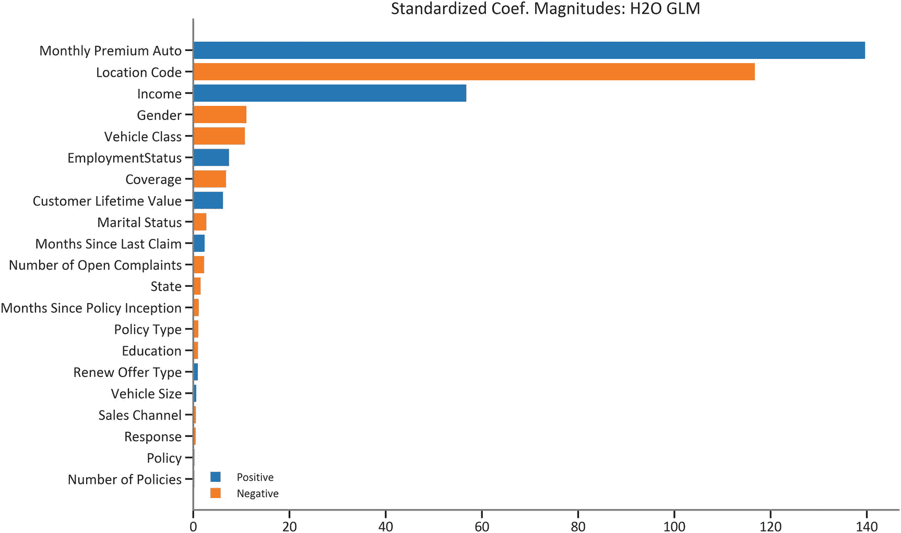
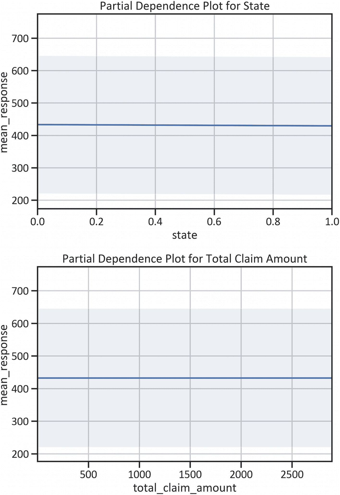
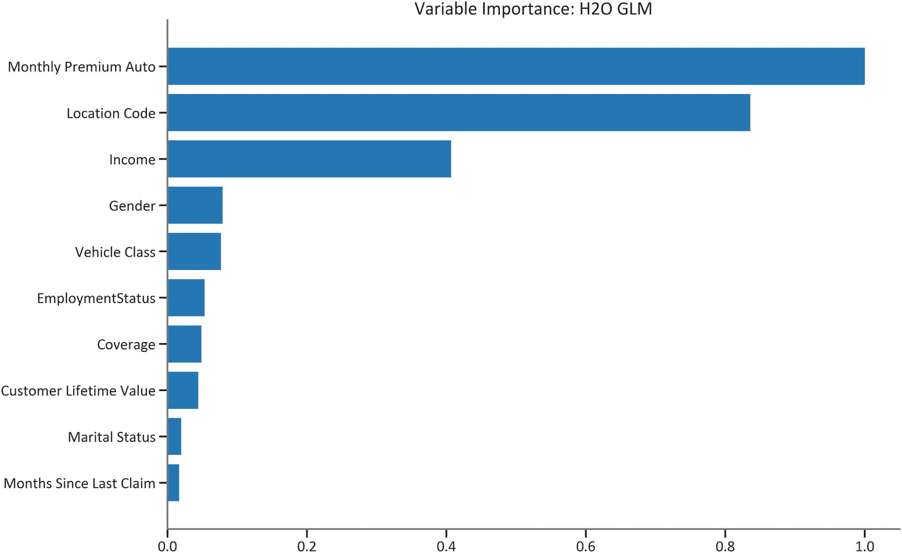

# 三、Scikit-Learn、PySpark 和 H2O 线性建模

这一介绍性章节解释了普通的最小二乘法，并用主要的 Python 框架(即 Scikit-Learn、Spark MLlib 和 H2O)来执行它。它首先解释方法背后的基本概念。

## 普通最小二乘法初探

普通最小二乘法用于输出要素不受限制(连续)的数据。这种方法要求正态性和线性，并且误差项中必须没有自相关(也称为*残差*)和多重共线性。这也很容易导致数据的异常，所以如果这种方法不适合你，你可能需要使用其他方法，如山脊法、套索法和弹性网法。

清单 [3-1](#PC1) 从一个微软 CSV 文件中获取必要的数据。

```py
import pandas as pd
df = pd.read_csv(r"filepath\WA_Fn-UseC_-Marketing_Customer_Value_Analysis.csv")

Listing 3-1Attain the Data

```

清单 [3-2](#PC2) 规定了要删除的列名，然后执行`drop()`方法。然后，它将轴指定为`columns`,以便删除数据中不必要的列。

```py
drop_column_names = df.columns[[0, 6]]
initial_data = df.drop(drop_column_names, axis="columns")

Listing 3-2Drop Unnecessary Features in the Data

```

清单 [3-3](#PC3) 获得该数据中分类特征的虚拟值。

```py
initial_data.iloc[::, 0] = pd.get_dummies(initial_data.iloc[::, 0])
initial_data.iloc[::, 2] = pd.get_dummies(initial_data.iloc[::, 2])
initial_data.iloc[::, 3] = pd.get_dummies(initial_data.iloc[::, 3])
initial_data.iloc[::, 4] = pd.get_dummies(initial_data.iloc[::, 4])
initial_data.iloc[::, 5] = pd.get_dummies(initial_data.iloc[::, 5])
initial_data.iloc[::, 6] = pd.get_dummies(initial_data.iloc[::, 6])
initial_data.iloc[::, 7] = pd.get_dummies(initial_data.iloc[::, 7])
initial_data.iloc[::, 8] = pd.get_dummies(initial_data.iloc[::, 8])
initial_data.iloc[::, 9] = pd.get_dummies(initial_data.iloc[::, 9])
initial_data.iloc[::, 15] = pd.get_dummies(initial_data.iloc[::, 15])
initial_data.iloc[::, 16] = pd.get_dummies(initial_data.iloc[::, 16])
initial_data.iloc[::, 17] = pd.get_dummies(initial_data.iloc[::, 17])
initial_data.iloc[::, 18] = pd.get_dummies(initial_data.iloc[::, 18])
initial_data.iloc[::, 20] = pd.get_dummies(initial_data.iloc[::, 20])
initial_data.iloc[::, 21] = pd.get_dummies(initial_data.iloc[::, 21])

Listing 3-3Attain Dummy Features

```

清单 [3-4](#PC4) 概述了独立和从属特征。

```py
import numpy as np
int_x = initial_data.iloc[::,0:19]
fin_x = initial_data.iloc[::,19:21]
x_combined = pd.concat([int_x, fin_x], axis=1)
x = np.array(x_combined)
y = np.array(initial_data.iloc[::,19])

Listing 3-4Outline the Features

```

## sci kit-在行动中学习

清单 [3-5](#PC5) 随机划分数据帧。

```py
from sklearn.model_selection import train_test_split
x_train, x_test, y_train, y_test = train_test_split(x, y, test_size=0.2, random_state=0)

Listing 3-5Randomly Divide the Dataframe

```

清单 [3-6](#PC6) 缩放独立特征。

```py
from sklearn.preprocessing import StandardScaler
sk_standard_scaler = StandardScaler()
sk_standard_scaled_x_train = sk_standard_scaler.fit_transform(x_train)
sk_standard_scaled_x_test = sk_standard_scaler.transform(x_test)

Listing 3-6Scale the Independent Features

```

清单 [3-7](#PC7) 执行 Scikit-Learn 普通最小二乘回归方法。

```py
from sklearn.linear_model import LinearRegression
sk_linear_model = LinearRegression()
sk_linear_model.fit(sk_standard_scaled_x_train, y_train)

Listing 3-7Execute the Scikit-Learn Ordinary Least-Squares Regression Method

```

列表 [3-8](#PC8) 确定了 Scikit-Learn 普通最小二乘回归方法的最佳超参数。

```py
from sklearn.preprocessing import GridSearchCV
sk_linear_model_param = {'fit_intercept':[True,False]}
sk_linear_model_param_mod  = GridSearchCV(estimator=sk_linear_model, param_grid=sk_linear_model_param, n_jobs=-1)
sk_linear_model_param_mod.fit(sk_standard_scaled_x_train, y_train)
print("Best OLS score: ", sk_linear_model_param_mod.best_score_)
print("Best OLS parameter: ", sk_linear_model_param_mod.best_params_)

Best OLS score:  1.0
Best OLS parameter:  {'fit_intercept': True}

Listing 3-8Determine the Best Hyperparameters for the Scikit-Learn Ordinary Least-Squares Regression Method

```

清单 [3-9](#PC9) 执行 Scikit-Learn 普通最小二乘回归方法。

```py
sk_linear_model = LinearRegression(fit_intercept= True)
sk_linear_model.fit(sk_standard_scaled_x_train, y_train)
sk_linear_model_param_mod.best_params_)

Listing 3-9Execute the Scikit-Learn Ordinary Least-Squares Regression Method

```

清单 [3-10](#PC10) 计算 Scikit-Learn 普通最小二乘回归方法的截距。

```py
print(sk_linear_model.intercept_)
433.0646521131769

Listing 3-10Compute the Scikit-Learn Ordinary Least-Squares Regression Method’s Intercept

```

清单 [3-11](#PC11) 计算 Scikit-Learn 普通最小二乘回归方法的系数。

```py
print(sk_linear_model.coef_)
[-6.15076155e-15  2.49798076e-13 -1.95573220e-14 -1.90089677e-14
 -5.87187344e-14  2.50923806e-14 -1.05879478e-13  1.53591400e-14
 -1.82507711e-13 -7.86327034e-14  4.17629484e-13  1.28923537e-14
  6.52911311e-14 -5.28069778e-14 -1.57900159e-14 -6.74040176e-14
 -9.28427833e-14  5.03132848e-14 -8.75978166e-15  2.90235705e+02
 -9.55950515e-14]

Listing 3-11Compute the Scikit-Learn Ordinary Least-Squares Regression Method’s Coefficients

```

清单 [3-12](#PC12) 计算普通最小二乘回归方法的预测值。

```py
sk_yhat = sk_linear_model.predict(sk_standard_scaled_x_test)

Listing 3-12Compute the Scikit-Learn Ordinary Least-Squares Regression Method’s Predictions

```

清单 [3-13](#PC13) 评估 Scikit-Learn 普通最小二乘法(见表 [3-1](#Tab1) )。

表 3-1

对 Scikit-Learn 普通最小二乘法的评估

<colgroup><col class="tcol1 align-left"> <col class="tcol2 align-left"> <col class="tcol3 align-left"> <col class="tcol4 align-left"> <col class="tcol5 align-left"> <col class="tcol6 align-left"></colgroup> 
|   | 

Sk 平均绝对误差

 | 

Sk 均方误差

 | 

Sk 均方根误差

 | 

Sk 行列式系数

 | 

Sk 差异分数

 |
| --- | --- | --- | --- | --- | --- |
| **估计值** | 9.091189e-13 | 1.512570e-24 | 1.229866e-12 | One | One |

```py
from sklearn import metrics
sk_mean_ab_error = metrics.mean_absolute_error(y_test, sk_yhat)
sk_mean_sq_error = metrics.mean_squared_error(y_test, sk_yhat)
sk_root_sq_error = np.sqrt(sk_mean_sq_error)
sk_determinant_coef = metrics.r2_score(y_test, sk_yhat)
sk_exp_variance = metrics.explained_variance_score(y_test, sk_yhat)
sk_linear_model_ev = [[sk_mean_ab_error, sk_mean_sq_error, sk_root_sq_error,
 sk_determinant_coef, sk_exp_variance]]
sk_linear_model_assessment = pd.DataFrame(sk_linear_model_ev, index = ["Estimates"], columns = ["Sk mean absolute error",
 "Sk mean squared error",
"Sk root mean squared error",
 "Sk determinant coefficient",
 "Sk variance score"])
sk_linear_model_assessment
y = np.array(initial_data.iloc[::,19])

Listing 3-13Assess the Scikit-Learn Ordinary Least-Squares Method

```

表 [3-1](#Tab1) 显示 Scikit-Learn 普通最小二乘法解释了整个可变性。

### PySpark 在行动

本节使用 PySpark 框架执行和评估普通的最小二乘法。清单 [3-14](#PC14) 用`findspark`框架准备 PySpark 框架。

```py
import findspark as initiate_pyspark
initiate_pyspark.init("filepath\spark-3.0.0-bin-hadoop2.7")

Listing 3-14Prepare the PySpark Framework

```

清单 [3-15](#PC15) 用`SparkConf()`方法规定了 PySpark 应用程序。

```py
from pyspark import SparkConf
pyspark_configuration = SparkConf().setAppName("pyspark_linear_method").setMaster("local")

Listing 3-15Stipulate the PySpark App

```

清单 [3-16](#PC16) 用`SparkSession()`方法准备 PySpark 会话。

```py
from pyspark.sql import SparkSession
pyspark_session = SparkSession(pyspark_context)

Listing 3-16Prepare the Spark Session

```

清单 [3-17](#PC17) 使用`createDataFrame()`方法将本章前面创建的`pandas`数据帧更改为 PySpark 数据帧。

```py
pyspark_initial_data = pyspark_session.createDataFrame(initial_data)

Listing 3-17Change Pandas Dataframe to a PySpark Dataframe

```

列表 [3-18](#PC18) 为独立特征创建一个列表，为从属特征创建一个字符串。它使用 PySpark 框架建模的`VectorAssembler()`方法转换数据。

```py
x_list = list(x_combined.columns)
y_list = initial_data.columns[19]
from pyspark.ml.feature import VectorAssembler
pyspark_data_columns = x_list
pyspark_vector_assembler = VectorAssembler(inputCols=pyspark_data_columns, outputCol="variables")
pyspark_data = pyspark_vector_assembler.transform(pyspark_initial_data)

Listing 3-18Transform the Data

```

清单 [3-19](#PC19) 使用`randomSplit()`方法划分数据。

```py
(pyspark_training_data, pyspark_test_data) = pyspark_data.randomSplit([.8,.2])

Listing 3-19Divide the Dataframe

```

清单 [3-20](#PC20) 执行 PySpark 普通最小二乘回归方法。

```py
from pyspark.ml.regression import LinearRegression
pyspark_linear_model = LinearRegression(labelCol=y_list, featuresCol=pyspark_data.columns[-1])
pyspark_fitted_linear_model = pyspark_linear_model.fit(pyspark_training_data)

Listing 3-20Execute the PySpark Ordinary Least-Squares Regression Method

```

清单 [3-21](#PC21) 计算 PySpark 普通最小二乘回归方法的预测值。

```py
pyspark_yhat = pyspark_fitted_linear_model.transform(pyspark_test_data)

Listing 3-21Compute the PySpark Ordinary Least-Squares Regression Method’s Predictions

```

清单 [3-22](#PC22) 评估 PySpark 普通最小二乘法。

```py
pyspark_linear_model_assessment = pyspark_fitted_linear_model.summary
print("PySpark root mean squared error", pyspark_linear_model_assessment.rootMeanSquaredError)
print("PySpark determinant coefficient", pyspark_linear_model_assessment.r2)

PySpark root mean squared error 2.0762306526480097e-13
PySpark determinant coefficient 1.0

Listing 3-22Assess the PySpark Ordinary Least-Squares Method

```

### H2O 在行动

本节使用 H2O 框架执行和评估普通最小二乘法。

清单 [3-23](#PC23) 准备 H2O 框架。

```py
import h2o as initialize_h2o
initialize_h2o.init()

Listing 3-23Prepare the H2O Framework

```

清单 [3-24](#PC24) 将熊猫数据帧更改为 H2O 数据帧。

```py
h2o_data = initialize_h2o.H2OFrame(initial_data)

Listing 3-24Change the Pandas Dataframe to an H2O Dataframe

```

清单 [3-25](#PC25) 概述了独立和从属特征。

```py
y = y_list
x = h2o_data.col_names
x.remove(y_list)

Listing 3-25Outline Features

```

清单 [3-26](#PC26) 随机划分数据。

```py
h2o_training_data, h2o_validation_data, h2o_test_data = h2o_data.split_frame(ratios=[.8,.1])

Listing 3-26Randomly Divide the Dataframe

```

清单 [3-27](#PC27) 执行 H2O 普通最小二乘回归方法。

```py
from h2o.estimators import H2OGeneralizedLinearEstimator
h2o_linear_model = H2OGeneralizedLinearEstimator(family="gaussian")
h2o_linear_model.train(x=x,y=y,training_frame=h2o_training_data,validation_frame=h2o_validation_data)

Listing 3-27Execute the H2O Ordinary Least-Squares Regression Method

```

清单 [3-28](#PC28) 计算 H2O 普通最小二乘法的预测。

```py
h2o_yhat = h2o_linear_model.predict(h2o_test_data)

Listing 3-28H2O Ordinary Least-Squares Method Executed Predictions

```

清单 [3-29](#PC29) 计算 H2O 普通最小二乘法的标准化系数(见图 [3-1](#Fig1) )。



图 3-1

H2O 普通最小二乘法的标准化系数

```py
h2o_linear_model_std_coefficients = h2o_linear_model.std_coef_plot()
h2o_linear_model_std_coefficients

Listing 3-29H2O Ordinary Least-Squares Method’s Standardized Coefficients

```

清单 [3-30](#PC30) 计算 H2O 普通最小二乘法的部分相关性(见图 [3-2](#Fig2) )。



图 3-2

H2O 普通最小二乘法的部分相关性

```py
h2o_linear_model_dependency_plot = h2o_linear_model.partial_plot(data = h2o_data, cols = list(initial_data.columns[[0,19]]), server=False, plot = True)
h2o_linear_model_dependency_plot

Listing 3-30H2O Ordinary Least-Squares Method’s Partial Dependency

```

列表 [3-31](#PC31) 按升序排列对 H2O 普通最小二乘法最重要的特征(见图 [3-3](#Fig3) )。



图 3-3

H2O 普通最小二乘法的特征重要性

```py
h2o_linear_model_feature_importance = h2o_linear_model.varimp_plot()
h2o_linear_model_feature_importance

Listing 3-31H2O Ordinary Least-Squares Method’s Feature Importance

```

清单 [3-32](#PC32) 评估 H2O 普通最小二乘法。

```py
h2o_linear_model_assessment = h2o_linear_model.model_performance()
print(h2o_linear_model_assessment)

ModelMetricsRegressionGLM: glm
** Reported on train data. **

MSE: 24844.712331260016
RMSE: 157.6220553452467
MAE: 101.79904883889066
RMSLE: NaN
R^2: 0.7004468136072375
Mean Residual Deviance: 24844.712331260016
Null degrees of freedom: 7325
Residual degrees of freedom: 7304
Null deviance: 607612840.7465751
Residual deviance: 182012362.53881088
AIC: 94978.33944003603

Listing 3-32Assess H2O Ordinary Least-Squares Method

```

列表 [3-33](#PC33) 通过将`remove_collinear_columns`指定为`True`来提高 H2O 普通最小二乘法的性能。

```py
h2o_linear_model_collinear_removed = H2OGeneralizedLinearEstimator(family="gaussian", lambda_ = 0,remove_collinear_columns = True)
h2o_linear_model_collinear_removed.train(x=x,y=y,training_frame=h2o_training_data,validation_frame=h2o_validation_data)

Listing 3-33Improve the Performance of the Ordinary Least-Squares Method

```

清单 [3-34](#PC34) 评估 H2O 普通最小二乘法。

```py
h2o_linear_model_collinear_removed_assessment = h2o_linear_model_collinear_removed.model_performance()
print(h2o_linear_model_collinear_removed)

MSE: 23380.71864337616
RMSE: 152.9075493341521
MAE: 102.53007935777588
RMSLE: NaN
R^2: 0.7180982143647627
Mean Residual Deviance: 23380.71864337616
Null degrees of freedom: 7325
Residual degrees of freedom: 7304
Null deviance: 607612840.7465751
Residual deviance: 171287144.78137374
AIC: 94533.40762597627

ModelMetricsRegressionGLM: glm
** Reported on validation data. **

MSE: 25795.936313899092
RMSE: 160.6111338416459
MAE: 103.18677222520363
RMSLE: NaN
R^2: 0.7310558588001701
Mean Residual Deviance: 25795.936313899092
Null degrees of freedom: 875
Residual degrees of freedom: 854
Null deviance: 84181020.04623385
Residual deviance: 22597240.210975606
AIC: 11430.364002305443

Listing 3-34Assess the H2O Ordinary Least-Squares Method

```

## 结论

本章执行了三个关键的机器学习框架(Scikit-Learn、PySpark 和 H2O)来建模数据，并使用线性方法生成连续输出特征。它还探讨了评估这种方法的方式。