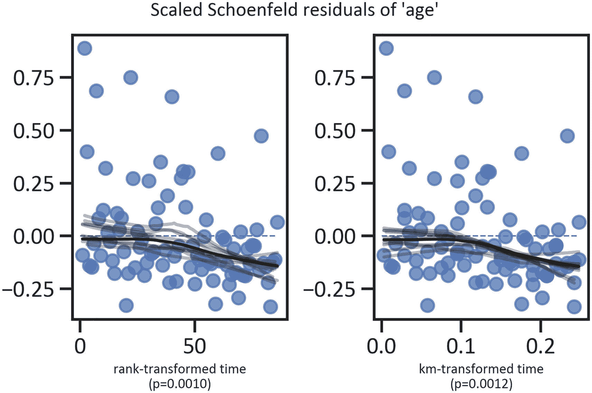
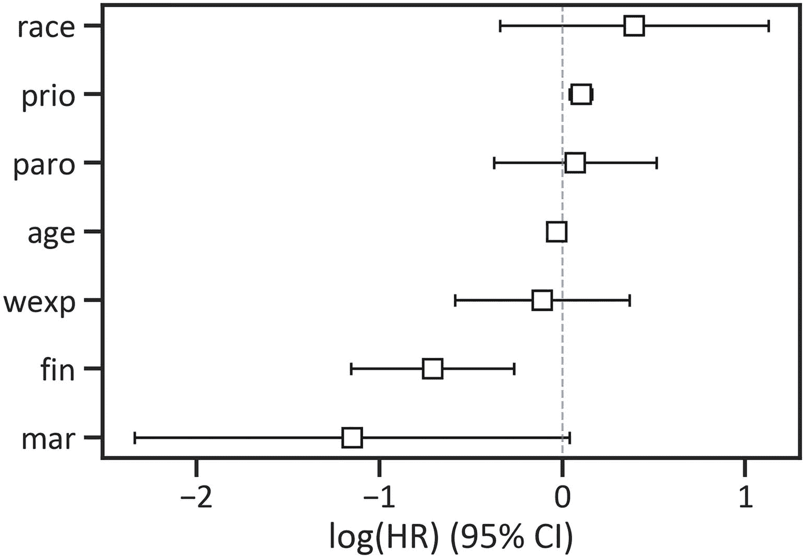

# 四、PySpark 和生命线生存分析

本章使用主要的 Python 框架(即 Lifelines 和 PySpark)描述并执行了几种生存分析方法。它首先解释了考克斯比例风险模型背后的基本概念。然后介绍了加速失效时间法。

## 探索生存分析

生存方法在制造业、保险业和医学领域很常见。当一项独立的调查进行了很长时间，并且受试者在给定的时间进入和离开时，它们便于正确地评估风险。

这些方法在本章中被用来确定机器故障的概率和病人在疾病中存活的概率，以及其他应用。它们同样适用于缺失值(删失数据)。

## 探索 Cox 比例风险法

Cox 比例风险方法是处理受试者有相关变化的删失数据的最佳生存方法。它类似于 Mantel-Haenszel 方法，预计风险率是时间的函数。它指出，利率是协变量的函数。等式 [4-1](#Equ1) 定义了 Cox 比例风险法。


(方程式 4-1)

清单 [4-1](#PC1) 从一个 Microsoft Excel 文件中获取必要的数据。

```py
import pandas as pd
initial_data = pd.read_excel(r"filepath\survival_data.xlsx", index_col=[0])

Listing 4-1Attain the Data

```

清单 [4-2](#PC2) 找到划分数据的比率。

```py
int(initial_data.shape[0]) * 0.8

345.6

Listing 4-2Find the Ratio for Dividing the Data

```

清单 [4-3](#PC3) 划分数据。

```py
lifeline_training_data = initial_data.loc[:346]
lifeline_test_data = initial_data.loc[346:]

Listing 4-3Divide the Data

```

## 生命线在行动

本节使用生命线框架执行和评估 Cox 比例风险法。清单 [4-4](#PC4) 执行生命线考克斯比例风险法。

```py
from lifelines import CoxPHFitter
lifeline_cox_method = CoxPHFitter()
lifeline_cox_method.fit(lifeline_training_data, initial_data.columns[0], initial_data.columns[1])

Listing 4-4Execute the Lifeline Cox Proportional Hazards Method

```

列表 [4-5](#PC5) 计算测试统计量(见表 [4-1](#Tab1) )并使用缩放的舍恩菲尔德评估生命线考克斯比例风险法，这有助于揭示残差中的任何异常(见图 [4-1](#Fig1) )。



图 4-1

年龄的标度舍恩菲尔德残差

表 4-1

生命线 Cox 比例风险法的检验统计

<colgroup><col class="tcol1 align-left"> <col class="tcol2 align-left"> <col class="tcol3 align-left"> <col class="tcol4 align-left"></colgroup> 
|   |   | 

检验统计量

 | 

p

 |
| --- | --- | --- | --- |
| 年龄 | 公里 | Ten point five three | <0.005 |
| 等级 | Ten point seven eight | <0.005 |
| 鳍状物 | 公里 | Zero point one two | Zero point seven three |
| 等级 | Zero point one four | Zero point seven one |
| 瑕疵 | 公里 | Zero point one eight | Zero point six seven |
| 等级 | Zero point two | Zero point six six |
| 帕罗 | 公里 | Zero point one three | Zero point seven two |
| 等级 | Zero point one one | Zero point seven four |
| 优先级 | 公里 | Zero point four nine | Zero point four eight |
| 等级 | Zero point four seven | Zero point four nine |
| 人种 | 公里 | Zero point three four | Zero point five six |
| 等级 | Zero point three seven | Zero point five four |
| 温普 | 公里 | Eleven point nine one | <0.005 |
| 等级 | Eleven point six one | <0.005 |

```py
lifeline_cox_method_test_statistics_schoenfeld = lifeline_cox_method.check_assumptions(lifeline_training_data, show_plots=True)
lifeline_cox_method_test_statistics_schoenfeld

Listing 4-5Compute the Lifeline Cox Proportional Hazards Method’s Test Statistics and Residuals

```

清单 [4-6](#PC6) 确定生命线 Cox 比例风险法的评估总结(见表 [4-2](#Tab2) )。

表 4-2

Cox 比例风险总结

<colgroup><col class="tcol1 align-left"> <col class="tcol2 align-left"> <col class="tcol3 align-left"> <col class="tcol4 align-left"> <col class="tcol5 align-left"> <col class="tcol6 align-left"> <col class="tcol7 align-left"> <col class="tcol8 align-left"> <col class="tcol9 align-left"> <col class="tcol10 align-left"> <col class="tcol11 align-left"></colgroup> 
| 

系数向量

 | 

Exp（coef）

 | 

Se（coef）

 | 

系数低于 95%

 | 

上科夫 95%

 | 

支出(系数)降低 95%

 | 

Exp（coef） Upper 95%

 | 

Z

 | 

P

 | 

-log2(p)

 |   |
| --- | --- | --- | --- | --- | --- | --- | --- | --- | --- | --- |
| 鳍状物 | -0.71 | Zero point four nine | Zero point two three | -1.16 | -0.27 | Zero point three one | Zero point seven seven | -3.13 | <0.005 | Nine point one four |
| 年龄 | -0.03 | Zero point nine seven | Zero point zero two | -0.08 | Zero point zero one | Zero point nine three | One point zero one | -1.38 | Zero point one seven | Two point five seven |
| 人种 | Zero point three nine | One point four eight | Zero point three seven | -0.34 | One point one three | Zero point seven one | Three point zero nine | One point zero five | Zero point three | One point seven six |
| 温普 | -0.11 | Zero point nine | Zero point two four | -0.59 | Zero point three seven | Zero point five six | One point four four | -0.45 | Zero point six five | Zero point six two |
| 瑕疵 | -1.15 | Zero point three two | Zero point six one | -2.34 | Zero point zero four | Zero point one | One point zero four | -1.90 | Zero point zero six | Four point one one |
| 帕罗 | Zero point zero seven | One point zero seven | Zero point two three | -0.37 | Zero point five one | Zero point six nine | One point six seven | Zero point three one | Zero point seven six | Zero point four |
| 优先级 | Zero point one | One point one one | Zero point zero three | Zero point zero four | Zero point one six | One point zero four | One point one seven | Three point two four | <0.005 | Nine point seven three |

```py
lifeline_cox_method_assessment_summary = lifeline_cox_method.print_summary()
lifeline_cox_method_assessment_summary

Listing 4-6Compute the Assessment Summary

```

列表 [4-7](#PC7) 确定数据中每个特征的对数测试置信区间(见图 [4-2](#Fig2) )。



图 4-2

对数检验置信区间

```py
lifeline_cox_log_test_ci = lifeline_cox_method.plot()
lifeline_cox_log_test_ci

Listing 4-7Execute the Lifeline Cox Proportional Hazards Method

```

## 探索加速失效时间方法

加速失效时间法用对数线性函数来模拟截尾数据，以描述存活时间的对数。同样，它还假设每个实例都是独立的。

### PySpark 在行动

本节使用 PySpark 框架执行加速故障时间方法。

清单 [4-8](#PC8) 用`findspark`框架运行 PySpark 框架。

```py
import findspark as initiate_pyspark
initiate_pyspark.init("filepath\spark-3.0.0-bin-hadoop2.7")

Listing 4-8Prepare the PySpark Framework

```

清单 [4-9](#PC9) 使用`SparkConf()`方法规定了 PySpark 应用程序。

```py
from pyspark import SparkConf
pyspark_configuration = SparkConf().setAppName("pyspark_aft_method").setMaster("local")

Listing 4-9Stipulate the PySpark App

```

清单 [4-10](#PC10) 使用`SparkSession()`方法准备`PySpark`会话。

```py
from pyspark.sql import SparkSession
pyspark_session = SparkSession(pyspark_context)
from pyspark.sql import SparkSession

Listing 4-10Prepare the Spark Session

```

清单 [4-11](#PC11) 使用`createDataFrame()`方法将本章前面创建的`pandas`数据帧更改为 PySpark 数据帧。

```py
pyspark_initial_data = pyspark_session.createDataFrame(initial_data)

Listing 4-11Change the Pandas Dataframe to a PySpark Dataframe

```

清单 [4-12](#PC12) 为独立特性创建一个列表，为从属特性创建一个字符串。它使用 PySpark 框架建模的`VectorAssembler()`方法转换数据。

```py
x_list = list(initial_data.iloc[::, 0:9].columns)
from pyspark.ml.feature import VectorAssembler
pyspark_data_columns = x_list
pyspark_vector_assembler = VectorAssembler(inputCols=pyspark_data_columns, outputCol="variables")
pyspark_data = pyspark_vector_assembler.transform(pyspark_initial_data)

Listing 4-12Transform the Data

```

清单 [4-13](#PC13) 执行 PySpark 加速故障时间方法。

```py
from pyspark.ml.regression import AFTSurvivalRegression
pyspark_accelerated_failure_method = AFTSurvivalRegression(censorCol=pyspark_data.columns[1], labelCol=pyspark_data.columns[0],featuresCol="variables",)
pyspark_accelerated_failure_method_fitted = pyspark_accelerated_failure_method.fit(pyspark_data)

Listing 4-13Execute the PySpark Accelerated Failure Time Method

```

清单 [4-14](#PC14) 计算 PySpark 加速故障时间方法的预测值。

```py
pyspark_accelerated_failure_method_fitted.transform(pyspark_data).select(pyspark_data.columns[1],"prediction")
pyspark_yhat.show()

+------+------------------+
|arrest|        prediction|
+------+------------------+
|     1|18.883982665910125|
|     1| 16.88228128814963|
|     1|22.631360777172517|
|     0|373.13041474613107|
|     0| 377.2238319806288|
|     0| 375.8326538406928|
|     1|  20.9780526816987|
|     0| 374.6420738270714|
|     0| 379.7483494080467|
|     0| 376.1601473382181|
|     0| 377.1412349521787|
|     0| 373.7536844216336|
|     1| 36.36443059383637|
|     0|374.14261327949384|
|     1| 22.98494042401171|
|     1| 50.61463874375869|
|     1| 25.56399364288275|
|     0|379.61997114629696|
|     0| 384.3322960430372|
|     0|376.37634062210844|
+------+------------------+

Listing 4-14Compute the PySpark Accelerated Failure Time Method’s Predictions

```

清单 [4-15](#PC15) 计算 PySpark 加速失效时间方法的系数。

```py
pyspark_accelerated_failure_method_fitted.coefficients

DenseVector([0.0388, -1.7679, -0.0162, -0.0003, 0.0098, -0.0086, -0.0026, 0.0115, 0.0003])

Listing 4-15Compute the PySpark Accelerated Failure Time Method’s Coefficients

```

## 结论

本章执行了两个关键的机器学习框架(Lifeline 和 PySpark ),用 Cox 比例风险和加速故障时间方法对删失数据进行建模。