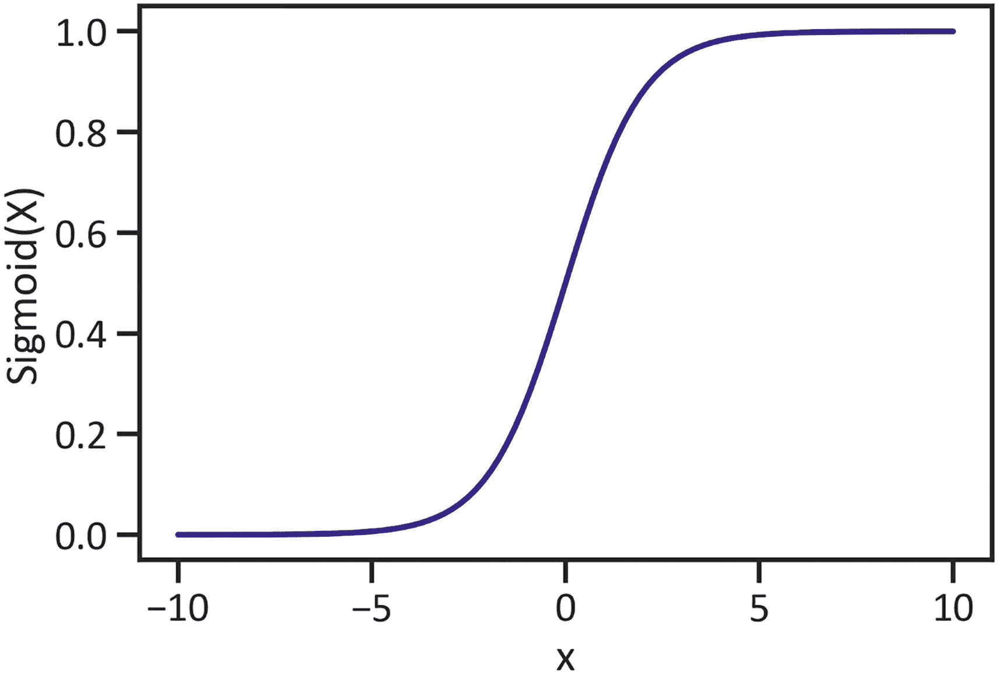
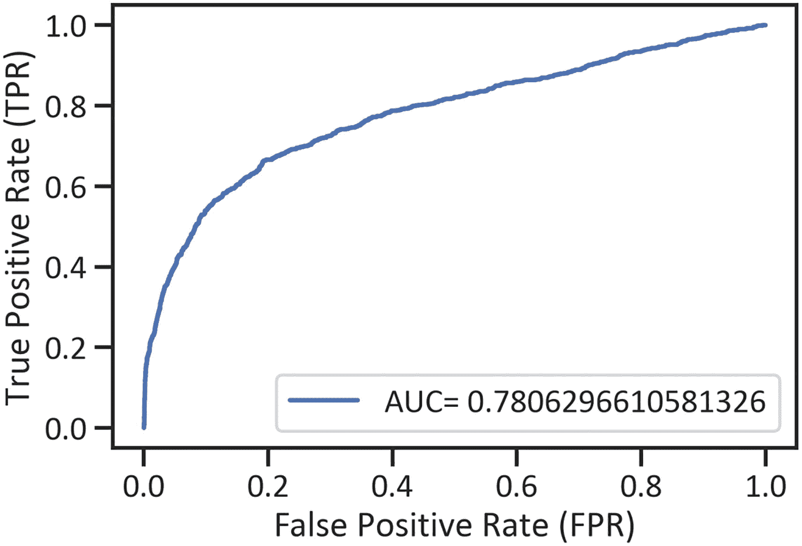
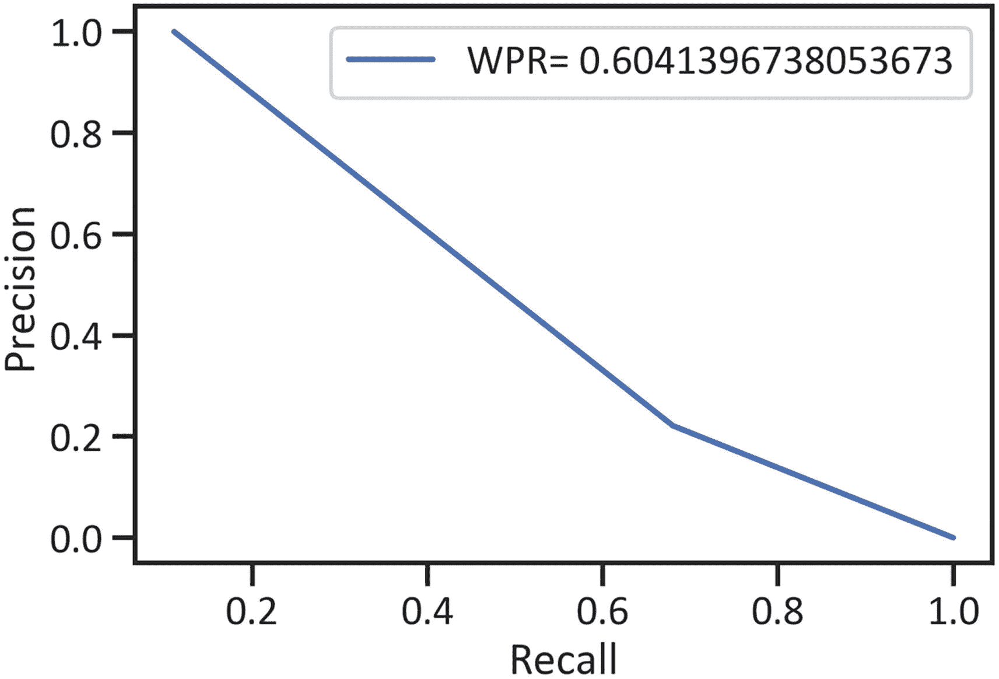
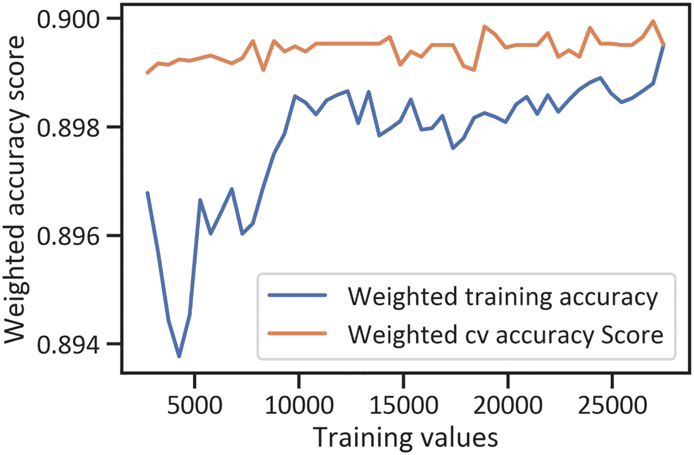
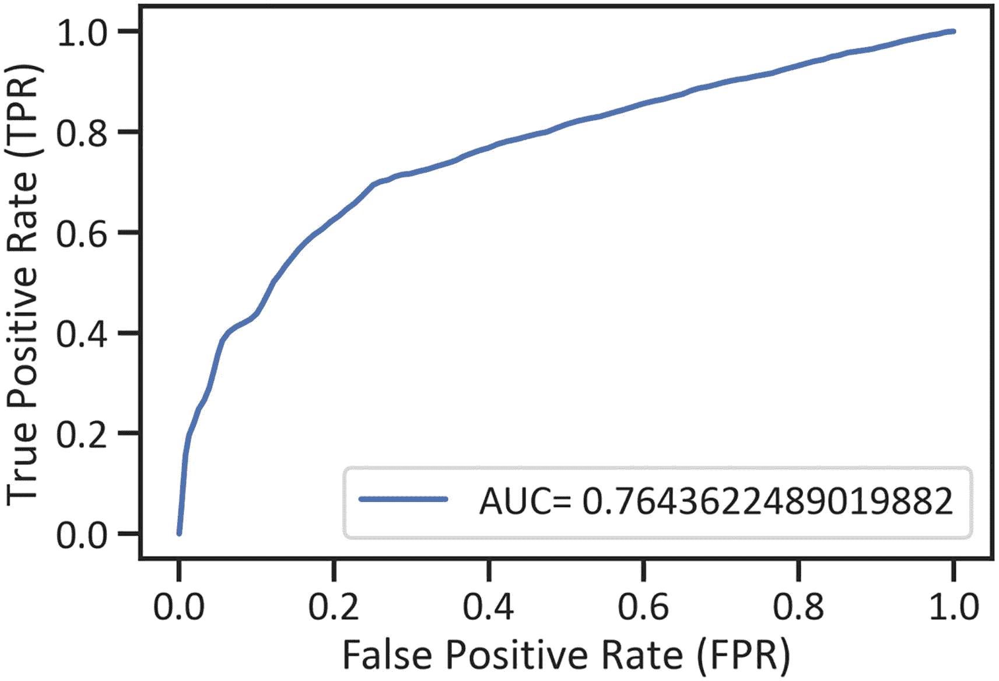
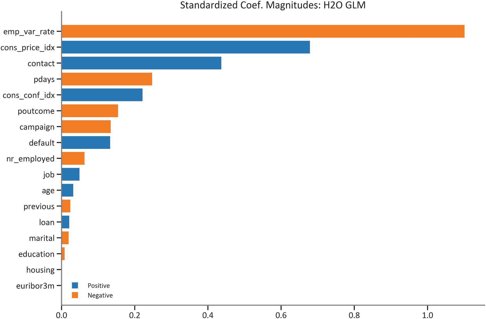
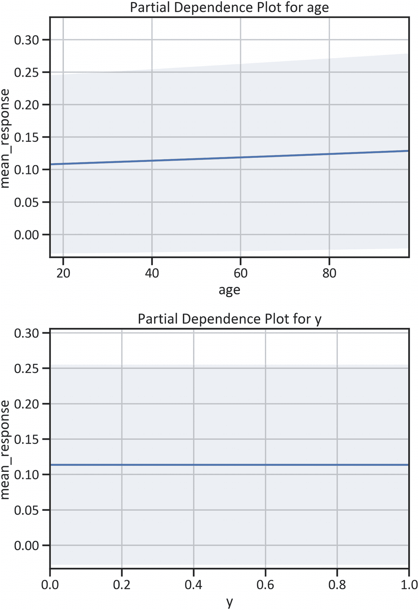
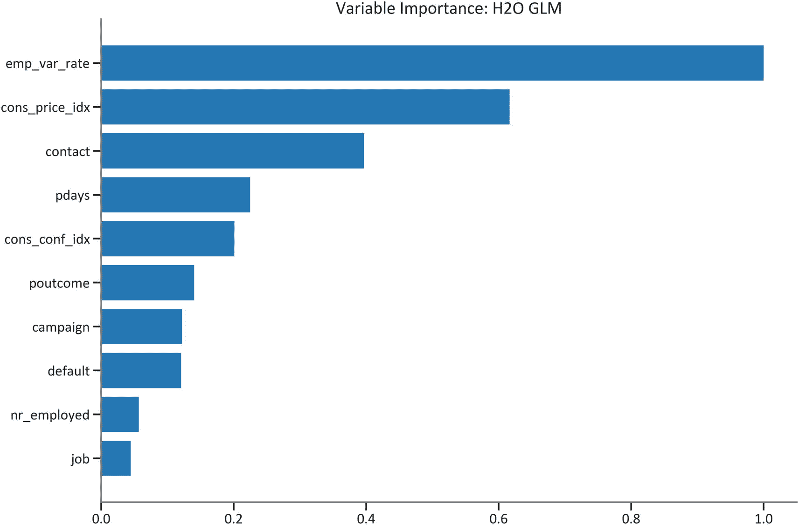
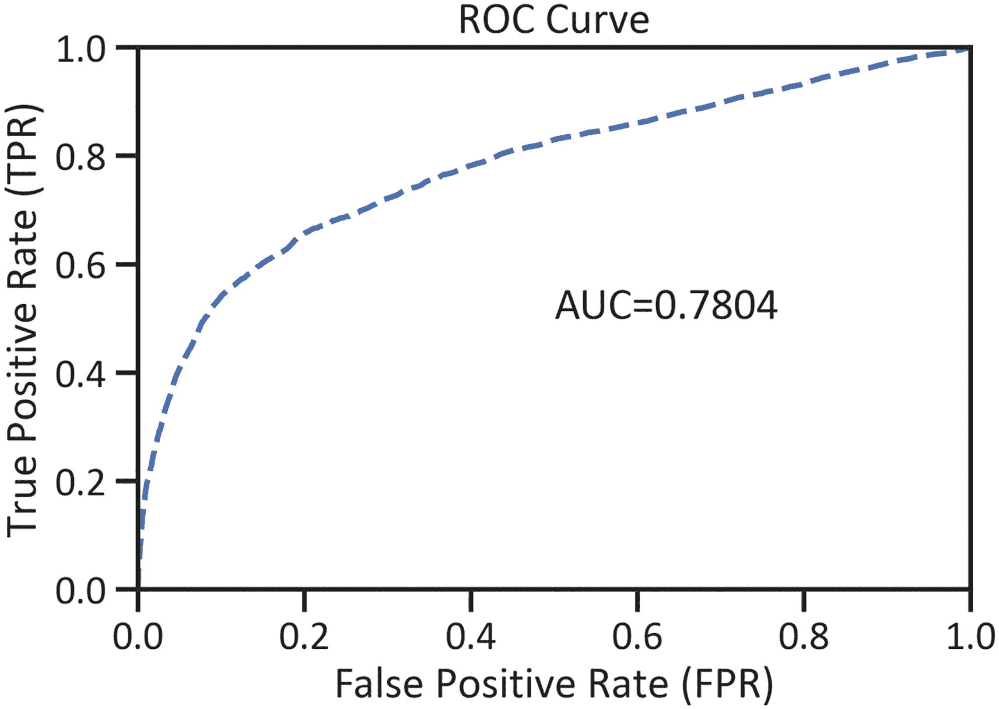

# 五、Scikit-Learn、PySpark 和 H2O 非线性建模

本章使用一组不同的综合 Python 框架(即 Scikit-Learn、Spark MLlib 和 H2O)执行并评估了一种用于二元分类的非线性方法(称为*逻辑回归*)。首先，它阐明了 sigmoid 函数背后的基本概念。

## 探索逻辑回归方法

逻辑回归方法一致接受值，然后通过执行函数( *sigmoid* )对它们进行建模，以预测分类输出要素的值。等式 [5-1](#Equ1) 定义了适用于逻辑回归的 sigmoid 函数(也见图 [5-1](#Fig1) )。


(方程式 5-1)

等式 [5-1](#Equ1) 和图 [5-1](#Fig1) 都表明该函数产生二进制输出值。



图 5-1

Sigmoid 函数

清单 [5-1](#PC1) 使用`pandas`框架从微软 CSV 文件中获取必要的数据。

```py
import pandas as pd
df = pd.read_csv(r"C:\Users\i5 lenov\Downloads\banking.csv")

Listing 5-1Attain the Data

```

清单 [5-2](#PC2) 规定了要删除的列名，然后执行`drop()`方法。为了删除数据中不必要的列，它将轴指定为`columns`。

```py
drop_column_names = df.columns[[8, 9, 10]]
initial_data = df.drop(drop_column_names, axis="columns")

Listing 5-2Drop Unnecessary Features in the Data

```

清单 [5-3](#PC3) 获得数据中分类特征的虚拟值。

```py
initial_data.iloc[::, 1] = pd.get_dummies(initial_data.iloc[::, 1])
initial_data.iloc[::, 2] = pd.get_dummies(initial_data.iloc[::, 2])
initial_data.iloc[::, 3] = pd.get_dummies(initial_data.iloc[::, 3])
initial_data.iloc[::, 4] = pd.get_dummies(initial_data.iloc[::, 4])
initial_data.iloc[::, 5] = pd.get_dummies(initial_data.iloc[::, 5])
initial_data.iloc[::, 6] = pd.get_dummies(initial_data.iloc[::, 6])
initial_data.iloc[::, 7] = pd.get_dummies(initial_data.iloc[::, 7])
initial_data.iloc[::, 11] = pd.get_dummies(initial_data.iloc[::, 11])

Listing 5-3Attain Dummy Features

```

清单 [5-4](#PC4) 删除空值。

```py
initial_data = initial_data.dropna()

Listing 5-4Drop Null Values

```

### sci kit-在行动中学习

本节使用 Scikit-Learn 框架执行和评估逻辑回归方法。清单 [5-5](#PC5) 概述了独立和从属特征。

```py
import numpy as np
x = np.array(initial_data.iloc[::, 0:17])
y = np.array(initial_data.iloc[::,-1])

Listing 5-5Outline the Features

```

清单 [5-6](#PC6) 随机划分数据帧。

```py
from sklearn.model_selection import train_test_split
x_train, x_test, y_train, y_test = train_test_split(x, y, test_size=0.2, random_state=0)

Listing 5-6Randomly Divide the Dataframe

```

清单 [5-7](#PC7) 缩放独立特征。

```py
from sklearn.preprocessing import StandardScaler
sk_standard_scaler = StandardScaler()
sk_standard_scaled_x_train = sk_standard_scaler.fit_transform(x_train)
sk_standard_scaled_x_test = sk_standard_scaler.transform(x_test)

Listing 5-7Scale Independent Features

```

清单 [5-8](#PC8) 执行 Scikit-Learn 逻辑回归方法。

```py
from sklearn.linear_model import LogisticRegression
sk_logistic_regression_method = LogisticRegression()
sk_logistic_regression_method.fit(sk_standard_scaled_x_train,  y_train)

Listing 5-8Execute the Scikit-Learn Logistic Regression Method

```

清单 [5-9](#PC9) 确定了 Scikit-Learn 逻辑回归方法的最佳超参数。

```py
from sklearn.model_selection import GridSearchCV
sk_logistic_regression_method_param = {"penalty":("l1","l2")}
sk_logistic_regression_method_param_mod  = GridSearchCV(estimator=sk_logistic_regression_method, param_grid=sk_logistic_regression_method_param, n_jobs=-1)
sk_logistic_regression_method_param_mod.fit(sk_standard_scaled_x_train, y_train)
print("Best logistic regression score: ", sk_logistic_regression_method_param_mod.best_score_)
print("Best logistic regression parameter: ", sk_logistic_regression_method_param_mod.best_params_)
Best logistic regression score:  0.8986039453717755
Best logistic regression parameter:  {'penalty': 'l2'}

Listing 5-9Determine the Best Hyperparameters for the Scikit-Learn Logistic Regression Method

```

清单 [5-10](#PC10) 使用 Scikit-Learn 框架执行逻辑回归方法。

```py
sk_logistic_regression_method = LogisticRegression(penalty="l2")
sk_logistic_regression_method.fit(sk_standard_scaled_x_train, y_train)

Listing 5-10Execute the Scikit-Learn Logistic Regression Method

```

清单 [5-11](#PC11) 计算逻辑回归方法的截距。

```py
print(sk_logistic_regression_method.intercept_)
[-2.4596243]

Listing 5-11Compute the Logistic Regression Method’s Intercept

```

清单 [5-12](#PC12) 计算系数。

```py
print(sk_logistic_regression_method.coef_)
[[ 0.03374725  0.04330667 -0.01305369 -0.02709009  0.13508899  0.01735913
   0.00816758  0.42948983 -0.12670658 -0.25784955 -0.04025993 -0.14622466
  -1.14143485  0.70803518  0.23256046 -0.02295578 -0.02857435]]

Listing 5-12Compute the Logistic Regression Method’s Coefficients

```

清单 [5-13](#PC13) 计算 Scikit-Learn 逻辑回归方法的混淆矩阵，它包括两种形式的错误——假阳性和假阴性以及真阳性和真阴性(见表 [5-1](#Tab1) )。

表 5-1

Scikit-Learn 逻辑回归方法的混淆矩阵

<colgroup><col class="tcol1 align-left"> <col class="tcol2 align-left"> <col class="tcol3 align-left"></colgroup> 
|   | 

预测:存款

 | 

预测:无存款

 |
| --- | --- | --- |
| 实际:存款 | Seven thousand two hundred and thirty | Ninety-five |
| 实际:无存款 | Seven hundred and eleven | Two hundred and two |

```py
from sklearn import metrics
sk_logistic_regression_method_assessment_1 = pd.DataFrame(metrics.confusion_matrix(y_test, sk_yhat), index=["Actual: Deposit","Actual: No deposit"], columns=("Predicted: deposit","Predicted: No deposit"))
print(sk_logistic_regression_method_assessment_1)

Listing 5-13Compute the Scikit-Learn Logistic Regression Method’s Confusion Matrix

```

清单 [5-14](#PC14) 计算适当的分类报告(见表 [5-2](#Tab2) )。

表 5-2

Scikit-Learn 逻辑回归方法的分类报告

<colgroup><col class="tcol1 align-left"> <col class="tcol2 align-left"> <col class="tcol3 align-left"> <col class="tcol4 align-left"> <col class="tcol5 align-left"></colgroup> 
|   | 

精确

 | 

回忆

 | 

f1-分数

 | 

支持

 |
| --- | --- | --- | --- | --- |
| Zero | 0.910465 | 0.987031 | 0.947203 | 7325.000000 |
| one | 0.680135 | 0.221249 | 0.333884 | 913.000000 |
| 准确 | 0.902161 | 0.902161 | 0.902161 | 0.902161 |
| Avg 宏 | 0.795300 | 0.604140 | 0.640544 | 8238.000000 |
| 加权平均值 | 0.884938 | 0.902161 | 0.879230 | 8238.000000 |

```py
sk_logistic_regression_method_assessment_2 = pd.DataFrame(metrics.classification_report(y_test, sk_yhat, output_dict=True)).transpose()
print(sk_logistic_regression_method_assessment_2)

Listing 5-14Compute the Scikit-Learn Logistic Regression Method’s Classification Report

```

清单 [5-15](#PC15) 排列了 Scikit-Learn 逻辑回归方法的接收器操作特性曲线。目标是浓缩真阳性率(方法正确区分阳性类别的倾向)和假阳性率(方法正确区分阴性类别的倾向)的排列。见图 [5-2](#Fig2) 。



图 5-2

Scikit-Learn 逻辑回归方法的接收器操作特征曲线

```py
sk_yhat_proba = sk_logistic_regression_method.predict_proba(sk_standard_scaled_x_test)[::,1]
fpr_sk_logistic_regression_method, tprr_sk_logistic_regression_method, _ = metrics.roc_curve(y_test, sk_yhat_proba)
area_under_curve_sk_logistic_regression_method = metrics.roc_auc_score(y_test, sk_yhat_proba)
plt.plot(fpr_sk_logistic_regression_method, tprr_sk_logistic_regression_method, label="AUC= "+ str(area_under_curve_sk_logistic_regression_method))
plt.xlabel("False Positive Rate (FPR)")
plt.ylabel("True Positive Rate (TPR)")
plt.legend(loc="best")
plt.show()

Listing 5-15Receiver Operating Characteristics Curve for the Scikit-Learn Logistic Regression Method

```

清单 [5-16](#PC16) 排列了 Scikit-Learn 逻辑回归方法的精度-召回曲线，以浓缩精度和召回的排列(见图 [5-3](#Fig3) )。



图 5-3

Scikit-Learn 逻辑回归方法的精度-召回曲线

```py
p_sk_logistic_regression_method, r__sk_logistic_regression_method, _ = metrics.precision_recall_curve(y_test, sk_yhat)
weighted_ps_sk_logistic_regression_method = metrics.roc_auc_score(y_test, sk_yhat)
plt.plot(p_sk_logistic_regression_method, r__sk_logistic_regression_method,
         label="WPR= " +str(weighted_ps_sk_logistic_regression_method))
plt.xlabel("Recall")
plt.ylabel("Precision")
plt.legend(loc="best")
plt.show()

Listing 5-16Precision-Recall Curve for the Scikit-Learn Logistic Regression Method

```

清单 [5-17](#PC17) 安排了 Scikit-Learn 逻辑回归方法的学习曲线，以揭示加权训练和交叉验证准确性的变化(见图 [5-4](#Fig4) )。



图 5-4

Scikit-Learn 执行的逻辑回归方法的学习曲线

```py
from sklearn.model_selection import learning_curve
train_port_sk_logistic_regression_method, trainscoresk_logistic_regression_method, testscoresk_logistic_regression_method = learning_curve(sk_logistic_regression_method, x, y,
                      cv=3, n_jobs=-5, train_sizes=np.linspace(0.1,1.0,50))
trainscoresk_logistic_regression_method_mean = np.mean(trainscoresk_logistic_regression_method, axis=1)
testscoresk_logistic_regression_method_mean = np.mean(testscoresk_logistic_regression_method, axis=1)
plt.plot(train_port_sk_logistic_regression_method, trainscoresk_logistic_regression_method_mean, label="Weighted training accuracy")
plt.plot(train_port_sk_logistic_regression_method, testscoresk_logistic_regression_method_mean, label="Weighted cv accuracy Score")
plt.xlabel("Training values")
plt.ylabel("Weighted accuracy score")
plt.legend(loc="best")
plt.show()

Listing 5-17Learning Curve for the Logistic Regression Method Executed by Scikit-Learn

```

### PySpark 在行动

本节使用 PySpark 框架执行和评估逻辑回归方法。

清单 [5-18](#PC18) 使用`findspark`框架准备 PySpark 框架。

```py
import findspark as initiate_pyspark
initiate_pyspark.init("filepath\spark-3.0.0-bin-hadoop2.7")

Listing 5-18Prepare the PySpark Framework

```

清单 [5-19](#PC19) 使用`SparkConf()`方法规定了 PySpark 应用程序。

```py
from pyspark import SparkConf
pyspark_configuration = SparkConf().setAppName("pyspark_logistic_regression_method").setMaster("local")

Listing 5-19Stipulate the PySpark App

```

清单 [5-20](#PC20) 使用`SparkSession()`方法准备 PySpark 会话。

```py
from pyspark.sql import SparkSession
pyspark_session = SparkSession(pyspark_context)

Listing 5-20Prepare the Spark Session

```

清单 [5-21](#PC21) 使用`createDataFrame()`方法将本章前面创建的`pandas`数据帧更改为 PySpark 数据帧。

```py
pyspark_initial_data = pyspark_session.createDataFrame(initial_data)

Listing 5-21Change the Pandas Dataframe to a PySpark Dataframe

```

清单 [5-22](#PC22) 创建一个独立特征列表和一个从属特征字符串。然后，它使用 PySpark 框架建模的`VectorAssembler()`方法转换数据。

```py
x_list = list(initial_data.iloc[::, 0:17].columns)
y_list = str(initial_data.columns[-1])
from pyspark.ml.feature import VectorAssembler
pyspark_data_columns = x_list
pyspark_vector_assembler = VectorAssembler(inputCols=pyspark_data_columns, outputCol="features")
pyspark_data = pyspark_vector_assembler.transform(pyspark_initial_data)

Listing 5-22Transform the Data

```

清单 [5-23](#PC23) 使用`randomSplit()`方法划分数据。

```py
(pyspark_training_data, pyspark_test_data) = pyspark_data.randomSplit([.8,.2])

Listing 5-23Divide the Dataframe

```

清单 [5-24](#PC24) 执行 PySpark 逻辑回归方法。

```py
from pyspark.ml.classification import LogisticRegression
pyspark_logistic_regression_method = LogisticRegression(labelCol = y_list, featuresCol = "features")
pyspark_logistic_regression_method_fitted = pyspark_logistic_regression_method.fit(pyspark_training_data)

Listing 5-24Execute the PySpark Logistic Regression Method

```

清单 [5-25](#PC25) 计算 PySpark 逻辑回归方法的预测。

```py
pyspark_yhat = pyspark_logistic_regression_method_fitted.transform(pyspark_test_data)

Listing 5-25Logistic Regression Method Predictions (Method Executed with PySpark Framework)

```

列表 [5-26](#PC26) 排列 PySpark 逻辑回归方法的接收机工作特性曲线，以浓缩精度和召回率的排列(见图 [5-5](#Fig5) )。



图 5-5

PySpark 逻辑回归法的接收机工作特性曲线

```py
pyspark_logistic_regression_method_assessment = pyspark_logistic_regression_method_fitted.summary
pyspark_logistic_regression_method_roc = pyspark_logistic_regression_method_assessment.roc.toPandas()
pyspark_logistic_regression_method_auroc = pyspark_logistic_regression_method_assessment.areaUnderROC
plt.plot(pyspark_logistic_regression_method_roc["FPR"], pyspark_logistic_regression_method_roc["TPR"],
         label="AUC= "+str(pyspark_logistic_regression_method_auroc))
plt.xlabel("False Positive Rate (FPR)")
plt.ylabel("True Positive Rate (TPR)")
plt.legend(loc=4)
plt.show()

Listing 5-26Receiver Operating Characteristics Curve for the PySpark Logistic Regression Method

```

清单 [5-27](#PC27) 整理了 PySpark 逻辑回归方法的精度-召回曲线，浓缩了精度和召回的安排(图 [5-6](#Fig6) )。


图 5-6

PySpark 逻辑回归方法的精度-召回曲线

```py
pyspark_logistic_regression_method_assessment = pyspark_logistic_regression_method_fitted.summary
pyspark_logistic_regression_method_assessment_pr = pyspark_logistic_regression_method_assessment.pr.toPandas()
pyspark_logistic_regression_method_assessment_wpr = pyspark_logistic_regression_method_assessment.weightedPrecision
plt.plot(pyspark_logistic_regression_method_assessment_pr["precision"],
         pyspark_logistic_regression_method_assessment_pr["recall"],
         label="WPR: "+str(pyspark_logistic_regression_method_assessment_wpr))
plt.xlabel("Precision")
plt.ylabel("Recall")
plt.legend(loc="best")
plt.show()

Listing 5-27Precision-Recall Curve for the PySpark Logistic Regression Method

```

## H2O 在行动

本部分使用`H2O`框架执行和评估逻辑回归方法。清单 [5-28](#PC28) 准备 H2O 框架。

```py
import h2o as initialize_h2o
initialize_h2o.init()

Listing 5-28Prepare the H2O Framework

```

清单 [5-29](#PC29) 将`pandas`数据帧更改为 H2O 数据帧。

```py
h2o_data = initialize_h2o.H2OFrame(initial_data)

Listing 5-29Change the Pandas Dataframe to H2O Dataframe

```

清单 [5-30](#PC30) 概述了独立和从属特征。

```py
x_list = list(initial_data.iloc[::, 0:17].columns)
y_list = str(initial_data.columns[-1])
y = y_list
x = h2o_data.col_names
x.remove(y_list)

Listing 5-30Outline the Features

```

清单 [5-31](#PC31) 随机划分数据。

```py
h2o_training_data, h2o_validation_data, h2o_test_data = h2o_data.split_frame(ratios=[.8,.1])

Listing 5-31Randomly Divide the Dataframe

```

清单 [5-32](#PC32) 执行 H2O 逻辑回归方法。

```py
from h2o.estimators.glm import H2OGeneralizedLinearEstimator
h2o_logistic_regression_method = H2OGeneralizedLinearEstimator(family="binomial")
h2o_logistic_regression_method.train(x = x, y = y, training_frame = h2o_training_data, validation_frame = h2o_validation_data)

Listing 5-32Execute the H2O Logistic Regression Method

```

清单 [5-33](#PC33) 计算 H2O 逻辑回归方法的预测。

```py
h2o_yhat = h2o_logistic_regression_method.predict(h2o_test_data)

Listing 5-33Compute the H2O Logistic Regression Method’s Predictions

```

清单 [5-34](#PC34) 计算 H2O 逻辑回归方法的预测值(见图 [5-7](#Fig7) )。



图 5-7

H2O 逻辑回归方法的标准化系数

```py
h2o_logistic_regression_method_std_coefficients = h2o_logistic_regression_method.std_coef_plot()
h2o_logistic_regression_method_std_coefficients

Listing 5-34Compute the H2O Logistic Regression Method’s Standardized Coefficients

```

清单 [5-35](#PC35) 计算 H2O 逻辑回归方法的部分相关性(见图 [5-8](#Fig8) )。



图 5-8

H2O 逻辑回归方法的标准化系数

```py
h2o_logistic_regression_method_dependency_plot = h2o_logistic_regression_method.partial_plot(data = h2o_data, cols = list(initial_data.columns[[0, 17]]), server=False, plot = True)
h2o_logistic_regression_method_dependency_plot

Listing 5-35Compute the H2O Logistic Regression Method’s Partial Dependency

```

清单 [5-36](#PC36) 按升序排列对 H2O 逻辑回归方法最重要的特征(见图 [5-9](#Fig9) )。



图 5-9

H2O 逻辑回归方法的方差重要性

```py
h2o_logistic_regression_method_feature_importance = h2o_logistic_regression_method.varimp_plot()
h2o_logistic_regression_method_feature_importance

Listing 5-36Compute the H2O Logistic Regression Method’s Variance Importance

```

列表 [5-37](#PC37) 排列 H2O 逻辑回归方法的受试者工作特征曲线，浓缩真阳性率和假阳性率的排列(见图 [5-10](#Fig10) )。



图 5-10

H2O 逻辑回归法的受试者工作特征曲线

```py
h2o_logistic_regression_method_assessment = h2o_logistic_regression_method.model_performance()

Listing 5-37Receiver Operating Characteristics Curve for the H2O Logistic Regression Method

```

## 结论

本章执行了三个关键的机器学习框架(Scikit-Learn、PySpark 和 H2O)来对数据进行建模，并使用逻辑回归方法生成具有两个类的分类输出特征。