# 二、应用回归的单变量消费研究

本章介绍了标准的单变量(或简单)线性回归模型，称为普通最小二乘模型，它在减少残差的同时估计截距和斜率(见方程 2-1)。它应用该模型来确定美国银行贷款利率与美国家庭每年消费的商品和服务的市场价值之间的关系。它包括进行协方差分析、相关性分析、模型开发、交叉验证、超参数优化和模型性能分析的方法。

普通最小二乘模型是最常见的参数方法之一。它建立了关于数据的强有力的主张——它期望*正态性*(使平均值饱和的变量的值)和*线性*(自变量和因变量之间的关联)。本章使用最常见的参数方法，称为*普通最小二乘模型，*来研究预测变量(自变量)和响应变量(因变量)之间的关联。它基于一个直线方程(见图 [2-1](#Fig1) )。

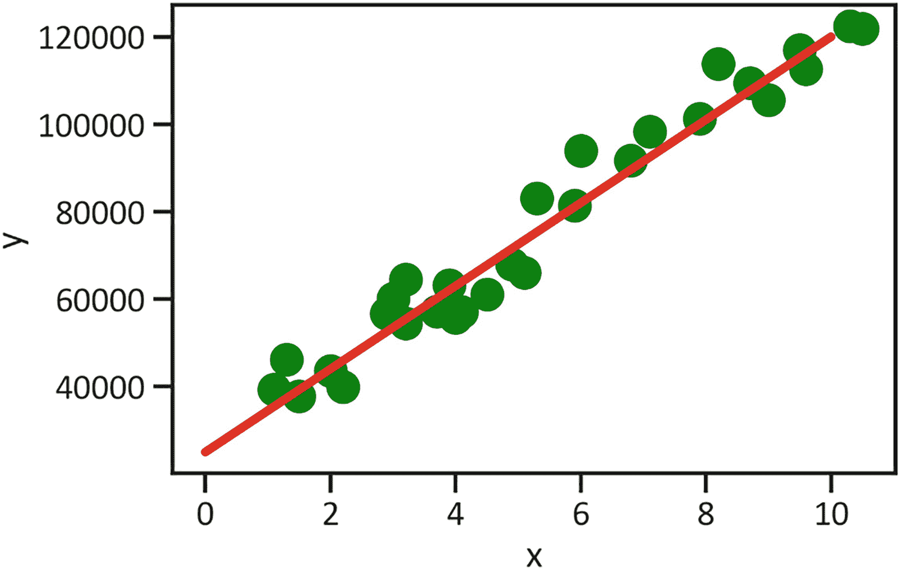

图 2-1

最佳拟合线

图 [2-1](#Fig1) 用红色显示一条直线，用绿色显示独立的数据点——这条线穿过数据点。方程 [2-1](#Equ1) 显示了普通的最小二乘方程。


(方程式 2-1)

其中是预测的响应变量(在本例中是预期的美国最终消费支出)，表示截距——表示响应变量的平均值(在本例中是以美元计算的美国最终消费支出)，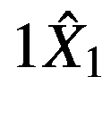表示预测变量(在本例中是美国贷款利率)，1 是斜率——表示 X(美国贷款利率)和最终消费支出(以当前美元计算)之间的关系方向。请看图[2-1](img/#Fig1)—斜率为正)中的红色直线。最后，用术语表示误差(参考等式 [2-2](img/#Equ2) )。

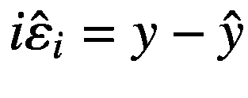

(方程式 2-2)

其中 *ε* <sub>*i*</sub> 为误差项(也称为*剩余项*)——代表 *yi* (美国实际最终消费支出)与 <sub>* i *</sub> (预测的美国最终消费支出)之差。

带帽/插入符号的变量(样本回归函数)和不带帽/插入符号的变量(总体回归函数)是有区别的。我们从总体样本中估计包含帽子/脱字符号的样本，而不是从整个总体中估计。

## 本章的背景

本章使用普通最小二乘回归模型来确定预测变量(以百分比表示的美国贷款利率)和响应变量(以当前美元计算的最终消费支出)之间的线性关系。表 [2-1](#Tab1) 概述了本章的宏观经济指标。

表 2-1

本章的美国宏观经济指标

<colgroup><col class="tcol1 align-left"> <col class="tcol2 align-left"></colgroup> 
| 

密码

 | 

标题

 |
| --- | --- |
| `FR.INR.LEND` | 贷款利率(百分比) |
| `NY.GDP.MKTP.KD.ZG` | 最终消费支出(现值美元) |

## 理论框架

图 [2-2](#Fig2) 显示了本章探讨的关系。确立了研究假设。


图 2-2

理论框架

HYPOTHESES

H <sub>0</sub> :美国贷款利率(%)与最终消费支出(以现值美元计)无显著差异。

H <sub>A</sub> :美国的社会贡献和最终消费支出(以现值美元计算)之间有很大的差异。

研究假设旨在确定美国贷款利率的变化是否会影响最终消费支出(以现值美元计)。

### 贷款利率

贷款利率是指私人银行对短期和中期贷款收取的利息。我们用年度百分比来表示这一估计。图 [2-3](#Fig3) 展示了美国私人银行从 1960 年到 2020 年收取的短期和中期融资利息。在继续之前，请确保您的环境中安装了 Matplotlib 库。要在 Python 环境中安装 Matplotlib 库，请使用`pip install matplotlib`。同样，要在 Conda 环境中安装库，使用`conda install -c conda-forge matplotlib`。见清单 [2-1](#PC1) 。

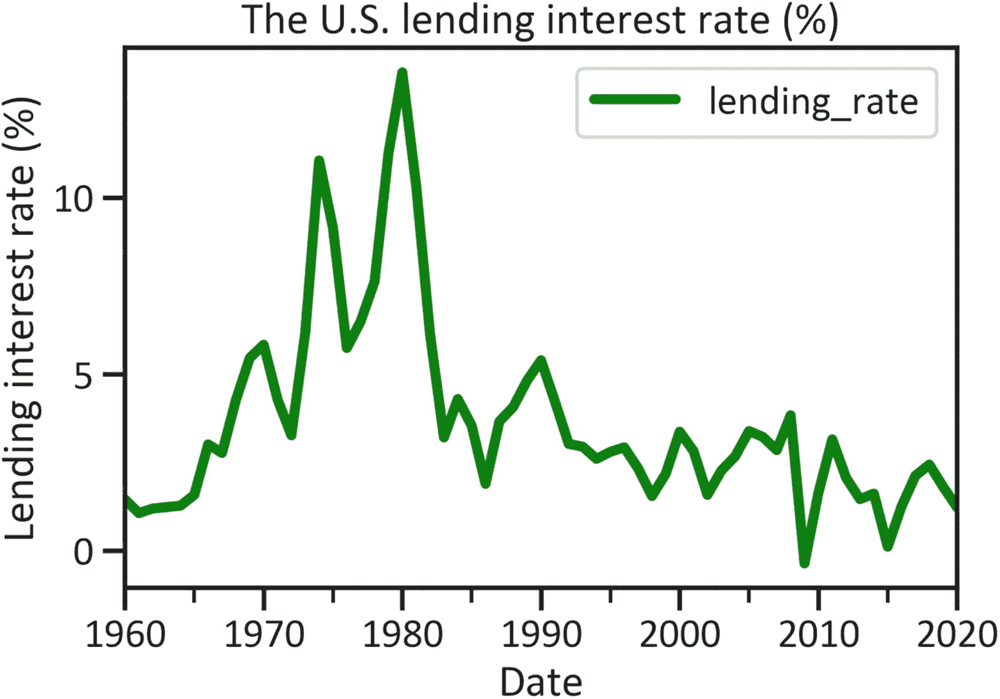

图 2-3

美国贷款利率

```py
import wbdata
from matplotlib.pyplot import
%matplotlib inline
country  = ["USA"]
indicator = {"FP.CPI.TOTL.ZG":"lending_rate"}
inflation_cpi = wbdata.get_dataframe(indicator, country=country,  convert_date=True)
inflation_cpi.plot(kind="line",color="green",lw=4)
plt.title("The U.S. lending interest rate (%)")
plt.ylabel("Lending interest rate (%)")
plt.xlabel("Date")
plt.legend(loc="best")
plt.show()

Listing 2-1The U.S. Lending Interest Rate

```

图 [2-3](#Fig3) 表明，从 1960 年到 1980 年，美国银行对私人短期和中期融资收取的利息从 1.45%增长到 13.55%(最高峰)。此后，在 20 世纪 80 年代初，失业率急剧下降，然后一直停滞不前。也显示出贷款利率在 2008 年达到最低点。总之，从美国银行收购债务在上世纪 70 年代末更昂贵，而在 2008 年相对便宜。

### 最终消费支出(现值美元)

最终消费支出是一个经济体中的家庭购买的一般商品和服务的市场价值(见清单 [2-2](#PC2) )。图 [2-4](#Fig4) 展示了美国从 1960 年到 2020 年的最终消费支出。

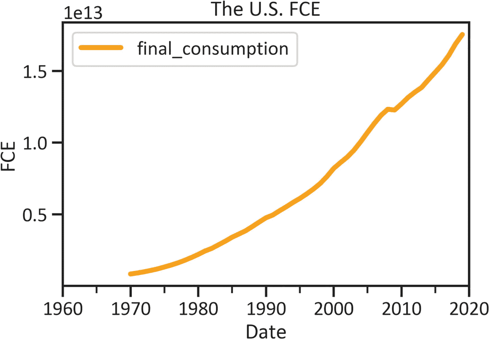

图 2-4

美国最终消费支出

```py
country = ["USA"]
indicator = {"NE.CON.TOTL.CD":"final_consumption"}
final_consumption = wbdata.get_dataframe(indicator, country=country, convert_date=True)
final_consumption.plot(kind="line",color="orange",lw=4)
plt.title("The U.S. FCE")
plt.ylabel("FCE")
plt.xlabel("Date")
plt.legend(loc="best")
plt.show()

Listing 2-2The U.S. Final Consumption Expenditure (Current U.S. Dollars)

```

图 [2-4](#Fig4) 显示，自 1970 年以来，美国家庭购买的一般商品和服务的市场价值一直在不断上升。

## 正态假设

正态分布也称为高斯分布。这本书交替使用这些术语。该分布显示了平均数据点周围的饱和数据点。普通的最小二乘回归模型假设数据点使平均数据点饱和，因此在根据美国贷款利率和最终消费支出数据训练模型之前，必须检测正态性。

### 常态检测

正态性检测包括调查数据点的集中趋势。如果美国贷款利率和最终消费支出数据达到平均数据点，您可以使用中心数据点汇总数据。一个额外的隐含假设是误差遵循正态假设，这使得它们更容易处理。要检测正态性，必须估计平均数据点(见等式 [2-3](#Equ3) )。


(方程式 2-3)

其中为平均值，*x*T3】1 为第一个数据点，*x*T7】2 为第二个数据点，以此类推， *n* 表示数据点的总数。你用自由度来划分数据点的数量。或者，您可以找到中间数据点(中心数据点)。为了确定离差，估计标准偏差(见等式 [2-4](img/#Equ4) )。

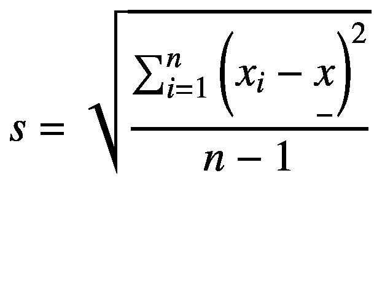

(方程式 2-4)

估计标准差后，你对其求平方，求方差(见方程 [2-5](#Equ5) )。

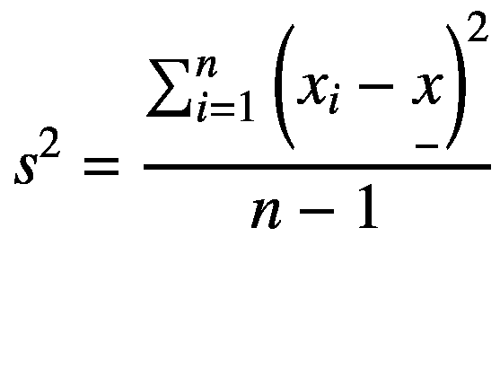

(方程式 2-5)

清单 [2-3](#PC3) 从世界银行检索与美国贷款利息和最终消费支出数据相关的数据。见表 [2-2](#Tab2) 。

表 2-2

美国贷款利率和最终消费支出数据

<colgroup><col class="tcol1 align-left"> <col class="tcol2 align-left"> <col class="tcol3 align-left"></colgroup> 
| 

日期

 | 

贷款利率

 | 

最终消费

 |
| --- | --- | --- |
| Two thousand and twenty | 3.544167 | 圆盘烤饼 |
| Two thousand and nineteen | 5.282500 | 1.753966e+13 |
| Two thousand and eighteen | 4.904167 | 1.688457e+13 |
| Two thousand and seventeen | 4.096667 | 1.608306e+13 |
| Two thousand and sixteen | 3.511667 | 1.543082e+13 |

```py
country  = ["USA"]
indicators = {"FR.INR.LEND":"lending_rate",
             "NE.CON.TOTL.CD":"final_consumption"}
df = wbdata.get_dataframe(indicators, country=country, freq="M", convert_date=False)
df.head()

Listing 2-3Load the U.S. Lending Interest Rate and Final Consumption Expenditure Data

```

表 [2-2](#Tab2) 显示数据中缺少数据点。列表 [2-4](#PC4) 用平均值替代缺失的数据点。

```py
df["lending_rate"] = df["lending_rate"].fillna(df["lending_rate"].mean())
df["final_consumption"] = df["final_consumption"].fillna(df["final_consumption"].mean())

Listing 2-4Replacing Missing Data Points with the Mean Value

```

## 描述统计学

有几种方法可以可视化和总结数据的分布。最简单的方法是使用箱线图。箱线图也有助于检测常态。该图确定了中间数据点的位置。它还告诉您分布尾部的长度，从而充分支持您诊断数据中的异常值。图 [2-5](#Fig5) 显示了清单 [2-5](#PC5) 中的代码创建的美国贷款利率的箱线图。

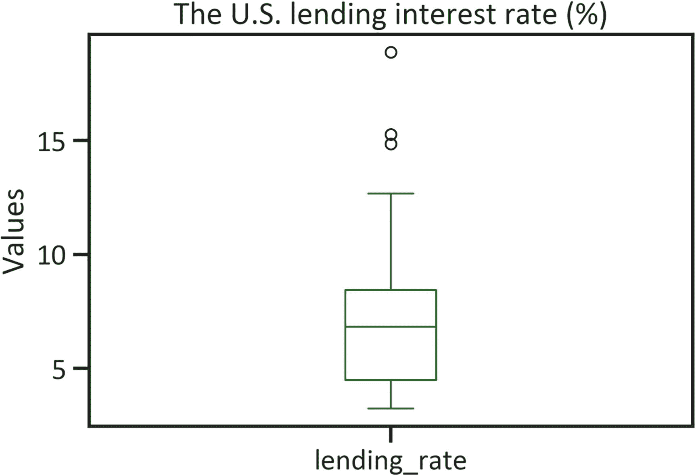

图 2-5

美国贷款利率

```py
df["lending_rate"].plot(kind="box",color="green")
plt.title("The U.S. lending interest rate (%)")
plt.ylabel("Values")
plt.show()

Listing 2-5The U.S. Lending Interest Rate Distribution

```

图 [2-5](#Fig5) 显示美国贷款利率数据存在三个极值。列表 [2-6](#PC6) 用平均数据点替换任何异常值，并确定新的分布(见图 [2-6](#Fig6) )。在继续之前，请确保您的环境中安装了 NumPy 库。要在 Python 环境中安装 NumPy 库，请使用`pip install numpy`。同样，要在 Conda 环境中安装库，使用`conda install -c anaconda numpy`。

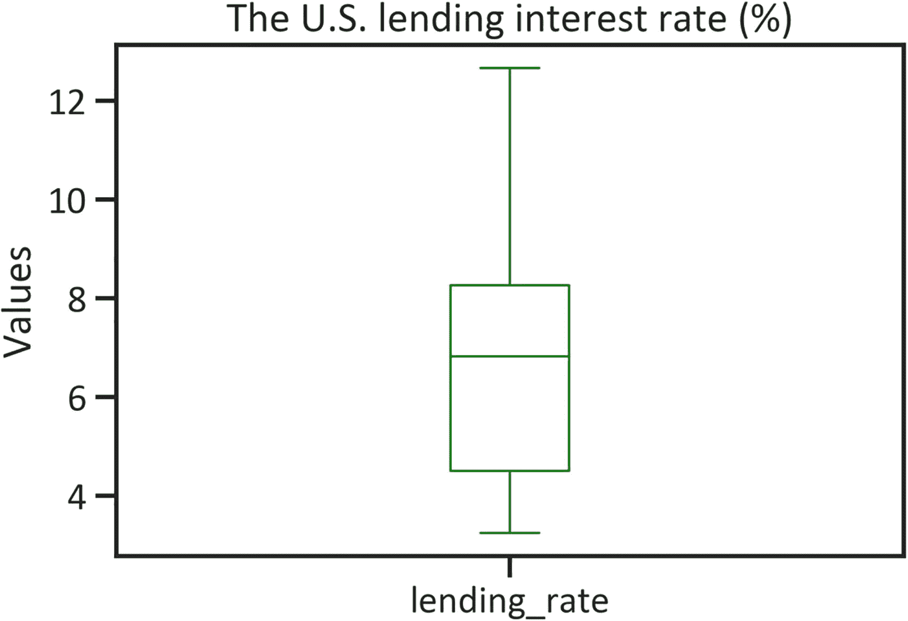

图 2-6

美国贷款利率分布

```py
import numpy as np
df['lending_rate'] = np.where((df["lending_rate"] > 14.5),df["lending_rate"].mean(),df["lending_rate"])
df["lending_rate"].plot(kind="box",color="green")
plt.title("The U.S. lending interest rate (%)")
plt.ylabel("Values")
plt.show()
plt.show()

Listing 2-6The U.S. Lending Interest Rate Distribution

```

清单 [2-7](#PC7) 返回图 [2-7](#Fig7) ，该图显示了美国最终消费支出数据中的分布和异常值。

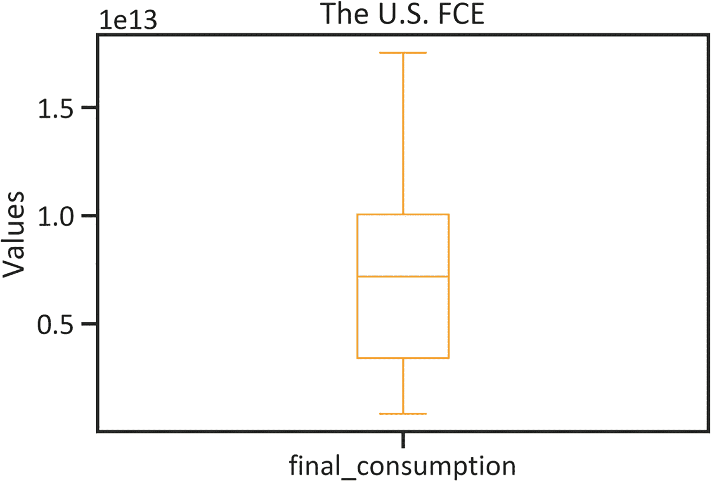

图 2-7

美国最终消费支出分布

```py
df["final_consumption"].plot(kind="box",color="orange")
plt.title("US FCE")
plt.ylabel("Values")
plt.show()

Listing 2-7The U.S. Final Consumption Expenditure Distribution

```

图 [2-7](#Fig7) 显示美国最终消费支出数据中没有异常值。清单 [2-8](#PC8) 中的命令检索与数据点的集中趋势和分散相关的综合报告(见表 [2-3](#Tab3) )。

表 2-3

描述性总结

<colgroup><col class="tcol1 align-left"> <col class="tcol2 align-left"> <col class="tcol3 align-left"></colgroup> 
|   | 

`lending_rate`

 | 

`final_consumption`

 |
| --- | --- | --- |
| 数数 | 61.000000 | 6.100000e+01 |
| 平均 | 6.639908 | 7.173358e+12 |
| 标准 | 2.436502 | 4.580756e+12 |
| 福建话 | 3.250000 | 8.395100e+11 |
| 25% | 4.500000 | 3.403470e+12 |
| 50% | 6.824167 | 7.173358e+12 |
| 75% | 8.270833 | 1.006535e+13 |
| 最大 | 12.665833 | 1.753966e+13 |

```py
df.describe()

Listing 2-8Descriptive Summary

```

表 [2-3](#Tab3) 显示:

*   美国贷款利率数据均值为 6.639908，最终消费支出均值为 7.173358e+12。

*   美国贷款利率数据点偏离均值 2.436502，最终消费支出数据点偏离均值 4.580756e+12。

## 协方差分析

*协方差分析*包括估计变量之间的变化程度。等式 [2-6](#Equ6) 显示了协方差公式。

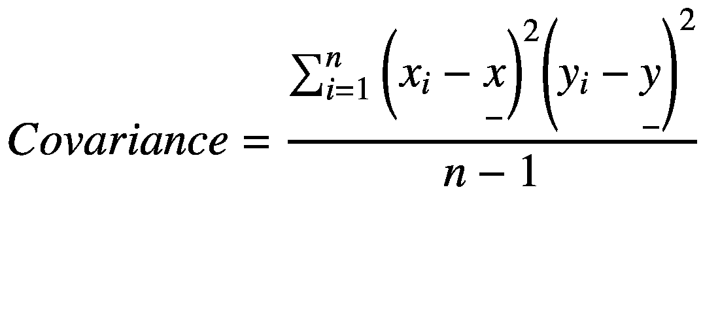

(方程式 2-6)

其中*x*<sub>T3】IT5】代表贷款利率(%)的独立数据点，代表预测变量的平均值。 *y* <sub>* i *</sub> 代表美国最终消费支出的独立数据点，代表美国最终消费支出的平均值。列表 [2-9](img/#PC9) 估计了美国贷款利率和最终消费支出之间的联合可变性(见表 [2-4](#Tab4) )。</sub>

表 2-4

协方差矩阵

<colgroup><col class="tcol1 align-left"> <col class="tcol2 align-left"> <col class="tcol3 align-left"></colgroup> 
|   | 

贷款利率

 | 

最终消费

 |
| --- | --- | --- |
| `lending_rate` | 5.936544e+00 | -7.092189e+12 |
| `final_consumption` | -7.092189e+12 | 2.098332e+25 |

```py
dfcov = df.cov()
dfcov

Listing 2-9Covariance Matrix

```

表 [2-4](#Tab4) 显示美国贷款利率变化为 5.936544e+00，最终消费支出变化为 2.098332e+25。它显示贷款利率和美国最终消费支出之间的联合可变性为-7.092189e+12。下一节提供了相关方法的概述，并解释了该问题使用的相关方法。

## 相关分析

与协方差分析不同，协方差分析显示变量如何相互变化，*相关性分析*估计变量之间的相关性。有三种主要的相关方法 Pearson 相关方法，可以估计连续变量之间的相关性 Kendall 方法，可以估计分类变量之间的相关性 Spearman 方法，也可以估计分类变量之间的关联。宏观经济数据往往是连续的，所以本章使用皮尔逊相关法。本书大部分章节都使用这种方法，除了第 [5](05.html) 章使用了肯德尔法。等式 [2-7](#Equ7) 估计协方差，然后将估计值除以预测变量和响应变量中的离差，以检索皮尔逊相关系数。

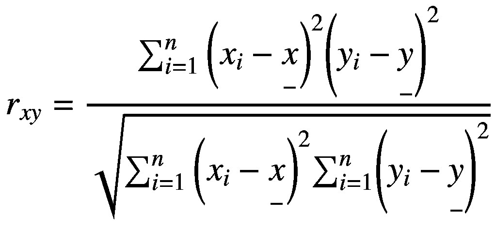

(方程式 2-7)

其中 *r* <sub>*xy*</sub> 为皮尔逊相关系数。你可以通过将美国贷款利率和美国最终消费支出之间的协方差除以偏差总和的平方根来估算该系数。清单 [2-10](#PC10) 检索皮尔逊相关矩阵(参见表 [2-5](#Tab5) )。

表 2-5

皮尔逊相关矩阵

<colgroup><col class="tcol1 align-left"> <col class="tcol2 align-left"> <col class="tcol3 align-left"></colgroup> 
|   | 

贷款利率

 | 

最终消费

 |
| --- | --- | --- |
| `lending_rate` | 1.000000 | -0.635443 |
| `final_consumption` | -0.635443 | 1.000000 |

```py
dfcorr = df.corr(method="pearson")
dfcorr

Listing 2-10Pearson Correlation Matrix

```

表 [2-6](#Tab6) 解释了表 [2-5](#Tab5) 中概述的皮尔逊相关系数。

表 2-6

皮尔逊相关系数的解释

<colgroup><col class="tcol1 align-left"> <col class="tcol2 align-left"> <col class="tcol3 align-left"></colgroup> 
| 

关系

 | 

皮尔逊相关系数

 | 

调查的结果

 |
| --- | --- | --- |
| 美国贷款利率(%)和最终消费支出(现值美元) | -0.635443 | 美国贷款利率(%)与最终消费支出(以现值美元计)之间存在极端负相关关系。 |

图 [2-8](#Fig8) 显示了美国贷款利率和最终消费支出之间的统计差异。在继续之前，请确保您的环境中安装了`seaborn`库。要在 Python 环境中安装`seaborn`库，请使用`pip install seaborn`。同样，要在 Conda 环境中安装库，使用`conda install -c anaconda seaborn`。见清单 [2-11](#PC11) 。

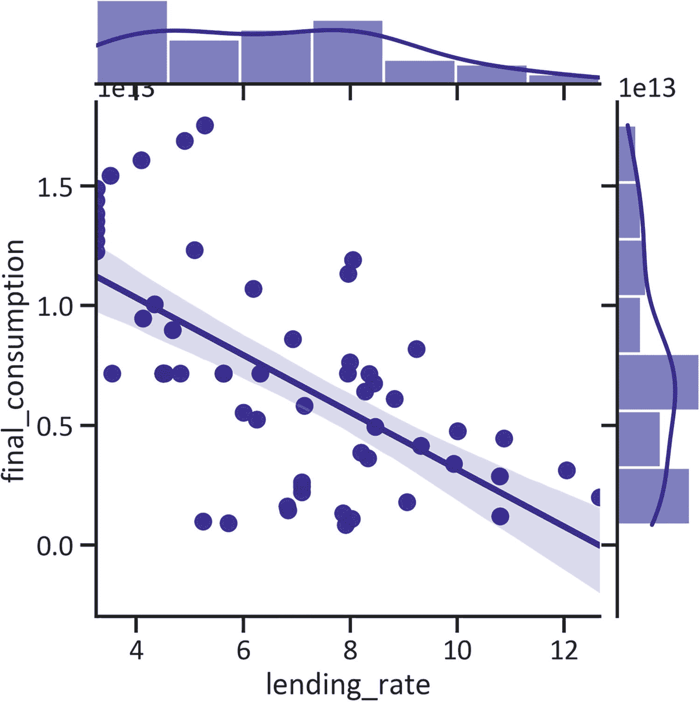

图 2-8

美国贷款利率和美国最终消费支出的联合图

```py
import seaborn as sns
sns.jointplot(x = "lending_rate", y="final_consumption", data=df, kind="reg",color="navy")
plt.show()

Listing 2-11Pairwise Scatter Plot

```

图 [2-8](#Fig8) 证实了美国贷款利率与最终消费支出之间存在负相关关系。

## 使用 Statsmodels 开发普通最小二乘回归模型

这一节涵盖了最常用的回归模型，称为普通最小二乘模型，它估计截距和系数，同时减少残差(参考等式 2-1)。

清单 [2-12](#PC12) 将数据转换成所需的格式。它首先构建一个 x 数组(美国贷款利率的数据点)和一个 y 数组(以当前美元计算的美国最终消费支出的数据点)。

然后，它对数据进行整形，以便普通的最小二乘回归模型更好地研究数据，然后通过应用`train_test_split()`方法将数据分成训练和测试数据。最后，它将数据标准化，使得平均数据点为 0，标准偏差为 1；它通过应用`StandardScaler()`方法来做到这一点。

要测试美国贷款利率影响美国最终消费支出的说法，您需要找到 p 值来确定这种关系的显著性。此外，您还需要确定普通最小二乘模型在估计最终消费支出的未来值时如何表达它丢失的信息量。为了进一步评估所选模型的性能，您必须估计 R <sup>2</sup> 分数。

表 [2-7](#Tab7) 概述了用于测试美国贷款利率和美国最终消费支出之间关系的重要性的估计类型。它还显示了该模型如何学习可用的美国宏观经济数据，以及它如何生成美国最终消费支出的未来实例，包括它在估计这些实例时所犯的错误。此外，它详细说明了该模型在多大程度上解释了美国贷款利率的变化如何影响美国最终消费支出的变化。总之，它帮助你决定你是否必须接受既定的宏观经济现象的存在，包括你可以在多大程度上依靠模型来估计未来的实例。

表 2-7

普通最小二乘回归模型结果

<colgroup><col class="tcol1 align-left"> <col class="tcol2 align-left"> <col class="tcol3 align-left"> <col class="tcol4 align-left"></colgroup> 
| 

离开可变的

 | 

y

 | 

r 平方

 | 

Zero point four four three

 |
| --- | --- | --- | --- |
| 模型 | 内源性阿片样物质 | 可调 R 平方 | Zero point four three one |
| 方法 | 最小平方 | f 统计量 | Thirty-six point six four |
| 日期 | 2021 年 8 月 4 日星期三 | 概率(F 统计量) | 2.41e-07 |
| 时间 | 11:06:05 | 对数似然 | -1454.2 |
| 否.意见 | Forty-eight | 美国化学师学会(American Institute of Chemists) | 2912. |
| Df 残差 | Forty-six | 比克 | 2916. |
| Df 模型 | one |   |   |
| 协方差类型: | 不稳健 |   |   |

<colgroup><col class="tcol1 align-left"> <col class="tcol2 align-left"> <col class="tcol3 align-left"> <col class="tcol4 align-left"> <col class="tcol5 align-left"> <col class="tcol6 align-left"> <col class="tcol7 align-left"></colgroup> 
|   | 

**coef**

 | 

**标准误差**

 | 

**t**

 | 

**P > &#124;t&#124;**

 | 

**【0.025**

 | 

**0.975】**

 |
| --- | --- | --- | --- | --- | --- | --- |
| **常数** | 7.427e+12 | 5.12e+11 | Fourteen point four nine six | Zero | 6.4e+12 | 8.46e+12 |
| **x1** | -3.102e+12 | 5.12e+11 | -6.053 | Zero | -4.13e+12 | -2.07e+12 |

<colgroup><col class="tcol1 align-left"> <col class="tcol2 align-left"> <col class="tcol3 align-left"> <col class="tcol4 align-left"></colgroup> 
| 

综合:

 | 

One point one three five

 | 

德宾-沃森:

 | 

One point seven five four

 |
| --- | --- | --- | --- |
| Prob(综合): | Zero point five six seven | Jarque-Bera (JB): | One point one one one |
| 倾斜: | Zero point two three six | Prob(JB): | Zero point five seven four |
| 峰度: | Two point four two four | 伯爵！伯爵！不，不。 | One |

```py
import statsmodels.api as sm
from sklearn.model_selection import train_test_split
from sklearn.preprocessing import StandardScaler
x = np.array(df["lending_rate"])
y = np.array(df["final_consumption"])
x = x.reshape(-1,1)
y = y.reshape(-1,1)
x_train, x_test, y_train, y_test = train_test_split(x,y,test_size=0.2,shuffle=False)
scaler = StandardScaler()
x_train = scaler.fit_transform(x_train)
x_test = scaler.transform(x_test)
x_constant = sm.add_constant(x_train)
x_test = sm.add_constant(x_test)
model = sm.OLS(y_train,x_constant).fit()
model.summary()

Listing 2-12Ordinary Least-Squares Regression Model Development Applying Statsmodels

```

表 [2-7](#Tab7) 显示普通最小二乘回归模型解释了数据中 53.2%的变异性(R <sup>2</sup> 得分为 0.443)。使用该表的结果，等式 [2-8](#Equ8) 显示了美国贷款利率的变化如何影响美国最终消费支出的变化。


(方程式 2-8)

等式 2-8 表明，美国贷款利率每变化一个单位，最终消费支出减少 3.102e+12。此外，表 [2-7](#Tab7) 显示，当美国贷款利率保持不变时，预测的美国最终消费支出的平均值为 7.427e+12。最后，该表告诉您，该模型解释了数据中约 36%的可变性——它很难预测美国最终消费支出的未来实例。

## 使用 Scikit-Learn 开发普通最小二乘回归模型

前一节揭示了使用`statsmodels`库开发和评估普通最小二乘模型的方法。研究结果表明，所表达的宏观经济现象确实存在。鉴于测试中获得的糟糕表现，您不能完全依赖该模型来预测美国最终消费支出的未来实例。

本节研究相同的现象，但是应用不同的机器学习库来开发和评估模型。它使用了一个流行的开源库`scikit-learn`。开发这个模型的方法类似于上一节中的方法。这种方法比`statsmodels`更有竞争力，因为它提供了一种更简单的方法来控制模型的行为和验证其性能。此外，它还具有广泛的回归模型，如 Ridge、Lasso 和 ElasticNet 等。本章不包括这些模型。你现在需要知道的是，这些模型通过引入一个因模型在测试中出现错误而对其进行惩罚的项，扩展了普通的最小二乘模型。`statsmodels`和`sklearn`的主要区别在于`statsmodels`更擅长假设检验，而`sklearn`更擅长预测，并且不返回 t 统计。见清单 [2-13](#PC13) 。

```py
x = np.array(df["lending_rate"])
y = np.array(df["final_consumption"])
x = x.reshape(-1,1)
y = y.reshape(-1,1)
x_train, x_test, y_train, y_test = train_test_split(x,y,test_size=0.2, random_state=0)
scaler = StandardScaler()
x_train = scaler.fit_transform(x_train)
x_test = scaler.transform(x_test)
from sklearn.linear_model import LinearRegression
lm = LinearRegression()
lm.fit(x_train,y_train)

Listing 2-13Ordinary Least-Squares Regression Model Development Applying Scikit-Learn

```

## 交叉验证

清单 [2-14](#PC14) 应用`cross_val_score()`方法来验证默认普通最小二乘回归模型在相同数据的不同子集上的性能。它应用 R <sup>2</sup> 来寻找分数，因为`sklearn`不计算调整后的 R <sup>2</sup> 。然后，它会估计验证分数的平均值和标准差。

```py
from sklearn.model_selection import cross_val_score
def get_val_score(scores):
    lm_scores = cross_val_score(scores, x_train, y_train, scoring="r2")
    print("CV mean: ", np.mean(scores))
    print("CV std: ", np.std(scores))
get_val_score(lm)
CV mean:  0.2424291076433461
CV std:  0.11822093588298

Listing 2-14Ordinary Least-Squares Regression Model Cross-Validation

```

结果显示，交叉验证分数的平均数据点是 0.2424，并且交叉验证分数的独立数据点偏离平均数据点 0.1182。清单 [2-15](#PC15) 显示了数据溢出在数据中的开始位置，这样您就可以创建一个使用实际数据点和带有日期索引的预测数据点的 dataframe。

```py
y_test.shape
(13, 1)

Listing 2-15Find Where the Spill Begins in the Data

```

### 预言

清单 [2-16](#PC16) 并列列出了美国最终消费支出的实际数据点和预测数据点(见表 [2-8](#Tab8) )。

表 2-8

实际和预测的美国最终消费支出

<colgroup><col class="tcol1 align-left"> <col class="tcol2 align-left"> <col class="tcol3 align-left"></colgroup> 
| 

日期

 | 

当前 FCE

 | 

预测 FCE

 |
| --- | --- | --- |
| 2020-01-01 | 5.829066e+12 | 6.511152e+12 |
| 2019-01-01 | 3.403470e+12 | 3.385294e+12 |
| 2018-01-01 | 7.173358e+12 | 9.102986e+12 |
| 2017-01-01 | 5.245942e+12 | 7.502778e+12 |
| 2016-01-01 | 1.227281e+13 | 1.085977e+13 |
| 2015-01-01 | 1.688457e+13 | 9.009788e+12 |
| 2014-01-01 | 3.624267e+12 | 5.175626e+12 |
| 2013-01-01 | 7.173358e+12 | 9.461798e+12 |
| 2012-01-01 | 2.204317e+12 | 6.560470e+12 |
| 2011-01-01 | 7.144856e+12 | 5.151394e+12 |
| 2010-01-01 | 1.543082e+13 | 1.056713e+13 |
| 2009-01-01 | 1.269598e+13 | 1.085977e+13 |
| 2008-01-01 | 4.757180e+12 | 3.300484e+12 |

```py
actual_values = pd.DataFrame(y_test)
actual_values.columns = ["Actual FCE"]
predicted_values  = pd.DataFrame(lm.predict(x_test))
predicted_values.columns = ["Predicted FCE"]
actual_and_predicted_values = pd.concat([actual_values,predicted_values],axis=1)
actual_and_predicted_values.index = pd.to_datetime(df[:13].index)
actual_and_predicted_values

Listing 2-16The Actual U.S. Final Consumption Expenditure and Predicted U.S. Final Consumption Expenditures

```

为了绘制表 [2-8](#Tab8) 中的数据点，使用列表 [2-17](#PC17) (见图 [2-9](#Fig9) )。

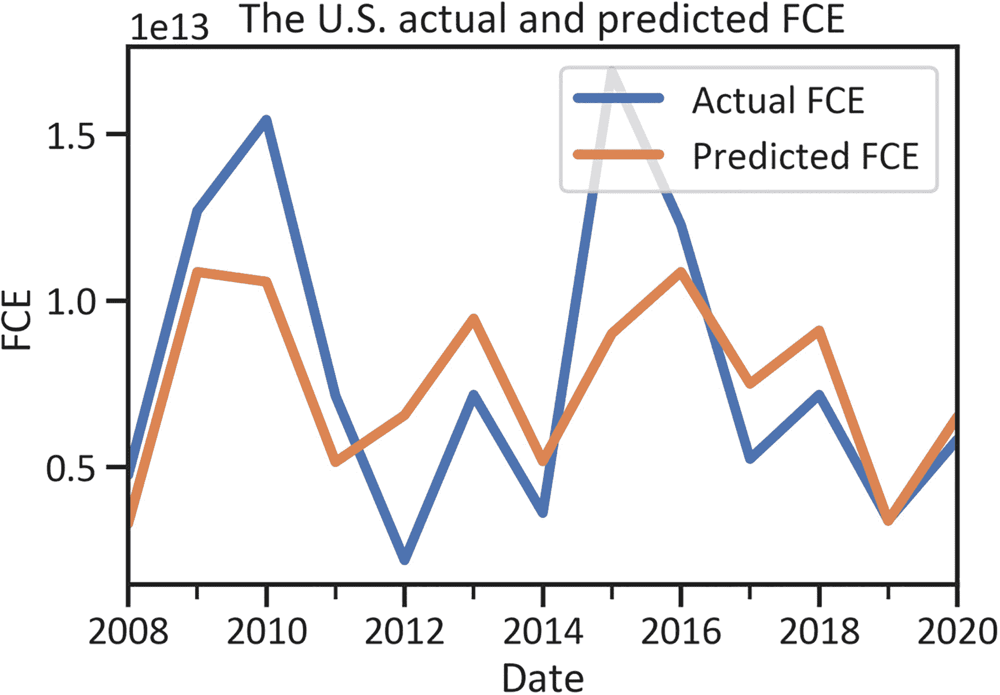

图 2-9

实际和预测的美国最终消费支出

```py
actual_and_predicted_values.plot(lw=4)
plt.xlabel("Date")
plt.title("The U.S. actual and predicted FCE")
plt.ylabel("FCE")
plt.legend(loc="best")
plt.show()

Listing 2-17The Actual and Predicted U.S. Final Consumption Expenditures

```

图 [2-9](#Fig9) 展示了美国最终消费支出的实际数据点和预测数据点。它显示了预测数据点如何偏离实际数据点。

## 估计截距和系数

清单 [2-18](#PC18) 返回系数的估计值(美国贷款利率每变化一个单位，美国最终消费支出的预测数据点之间的差值)。注意该定义仅适用于线性模型。方程 2-9 表达了本章的回归方程。

```py
lm.intercept_
array([6.95280973e+12])

Listing 2-18Estimate Intercept

```

当美国贷款利率保持不变时，预测的美国最终消费支出的平均值为 7.56456705e+12。清单 [2-19](#PC19) 估算系数。

```py
lm.coef_
array([[-2.71748602e+12]])

Listing 2-19Estimate Coefficient

```

方程 [2-9](#Equ9) 表示本章的回归方程。


(方程式 2-9)

等式 2-9 强调，美国贷款利率每变化一个单位，美国最终消费支出减少 2.71748602e+122。

图 [2-10](#Fig10) 描绘了输入普通最小二乘回归模型的数据。

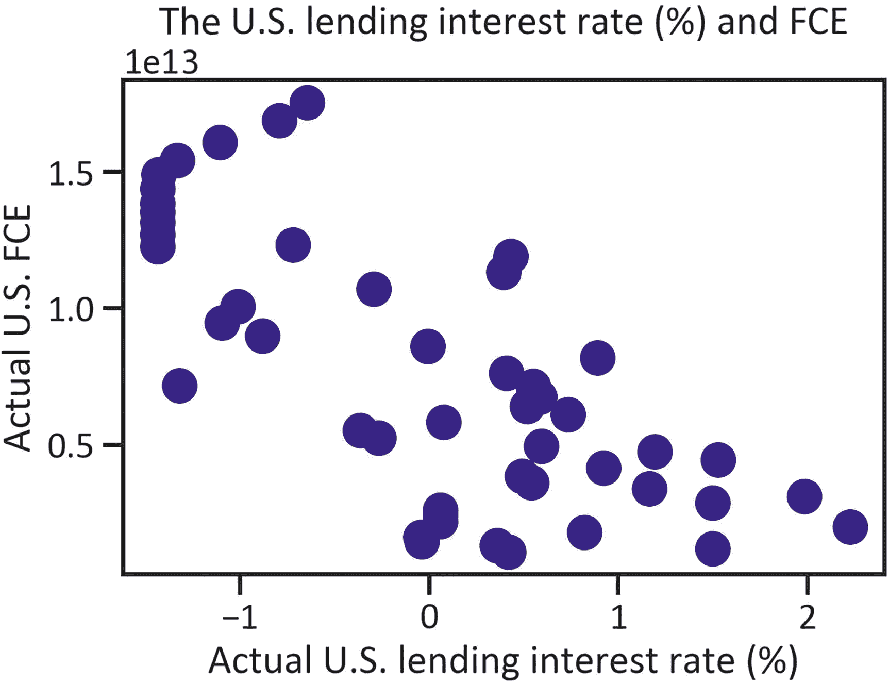

图 2-10

美国贷款利率和最终消费支出

```py
plt.scatter(x_train,y_train,color="navy",s=200)
plt.title("The U.S. lending interest rate (%) and FCE")
plt.ylabel("Actual U.S. FCE")
plt.xlabel("Actual U.S. lending interest rate (%)")
plt.show()

Listing 2-20The U.S. Lending Interest Rate and Final Consumption Expenditure

```

图 [2-10](#Fig10) 绘制了美国贷款利率(%)的实际数据点和最终消费支出的预测数据点。

```py
plt.scatter(x_test,predicted_values,color="navy",s=200)
plt.plot(x_test,predicted_values,color="red",lw=4)
plt.title("The U.S. FCE predictions")
plt.xlabel("Actual U.S. lending interest rate (%)")
plt.ylabel("Predicted U.S. FCE")
plt.show()

Listing 2-21The U.S. Final Consumption Expenditure Predictions

```

图 [2-11](#Fig11) 显示，美国贷款利率的实际数据点和最终消费支出的预测数据点是完全线性的，通过构造。

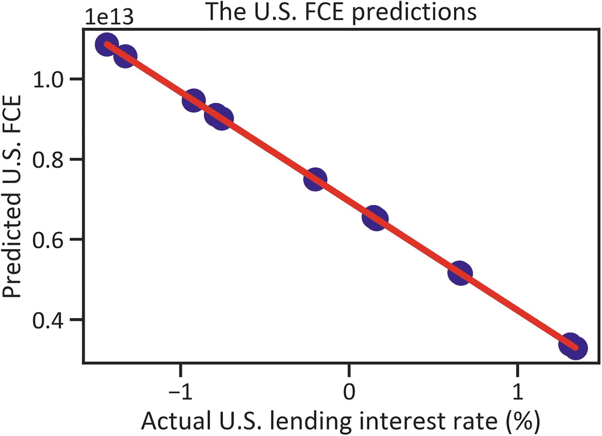

图 2-11

美国最终消费支出预测

## 残差分析

*残差*表示线性回归方法估计的数据点和实际数据点之间的差的估计值。等式 [2-10](#Equ10) 定义了残差。

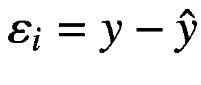

(方程式 2-10)

普通的最小二乘回归模型带有正态假设。

```py
plt.scatter(y_test,predicted_values,color="navy",s=200)
plt.title("The U.S. actual and predicted FCE")
plt.xlabel("Actual U.S. FCE")
plt.ylabel("Predicted U.S. FCE")
plt.show()

Listing 2-22The U.S. Actual and Predicted Values of Final Consumption Expenditures

```

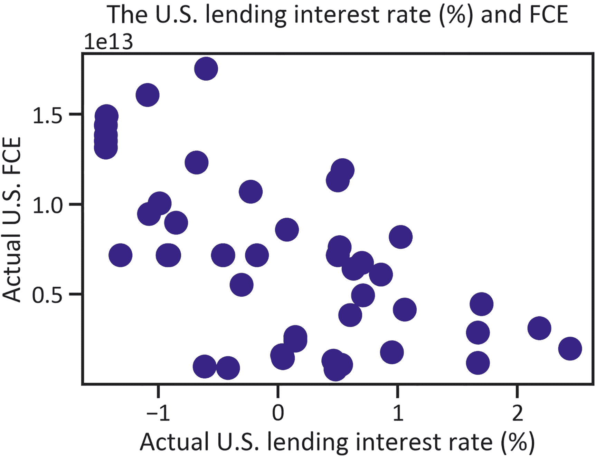

图 2-12

美国最终消费支出的实际值和预测值

图 [2-12](#Fig12) 显示美国最终消费支出的实际数据点和预测数据点是随机分布的。图 [2-13](#Fig13) 显示了残差的集中趋势和分散程度。

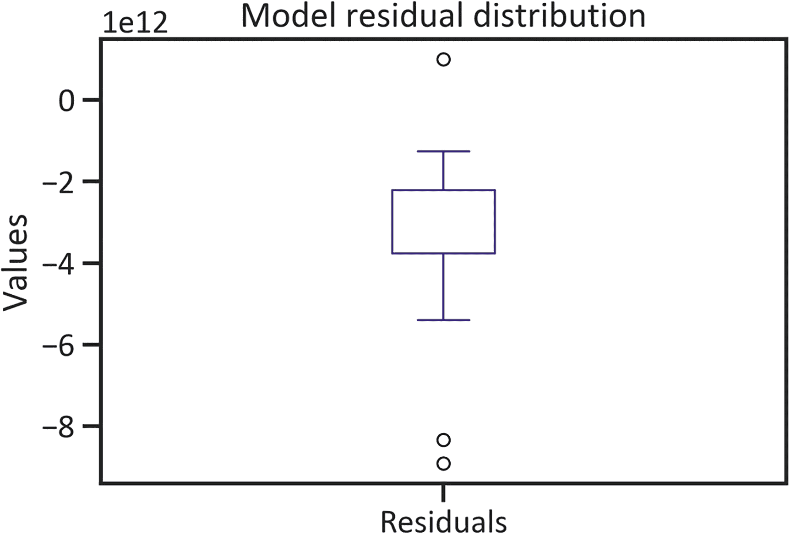

图 2-13

普通最小二乘回归模型残差分布

```py
residuals = y_test - predicted_values
residuals = pd.DataFrame(residuals)
residuals.columns = ["Residuals"]
residuals.plot(kind="box",color="navy")
plt.title("Model residual distribution")
plt.ylabel("Values")
plt.show()

Listing 2-23Ordinary Least-Squares Regression Model Residual Distribution

```

图 [2-13](#Fig13) 显示平均数据点远离 0。这表明普通的最小二乘回归模型不满足假设。图 [2-14](#Fig14) 显示了序列相关性。它在 x 轴上显示了*滞后*的数量(当前时间中的残差与自身相关的时间有多远)，在 y 轴上显示了自相关。带蓝点的直线是自相关系数。如果有任何自相关相关系数在统计控制之外(蓝色区域)，则模型不符合回归假设。

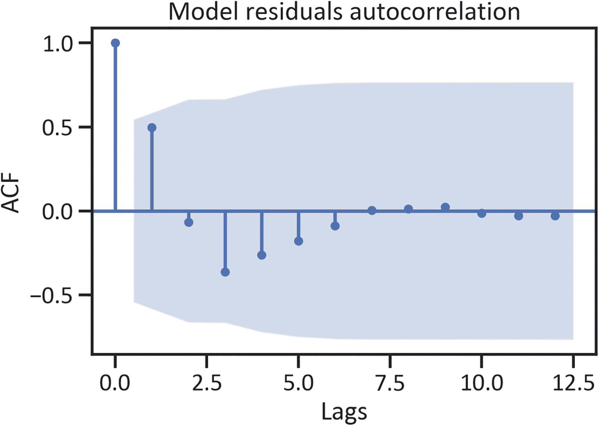

图 2-14

普通最小二乘回归模型残差自相关

```py
from statsmodels.graphics.tsaplots import plot_acf
plot_acf(residuals)
plt.title("Model residuals autocorrelation")
plt.xlabel("Lags")
plt.ylabel("ACF")
plt.show()

Listing 2-24Ordinary Least-Squares Regression Model Residual Autocorrelation

```

图 [2-14](#Fig14) 展示了滞后之后，没有自相关系数在蓝色区域(置信区间)之外。

### 其他普通最小二乘回归模型性能指标

其他普通的最小二乘回归模型性能指标包括:

*   **平均绝对误差**—代表回归变量之前误差的平均大小。

*   **均方误差**—代表误差总和的平均值。

*   **均方根值**—代表回归变量后解释的可变性。当你不想要巨大的残差时，应用 RMSE。

*   **R 平方**—代表回归变量解释数据可变性的程度。

```py
from sklearn import metrics
MAE = metrics.mean_absolute_error(y_test,predicted_values)
MSE = metrics.mean_squared_error(y_test,predicted_values)
RMSE = np.sqrt(MSE)
EV = metrics.explained_variance_score(y_test,predicted_values)
R2 = metrics.r2_score(y_test,predicted_values)
lmmodelevation = [[MAE,MSE,RMSE,EV,R2]]
lmmodelevationdata = pd.DataFrame(lmmodelevation, index=["Values"],columns=("Mean absolute error", "Mean squared error", "Root mean squared error", "Explained variance score", "R-squared"))
lmmodelevationdata

Listing 2-25Ordinary Least-Squares Regression Model Performance Matrix

```

表 2-9

普通最小二乘回归模型性能矩阵

<colgroup><col class="tcol1 align-left"> <col class="tcol2 align-left"> <col class="tcol3 align-left"> <col class="tcol4 align-left"> <col class="tcol5 align-left"> <col class="tcol6 align-left"></colgroup> 
|   | 

绝对平均误差

 | 

均方误差

 | 

均方根误差

 | 

解释方差得分

 | 

r 平方

 |
| --- | --- | --- | --- | --- | --- |
| **值** | 2.501582e+12 | 1.023339e+25 | 3.198966e+12 | 0.524619 | 0.513118 |

表 [2-9](#Tab9) 显示普通最小二乘回归模型解释了数据中 51.31%的可变性。在回归变量之前，误差的幅度平均值是 2.501582e+12，误差的平均和是 1.023339e+25。最后，解释的方差得分为 52.46%，进一步证实了模型中的平庸。

## 普通最小二乘回归模型学习曲线

图 [2-15](#Fig15) 显示了随着训练测试规模的增加，普通最小二乘模型如何学习解释美国贷款利率和美国最终消费支出之间关系的可变性。总之，它显示了 R <sup>2</sup> 分数如何随着训练测试规模的增加而变化。见清单 [2-26](#PC26) 。

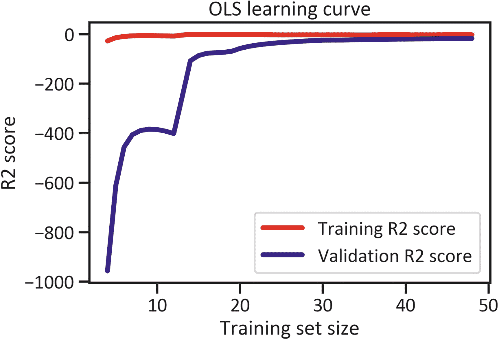

图 2-15

普通最小二乘回归模型学习曲线

```py
from sklearn.model_selection import learning_curve
trainsizelogreg, trainscorelogreg, testscorelogreg = learning_curve(lm, x,y,cv=5, n_jobs=-1, scoring="r2", train_sizes=np.linspace(0.1,1.0,50))
trainscorelogreg_mean = np.mean(trainscorelogreg,axis=1)
trainscorelogreg_std = np.std(trainscorelogreg,axis=1)
testscorelogreg_mean = np.mean(testscorelogreg,axis=1)
testscorelogreg_std = np.std(testscorelogreg,axis=1)
fig, ax = plt.subplots()
plt.plot(trainsizelogreg,trainscorelogreg_mean, label="Training R2 score", color="red",lw=4)
plt.plot(trainsizelogreg,testscorelogreg_mean, label="Validation R2 score",color="navy", lw=4)
plt.title("OLS learning curve")
plt.xlabel("Training set size")
plt.ylabel("R2 score")
plt.legend(loc=4)
plt.show()

Listing 2-26Ordinary Least-Squares Regression Model Learning Curve

```

图 [2-15](#Fig15) 表明，在整个训练过程中，交叉验证 R <sup>2</sup> 得分低于训练 R <sup>2</sup> 得分——这表明当你进行重复测试时，训练 R <sup>2</sup> 得分较高。在验证阶段，随着普通最小二乘回归模型接近数据中的第十个数据点，它开始遇到预测美国最终消费支出数据点的困难。同时，在训练期间，回归器持续预测数据点。

## 结论

本章介绍了一种通过应用普通最小二乘回归模型来寻找横截面数据答案的方法。它首先确定数据点的分布，然后处理任何缺失的数据点和异常值。然后研究了美国贷款利率(百分比)和最终消费支出(现值美元)之间的联合可变性和关联性。接下来，它应用皮尔逊相关方法，发现美国贷款利率和美国最终消费支出之间存在负相关关系。

接下来，本章向您展示了如何使用`statsmodels`和`scikit-learn`库开发普通的最小二乘回归模型。与使用`scikit-learn`开发的模型相比，使用`statsmodels`开发的模型表现出了卓越的性能。