# 五、应用逻辑回归来分类经济数据

本章应用逻辑回归来研究当响应变量是一个类别(意味着它仅限于几个类别)时变量之间关系的性质。该模型是最常见的非线性模型，通常被称为*分类*。它使用 Sigmoid 函数来模拟数据。

图 [5-1](#Fig1) 展示了分类器对预测变量进行操作以生成二进制输出值。方程式 [5-1](#Equ1) 显示了 sigmoid 方程式。

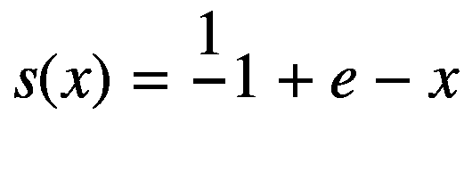

(方程式 5-1)

你可能已经意识到宏观经济数据通常是连续的。不用担心，因为您仍然可以对这类数据执行逻辑回归。您所需要做的就是根据方向(向上或向下)对响应变量进行分类。你可以基于一个 S 形的公式，称为*S 形*(见图 [5-1](#Fig1) )。

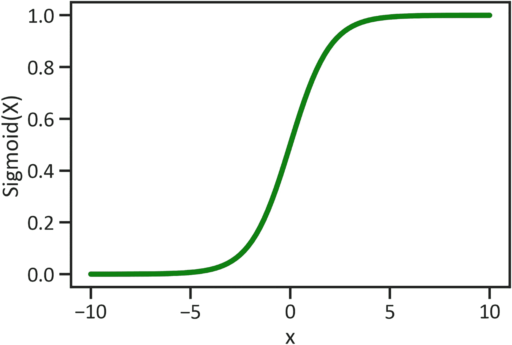

图 5-1

Sigmoid 函数

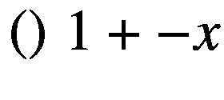T2】

在线性回归中，响应变量是连续的。另一方面，在逻辑回归中，响应变量是二元的，可以应用于多类分类。此外，分类器不会对数据的线性和正态性做出极端假设。

## 本章的背景

本章通过应用一系列其他经济指标(城市人口、人均国民总收入、阿特拉斯法(以当前美元计算)和国内生产总值增长率(以年百分比表示),预测了南非出生时预期寿命的增加和减少。人均国民总收入是一个公民的平均国民总收入，在这个例子中是南非。表 [5-1](#Tab1) 概述了本章研究的南非宏观经济指标。

表 5-1

本章的宏观经济指标

<colgroup><col class="tcol1 align-left"> <col class="tcol2 align-left"></colgroup> 
| 

密码

 | 

指示器

 |
| --- | --- |
| `SP.URB.TOTL` | 南非的城市人口 |
| `NY.GNP.PCAP.CD` | 南非人均国民总收入，阿特拉斯法(现值美元) |
| `NY.GDP.MKTP.KD.ZG` | 南非的国内生产总值增长率(年百分比) |
| `SP.DYN.LE00.IN` | 南非出生时的预期寿命，总计(年) |

## 理论框架

图 [5-2](#Fig2) 提供了这个问题的框架。


图 5-2

结构

### 城市人口

城市人口代表人口密度大的地区(即城市)的人口。列表 [5-1](#PC1) 和图 [5-3](#Fig3) 显示了南非的城市人口。


图 5-3

南非的城市人口

```py
import wbdata
country  = ["ZAF"]
indicators = {"SP.URB.TOTL":"urban_pop"}
urban_pop = wbdata.get_dataframe(indicators, country=country, convert_date=True)
urban_pop.plot(kind="line",color="green",lw=4)
plt.title("S.A. urban population")
plt.ylabel("Urban population")
plt.xlabel("Date")
plt.show()

Listing 5-1South Africa’s Urban Population

```

图 5-3 显示了自 1960 年以来南非城市人口的强劲增长。

### 人均国民总收入，阿特拉斯法

人均国民总收入代表一个国家公民的平均收入。在这个例子中，我们应用了 Atlas 方法。列表 [5-2](#PC2) 和图 [5-4](#Fig4) 显示了南非的人均国民总收入。

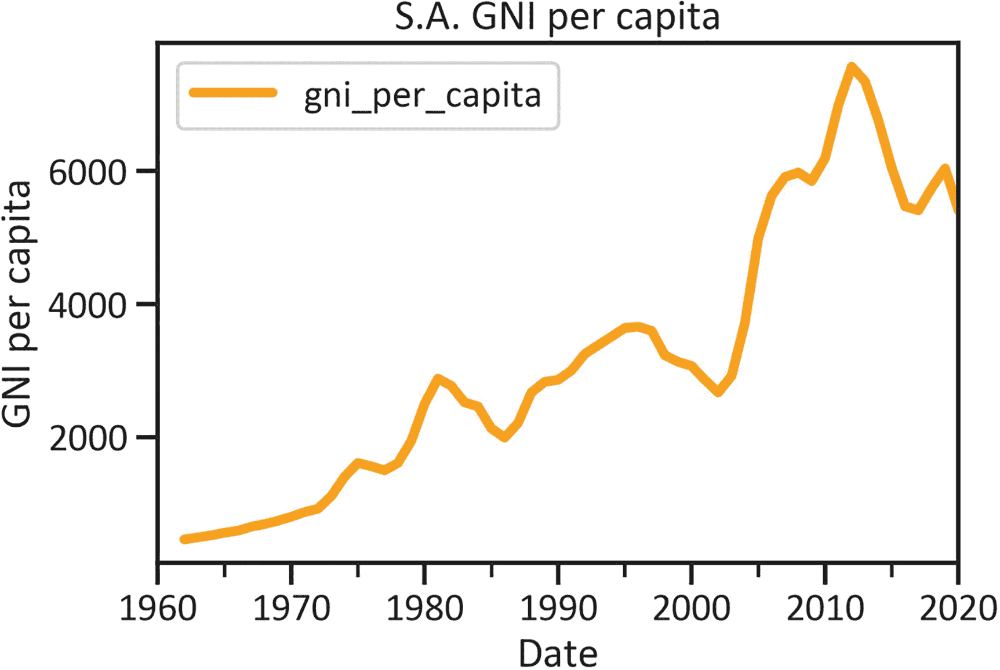

图 5-4

南非人均国民总收入

```py
country  = ["ZAF"]
indicators = {"NY.GNP.PCAP.CD":"gni_per_capita"}
gni_per_capita = wbdata.get_dataframe(indicators, country=country, convert_date=True)
gni_per_capita.plot(kind="line",color="orange",lw=4)
plt.title("S.A. GNI per capita")
plt.ylabel("GNI per capita")
plt.xlabel("Date")
plt.show()

Listing 5-2South Africa’s GNI per Capita

```

图 [5-4](#Fig4) 显示了南非公民平均收入的总体、极端上升趋势。2012 年有所下降，但 2015 年再次飙升。

### 国内生产总值增长

GDP 估计一个国家的家庭每年消费的成品和服务的市场价值。它被用来诊断一个经济体的健康状况，因为它反映了一个国家的经济生产。列表 [5-3](#PC3) 和图 [5-5](#Fig5) 显示了南非的 GDP 增长(以年度百分比表示)。

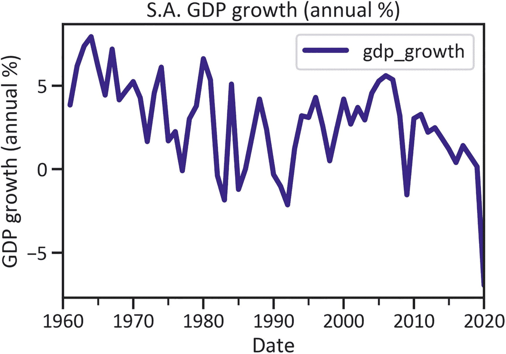

图 5-5

南非的国内生产总值增长

```py
country  = ["ZAF"]
indicators = {"NY.GDP.MKTP.KD.ZG":"gdp_growth"}
gdp_growth = wbdata.get_dataframe(indicators, country=country, convert_date=True)
gdp_growth.plot(kind="line",color="navy",lw=4)
plt.title("S.A. GDP growth (annual %)")
plt.ylabel("GDP growth (annual %)")
plt.xlabel("Date")
plt.show()

Listing 5-3South Africa’s GDP Growth

```

图 [5-5](#Fig5) 显示南非生产的一般商品和服务的市场价值是不稳定的。1960 年至 2020 年间，其 GDP 增长大幅下降，几年后趋于平稳。国内生产总值的增长在 20 世纪 60 年代中期达到顶峰。20 世纪 90 年代初出现负增长，随后呈上升趋势，2008 年得到纠正。

### 出生时预期寿命，总计(年)

预期寿命是指在当前死亡率模式保持不变的情况下，新生儿预期能活的平均年数。列表 [5-4](#PC4) 和图 [5-6](#Fig6) 显示了南非人出生时的预期寿命。

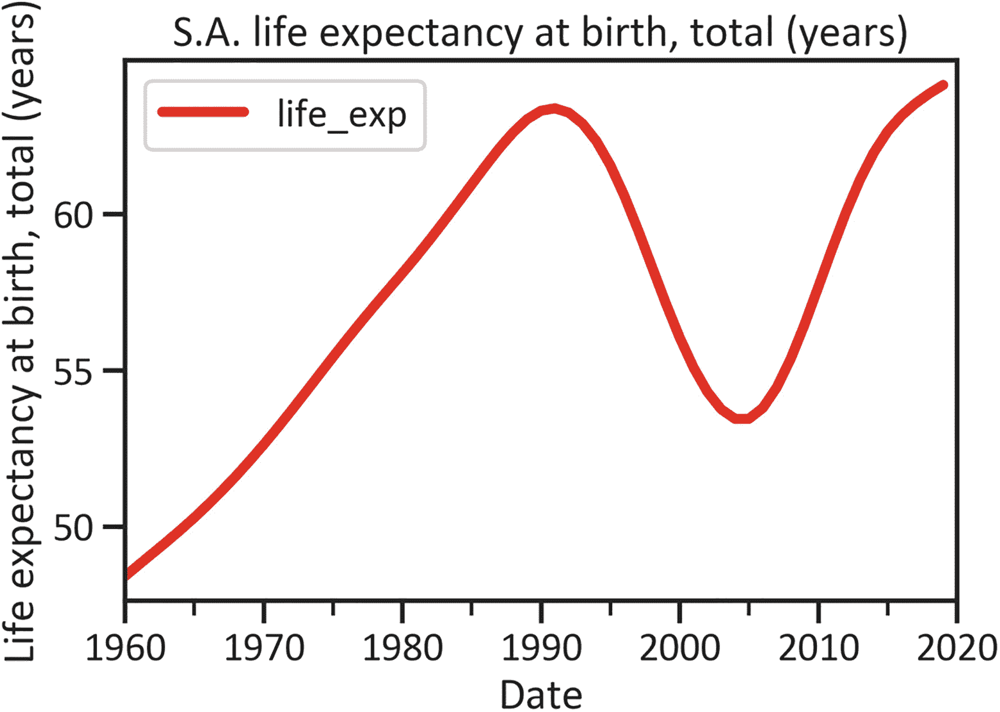

图 5-6

南非出生时的预期寿命线图

```py
country  = ["ZAF"]
indicators = {"SP.DYN.LE00.IN":"life_exp"}
life_exp = wbdata.get_dataframe(indicators, country=country, convert_date=True)
life_exp.plot(kind="line",color="red",lw=4)
plt.title("S.A. life expectancy at birth, total (years)")
plt.ylabel("Life expectancy at birth, total (years)")
plt.xlabel("Date")
plt.show()

Listing 5-4South Africa’s Life Expectancy South Africa’s Life Expectancy at Birth Line Plot

```

既然您已经理解了这个问题，那么您可以继续将感兴趣的经济指标加载到一个`pandas`数据框架中。清单 [5-5](#PC5) 检索表 [5-2](#Tab2) ，该表列出了前五行数据。

表 5-2

南非的宏观经济数据

<colgroup><col class="tcol1 align-left"> <col class="tcol2 align-left"> <col class="tcol3 align-left"> <col class="tcol4 align-left"> <col class="tcol5 align-left"></colgroup> 
| 

日期

 | 

都市流行

 | 

人均国民总收入

 | 

gdp _ 增长

 | 

生活经验

 |
| --- | --- | --- | --- | --- |
| 2020-01-01 | Thirty-nine million nine hundred and forty-six thousand seven hundred and seventy-five | Five thousand four hundred and ten | -6.959604 | 圆盘烤饼 |
| 2019-01-01 | Thirty-nine million one hundred and forty-nine thousand seven hundred and fifteen | Six thousand and forty | 0.152583 | Sixty-four point one three one |
| 2018-01-01 | Thirty-eight million three hundred and forty-eight thousand two hundred and twenty-seven | Five thousand seven hundred and fifty | 0.787056 | Sixty-three point eight five seven |
| 2017-01-01 | Thirty-seven million five hundred and forty thousand nine hundred and twenty-one | Five thousand four hundred and ten | 1.414513 | Sixty-three point five three eight |
| 2016-01-01 | Thirty-six million seven hundred and twenty-six thousand six hundred and forty | Five thousand four hundred and seventy | 0.399088 | Sixty-three point one five three |

```py
country = ["ZAF"]
indicator = {"SP.URB.TOTL":"urban_pop",
             "NY.GNP.PCAP.CD":"gni_per_capita",
             "NY.GDP.MKTP.KD.ZG":"gdp_growth",
             "SP.DYN.LE00.IN":"life_exp"}
df = wbdata.get_dataframe(indicator, country=country, convert_date=True)
df.head()

Listing 5-5Loading Data

```

表 [5-2](#Tab2) 显示数据中有缺失值。清单 [5-6](#PC6) 用平均值替换缺失值(对数据中的每个变量都是如此)。

```py
df["urban_pop"] = df["urban_pop"].fillna(df["urban_pop"].mean())
df["gni_per_capita"] = df["gni_per_capita"].fillna(df["gni_per_capita"].mean())
df["gdp_growth"] = df["gdp_growth"].fillna(df["gdp_growth"].mean())
df["life_exp"] = df["life_exp"].fillna(df["life_exp"].mean())

Listing 5-6Replace Missing Values with the Mean Value

```

## 描述统计学

清单 [5-7](#PC7) 检测南非城市人口数据中是否存在异常值。它还调查数据的分布(见图 [5-7](#Fig7) )。

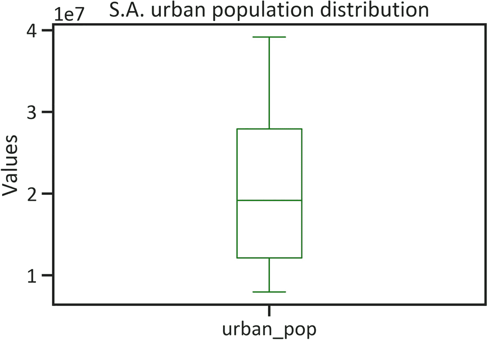

图 5-7

南非的城市人口分布

```py
df["urban_pop"].plot(kind="box",color="green")
plt.title("S.A. urban population distribution")
plt.ylabel("Values")
plt.show()

Listing 5-7South Africa’s Urban Population Distribution

```

图 [5-7](#Fig7) 显示南非城市人口数据接近正态分布。列表 [5-8](#PC8) 检测南非人均国民总收入数据中是否存在异常值。它还调查数据的分布(见图 [5-8](#Fig8) )。

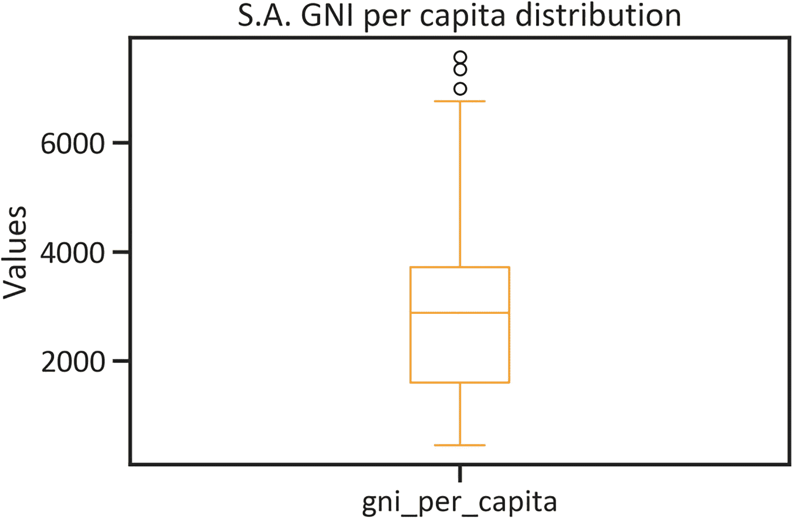

图 5-8

南非的人均国民总收入分布

```py
df["gni_per_capita"].plot(kind="box",color="orange")
plt.title("S.A. GNI per capita distribution")
plt.ylabel("Values")
plt.show()

Listing 5-8South Africa’s GNI Per Capita Distribution

```

图 [5-8](#Fig8) 显示南非的人均国民总收入数据呈正偏态。5 000 值以上有三个异常值。列表 [5-9](#PC9) 用平均值替换了南非人均国民总收入数据中的异常值(见图 [5-9](#Fig9) )。除了使用平均值替换数据之外，您还可以应用其他技术，如通过 k-最近邻技术的中值或接近缺失值的值。

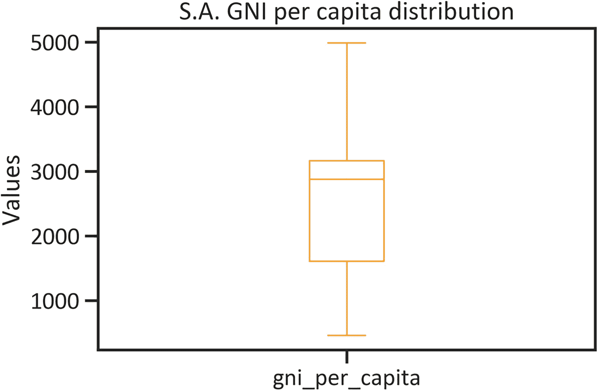

图 5-9

南非的人均国民总收入分布

```py
df['gni_per_capita'] = np.where((df["gni_per_capita"] > 5000),df["gni_per_capita"].mean(),df["gni_per_capita"])
df["gni_per_capita"].plot(kind="box",color="orange")
plt.title("S.A. GNI per capita distribution")
plt.ylabel("Values")
plt.show()

Listing 5-9Replacing Outliers with Mean Values

```

列表 [5-10](#PC10) 确定南非 GDP 增长数据中是否存在异常值。它还调查数据的分布(见图 [5-10](#Fig10) )。

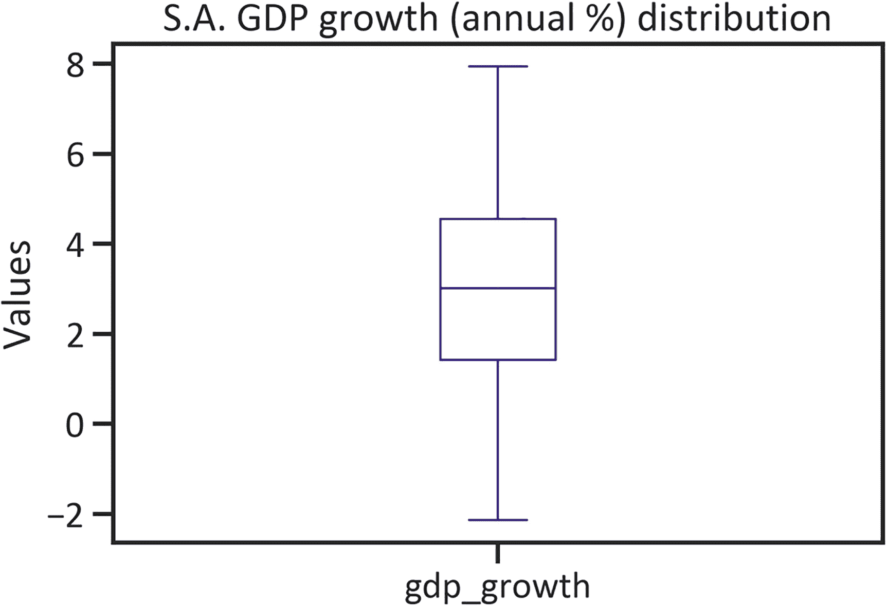

图 5-10

南非的国内生产总值增长分布

```py
df["gdp_growth"].plot(kind="box",color="navy")
plt.title("S.A. GDP growth (annual %) distribution")
plt.ylabel("Values")
plt.show()

Listing 5-10South Africa’s GDP Growth Distribution

```

图 [5-10](#Fig10) 显示南非 GDP 增长数据呈正态分布，没有异常值。列表 [5-11](#PC11) 检测南非出生时预期寿命数据中是否存在异常值。它还显示了数据的分布(见图 [5-11](#Fig11) )。

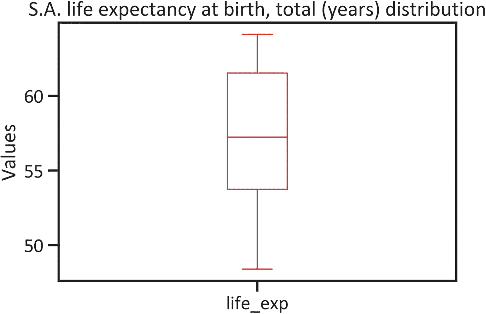

图 5-11

南非出生时的预期寿命分布

```py
df["life_exp"].plot(kind="box",color="red")
plt.title("S.A. life expectancy at birth, total (years) distribution")
plt.ylabel("Values")
plt.show()

Listing 5-11South Africa’s Life Expectancy at Birth Distribution

```

图 [5-11](#Fig11) 显示，南非出生时预期寿命数据接近正态分布，略有偏斜。列表 [5-12](#PC12) 生成一个表格，让我们了解数据的集中趋势和分散情况(见表 [5-3](#Tab3) )。

表 5-3

描述性总结

<colgroup><col class="tcol1 align-left"> <col class="tcol2 align-left"> <col class="tcol3 align-left"> <col class="tcol4 align-left"> <col class="tcol5 align-left"> <col class="tcol6 align-left"> <col class="tcol7 align-left"> <col class="tcol8 align-left"> <col class="tcol9 align-left"></colgroup> 
|   | 

数数

 | 

平均

 | 

标准

 | 

福建话

 | 

25%

 | 

50%

 | 

75%

 | 

最大

 |
| --- | --- | --- | --- | --- | --- | --- | --- | --- |
| `urban_pop` | Sixty-one | 2.081471e+07 | 9.698996e+06 | 7.971773e+06 | 1.212115e+07 | 1.914988e+07 | 2.850619e+07 | 3.994678e+07 |
| `gni_per_capita` | Sixty-one | 2.473420e+03 | 1.074740e+03 | 4.600000e+02 | 1.610000e+03 | 2.880000e+03 | 3.200508e+03 | 4.990000e+03 |
| `gdp_growth` | Sixty-one | 2.775881e+00 | 2.708735e+00 | -6.959604e+00 | 1.233520e+00 | 3.014549e+00 | 4.554553e+00 | 7.939782e+00 |
| `life_exp` | Sixty-one | 5.724278e+01 | 4.571705e+00 | 4.840600e+01 | 5.374900e+01 | 5.724278e+01 | 6.154000e+01 | 6.413100e+01 |

```py
df.describe().transpose()

Listing 5-12Descriptive Summary

```

表 [5-3](#Tab3) 显示:

*   南非城市人口平均值为 2.081471e+07。

*   人均国民总收入，图册法为 2.473420e+03 美元。

*   GDP 增长 2.775881e+00。

*   出生时预期寿命为 5.724278e+01 岁。

*   南非城市人口偏离平均值 9.698996e+06。

*   人均国民总收入，阿特拉斯法偏离 1.074740e+03。

*   GDP 增长偏离 2.708735e+00。

*   预期寿命偏离 4.571705e+00。

## 协方差分析

列表 [5-13](#PC13) 和表格 [5-4](#Tab4) 显示了这些变量如何共同变化和自身变化。

表 5-4

协方差矩阵

<colgroup><col class="tcol1 align-left"> <col class="tcol2 align-left"> <col class="tcol3 align-left"> <col class="tcol4 align-left"> <col class="tcol5 align-left"></colgroup> 
|   | 

都市流行

 | 

人均国民总收入

 | 

gdp _ 增长

 | 

生活经验

 |
| --- | --- | --- | --- | --- |
| `urban_pop` | 9.407052e+13 | 7.610470e+09 | -1.099442e+07 | 2.381877e+07 |
| `gni_per_capita` | 7.610470e+09 | 1.155065e+06 | -1.089449e+03 | 2.658211e+03 |
| `gdp_growth` | -1.099442e+07 | -1.089449e+03 | 7.337248e+00 | -6.957400e+00 |
| `life_exp` | 2.381877e+07 | 2.658211e+03 | -6.957400e+00 | 2.090049e+01 |

```py
dfcov = df.cov()
dfcov

Listing 5-13Covariance Matrix

```

## 相关分析

清单 [5-14](#PC14) 使用皮尔逊相关法找到相关系数(见图 [5-12](#Fig12) )。当值连续时，此方法很有用。否则，如果值是分类的，您必须应用 Kendall 或 Spearman 相关方法。

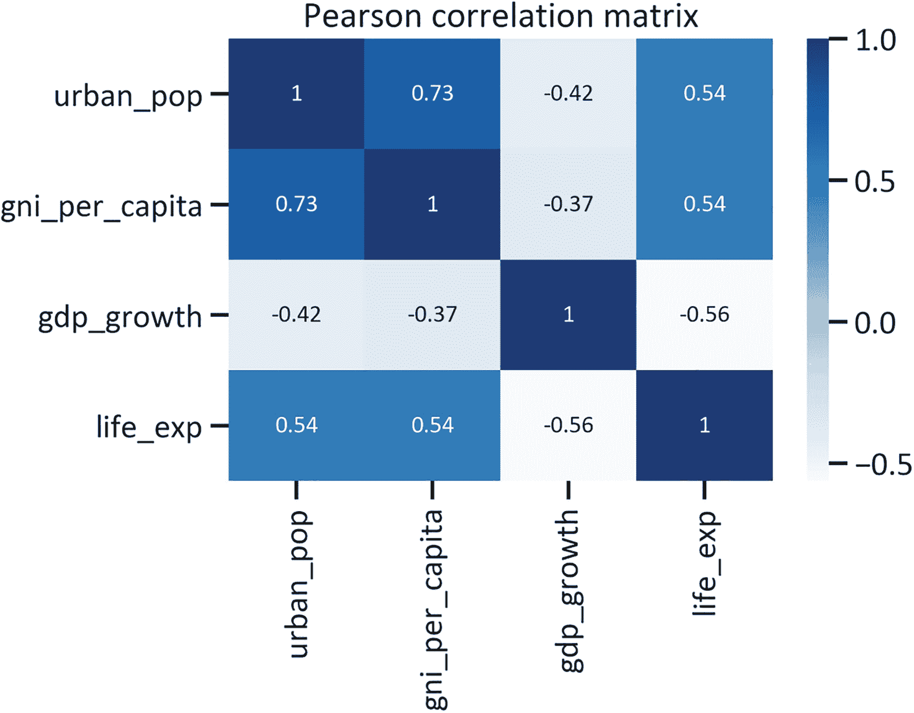

图 5-12

皮尔逊相关矩阵

```py
dfcorr = df.corr(method="pearson")
sns.heatmap(dfcorr, annot=True, annot_kws={"size":12},cmap="Blues")
plt.title("Pearson correlation matrix")
plt.show()

Listing 5-14Pearson Correlation Matrix

```

表 [5-5](#Tab5) 显示了图 [5-12](#Fig12) 中绘制的皮尔逊相关系数。

表 5-5

皮尔逊相关矩阵解释

<colgroup><col class="tcol1 align-left"> <col class="tcol2 align-left"> <col class="tcol3 align-left"></colgroup> 
| 

变量

 | 

皮尔逊相关系数

 | 

调查的结果

 |
| --- | --- | --- |
| 南非城市人口和出生时预期寿命。 | Zero point five four | 南非城市人口与出生时预期寿命之间存在适度的正相关关系。 |
| 南非人均国民总收入、阿特拉斯法和出生时预期寿命(年)。 | Zero point five four | 南非的人均国民总收入、阿特拉斯法和出生时预期寿命之间存在适度的正相关关系。 |
| 南非的国内生产总值增长和出生时预期寿命(年)。 | -0.56 | 南非的国内生产总值增长与出生时预期寿命呈中度负相关。 |

图 [5-13](#Fig13) 描绘了这些变量之间的统计关联(见清单 [5-15](#PC15) )。

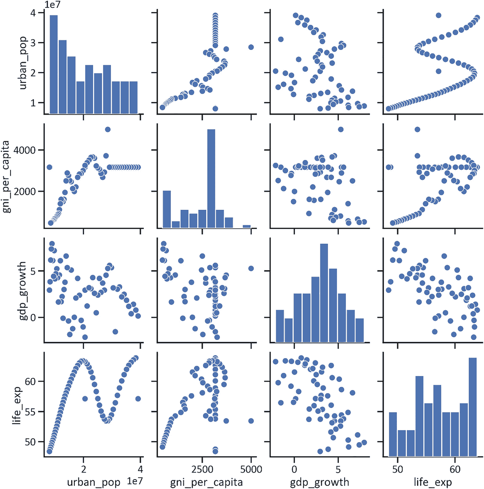

图 5-13

配对图

```py
sns.pairplot(df)

Listing 5-15Pair Plot

```

图 [5-13](#Fig13) 显示了数据中所有变量的直方图。有关南非城市人口的数据稍微偏左。人均国民总收入(阿特拉斯法)是正常的，但也有例外。GDP 增长数据正常，预期寿命数据略微偏右。

## 相关性严重性检测

列表 [5-16](#PC16) 和表格 [5-6](#Tab6) 显示了变量之间相关性的严重程度。

表 5-6

自定义矩阵

<colgroup><col class="tcol1 align-left"> <col class="tcol2 align-left"> <col class="tcol3 align-left"> <col class="tcol4 align-left"> <col class="tcol5 align-left"> <col class="tcol6 align-left"></colgroup> 
|   | 

本征值

 | 

都市流行

 | 

人均国民总收入

 | 

gdp _ 增长

 | 

生活经验

 |
| --- | --- | --- | --- | --- | --- |
| `urban_pop` | 2.590423 | 0.526233 | 0.412356 | -0.693983 | -0.267261 |
| `gni_per_capita` | 0.738154 | 0.518674 | 0.477948 | 0.705191 | -0.072449 |
| `gdp_growth` | 0.266181 | -0.440609 | 0.719198 | -0.109331 | 0.525989 |
| `life_exp` | 0.405242 | 0.509823 | -0.290315 | -0.095601 | 0.804151 |

```py
eigenvalues, eigenvectors = np.linalg.eig(dfcorr)
eigenvalues = pd.DataFrame(eigenvalues)
eigenvalues.columns = ["Eigen values"]
eigenvectors = pd.DataFrame(eigenvectors)
eigenvectors.columns = df.columns
eigenvectors = pd.DataFrame(eigenvectors)
eigenmatrix = pd.concat([eigenvalues, eigenvectors],axis=1)
eigenmatrix.index = df.columns
eigenmatrix

Listing 5-16Eigen Matrix

```

表 [5-6](#Tab6) 显示不存在多重共线性。我们使用该方法来解决多重共线性。

## 降维

列表 [5-17](#PC17) 和图 [5-14](#Fig14) 显示第一分量的方差比在 2.5 以上。数据中的大多数可变性，以及其他组件的可变性，都低于 1.0。

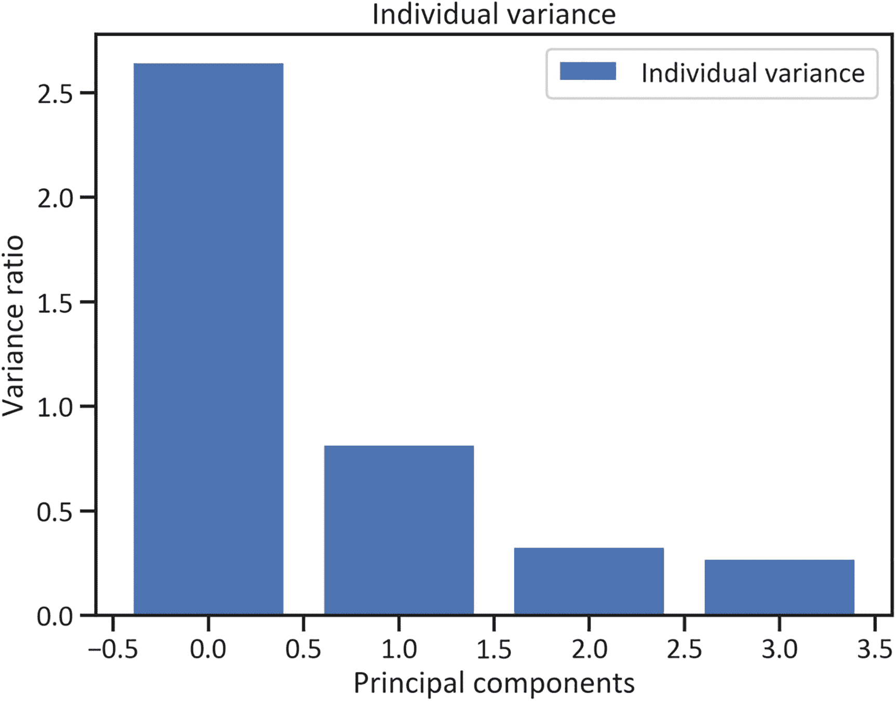

图 5-14

个体方差

```py
from sklearn.decomposition import PCA
from sklearn.preprocessing import StandardScaler
scaler = StandardScaler()
std_df = scaler.fit_transform(df)
pca = PCA()
pca.fit_transform(std_df)
pca_variance = pca.explained_variance_
plt.figure(figsize=(8, 6))
plt.bar(range(4), pca_variance, align="center", label="Individual variance")
plt.legend()
plt.ylabel("Variance ratio")
plt.xlabel("Principal components")
plt.title("Individual variance")
plt.show()

Listing 5-17Individual Variance

```

清单 [5-18](#PC18) 应用主成分分析并减少数据，以使我们可以将其绘制成二维散点图(见图 [5-15](#Fig15) )。

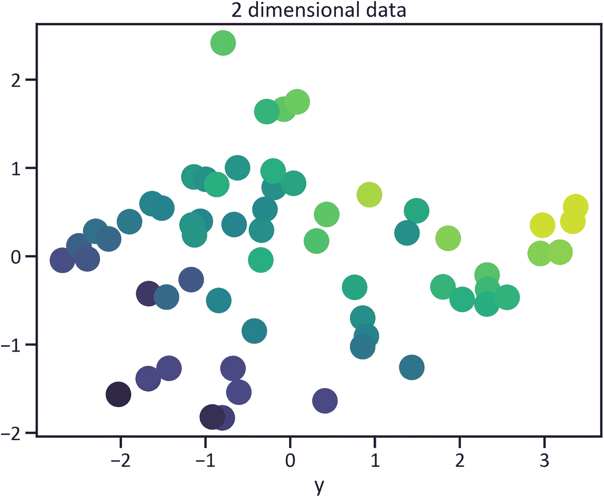

图 5-15

二维数据

```py
pca2 = PCA(n_components=2)
pca2.fit(std_df)
x_3d = pca2.transform(std_df)
plt.figure(figsize=(8,6))
plt.scatter(x_3d[:,0], x_3d[:,1], c=df['gdp_growth'],cmap="viridis",s=350)
plt.xlabel("y")
plt.title("2 dimensional data")
plt.show()

Listing 5-18Dimension Reduction

```

图 [5-15](#Fig15) 显示了减少数据如何将其分散成二维散点图。

## 将连续变量转化为二进制变量

清单 [5-19](#PC19) 检索南非出生时预期寿命的年度变化。然后，它决定了系列的方向。最后，它*通过应用`get_dummies()`方法将响应变量*二进制化。将一个方法二进制化意味着将它分类(例如，一个“否”或“是”，其中你将“否”编码为`0`，将“是”编码为`1`)。

```py
df['pct_change'] = df["life_exp"].pct_change()
df = df.dropna()
df['direction'] = np.sign(df['pct_change']).astype(int)
df["direction"] = pd.get_dummies(df["direction"])
df.head()

Listing 5-19Binarize the Response Variable

```

表 [5-7](#Tab7) 包括两个新列，pct_change 和 Direction。在本章中，我们使用方向作为响应变量。我们不打算在这个模型中涵盖预期寿命和 pct_change，所以您可以删除这些列。

表 5-7

新数据框架

<colgroup><col class="tcol1 align-left"> <col class="tcol2 align-left"> <col class="tcol3 align-left"> <col class="tcol4 align-left"> <col class="tcol5 align-left"> <col class="tcol6 align-left"> <col class="tcol7 align-left"></colgroup> 
| 

日期

 | 

都市流行

 | 

人均国民总收入

 | 

gdp _ 增长

 | 

生活经验

 | 

pct_change

 | 

方向

 |
| --- | --- | --- | --- | --- | --- | --- |
| 2019-01-01 | Thirty-nine million one hundred and forty-nine thousand seven hundred and fifteen | 3200.508475 | 0.152583 | Sixty-four point one three one | 0.120333 | Zero |
| 2018-01-01 | Thirty-eight million three hundred and forty-eight thousand two hundred and twenty-seven | 3200.508475 | 0.787056 | Sixty-three point eight five seven | -0.004273 | one |
| 2017-01-01 | Thirty-seven million five hundred and forty thousand nine hundred and twenty-one | 3200.508475 | 1.414513 | Sixty-three point five three eight | -0.004996 | one |
| 2016-01-01 | Thirty-six million seven hundred and twenty-six thousand six hundred and forty | 3200.508475 | 0.399088 | Sixty-three point one five three | -0.006059 | one |
| 2015-01-01 | Thirty-five million nine hundred and five thousand eight hundred and seventy-five | 3200.508475 | 1.193733 | Sixty-two point six four nine | -0.007981 | one |

## 使用 Scikit-Learn 开发逻辑回归模型

这个部分通过应用`scikit-learn`库来训练逻辑分类器。清单 [5-20](#PC20) 首先创建一个 X 和 Y 数组，然后将数据拆分成训练和测试数据。然后将数据标准化。

```py
from sklearn.preprocessing import StandardScaler
from sklearn.model_selection import train_test_split
x = df.iloc[::,0:3]
scaler = StandardScaler()
x= scaler.fit_transform(x)
y = df.iloc[::,-1]
x_train, x_test, y_train, y_test = train_test_split(x,y,test_size=0.2,random_state=0)

Listing 5-20Data Preprocessing

```

清单 [5-21](#PC21) 训练逻辑分类器。

```py
from sklearn.linear_model import LogisticRegression
logregclassifier = LogisticRegression()
logregclassifier.fit(x_train,y_train)

Listing 5-21Train Logistic Classifier by Applying Statsmodels

```

清单 [5-22](#PC22) 和 [5-23](#PC23) 估计逻辑回归模型的截距和系数。

```py
logregclassifier.coef_

array([[-0.09342681, -1.02609323,  0.35329756]])

Listing 5-23Coefficients

```

```py
logregclassifier.intercept_
array([1.47270205])

Listing 5-22Intercept

```

## 逻辑回归混淆矩阵

为了调查逻辑回归模型的性能，列表 [5-24](#PC24) 创建了一个*混淆*矩阵(见表 [5-8](#Tab8) )。要评估分类模型，您可以应用不同于线性回归模型的评估指标。在分类中，你分析一个模型有多准确和精确(见表 [5-10](#Tab10) )。初始步骤包括构建混淆矩阵(见表 [5-8](#Tab8) )。

表 5-8

逻辑分类器混淆矩阵

<colgroup><col class="tcol1 align-left"> <col class="tcol2 align-left"> <col class="tcol3 align-left"></colgroup> 
|   | 

**预测:预期寿命下降**

 | 

**预测:预期寿命增加**

 |
| --- | --- | --- |
| **实际:预期寿命减少** | Zero | three |
| **实际:预期寿命增加** | one | eight |

```py
from sklearn import metrics
y_predlogregclassifier = logregclassifier.predict(x_test)
cmatlogregclassifier = pd.DataFrame(metrics.confusion_matrix(y_test,y_predlogregclassifier), index=["Actual: Decreasing life expectancy",
                                    "Actual: Increasing life expectancy"],
                       columns = ("Predicted: Decreasing life expectancy",
                                  "Predicted: Increasing life expectancy"))
cmatlogregclassifier

Listing 5-24Logistic Classifier Confusion Matrix

```

## 逻辑回归混淆矩阵解释

表 [5-9](#Tab9) 解释表 [5-8](#Tab8) 的结果。

表 5-9

逻辑分类器混淆矩阵解释

<colgroup><col class="tcol1 align-left"> <col class="tcol2 align-left"></colgroup> 
| 

公制的

 | 

解释

 |
| --- | --- |
| 正确肯定 | 当南非的预期寿命实际上在下降时，逻辑分类器并没有预测出生时预期寿命的下降。 |
| 正确否定 | 逻辑分类器预测出生时预期寿命增加，而实际上南非的预期寿命增加了三倍。 |
| 正确肯定 | 逻辑分类器预测出生时预期寿命下降，而南非的预期寿命实际上在增加(增加了一倍)。 |
| 假阴性 | 逻辑分类器预测出生时预期寿命增加，而南非的预期寿命实际上在下降(8 倍)。 |

## 逻辑回归分类报告

为了进一步研究逻辑回归模型的性能，列表 [5-25](#PC25) 构建了一个分类报告(见表 [5-10](#Tab10) )。它概述了该模型如何做出准确和精确的估计。

表 5-10

逻辑回归分类报告

<colgroup><col class="tcol1 align-left"> <col class="tcol2 align-left"> <col class="tcol3 align-left"> <col class="tcol4 align-left"> <col class="tcol5 align-left"> <col class="tcol6 align-left"></colgroup> 
|   | 

Zero

 | 

one

 | 

准确

 | 

Avg 宏

 | 

加权平均值

 |
| --- | --- | --- | --- | --- | --- |
| 精确 | Zero | 0.727273 | 0.666667 | 0.363636 | 0.545455 |
| 回忆 | Zero | 0.888889 | 0.666667 | 0.444444 | 0.666667 |
| f1-分数 | Zero | 0.800000 | 0.666667 | 0.400000 | 0.600000 |
| 支持 | Three | 9.000000 | 0.666667 | 12.000000 | 12.000000 |

```py
creportlogregclassifier = pd.DataFrame(metrics.classification_report(y_test,y_predlogregclassifier,output_dict=True))
creportlogregclassifier

Listing 5-25Logistic Regression Classification Report

```

表 [5-10](#Tab10) 显示，逻辑分类器在 66.67%的情况下是准确的，当它预测预期寿命下降时，最多是 0%准确。当它预测出生时预期寿命增加时，它有 67%的准确性。

## 逻辑回归 ROC 曲线

列表 [5-26](#PC26) 估计了敏感度(FPR)和特异性(TPR)之间的权衡，因为逻辑回归分类器区分了南非出生时预期寿命的增加和减少(见图 [5-16](#Fig16) )。

等式 5-2 定义了真阳性率:

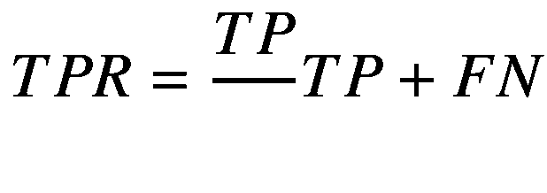

(等式 5-2)

其中 *TP* 是真阳性(分类器在预测发生时做出适当预测的倾向)，而 *FP* 是假阳性(分类器在预测没有发生时做出适当预测的倾向)。

等式 5-3 定义了真阳性率:

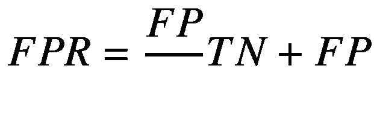

(等式 5-3)

```py
y_predlogregclassifier_proba = logregclassifier.predict_proba(x_test)[::,1]
fprlogregclassifier, tprlogregclassifier, _ = metrics.roc_curve(y_test,y_predlogregclassifier_proba)
auclogregclassifier = metrics.roc_auc_score(y_test,y_predlogregclassifier_proba)
fig, ax = plt.subplots()
plt.plot(fprlogregclassifier, tprlogregclassifier,label="auc: "+str(auclogregclassifier),color="navy",lw=4)
plt.plot([0,1],[0,1],color="red",lw=4)
plt.xlim([0.00,1.01])
plt.ylim([0.00,1.01])
plt.title("Logistic ROC curve")
plt.xlabel("Sensitivity")
plt.ylabel("Specificity")
plt.legend(loc=4)
plt.show()

Listing 5-26Logistic Regression ROC Curve

```

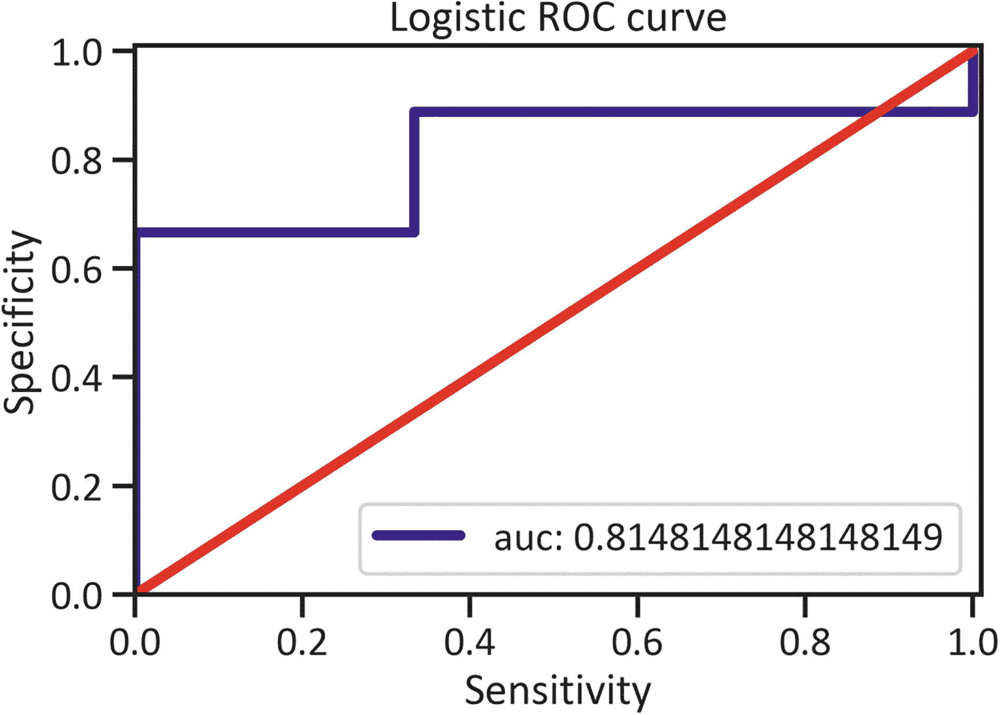

图 5-16

逻辑回归 ROC 曲线

为了检测逻辑回归是否是一个合适的分类预测因子，调查曲线下面积(AUC)得分。如果该值超过 0.81，则认为该模型是示例性的。图 [5-16](#Fig16) 显示，在预测南非的预期寿命时，逻辑回归分类器的平均准确率为 88.88%。

## 逻辑回归精确回忆曲线

列表 [5-27](#PC27) 估计了精度和阈值之间的权衡，因为逻辑回归分类器区分了南非预期寿命的增加和减少(见图 [5-17](#Fig17) )。

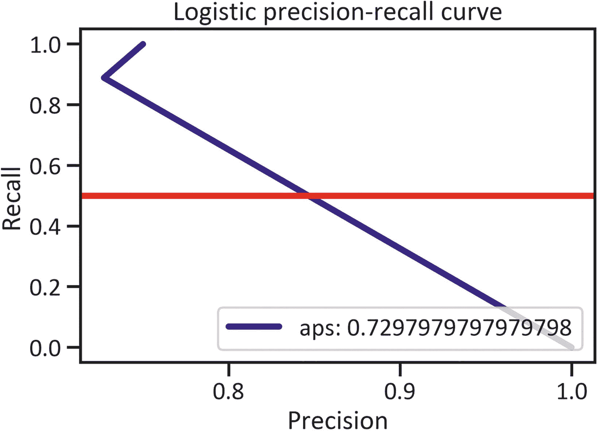

图 5-17

逻辑回归分类器精度-召回曲线

```py
precisionlogregclassifier, recalllogregclassifier, thresholdlogregclassifier = metrics.precision_recall_curve(y_test,y_predlogregclassifier)
apslogregclassifier = metrics.average_precision_score(y_test,y_predlogregclassifier)
fig, ax = plt.subplots()
plt.plot(precisionlogregclassifier, recalllogregclassifier,label="aps: " +str(apslogregclassifier),color="navy",lw=4)
plt.axhline(y=0.5, color="red",lw=4)
plt.title("Logistic precision-recall curve")
plt.xlabel("Precision")
plt.ylabel("Recall")
plt.legend(loc=4)
plt.show()

Listing 5-27Logistic Regression Classifier Precision-Recall Curve

```

图 [5-17](#Fig17) 显示，平均而言，逻辑回归分类器在区分南非预期寿命增加和减少时的准确率为 69.44%。

## 逻辑回归学习曲线

清单 [5-28](#PC28) 展示了随着训练测试规模的增加，逻辑回归分类器如何学习正确区分南非出生时预期寿命的增加和减少(见图 [5-18](#Fig18) )。


图 5-18

逻辑回归学习曲线

```py
from sklearn.model_selection import learning_curve
trainsizelogregclassifier, trainscorelogregclassifier, testscorelogregclassifier = learning_curve(logregclassifier, x, y, cv=5, n_jobs=-1, scoring="accuracy", train_sizes=np.linspace(0.1,1.0,50))
trainscorelogregclassifier_mean = np.mean(trainscorelogregclassifier,axis=1)
trainscorelogregclassifier_std = np.std(trainscorelogregclassifier,axis=1)
testscorelogregclassifier_mean = np.mean(testscorelogregclassifier,axis=1)
testscorelogregclassifier_std = np.std(testscorelogregclassifier,axis=1)
fig, ax = plt.subplots()
plt.plot(trainsizelogregclassifier, trainscorelogregclassifier_mean, color="red", label="Training accuracy score",lw=4)
plt.plot(trainsizelogregclassifier, testscorelogregclassifier_mean,color="navy",label="Cross validation accuracy score",lw=4)
plt.title("Logistic classifier learning curve")
plt.xlabel("Training set size")
plt.ylabel("Accuracy")
plt.legend(loc="best")
plt.show()

Listing 5-28Logistic Regression Learning Curve

```

图 [5-18](#Fig18) 显示，在前 10 个数据点之后，交叉验证准确度得分下降——在第 20 个数据点达到最低峰值——然后上升。此外，它表明，在前十个数据点之后，训练准确度分数显著高于交叉验证准确度分数。

## 结论

本章将响应变量二进制化，0 代表预期寿命减少，`1`代表预期寿命增加。它使用逻辑分类器操作一组预测变量(南非城市人口、人均国民总收入、Atlas 方法和国内生产总值增长)来预测未来的预期寿命等级。

在研究了这个模型的发现后，我们发现它在预测响应变量(南非的预期寿命)的未来类别方面具有示范性。第 [8](08.html) 章通过应用深度学习模型来解决同样的问题。第 6 章[涵盖了通过应用无监督模型解决计量经济学中的序列问题。](06.html)