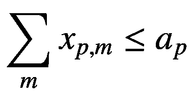
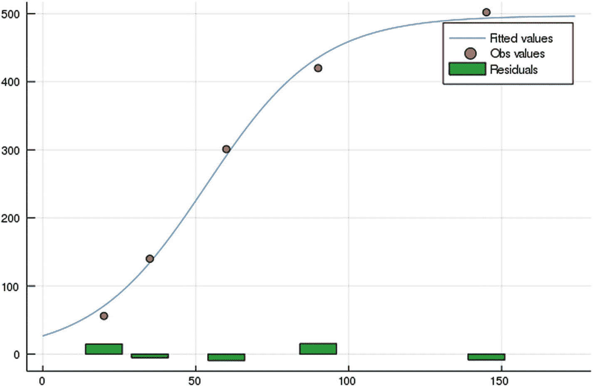

# 10.数学图书馆

本章包括对以下第三方软件包的讨论:

<colgroup><col class="tcol1 align-left"> <col class="tcol2 align-left"> <col class="tcol3 align-left"></colgroup> 
| 

包名

 | 

统一资源定位器

 | 

版本

 |
| --- | --- | --- |
| `JuMP.jl` | [T2`https://github.com/JuliaOpt/JuMP.jl`](https://github.com/JuliaOpt/JuMP.jl) | v0.19.2 |
| `GLPK.jl` | [T2`https://github.com/JuliaOpt/GLPK.jl`](https://github.com/JuliaOpt/GLPK.jl) | v0.10.0 |
| `Ipopt.jl` | [T2`https://github.com/JuliaOpt/Ipopt.jl`](https://github.com/JuliaOpt/Ipopt.jl) | v0.5.4 |
| `SymPy.jl` | [T2`https://github.com/JuliaPy/SymPy.jl`](https://github.com/JuliaPy/SymPy.jl) | v1.0.5 |
| `LsqFit.jl` | [T2`https://github.com/JuliaNLSolvers/LsqFit.jl`](https://github.com/JuliaNLSolvers/LsqFit.jl) | v0.8.1 |

虽然 Julia 是一种完整的通用编程语言，但不可否认的是，其社区的焦点目前集中在数学和计算问题上。您已经看到了用于处理数字数据的大量库，以及从 Julia 开发的最开始，计算性能的含义是如何影响决策的。

本章列出了一些最成熟的数学分析库。其中一些，像数值优化跳转，通常是开始使用 Julia 的主要原因。

这个列表是部分的，集中在相对一般的任务上。寻找特定包的良好起点是 [`https://pkg.julialang.org/docs/`](https://pkg.julialang.org/docs/) 或 [`https://juliaobserver.com/categories/Mathematics`](https://juliaobserver.com/categories/Mathematics) 。

## 10.1 JuMP，一个优化框架

JuMP ( [`https://github.com/JuliaOpt/JuMP.jl`](https://github.com/JuliaOpt/JuMP.jl) )是一种针对数学优化问题的“代数建模语言”(AML)，类似于 GAMS ( [`https://www.gams.com/`](https://www.gams.com/) )、AMPL ( [`https://ampl.com/`](https://ampl.com/) )或 Pyomo ( [`http://www.pyomo.org/`](http://www.pyomo.org/) )。

最优化问题是在目标函数和变量之间的约束的上下文中寻找决策变量的“最优”量的问题。现实世界中到处都有约束，商业决策也是如此(例如，“我们应该生产多少 X？”)、工程设置(例如，“我们应该在哪个角度设计襟翼以获得最大效率？”)，或者个人选择(例如，“在城市的小公寓还是在乡下的大房子？”).

这类问题可以用数学公式表示为一个函数，以最大化(或最小化)服从作为约束的其他函数。

软件“工具”已经被创造出来解决这些问题。它们通常要求您以矩阵格式表述优化问题，对于非线性问题，提供一些关于一阶和二阶导数的问题的附加信息，以帮助找到数值最优解。MATLAB 优化工具箱中基于规划求解的方法或 R 的`optim`函数是两个众所周知的例子。

AML 采取了一种不同的方法，因为它们将问题的表述与用于解决问题的特定算法相分离。这个问题现在可以用代数的方法来编码，用的是描述它的相同的数学符号。

至关重要的是，可以使用“集合”的概念在任何维度上索引变量，从而允许您编写像`Demand[year,time,region,product] = Supply[year,time,region,product]`这样的方程。包括自动提供衍生工具的工具。

一旦这些问题被公式化，它们就可以被 AML 软件支持的、适合于特定问题类别的任何“求解器引擎”求解。

然而，商业 AML 确实有一个缺点——它们各自使用自己特定的语言。由于是特定于语言的，它们在许多特征(数据处理、开发工具的可用性、语言结构等)上落后于“真正的”、通用的编程语言。).在一个更大的模型中，将它们与其他与优化无关的部分连接起来可能会很困难。

JuMP 是“第三代”优化工具的一部分(第一代是求解器引擎本身，第二代是商业的、特定语言的 are AML 作为一个软件库嵌入在通用编程语言中。

JuMP 提供了与特定于语言的 AML 相同的建模简单性和求解器独立性，同时提供了更加实用的建模环境的好处。如果它与免费的求解引擎(例如，混合整数问题的 GLPK 和非线性问题的 IPOPT)相结合，它就是一个完整的开源解决方案。

在本节中，您将通过实现两个问题来学习如何使用 JuMP，一个问题只有线性函数，另一个问题的目标是非线性的。问题的一般设置将是相同的:您选择更适合特定问题的求解器，您为求解器特定的接口加载 Julia 包，您创建问题“对象”，并向其添加其特征元素，如变量、目标函数和约束。此时，您可以“解决”问题并检索其解决方案。

这些例子也凸显了 Julia macros 的能力。使用它们，JuMP 实现了自己的语言，同时仍然保持 Julia。

### 10.1.1 运输问题:线性问题

#### 问题是

这是 GAMS 教程中使用的基本传输模型的跳跃变换。

给定单一产品、`p`工厂和`m`市场，问题包括定义`p`和`m`之间的最佳路线以最小化运输成本，同时遵守每个工厂的容量限制( *a* <sub>*p*</sub> )并满足每个市场的需求 *b* <sub>*m*</sub> :


服从于:




其中 *c* <sub>*p，m*</sub> 为`p`和`m`之间的单位运输成本， *x* <sub>*p，m*</sub> 为运输数量(待定)。最初的公式来自“Dantzig G. B. (1963)，*线性规划和扩展，第 3.3 章*，普林斯顿大学出版社”，而其 GAMS 实现可以在“Rosenthal，R. E. (1988) *GAMS:用户指南，第 2 章:GAMS 教程*，科学出版社”或 [`https://www.gams.com/mccarl/trnsport.gms`](https://www.gams.com/mccarl/trnsport.gms) 中找到。

为了便于比较，我在注释中留下了每个操作的等价 GAMS 代码。

#### 导入库

您首先需要导入跳转包。然后，您需要用所需的规划求解引擎实现特定接口的包。在这种情况下，我们将处理一个线性问题，因此您将使用 *GNU 线性编程工具包* (GLPK)库并安装`GLPK.jl` Julia 包。

`GLPK.jl`和`Ipopt.jl`包都将自动安装必要的二进制文件供自己使用(除非您指示它们使用本地安装的二进制文件，在安装或构建包之前设置`ENV["JULIA_GLPK_LIBRARY_PATH"], ENV["JULIA_IPOPT_LIBRARY_PATH"]`和`ENV["JULIA_IPOPT_EXECUTABLE_PATH"]`)。

需要 CSV 包来加载数据。

```py
using CSV, JuMP, GLPK JULIA

```

#### 定义集合

JuMP 没有独立的集合语法，但是它使用核心 Julia 语言中的本地容器。变量、参数和约束可以使用这些容器进行索引。虽然您可以使用基于位置的列表，但最好使用字典(牺牲一点效率)。因此，这些例子中的“集合”被表示为列表，但是其他所有东西(变量、约束和参数)都是一个字典，列表的元素作为键。

```py
# Define sets # JULIA
#  Sets
#      i   canning plants   / seattle, san-diego /
#      j   markets          / new-york, chicago, topeka / ;
plants  = ["seattle","san-diego"]          # canning plants
markets = ["new-york","chicago","topeka"]  # markets

```

#### 定义参数

工厂的产能和市场的需求被直接定义为字典，而距离首先作为数据帧从空白分隔的表中读取。然后它被转换成一个“(工厂，市场)价值”字典。

```py
# Define parameters # JULIA
#   Parameters
#       a(i) capacity of plant i in cases
#         /   seattle     350
#             san-diego   600  /
a = Dict(             # capacity of plant i in cases
  "seattle"   => 350,
  "san-diego" => 600,
)

#       b(j) demand at market j in cases
#         /  new-york     325
#            chicago      300
#            topeka       275  / ;
b = Dict(             # demand at market j in cases
  "new-york" => 325,
  "chicago"  => 300,
  "topeka"   => 275,
)

# Table d(i,j) distance in thousands of miles
#                   new-york chicago topeka
#      seattle         2.5     1.7     1.8
#      san-diego       2.5     1.8     1.4 ;
d_table = CSV.read(IOBuffer("""
plants     new-york  chicago  topeka
seattle    2.5       1.7      1.8
san-diego  2.5       1.8      1.4
"""),delim=" ", ignorerepeated=true, copycols=true)
# Here we are converting the table in a "(plant, market) => distance" dictionary
# r[:plants]: the first key, using the cell at the given row and `plants` field
# m:          the second key
# r[Symbol(m)]: the value, using the cell at the given row and the `m` field
d = Dict( (r[:plants],m) => r[Symbol(m)] for r in eachrow(d_table), m in markets)

# Scalar f freight in dollars per case per thousand miles /90/ ;
f = 90 # freight in dollars per case per thousand miles

# Parameter c(i,j) transport cost in thousands of dollars per case

;
#            c(i,j) = f * d(i,j) / 1000 ;
# We first declare an empty dictionary and then we fill it with the values
c = Dict() # transport cost in thousands of dollars per case ;
[ c[p,m] = f * d[p,m] / 1000 for p in plants, m in markets]

```

#### 声明模型

在这里，您声明了一个跳转优化模型，并给它命名。该名称将作为第一个参数传递给所有后续操作，如变量、约束和目标函数的创建(如果您愿意，可以同时处理几个模型)。

您可以在此时指定规划求解引擎(如这里所做的那样)，或者等同地，在以后解决问题时指定。您还可以指定规划求解引擎特定的选项。

```py
# Model declaration (transport model) JULIA
trmodel = Model(with_optimizer(GLPK.Optimizer,msg_lev=GLPK.MSG_ON)) # we choose GLPK with a verbose output

```

#### 声明模型变量

变量是在`@variable`宏中声明和定义的，可以有多个维度——也就是说，它们可以在几个索引下被索引。界限是在声明的同时给出的。与 GAMS 相反，你不需要定义目标函数左边的变量。

```py
## Define variables ## JULIA
#  Variables
#       x(i,j)  shipment quantities in cases
#       z       total transportation costs in thousands of dollars ;
#  Positive Variable x ;
@variables trmodel begin
    x[p in plants, m in markets] >= 0 # shipment quantities in cases
end

```

#### 声明模型约束

如在 GAMS 中，每个约束实际上可以是约束的“族”，因为它可以在定义的集合上被索引:

```py
## Define contraints ## JULIA
# supply(i)   observe supply limit at plant i
# supply(i) .. sum (j, x(i,j)) =l= a(i)
# demand(j)   satisfy demand at market j ;
# demand(j) .. sum(i, x(i,j)) =g= b(j);
@constraints trmodel begin
    supply[p in plants],   # observe supply limit at plant p
        sum(x[p,m] for m in markets)  <= a[p]
    demand[m in markets],  # satisfy demand at market m
        sum(x[p,m] for p in plants)   >= b[m]
end

```

#### 声明模型目标

与约束和变量相反，目标是唯一的、单一的函数。请注意，正是在这一点上，您指定了优化的方向。

```py
# Objective JULIA
@objective trmodel Min begin
    sum(c[p,m]*x[p,m] for p in plants, m in markets)
end

```

#### 人类可读的模型可视化(可选)

如果您愿意，您可以将优化模型以人类可读的方式打印出来，这样您就可以检查它是否正确。

```py
print(trmodel) # The model in mathematical terms is printed JULIA

```

#### 模型的分辨率

此时将调用求解器，并将模型传递给求解器引擎进行求解。注意感叹号，它表示调用将修改`trmodel`对象。

你可以用几个规划求解引擎来求解一个模型，方法是为你想要尝试的每个规划求解引擎制作一个模型的深层副本，并在这里指明`optimize! (myCopiedModel(with_optimizer(...)))`(而不是在`Model()`构造函数中，就像你在这个例子中所做的那样。).

```py
optimize!(trmodel) JULIA

```

#### 结果的可视化

您可以使用`termination_status(modelObject)`(希望有一个`MOI.OPTIMAL`)检查求解器的返回状态，并分别使用`objective_value(modelObject)`和`value(variableName)`检索目标函数和变量的值。给`dual(constraintName)`打个电话就能获得双重身份。

然后，您可以根据自己的喜好打印/可视化它们，例如:

```py
status = termination_status(trmodel) JULIA

if (status == MOI.OPTIMAL || status == MOI.LOCALLY_SOLVED || status == MOI.TIME_LIMIT) && has_values(trmodel)
    if (status == MOI.OPTIMAL)
        println("** Problem solved correctly **")
    else
        println("** Problem returned a (possibly suboptimal) solution **")
    end
    println("- Objective value (total costs): ", objective_value(trmodel))
    println("- Optimal routes:")
optRoutes = value.(x)
    [println("$p --> $m: $(optRoutes[p,m])") for m in markets, p in plants]
    println("- Shadow prices of supply:")
    [println("$p = $(dual(supply[p]))") for p in plants]
    println("- Shadow prices of demand:")
    [println("$m = $(dual(demand[m]))") for m in markets]
else
    println("The model was not solved correctly.")
    println(status)
end

```

这应该如下所示:

```py
# ** Problem solved correctly ** JULIA
# - Objective value (total costs): 153.675
# - Optimal routes:
# seattle --> new-york: 50.0
# seattle --> chicago: 300.0
# seattle --> topeka: 0.0
# san-diego --> new-york: 275.0
# san-diego --> chicago: 0.0
# san-diego --> topeka: 275.0
# - Shadow prices of supply:
# seattle = 0.0
# san-diego = 0.0
# - Shadow prices of demand:
# new-york = 0.225
# chicago = 0.153
# topeka = 0.12599999999999997

```

### 10.1.2 在比萨饼和三明治之间选择，一个非线性问题

非线性问题的唯一区别是你必须为变量提供好的起点(试着用`0`作为起点运行下面的例子！)，用特定的`@NLconstraints`宏定义(非线性)约束，用`@NLobjective`宏定义(非线性)目标。

注意，你不需要提供任何额外的信息(特别是，不需要导数)。

#### 问题是

一个学生必须选择如何分配她每周 80 美元的食物预算。她只能在比萨饼(`p`)和三明治(`s`)之间选择。披萨要 10 美元，三明治只要 4 美元。

她的“效用函数”(她对披萨和三明治的任何给定组合有多开心)是 100*p*2*p*T4】2+70*s*2*s*T10】23*PS*。她两样都喜欢，尤其喜欢比萨饼。

您使用一个简单的问题，即受单个约束的两个变量的非线性函数的最大化。为了简化示例，这里不使用集合(也就是说，变量和约束都是标量)。


服从于:

10 *p* + 4 *s* ≤ 80

其中第一个等式是效用函数，第二个等式是经济学家所说的“预算约束”，即我们不能花比我们拥有的更多的钱。

#### 导入库并声明模型

在处理非线性模型时，您需要选择一个能够处理这类问题的规划求解引擎。IPOPT 完成这项工作:

```py
using JuMP, Ipopt JULIA
m = Model(with_optimizer(Ipopt.Optimizer, print_level=0))

```

#### 声明模型变量、约束和目标

由于这些是物理量，在显式约束之上，您需要为变量添加一个下限`0`(下限和上限可以在一个表达式中指定，如`lB <= var <= uB`)。

```py
m = Model(with_optimizer(Ipopt.Optimizer)) JULIA

@variable(m, 0 <= p, start=1, base_name="Quantities of pizzas")
@variable(m, 0 <= s, start=1, base_name="Quantities of sandwiches")

@constraint(m, budget,     10p + 4s <= 80)

@NLobjective(m, Max, 100*p - 2*p^2 + 70*s - 2*s^2 - 3*p*s)

```

你可以把这个问题解释为最优的“周平均值”，所以如果最优结果是半个比萨饼，那也没关系。否则，您应该通过在声明中添加选项`integer=true`来将变量限制为整数。但是问题的类别会变成混合整数非线性规划(MINLP)，你也必须改变求解引擎(`bonmin`适用于解决 MINLP 问题)。

#### 模型的分辨率和结果的可视化

假设问题是非线性的，解决方案被报告为“局部最优”。然后由您决定问题的性质是否保证局部最优也是全局最优(就像在这种情况下)。

```py
optimize!(m) JULIA

status = termination_status(m)

if (status == MOI.OPTIMAL || status == MOI.LOCALLY_SOLVED || status == MOI.TIME_LIMIT) && has_values(m)
    if (status == MOI.OPTIMAL)
        println("** Problem solved correctly **")
    else
        println("** Problem returned a (possibly suboptimal) solution **")
    end
    println("- Objective value : ", objective_value(m))
    println("- Optimal solutions:")
    println("pizzas: $(value.(p))")
    println("sandwiches: $(value.(s))")
    println("- Dual (budget): $(dual.(budget))")
else
    println("The model was not solved correctly.")
    println(status)
end

# Expected output:
# ** Problem returned a (possibly suboptimal) solution **
# - Objective value : 750.8928616403513
# - Optimal solutions:
# pizzas: 4.642857242997538
# sandwiches: 8.39285709239478
# - Dual (budget): -5.624999975248088

```

## 10.2 SymPy，CAS 系统

另一个有用的数学包是`SymPy.jl`(参见 [`https://github.com/JuliaPy/SymPy.jl`](https://github.com/JuliaPy/SymPy.jl) )，它是 Python SymPy(参见 [`https://www.sympy.org/en/index.html`](https://www.sympy.org/en/index.html) )库的包装器，用于符号计算，也就是导数、积分、方程(或方程组)等的*解析*解析。

SymPy 是一个非常大的库，一个*计算机代数系统，*，其特性从基本的符号运算到量子物理。你在这里可以看到这个库的一般结构，它解决了上一节中的相同问题，但是这次是分析性的。参考 SymPy 文档( [`https://docs.sympy.org/latest/index.html`](https://docs.sympy.org/latest/index.html) )获取完整的 API(大部分都有直接的`SymPy.jl`对应)。

### 10.2.1 加载库和声明符号

变量可以用`@var x y z`语法声明。还可以声明变量的域，如`positive`、`real`、`integer`、`odd`等。(完整列表可在 [`https://docs.sympy.org/dev/modules/core.html#module-sympy.core.assumptions`](https://docs.sympy.org/dev/modules/core.html%2523module-sympy.core.assumptions) 获得)。您可以解决选择比萨饼(`qp`)和三明治(`qs`)的相同示例，但是保持比萨饼(`pp`)和三明治(`ps`)的价格是象征性的，只是为了表明检索到的解决方案本质上是分析性的。只有以后你才会得到一个具体的数值。我通过强制使用全部预算来简化这个例子。这允许你使用拉格朗日乘数法来寻找解析解(如果这对你来说是新的，不要担心。当符号在解析解中被替换为实际数值时，只需遵循 SymPy 如何被用于操纵符号方程并在稍后找到数值解。).

```py
using SymPy JULIA
@vars qp qs pp ps positive=true
@vars λ

```

### 创建和操作表达式

一旦你声明了这些符号，你就可以用它们来创建代数表达式(函数)。注意`q`<sub>`p`</sub>`q`<sub>`S`</sub>等。现在既是朱丽亚变量又是`SymPy.jl`“符号”，是对潜在的交响乐结构的一种引用。您创建的表达式也是如此(不要与 Julia 语言表达式混淆):

```py
julia> typeof(:(qp+qS)) # A Julia language Expression        JULIA
Expr
julia> typeof(:(qp))     # A Julia Symbol
Symbol
julia> typeof(qp+qS)    # A SymPy expression, i.e. a SymPy object
Sym

```

你可以通过给目标解加上每个约束乘以相对的“拉格朗日乘数”来创建所谓的“拉格朗日”。

然后，您可以使用`diff(function,variable)`检索这个拉格朗日函数的偏导数:

```py
utility = 100*qp - 2*qp^2 + 70*qS - 2*qs^2 - 3*qp*qs JULIA
budget  = pp* qp + ps*qs
lagr    = utility + λ*(80 - budget)
dlqp      = diff(lagr,qp)
dlqs      = diff(lagr,qs)
dlλ     = diff(lagr,λ)

```

如前所述，每个导数都用符号表示:

```py
julia> dlqp JULIA
-pp·λ - 4·qp - 3·qs + 100

```

### 求解一个方程组

一阶条件告诉你，用`q` <sub>`p`</sub> 、`q` <sub>`s`</sub> 、`λ`表示的解，将通过设置拉格朗日的相对导数等于零来找到。也就是说，你求解的是一个包含三个变量和三个未知数的方程组。

`solve([equations],[variables])`确实如此:

```py
julia> sol = solve([Eq(dlqp,0), Eq(dlqs,0), Eq(dlλ,0)],[qp, qs, λ]) # SymPy.solve if a function named "solve"
has been already defined in other packages JULIA
Dict{Any,Any} with 3 entries:
  λ => 5*(19*pp - 2*ps - 56)/(2*pp^2 - 3*pp*ps + 2*ps^2)
  qp => 5*(-7*pp*ps + 32*pp + 10*ps^2 - 24*ps)/(2*pp^2 - 3*pp*ps + 2*ps^2)
  qs => 5*(7*pp^2 - 10*pp*ps - 24*pp + 32*ps)/(2*pp^2 - 3*pp*ps + 2*ps^2)

```

`solve`函数也直接接受表达式，将它们设置为零。因此，这也是可行的:`solve([dlqp, dlqs, dlλ], [qp, qs, λ])`。

### 检索数值

您可以使用`myExpression.evalf(subs=Dict(symbol=>value))`将符号的给定数值“注入”到表达式中，并检索表达式的相应数值。

您通过将比萨饼的价格指定为$10，三明治的价格指定为$4 来检索解决方案的数值:

```py
qp_num = sol[qp].evalf(subs=Dict(pp=>10,ps=>4)) # 4.64285714285714  JULIA
qs_num = sol[qs].evalf(subs=Dict(pp=>10,ps=>4)) # 8.39285714285714
λ_num = sol[λ].evalf(subs=Dict(pp=>10,ps=>4)) # 5.625

```

即使被形象化为数字，`q`<sub>`p`</sub>`_num, q`<sub>`s`</sub>`_num`，`and`【λ】`_num`仍然是同体对象。要将它们转换成 Julia 数，可以使用`N(SymPySymbol)`。比如`N(q` <sub> `p` </sub> `_num)`。

最后，为了检索目标函数的数值，让我们用这些数值替换效用函数中的符号:

```py
z = utility.evalf(subs=Dict(qp=>qp_num, qs=>qs_num)) #750.892857142857 JULIA

```

您已经检索到了与使用 JuMP 在数值上找到的相同的“最优”值(如预期的那样)。

## 10.3 LsqFit，一个数据拟合库

作为第三个例子，我选择了一个数据拟合模型。统计学(以及机器学习的相关领域)可能是 Julia 社区中发展最活跃的领域。LsqFit 软件包在保持用户友好的同时提供了很大的灵活性。

给定法国西北部 <sup>[1](#Fn1)</sup> 林分的木材材积数据样本，您将使用它来估计山毛榉(一种阔叶树种)林分的逻辑斯谛生长曲线(Verhulst 模型)。

### 10.3.1 加载库和定义模型

首先，您要指定您想要拟合的模型的函数形式，以及要估计的参数的位置。`@.`宏是避免在每个操作中指定点运算符(用于广播)的有用工具。

您要估计的模型是众所周知的逻辑函数:


```py
using LsqFit,CSV,Plots JULIA

# **** Fit volumes to logistic model ***

@. model(age, pars) = pars[1] / (1+exp(-pars[2] * (age - pars[3])))

obsVols = CSV.read(IOBuffer("""
age  vol
20   56
35   140
60   301
90   420
145  502
"""), delim=" ", ignorerepeated=true, copycols=true)

```

### 参数

由于寻找拟合的算法是非线性的，您必须提供一些“合理的”起点。在逻辑函数的情况下，第一个参数是该函数达到的最高水平(“承载能力”)，第二个参数是增长率，第三个参数是 x 标尺上的中点。以下可能是合理的起点:

```py
par0 = [600, 0.02, 60] JULIA

```

### 拟合模型

一旦定义了模型，您就可以用您的数据和您对参数的最初猜测来拟合它(您也可以指定参数的下限和上限，然后将它们作为`lower=lb, upper=ub`传递)。这是最小二乘拟合发生的阶段。

```py
fit = curve_fit(model, obsVols.age, obsVols.vol, par0)     JULIA

```

### 10.3.4 检索参数并将其与观测值进行比较

拟合的参数现在可在`fit.param`数组中获得。此时，您可以简单地使用它们来计算每年的拟合体积，并将它们与观察值进行比较(见图 [10-1](#Fig1) ):



图 10-1

*观察数据与拟合数据*

```py
fit.param # [497.07, 0.05, 53.5] JULIA
fitX = 0:maximum(obsVols.age)*1.2
fitY = [fit.param[1] / (1+exp(-fit.param[2] * (x - fit.param[3]))) for x in fitX]
plot(fitX,fitY, seriestype=:line, label="Fitted values")
plot!(obsVols.age, obsVols.vol, seriestype=:scatter, label="Obs values")
plot!(obsVols.age, fit.resid, seriestype=:bar, label="Residuals")

```

<aside class="FootnoteSection" epub:type="footnotes">Footnotes [1](#Fn1_source)

数据来自 ENGREF(1984 年)*《法国森林生产表》*，第 2 版，第 80 页。年龄以年为单位，体积以立方米/公顷为单位。

 </aside>