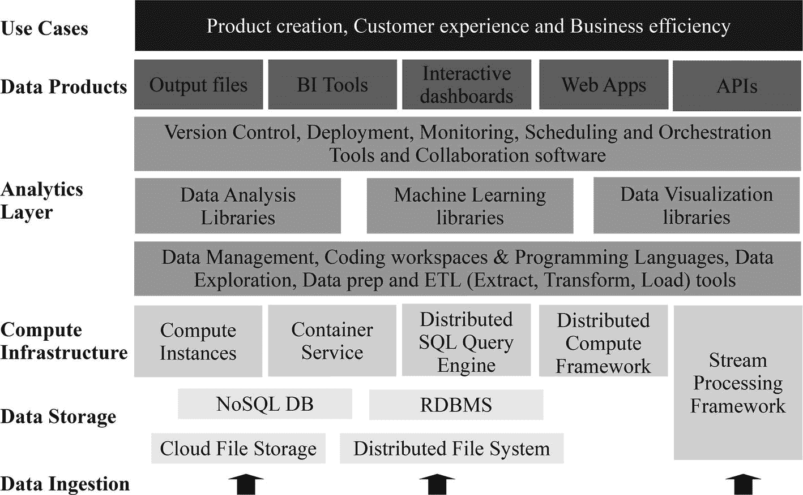
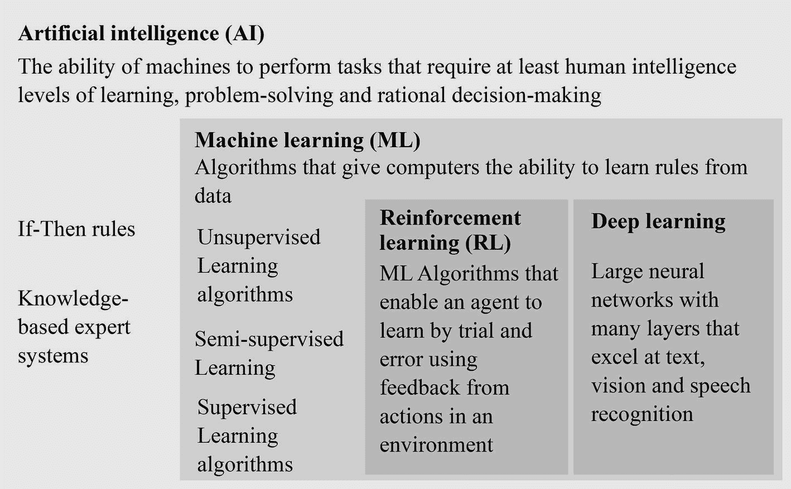

# 一、数据科学的问题是

在采用 DataOps 作为解决方案之前，了解我们试图解决的问题非常重要。当你在网上看文章、在会议上听演讲，或者读到领先的数据驱动型组织如、亚马逊、和谷歌的成功时，传递成功的数据科学似乎是一个简单的过程。现实却大相径庭。

虽然无疑有成功的故事，但也有大量证据表明，对数据科学的大量投资并没有为大多数组织带来预期的回报。有多种原因，但它们源于两个根本原因。首先，用 20 世纪的信息架构方法来处理 21 世纪的数据和分析。第二，缺乏对数据科学和分析的知识和组织支持。业内为克服这些问题而信奉的常见(20 世纪)咒语让事情变得更糟，而不是更好。

## 有什么问题吗？

利用数据创造竞争优势和解决有价值的问题是可能的。许多组织正设法从他们在数据科学和数据分析方面的投资中获得合理的成功案例:

*   产品创新副总裁 Carlos Uribe-Gomez 和首席产品官 Neil Hunt 发表了一篇论文，称其一些推荐算法在减少客户流失方面每年为网飞节省 10 亿美元。 [1](#Sec19)
*   孟山都公司旨在改善全球运输和物流的数据科学计划之一每年节省和避免近 1400 万美元的成本，同时减少 350 公吨(MT)的二氧化碳排放量。 [2](#Sec19)
*   Alphabet 的 DeepMind 以其 AlphaGo 程序而闻名，它与伦敦的 Moorfield 眼科医院合作开发了一个人工智能(AI)系统，可以像世界领先的专家医生一样准确地为 50 多种威胁视力的疾病提供治疗。 [3](#Sec19)

为了不落后，大多数组织现在都在昂贵的技术上投入巨资，并雇佣昂贵的数据科学家、数据工程师和数据分析师团队来理解他们的数据并推动决策。即使在最大的组织中，曾经的利基活动现在也被视为核心竞争力。考虑到全球 GDP 每年仅增长 3.5%，投资和就业岗位的增长率令人震惊:

*   国际数据公司(IDC)预计，2022 年大数据和商业分析解决方案的全球收入将达到 2600 亿美元，2017 年至 2022 年期间的复合年增长率为 11.9%。 [4](#Sec19)
*   LinkedIn 的新兴就业报告将机器学习工程师、数据科学家和大数据工程师列为 2012 年至 2017 年美国增长最快的四个职位中的三个。在此期间，数据科学家角色增长了 650%以上！ [5](#Sec19)

### 现实

尽管投入了大量资金，但只有少数组织取得了有意义的成果。展示可量化结果的案例研究是孤立的例外，即使不愿意披露竞争优势。数据量的指数级增长、解决方案支出的快速增加以及技术和算法的改进并没有带来数据分析生产力的提高。

有迹象表明，数据分析项目的成功率正在下降。2016 年，Forrester 得出结论，只有 22%的公司从数据科学投资中获得了高收入增长和利润。 [6](#Sec19) 还有，2016 年，Gartner 估计 60%的大数据项目会失败，但情况变得更糟。2017 年，Gartner 的 Nick Heudecker 发布了一份更正。60%的估计“过于保守”，实际失败率接近 85%。 [7](#Sec19) 虽然很多调查数据都与“大数据”有关，但我仍然认为尼克的结果是相关的。在数据科学领域之外，大多数人错误地认为大数据、数据科学和数据分析是可以互换的术语，并会以此作为回应。

尽管在数据科学和分析方面进行了大量投资，但回报率低和生产率提高失败可能有多种原因。数据采集的爆炸式增长可能导致采集的边际价值越来越低。技术、软件库和算法可能跟不上捕获数据的数量和复杂性。数据科学家的技能水平可能不足。流程可能无法利用数据驱动的机会。最后，组织和文化障碍可能会阻碍数据利用。

### 数据值

没有迹象表明所收集数据的边际价值下降了。许多捕获的额外数据越来越多地来自新的来源，如物联网(IoT)设备传感器或移动设备、非结构化数据以及事件日志生成的文本、图像或半结构化文档。获取的数据量和种类越来越多，这为数据科学家获取知识和推动决策提供了更多机会。

然而，有证据表明，数据质量差仍然是一个严峻的挑战。在 Figure Eight 的 2018 年数据科学家报告中，55%的数据科学家认为训练数据的质量/数量是他们最大的挑战。自 2015 年首次报告以来，这一比例几乎没有变化，当时 52.3%的数据科学家将低质量的数据列为他们最大的日常障碍。 [9](#Sec19) 在 Kaggle 对 16000 名受访者进行的 2017 年数据状态&机器学习调查中，脏数据也被列为第一大障碍，而“数据不可用或难以访问”是第五大障碍，有 30.2%的受访者提到了这一点。 [10](#Sec19)

### 技术、软件和算法

没有迹象表明技术、软件库和算法跟不上捕获数据的数量和复杂性。技术和软件库继续发展，以处理越来越具有挑战性的问题，同时增加简化的界面，以向用户隐藏复杂性或提高自动化。过去，运行复杂的本地 Hadoop 集群是处理数 TB 数据的唯一选择，而现在，相同的工作负载可以在托管 Spark 或云上的 SQL 查询引擎即服务上运行，无需基础架构工程要求。

像 Keras 这样的软件库使与深度学习库(如谷歌广受欢迎的 TensorFlow)的合作变得更加容易。像 DataRobot 这样的供应商已经自动化了机器学习模型的生产。深度学习算法和架构的进步，以及具有许多层的大型神经网络，如卷积神经网络(CNN)和长短期记忆网络(LSTM 网络)，已经实现了自然语言处理(NLP)、机器翻译、图像识别、语音处理和实时视频分析的阶跃变化。理论上，所有这些发展都应该提高数据科学投资的生产率和投资回报率(ROI)。也许组织正在使用过时或错误的技术。

### 数据科学家

作为一个相对较新的领域，数据科学家的经验不足可能是一个问题。在 Kaggle 的数据和机器学习状况调查中，数据科学家的平均年龄范围仅为 24-26 岁，平均年龄为 30 岁。中位年龄因国家而异；对美国来说，是 32。然而，这仍然远远低于 41 岁的美国工人的平均年龄。不过，教育程度不成问题，15.6%的人拥有博士学位，42%的人拥有硕士学位，32%的人拥有学士学位。 [10](#Sec19) 由于在 2010 年之前，所有形式的高级分析都处于边缘地位，因此也缺乏有经验的经理。因此，我们有许多非常聪明的数据科学家，他们缺乏处理组织文化的经验，也缺乏高级分析领导。

### 数据科学流程

很难找到关于用于交付数据科学的流程和方法的调查数据。KDnuggets 的 2014 年调查显示，跨行业数据挖掘标准流程(CRISP-DM)是 43%的受访者使用的分析、数据挖掘和数据科学项目的首选方法。第二个最流行的方法根本不是一种方法，而是受访者遵循他们自己开发的过程。SAS 研究所的样本、探索、修改、建模和评估(SEMMA)模型排在第三位，但由于其使用与 SAS 产品紧密相关，排名迅速下降。

CRISP-DM 和知识发现数据库(KDD)等其他数据挖掘方法面临的挑战是，它们将数据科学视为比实际情况更加线性的过程。他们鼓励数据科学家花大量时间规划和分析一个近乎完美的交付，这可能不是客户最终想要的。没有人关注最小可行的产品、来自客户的反馈或迭代，以确保您明智地将时间花在正确的事情上。他们还将部署和监控视为“扔出栅栏”的问题，在这种情况下，工作被传递给其他团队来完成，几乎没有交流或协作，减少了成功交付的机会。

作为回应，许多团体已经提出了新的方法，包括微软和他们的团队数据科学过程(TDSP)。 [12](#Sec19) TDSP 是对以前方法的重大改进，它认识到数据科学交付需要敏捷、迭代、标准化和协作。不幸的是，TDSP 似乎没有获得太多的关注。TDSP 和类似的方法也仅限于数据科学生命周期。有机会开发一种涵盖从获取到淘汰的端到端数据生命周期的方法。

### 组织文化

情感、情境和文化因素严重影响商业决策。财富知识集团(FORTUNE Knowledge Group)对来自 9 个行业不同学科的 700 多名高层管理人员的调查显示了数据驱动决策的障碍。大多数(61%)高管同意，在制定决策时，人的洞察力必须先于硬分析。62%的受访者认为，依靠“直觉”往往是必要的，软因素应该与硬因素同等重要。令人担忧的是，三分之二(66%)的 IT 高管表示，做出决策通常是出于遵从“一贯的做事方式”的愿望。 [13](#Sec19) 这些都不是孤立的发现。NewVantage Partners 的 2017 年大数据高管调查发现，文化挑战仍然是成功采用业务的障碍:

> More than 85% of the respondents reported that their company had begun to plan to create a data-driven culture, but so far only 37% reported success. Big data technology is not a problem; Understanding, organizational coordination and general organizational resistance are the main culprits. If only people were as malleable as data. [XIV](#Sec19)

毫不奇怪，尽管亚马逊取得了巨大的成功，但很少有公司效仿亚马逊，用算法取代高薪白领决策者。 [十五](#Sec19)

交付成功的数据科学的挑战与技术关系不大，而是文化态度，许多组织要么将数据科学视为打勾练习，要么将其视为永无止境地寻求所有挑战的完美解决方案的一部分。也不是算法有效性的问题。算法和技术远远超出了我们为其提供高质量数据、克服人员障碍(技能、文化和组织)以及实施以数据为中心的流程的能力。然而，这些症状本身是更深层根源的结果，例如缺乏使用数据进行决策的最佳方式的知识，上世纪处理数据和提供分析的方法的遗留观念，以及缺乏对数据分析的支持。

## 知识差距

当实施从组织的最高层开始时，多种知识差距使得在组织中嵌入数据科学变得困难。然而，指责商业领袖和 it 专业人士未能交付成果太容易了。知识鸿沟是双向的，因为数据科学家必须分担责任。

### 数据科学家的知识差距

数据科学旨在促进更好的决策，通过从数据中提取知识来引导有益的行动。为了做出更好的决策，数据科学家需要对业务领域有很好的了解，以便更好地理解业务问题，识别并准备正确的数据(通常在第一时间检测到质量问题)，对数据采用正确的算法，验证他们的方法，说服利益相关者采取行动，实施他们的输出，并衡量结果。这种范围的广度需要广泛的技能，例如除了自己的工作领域之外，与组织内的多个职能部门协作和协调的能力，批判性和科学思维，编码和软件开发技能，以及各种机器学习和统计算法的知识。此外，如果在商业环境中，向非技术观众和商业头脑传达复杂想法的能力是至关重要的。在数据科学行业，拥有所有这些技能的人被称为独角兽。

由于找到独角兽即使不是不可能，也是非常罕见的(他们不注册 LinkedIn 或参加聚会)，组织试图找到下一个最好的东西。他们雇佣具有编程(Python 或 R)、分析、机器学习以及统计和计算机科学技能的人，而这恰好是雇主最抢手的五项技能。 [16](#Sec19) 这些技能应该是数据科学家与其他人的区别。不幸的是，这种信念强化了初级数据科学家的错误信念，即专业技能应该是重点，但这往往会创建危险的同质团队。

> "Create a machine translation attention model for me with two-way long-term and short-term memory (LSTM). One attention layer is output to a stacked post-attention LSTM, and then input to a softmax layer for prediction." No CEO has ever said this.

当面试时，我总是被许多候选人说他们的主要目标是一个让他们能够创建深度学习、强化学习和[在此插入您的算法]模型的角色所震惊。他们的目标不是解决实际问题或帮助客户，而是应用当今最热门的技术。数据科学太有价值了，不能作为付费爱好来对待。

科学家认为他们需要的技能数据和他们真正需要的之间存在脱节。不幸的是，技术技能远远不足以从数据驱动的决策中推动真正的成功和有益的行动。面对难以访问的低质量数据、缺乏管理支持、没有明确的问题要回答或者结果被决策者忽略，没有高级数据科学领导的数据科学家无法改变文化。有些人寻找更好的工作，找到了新工作，却发现大多数组织都存在类似的挑战。其他人关注他们能够控制的过程部分，即建模。

在数据科学中，过分强调机器学习或深度学习，尤其是在初级数据科学家中，他们认为独自工作以最大限度地提高测试数据集的模型准确性分数是成功的定义。这种行为受到培训课程、网络文章，尤其是 Kaggle 的鼓励。对我来说，高测试集预测准确性似乎是对成功的一种奇怪解释。根据我的经验，尝试十种解决方案通常比花几周时间过早优化单个问题的解决方案要好，因为你不知道什么会起作用。当你从消费者那里得到反馈并衡量结果时，你就会看到你是否推动了有益的行动，甚至是有益的学习。此时，您可以决定进一步优化的价值。

目标必须是将最低限度的可行产品投入生产。一个完美的笔记本电脑模型永远不会投入生产，浪费精力，所以比一个不存在的模型更糟糕。在某些领域，模型准确性至关重要，如医疗诊断精度、欺诈检测和广告技术，但与做任何事情都比什么都不做有显著改善的应用相比，这些领域只是少数。即使在从优化模型准确性中获得巨大利益的领域中，量化现实世界的影响仍然更加重要。

将模型投入生产需要与创建模型不同的技术技能。其中最重要的是相关的软件开发技能。对于很多主要是非软件开发背景的数据科学家来说，编码只是达到目的的一种手段。他们没有意识到编码和软件工程是有他们自己的一套最佳实践的学科。或者，如果他们意识到了，他们倾向于将编写可重用的代码、版本控制和测试或文档视为需要避免的障碍。

薄弱的开发技能会导致困难，特别是对于可再现性、性能和工作质量。将模型投入生产的障碍不仅仅是数据科学家的责任。通常，他们无法获得将模型投入生产所需的工具和系统，因此必须依赖其他团队来促进实现。天真的数据科学家忽略了本地开发和基于服务器的生产之间的鸿沟，并把它视为一个“扔出栅栏”的问题，没有考虑他们选择的编程语言的含义。这种缺乏经验导致了可以避免的摩擦和失败。

### 信息技术知识差距

从表面上看，数据科学和软件开发有相似之处。两者都涉及代码、数据、数据库和计算环境。所以，数据科学家需要一些软件开发技能。然而，图 [1-1](#Fig1) 展示了机器学习和常规编程之间的重要区别。

图 1-1

Difference between regular programming and machine learning

在常规编程中，规则或逻辑被应用于输入数据，以基于众所周知的需求生成输出(输出= f(输入),例如 Z = X + Y)。在机器学习中，输出的例子和它们的输入数据以及它们各自的属性，称为特征，提供给机器学习算法。机器学习算法试图通过训练过程最小化成本函数来学习从输入生成输出的规则，这种训练过程永远不会在现实生活数据上实现完美的准确性。一旦经过适当的训练，常规编程可以使用机器学习模型规则来预测新的输入数据。常规编程和机器学习之间的差异对数据质量、数据访问、测试、开发过程甚至计算要求都有深远的影响。

垃圾入，垃圾出适用于常规编程。然而，高质量的数据对于机器学习来说是必不可少的，因为算法依赖于良好的数据来学习规则。质量差的数据将导致较差的训练和预测。一般来说，更多的数据允许机器学习算法破译更多的复杂性，并生成更准确的预测。此外，数据中固有的更多特征使得算法能够提高预测准确性。数据科学家还可以基于领域知识和经验，从现有数据中设计附加功能。

模型训练是迭代的并且计算量很大。大容量内存和更强大的 CPU 允许您使用更多的数据和复杂的算法。用于创建机器学习模型的语言和库专门用于数据分析，通常分别是 R 和 Python 编程语言及其库和包。然而，一旦创建了模型，部署过程对软件开发人员来说就更加熟悉了。

在常规编程中，逻辑是最重要的部分。也就是说，确保代码正确是至关重要的。开发和测试环境往往不需要高性能的计算机，足够覆盖的样本数据足以完成测试。在数据科学中，数据和代码都至关重要。没有要测试的正确答案，只有可接受的准确度。通常，需要最少的代码(与常规编程相比)来将模型拟合和验证到高测试精度(例如，95%)。复杂性在于确保数据的可用性、可理解性和正确性。

即使对于训练，数据也必须是生产数据，否则模型将不能很好地预测具有不同数据分布的新的看不见的数据。样本数据是没有用的，除非数据科学家选择测试数据作为针对问题的策略的一部分(如随机抽样、交叉验证、分层抽样)。虽然这些要求与机器学习有关，但它们普遍适用于所有数据科学家的工作。

数据科学家的需求经常被 IT 曲解，甚至被那些支持“最好拥有”的人曲解数据科学家经常被要求解释为什么他们需要访问多个数据源、完整的生产数据、特定的软件和功能强大的计算机，而其他“开发人员”并不需要它们，报告分析师已经通过在关系数据库上运行 SQL 查询“挖掘”了多年的数据。令人沮丧的是，数据科学家不理解 IT 实践背后的原因。数据科学家感到沮丧，因为不容易预先证明他们认为必要的东西的价值。不止一次的问题“但是你为什么需要这些数据？”让我的心一沉。

很少看到 It 流程被设计为支持高级分析流程。它从获取数据的方式开始。许多开发人员认为捕获新数据项是一种负担，伴随着计划、分析、设计、实现和维护时间的相关成本。因此，大多数组织收集数据首先是为了支持运营流程，如客户关系管理(CRM)、财务管理、供应链管理、电子商务和营销。通常，这些数据位于单独的孤岛中，每个孤岛都有严格的数据治理策略。

通常，在将数据加载到数据仓库以供分析访问之前，数据将经过 ETL(提取、转换、加载)过程，将其转换为结构化数据(通常为表格格式)。这种数据科学方法有一些缺点。只有数据的一个子集通过 ETL，在这里它通常被优先用于报告。添加新数据项可能需要几个月的开发时间。因此，数据科学家无法获得原始数据。他们需要的是原始数据！

传统的数据仓库通常只处理关系模式中的结构化数据(将数据拆分到多个可连接的表中，以避免重复并提高性能)，并且难以管理我们今天可用的数据规模。它们也不能处理需要文本等非结构化数据的现代用例，有时甚至是机器生成的半结构化数据格式，如 JSON (JavaScript 对象符号)。一种解决方案是创建数据湖，其中数据以原始格式存储，并在需要时经过 ELT(提取、加载、转换)过程，转换取决于用例。

当数据湖不可用时，数据科学家必须自己提取数据，并在本地机器上组合数据，或者与数据工程师合作，通过他们需要的工具、计算资源和存储来构建进入环境的流水线。访问数据、调配环境以及安装工具和软件的请求通常是不同团队的责任，他们对安全性、成本和治理有不同的关注。因此，数据科学家需要与不同的团队合作来部署和安排他们的模型、仪表板和 API。由于现有流程与数据科学需求不一致，成本大大提高。

整个数据生命周期分散在许多 IT 团队中，每个团队都根据各自的职能目标独立地做出合理的决策。这种筒仓目标不适合数据科学家。对于需要从原始数据到最终数据产品的数据流水线的数据科学家来说，挑战是巨大的。他们需要证明他们的需求，并与多个涉众协商以完成交付。即使他们成功了，他们仍将依赖其他团队完成许多任务，并受积压工作和优先级的支配。没有一个人或职能部门对导致延迟、瓶颈和运营风险的整个流程负责。

数据安全和隐私有时被认为是阻碍数据访问和处理的障碍。确实需要确保遵守法规、尊重用户隐私、保护声誉、捍卫竞争优势和防止恶意破坏。然而，这种担忧也可能被用来规避风险，而不实施允许安全、合法和合乎道德地使用数据的解决方案。更常见的情况是，在没有进行彻底的成本效益分析和充分了解对数据分析的影响的情况下，实施数据安全和隐私政策就会出现问题。

### 技术知识差距

尽管技术不是成功实现数据科学的唯一障碍，但正确使用工具仍然至关重要。图 [1-2](#Fig2) 显示了从原始数据到有用的业务应用程序的数据生命周期中的典型硬件和软件层。

图 1-2

Typical hardware and software layers in the data lifecycle

许多软件和硬件需求需要结合在一起才能创建数据产品。必须对所有生命周期层的需求和投资平衡有一个整体的理解。不幸的是，很容易关注拼图的一部分而损害其他部分。大型企业倾向于专注于用于构建应用程序的大数据技术。他们沉迷于 Kafka、Spark 和 Kubernetes，但未能向他们的数据科学家提供足够的数据、软件库和所需工具。较小的组织更有可能为他们的数据科学家提供他们需要的软件工具，但可能不会投资于存储和处理技术，从而使分析处理在笔记本电脑上孤立进行。

即使他们在工具上的投资是正确的，组织仍然会低估构建、维护和优化堆栈所需的支持资源。如果没有足够的数据工程、数据治理、开发运维、数据库管理、解决方案架构和基础设施工程方面的人才，几乎不可能高效地利用这些工具。

较大的组织也倾向于将数据科学视为“旧世界瀑布”技术项目，在开始使用数据之前，需要昂贵的基础设施或购买高价工具。这种想法来自上个世纪，当时处理大规模数据和应用分析的唯一选择是从 Oracle、Teradata、IBM 或 SAS 等公司购买昂贵的本地系统。问题是瀑布技术项目速度慢、成本高，并且对于数据科学活动来说很可能失败。即使他们真的实现了，技术发展如此之快，以至于最终的解决方案可能在发布时就过时了。您不需要数百万美元的企业 Hadoop 集群就可以开始。在进一步投资于技术和人员之前，您只需要足够的功能来证明价值。

### 领导知识差距

大多数高管似乎不了解数据科学，尽管他们往往很擅长算术，甚至懂 IT。一个原因可能是他们倾向于阅读最新的《哈佛商业评论》,并将其视为真理。他们知道像谷歌、亚马逊和脸书这样的成功公司拥有大量数据，所以他们也必须存储这些数据。他们似乎认为，雇用拥有天体物理学博士学位的聪明的数据科学家是创造奇迹、从数据中创造价值和增加资金流所需要的。资金确实在流动，但正如我们从证据中看到的那样，方向相反。存储数据是有成本的，数据科学家也不便宜。

对错失良机的担忧，有时还有来自投资者和董事会的压力，要求他们站在进步的最前沿，这导致高管们随波逐流。“单一客户观”、“大数据”、“Hadoop”和“客户 360”只是近年来爆炸和消退的一些流行语。数据科学中的最新流行词是人工智能(AI)，即机器在学习、解决问题和理性决策方面执行任务的能力有点像人类。市场情报研究公司 CB Insights 分析了上市公司 10 年来的财报电话会议记录。他们报告称，人工智能在 2016 年年中取代“大数据”成为分析术语。从那以后，他们测量了人工智能的提及率的巨大增长(仅在 2017 年第三季度就被讨论了约 791 次)，环比增长 25%。 [17](#Sec19)

对下一件大事感兴趣的不仅仅是首席执行官。记者为他们的目的开动宣传机器。供应商将同一产品重新命名为大数据驱动，然后是机器学习驱动，现在是人工智能驱动，以保持领先。顾问在夸大采用新方法的积极好处和最小化实施的实际成本和复杂性方面有利害关系。优秀的供应商和顾问应该清楚在数据科学领域工作的困难，并提供真实的答案来解决真实的问题。

如果没有 C-suite 中的数据表示，数据科学及其技术肯定会显得是一门黑暗的艺术。不熟悉会导致难以区分炒作和现实，也难以真正理解最大化数据优势所需的要求。例如，人工智能不是一个神奇的黑盒子。它只是一个好的策略可以赋予生命的算法的集合。图 [1-3](#Fig3) 展示了 AI、机器学习、深度学习之间的关系。

图 1-3

The relationship between AI and machine learning

人工智能并不新鲜。人工智能算法是在 20 世纪 50 年代数字计算机问世后不久开发出来的。它们仍然很原始，直到机器学习(以及相关的处理能力)在 20 世纪 90 年代开始蓬勃发展。机器学习在概念上是人工智能的一个子集，可以从数据中学习的算法被认为是智能的。然而，正是最近强化学习和深度学习的快速发展，这两个机器学习的子集，将人工智能推向了主流。

在强化学习中，一个主体在一个环境中采取行动，接收一个奖励(积极的、中性的或消极的)作为反馈，然后移动到下一个状态。代理通过从动作、奖励和状态循环中学习来学习规则以最大化累积奖励。一个例子是 DeepMind 的 AlphaGo 击败了围棋比赛的人类冠军。深度学习使用具有许多层和专门架构的神经网络来解决复杂问题。深度学习是当今许多人认为的人工智能，即神经网络算法利用自然语言处理、图像识别、语音处理和实时视觉分析、方法或能力来解决人类感知问题的能力。

AI 是真实的。它的好处是真实的。它不是统计学、机器学习或神经网络的简单更名，而是方法的超集。然而，单靠人工智能战略不会神奇地修复糟糕的产品、无效的营销和有深层问题的破碎流程。没有正确的基础，这也不是你能实现的。一个努力嵌入简单统计测量和预测的组织将很难让机器学习发挥作用，一个无法从日常机器学习中获得成功的组织将不会很容易利用深度学习。领导层缺乏对人工智能的理解，会导致对短期成就的不切实际的期望，并意识不到不仅需要对人员和技术进行投资，还需要对流程和文化变革进行投资。

### 数据素养差距

数据素养是根据数据做出决策和/或信任自动化机器决策所必需的。数据素养是指阅读数据表格和图表的能力，理解它们以得出正确的结论，并知道什么时候它可能是错误的信息。它还包括将数据的意义传达给其他人的能力。为了从数据中获得最大收益并使数据科学取得成功，需要高级数据素养。高级数据素养包括实验设计知识、统计素养、对预测分析的理解、使用机器学习理解“大数据”的能力，以及从文本、图像、音频和视频等非结构化数据中提取意义的能力。

不幸的是，高级数据素养在组织中极其罕见。拥有高级数据素养技能的人应该会增加，但即便如此，我也不认为这些技能会普及。挑战不仅限于数据，而是适用于任何技术领域。每周，我都会遇到一些同事执行手工过程的例子，这些手工过程通过基本或中级的编码技能就可以实现自动化。在大多数情况下，这种自动化带来的好处是生产率至少提高 10 倍。然而，尽管自 20 世纪 80 年代初以来，在个人电脑上编写代码的能力已广泛成为可能，而且免费培训材料也随处可见，但大多数人认为编写代码太复杂，不是他们的工作，甚至是一种威胁。人工智能和机器学习让一些人兴奋，但我的典型同事不想发展高级分析素养技能，就像普通数据科学家不想学习会计一样。

缺乏高级数据素养会导致严重的问题。有足够危险知识的同事会做出错误的决定。辛普森悖论(从汇总数据中得出错误的结论)和生存偏差(基于那些通过过滤过程而不是原始队列的结果)只是两个普遍的例子。对于粗心的人来说，许多分析陷阱未被发现，而优秀的数据科学家会发现这些陷阱。

称职的数据科学家将确保问题结构合理，应用正确的技术，并得出正确的推论。想象你在你的网站上运行一个测试来测量改变“现在订购”的颜色对转化率的影响按钮。随机一半的网站访问者会看到现有的绿色按钮(冠军)和新的红色按钮(挑战者)。经过一天的测试，红色按钮的点击率为 33%，绿色按钮为 32%。

产品经理渴望宣布另一个获胜的优化，并推出红色按钮，但数据科学家并不信服。她想知道访问者的数量来运行统计假设测试，以确保结果不是由于偶然，而不是点击率或所有的访问者。看到红色按钮的一些访问者可能是最近回来的，因此之前已经看到了绿色按钮。因此，它们不应被视为与第一次查看红色按钮的访问者相同。点击进入通常不是公司赚钱的地方，因为许多顾客点击进入是为了了解运费。影响点击量很容易，但真正的销售却很难实现。她可以对实验过程中新接触购买周期的访问者的销售率进行统计显著性测试，以验证没有证据表明红色按钮比绿色按钮更好。

数据科学家进行批判性思考，以便不轻信表面结果。在大众媒体的首批数据科学案例中，美国零售商 Target 能够在父亲怀孕之前确定一名少女怀孕。他们在注册 Target baby registry 之前训练了一个关于女性购买的统计模型，并使用该模型发送怀孕期间婴儿商品的目标优惠券。一位父亲向 Target 抱怨他女儿收到的优惠券，后来当他发现女儿怀孕时，他道歉了。统计建模的胜利？我们的数据科学家对此不以为然，这不仅仅是因为这场运动令人毛骨悚然。她知道没有数据或模型也能达到同样的效果。你给每个人寄婴儿相关的优惠券。至少有一个接受者肯定是怀孕了，并且没有告诉她的父亲。相反，在决定模型是否成功之前，她想知道模型的准确性指标，如假阳性率(有多少人在没有怀孕的情况下被错误地预测为怀孕)。

仅仅依靠基本的数据素养往往会导致数据的次优使用。通常，人们认为他们是在做数据驱动的决策，而实际上他们是在做假设驱动的决策。一个典型的例子是使用单一维度的数据或基于规则的标准来制定关于特定目标的决策(例如，年龄在 25 至 34 岁之间的男性最有可能提交欺诈性索赔，因此我们应该在他们身上花费我们的审计预算)，这是在目标马之前放置数据车。数据科学家知道，找到最有可能提交欺诈索赔的客户是预测建模问题的目标，然后可以使用预测建模问题评估所有可用数据，以计算单个客户级别上更准确的欺诈可能性。预测建模和其他高级技术对于没有高级数据素养的人来说是不透明的，所以他们很容易拒绝数据科学家的解决方案，因为太复杂了。

当我生病时，我不会尝试自我治疗。我会咨询健康专家，相信他们的经验和基于知识的建议。依赖专家也是组织中的典型行为。会计制作财务报告，采购专家进行供应商谈判，生产经理指导生产。决策者很少质疑或事后批评专家。然而，基本的数据素养在大多数组织中已经足够普及，以至于许多决策者认为他们“已经掌握了”他们相信他们正在准确地评估数据，并凭直觉做出明智的决定，他们完全利用这些数据做出正确的决定。不幸的是，没有先进的数据素养，他们往往会偏离目标。

缺乏先进的数据素养是数据民主化受到限制的原因。虽然信息越多越好，但将数据从 Excel 电子表格转移到可视化商业智能(BI)工具不会自动带来更好的决策，就像给我看 CT 扫描图像和血液测试结果不会帮助我治愈自己一样。我不具备诊断技能，也不具备对药物和程序做出正确决定的技能。

## 缺乏支持

雇用聪明的人并让他们增加商业价值是失败的秘诀。数据科学家负责找出他们的目标和要解决的问题，查找数据，访问数据，清理数据，安装软件，并找到硬件来运行他们面向数据的工作。可能是因为组织中的许多人认为数据科学只是探索 Excel 工作簿中数据的更大版本，太多的公司没有意识到改变和利用数据驱动的新机会的必要性。历史上，IT 部门锁定了对软件、系统和数据的访问，以强制实施治理和安全标准，并且大多数部门继续这样做。数据管理和数据科学并不相互排斥。正确的数据管理使数据科学更加有效。错误的数据管理使其窒息。

### 教育和文化

一个普遍的期望是让数据科学家单独负责教育业务，使其成为数据驱动的。然而，与和他们一起工作的人相比，数据科学家往往在业务流程方面相对缺乏经验，因此可能难以改变文化。可能有成功影响个人(冠军)以促进数据驱动的决策，但如果他们离开，循环必须从他们的替代者开始。将数据科学家变成老师并不是对他们时间的一种很好的利用，我们也不期望其他职业也是如此。高级分析培训需要集中提供给那些需要的人。由于这将永远是一小部分人，如果你真的想成为一家数据驱动型企业，你必须像谷歌那样招聘员工。也就是说，找到那些碰巧成为优秀的产品、商业或营销经理的高级分析人员。 [19](#Sec19)

创建数据驱动的文化必须自上而下以身作则。除了对人员和技术的投资，还必须让高管们看到他们根据数据做出决策，并要求他们的直接下属做出同样的行为。他们必须衡量后续行动，并请求查看发布的指标。这种类型的角色模型将在组织中逐级传递。不幸的是，这种情况很少发生。高级管理人员由于他们的经验和判断而处于他们的角色中。通常，他们要求其他人做出数据驱动的决策，而他们继续做出过去对他们很有用的直觉决策。这种行为对数据在决策中的重要性发出了错误的信号。

### 目标不明确

数据、见解、决策和行动不是同义词。数据是原始信息。洞察力是对数据的准确理解。这些洞见应该导致做不同事情的决定，并导致有益的行动。一个常见的问题是将数据科学视为纯粹的研究活动。数据科学家被告知在没有明确目标的情况下搜索数据，寻找“有趣的见解”或回答“有趣的问题”。传统观点认为，只要有自由，数据科学家就会发现真知灼见，并自动将其转化为金钱。这种方法有几个问题。

鉴于让经理对数据采取行动的文化困难和生产数据产品的 IT 障碍，与业务目标和定义的用例不紧密一致的洞察力在推动导致行动的人类决策方面面临重大障碍。在最好的情况下，这种洞察力提供了一个特别的决策支持报告，可能会，也可能不会，导致行动。数据科学家急于证明他们的有用性，回答商业智能团队或自助数据分析应该回答的越来越低价值的业务问题。该组织认为对关键绩效指标(KPI)的影响很小，并质疑昂贵的数据科学团队的优势。

还有一个原因是洞察力不应该成为焦点。让我分享一下我在 Dunnhumby 时的感悟。创始人们很早就意识到，如果他们为 1000 万客户提供数据驱动的客户洞察，他们不会比为 100 万客户提供客户洞察获得 10 倍的回报。然而，如果他们使用数据销售 1000 万张目标食品券而不是 100 万张，他们将获得十倍的报酬。Dunnhumby 是世界上第一批利用 Tesco 和 Kroger 忠诚度计划数据在工业规模上将数据货币化的公司之一，这些数据用于销售单独的目标媒体，而不是像当时其他机构那样为管理层提供决策支持数据见解。他们发现了扩展数据驱动决策的重要性。

您可以将相同的数据用于多种目的。云资源可以大规模扩展，数据流水线可以自动化，但人们受到工作时间的限制。组织需要寻找扩大数据科学家影响力的方法。产生数据驱动的决策支持洞察所花费的时间的问题是它不可扩展。如果你想让收益翻倍，你就必须让花费的时间翻倍。像对待任何基于实验室的纯研究一样对待纯洞察力。应该从具有特定长期战略目标的数据科学资源中为其分配研发(R&D)预算。

如果洞察力不是产品，而是一个过程的开始，为什么它仍然受到如此多的关注？原因很简单，就是遗产。过去几乎没有数字自动化，因此数据分析试图影响人类决策。数据分析师研究数据，提交一份带有建议的文档，然后继续处理下一个问题。分析结果仍保留在电脑上或书面报告中，但现在情况不同了。自动化机器决策的机会超过了人类决策的机会。近 20 年前，当谷歌的自动 PageRank 算法摧毁了雅虎人工编辑的网络目录时，这是一个分水岭，当时这是地球上访问量最大的网页。

### 留给数据科学家去解决

数据科学家的典型旅程充满挫折。数据科学家有一个业务问题要解决，第一步是评估组织中的可用数据。她发现很难发现有用的数据源，因为它们通常没有很好的记录。在与主题专家进行了一些交谈后，她发现了一些可能有用的匿名数据源，但发现她没有权限查看这些数据源，于是完成了一个来自该数据源的数据访问请求。IT 帮助台不理解为什么会有人想要分析存储在数据仓库之外的数据，但是经过一些解释之后，她获得了访问权。

我们的数据科学家在本地处理数据样本，因为这是她唯一可以访问的分析环境。元数据(关于数据的数据)和数据治理的缺乏导致她花费相当多的时间来识别数据项的含义、清理测试数据和重新格式化日期时间字段。最终，她建立了一个优秀的预测流失模型，产品负责人对准确识别有流失风险的客户的前景感到兴奋，并热衷于测试主动保留策略。

为了使模型有用，它需要每天在一台更强大的机器上运行，只需最少的人工干预，并自动向 CRM 系统输出建议。我们的数据科学家意识到该模型需要在数据中心的本地虚拟机上运行，因此向 IT 部门请求资源。IT 帮助台不理解为什么会有人想要在服务器上运行一个实验性的非操作性应用程序，但是经过一些升级后同意将该请求添加到他们的待办事项中。

三个月后，服务器被配置。我们的数据科学家兴奋地访问机器，但发现她无法安装她需要的语言和库，因为安全协议阻止了互联网。她请求安装 R 编程语言以及她需要的库和工具。IT 帮助台无法识别该软件，也无法理解为什么不能使用其他开发人员使用的语言(即 Java、JavaScript 或 C++)来编写“应用程序”。经过几个月的进一步升级和调查，它确定所请求的 R 编程语言和库不是安全威胁，并同意安装。

我们的数据科学家现在可以配置她需要的内部系统的连接和安全访问，但是在建模期间她意识到她需要请求另一个库。又一次请求 IT 帮助台，几周后，她有了自己的库。最终，有结果可以分享，并且业务利益相关者对通过更新激励留住目标客户而实现的流失率降低和收入增加感到满意。

每个人都同意有理由从实验性开发模型转向由数据工程团队维护的生产化操作版本。开发模型代码是笔记本电脑代码的提升和转变，需要重构以供操作使用。数据工程团队不习惯在生产中使用 R 代码，所以决定用 Python 重新编码。他们要求安装 Python 编程语言以及他们需要的包和工具。IT 帮助台无法识别该软件，也无法理解为什么“应用程序”不是用其他开发人员使用的语言编写的，如 Java、JavaScript、C++或 R…

就这样，一个障碍接着一个障碍，一个延迟接着一个延迟，这意味着大量的数据分析仍然留在本地机器上，或者隐藏起来。笔记本电脑分析和影子 IT 不受欢迎有两个原因。首先，它们鼓励糟糕的开发实践。第二，工作不太可能最终会影响到消费者。人们希望做好自己的工作，因此出现了比原始控制试图防止的问题更糟糕的变通办法。

## 摘要

在这一章中，我们遇到了我们试图解决的问题。虽然取得了重大成就，但也有大量证据表明，许多组织并没有从其数据科学投资中获得预期的投资回报。核心原因是知识差距(偶尔是鸿沟)、过时的数据管理和分析方法，以及组织内部缺乏对数据分析的支持。

数据科学团队过于关注算法，而不是他们需要的端到端技能，例如与利益相关者的协作和软件开发最佳实践，以生产数据产品并获得反馈。由于数据科学是一个相对较新的领域，它没有意识到与常规软件开发的差异，也没有意识到提供高多样性、准确性和高容量数据的重要性。组织孤岛将数据供应链分割为多个部门孤岛，并给需要高效数据流水线的数据科学家带来了不必要的摩擦。

数据科学家不得不自己克服障碍，发现数据，访问数据，清理数据，并在没有专门支持的情况下协商计算资源和软件。人们对数据科学堆栈所需的工具、软件和支持资源的广度认识不足，导致技术使用效率低下。

高层领导不了解数据科学，导致不切实际的期望和对流程和文化变革所需投资的盲点。让数据科学家来让组织以数据为中心，而高层领导却无法为数据驱动的决策树立榜样。缺乏高级数据素养会导致糟糕的决策和对数据科学建议的漠视。没有明确的目标或需要回答的问题，数据科学家专注于产生洞察力，而不是可扩展的数据产品。在下一章，我们将开始解决其中的一些问题。

## 尾注

1.  Carlos A. Gomez-Uribe 和 Neil Hunt，“网飞推荐系统:算法、商业价值和创新”，先进计算，2016 年 1 月。[T2`https://dl.acm.org/citation.cfm?id=2843948`](https://dl.acm.org/citation.cfm%3Fid%3D2843948)
2.  吉姆·斯旺森(Jim Swanson)，《数字流畅:人工智能的智能方法》，2018 年 4 月。[T2`https://monsanto.com/news-stories/articles/digital-fluency-intelligent-approach/`](https://monsanto.com/news-stories/articles/digital-fluency-intelligent-approach/)
3.  用于视网膜疾病诊断和转诊的临床适用深度学习，Nature，2018 年 9 月。[T2`www.nature.com/articles/s41591-018-0107-6.epdf`](https://www.nature.com/articles/s41591-018-0107-6.epdf)
4.  根据 IDC 2018 年 8 月的数据，大数据和商业分析解决方案的收入预计将在 2022 年达到 2600 亿美元，主要来自银行业和制造业。[T2`www.idc.com/getdoc.jsp?containerId=prUS44215218`](https://www.idc.com/getdoc.jsp%3FcontainerId%3DprUS44215218)
5.  领英 2017 年美国新兴就业报告，2017 年 12 月。[T2`https://economicgraph.linkedin.com/research/LinkedIns-2017-US-Emerging-Jobs-Report`](https://economicgraph.linkedin.com/research/LinkedIns-2017-US-Emerging-Jobs-Report)
6.  数据科学平台帮助公司将数据转化为商业价值，这是由 Data Science 委托 Forrester Consulting 撰写的思想领导力论文，2016 年 12 月。[T2`https://cdn2.hubspot.net/hubfs/532045/Forrester-white-paper-data-science-platforms-deliver-value.pdf`](https://cdn2.hubspot.net/hubfs/532045/Forrester-white-paper-data-science-platforms-deliver-value.pdf)
7.  Nick Heudecker，Gartner，2017 年 11 月。[T2`https://twitter.com/nheudecker/status/928720268662530048`](https://twitter.com/nheudecker/status/928720268662530048)
8.  Figure Eight 2018 年数据科学家报告，2018 年 7 月。[T2`www.figure-eight.com/figure-eight-2018-data-scientist-report/`](https://www.figure-eight.com/figure-eight-2018-data-scientist-report/)
9.  CrowdFlower 2015 数据科学家报告 [`https://visit.figure-eight.com/rs/416-ZBE-1img/Crowdflower_Data_Scientist_Survey2015.pdf`](https://visit.figure-eight.com/rs/416-ZBE-1img/Crowdflower_Data_Scientist_Survey2015.pdf)
10.  数据科学与机器学习的状态，Kaggle，2017 [`www.kaggle.com/surveys/2017`](https://www.kaggle.com/surveys/2017)
11.  Gregory Piatetsky，“CRISP-DM，仍然是分析、数据挖掘或数据科学项目的顶级方法”，KDnuggets，2014 年 10 月。[T2`www.kdnuggets.com/2014/10/crisp-dm-top-methodology-analytics-data-mining-data-science-projects.html`](https://www.kdnuggets.com/2014/10/crisp-dm-top-methodology-analytics-data-mining-data-science-projects.html)
12.  团队数据科学流程是什么？、微软 2017 年 10 月 [`https://docs.microsoft.com/en-us/azure/machine-learning/team-data-science-process/overview`](https://docs.microsoft.com/en-us/azure/machine-learning/team-data-science-process/overview)
13.  财富知识集团，“唯人性:商业决策的情感逻辑”，2014 年 6 月 [`www.gyro.com/onlyhuman/gyro-only-human.pdf`](https://www.gyro.com/onlyhuman/gyro-only-human.pdf)
14.  NewVantage Partners，2017 年大数据高管调查。[T2`http://newvantage.com/wp-content/uploads/2017/01/Big-Data-Executive-Survey-2017-Executive-Summary.pdf`](http://newvantage.com/wp-content/uploads/2017/01/Big-Data-Executive-Survey-2017-Executive-Summary.pdf)
15.  斯潘塞·索普，《亚马逊的聪明机器正从仓库走向总部》，彭博，2018 年 6 月 [`www.bloomberg.com/news/articles/2018-06-13/amazon-s-clever-machines-are-moving-from-the-warehouse-to-headquarters`](https://www.bloomberg.com/news/articles/2018-06-13/amazon-s-clever-machines-are-moving-from-the-warehouse-to-headquarters)
16.  杰夫·黑尔，“数据科学家最需要的技能”，走向数据科学，2018 年 10 月 [`https://towardsdatascience.com/the-most-in-demand-skills-for-data-scientists-4a4a8db896db`](https://towardsdatascience.com/the-most-in-demand-skills-for-data-scientists-4a4a8db896db)
17.  在财报电话会议上，大数据已经过时。高管们脑子里有 2017 年 11 月 [`www.cbinsights.com/research/artificial-intelligence-earnings-calls/`](https://www.cbinsights.com/research/artificial-intelligence-earnings-calls/)
18.  克什米尔山，塔吉特如何在一个少女的父亲怀孕之前发现她怀孕了，福布斯，2012 年 2 月 [`www.forbes.com/sites/kashmirhill/2012/02/16/how-target-figured-out-a-teen-girl-was-pregnant-before-her-father-did/#6b47b6496668`](https://www.forbes.com/sites/kashmirhill/2012/02/16/how-target-figured-out-a-teen-girl-was-pregnant-before-her-father-did/%236b47b6496668)
19.  德雷克·贝尔，谷歌在求职者身上寻找的 13 种品质，商业内幕，2015 年 4 月 [`http://uk.businessinsider.com/what-google-looks-for-in-employees-2015-4`](http://uk.businessinsider.com/what-google-looks-for-in-employees-2015-4)