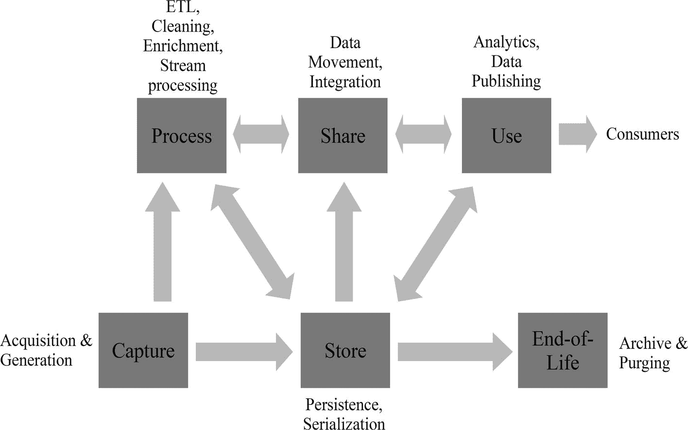
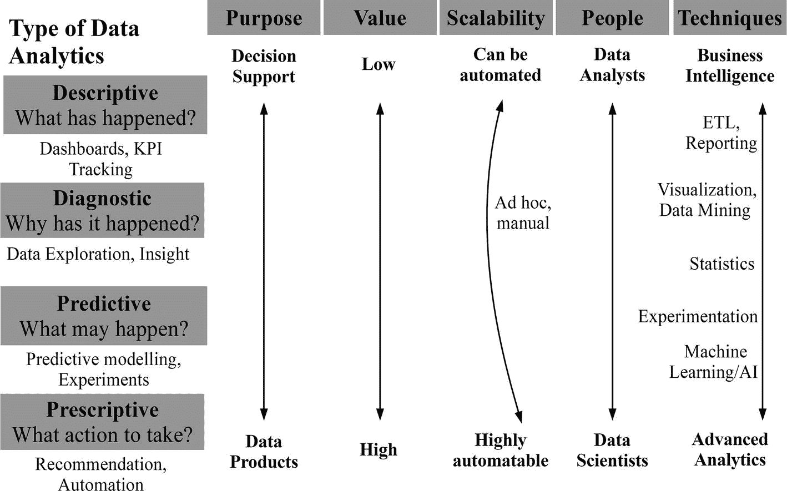
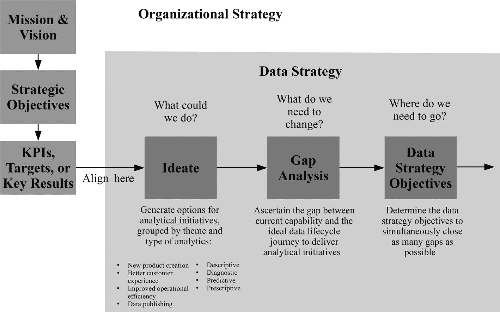
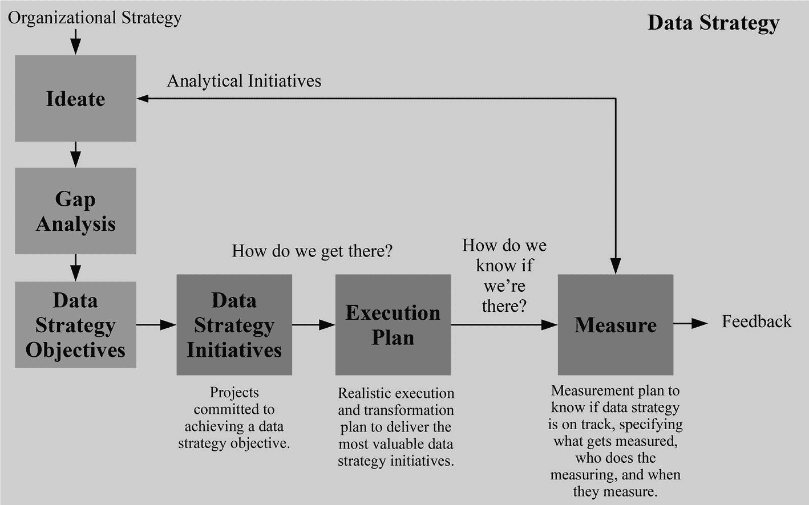
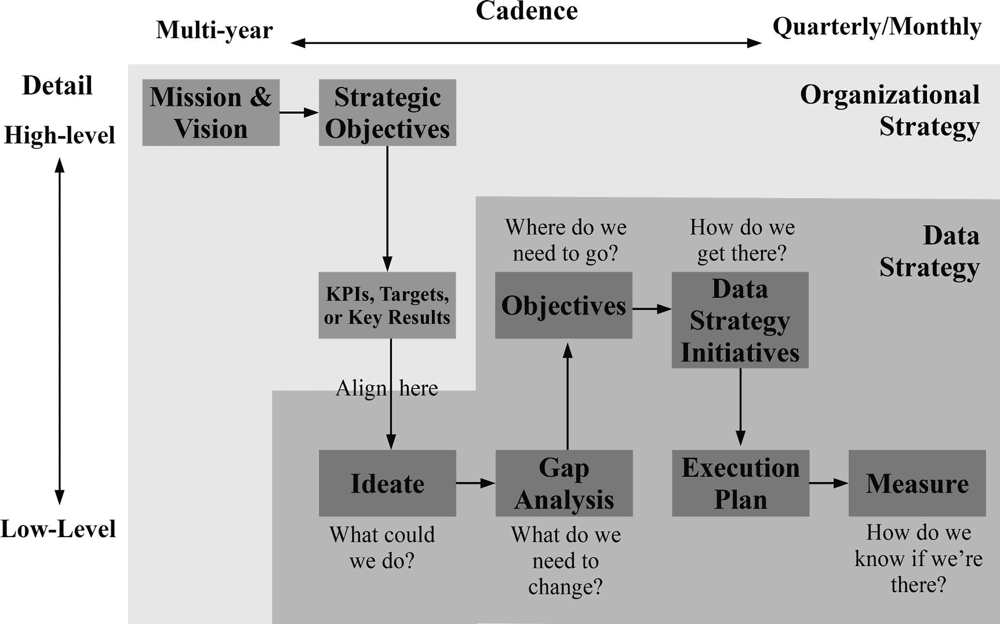

# 二、数据策略

前一章揭示了多个问题，这些问题可能会导致旨在使组织成为数据驱动型组织的投资失败。为了避免成为 Gartner 或 Forrester 报告中关于数据分析回报不佳的统计数据，组织需要找到解决方案。然而，在深入细枝末节和实施具体策略之前，最好从 30，000 英尺的角度出发，从数据策略开始。

数据运维应该是为转型奠定基础的深思熟虑的数据战略的一部分。实际上，所有希望将数据用于数据共享或分析目的的组织都需要一个数据策略。唯一的变化是战略的深度和用例的复杂性。一家初创公司的数据战略可能不需要像跨国公司那样的细节和跨度，但它仍然应该定义一种为未来做准备的方法。

## 为什么我们需要新的数据战略

战略规划有一个坏名声，那就是制作模糊的高层文档，这些文档包含善意的使命陈述、矩阵图和抱负，一旦相关人员回到办公桌后，这些文档就被遗忘了。然而，如果没有适当的战略，就有不断被动救火的风险，实施不协调的战术解决方案，导致资源配置不当和投资浪费，丧失机会，甚至变得无关紧要。一个好的战略使组织变得积极主动，联合团队，确定要解决的问题，确定不要关注的问题，并告诉他们要采取什么行动来为未来的机会做准备。

制定一个好的战略需要了解你的现状，你想要达到的目标，以及达到这些目标的计划。理解为什么需要一种适合分析且不同于 It 战略的新数据战略，甚至是侧重于治理的传统数据战略也是至关重要的。

### 数据不再是 IT

故事从第一个计算时代开始。数字计算机的第一批用户是电话公司，他们是数据使用演变的一个例子。像 LEO III 这样的早期计算机被电话公司用来正确计算账单。计算很简单。所需要的只是通话时间、时长和目的地，以及一份价目表。一旦计算完成，账单产生，数据就不再有任何价值。存储在穿孔卡或磁带上的数据可以安全地存档或销毁。

通过第二代微处理器和第三代通过内部网络连接的个人电脑，计算机技术取得了进步，但基本原理仍然相同。计算机和存储仍然相对昂贵，尽管管理信息系统(MIS)开始提供报告，但它们仍然主要用于库存管理等业务任务。因此，它发展出非常严格的程序，以避免浪费计算资源和保护操作流程，因为将重要任务(如库存控制、订单和计费)弄错是不可接受的。甚至在开发开始之前，就有对系统架构、解决方案和需求分析、系统设计、代码可重用性和文档的艰苦关注。对系统访问有严格的控制，因为意外的改变可能是灾难性的。数据共享仅限于具有特定业务流程的应用程序，但是一旦这些流程完成，数据仍然很少或没有价值。

在第四个企业计算时代，数据开始越来越多地用于分析目的，这刺激了数据仓库的普及。然而，数据仓库的发展仍然遵循过去的原则。数据仓库被视为另一个运营系统，具有大型预先设计(BDUF)以满足特定需求、变更请求的长开发周期和受限访问。IT 部门的传统是将数据视为处理数据的系统和应用于数据的逻辑的次要部分。

20 世纪 60 年代的电话公司从固定电话使用中获取数据，但与现代电信公司相比，这些数据相对较少。该电信公司获取的数据包括宽带使用情况、移动电话用户的位置、有线电视观众的观看习惯、网站的点击流数据、客户与其 CRM 系统的交互、商店的库存水平、工程师的位置、社交媒体上的评论以及数百个其他数据项。

不同的系统(电信公司固有的)以多种格式序列化(将数据转换为存储或传输格式)和保存数据，其中一些是结构化的表格数据，但更多的是半结构化的机器生成格式，如 JSON 或 XML(可扩展标记语言)或非结构化的文本、音频和视频。数据存储和计算现在非常便宜，因此电信公司将数据存储在多个数据仓库中，如事务存储、运营数据存储、文件系统、软件即服务系统和数据仓库。

电信公司的一小部分数据将进入数据仓库和市场。许多团队需要跨许多系统共享和组合数据，以支持多种有时是复杂的分析，如欺诈检测、财务建模、优惠优先级、营销有效性、交叉销售建模、客户终身价值建模、监管馈送、产品亲和力、产品需求预测、A/B 测试、群组分析、情绪分析、流失分析等。

在发送账单等运营流程完成很久之后，数据仍是分析决策的重要资产。分析输出推动多种用例的业务决策，如营销组合、网络规划、促销、定价、网站/应用程序优化、劳动力规划、财务预测、产品主张等。在大多数情况下，分析输出不需要完美，只需达到可接受的准确度即可。对于不熟悉数据科学的人来说，这种“不完美”的输出很难理解和接受。

不要低估正在发生的革命的规模。数据现在不仅仅是 IT 应用程序的输入和副产品。这是一种极其珍贵的原材料。数据科学和数据分析现在是竞争要求。数据科学做得好与做得不好的区别，可能是迅速接管世界的区别，引用海明威《太阳照常升起》中迈克的话，“逐渐地，然后突然地”破产。

正如任何原材料在成为成品之前都需要加工和提炼一样，数据也是如此。数据在数量、种类、准确性和速度方面的复杂性导致了新的“大数据”技术的发展。分析方法的多样性和用例的多样性要求更加灵活和敏捷地使用数据。上个世纪的系统和代码优先的思想不适合以数据为中心的世界。需要一种将数据视为资产和一等公民的全新理念。

### 数据策略的范围

数据有许多来源、类型和用例，这意味着第一步是定义策略的范围。范围不能太窄，因为不容易将分析数据需求从操作应用中分离出来。由于战略必须以数据为中心，数据生命周期及其运行所需的人员、流程和技术构成了范围的自然基础。

数据生命周期是一个数据单元从诞生(数据获取或生成)到死亡(存档和删除)所经历的阶段。尽管数据管理领域的几乎每个人都同意数据生命周期的起点和终点，但不幸的是，对于中间的阶段却没有达成共识。欧洲数据门户只定义了四个阶段:收集、准备、发布和维护。马尔科姆·齐索姆的一个被广泛引用的定义定义了数据生命周期的 7 个阶段:数据捕获、数据维护、数据合成、数据使用、数据发布、数据存档和数据清除。 [3](#Sec22) 由于不仅数据治理需要范式，整个数据战略也需要概念模型，因此需要包含以下阶段的数据生命周期版本:

*   捕捉。我们组织内数据具体化的第一步。数据可以从外部来源获取，由人类输入设备，或由机器生成。
*   商店。一旦被捕获，文件、数据库或偶尔的内存就以不同的数据结构、数据模型和数据格式保存数据。
*   过程。数据在其生命周期中不断被处理。它将经过 ETL、清洗和浓缩过程，使其可用于下一阶段。
*   分享一下。存储的数据需要在系统之间共享或集成，以便有效地使用。共享不仅包括业务系统生成的交易数据，还包括中间分析产出和一次性摘录。
*   使用。数据的价值来自于对数据的提炼和用例的实现。使用可以是简单的数据共享或描述性、诊断性、预测性和规范性分析的输出。输出的消费者可以是组织内部的也可以是组织外部的。
*   生命终结。无论是出于法规要求、成本还是价值下降的原因，数据最终都必须报废。该过程从数据存档开始，以数据清除(永久删除数据)结束。

必须知道，数据生命周期的各个阶段在捕获和生命周期结束之间并不是线性的，这也是人们以多种方式定义数据的原因之一。图 [2-1](#Fig1) 显示了数据生命周期的各个阶段以及它们之间的数据流。

图 2-1

The stages of the data lifecycle

数据可以在这些阶段中循环多次。例如，循环可以被存储、共享、处理、存储、使用、共享和重用。数据也不必经过所有阶段。数据策略的目的不是告诉我们如何捕获、存储、共享、处理或使用数据，而是告诉我们改进的途径。

### 时间范围

理想情况下，数据策略与组织策略的时间跨度同步。然而，也有例外。如果少于 2 年，战略将过于关注短期目标和被动反应。在如此短的时间内对人员、流程和技术进行有效的改进也要困难得多。等待策略期结束来发现它是运行良好还是失败，这不是一个好主意。因此，必须定期测量和检查。

评审是一个机会，可以改变组织交付目标的方式，重新确定目标的优先级，或者完全转向另一个方向。尽管如此，数据策略的高层次目标不应该被频繁地削减和改变，因为这会浪费工作。然而，较低层次的战术计划可能会经常改变。因此，如果审查表明有必要，数据策略应该促进较低层次的快速变化。例如，如果审查表明一个或多个目标过于策略化或形式不佳。超过 5 年的战略时间跨度将导致对未来技术、分析和业务变化的更不确定的预测，这增加了目标中途改变的可能性，浪费了努力和资源。

### 赞助

数据战略不是算法、术语、IT 项目、技术或应用程序、存储中的数据集合、部门或团队，也不是项目或策略。数据策略是一组组织范围内的目标，这些目标导致高效的过程，这些过程将数据资源转化为有助于组织完成其使命的成果。

要使数据战略在组织范围内取得成功，它需要高层和可见的高管支持，最好是首席数据官、首席信息官或首席分析官的支持。发起人必须是相信组织需要数据驱动的人。他们还必须具有影响力和权威，以获得负责整个数据生命周期流程的领导团队的承诺和参与。至关重要的是，他们还必须能够吸引数据的业务用户，并获得他们的意见。发起人可以委托许多日常活动，但他们必须对战略的整体成功负责，领导定期审查，帮助消除障碍，并传达更新。

## 从情景意识开始

开发数据策略有许多不同的方法。数据策略流程和输出必须直观明了，才有可能成功实施。没有对环境的认识，任何战略都不会适合目的。当您了解您的组织、客户、合作伙伴、能力以及趋势时，关于数据战略和后续行动的决策变得更加容易，风险也更小。

第一步是进行情境分析(对你所处环境的理解)，这将为你未来的战略目标提供信息。将分配给战略规划流程的大约一半时间花在形势分析上。分析集中在五个方面:组织、人员、技术、流程和数据。数据策略必须符合整体组织计划，因此必须清楚地了解计划以及驱动计划的因素。该战略需要了解人员，不仅是与数据生命周期一致的人力资源，还包括数据的内部客户和利益相关者。数据策略的开发还需要深入了解数据生命周期中部署的技术和流程。最后一步是深入了解贯穿数据生命周期的数据资产。这些部分不是线性的，因此它们可以并行或以任何顺序完成。

还有另外两个维度要添加到情境分析中。情境意识不能仅限于内部分析，还必须包括外部环境。世界不是 2D 波士顿咨询集团(BCG)的矩阵。它甚至不是 3D 的。世界存在于四维空间。数据策略还必须以趋势的形式考虑时间。

Caution

在情景分析期间，不提出解决方案和目标是至关重要的。情境分析的目的是使计划的发展更加稳健，而不是成为计划。第一次做情境分析时，可能需要时间，但不要放弃。随着每次迭代的进行，创建变得更加容易。

### 该组织

问题驱动形势分析。一些问题的答案可能很容易从其他组织的战略实践或报告中获得。其他时候，从主题专家那里收集洞察力来回答问题。至少，有必要知道:

*   组织的使命、价值观和愿景陈述是什么？
*   组织的战略目标和战略范围是什么？组织关心的 KPI 是什么，趋势是什么？
*   在产品易用性和范围、价格、分销、营销、服务或流程方面，组织的优势、劣势和独特的竞争优势是什么？谁是主要竞争对手，他们如何与你竞争？
*   它的产品组合表现如何(按产品/细分市场)，它是如何发展的，增长战略是什么？
*   使用差距分析，当业务单位的结果与规定的目标不同时，根本原因是什么？是技能不足，结构不对，系统不对，还是别的？
*   产品的客户是谁，他们与理想客户有什么不同？什么是客户需求，如何满足客户需求？未来的客户需求是什么，我们如何识别它们？客户是怎么找到我们的，他们跟我们打交道的痛点是什么？我们如何不断改善与客户的关系？他们忠诚吗，他们快乐吗，他们如何看待我们？
*   我们需要考虑哪些政治、经济、社会、技术和环境方面的机会和威胁？

### 人

需要了解杰出的业务决策者如何使用数据分析:

*   谁是关键领导者，他们处于数据驱动型组织买入流程的哪个阶段？
*   重要的利益相关者对组织中的数据分析和数据团队有什么看法？
*   哪些内部领导更有可能使用数据分析并做出数据驱动的决策？谁应该是数据分析的理想客户？
*   内部消费者为什么使用数据，他们的需求是什么，需求得到满足了吗，他们未来的需求是什么？

对于参与数据生命周期运作的团队来说，有必要了解角色类型、资源分配以及人员保留和技能发展的情况:

*   与可用的人才供应和需求相比，组织内的工作类型和数量是什么？针对每个角色(例如，数据科学家、数据工程师、商业智能(BI)开发人员或系统架构师)，粗略地衡量分配给不同任务的全职当量(FTE)的数量，例如利益相关者管理、开发/迁移、数据清理、建模、监控、度量和报告，以及过程改进。
*   人才是否与早期确定的业务目标、利益相关者和客户需求保持一致？如果不是，最大的差距在哪里？
*   组织在支持数据生命周期的团队中留住和吸引员工的能力如何？离职率是多少，人们为什么离开，工作满意度和敬业度是多少？我们在培养数据人才方面做得如何，人才的成长路径和转换点是什么？
*   我们是否有合适的学习和发展机会来培养新的能力和强化现有技能？

### 技术

了解组织当前和计划的数据技术能力至关重要:

*   对于数据生命周期，当前和建议的数据架构是什么？
*   存储和处理数据的能力和容量是什么？是否可以访问可扩展的计算资源，如弹性虚拟机(VMs)、平台即服务(PAAS)或容器管理解决方案，如 Kubernetes、Mesos 或 Docker Swarm。有没有处理流数据的能力？云存储或分布式存储等可扩展存储是否可用？在 NoSQL 数据库中存储非结构化数据或非关系数据有什么能力？
*   在数据生命周期的每个阶段，人们使用什么语言和应用程序？
*   数据相关技术的最新发展和趋势是什么？
*   谁是我们的技术合作伙伴？他们的优缺点是什么？

### 处理

了解组织的数据工程、数据分析和数据科学流程成熟度水平至关重要:

*   数据分析项目的规划和优先级如何？计划与组织的目标、利益相关者和客户需求的一致性如何？
*   如何有效地跟踪工作收益？对新机会的反馈循环效率如何？分析团队销售其工作的能力有多强？他们在推动业务和客户变化方面做得如何？
*   在提供数据准备、绘图和交互式图表、网络分析、统计、机器学习、深度学习、流分析、自然语言处理和图表/网络建模方面，数据分析能力有多强？我们能多快创建和验证人工智能模型？我们能接触到广泛的算法吗？模型可以解释吗？
*   ETL 过程的效率如何？我们承担什么类型的数据和代码测试？安排流程的能力是什么？
*   开发生命周期管理有多严格？是否有有效的版本控制、配置管理、QA、发布和部署管理、操作监控、知识管理和协作？
*   跨客户接触点部署数据产品有多容易？生成和更新报告需要多长时间？开展实验有多容易？更新现有数据产品的速度有多快？
*   我们如何彻底地评审和重新验证我们的输出和过程？我们多长时间重用一次现有的开发？

### 数据资产

了解组织管理数据的能力、多种使用情形下数据的可访问性以及是否可以增强数据是至关重要的:

*   数据治理得有多好？如何保护敏感数据和隐私？非敏感数据容易访问吗？我们有合适的数据所有者(最终对数据质量负责的个人)和数据管理者(对数据质量负责的个人)吗？
*   当前数据的集成程度如何，集成新数据的难易程度如何？能否在整个数据生命周期中跟踪数据血统(数据的来源、移动和处理步骤)和数据出处(数据及其来源的历史记录)？向最终用户调配数据的速度有多快？
*   主数据管理(MDM)(对产品、账户和客户等关键数据的管理)有多有效？参考数据(事务数据可以采用的一组值)维护得如何？元数据管理得如何，才能使数据易于查找和理解？
*   数据质量保证(发现数据中的异常并清除它们)和数据质量控制(确定数据是否符合质量目标)在确保数据适合其用途方面是否成功？数据完整性(数据在整个数据生命周期中的准确性)是否得到维护？
*   数据是否针对适当的用例(如关系模型、平面表、多维数据集、文件或流)进行了结构化和持久化？有没有处理流数据的能力？
*   组织是否拥有只有自己可以利用的唯一数据？哪些数据是我们应该捕获/存储而没有捕获/存储的？我们没有使用的有用的外部数据源是什么？

在情景分析练习结束时，您将对您的组织、客户、合作伙伴和能力有一个很好的了解。了解了组织的位置和发展方向后，您就可以决定如何适应数据分析的未来发展方向，并为数据战略设定现实的目标。下一步是确定数据分析未来道路。

## 确定分析用例

通常，数据策略讨论以“我们的 AI 策略是什么？”或者“我们的大数据战略是什么？”这些问题与改进组织无关。数据战略必须符合公司的使命、愿景、战略和 KPI，才能发挥作用。一个组织的目标通常从使命到愿景到财务目标到部门目标，再到团队的具体目标(例如，社交媒体目标或销售目标)。

### 使命、愿景和 KPI

使命宣言是组织的总体目标。它定义了组织为客户做了什么，如何奖励所有者，以及激励员工的方式。这也可能证明企业的社会责任。

愿景声明是期望性的，重点关注组织希望实现或成为什么，通常是在战略规划范围结束时或结束后。组织经常以标题的形式来写。

使命和愿景陈述指导着组织的战略和 KPI 目标，这也是数据战略的交叉点。及早调整意味着避免买入或影响概率低的选项。一致性的一个小挑战是组织在管理策略和度量目标的方式上有所不同。

组织管理战略最常见的方式是通过平衡计分卡战略地图。记分卡将包含多个战略目标，这些目标以针对目标的 KPI 措施的形式进行跟踪，同时还包含旨在实现这些目标的项目计划。战略目标分为多个角度，通常针对财务、学习和成长、客户和流程成果方面的改进。与目标相关的 KPI 示例包括收入、市场份额、利润、净推广分数、新产品的推出、员工满意度、缺陷率、临床结果、犯罪率和 R&D 发展。

数字公司管理战略通常使用的另一种方法是 OKRs(目标和关键结果),但并不仅限于此。OKR 是英特尔发明的一个目标系统，以“我们将实现由关键结果衡量的目标”的形式在谷歌推广 OKR 目标是对组织想要实现的目标(例如，增加客户终身价值)的雄心勃勃、令人难忘和激励人心的描述。关键结果是衡量实现目标的进展和成功的指标。它们是基于价值的结果，而不是基于活动的产出(你影响的事情，而不是你做的事情)。每个目标通常有 2 到 5 个关键结果。例如，将月流失率从 3%降低到 1%，将平均订阅额从 99 美元提高到 149 美元，并将年度续订从 60%提高到 75%。okr 通常有一个短的季度节奏，这使他们非常敏捷，但也具有战术性。OKRs 可以在不同层次上以不同的节奏运作，通常在组织级别上是一年，一个日历季度，或者更少，在团队或计划级别上。

数据战略必须与组织的战略目标和目的紧密结合，无论创建这些目标和目的的系统是平衡计分卡、OKR、SMART(具体、可衡量、可实现、相关且有时限)目标还是其他什么。组织的分析计划必须支持组织的使命、愿景、目标和目的，数据策略必须尽可能高效地交付这些分析计划，并对其进行良好的管理。

### 想法——我们能做什么？

为潜在的分析用例生成多个选项对于理解要进行的更改以及确保数据策略符合目的是至关重要的。虽然不可能知道组织在未来可能使用分析的所有不同方式，但仍然有必要尽可能详尽地生成现实的用例。在这个阶段，选择的数量比精确度更重要。

通过确保涵盖数据分析可以帮助组织的四种主要方式，确保考虑使用数据的最广泛选项:新产品开发、更好的客户体验、提高运营效率和数据发布，包括数据货币化。为了帮助产生潜在的分析计划，还要考虑四种不同类型的分析。图 [2-2](#Fig2) 显示了不同类型的数据分析:描述性、诊断性、预测性和规范性。

图 2-2

Types of data analytics

尽管数据策略必须支持所有类型的分析用例，但最大的价值来自于自动化说明性分析。假设企业有一个 KPI 来减少欺诈造成的财务损失。描述性分析可用于汇总数据并生成表格或报告，以生成有关欺诈历史水平的信息。诊断分析有助于发现数据中的模式和关系，从而洞察欺诈发生的原因。预测分析可以确定客户或交易最终导致欺诈性财务损失的可能性。说明性分析可以推荐最佳决策，以最大限度地降低欺诈成本。选择包括拒绝交易或客户申请、请求更多信息或动态更改报价。

与自动化其他形式的分析相比，自动化说明性分析流程会产生更大的影响，因为它使实时和大规模的行动成为可能。自动化说明性分析还可以通过消除决策过程中的直觉来创造可观的收益。然而，它也是最复杂的分析方法，因为它需要基础设施来实时做出决策，需要实验和监控框架来衡量决策的影响，需要机器学习模型来进行预测，还需要高效的数据供应链来提供机器学习培训和高容量、高质量和多种数据的评分流程。

潜在的分析计划应该以简短的陈述形式进行描述，例如通过使用有利于分析计划的数据和技术交付分析计划来实现战略目标或 KPI。一个“真实世界”的例子是“为了实现组织的成本降低目标，交付一个预测性维护解决方案(使用来自机器传感器和机器学习模型的数据)，以将计划外停机的成本降低 1000 万美元。”回想起战略目标和 KPI 确保与组织的大目标保持一致。

潜在收益的量化确保可以在计划和成本之间进行权衡。理想情况下，应该使用类似的过去行动或小型实验的结果来估计收益。如果这是不可能的，那么使用主题专业知识和外部可用数据进行预先估计。但是，对利益的估计是不够的。该计划必须是可衡量的，才能被考虑。随着计划的实施和结果的衡量，数据可用于更新收益估计、提高收益预测的准确性、产生更好的想法，以及改进构建-测量-学习过程中的优先级。

## 数据生命周期的基准功能

在定义战略时，一个常见的陷阱是混淆战略决策和战术决策。战略决策是长期的，更难改变，而战术决策是短期的，改变成本低。虽然不准确的机器学习模型可以以相对较低的成本得到修复或抛弃，但不纠正糟糕的数据质量是一个战略错误，会因糟糕的决策和缺乏创新而导致更高的损害。

人们经常迷失在日常琐事中，以至于他们甚至难以抬起头来看更重要、更长远的画面。“构建产品推荐的机器学习模型”不是一个 5 年的战略；这是一种策略。“改善我们捕获、存储、处理和共享数据的方式，使其速度提高 10 倍，这有助于创建可以跨客户接触点使用输出的机器学习模型，从而提高销售额和保留率”是一项战略。将战术解决方案应用于战略问题(一种称为战略漂移的现象)可能会暂时掩盖裂缝，但不会修复根本原因或提高数据生命周期的有效性。

到目前为止，战略进程已经产生了对组织背景的理解和一套潜在的分析举措。现在，这些知识必须有助于确定数据生命周期所需的战略变化，以便快速、大规模地交付计划。

### 差距分析——需要改变什么？

要确定组织内数据生命周期的战略变化，必须确定当前能力与每个数据单元在生命周期中为交付潜在分析计划而应经历的理想旅程之间的差距。这种比较精确地确定了对每个生命周期阶段做出的战略决策，以及更好地支持人员、过程和技术以有效地交付分析计划所需的改进。前面进行的情景分析旨在使这一过程更容易。

对于每个分析计划，在数据生命周期中进行一次一个阶段的回溯，以更好地理解需求，并与每个数据单元当前在数据生命周期中的表现进行比较。例如，想象一个同时拥有实体和在线业务的零售商。他们的分析计划之一可能是“为了实现组织的收入目标，提供产品促销推荐解决方案，使用机器学习模型中的客户、交易和产品数据，将每个客户的收入从 250 美元增加到 275 美元。”业务目标是通过对与客户相关的产品进行个性化促销来增加收入。

在数据生命周期的使用阶段，数据科学家需要使用机器学习模型将来自多个来源的数据结合到产品报价建议中。数据科学家需要在具有大量 RAM 的高速计算机上使用 Python 包来构建模型。当客户通过 API 登录并得到认可时，组织需要向网站和移动应用程序实时提供产品。零售商还需要通过提供批处理文件，向他们的电子邮件和直邮营销系统提供相同的建议。数据科学家需要在生产环境中计划、部署和监控模型。数据分析师需要使用 BI 工具创建报告来跟踪结果。然而，尽管数据科学家目前可以在他们的笔记本电脑上开发模型，但硬件规格是一个约束，如果不严重依赖其他团队，他们就没有办法部署模型。

在数据生命周期的共享阶段，数据需要从多个系统转移到单个系统，最好采用科学家需要的数据格式(例如，结构化数据的非规范化平面文件)。数据科学家需要来自众多来源的数据，因为这可能会提高他们模型的准确性。他们还需要识别数据、数据位置和数据内容。不幸的是，数据科学家只能访问两个孤立的数据仓库，其中包含注册网站和应用程序客户或其零售忠诚度计划成员的匿名客户和交易数据。由于两个数据仓库的开发是独立的，并且客户的详细信息是匿名的，因此没有有用或简单的方法将它们连接起来。其他潜在有用的数据源也存在，如全面的产品详细数据、产品评论数据和营销活动数据，但它们不可访问，或者缺少元数据和业务术语表信息，因此无法知道这些数据代表什么。

在数据生命周期的处理阶段，数据需要通过一系列步骤尽快从一种状态转移到另一种状态。数据科学家需要数据工程师来构建从数据源到目标系统的 ETL 流水线，他们使用这些流水线来创建和运行他们的模型并获得度量。在处理过程中，需要将数据转换成所需的格式，必须对其进行清理，并且需要屏蔽或删除敏感数据。目前，没有资源来构建数据科学家需要的自动化 ETL 流水线。因此，他们必须从数据仓库和数据集市中手工查询、提取和组合他们自己需要的数据。数据分析师需要生成报告，但是数据仓库中的聚合计数与直接来自源操作系统的计数不匹配。如果不能跟踪数据仓库中的数据血统，就不可能解释与源系统的差异。

在数据生命周期的存储阶段，数据存放在文件或数据库存储中。数据科学家需要业务事件数据格式的数据，即带有时间戳、事件名称、事件类型以及触发事件的状态变化细节的数据。他们对多种事件感兴趣，如新客户注册、网站访问、点击、电子邮件打开和销售交易。事件数据允许进行非常精细的分析、应用多种技术，以及“时间旅行”和重建客户在任何过去时间点的状态的能力。不幸的是，数据科学家的主要数据源(数据仓库)只包含聚合和汇总的数据。一些原始事件数据存在于原始 JSON 格式的档案中，但是数据科学家无法访问用于快速加载和分析数据的分析性 NoSQL 数据库。

在捕获阶段，数据科学家需要获取和生成额外的数据。他们需要捕捉新的事件数据，以了解何时向客户展示他们的产品推荐，以便进行衡量。有潜在有用的外部数据源，如地理人口数据，可以增加内部数据，使其模型更加准确。唉，捕获新数据目前需要一个漫长的软件开发生命周期(SDLC)过程来提供它，与竞争相同资源的项目相比，新数据的价值更难量化。

对所有的分析计划(或者至少是所有具有足够估计收益的计划)重复该过程，以确保没有遗漏任何差距。在练习结束时，应该很好地理解数据生命周期每个阶段的理想需求以及与当前能力的差异。

### 定义数据战略目标—我们需要向何处去？

随着对需求和当前能力的更好理解，组织可以开始考虑数据策略的目标。首先，向前遍历数据生命周期，在每个阶段，确定同时弥补尽可能多的差距所需的数据策略目标。

每个组织都有其独特的优势和劣势。然而，第 [1](01.html) 章强调了跨组织的许多常见数据分析挑战，如数据质量差、数据不可访问、缺乏可扩展的计算资源、技能差距、元数据管理差、无法获得合适的软件以及难以将数据产品投入生产。以下段落不是全面的指南，而是基于上一节中零售商示例的延续的数据生命周期每个阶段的典型目标。

数据生命周期的捕获阶段的目标是尽可能轻松地获取新数据，使其在生命周期的剩余时间内尽可能顺畅。零售商必须考虑获取额外数据的短期成本和使用数据的长期收益。开发人员需要同等重视分析将如何使用捕获的数据，就像他们将数据用于运营目的一样。为完成订单而捕获的数据项可能只被操作系统使用一次，但是潜在地，该数据可以在许多年中被用于分析用例数百次。

存储阶段的目标是将尽可能多的潜在有用数据保存在有利于处理、共享和使用阶段的位置、格式和存储解决方案中。零售商不能仅仅依赖传统的关系数据库管理系统(RDBMS)数据仓库。零售商需要存储原始的非结构化、半结构化和结构化数据，以支持多种分析用例，包括深度学习和自然语言处理。零售商也不希望在存储数据时将自己锁定在固定的数据结构中(写模式)。相反，它需要决定在需要使用数据的时候使用什么数据(读取时的模式)。零售商需要确保保护数据隐私，只有需要访问敏感数据的人和系统才能做到这一点。

零售商在数据生命周期的处理阶段的目标是尽可能高效地处理任何格式的数据流或存储数据，以产生可以可靠地共享使用的输出。零售商需要将数据处理引擎从存储中分离出来，以便能够处理多种格式的原始数据，无论是二进制、CSV、JSON、Parquet 还是其他文件类型。原始数据需要尽快转化为生产数据。必须有高水平的数据质量保证和数据消费者跟踪数据血统的能力。

共享阶段的目标是让用户和系统之间共享数据像开发人员之间共享代码一样简单。该零售商希望摆脱数据孤岛，并能够集成来自多个数据源的数据。

零售商在数据生命周期使用阶段的目标是确保其拥有硬件和软件资源来组合数据，为其确定的分析计划创建数据产品，将它们部署到生产中，并监控性能。零售商需要能够在几分钟或几秒钟内调配弹性计算、数据存储、网络、API 和其他基础架构资源，而不是目前需要的几周或几个月。

在数据生命周期的生命周期结束阶段，我们的目标是只要数据有用就保留它，而不是通过人为的容量限制来限制它，并且归档的任何数据都需要易于检索。零售商还需要确保遵守任何限制数据保存期限的法规，包括数据主体删除其数据的权利。

为数据生命周期的每个阶段设定数据战略目标，可以让每个人更容易知道他们应该做什么，而不是瞄准一个完美但僵化的端到端架构和数据管理流程。图 [2-3](#Fig3) 显示了组织和数据策略之间的一致性，以及为数据策略生成目标的步骤。

图 2-3

Data strategy objectives creation and alignment to organizational strategy

## 交付数据战略

数据战略目标确保组织设定正确的目标，但要朝着正确的方向前进并实现这些目标，需要数据战略战略计划的路线图，以缩小当前能力和期望的未来状态之间的差距。战略计划是一个拥有致力于实现战略目标的资源预算的项目。

### 定义数据战略计划—我们如何实现这一目标？

为数据生命周期阶段定义的每个数据战略目标都需要创建多个数据战略计划(将实现我们目标的行动)。一些数据战略计划是短期的，一些是长期的，还有一些是一系列计划中的一个阶段。以下是示例零售商的一些说明性数据策略计划。

为了实现捕获阶段的数据生命周期目标，有一个数据战略计划来确保开发人员使数据分析成为一等公民。该计划要求开发人员在考虑项目完成之前获得分析部门的批准，尽可能以事件数据格式捕获数据，并符合定义的命名、格式和值表示标准。另一项数据战略举措涉及获取外部数据以增强内部数据。

对于存储阶段数据生命周期目标，数据策略计划包括在云存储中以原始格式创建原始数据的源归档。Hadoop 不再是一个解决方案，因为它只是用一个技术孤岛取代了多个数据孤岛。云存储是廉价且可访问的，不仅通过报告工具和 SQL 查询，而且通过编程访问来连接尽可能多的工具。除了源归档之外，还有一个数据战略计划，即在云中创建一个集中的分析数据仓库，将来自多个现有来源的结构化和半结构化数据结合起来。数据治理战略计划确保系统或用户角色对敏感数据的访问受到限制，而不会将其他数据拒之门外。

为了实现零售商的流程阶段，创建了数据生命周期目标和数据战略计划，以提高数据质量并使用户能够跟踪数据血统和来源。其他战略计划包括实施变更数据捕获(CDC ),跟踪遗留数据仓库上的插入、更新和删除，以便可以在云中快速更新数据，而不需要缓慢的批量数据复制。将分析迁移到云中可以将数据存储从计算中分离出来，因此零售商可以动态扩展 ETL 处理，以应对交易中的季节性波动。

为了实现 share stage 数据生命周期目标，该零售商制定了数据管理战略计划，以创建元数据管理解决方案、实施 MDM 解决方案并生成数据目录，从而使发现和集成数据变得更加容易。在云中，有一个数据策略计划，在集中式分析数据仓库上开发通用的聚合和派生。这些聚合和派生使组织中的多个用户能够重用相同的逻辑，而无需重新发明他们自己的逻辑。

数据战略计划旨在为由数据科学家、数据分析师和数据工程师组成的分析团队提供自助服务能力，以实现数据生命周期使用阶段的目标。该计划将允许分析团队访问一系列云服务，包括计算和存储服务、数据接收、数据处理和数据准备工具。数据科学家还将获得软件工具和库的访问权，以开发他们可以独立调度、部署和监控的可再现数据产品。

到目前为止，战略计划都集中在数据生命周期的各个阶段，但目标不是创建分散的项目和解决方案。每个数据生命周期阶段的目标都是消除障碍和瓶颈，以使其他阶段或组织目标受益。数据战略发起人促成的定期审查、透明计划和公开交流降低了观点不一致的风险。然而，仍然需要进一步的项目来支持整个数据生命周期。零售商需要将数据生命周期中的流程、技术和人员与战略计划保持一致。

零售商需要新技能来支持数据战略。成功的数据治理需要数据管家和数据所有者，数据科学家需要软件开发技能，数据工程师需要云计算技能。有一项数据战略计划，旨在培训内部人员或从外部招聘人员来满足新的需求。为了简化举措的所有权和优先排序，一项重组举措将参与数据生命周期运作的团队归入首席数据官(CDO)领导下的一条报告线。

零售商需要改变流程，以提高数据生命周期中数据流的速度、规模和可靠性。有一项数据战略计划，旨在针对性能和可用性制定服务级别协议。还有一个向数据科学家和数据工程师介绍敏捷软件开发方法的计划。

对于技术，有一些战略计划将分析迁移到云中，并淘汰传统的“内部”硬件，以创建一个战略架构。虽然将数据迁移到云的初始工作量很大，涉及数据复制，并且由于额外的数据传输而带来延迟，但是优势大于成本。云为零售商提供了一个平台来管理易于扩展的服务，并提供了未来保障，因为随着用例复杂性的增加，它可以使用额外的功能。随着时间的推移，随着越来越多的零售商运营工作负载迁移到云中，数据延迟和重复问题变得越来越小。工具计划确保零售商的技术选择流程优先考虑数据战略目标和计划的要求。

### 执行和衡量计划–我们如何知道我们是否已经达到目标？

随着数据战略目标和计划的制定，组织需要创建一个现实的执行计划来实现它们并衡量结果。图 [2-4](#Fig4) 总结了数据策略开发流程的最终步骤。

图 2-4

The data strategy initiatives, execution, and measurement steps

关于如何交付数据战略执行计划，有多种选择。组织可以制定传统的瀑布式项目计划，并就如何实现目标达成早期协议，预先收集需求以减少未来的审批，轻松的进度跟踪，以及在设计早期完成时更直接的组件集成。这种方法的缺点是早期的需求收集和很少的反馈，直到最后冒着花费大量时间开发一个不适合交付给用户的解决方案的风险。更糟糕的是，依赖于瀑布项目交付的分析计划在完成之前将无法开始。

交付执行计划的首选方法是采用迭代的、有时间限制的、敏捷的交付方法。在人、钱和时间有限的情况下，总是需要分清主次。通过确保计划在每一个时间框阶段始终如一地交付完整的功能，组织可以继续致力于最有价值的分析计划。在时间盒之间重新划分优先级的能力意味着人们总是首先处理最有价值的数据战略战略计划，而不是以全有或全无的方式处理所有事情。例如，在过程的早期，提高数据质量和数据整合将有助于多种分析计划，并更好地利用有限的资源，而不是将资源用于创建深度学习的狭隘应用。

随着数据生命周期的改进，组织可以交付更高级的数据策略和分析计划，并在已经投入生产的基础上进行迭代。然而，重要的是在方法上要务实而不是教条。有些情况下不可能做到完全敏捷。例如，当交付平台或与外部供应商合作时，有限的利益相关者参与可能导致生命周期后期的不良表现。因此，这样的场景需要瀑布规划的一些元素。

组织未能交付战略计划的一个常见原因是他们没有投入足够的时间、金钱或人员来完成它们。除了日常工作之外，团队还需要为战略计划提供资源。相反，日常运营计划必须纳入战略工作。必须留出足够的资源来实施该战略，否则它将成为半途而废的案头活动。尽快创建现实的资源和财务预算，以了解对工作负载的影响以及要做出的权衡。如果资金紧张，组织可能需要调整计划的顺序，以优先考虑那些通过迁移遗留商业软件等方式节省成本的计划。

引用“文化早餐吃策略！”通常被误认为是彼得·德鲁克的作品。不管怎样，这是一个重要的提醒，一个好的策略是不能获胜的。我们还需要带人一起走。交付现代数据策略所需的许多变化(例如，在使用数据之前不必对数据进行格式化、转换和调整以适应关系模型的想法)是对传统方法的彻底转变，需要仔细沟通。执行计划的一部分是数据战略沟通计划，以解释、调整和激励受到变化影响的同事。除了沟通计划之外，数据战略发起人还需要确保个人目标和激励措施与数据战略基于价值的成果措施保持一致。否则，将会有意想不到的障碍需要改变。

除了执行计划之外，还必须有一个度量计划来了解数据策略是否在正轨上。度量计划应该使用组织其他部分使用的任何框架，例如平衡记分卡、OKR、KPI 或其他方法。衡量标准必须是基于价值的结果，而不是基于活动的产出。否则，就会有花费时间和精力来交付项目而不顾利益的诱惑。这些指标必须包括对速度和敏捷性的度量，以及对质量、可用性和可靠性的服务级别度量。度量计划不仅应该指定度量什么，还应该指定谁来度量，何时度量，以及如果策略执行远远落后于或超前于目标会发生什么。

等到数据战略时间跨度结束时再衡量和重新调整数据战略目标和计划为时已晚。每月或每季度回顾战略计划，每年回顾目标。在年底，测量结果将反馈到下一次情景分析中，确保设定现实的目标和指标。

数据战略目标和计划的目的是从分析计划中获得收益，以实现组织的目标。因此，还需要跟踪分析项目的好处，以了解它们的回报和数据策略计划的回报。有一个好的测量计划可以揭示什么是好的，什么是不好的。它阻止了资源的浪费，并允许组织不断优化战略。

从测量计划来看，最终的结果是三个反馈回路:慢、中和快。快速循环提供了从分析计划中学习的机会。中等反馈循环提供了从数据策略计划中学习的机会。最后，慢速循环提供对数据甚至组织战略目标的学习。每个反馈循环都有助于优化我们组织在不同时间框架内实现目标的效率。

现在已经涵盖了开发有效数据策略所需的所有组件。图 [2-5](#Fig5) 显示了创建数据策略单次迭代所采取的所有步骤，该数据策略与组织目标保持一致，并由强大的情景分析提供支持。

图 2-5

Data Strategy development steps and alignment with organizational objectives

该方法提供了一种适应业务战略、客户需求、技术和法规变化的数据战略。该方法本身与组织的类型、行业或数据分析成熟度级别无关。

## 摘要

本章描述了对适合现代数据分析用途的数据策略的需求，这种需求远远超出了对数据运维用途或简单数据管理的传统关注。现在，分析所需的生产数据与运营应用程序所需的一样多(IT 的历史领域)。一个计划周密、执行良好的数据战略可以确保组织采取行动，最大限度地发挥分析或数据共享的能力，以帮助完成其未来的使命。

数据战略的开发以端到端数据生命周期为中心，需要足够的管理层支持和认可来实现变革。全面的态势感知对于确保数据战略带来与组织的使命、愿景、目标、优势、劣势和运营的外部环境相一致的成功结果至关重要。情境分析还使得理解需要改变什么来有效地交付潜在的分析计划成为可能。对于每个分析计划，在数据生命周期的每个阶段，当前能力和期望能力之间的差距有助于确定数据战略目标。

为了实现数据战略目标，多个数据战略计划推动了每个数据生命周期阶段的改进，以及整个数据生命周期中技术、人员和流程的改进。理想情况下，应该使用敏捷方法交付数据策略计划，以确保在每个时间框阶段获得增量收益，而不是等待瀑布项目在未来某个日期交付。沟通计划以及个人目标与数据策略的一致性也必须成为执行计划的一部分。要了解战略是否走上正轨，需要有一个基于价值结果的衡量计划。通过定期测量和审查，数据策略得到持续调整和优化。

这种策略开发方法可以适应您的组织喜欢的任何格式。最重要的成果是，您拥有清晰一致的战略计划来提高数据生命周期的效率，从而帮助组织通过分析实现其目标。战术解决方案无法解决与成功的数据科学和分析相关的问题。数据策略必须是起点。下一章从精益思想开始，探讨 DataOps 方法如何成功实现数据战略的许多目标。

## 尾注

1.  利奥三世完成于 1961 年，历史计算中心 [`www.computinghistory.org.uk/det/6164/LEO-III-completed-in-1961/`](http://www.computinghistory.org.uk/det/6164/LEO-III-completed-in-1961/)
2.  实施开放的数据生命周期，欧洲数据门户 [`www.europeandataportal.eu/en/providing-data/goldbook/putting-place-open-data-lifecycle`](https://www.europeandataportal.eu/en/providing-data/goldbook/putting-place-open-data-lifecycle)
3.  马尔科姆·齐索姆，“数据生命周期的 7 个阶段”，《信息管理》，2015 年 7 月 [`www.information-management.com/news/7-phases-of-a-data-life-cycle`](https://www.information-management.com/news/7-phases-of-a-data-life-cycle)