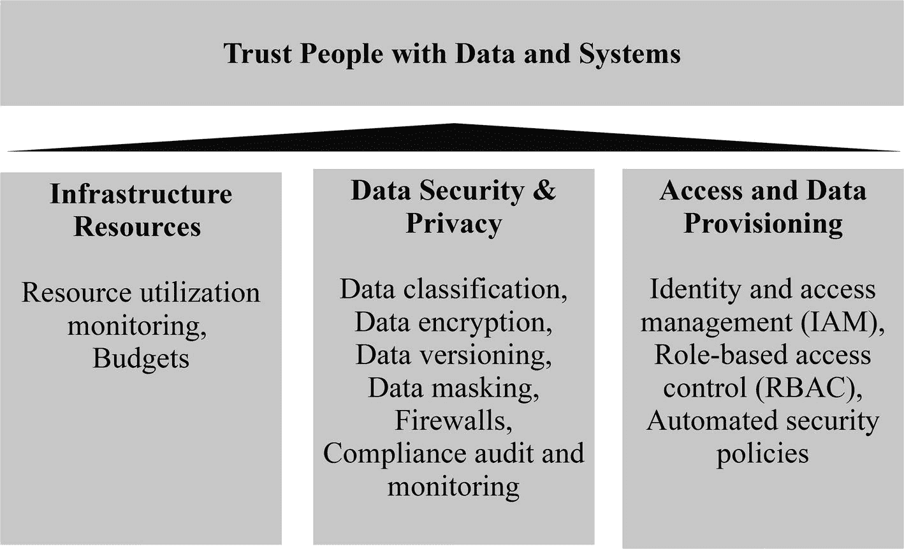
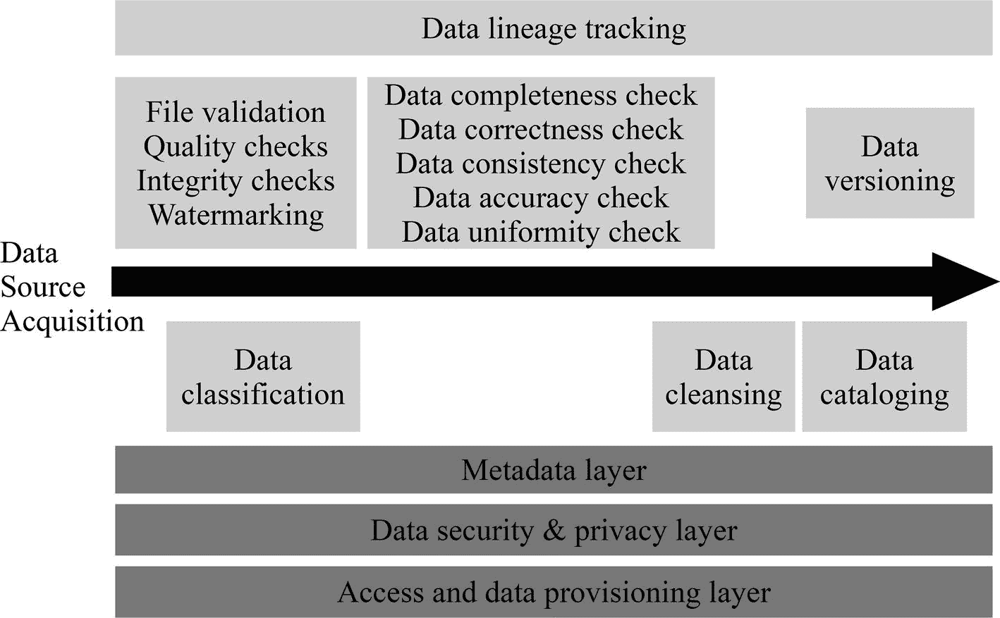

# 6.建立信任

汽车有刹车不是为了停下来，而是为了快速行驶。如果汽车没有刹车，人们仍然会开车，但只是开得足够慢，这样他们就可以在紧急情况下利用附近的树或灯柱安全停车。刹车越好，你就能越快安全行驶。Brabham 一级方程式赛车队在 20 世纪 80 年代初推出的碳/碳刹车让该队赢得了 14 年来的第一个冠军，并在比赛中占据主导地位，直到其他球队复制它们。

碳/碳刹车允许布拉哈姆的车手比竞争对手更快地进入弯道，因为车手知道他们可以更快地减速。然而，为了跑得更快，你需要更多的安全功能。在大多数司法管辖区，驾驶标准车辆时必须佩戴安全带。然而，赛车需要一个赛车安全带，防滚架，灭火设备，头盔，燃料切断开关，头部和颈部约束，以及防火服。因此，速度和安全特性是相辅相成的。

不幸的是，许多 IT 部门认为降低风险的途径不是引入安全功能，而是比喻性地从车辆上卸下轮胎，使其尽可能难以驾驶。这确实是防止事故的一种策略，但它也保证你不会很快去任何地方。这种方法导致数据分析团队将数据治理视为其工作的障碍。因此，他们创建了一个平行的影子 IT 操作，使分析更不安全。

为了让数据分析走得更快，它需要以规则和约束的形式建立信任。需要两种类型的信任，组织需要信任能够访问数据和系统的人，数据用户需要信任他们使用的数据是正确的。凭借对员工的信任，组织可以确保其数据专业人员能够轻松访问他们需要的数据和系统，同时保持数据安全、满足法规要求并高效利用资源。凭借对数据的信任，数据专业人员可以快速工作，而不必担心出错。

## 信任拥有数据和系统的人

使用传统方法向消费者提供数据和系统，大量 IT 专业人员通过缓慢的劳动密集型过程创建治理良好的数据仓库和数据集市。不幸的是，访问数据、添加新数据或对仓库和市场中的数据进行更改需要花费太多时间来进行有效的数据操作。

DataOps 要求数据科学家、数据分析师和数据工程师能够快速访问数据、工具和基础架构，以消除瓶颈。也就是说，他们需要能够自己快速访问、添加或修改数据。我们将这种可用性称为数据自助服务。通过自助服务，数据分析专业人员可以用比传统方法少得多的时间创建数据产品。

自助服务面临的挑战是获得正确的数据安全性、数据治理和资源利用。在许多受监管的行业中，必须遵守规定的数据安全和数据保护政策。即使在不受监管的行业，商业敏感信息和个人身份信息(PII)也必须得到保护。自助服务数据必须在不违反内部规则和外部合规性法规的情况下可用。自助服务也不是浪费资源和增加大量成本的借口。

### 访问和提供数据

传统上，IT 或数据团队坐在用户和数据之间，同时扮演看门人的角色。用户通过提交票证来请求访问数据。然后，把关团队根据安全性和治理考虑，手动决定是否发布数据。但是，这种方法不能很好地适应组织当前捕获的大量各种数据，也不支持自助服务模式。这种方法也不能促进合作。

通常情况下，在组织中工作时间最长或参与过各种项目的用户最终会比新员工获得更多的数据访问权限。此类活动会造成协作瓶颈，并导致一些人等待数据访问。

传统方法也是创新的障碍。用户可能需要探索新的数据源，以了解它们的价值，但可能会发现由于把关团队的障碍，很难访问这些数据。

数据访问问题的一个解决方案是授予每个人完全的访问权限。但是，在涉及敏感数据或行业法规限制谁有权访问信息的情况下，这不是一个选项。法律也会随着时间而改变。也就是说，今天合法存储和访问的数据明天可能就不一样了。

另一种方法是通过身份和访问管理(IAM)将用户身份与角色和数据访问策略联系起来。IAM 是一个技术和策略框架，可确保身份能够访问适当的资源，如应用程序、服务、数据库、数据和网络。IAM 依靠用户、角色和预定义权限的中央目录来验证用户并授予他们访问权限，这些权限通常基于基于角色的访问控制(RBAC)。

RBAC 使用预定义的工作角色和相关策略来控制对单个系统的访问，并授权工作角色可以在特定系统的上下文中执行的操作。例如，RBAC 可以定义几个角色，而不仅仅是阻止或允许访问所有数据。一个角色可能对系统中的整个数据集具有只读访问权限，而另一个角色可能只允许对数据集中的特定字段具有完全访问权限，而其他所有字段都被屏蔽。第三个角色可能允许完全访问某些系统，但不允许访问其他系统。第四个可能允许系统上除导出、共享和下载(等等)之外的所有操作。

RBAC 的替代方案是基于用户的访问，在个人级别创建权限。基于用户的访问控制允许对个人进行更细粒度的许可，但会带来额外的管理开销，因此只有在需要额外控制的情况下才需要这种控制。

有许多方法和工具可以实现 IAM 来定义角色如何基于组织的系统和需求访问数据。最关键的要求是 IAM 通过与现有访问和登录系统集成的集中式技术提供数据访问。当 IAM 框架管理数据访问时，将用户映射到数据访问策略、收集所有交互的审计日志以及为安全性和治理构建智能监控变得更加容易。

### 数据安全和隐私

创建自助式数据文化需要强大的安全性和合规性控制。数据安全和隐私法律法规存在于行业、地区、国家和国际层面。例如,《通用数据保护条例》( GDPR)为整个欧洲经济区(EEA)的数据保护、安全性和合规性制定了严格的标准，而《健康保险便携性和责任法案》( HIPAA)则为保护美国的敏感患者数据制定了标准。

数据分类策略是数据安全和保护敏感数据的基础。组织的风险偏好和监管环境决定了数据分类策略，而单独的安全策略定义了保护每个分类类别的存储、处理、传输和访问权限的要求。

创建数据分类策略的第一步是定义目标，例如遵守行业和国家法规以及降低未经授权访问个人数据的风险。理想情况下，在建立了敏感、机密和公共等目标后，组织应该只创建三到四个数据分类级别。敏感类别包括个人身份数据、支付卡信息、健康记录、身份验证信息或高度商业敏感信息。机密级别可能包含不公开的内部或个人信息。公共保密级别包括可在组织外部自由披露的信息。

数据所有者应负责根据分类政策对其拥有的数据进行分类。然而，由于数据的数量和种类，手动分类和标记数据可能不可行。幸运的是，自动数据分类解决方案已经存在，包括亚马逊网络服务(AWS)上的 Macie 和谷歌云上的数据丢失预防。数据所有者与 IT 部门或信息安全办公室一起为每个数据分类标签制定访问、存储、传输和处理策略。

限制对敏感数据的访问并不是保证其安全的唯一选择。通常，敏感数据对于测试、连接标识符数据集或作为分析功能的分析非常有用。例如，地理分析需要地址信息。数据屏蔽、安全哈希、分桶和格式保留加密是消除此类数据的身份或匿名的常用方法。

数据屏蔽或数据混淆涉及替换类似的数据(如名称或地址)、随机打乱数据或对值应用随机变化，以在称为假名化的过程中保持数据有意义。在其他情况下，数据屏蔽更加极端，包括清空或删除数据字段，或者屏蔽字符和数字，例如电话号码或信用卡的最后一位数字以外的所有数字。

安全哈希与加密的不同之处在于，它是一个单向过程，通过数学函数将文本字符串转换为固定长度的文本字符串或数字字符串。对于相同的输入，该函数每次都返回相同的散列，但是即使散列函数是已知的，实际上也不可能反转该过程并找到原始值。有时，称为 salt 的附加随机文本被添加到数据中，以使过程更加安全。

分时段将单个值替换为分组值，例如，将日期替换为月或年，将薪金替换为薪金范围，将职称替换为职业分组。

格式保持加密在保持数据形式的同时对数据进行加密，因此加密的电话号码看起来仍然像电话号码。格式保留对于稍后在数据流水线中通过验证测试是必不可少的，验证测试检查数据格式是否符合预期。

在将敏感数据用于开发和测试之前，在接收过程的早期集中保护敏感数据，可以最大限度地降低安全风险，并防止以后每次访问数据时需要保护数据的延迟。

IAM 控制哪些用户可以访问资源，但是阻止意外或恶意访问数据的用户看到数据也很重要。数据加密实现了对静态数据(或存储中的数据)和动态数据(或从一个位置移动到另一个位置的数据)的保护。存储时加密数据并解密(当数据被访问时)可保护静态数据。数据可以在传输之前由发送数据的系统在客户端加密，或者由存储数据的系统在服务器端加密。

超文本传输协议安全(HTTPS)、安全套接字层(SSL)和传输层安全(TLS)等加密连接协议可在数据通过网络传输时保护数据。除了加密之外，网络防火墙和网络访问控制还可以进一步防止未经授权的访问。

在自助式数据运营世界中，团队需要访问数据和基础架构来处理数据。基础设施可能是多租户的，这意味着许多团队共享相同的系统资源和数据资产。数据也需要保护，防止用户和应用程序意外删除或损坏数据。

数据版本控制是一种在多租户场景中保护数据的方法。更新数据时，会保留以前版本的副本，如果需要，可以恢复到以前的版本。为了进一步防止意外丢失，多个区域或地区可以将数据存储在云中。

不幸的是，许多国家和经济地区建立了数据本地化政策壁垒，作为一种数据保护主义。因此，制定规则和治理以确保数据仅在当地法律允许的地区传输、存储和处理至关重要。

为了确保遵守法律、法规和内部数据治理政策，审核和监控是必不可少的。日志文件捕获数据访问、数据处理操作和用户活动事件。法规可能要求将这些日志文件保留一段规定的时间，以提供审计跟踪。通过实时分析日志文件来检测异常行为，并发出警报或标记以供进一步调查，从而创建警报。有几种解决方案可以捕获和分析日志数据，并主动识别问题，如 AWS CloudTrail 和 Elastic Stack。

### 资源利用监控

多租户要求用户之间公平地共享基础架构。否则，用户将不得不排队等待他们的查询或流程运行，或者最终消费者会注意到数据产品的延迟。虽然现代云平台允许几乎无限的资源扩展，但仍然有必要有适当的约束。组织仍然需要最大化其数据基础架构成本的回报，资源约束是阻止浪费流程的一种方式。

通过数据基础架构团队和用户之间定义的合同，为数据库中的预算、计算资源或查询工作负载设置硬配额或软配额是确保公平的合适方法。对基础设施使用和成本的短期反馈使用户能够权衡工作价值和生产成本。通过对收益的长期衡量，KPI 有助于调整配额，以便最有价值或对时间最敏感的工作负载优先于其他用途。不幸的是，由于各种原因，如季节性需求变化或昂贵的探索性分析，工作负载可能会达到峰值并突破配额。

有时候，配额会被意外突破。例如，每个没有经验的数据分析师或数据科学家都无意中运行了一个笛卡尔连接查询，该查询将一个数据库表中的每一行连接到另一个表中的每一行。笛卡尔连接的计算开销很大，因为输出可能会产生数十亿个返回行。无法预料的低效数据处理或恶意查询会以其他用户为代价消耗资源或预算。

有几种方法可以防止意外的资源利用率影响预算或其他工作负载。一种常见的方法是将工作负载隔离在单独的基础架构中，以便临时分析不会影响更关键的工作。AppDynamics、New Relic、DataDog、Amazon Cloudwatch、Azure Monitor 和 Google Stackdriver 等监控工具跟踪数据中心或云中的资源和应用程序的指标。

借助这些工具，您可以查看可视化和统计数据、存储日志、设置警报以及监控实时性能，从而快速隔离和解决问题。许多数据库都配备了工作负载管理工具，通过基于进程优先级、资源可用性动态分配任务来优化用户和应用程序的性能，并在查询违反监控规则时执行操作。

可以设置云平台中的预算，以监控一段时间内的支出，并在超出阈值时发出警报，从而主动管理成本。云平台还提供精细的成本和使用报告，有助于发现优化和提高数据产品投资回报率的机会。

图 [6-1](#Fig1) 显示了建立数据用户信任的支柱。

图 6-1

The pillars for trust in users of data

## 人们可以信任数据

在我职业生涯的早期，我经常不得不花费数天甚至数周的时间来调查业务指标的突然变化是真实的还是数据质量故障。它几乎总是被证明是一个数据质量问题，没有足够早地被发现以在数据流水线中得到纠正，并令人尴尬地一直传播到利益相关者。垃圾进来导致垃圾出去。也就是说，使用干净数据的简单算法将优于使用脏数据的复杂算法。然而，人工智能等数据的性感应用获得的关注和资源远远超过数据质量。

准确性是数据的准确性。这是继数量、多样性和速度之后的第四个大数据 V，也可以说是最重要的。如果没有真实性，大数据就为更快、更大规模地做出错误决策提供了机会。

数据质量仍然是数据分析中浪费精力的一个重要来源。塔德格·纳格尔、托马斯·莱德曼和大卫·萨蒙的《哈佛商业评论》研究发现，75 家参与公司中只有 3%的数据质量得分被评为可接受(100 分中有 97 分或更多的正确数据记录)。 [1](#Sec15) 总共有 47%的新创建记录至少有一个影响工作的关键错误。

当数据是坏的时，它不再是资产，而是成为负债，因为如果未被发现，单个坏数据项可能会影响多个报告和机器学习模型数月或数年。用户需要一种主动的方法来信任数据，而不是许多组织中仍在进行的不可持续的救火工作。起点是收集关于数据的数据，或元数据。元数据是建立数据信任和质量检查的核心，对于实现自助式数据运营至关重要。许多数据清理、数据发现、数据供应和最终分析都依赖于收集元数据。

### [计]元数据

组织包含大量数据集。对于数据用户来说，搜索潜在的数十个系统、数千个目录和数百万个文件来找到他们需要的数据和/或有权使用和找到他们信任的数据可能是不现实的。数据集和字段名称通常与内容无关，命名标准可能不一致，非结构化数据可能没有描述性的文件名或属性。数据集也可能存储在错误的目录名下。

即使你能检查所有数据集，也几乎不可能理解它们代表了什么。在使用数据之前，必须有一种方法来发现它，知道它来自哪里，它意味着什么，谁拥有它，以及它的哪一部分可以被谁使用。元数据，关于数据的数据，帮助用户理解数据代表什么。美国国家信息标准组织(NISO)定义了三种主要类型的元数据:描述性元数据、结构性元数据和管理性元数据。 [2](#Sec15)

描述性元数据描述用于识别和发现的数据。描述性数据包括业务元数据和操作元数据的子类别。业务元数据由用户友好的名称、标签、标记、所有权信息和数据屏蔽规则组成，使人们更容易浏览、搜索和确定它是否是适合自己的数据集。操作元数据捕获有用的信息，例如数据源、谁接收了它、数据的使用以及对数据的处理操作的结果。操作元数据封装了数据的起源、沿袭、版本、质量信息、数据生命周期阶段和概况。描述性数据有助于用户和数据发现工具查找、编目、探索和理解数据集。

结构化元数据是关于信息组织及其与其他数据的关系的数据。结构化元数据描述了数据结构，如系统名、表名、字段名、索引和分区，以便了解特定数据资产在数据层次结构或数据集合中的位置。除了组织之外，结构化元数据还记录了数据项之间的关系。例如，结构化元数据记录文件的一个版本是另一个文件的原始、未处理版本，或者记录两个数据集之间的外键关系。

管理元数据包含三种元数据子类型，包括技术元数据、保存元数据和权限元数据。技术元数据通过提供文件类型、文件大小、创建时间、允许值、数据类型和压缩方案等信息来帮助解码和使用文件。保存元数据，如校验和(或对一段数据运行加密哈希函数的输出)允许在传输、格式迁移或其他处理后验证数据完整性。权限元数据保存与数据相关联的策略信息。这种类型的元数据捕获与数据访问、数据处理权限相关的策略，以及指定数据保留期的生命周期策略。

元数据可以帮助用户更快地识别他们想要和可以使用的数据，从而帮助他们信任数据。元数据对于自助数据分析至关重要。如果没有它，即使用户可以访问自助服务基础架构，他们仍然会遇到瓶颈，需要专业的 it 帮助来使用数据集。元数据还通过促进数据治理来帮助增加数据用户的信任，数据治理规定了数据管理、质量、访问和使用的政策标准。关键能力元数据依赖于一个健壮的、可伸缩的框架来捕获和管理元数据。

### 磨尖

交付一个管理元数据的框架是有挑战的。不同的应用程序、团队甚至供应商可能会以非常不同的方式描述和构造类似的数据。如果没有标准，元数据可能会变得不一致，从而违背其目的。

解决这个问题的传统方法是集中元数据管理。数据仓库和数据集市团队产生并遵守元数据标准，并使用元数据管理工具处理数据中的变化。集中式元数据管理同步数据和元数据，并且元数据管理中没有不一致。但是，随着组织捕获的数据量和种类的不断增加，用于集中式手动元数据管理的变更管理流程很快会成为瓶颈。如果是手动创建或转换数据以符合组织的元数据标准，等待元数据创建会减慢新的或更新的数据源的接收和可用性。

集中式元数据管理的一个替代方案是，你猜对了，分散式元数据管理。由于组织中没有一个人或团队了解每个数据项，因此分散的元数据必须众包。主题专家和数据用户在标记过程中将描述性元数据与字段和数据集相关联。

为了一致性，业务元数据标签应该与现有的业务术语表、分类法或本体相协调。这些限制对于让元数据标记者坚持战略愿景而不是他们自己的愿景是至关重要的。业务术语表包含组织使用的业务术语和同义词的标准定义。业务分类法以层次结构对对象进行分类，如部门、位置、主题或文档类型。业务本体描述单个实例或对象、作为类的对象集或集合、这些对象和类的属性、类和对象之间的关系以及规则和限制。

本体比分类法有更灵活的结构。例如，金融行业业务本体(FIBO)描述术语、事实以及与金融行业中的相关业务实体、证券、贷款、衍生品、市场数据、公司行为和业务流程的关系。FIBO 帮助公司整合技术系统，共享数据，并使用通用语言实现流程自动化。 [3](#Sec15)

分散元数据方法的缺点是它需要大量的忠实用户来维护元数据。另一个缺点是，虽然用户彻底地记录了流行的数据集和字段，但可能会保留大量未标记的暗数据。

最终的解决方案是将分散的元数据管理与软件自动化相结合。主题专家和数据用户标记数据，然后高级数据目录工具使用机器学习来学习标记进一步数据的规则。对自动标记准确性的反馈有助于改进机器学习模型。非结构化数据甚至不需要标记为来自亚马逊 Web 服务、谷歌云平台和微软 Azure 的云服务从图像、视频、语音和文本中提取元数据。

### 摄入期间的信任

一旦来自源系统的批处理或实时流接收到数据，就开始建立对数据的信任。文件验证和数据完整性检查可防止数据完整性受损或在接收过程中出现重复数据加载。文件重复检查会根据现有文件逐步检查传入文件内容的文件名、模式和校验和，并删除任何重复的文件。

传输中的错误会破坏数据。因此，文件完整性测试会查看接收的文件是否与传输的文件相同。源系统中的哈希函数将文件内容转换为消息摘要，并与文件内容一起发送。如果输出与消息摘要匹配，则对接收到的文件内容应用散列函数会验证文件的完整性。

文件大小检查是另一种类型的文件验证检查。它们类似于文件完整性测试，但比较的是传输文件的大小而不是哈希。文件周期性检查会定期监控文件数量，如果在适当的时间段内未收到预期数量的文件，则会发送警报。

接收过程中的数据完整性检查确保了接收数据的准确性和一致性。最直接的数据完整性检查是比较源系统和接收数据之间的总记录数。其他数据完整性检查包括将摄取数据的模式或列计数与数据源进行比较，以检测数据中的结构变化。

捕获元数据的最早机会是在摄取时。在接收阶段，将获得有关接收时间戳、数据源、接收发起者、文件模式和保留策略的重要信息。根据数据分类策略，业务、运营和管理元数据标记以及数据分类规则也在此阶段应用。除了元数据捕获之外，摄取数据的数据水印支持在数据通过数据流水线和整个生命周期直至删除的过程中进行沿袭跟踪。与元数据不同，水印通过向文件或记录添加唯一标识符来改变原始数据。

### 数据质量评估

在接收之后，数据就可以直接消费或数据集成了。数据集成是组合来自多个来源的数据的过程。集成多个数据源可以最大化数据的价值。

与仅集成结构化数据的传统仓库不同，当今大多数组织需要将结构化数据源与半结构化的机器生成数据甚至非结构化数据(如本地数据湖或云中的客户评论文本)集成在一起。然而，组合不准确、不完整和不一致的数据会削弱数据集成的好处，在某些情况下会适得其反，因为它会将好数据与坏数据结合在一起。低质量的数据必须在集成前被检测、转换或标记。

文件可以通过验证检查，数据完整性检查可以接受质量差的数据，因为质量问题是在生成数据的源系统中产生的。应该检查传入的数据，以确保它符合预期的格式和值范围。

数据分析是从现有文件或数据源收集统计信息和摘要信息以生成元数据的过程。数据分析工具或代码可以生成描述性的汇总统计数据，如频率、合计(计数和总和)、范围(最小值、最大值、百分位数和标准偏差)和平均值(平均值、众数、中位数)。

数据分析是一种检测较差数据质量并为数据清理创建元数据的方法。在实践中，应该不止一次地捕获和监视数据分析元数据。每次转换数据时，在创建新的数据流水线时，以及在流水线更新期间，都应该沿着整个数据流水线捕获它。

为了保证数据质量，需要捕获额外的分析值。了解数据的完整性、数据相对于业务规则的正确性以及数据在数据集之间的一致性是非常重要的。为了保证数据的完整性，数据分析会捕获元数据，例如出现的空值、缺失值、未知或不相关的值以及重复值。为了保证数据的正确性，有用的分析包括以下方面的元数据:

*   离群值。高于和低于有效值范围的值，或非典型的字符串长度和值。
*   数据类型。字段的数据类型应该是预期的数据类型，例如，整数、日期/时间、布尔等。
*   基数。有些值可能需要在数据字段中是唯一的。
*   设置成员资格。特定字段中的值必须来自一个离散的集合，如国家、州或性别。
*   格式化频率。有些值，如电话号码，必须符合正则表达式模式。
*   跨字段验证。精确条件应该适用于所有领域；例如，结束日期不应早于开始日期。

数据一致性元数据捕获关于数据相对于其他数据的一致性的信息，例如违反引用完整性规则。例如，如果一个数据集引用一个值(如客户 ID ),则被引用的值必须存在于另一个数据集(如客户详细信息表)中。

除了剖析，数据质量还包括检测准确性和一致性方面的异常。准确的数据符合标准的测量和值，例如经过验证的地址。数据的一致性确保使用相同的单位测量相同的数据。当将美国数据与世界数据集成时，标准化尤其重要，因为距离、体积和重量测量使用不同的单位。

### 数据清理

如第 [1](01.html) 章所述，数据科学家经常将低质量的数据视为他们在调查中面临的最大挑战。解决问题是消除数据科学过程中的浪费和提高决策质量的最有效方法之一:

> More data is better than clever algorithms, but better data is better than more data.

> —— Peter Novig, director of research department of Google.

一旦数据质量元数据提供了对数据质量问题的清晰理解，就有一些纠正问题的选择。更好的选择是在数据接收之前修复源系统中的数据质量问题，例如，除非记录与预定义的格式匹配或不包含缺失值，否则禁止创建记录。其他选项是清理数据或接受数据质量问题，并允许用户根据数据质量元数据标签决定是否或如何使用数据。数据清理涉及删除或更正数据，并收集操作元数据来记录这些清理操作。

处理数据正确性或数据完整性问题的传统方法是删除数据或估算值，这样问题数据就不会传到流水线中。出于审计目的，任何删除的数据都存档在单独的文件中。插补使用统计方法用新值填充缺失值、空值或错误值。新值可以基于该字段的平均值(均值、众数或中值),或者通过预测模型估算的更复杂的方法。当主要分析用例是使用汇总和汇总数据的描述性分析时，删除或插补方法是可以接受的。然而，机器学习是有问题的，它通常在观察水平上做出预测。

删除带有缺失数据或空数据的记录的问题是，该过程会删除信息。输入缺失值也不会增加新信息。它只是将现有的模式嵌入到数据中。

在现实世界中，即使缺少一些数据，也经常需要进行机器学习预测，因此模型会受益于在训练期间看到示例。因此，相对于删除或插补，更好的方法是采用上一章概述的监控方法，即 KPI 阈值。

可以为数据质量设置 KPI 阈值。例如，我们可以接受年龄字段中至少 99.9%的值应该在允许的 0 到 125 之间。如果监控显示数据质量超过 KPI，则数据被接受并传递到流水线中。如果 KPI 开始接近阈值警告，就会触发警报进行调查。如果质量低于阈值，则应用制动来防止坏数据进一步恶化。如果问题是可修复的，丢失的数据将被回填并再次可用。

数据质量元数据标记存储符合数据质量阈值的记录或字段的比例。元数据通知用户数据质量和他们需要采取的行动。数据科学家为缺失值创建一个特征(或分类标签)，允许机器学习算法学习处理缺失值的最佳方法。商业智能开发人员可能会决定删除数据或根据相同的元数据估算值。

实体解析(或模糊匹配)有时可以解决数据一致性问题。相同的数据或实体在数据中可能会出现不一致，原因是打字错误、标注错误或大小写不稳定。实体解析和模糊匹配技术试图识别记录可能相同的地方。

由于真实值未知，仅通过数据清理很难实现数据准确性校正。通常，纠正准确性的唯一方法是外部数据源是否包含真实值。例如，邮政编码可以与外部地址数据库相匹配，以确保地址详细信息是正确的。通过应用算术变换使数据成为单个度量，可以很容易地清除不一致的数据。

### 数据谱系

数据质量元数据告诉数据工程师、数据分析师和数据科学家数据有多好。了解数据的来源、移动到了哪里以及发生了什么也很有用。通常，数据用户是在他人工作的基础上构建的，而不是重新发明轮子或第一次使用原始数据。对诸如“我不确定这些数据从何而来”或“建造流水线的人几个月前就走了”等血统问题的回答不会激发对数据的信心。

对数据血统(或数据来源)的理解有助于信任，因为对于类似的数据项，一些数据和过程的来源可能比其他来源更可靠。数据沿袭还有助于追溯错误的来源，允许转换的再现，并提供数据源的属性。在某些行业，尤其是金融服务业，法规遵从性要求对用于财务报告的数据进行沿袭记录。

许多商业 BI 和 ETL 工具在处理数据时会自动捕获沿袭信息。然而，如果流水线中涉及多个系统、工具和语言，尤其是如果它们是开源的，那么捕获数据血统就不是一个简单的过程。

一些 ETL 过程可能使用 SQL 查询，另一些使用基于图形用户界面(GUI)的工具，还有一些使用 Java、Scala 或 Python 等编程语言。这种语言和工具的混合使得标准化流程的表示变得困难，有时甚至难以识别工具和代码是从相同还是不同的系统中提取数据。

最直接的策略是记录业务级别的沿袭，用业务术语和简单的语言描述数据沿袭。业务级沿袭的问题在于，创建和维护它是一个手动过程。

业务级沿袭的替代方法是创建技术沿袭，显示用于对数据执行转换的特定代码。由于数据沿袭只有在追溯到源头时才有用，并且可能涉及许多系统，所以沿袭信息是从多个来源拼接在一起的，以构建一个完整的画面。在 Hadoop 生态系统中，治理和元数据工具 Apache Atlas 和 Cloudera Navigator 提供了可视化数据谱系的能力。其他工具，如 IBM Infosphere Discovery、Waterline data、Manta 和 Alation，可以从多个来源和平台提取数据处理逻辑，以生成沿袭报告。

### 数据发现

数据消费者需要了解数据、数据的结构、内容、可信度和血统，以便找到相关数据并有效地利用数据。数据发现通过两步过程引导人们找到相关的数据集。第一步是使数据可被发现，第二步是执行发现。

元数据使数据可以被发现，而不必直接搜索和访问数据。正如图书馆使用诸如主题、作者和标题等元数据来组织和分类他们的数据一样，组织也需要组织和分类他们的数据集。然而，如果没有一个可查询的界面来使用元数据或数据内容搜索数据，数据用户将很难找到他们需要的东西。如果没有可搜索的目录，数据用户就只能依靠部落知识(或组织中未写的信息)，这是一种非常耗时的方法。

可以从 IBM、Collibra、Alation、Informatica、Waterline Data 等供应商那里购买现成的数据目录软件，使元数据和数据可以搜索。然而，也可以使用开源软件和云服务来构建数据目录。例如，可以使用 AWS Lambda 提取元数据，并在创建时将其保存到 Amazon DynamoDB for objects，从而为存储在数据湖的 S3 存储桶中的所有数据构建一个数据目录。用户可以使用 Amazon Elasticsearch 搜索元数据。

更高级的数据目录解决方案提供了数据发现搜索之外的功能。一些数据目录自动标记数据，并允许用户对数据源进行评级，添加注释，并提供关于业务意义和数据之间关系的附加上下文。其他功能包括与各种工具集成的能力，以与业务术语表、标记数据所有者和管理者链接，拉入数据谱系数据，屏蔽敏感数据，并与访问控制工具共享标记，以限制数据访问并仅提供给授权用户。

图 [6-2](#Fig2) 总结了在数据从获取到使用的各个阶段传递对数据和人的信任的工作流程。

图 6-2

The workflow to deliver trust in data

### 数据治理

到目前为止描述的许多活动都是数据治理的子集。数据治理旨在确保组织中数据的质量、安全性、可用性和可用性。许多传统的数据治理方法由于所采用的命令和控制方法而举步维艰，这就形成了一种“我们对他们”的心态。数据治理工作被认为是繁重的，因此被忽视了。相反，精益/敏捷数据治理计划促进了数据生产者和数据消费者之间的协作过程。

对数据的信任来自于在组织的许多团队中开发数据质量文化。开发人员和其他数据制作者必须接受教育，了解为什么信任数据和访问数据至关重要，以及它给组织带来的好处。数据消费者必须与数据生产者协作，实施数据质量检查和监控，为持续改进提供反馈。清晰的指导和自动化通过将流程嵌入日常工作而不是单独的法规遵从性活动，降低了数据治理的成本并降低了风险。

数据治理必须仍然有所有者，否则它将在资源和时间的竞争中死去。拥有数据治理的最佳人选是业务涉众，因为他们是从 it 中获益最多的群体，并且能够平衡风险。IT 和数据消费者倾向于采取以技术或数据为中心的治理观点，而不是业务驱动的方法。

数据治理所有者必须确保定义明确且可量化的目标到位。交付完美的数据质量、元数据、数据沿袭跟踪和数据编目是一项不可能的任务，因为不是所有的问题都是可以解决的。但是，使用数据的人可以定义足够好的数据质量，这反过来又会设置认证数据质量的要求以及检查数据质量和清理或修复问题的工作流。然后，数据管理员继续持续测量和监控数据质量。

## 摘要

数据治理并不是一个新概念，但是当今组织捕获的数据量、多样性和速度以及新的法规(如 GDPR 法案)要求采用新的方法。组织捕获了大量结构化、半结构化和非结构化数据的存储库，但并不总是知道它们拥有什么、存储在哪里，或者数据有多准确和敏感。缺乏此类信息会带来合规、商业和声誉风险。传统解决方案依赖于手动管理，甚至阻止对精心管理的数据仓库或市场之外的数据和系统的访问，以降低风险。然而，这种方法严重阻碍了数据专业人员创建新的数据产品来帮助组织及其客户的能力。

解决方案是通过自动化数据的识别、分类、安全、供应、质量评估和清理，建立用户对数据的信任和用户对数据的信任。它从看门人变成了店主。店主邀请顾客浏览并鼓励他们自己动手，而不是花费精力将顾客挡在店外，让生意陷入饥饿。正如未成年人不允许购买受限制的物品一样，政策也确保没有正确凭证的人不能访问敏感的数据项。

培养人们对安全访问数据和系统的信任，以及建立用户对数据质量的信任，可以消除数据科学过程中两个最重要的浪费来源。对数据和系统的信任通过消除无休止的 IT 请求和资源与权限协商的瓶颈，实现了对数据和基础架构的自助式访问。对数据的信任使数据科学家、数据分析师和数据工程师可以花更少的时间清理数据、追踪其意义和来源、担心得出不正确的推论，而将更多的时间用于开发数据产品和做出决策。

下一章重点关注 DevOps 实践，以加快数据周期和数据使用时间。数据科学家、数据工程师和数据分析师需要不断吸收新的数据源，构建和改进数据流水线，并在保持质量的同时以闪电般的速度创建新的数据产品。

## 尾注

1.  塔德格·纳格尔、托马斯·c·莱德曼和大卫·萨蒙，只有 3%的公司数据符合基本质量标准，《哈佛商业评论》，2017 年 9 月。[T2`https://hbr.org/2017/09/only-3-of-companies-data-meets-basic-quality-standards`](https://hbr.org/2017/09/only-3-of-companies-data-meets-basic-quality-standards)
2.  Jenn Riley，理解元数据，什么是元数据，它有什么用？2017.[T2`https://groups.niso.org/apps/group_public/download.php/17446/Understanding%20Metadata.pdf`](https://groups.niso.org/apps/group_public/download.php/17446/Understanding%20Metadata.pdf)
3.  关于 FIBO，金融行业的开放语义标准。[T2`https://edmcouncil.org/page/aboutfiboreview`](https://edmcouncil.org/page/aboutfiboreview)