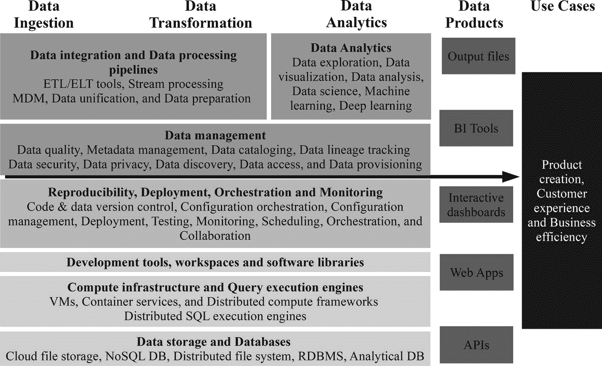
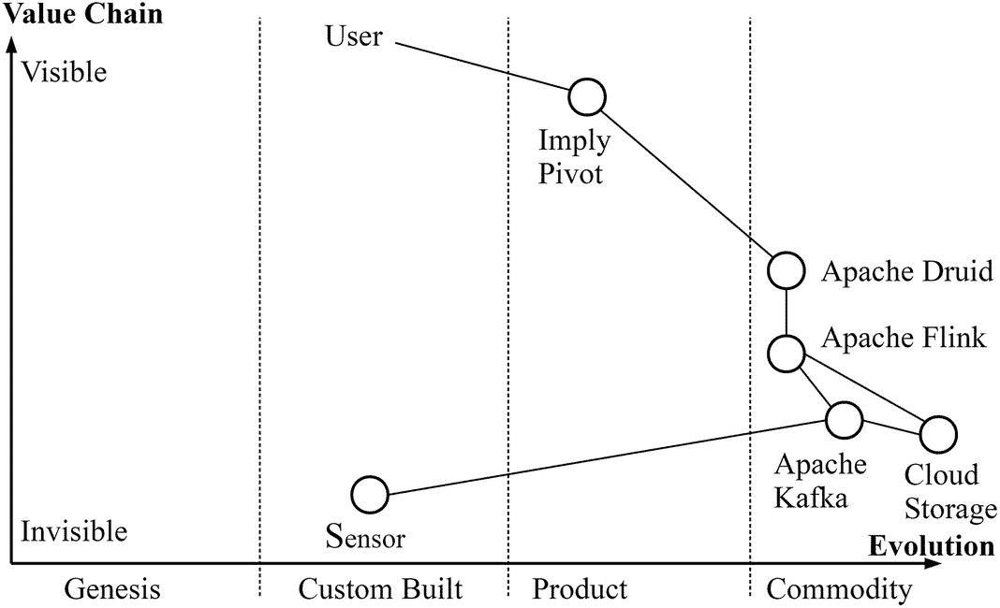
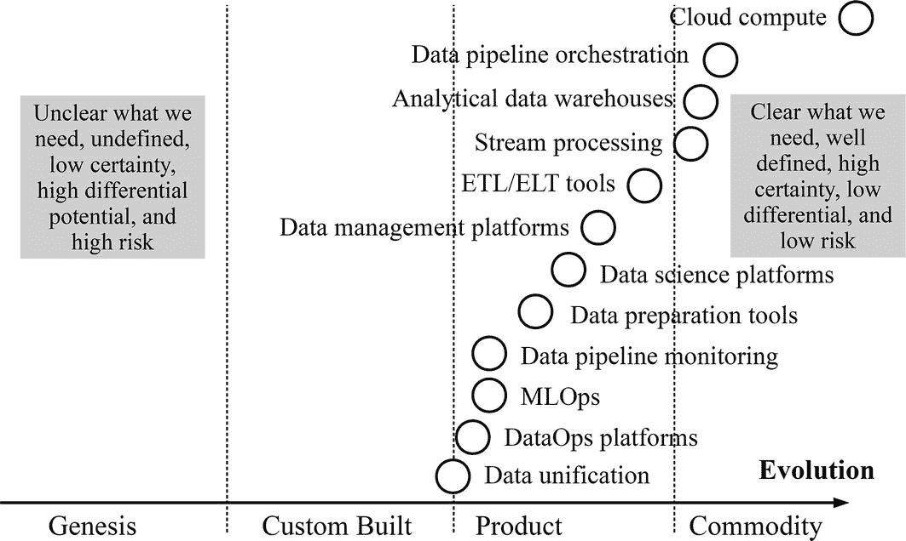
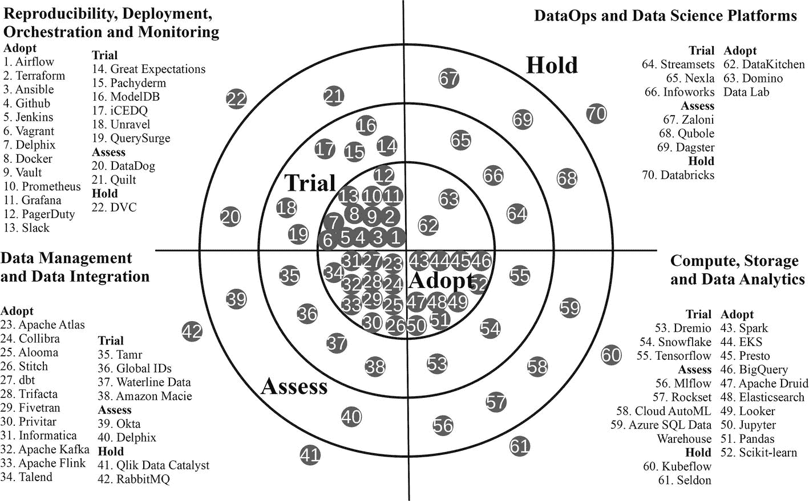

# 9.数据操作技术

技术被故意留到最后一章，因为虽然它是必不可少的，但它没有人、文化和流程那么重要。如果工具是成功的全部，那么硅谷巨头不会开源他们皇冠上的宝石，如 Kubernetes、TensorFlow、Apache Kafka 和 Apache Airflow。

许多组织认为向技术供应商开支票或采用最新的开源软件是解决问题的简单方法。技术供应商和赞助商很乐意帮助和延续银弹的神话，经理们也愿意接受它，因为如果出了问题，他们总是可以责怪技术或供应商。然而,《哈佛商业评论》( Harvard Business Review)一项针对 680 名高管的研究报告称，传统技术只是数字化转型的第五大障碍。 [1](#Sec28) 快速试验、改变流程、跨越孤岛工作和创造冒险文化的能力都是数字化转型的更重要的促成因素。尽管如此，DataOps 通过正确的技术消除了当今存在的数据消费摩擦，取得了更大的成功。

## 根据 DataOps 价值观和原则选择工具

正如化学不是关于试管而是实验一样，DataOps 不依赖于硬件、平台、框架、工具、应用程序、软件库、服务或编程语言形式的特定架构或技术。然而，一些架构和技术在支持数据操作方面比其他的要好。

### 挺直你的脊柱

无论何时选择技术，最好不要从工具本身开始。DataOps 技术堆栈是达到目的的一种手段，其本身并不是目的。应用 Trethewey 和 Roux 的脊柱模型有助于理解哪些工具最适合使用。 [2](#Sec28) 图 [9-1](#Fig1) 显示了脊柱模型。

图 9-1

The levels of the spine model

脊椎模型对于绘制人类工作系统很有用，可以就事物应该如何工作达成一致。在这种情况下，人类工作系统的边界包括组织中从数据中创造价值的每个人。工具在脊椎的底部，关于哪一个是最好的，有许多看似合理的选择和观点。沿着脊柱往上走解决了在多个选项中选择的挑战。

工具有助于我们完成工作，正确的工具，以正确的方式使用，比错误的工具更有效地帮助我们应用实践。实践是在系统中完成工作的方法和方式的应用。要了解使用哪些实践，有必要再次上脊椎，定义原则。原则是指导行为和评价的命题。例如，批量反馈原则指出，增加工作的批量会延迟反馈，而减少批量会增加反馈。要知道哪些原则是有用的，需要理解系统中的价值观，这是更深层的东西。价值观是对本质的判断，是系统中优化的标准。例如，scrum 价值观是专注、开放、尊重、勇气和承诺。脊椎的顶端是需求；采用正确的价值观更有可能满足这些需求。需求是系统存在的理由。

为了保持脊柱的笔直，并确保工具满足需求，需要从脊柱的顶部开始，向下工作，以定义和调整价值、原则和实践的每一个脊椎骨。有两种类型的需求，系统的需求和系统中的人的需求。该系统存在的原因是通过从数据中提取知识来帮助组织做出更快、更好的决策，从而采取有益的行动。人们的需求是普遍的，包括自主、意义、身体健康、满足、诚实和联系。

一旦理解了系统存在的原因和人们想要成为系统一部分的动机，就该决定优化的价值了。DataOps 宣言列出了五个价值观:个体和交互；工作分析；客户协作；实验、迭代和反馈；和跨职能所有权。 [3](#Sec28) 价值观的灵感来自敏捷软件开发宣言和 DevOps。成功的数据运营取决于践行这些价值观。

通过查看价值观，可以确定基本原则。无论背景、规模或水平如何，原则都应该始终如一地适用。例如，重用减少可变性的精益产品开发原则适用于任何类型和规模的组织以及从个人到整个组织的任何级别。 [4](#Sec28) 原则可以来自许多学科，如精益思维、敏捷软件开发、系统思维、约束理论、DevOps、排队论、经济学和全面质量管理(TQM)。

正如不同的敏捷框架有不同的原则一样，DataOps 原则也有几种。第 [4](04.html) 章介绍了 DataOps 宣言中的 DataOps 原则。提醒一下，这里是基本原则:

*   不断满足您的客户
*   价值工作分析
*   拥抱变化
*   这是一项团队运动
*   日常互动
*   自我组织
*   减少英雄主义
*   显示
*   分析是代码
*   精心安排
*   使其可复制
*   简单
*   分析就是制造
*   质量至上
*   再用
*   缩短周期时间

数据运营原则催生了数据运营实践。每一种实践都必须植根于一个或多个原则。例如，持续集成和 10 分钟构建的敏捷 XP 实践是由快速反馈的 XP 原则驱动的。

### 对实践和工具的影响

一些数据操作原则，如自组织、日常交互、拥抱变化和反映，主要决定工作方式的实践。然而，其他原则导致技术实践和技术需求来支持它们。

原则之一是缩短将数据转化为有用数据产品的周期。请求数据或访问基础架构并等待许可和资源调配是组织中的一个重大瓶颈和巨大浪费源。目标必须是通过自助服务和自动化最大限度地提高数据可用性。然而，自助服务不仅仅是让数据消费者通过 BI 工具访问预先建立的数据立方体。数据消费者需要实践和工具，允许他们自动自助访问基础架构、工具、包和他们需要的所有数据，以便他们可以选择如何使用这些数据。反过来，对数据和基础架构的自动化自助访问需要一些实践和工具，通过实施数据安全和隐私策略、基础架构和数据访问策略以及对资源利用的监控，实现数据发现并建立用户信任。

减少英雄主义需要一些实践和工具，这些实践和工具允许数据分析、数据存储、计算基础设施和数据管道轻松扩展，并处理任何工作流，而无需许多团队常见的救火工作。编排包括实现一些实践和工具，这些实践和工具可以跨许多潜在的不同数据类型、技术和语言，端到端地简化和编排数据管道任务。借鉴 DevOps、实践和工具，实现频繁的小变化，而不是更少但更大的变化，支持持续满足客户的原则。

可再现性原则要求实践和支持工具能够使代码、环境和数据可再现，以便开发可以安全地部署到生产中。重复使用是一个与再现性密切相关的原则，需要避免重复浪费的实践和工具。例如，数据消费者发布、发现和重用彼此数据集的能力对于重用非常重要。重用还需要用自动化的替代方法取代繁琐、容易出错和不一致的手动过程，例如数据管理和监控。

质量至上是一条原则，它要求实践建立对数据的信任。需要工具来管理和监控元数据、文件验证、数据完整性、数据质量评估、数据清理和跟踪数据沿袭。这是一项团队运动原则，它认识到将每项任务的最佳工具组合成一个成功的堆栈的价值，而不是使用单一工具来覆盖地面并执行它无法完成的角色。

分析即代码是一条鼓励使用基于代码的工具的原则。尽管具有拖放 GUI 界面的工具最初入门门槛较低，学习速度也较快，但最终，代码是管理复杂数据分析和管道的最佳长期抽象。

代码之所以更受欢迎，并不是因为会编程的人有自虐倾向，或者希望不让非分析专家参与工作，而是因为应用软件工程最佳实践更容易。代码比拖放开发更简单，可以进行版本控制、重用、参数化、进一步的抽象、效率重构、自我文档化、协作、测试、跨环境复制、定制、在解决方案之间迁移、与其他开发集成以及使用扩展功能进行更新。不过，最好的解决方案总是能够完成工作的可行解决方案，因此任何支持数据操作的技术都比没有好。

## 数据运营技术生态系统

将支票交给 IBM、Oracle 或 SAS 等单一供应商来构建从数据接收到数据消费的完整数据分析体系的承诺早已不复存在。现代 DataOps 分析技术堆栈不是一个单一的堆栈，而是一个结合了一流技术的模块化生态系统。模块化架构类似于微服务架构，其中每种技术都是松散耦合的，可以很好地完成工作，并且可以在对整个系统影响很小的情况下进行更改。

### 装配线

没有正确或最佳的 DataOps 技术生态系统。选择一组工具取决于上下文。花费大量的时间和金钱来构建很酷的架构和技术是一种浪费，因为谷歌和亚马逊使用它们，但它们并不是合适的工具。每个架构和技术堆栈在任何给定的时间点都是不完美的，未来的需求也很难预测。正如数据产品受益于快速反馈和迭代一样，技术栈也是如此。生态系统是为不断进化而设计的，应该改变并适应新的过程和要求。

理解和构建 DataOps 技术生态系统的关键是不要从传统的架构层或支持和使用该技术的职能团队的角度来思考。传统思维导致多种技术孤岛和数据消费障碍。相反，有必要以数据为中心，将从源到消费的数据流视为一条装配线，然后考虑支持开发和运营的技术。

要采用的最佳技术是那些支持数据操作实践的技术，这些实践满足了组织做出更快、更好的决策的最终需求，从而通过从数据中提取知识来采取有益的行动。图 [9-2](#Fig2) 说明了创建和操作数据产品所需的技术考虑。

图 9-2

DataOps technology components

尽管图 [9-2](#Fig2) 显示数据流是线性的，但实际上，开发过程和生产数据流是迭代的，许多数据集、工件和技术被持续管理和重用。还有一个来自用例的数据反馈回路，它成为另一个数据源。

以下部分提供了数据装配线的技术要求细节。DataOps 技术领域正在快速发展，不同组织的使用情形也各不相同，因此不可能对技术和架构做出规定。提到的技术并不是选项或建议的详尽列表，而是在撰写本文时值得注意的示例。在某些情况下，这些技术具有多种功能，可能会出现在多个章节中。

### 数据集成

现代数据分析技术体系必须支持许多异构内部数据源的接收和来自外部系统的数据采集。源数据可以来自 web 和移动分析工具、数据仓库和集市、供应链系统、CRM 和营销平台、ERP 和财务报告工具等等。更为复杂的是，源数据也有多种类型，例如由结构化、半结构化和非结构化数据组成的文件，通常为半结构化格式的事件流，来自 NoSQL 数据库的半结构化数据，以及来自传统数据库的表格结构数据。

好处在于允许数据分析师和数据科学家集成和丰富不同的数据源，以创建能够做出更好决策的数据产品。例如，结合点击流、店内 POS、在线订购、社交媒体、呼叫中心、移动应用和营销平台数据，可以帮助数据科学家构建 ML 模型，从而改善供应链计划、预测回报、确定个性化优惠和保留计划的目标，并为零售商计算客户价格弹性。

传统上，IT 部门构建 ETL 管道，将不同的数据源集成并整合到数据仓库中的一个模式中，供数据分析师和数据科学家使用。缓慢的流程、数据源的爆炸式增长、多种多样的数据格式以及有限的开发人员能力造成了瓶颈，使宝贵的数据被困在数据孤岛中。然而，DataOps 需要更快的可用数据周期，新工具的出现消除了传统 ETL 工具和流程造成的瓶颈。

在过去的几年中，软件即服务(SaaS) ETL/ELT 产品出现了爆炸式增长，这些产品消除了在多个数据源、目标数据仓库和数据湖之间移动数据所涉及的繁重工作。供应商提供了几十个预构建的连接器来集成来自应用程序的数据，包括 Salesforce 和 ERP 系统、数据库(如 Oracle 和 SQL server)、事件流(如 webhooks 和 Kafka)、文件源和存储以及数据仓库。

这些产品做着维护连接器、检测数据、准备模式、加载数据、优化性能和监控管道的艰苦工作。产品支持的目的地包括流行的数据库，包括 Amazon Redshift、Google BigQuery、Microsoft SQL Server、PostgreSQL 和 Snowflake。使用这些解决方案，可以在几个小时而不是几个月内合并和查询数据。

尽管表面上看起来很相似，新一代的 ETL/ELT 产品通常分为两类。一些产品，如 Blendo、Fivetran、Segment 和 Stitch(基于 Singer 开源软件)，专注于在 ELT 工作负载的源和目标之间同步数据。其他产品，包括 Alooma、漏斗、Matillion、DataVirtuality、Etleap、Keboola、Xplenty、Azure Data Factory 和 Google Data Fusion，除了同步之外，还为 ETL 提供数据转换功能。

通常，从数据源获取的数据来自针对操作优化的在线事务处理(OLTP)系统，而不是分析用例。对于数据分析，扁平表形式的一些数据建模、包含来自多个表的数据的非规范化表以避免连接并加快读取速度，以及创建缓慢变化的维度来跟踪维度的历史(如客户地址)非常有用。

良好建模的数据使得重用数据变得更加容易，而无需重新发明轮子，从而节省了大量时间。如果在加载数据之前没有完成数据建模转换，dbt(数据构建工具)等工具或 Looker 的 LookML 等 BI 工具中的建模层允许数据科学家和数据分析师创建自助转换。任何熟悉使用 SQL 的人都可以使用 dbt 来应用软件工程最佳实践，例如版本控制、自动化测试和同行评审，从而在不依赖数据工程师的情况下开发转换。

如果不能集成，将来自多个来源的数据存储在一个位置进行分析是没有用的。用 ETL 工具将大量数据源整合到一个数据仓库模式中不是一个可伸缩或快速的解决方案。每个组织通常都有可以跨数据源链接的主要实体，如客户、员工、产品和供应商。然而，独立的工具和组织单位记录同一实体的实体值和字段名称的方式可能会有很大的不同，这使得匹配很困难。例如，两个不同的业务单位可能以完全不同的方式记录相同的客户名称和地址。

通常，由数据科学家自己从数据湖中组合数据。但是，如果没有对每个数据源的深入了解，集成就会变成一项不可扩展、耗时且容易出错的任务。主数据管理试图从可能代表它的多个数据项中创建一个单一的主参考源。MDM 软件依靠数据清理、转换和复杂的规则来决定集成整个组织的关键实体的单一参考点。然而，创建 MDM 软件维护主记录所需的所有规则很快就成了一个挑战。为了解决数据集成的问题，新一代的数据统一工具(如 Tamr)正在出现，它将 ML 与人类的专业知识相结合，以创建自动化和可扩展的解决方案来组合数据。

### 数据准备

适当的数据准备，有时也称为数据预处理或数据争论，有助于用户进行有效的数据分析。数据准备是一个多步骤的过程，用于收集、清理、更正、合并数据，并将数据转换为数据分析和数据科学工具可用于进一步分析的格式。

数据准备的示例包括填充空白值、重命名字段以连接数据源以及验证值以移除异常值。数据准备占据了数据科学家 80%的时间，76%的数据科学家将其视为工作中最不愉快的部分。 [5](#Sec28) 为了减少数据准备时间，增加使用数据的时间，一些供应商提供了数据准备工具，包括 Trifacta、Talend、Altair、Alteryx、Paxata 和 Datameer。

与为专业人员设计的传统 ETL 工具不同，数据准备工具也是为非技术用户的自助使用而设计的，并且具有可视化界面。许多数据准备工具还包括数据管理功能，如数据发现、数据分析、数据沿袭和敏感数据屏蔽。有些提供更高级的功能，如版本控制、调度、智能数据关系推断和元数据建议。

数据准备工具也有缺点，因为它们是专门为非专业人士准备数据而构建的。这些工具可能缺乏软件工程最佳实践的功能，可能没有用于某些数据源的连接器，并且还可能遇到缩放问题。

数据准备工具非常适合数据源、BI 和数据科学工具之间的中间预处理步骤。然而，这些工具很难用作更广泛的自动化端到端数据管道的一部分，除非它们具有代码生成导出功能。此外，与依赖元数据定义的 ETL 工具不同，数据准备工具是以数据为中心的，用户使用数据样本。如果没有强大的数据治理，用户可能会对同一数据做出多种解释。

### 流处理

一些数据源生成事件消息的实时流，其处理方式不同于文件和数据表。示例包括物联网设备和传感器、网络点击流和事件源(一种记录状态变化的设计)。通常，RabbitMQ 等消息代理或 Apache Kafka、Amazon Kinesis 或 Google Cloud Pub/Sub 等发布-订阅流平台处理消息。可以将消息加载到离线数据仓库中，以便将来进行批处理和分析，或者进行实时处理。

流处理是同时对多个输入流或消息应用复杂的操作。流处理支持诸如接近实时的欺诈检测之类的应用，否则这些应用是不可能实现的，因为文件和表格的批处理需要太长时间。

某些发布和订阅平台，包括 Apache Kafka、Apache Pulsar 和 Amazon Kinesis，都有一些流处理功能。否则，当性能要求很高时，Apache Flink 和 Apache Samza 等专门的流处理工具会处理来自 Apache Kafka 或其他来源的消息。

当低延迟不是至关重要时，Spark 结构化流是一种流行的流处理解决方案，因为它为 Spark 批处理和 ETL 功能的用户提供了熟悉的 API 和较浅的学习曲线。Apache Beam 还为 ETL、批处理和流处理数据管道提供了统一的编程模型。Apache Beam 中的数据管道是使用 Java、Python 或 Go SDK 定义的，并在几个支持的执行引擎中的一个上执行，包括 Apache Spark、Apache Flink、Apache Samza 和 Google Cloud Dataflow，这使它们非常灵活，尽管学习曲线可能很陡。

### 数据管理

有效的数据管理确保用户可以信任数据，并且用户也信任数据。信任支持用户通过自助元数据驱动的市场访问数据，而无需不断请求 IT。

数据操作需要复杂的元数据管理、数据编目和数据沿袭跟踪。元数据管理对于自助分析至关重要，因为它使用户能够确定他们想要的数据、数据的来源，并了解如何使用这些数据。

文档完备的数据目录对于帮助用户查找和解释数据至关重要。数据沿袭跟踪，即数据来自哪里、移动到哪里以及发生了什么，对于数据治理、法规遵从性和数据质量管理来说是不可或缺的。

IBM、Collibra、Alation、Manta、ASG 科技、Informatica、Reltio、Timextender、Qlik 和 Waterline Data 等供应商提供现成的数据管理软件，用于管理元数据、构建数据目录、跟踪数据谱系等。也可以在 Hadoop 生态系统中使用 Apache Atlas 等开源软件进行数据治理和元数据管理，或者通过使用 AWS Glue Crawlers 或 Google Data Catalog 从云存储中的对象提取元数据来使用云服务创建数据目录。

安全数据必须在几分钟内提供给用户，而不是几天或几周。自助式数据文化需要强大、集中控制的数据安全性和隐私控制。理想情况下，Amazon Macie 或 Google Cloud Data Loss Prevention 等自动化服务会在捕获时对敏感数据进行识别和分类。否则，Privitar 等解决方案可以为审计和血统跟踪的数据添加水印，在保留有用模式的同时识别敏感数据，并跨数据集设置隐私策略。然后，数据消费者可以自助访问集中式数据湖或数据仓库中的数据集，访问格式符合其角色的安全策略和法规。或者，像 Delphix 这样的工具可以动态地应用数据屏蔽，并为用户提供一个安全的数据版本，以便从多个来源进行自助消费。

审核和监控对于确保遵守法律、法规和数据治理政策至关重要。通过分析日志文件，可以创建针对异常行为的实时警报。一些数据管理软件(如 Global IDs)也可以执行数据安全分类和监控活动。

统一的 IAM 解决方案定义了对数据和资源的基于角色的精细访问控制，支持自助服务，同时保护数据隐私和安全。IAM 解决方案可用于云和本地系统，这些系统与 Okta、SecureAuth 和 Auth0 等访问管理平台相集成，以集中管理用户和组的访问。

### 再现性、部署、编排和监控

DataOps 技术堆栈的主要要求是能够自动化和协调由多种技术组成的潜在复杂管道中的数据流。Apache Airflow 是最流行的用于创建、调度和监控 Dag 的开源软件。替代方案包括 Luigi、Apache Oozie 或 Azkaban for Hadoop 和 Google 的托管气流服务 Cloud Composer。

DataOps 团队必须能够以自动化的方式重现基础设施、数据管道代码和管道编排，以便他们能够在相同的环境中安全地开发、测试和部署频繁的小更改。Terraform 和 AWS CloudFormation 是两种流行的配置编排工具，用于创建、修改和销毁基础设施。Puppet、Chef 和 Ansible 等配置管理工具控制着所配置的基础架构上软件的安装和管理。操作系统和应用程序也是可复制的。Shell 脚本或产品(如 vagger)可以轻松复制虚拟机。Docker 是最广泛使用的平台，用于将代码和依赖项打包成容器，以便在不同的环境中以相同的方式运行。

可再生环境要求代码和配置文件处于版本控制之下。Git 是最流行的版本控制软件，而 Github、Gitlab 和 Bitbucket 是最常见的 git 存储库托管服务。一旦代码和配置文件处于版本控制中，使用 CI/CD 工具(如 Jenkins、Travis CI、TeamCity、Bamboo 和 Gitlab CI)的自动化部署管道将创建环境并部署数据管道。这些工具还运行事先编写的白盒、黑盒和回归测试，以确保不会引入错误。

测试依赖于适当的测试数据管理和商业工具，如 Informatica、Delphix 和 ca 测试数据管理器。这些工具使得测试数据集的快速提供变得简单明了。与代码和配置相比，ML 模型和数据的版本控制是一个不太成熟的领域，但像 DVC、ModelDB、Pachyderm 和 Quilt Data 这样有前途的开源库正在出现。

数据运营团队依靠许多流程编排、配置管理、部署和其他工具来自动化任务。这些任务需要脚本和密码(如令牌、密码、证书和加密密钥)才能工作。HashiCorp 的 Vault 等机密管理和软件对于将机密暴露的风险降至最低至关重要。

在生产中，数据、基础架构和资源的自动化测试和监控是 DataOps 中的关键功能。监控数据管道并在检测到数据质量问题时发出警报，可以防止错误在管道中进一步传播，从而更难修复。

开源包 Great Expectations 在批处理运行时自动进行管道测试，相当于数据集的单元测试。诸如 iCEDQ、RightData 和 query 等商业工具除了在开发期间提供自动化测试之外，还在生产中刷新测试数据并验证连续的数据流。

数据产品的健康状况也需要监控，开源应用程序监控解决方案可以用来监控数据管道。可以设置 Prometheus 等软件包来监控数据管道 KPI 的及时性、端到端延迟和覆盖范围，然后将数据发送到 Grafana 等时序分析仪表板，以进行可视化和警报。

AppDynamics、New Relic、DataDog、Amazon Cloudwatch、Azure Monitor 和 Google Stackdriver 等监控工具跟踪数据中心或云中的资源和应用程序的指标。这些工具与 PagerDuty 等事件管理平台相集成，以发出通知。

应用程序性能管理软件 unallow 专门用于大数据，并监控运行数据管道的应用程序和平台的性能。该软件包括更多高级功能，如异常检测、对性能下降的洞察、优化基础架构和应用程序配置的建议，以及自动操作，如终止流氓进程。

消息传递和通信工具使团队能够有效地协作，发出警报，发出数据质量问题信号，回答问题，快速解决问题，并记录知识。这个领域的工具包括 Slack、Confluence、微软团队、Google Hangouts 和 Google Groups。

### 计算基础设施和查询执行引擎

不使用第三方服务时，需要计算资源来处理数据和运行应用程序。计算资源应该存在于可扩展的多租户平台上，以处理无论多大的数据，并支持多个用户的开发和生产工作负载。提供计算资源的三种常见方式是虚拟机、分布式计算集群和容器集群。

虚拟机允许多个操作系统环境存在于同一个物理基础架构上，这些环境相互隔离。虚拟机可以提供与底层硬件不同的 CPU、RAM 和本地存储规格，从而满足用户需求。虚拟机实现了灵活性，因为它们可以根据需求进行调配和丢弃。虚拟机还支持可扩展性以处理更大的工作负载。它们可以通过创建更大的机器进行纵向扩展，也可以通过添加更多虚拟机并在它们之间分担工作负载进行横向扩展。

分布式计算系统通过跨虚拟机集群并行化工作负载来利用水平扩展。最受关注的两个分布式计算系统是 Spark Core 和 Hadoop MapReduce。两者有时共享 Hadoop 生态系统的组件，例如用于存储的 Hadoop 分布式文件系统(HDFS)和另一个资源管理器(YARN)。

Spark 在处理数据方面比 Hadoop MapReduce 快得多，因为它试图尽可能地处理 RAM 中的数据，并避免读写磁盘造成的瓶颈。Spark 还为 SQL 命令、机器学习、图形问题和流处理提供了更好的库。

Kubernetes(被酷孩子称为 K8s)越来越多地成为一种横向扩展数据处理工作负载和应用程序的流行方式。甚至 Spark 现在也可以在 Kubernetes 管理的集群上运行。Kubernetes 是一个开源容器平台，用于管理集群中容器的部署、伸缩和操作。任何在开放容器倡议(OCI)容器中运行的应用程序都可以在 Kubernetes 上运行。然而，在实践中，它主要用于 Docker 图像格式和运行时。

Kubernetes 解决了在许多不同的机器上协调运行大量容器的问题。Kubernetes 可以部署容器，根据需求增加或减少容器数量，在容器之间分配负载(在应用程序的多个实例之间保持存储一致)，以及自我修复失败的容器。大多数云提供商提供托管的 Kubernetes 平台，如谷歌 Kubernetes 引擎(GKE)、亚马逊 Kubernetes 弹性容器服务(EKS)和 Azure Kubernetes 服务(AKS)。

云的一个主要优势是它允许存储与计算的无痛分离。以前，当分析数据大部分存储在数据仓库中时，访问数据的唯一方式是通过数据仓库的查询接口和仓库提供的格式。有了云对象存储，许多消费者和流程可以通过 API 和连接器同时访问多种格式的数据，并使用最好的工具来完成工作，只需支付处理数据所花费的时间。在云存储中查询数据的工具包括分布式 SQL 查询引擎 Presto、Amazon Athena、Amazon Redshift Spectrum、BigQuery、Rockset、Dremio 和无服务器云函数。其中一些解决方案有许多连接器，使它们成为多个数据源的方便的自助查询接口。

### 数据存储

需要存储来保存原始数据和经过处理的数据，临时存储数据管道操作的中间结果，捕获日志数据，以及保存数据管道和分析的开发和操作所需的工件。不同的使用案例和数据格式需要多种存储技术。

数据湖是原始数据在集成和进一步处理之前的常见初始存储区域。数据湖旨在存储从多个来源以多种不同格式获取的大量数据，包括非结构化数据。这个想法是，数据湖允许每个人访问组织数据的中央存储库，而不需要从多个来源提取数据。

为了防止数据湖变成无组织的数据沼泽，一种典型的模式是将数据湖划分成层，以管理数据治理并使消费更容易。原始层(或引入层)是来自批处理和实时流源的数据登陆的地方，进行基本的数据验证检查，并应用数据安全和隐私策略对敏感数据进行分类、去标识或匿名。基于角色的访问控制严格限制对该区域的访问。

在管理层(也称为受信任层或符合层)，流程提取元数据，标准化数据，并在将数据提供给消费者之前对其进行清理。在消费层，来自管理层的数据被转换成适合数据仓库或机器学习模型等应用的格式。

历史上，数据湖利用 Hadoop 分布式文件系统(HDFS)进行存储，MapReduce 或 Spark 进行数据处理，Apache Hive 进行数据仓库存储，Apache Impala 作为快速 SQL 查询引擎。然而，对于云中的数据湖存储来说，更便宜的对象存储，如亚马逊 S3、Azure BlobStore 和谷歌云存储，要流行得多。

与以文件层次结构管理数据的文件系统不同，云对象存储将数据视为具有元数据和全局唯一标识符的对象。现在，使用分布式 SQL 查询引擎而不是 HDFS 来查询云存储中的数据越来越普遍。

数据湖并没有使数据仓库变得多余，而是起到了补充作用。数据仓库的工作原理是“写时模式”,它在写入数据库时将数据转换为固定的结构，以优化使用。然而，开发数据仓库非常耗时。数据湖以基本的原始形式存储数据，并在读取模式的基础上工作。将数据转换成更有用形式的模式应用于提取。读取模式将理解数据并正确转换数据的责任推给了消费者，但代价是数据湖提供了比数据仓库更多的数据访问。

云数据仓库正在不断发展，通过独立扩展计算或存储并增加处理多种数据类型的能力，来处理大量分析工作负载。流行的分析数据仓库包括 BigQuery、Amazon Redshift、Snowflake 和 Microsoft SQL 数据仓库。

分析数据仓库的发展模糊了数据湖和传统数据仓库之间的界限，特别是当许多现代自助式 ETL/ELT 工具允许用户直接从多个数据源获取数据时。因此，实施数据管理最佳实践至关重要，例如敏感数据分类和屏蔽、元数据管理、数据编目和数据谱系跟踪，尤其是在鼓励用户重用和共享数据集的情况下。否则，分析数据仓库就有成为新的数据沼泽的风险。

除了数据湖和数据仓库，还需要专门的 NoSQL 数据库。文档数据库是键值存储，其中的值是 XML、YAML、JSON 或二进制 JSON (BSON)等格式的半结构化文档。MongoDB 或 Amazon DynamoDB 等文档数据库非常适合存储半结构化数据、元数据或配置信息。

列数据库将数据的列存储在一起，而不是像 RDBMS 那样存储行。这种存储模式减少了查询读取的数据量，从而更快地返回结果。对大型数据集的快速查询使得 Cassandra 和 Amazon Redshift 等列存储成为数据仓库的理想选择。Apache Druid 是一个面向列的分布式数据存储，旨在处理和查询大量实时数据，非常适合流分析。

Neo4j 等图形数据库存储有关网络关系的信息，在欺诈检测和推荐引擎中很受欢迎。搜索引擎擅长文本查询。搜索引擎 Elasticsearch 是一个闪电般快速的分布式搜索和分析引擎，非常适合近实时运营分析，如日志分析、应用程序监控和点击流分析。

### 数据操作平台

支持数据操作的专业平台还处于起步阶段，但在数量和功能上已经开始增长。这些平台跨越了传统技术的界限，提供了多种功能。一些平台被设计为与现有工具一起工作，而其他平台被设计为通常用无/低代码接口来替换多个工具。

DataKitchen 是一个支持测试、部署和编排数据管道的平台。该平台旨在尽可能地支持组织已经使用的技术。Streamsets 是一个拖放 UI 平台，用于跨多个源和目标创建批处理和流管道，具有监控和敏感数据检测功能。Composable 的 DataOps 平台提供数据编排、数据集成自动化、数据发现和分析服务。Nexla 的 DataOps 平台由低代码工具和无代码工作流组成，用于数据集成、数据管理和数据流监控。

Lenses.io 是一个 DataOps 平台，旨在与 Apache Kafka 一起管理和监控流数据流。Saagie 是一个 DataOps 平台，用于使用许多流行的开源技术(如 Spark、Kafka 和 Hadoop)构建和编排数据管道。

Infoworks 和 Zaloni 的数据平台位于存储和计算服务与数据消费者之间。Infoworks 的 DataFoundry 和 Zaloni 的数据平台自动执行数据接收和数据同步、捕获元数据、提供自助式数据准备、数据目录和数据沿袭功能，以及编排自动化工作流。

在一个集成平台内工作的便利性代替了几个工具，必须仔细权衡这两者的利弊，不能为一项工作选择最好的工具。毕竟，spork 是叉子和勺子的普通替代品。

### 数据分析工具

每个 analytics DataOps 管道的输出都是数据科学家和分析师用于决策支持或在生产中开发和操作数据产品的格式的数据。数据科学家和分析师的要求是多种多样的，从创建图表到部署和管理深度学习模型。

报告和仪表板是分析团队的标准输出。数据管道的输出可以填充每个报表或仪表板。QlikView、Tableau、Looker、Microsoft Power BI、Tibco Spotfire 和 Thoughtspot 是流行的商业 BI 工具。数据科学家经常使用开源工具创建交互式 web 应用程序，包括 Apache Superset、RShiny 和 Dash。

用于模型创建的数据科学工作流由几个步骤组成，包括基础架构提供、数据获取、数据探索、数据准备、特征工程、模型训练和评估、模型部署和测试以及模型监控。获得正确的数据很难，但也是机器学习最关键的部分。DataOps 实践和工具提供自动化自助访问，为数据科学家提供数据平台和所需格式的高质量数据。

数据科学工作流中的许多剩余步骤通常是使用各种工具和库的自定义手动任务，如 Jupyter notebooks、Pandas、scikit-learn、Tensorflow、Spark for feature engineering、模型训练和模型评估。工具和手动工作的混合使得很难扩大数据科学家在解决更多问题方面的贡献。

几家公司正在开发工具，以实现机器学习工作流程的全部或部分自动化。这些工具包括 Google Cloud AutoML、H2O 的 AutoML、Salesforce 的 TransmogrifAI、DataRobot、Auto-sklearn 和 Auto-Keras。这些工具自动化了构建模型的过程。

其他解决方案旨在支持 MLOps 和模型生命周期的管理。示例服务包括亚马逊 Sagemaker、谷歌云人工智能平台和微软 Azure 机器学习服务、Seldon、MLeap、MLflow、Hydroshpere.io、Algorithmia 和 Kubeflow，这些服务似乎每天都有新的解决方案发布。

数据科学和工程平台是组装自制技术堆栈的替代方案。这些平台在本地基础架构之上提供一站式自助服务，以改善数据科学家和数据工程师的工作流程。这些平台能够将数据科学生命周期整合到一个产品中，从而提高工作效率。

这些平台包括流行的数据科学语言、编码工作区及其库，支持多租户可扩展的私有或公共云架构，包含内置的协作和版本控制工具，允许发布生产就绪的 ML 模型和交互式报告，具有安全和治理功能，等等。一些常用的平台包括 Dataiku、Domino Data Lab、Qubole、Databricks、Iguazio 和 John Snow Labs(专门从事医疗保健)。

### 挑战

尽管模块化数据架构有显著的优势，但与整体式系统相比也存在挑战。每种工具都必须能够与它所交互的工具进行互操作，因为在处理多种技术时需要大量的协调工作，并且非常复杂。如果管理不当，模块化架构可能违背简单性原则，成为技术动物园。

今天的大多数技术在结构和语法级别上是可互操作的，因为它们可以以 JSON 等共享格式交换数据，通过 SQL 或 REST APIs 等通用协议进行通信，并且在交换数据的同时保留数据模型、结构和模式。

然而，这些技术很少在元数据和语义(或共享意义)级别上具有互操作性。缺乏互操作性意味着有价值的上下文，元数据不能在工具之间传递。如果没有语义和元数据的互操作性，数据沿袭跟踪、数据来源识别、可再现性、数据统一、依赖元数据的执行、测试和最终用户解释都会变得更加困难。

这个问题开始变得更加突出，解决方案也开始出现。Dagster 是一个很有前途的开源 Python 库，它通过一个标准 API 在 AWS、Spark、Airflow 和 Jupyter 等熟悉的技术之上添加了一个抽象层。Dagster 将 ETL 和 ML 管道视为单个数据应用程序，允许子任务在它们之间传递元数据。

在出现更多以数据操作为中心的解决方案之前，必须注意保持模块化组件之间的界限，尤其是当工具在功能上重叠时。转换和分析逻辑应该尽可能地驻留在每个工具中，这样版本控制、测试和持续集成的 DevOps 最佳实践更容易应用。避免逻辑泄漏到编排工具或配置文件中，因为这会导致紧密耦合，并使调试管道或更新技术堆栈变得更加困难。

## 构建与购买

技术栈应该不断发展，以满足组织的需求、价值、原则和实践。约束理论告诉我们，总有至少一个约束限制了目标达成的速度。在某个时候，技术生态系统的一部分将成为一个相当大的瓶颈，值得努力升级它。选择技术并决定定制的内部解决方案、商业产品、付费服务还是开源软件是最好的，这可能令人望而生畏。每一种选择都有利弊。

### 扩展

首先要考虑的是不要实施任何新的解决方案，而是扩展现有的解决方案。不要放弃你已经拥有的，要确定功能是否可以扩展。例如，PostgreSQL 这样的传统关系数据库也可以本地处理半结构化的 JSON 数据，这样就不需要安装 MongoDB 这样的 NoSQL 文档数据库。

扩展现有技术的学习曲线可能很浅，因为可能有一个现有的团队非常了解它。扩展新技术比引入新技术对架构的影响更小。扩展的缺点是增加的好处可能不显著，并且迟早需要另一个解决方案。扩展现有的解决方案也可能建立在不稳定的基础上，并导致技术债务的积累。

### 内部构建

内部构建定制解决方案提供了根据您的需求定制技术的最终机会。理论上，任何生产中的本土 ML 或深度学习模型都是定制的内部解决方案，是组织的独特优势。然而，许多组织更进一步，开发自定义库和数据科学平台来管理数据产品工作流。虽然本土解决方案有好处，但也有成本和风险。

过度乐观是导致人们思维错误的 12 个主要认知偏差之一。 [6](#Sec28) 作家道格拉斯·霍夫施塔特(Douglas Hofstadter)杜撰了霍夫施塔特定律(Hofstadter's Law)来描述准确估计完成复杂任务所需时间的难度。霍夫施塔特的自我参照定律指出，即使你把霍夫施塔特定律考虑在内，所花的时间也总是比你预期的要长。在开发团队中经常有一个笑话，他们的产品将在你要求完成日期的 1 年后准备好发布，不管你什么时候要求。

虽然工具和平台正在开发中，但潜在的直接成本、机会成本和延迟成本都很高。直接成本，如开发人员的时间，很容易量化，但它们只是冰山一角。用户放弃使用仍在开发中的技术，导致产品和项目的延迟成本，而这些产品和项目本可以产生效益和反馈。还有开发人员资源的机会成本，因为时间可以用来构建全新的功能，而不是复制现成的产品。

成本不会随着新技术的最初发展而终止。修复缺陷和添加新功能需要持续的维护成本。

### 购买或租赁现成的产品

购买现成的产品比构建定制的解决方案风险更小。通过付费，用户可以非常快速地利用高级功能。商业供应商可以利用规模经济的优势，将开发团队的成本分摊到更多的客户身上，而大多数组织都无法做到这一点。因此，在大多数情况下，这使得购买比内部开发更便宜，即使考虑到供应商的利润率。

商业供应商可以提供支持和频繁的更新。一个受欢迎的产品也将有一个用户社区，他们可以在论坛上提供帮助，还可能有一个生态系统，用插件和扩展来扩展产品。

越来越多的供应商在云上提供产品服务，而不是在本地机器或数据中心安装软件。服务范围从基础架构即服务(IaaS)、平台即服务(PaaS)、SaaS 和功能即服务(FaaS)到托管无服务器平台:

*   IaaS 是最基本的服务，允许用户通过云访问虚拟机等基础设施。亚马逊 EC2 服务就是一个例子。但是，用户必须花费时间来调配基础架构、安装软件和进行配置。
*   PaaS 在基础设施之上添加了完整的开发和部署环境，允许应用程序开发，而无需担心基础设施、操作系统、开发工具或数据库。PaaS 的例子包括 Google App Engine 和 Heroku。
*   FaaS 比 PaaS 更进一步，提供了高度可扩展的环境来运行代码功能，而不是整个应用程序，这使它们非常适合构建微服务或运行代码来响应事件。Apache OpenWhisk、AWS Lambda 和微软 Azure 函数都是 FaaS 的例子。像 Nuclio 这样的框架增加了对数据分析工作负载的支持。
*   有了 SaaS，第三方托管一个全功能的应用程序，并通过互联网提供给用户。Github、Slack 和 Dropbox 都是 SaaS 应用的例子。
*   托管无服务器平台消除了管理基础架构、配置软件和扩展服务器的麻烦和复杂性。Google BigQuery、Databricks Serverless 和 Azure Stream Analytics 都是托管无服务器平台的例子。

商业解决方案的缺点是供应商控制着技术，并且影响未来发展的路线图可能具有挑战性。客户最终可能会为他们不想要的功能付费，但却错过了一些他们需要的功能。然而，即使倾向于内部建造、购买或租赁，商业解决方案也可以被视为一个学习的机会。例如，从实际使用中了解什么功能是有用的，可以指导内部替代方案的开发。

必须高度信任第三方供应商会兑现承诺，保证产品安全，如果他们提供关键功能，还会继续经营下去。如果供应商使以后迁移到不同的技术变得困难，供应商锁定是一个真正的风险。当供应商坚持使用他们的数据模型和专有数据格式时，就会发生锁定。

### 借用开源

开源软件提供了商业产品的大部分功能和好处。一个贡献者社区负责开发、维护和错误修复。最受欢迎的开源软件项目的贡献者远远超过任何一家公司可以承诺的商业或内部产品。例如，TensorFlow 拥有超过 2000 名全球贡献者。

广大的开发人员和用户社区通过文档、论坛和讲座提供帮助。在某些情况下，开源软件可以获得商业支持。例如，Cloudera/Hortonworks 和 MapR 在 Hadoop 生态系统之上提供企业服务。

知名的开源软件有许多消费者，这使得招募有经验的用户比专有系统更容易。开源软件许可证通常允许免费使用和访问源代码，这降低了前期成本，避免了供应商锁定。

开源软件确实有商业软件的一些缺点。开发由第三方维护者控制。因此，不能保证快速修复错误或开发您需要的特定功能。通常，开源项目会被完全放弃。然而，访问源代码可以降低一些风险。用户可以派生项目并将其转移到不同的方向，或者通过 pull 请求贡献代码来添加他们需要的特性或补丁。

与基于云的 FaaS、SaaS 和托管无服务器平台相比，使用大多数开源软件也有缺点。开源软件的学习曲线可能很陡，因为开发人员是为像他们一样的技术用户开发的。开源软件通常需要大量投资来探索它将如何在现有的架构和环境中集成和工作。开源软件的总拥有成本不是免费的。在管理基础设施、配置开源软件和环境以及处理降低其成本优势的更新方面，仍然存在持续且被低估的需求。

### 扩建、建造、购买、租赁或借用

利用您所知道的并扩展现有技术通常是首先考虑的最佳选择。虽然闪亮的新技术可能看起来令人兴奋，但最好不要陷入简历驱动开发的陷阱(让人们选择最适合简历而不是问题的技术)。成语“没坏就别修”的存在是有原因的。

如果扩展现有技术不是一个选项，那么现收现付服务通常是下一个最佳选择。一旦您使用了 SaaS 或托管服务，您就再也不想回去管理基础架构和硬件了。

内部构建技术应该是最后的手段。沿着“自己动手”的路线有巨大的浪费潜力，例如浪费时间、浪费金钱和浪费机会。

对于大多数组织来说，数据以及如何使用数据来创建数据产品通常是竞争优势的来源，而不是技术。只有当该技术在其他地方不存在，并且构建专有解决方案将成为竞争优势的来源时，才应该考虑内部途径。

### 云原生架构

云原生架构应该是 DataOps 的理想最终状态，因为它具有创建自助服务平台的优势。然而，适应云提供的独特机会和限制是必不可少的；否则，正如达蒙·爱德华兹(Damon Edwards)的名言，“没有自助服务运营，云托管 2.0 将变得非常昂贵。” [8](#Sec28)

计算和存储技术的成本持续下降，开源代码的增长给软件成本带来了下行压力。然而，数据分析专业人员的成本持续上升。

一个好的 DataOps 堆栈的扩展速度比维护和使用它的费用数据分析专业人员要快得多。如果数据产品的数量或数据集的大小翻倍，DataOps 堆栈应该可以扩展和处理工作负载，而不需要两倍的人员或额外的等待时间。

在传统数据中心中，遇到容量限制或等待数月来调配新服务器是效率的瓶颈。然而，云提供了几乎无限的可伸缩性和弹性。弹性服务可以按需增加，当不再需要时就终止。存储和计算可以扩展，以处理任何规模的工作负载。

云不再担心固定基础设施的容量限制和弹性，而是鼓励自动化通过不为未充分利用的资源付费来利用弹性、可伸缩性和成本节约。云还鼓励自助服务，因为用户可以通过 API 获得服务，集中的角色权限允许访问所有允许的资源，而不需要多个单独的请求。

集中式云平台促进协作，并有助于打破组织障碍，因为每个人都在使用相同的平台和工具。云还为多种资源的集中监控、治理和控制提供了完美的平台。

由于集成和效率优势，云原生架构更青睐托管服务。由于锁定风险，许多组织对托管和无服务器服务持谨慎态度。然而，这种风险往往被夸大了。

Amazon Elastic Kubernetes 服务等受管开源服务提供了比自我管理更大的优势，并且风险最低。受管专有服务(如雪花或 Google BigQuery)仍然值得采用，因为它们在操作和性能方面比其他服务有显著优势。与自主管理的开源软件相比，没有明显性能或运营优势的专有管理服务属于灰色地带，需要具体情况具体分析。

## 发展技术堆栈

紧跟技术的快速变化以支持数据运营并非易事。技术社区不断发布新消息，团队成员也想尝试大量的工具和技术。很容易走进死胡同，采用不适合目的的技术，或者在有更好的选择时使用定制的解决方案或产品。幸运的是，有两种补充技术可以帮助跟踪技术的发展和采用时机——沃德利地图和技术雷达。

### 沃德利地图

Simon Wardley 是一名研究员和顾问，他作为软件公司 Canonical 的副总裁，帮助其 Ubuntu 操作系统成为公共云中的主导操作系统。Simon 在 2005 年开发了 Wardley maps，作为一种将用户对产品或服务的需求绘制到组件价值链的方法，该价值链以一种有助于理解环境和组件演变的方式交付产品或服务。 [9](#Sec28) 如今，英国政府广泛使用沃德利地图进行战略规划。

在 DataOps 技术体系中，组件是结合在需求链中的硬件、软件和服务元素。沃德利图由两个轴组成——y 轴表示组件对用户的价值，x 轴表示组件的成熟度。客户及其需求构成了价值链和地图的基础。

沃德利图是特定于上下文的，并且是动态的，因为组件的位置随着时间的推移而演变。图 [9-3](#Fig3) 显示了使用 Imply 的 Pivot dashboard 工具构建的交互式实时分析仪表板的沃德利地图示例。

图 9-3

A real-time time-series analytics dashboard Wardley map

为用户创造高度可见价值的组件出现在 y 轴的高处，而为用户提供不可见价值的组件出现在 y 轴的低处。例如，推荐电影的推荐模型对于视频流用户来说是高度可见的，但是计算该模型的电力组件是不可见的。

沃德利图的 x 轴在四个阶段测量组件的成熟度，包括起源、定制、产品和商品。

Genesis 是通过定制 R&D 的努力开始其生命的领域组件，例如第一台计算机、第一个云计算环境或第一个编程语言版本。genesis 中的组件有很大的潜在价值，但也有发展方向的不确定性和高失败风险。

如果组件在 genesis 领域显示出有希望的收益，它将进入定制阶段。几个组织将创建他们的原始组件的定制版本，一个市场或社区将慢慢形成，并且进一步开发的 ROI 变得清晰。然而，该组件仍然是前沿和专家的领地，因为它需要罕见的专业知识来使用。

定制阶段的成功将导致组件进入产品阶段。产品阶段展示了快速增长的消费和组件的产品版本的创建，这些产品版本是用户友好的，广泛使用的，并且通过它们的特征来区分。消费者会要求更多能给他们带来明显好处或优势的东西。越来越多的供应商竞相改进产品并增加更多功能。与使用现成产品的人相比，创建定制版本组件的消费者处于劣势，这导致他们也采用组件的产品版本。

不受欢迎的想法会死得更早，但高需求和竞争将确保最有用的组件到达进化的最后阶段，即商品。最终，产品差异可能会趋于平稳，有用的特征会被复制，从而使产品变得一致。产品的高成本刺激了廉价的标准化商品版本的开发，这些版本被视为一种工具。不断增长的需求导致规模经济，从而进一步降低成本。组件不再是区分因素，而是开展业务的成本。

通常是市场的新进入者发起商品化，因为它没有公司的惯性，没有可盈利的产品来保护。一家著名的在线书商颠覆了企业计算的格局，这是一个引发许多计算组件从产品跳到商品的著名例子。

许多最成熟的技术组件都是业内熟知、标准化且广泛使用的实用商品。示例包括虚拟化软件、云存储、数据库、操作系统、安全库、版本控制软件和编程语言。

公用事业不是一件坏事。云中计算基础设施和操作系统的商品化使得能够以更低的成本和更快的速度开发更先进的产品，因为不必重新发明轮子和处理定制变化。

分布式数据处理框架 Apache Hadoop 是一个很好的例子，说明了组件经历了沃德利图中的四个发展阶段。Hadoop 的起源是 2006 年 Apache Nutch 项目中的一个子项目，其共同创始人 Doug Cutting 和 Mike Cafarella 阅读了 Google 的 MapReduce 和 Google 文件系统论文。Hadoop 很快被分拆成一个独立的开源项目，导致了许多定制安装，特别是在雅虎、脸书和 LinkedIn。

一些有进取心的供应商看到了通过将 Hadoop 转化为产品并扩展生态系统来标准化 Hadoop 实施的机会。从 2008 年开始，Cloudera、HortonWorks 和 MaprR 创建了企业 Hadoop 发行版，使没有深入 Hadoop 专业知识的组织能够在其数据中心创建集群。

如今，Hadoop 是主要云供应商提供的商品。亚马逊的 Elastic MapReduce (EMR)、微软的 HDInsight 和谷歌的 Dataproc 允许任何持有信用卡的人按需创建、调整和拆除 Hadoop 集群，并按秒付费。云供应商处理所有的安全性、调整、配置、错误修复和升级。

### 使用沃德利地图

沃德利地图的好处在于，它们创建了价值链中各组成部分的动态可视化表示，这在许多方面都很有用。最简单的起点是沿着进化的 x 轴绘制组件。绘制市场上出现的组件，而不是您如何使用它们。例如，如果您已经构建了一个内部关系数据库，它仍然是一种商品，因为存在许多开源和托管服务关系数据库。图 [9-4](#Fig4) 显示了一些标准组件在 DataOps 技术生态系统中的位置。

图 9-4

The evolution of common components in the analytics stack

就像建筑商使用商品砖而不是用粘土和熔炉来制造一样，这张地图突出了定制或产品解决方案可以用更先进的组件来替代的地方。该图还检测定制解决方案的有用之处，因为客户重视它们，并有助于发现整个组织中的重复组件。

可视化地图上的移动可以识别值得考虑的组件以及何时考虑，同时避免炒作或死胡同。有一些微弱的信号可以预测一个组件何时可能在进化中发生跳跃和阶段间的交叉。如果一个组件没有显示出这些微弱的信号，或者没有通过各个阶段进行迁移，那么它就是一个需要采用的危险信号。

有可能跨越“起源”和“定制”之间鸿沟的组件与高水平的认知度相关联。指示高水平认知的弱信号的例子是在媒体上出现许多关于组件的独立帖子，任何 GitHub 存储库的许多星星和叉子，以及关于组件出现的培训课程、聚会和会议。例如，Spark 在 2014 年展示了这些颠覆性信号，Tensorflow 在 2016 年展示了这些信号。这些信号的迹象是考虑采用组件的要点。

下一组信号出现在多个供应商看到商机并创建具有差异化功能的产品时，这些产品比定制的解决方案更易于操作和维护。例如，SaaS ETL/ELT、MLOps 和数据科学平台目前正处于这个阶段，每天都有新产品和新功能发布。供应商和功能的激增是考虑产品而不是定制解决方案的信号。

在最后阶段，功能差异消失了，对操作和维护好处的讨论也少了。取而代之的是，更多的讨论是关于如何使用组件，更复杂的组件是在它的基础上构建的。此时，没有人会为组件的一个版本支付比另一个版本高得多的费用，是时候放弃一个产品而选择一个商品版本了。这种现象的一个例子是当一个组织从内部专有的 RDBMS 切换到云中的分析数据库时。

### 技术雷达

开创性的技术咨询公司 ThoughtWorks 开发了技术雷达可视化工具，以捕捉关于工具、技术、平台和框架的信息，并促进对话。 [10](#Sec28)

技术雷达是根据采用生命周期分类的技术列表，从保留、评估、试用到采用，在雷达图上绘制成环形。不推荐外保持环中的技术，因为它们不够成熟或存在其他问题。

向内移动，评估环中的技术有潜力，因此值得跟踪，但还不值得尝试。下一环是试验，包括能够被更广泛采用的技术，因为它们在有限的用例中解决了问题，但需要更多的经验来理解风险和建立能力。采用最内部环，该环使用这些技术，因为它们服务于其目的的可信度很高。

雷达图由四个象限组成，这是将技术组织到相关领域的一种方式。与采用生命周期不同，象限的命名和定位并不重要。在当前版本的 ThoughtWorks Technology radar 中，四个象限是技术、语言和框架、平台和工具。图 [9-5](#Fig5) 显示了数据操作技术分组的建议方式。

图 9-5

An example DataOps technology radar

雷达不是自上而下的指令的结果，而是高级数据专业人员和技术专家代表小组讨论的结果。该小组定期讨论和表决要包含的技术及其在雷达工具中的位置。理想情况下，该小组每年遵循这一流程两次。包含的技术范围不是整个市场，而是那些值得密切关注的技术，因为它们可能在日常生活中有用。

应该鼓励人们尝试新技术，但他们也有责任展示价值或诚实公开地分享价值的缺失。技术雷达是一种集体穿越宣传的方式，以采用最好的技术，而不是尝试不是完成工作的最佳方式的酷工具。

## 摘要

当以敏捷的方式开发解决方案并以 DevOps 的速度交付时，数据产品和管道对软件应用程序有不同的考虑。传统的以 IT 应用程序为中心的流程和技术是生产力的瓶颈，因为它们从未被设计为处理当今存在的各种数据源、数据格式和用例。然而，作为可互操作的模块化同类最佳生态系统的一部分，正确的技术可以成功支持数据运营实践。

DataOps 生态系统中的技术必须允许自助访问数据和工具，以减少摩擦、扩展以满足需求、编排复杂流程，并通过有效的数据管理来增强信任。技术还必须允许通过再现性、重用、测试、监控和自动化来提高速度。只有当组织利用正确的技术时，它才能从瓶颈变成目标的推动者。到目前为止，本书中提出的观点似乎与您组织中的活动相去甚远。下一章概述了如何逐步实现数据操作。

## 尾注

1.  加速数字化转型的步伐和影响，哈佛商业评论，2016 年 11 月。[T2`https://hbr.org/sponsored/2016/11/accelerating-the-pace-and-impact-of-digital-transformation`](https://hbr.org/sponsored/2016/11/accelerating-the-pace-and-impact-of-digital-transformation)
2.  凯文·特雷瑟维和丹尼尔·鲁，《脊柱模特》。[T2`http://spinemodel.info/`](http://spinemodel.info/)
3.  数据行动宣言。[T2`www.dataopsmanifesto.org/`](https://www.dataopsmanifesto.org/)
4.  Donald G. Reinertsen，产品开发流程的原则:第二代精益产品开发，2012 年 3 月。
5.  吉尔出版社，清理大数据:最耗时，最不愉快的数据科学任务，调查显示，福布斯，2016 年 3 月。[T2`www.forbes.com/sites/gilpress/2016/03/23/data-preparation-most-time-consuming-least-enjoyable-data-science-task-survey-says/`](https://www.forbes.com/sites/gilpress/2016/03/23/data-preparation-most-time-consuming-least-enjoyable-data-science-task-survey-says/)
6.  克里斯托弗·德怀尔(Christopher Dwyer)，影响我们如何做出日常决定的 12 种常见偏见，《今日心理学》(Psychology Today)，2018 年 9 月。[T2`www.psychologytoday.com/us/blog/thoughts-thinking/201809/12-common-biases-affect-how-we-make-everyday-decisions`](https://www.psychologytoday.com/us/blog/thoughts-thinking/201809/12-common-biases-affect-how-we-make-everyday-decisions)
7.  道格拉斯·霍夫斯塔德，哥德尔，埃舍尔，巴赫:《永恒的黄金盲文》，1979 年。
8.  Damon Edwards，如果没有自助服务运营，云托管 2.0 将非常昂贵，DevOps Summit 2014，2014 年 11 月。[T2`www.slideshare.net/dev2ops/with-selfservice-operations-the-cloud-is-just-expensive-hosting-20-a-devops-story`](https://www.slideshare.net/dev2ops/with-selfservice-operations-the-cloud-is-just-expensive-hosting-20-a-devops-story)
9.  西蒙·沃德利，沃德利地图，商业中的地形情报，2018 年 3 月。[T2`https://medium.com/wardleymaps`](https://medium.com/wardleymaps)
10.  技术雷达，ThoughtWorks， [`www.thoughtworks.com/radar`](https://www.thoughtworks.com/radar)